VineSight – Fighting Misinformation on Social Media

[(L)](https://www.vinesight.com/)

- [Home](https://www.vinesight.com/#HomePage)
- [Who We Are](https://www.vinesight.com/#WhoWeAre)
- [Contact Us](https://www.vinesight.com/#ContactUs)
- [Log In](https://www.vinesight.com/login/)

-

SOCIAL MEDIA

VineSight
Fighting Misinformation on

**

### Misinformation

Misinformation targets political candidates, companies, products, and high profile individuals to hurt their brand

**

### What We Do

Quickly detect viral misinformation on social networks, alert our clients, and help mitigate the threat

**

### The Technology

AI technology that is content-agnostic, network-based and scalable

## Memes, Deep Fakes, and Code Words

Fake News attacks use memes, manipulated videos, and code words to avoid detection. VineSight’s unique networked-based AI technology cuts through the noise to quickly expose them and alert you.

### VineSight in the News

[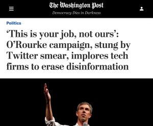](https://www.washingtonpost.com/politics/this-is-your-job-not-ours-orourke-campaign-stung-by-twitter-smear-implores-tech-firms-to-erase-disinformation/2019/09/06/f6db3992-d091-11e9-b29b-a528dc82154a_story.html)

[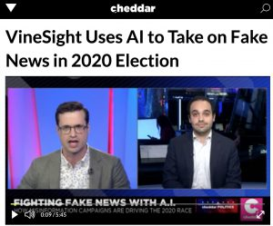](https://cheddar.com/media/vinesight-uses-ai-to-take-on-misinformation-amid-democratic-primary-race)

[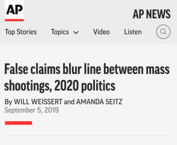](https://www.apnews.com/bd653f4eb5ed4f34b6c936221c35a3e5)

[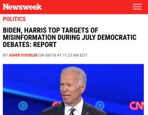](https://www.newsweek.com/biden-harris-misinformation-july-debates-1452812)

[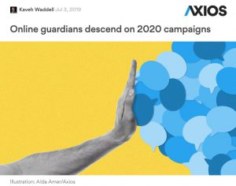](https://www.axios.com/online-guardians-descend-on-2020-campaigns-372fd89a-b665-4d5e-a961-44e6874823b5.html)

[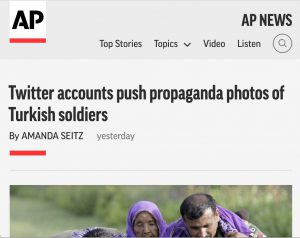](https://apnews.com/7df659c706d04242ac9175645e40a265)

### Recent Publications

[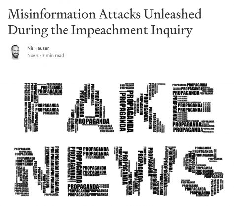](https://medium.com/@nir_69150/misinformation-attacks-unleashed-during-the-impeachment-inquiry-be1714b42071?source=friends_link&sk=d354a15e010978264afe3b01ee730dd2)

[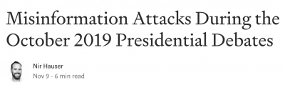](https://medium.com/@nir_69150/misinformation-attacks-during-the-october-2019-presidential-debates-506264d01c12?source=friends_link&sk=69ab5e2b6a2d92d2d527c29309ee2d71)

[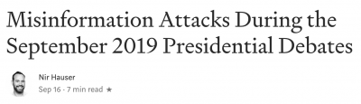](https://medium.com/swlh/misinformation-attacks-during-the-september-2019-presidential-debates-ec2a33b8698a?source=friends_link&sk=dc907e3f181f9787ad65a4ef78e896d3)

[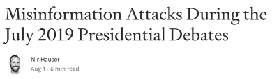](https://medium.com/@nir_69150/misinformation-attacks-during-the-july-2019-presidential-debates-3c4a209ccfbf?source=friends_link&sk=b75dd499f73679056cdd88e915c9cd66)

[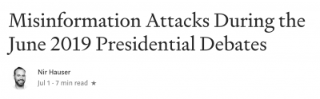](https://medium.com/@nir_69150/the-fake-news-landscape-of-the-june-2019-presidential-debates-6303c773f20a?source=friends_link&sk=5de0c7c743e35a65ecc17204f8031600)

### Who We Are

OUR FOUNDING TEAM

##### Gideon Blocq

Chief Executive Officer

##### Nir Hauser

Chief Technology Officer
[(L)](https://www.linkedin.com/in/nir-hauser-16bb641/)

##### Yoel Grinshpon

Vice President for Research

## TECHNION DRIVE ACCELERATOR

VineSight has been selected to participate in the prestigious Technion DRIVE Accelerator program

[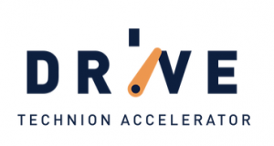](https://www.techniondrive.com/)

#### Need Help Fighting Misinformation? Contact Us:

[info@vinesight.com](https://www.vinesight.com/mailto:info@vinesight.com)
[@VineSightdotcom](https://twitter.com/vinesightdotcom)

© Copyright 2019. All Rights Reserved, VineSight.com

[**](https://www.vinesight.com/mailto:info@vinesight.com)[**](https://twitter.com/vinesightdotcom)[**](https://www.facebook.com/vinesightdotcom)[**](https://www.linkedin.com/company/vinesight)