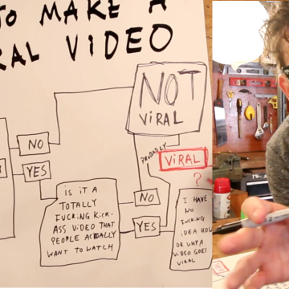

Viral Marketing

Viral Marketing

https://www.rockstarcoders.com/viral-marketing/

Viral Marketing by Nathan Kontny Running a previous business, I needed a way to generate a lot more press. More traffic. More awareness. More eyeballs. I needed a viral hit. But viral content is hard, complicated and unpredictable. We all know that. Casey Neistat, filmmaker, entrepreneur, and YouTuber who has some of the most success creating viral videos, essentially says that in his video My Viral Video SECRETS . I've watched Casey's videos. Maybe more than most. I've even just now finished another rewatching of his entire "daily vlog" from start to finish for at least the third time. My 4 year old daughter, Addison, has been asking to watch Casey videos while we brush her teeth since she was able to start talking. Her favorite being Bike Lanes where he dutifully rides his bike in New York City's bike lanes without waver, only to crash repeatedly into obstruction after obstruction.