Visual Information Theory -- colah's blog

# Visual Information Theory

Posted on October 14, 2015

I love the feeling of having a new way to think about the world. I especially love when there’s some vague idea that gets formalized into a concrete concept. Information theory is a prime example of this.

Information theory gives us precise language for describing a lot of things. How uncertain am I? How much does knowing the answer to question A tell me about the answer to question B? How similar is one set of beliefs to another? I’ve had informal versions of these ideas since I was a young child, but information theory crystallizes them into precise, powerful ideas. These ideas have an enormous variety of applications, from the compression of data, to quantum physics, to machine learning, and vast fields in between.

Unfortunately, information theory can seem kind of intimidating. I don’t think there’s any reason it should be. In fact, many core ideas can be explained completely visually!

## Visualizing Probability Distributions

Before we dive into information theory, let’s think about how we can visualize simple probability distributions. We’ll need this later on, and it’s convenient to address now. As a bonus, these tricks for visualizing probability are pretty useful in and of themselves!

I’m in California. Sometimes it rains, but mostly there’s sun! Let’s say it’s sunny 75% of the time. It’s easy to make a picture of that:

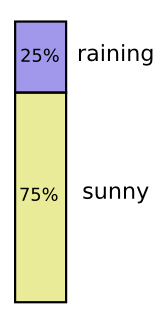

Most days, I wear a t-shirt, but some days I wear a coat. Let’s say I wear a coat 38% of the time. It’s also easy to make a picture for that!

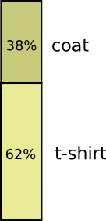

What if I want to visualize both at the same time? We’ll, it’s easy if they don’t interact – if they’re what we call independent. For example, whether I wear a t-shirt or a raincoat today doesn’t really interact with what the weather is next week. We can draw this by using one axis for one variable and one for the other:

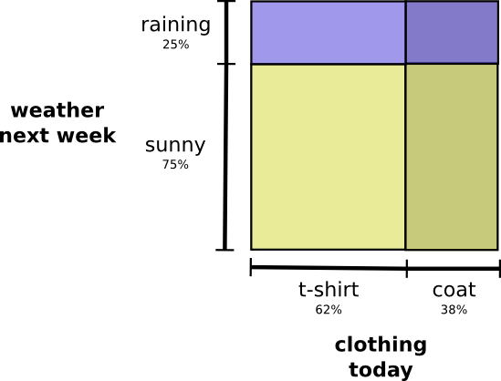

Notice the straight vertical and horizontal lines going all the way through. *That’s what independence looks like!*  [1](https://colah.github.io/posts/2015-09-Visual-Information/#fn1) The probability I’m wearing a coat doesn’t change in response to the fact that it will be raining in a week. In other words, the probability that I’m wearing a coat and that it will rain next week is just the probability that I’m wearing a coat, times the probability that it will rain. They don’t interact.

When variables interact, there’s extra probability for particular pairs of variables and missing probability for others. There’s extra probability that I’m wearing a coat and it’s raining because the variables are correlated, they make each other more likely. It’s more likely that I’m wearing a coat on a day that it rains than the probability I wear a coat on one day and it rains on some other random day.

Visually, this looks like some of the squares swelling with extra probability, and other squares shrinking because the pair of events is unlikely together:

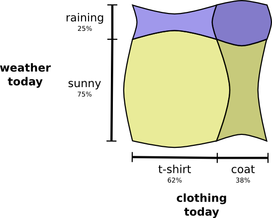

But while that might look kind of cool, it’s isn’t very useful for understanding what’s going on.

Instead, let’s focus on one variable like the weather. We know how probable it is that it’s sunny or raining. For both cases, we can look at the *conditional probabilities*. How likely am I to wear a t-shirt if it’s sunny? How likely am I to wear a coat if it’s raining?

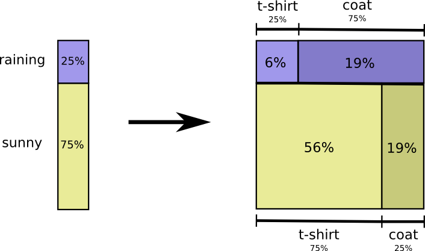

There’s a 25% chance that it’s raining. If it is raining, there’s a 75% chance that I’d wear a coat. So, the probability that it is raining and I’m wearing a coat is 25% times 75% which is approximately 19%. The probability that it’s raining and I’m wearing a coat is the probability that it is raining, times the probability that I’d wear a coat if it is raining. We write this:

p(rain,coat)=p(rain)⋅p(coat | rain)p(rain,coat)=p(rain)⋅p(coat | rain)

This is a single case of one of the most fundamental identities of probability theory:

p(x,y)=p(x)⋅p(y|x)p(x,y)=p(x)⋅p(y|x)

We’re *factoring* the distribution, breaking it down into the product of two pieces. First we look at the probability that one variable, like the weather, will take on a certain value. Then we look at the probability that another variable, like my clothing, will take on a certain value conditioned on the first variable.

The choice of which variable to start with is arbitrary. We could just as easily start by focusing on my clothing and then look at the weather conditioned on it. This might feel a bit less intuitive, because we understand that there’s a causal relationship of the weather influencing what I wear and not the other way around… but it still works!

Let’s go through an example. If we pick a random day, there’s a 38% chance that I’d be wearing a coat. If we know that I’m wearing a coat, how likely is it that it’s raining? Well, I’m more likely to wear a coat in the rain than in the sun, but rain is kind of rare in California, and so it works out that there’s a 50% chance that it’s raining. And so, the probability that it’s raining and I’m wearing a coat is the probability that I’m wearing a coat (38%), times the probability that it would be raining if I was wearing a coat (50%) which is approximately 19%.

p(rain,coat)=p(coat)⋅p(rain | coat)p(rain,coat)=p(coat)⋅p(rain | coat)

This gives us a second way to visualize the exact same probability distribution.

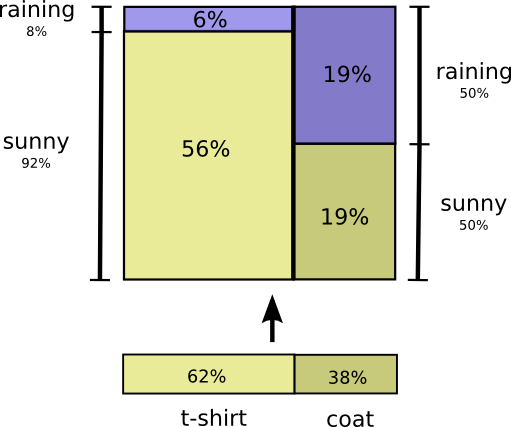

Note that the labels have slightly different meanings than in the previous diagram: t-shirt and coat are now *marginal probabilities*, the probability of me wearing that clothing without consideration of the weather. On the other hand, there are now two rain and sunny labels, for the probabilities of them conditional on me wearing a t-shirt and me wearing a coat respectively.

(You may have heard of Bayes’ Theorem. If you want, you can think of it as the way to translate between these two different ways of displaying the probability distribution!)

## Aside: Simpson’s Paradox

Are these tricks for visualizing probability distributions actually helpful? I think they are! It will be a little while before we use them for visualizing information theory, so I’d like to go on a little tangent and use them to explore Simpson’s paradox. Simpson’s paradox is an extremely unintuitive statistical situation. It’s just really hard to understand at an intuitive level. Michael Nielsen wrote a lovely essay, [Reinventing Explanation](http://michaelnielsen.org/reinventing_explanation/), which explored different ways to explain it. I’d like to try and take my own shot at it, using the tricks we developed in the previous section.

Two treatments for kidney stones are tested. Half the patients are given treatment A while the other half are given treatment B. The patients who received treatment B were more likely to survive than those who received treatment A.

However, patients with small kidney stones were more likely to survive if they took treatment A. Patients with large kidney stones were also more likely to survive if they took treatment A! how can this be?

The core of the issue is that the study wasn’t properly randomized. The patients who received treatment A were likely to have large kidney stones, while the patients who received treatment B were more likely to have small kidney stones.

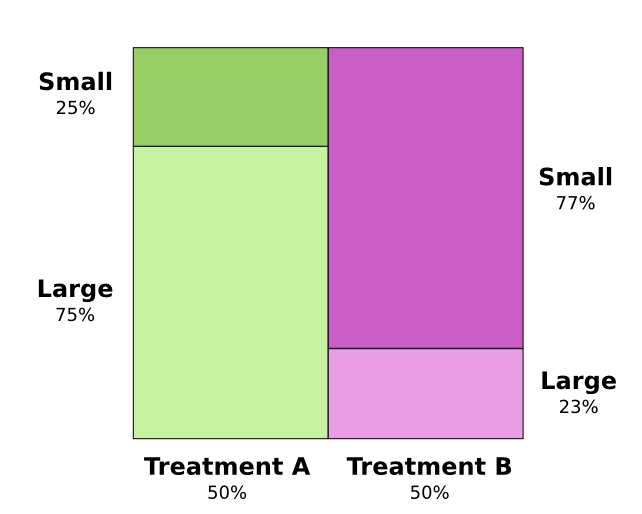

As it turns out, patients with small kidney stones are much more likely to survive in general.

To understand this better, we can combine the two previous diagrams. The result is a 3-dimensional diagram with the survival rate split apart for small and large kidney stones.

We can now *see* that in both the small case and the large case, Treatment A beats Treatment B. Treatment B only seemed better because the patients it was applied to were more likely to survive in the first place!

## Codes

Now that we have ways of visualizing probability, we can dive into information theory.

Let me tell you about my imaginary friend, Bob. Bob really likes animals. He constantly talks about animals. In fact, he only ever says four words: “dog”, “cat”, “fish” and “bird”.

A couple weeks ago, despite being a figment of my imagination, Bob moved to Australia. Further, he decided he only wanted to communicate in binary. All my (imaginary) messages from Bob look like this:

To communicate, Bob and I have to establish a code, a way of mapping words into sequences of bits.

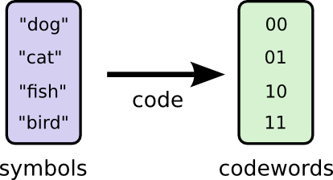

To send a message, Bob replaces each symbol (word) with the corresponding codeword, and then concatenates them together to form the encoded string.

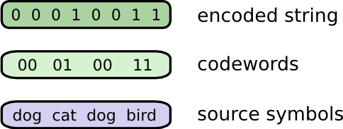

## Variable-Length Codes

Unfortunately, communication services in imaginary-Australia are expensive. I have to pay $5 per bit of every message I receive from Bob. Have I mentioned that Bob likes to talk a lot? To prevent me from going bankrupt, Bob and I decided we should investigate whether there was some way we could make our average message length shorter.

As it turns out Bob doesn’t say all words equally often. Bob really likes dogs. He talks about dogs all the time. On occasion, he’ll talk about other animals – especially the cat his dog likes to chase – but mostly he talks about dogs. Here’s a graph of his word frequency:

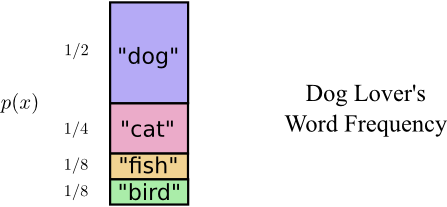

That seems promising. Our old code uses codewords that are 2 bits long, regardless of how common they are.

There’s a nice way to visualize this. In the following diagram, we use the vertical axis to visualize the probability of each word, p(x)p(x), and the horizontal axis to visualize the length of the corresponding codeword, L(x)L(x). Notice that the area is the average length of a codeword we send – in this case 2 bits.

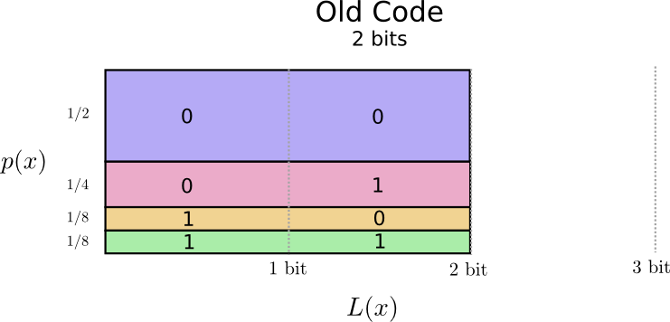

Perhaps we could be very clever and make a variable-length code where codewords for common words are made especially short. The challenge is that there’s competition between codewords – making some shorter forces us to make others longer. To minimize the message length, we’d ideally like all codewords to be short, but we especially want the commonly used ones to be. So the resulting code has shorter codewords for common words (like “dog”) and longer codewords for less common words (like “bird”).

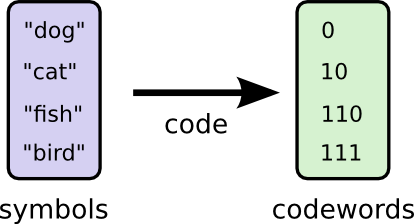

Let’s visualize this again. Notice that the most common codeword became shorter, even as the uncommon ones became longer. The result was, on net, a smaller amount of area. This corresponds to a smaller expected codeword length. On average, the length of a codeword is now 1.75 bits!

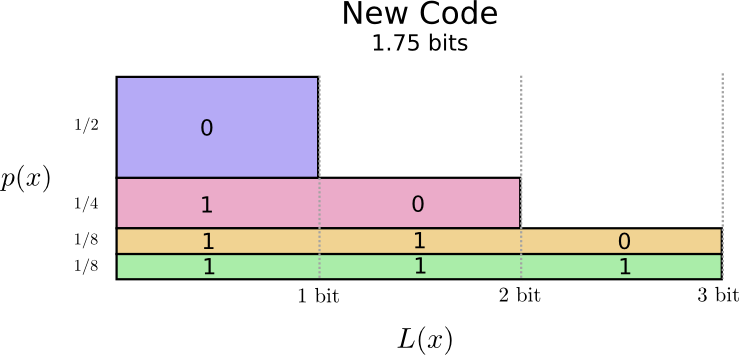

(You may wonder: why not use 1 by itself as a codeword? Sadly, this would cause ambiguity when we decode encoded strings. We’ll talk about this more shortly.)

It turns out that this code is the best possible code. There is no code which, for this distribution, will give us an average codeword length of less than 1.75 bits.

There is simply a fundamental limit. Communicating what word was said, what event from this distribution occurred, requires us to communicate at least 1.75 bits on average. No matter how clever our code, it’s impossible to get the average message length to be less. We call this fundamental limit the entropy of the distribution – we’ll discuss it in much more detail shortly.

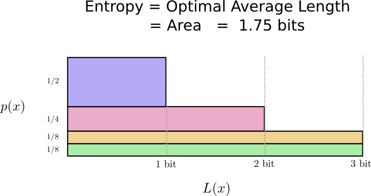

If we want to understand this limit, the crux of the matter is understanding the trade off between making some codewords short and others long. Once we understand that, we’ll be able to understand what the best possible codes are like.

## The Space of Codewords

There are two codes with a length of 1 bit: 0 and 1. There are four codes with a length of 2 bits: 00, 01, 10, and 11. Every bit you add on doubles the number of possible codes.

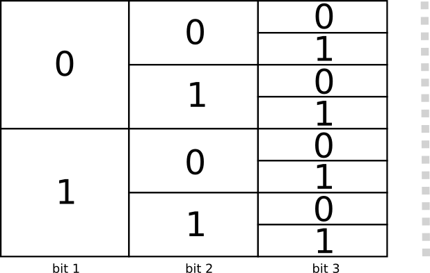

We’re interested in variable-length codes, where some codewords are longer than others. We might have simple situations where we have eight codewords that are 3 bits long. We might also have more complicated mixtures, like two codewords of length 2, and four codewords of length 3. What decides how many codewords we can have of different lengths?

Recall that Bob turns his messages into encoded strings by replacing each word with its codeword and concatenating them.

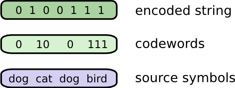

There’s a slightly subtle issue one needs to be careful of, when crafting a variable length code. How do we split the encoded string back into the codewords? When all the codewords are the same length, it’s easy – just split the string every couple of steps. But since there are codewords of different lengths, we need to actually pay attention to the content.

We really want our code to be uniquely decodable, with only one way to decode an encoded string. We never want it to be ambiguous which codewords make up the encoded string. If we had some special “end of codeword” symbol, this would be easy.[2](https://colah.github.io/posts/2015-09-Visual-Information/#fn2) But we don’t – we’re only sending 0s and 1s. We need to be able to look at a sequence of concatenated codewords and tell where each one stops.

It’s very possible to make codes that aren’t uniquely decodable. For example, imagine that 0 and 01 were both codewords. Then it would be unclear what the first codeword of the encoded string 0100111 is – it could be either! The property we want is that if we see a particular codeword, there shouldn’t be some longer version that is also a codeword. Another way of putting this is that no codeword should be the prefix of another codeword. This is called the prefix property, and codes that obey it are called prefix codes.

One useful way to think about this is that every codeword requires a sacrifice from the space of possible codewords. If we take the codeword 01, we lose the ability to use any codewords it’s a prefix of. We can’t use 010 or 011010110 anymore because of ambiguity – they’re lost to us.

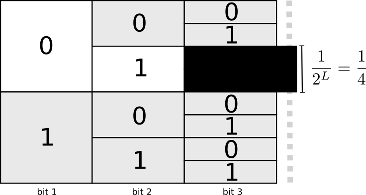

Since a quarter of all codewords start with 01, we’ve sacrificed a quarter of all possible codewords. That’s the price we pay in exchange for having one codeword that’s only 2 bits long! In turn this sacrifice means that all the other codewords need to be a bit longer. There’s always this sort of trade off between the lengths of the different codewords. A short codeword requires you to sacrifice more of the space of possible codewords, preventing other codewords from being short. What we need to figure out is what the right trade off to make is!

## Optimal Encodings

You can think of this like having a limited budget to spend on getting short codewords. We pay for one codeword by sacrificing a fraction of possible codewords.

The cost of buying a codeword of length 0 is 1, all possible codewords – if you want to have a codeword of length 0, you can’t have any other codeword. The cost of a codeword of length 1, like “0”, is 1/2 because half of possible codewords start with “0”. The cost of a codeword of length 2, like “01”, is 1/4 because a quarter of all possible codewords start with “01”. In general, the cost of codewords decreases *exponentially* with the length of the codeword.

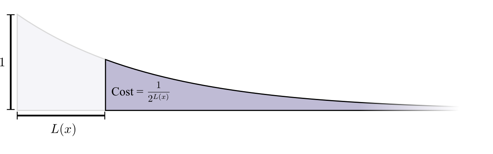

Note that if the cost decays as a (natural) exponential, it is both the height and the area

We want short codewords because we want short average message lengths. Each codeword makes the average message length longer by its probability times the length of the codeword. For example, if we need to send a codeword that is 4 bits long 50% of the time, our average message length is 2 bits longer than it would be if we weren’t sending that codeword. We can picture this as a rectangle.

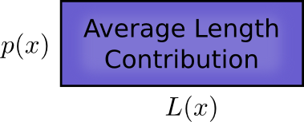

These two values are related by the length of the codeword. The amount we pay decides the length of the codeword. The length of the codeword controls how much it adds to the average message length. We can picture the two of these together, like so.

Short codewords reduce the average message length but are expensive, while long codewords increase the average message length but are cheap.

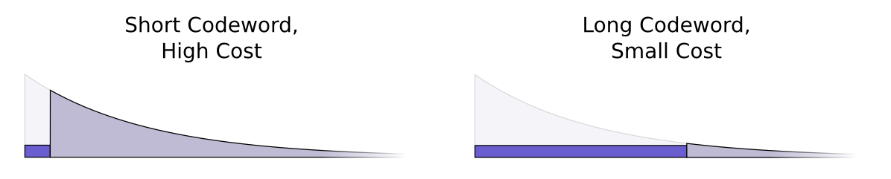

What’s the best way to use our limited budget? How much should we spend on the codeword for each event?

Just like one wants to invest more in tools that one uses regularly, we want to spend more on frequently used codewords. There’s one particularly natural way to do this: distribute our budget in proportion to how common an event is. So, if one event happens 50% of the time, we spend 50% of our budget buying a short codeword for it. But if an event only happens 1% of the time, we only spend 1% of our budget, because we don’t care very much if the codeword is long.

That’s a pretty natural thing to do, but is it the optimal thing to do? It is, and I’ll prove it!

*The following proof is visual and should be accessible, but will take work to get through and is definitely the hardest part of this essay. Readers should feel free to skip to accept this as a given and jump to the next section.*

Let’s picture a concrete example where we need to communicate which of two possible events happened. Event aa happens p(a)p(a) of the time and event bb happens p(b)p(b) of the time. We distribute our budget in the natural way described above, spending p(a)p(a) of our budget on getting aa a short codeword, and p(b)p(b) on getting bb a short codeword.

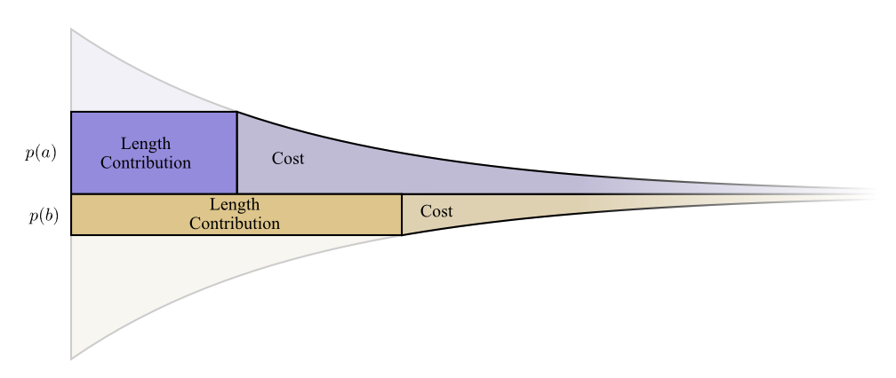

The cost and length contribution boundaries nicely line up. Does that mean anything?

Well, consider what happens to the cost and the length contribution if we slightly change the length of the codeword. If we slightly increase the length of the codeword, the message length contribution will increase in proportion to its height at the boundary, while the cost will decrease in proportion to its height at the boundary.

So, the cost to make the codeword for aa shorter is p(a)p(a). At the same time, we don’t care about the length of each codeword equally, we care about them in proportion to how much we have to use them. In the case of aa, that is p(a)p(a). The benefit to us of making the codeword for aa a bit shorter is p(a)p(a).

It’s interesting that both derivatives are the same. It means that our initial budget has the interesting property that, if you had a bit more to spend, it would be equally good to invest in making any codeword shorter. What we really care about, in the end, is the benefit/cost ratio – that’s what decides what we should invest more in. In this case, the ratio is p(a)p(a)p(a)p(a), which is equal to one. This is independent of the value of p(a)p(a) – it’s always one. And we can apply the same argument to other events. The benefit/cost is always one, so it makes equal sense to invest a bit more in any of them.

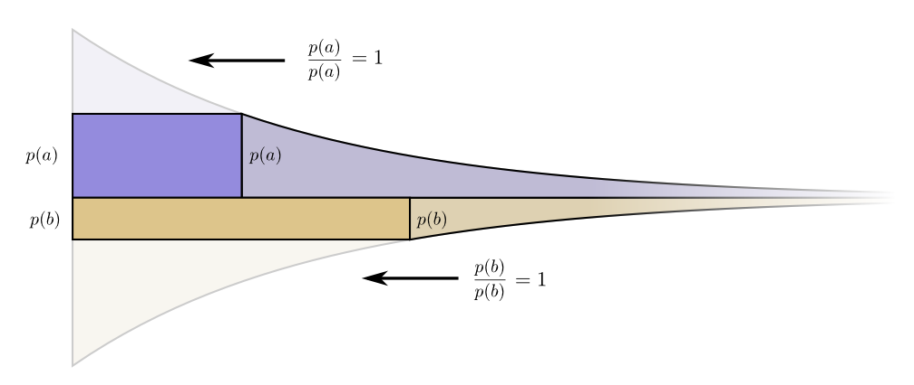

Infinitesimally, it doesn’t make sense to change the budget. But that isn’t a proof that it’s the best budget. To prove that, we’ll consider a different budget, where we spend a bit extra on one codeword at the expense of another. We’ll invest ϵϵ less in bb, and invest it in aa instead. This makes the codeword for aa a bit shorter, and the codeword for bb a bit longer.

Now the cost of buying a shorter codeword for aa is p(a)+ϵp(a)+ϵ, and the cost of buying a shorter codeword for bb is p(b)−ϵp(b)−ϵ. But the benefits are still the same. This leads the benefit cost ratio for buying aa to be p(a)p(a)+ϵp(a)p(a)+ϵ which is less than one. On the other hand, the benefit cost ratio of buying bb is p(b)p(b)−ϵp(b)p(b)−ϵ which is greater than one.

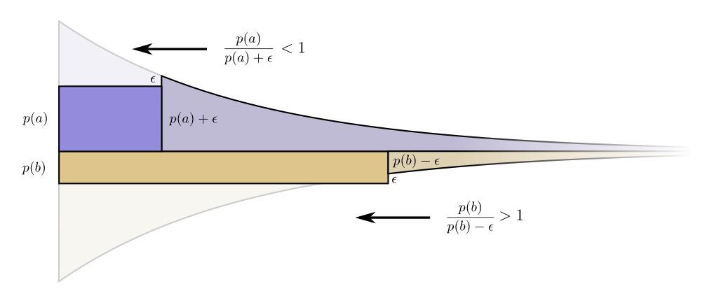

The prices are no longer balanced. bb is a better deal than aa. The investors scream: “Buy bb! Sell aa!” We do this, and end back at our original budget plan. All budgets can be improved by shifting towards our original plan.

The original budget – investing in each codeword in proportion to how often we use it – wasn’t just the natural thing to do, it was the optimal thing to do. (While this proof only works for two codewords, it easily generalizes to more.)

(A careful reader may have noticed that it is possible for our optimal budget to suggest codes where codewords have fractional lengths. That seems pretty concerning! What does it mean? Well, of course, in practice, if you want to communicate by sending a single codeword, you have to round. But as we’ll see later, there’s a very real sense in which it is possible to send fractional codewords when we send many at a time! I’ll ask you be patient with me on this for now!)

## Calculating Entropy

Recall that the cost of a message of length LL is 12L12L. We can invert this to get the length of a message that costs a given amount: log2(1cost)log2⁡(1cost). Since we spend p(x)p(x) on a codeword for xx, the length is log2(1p(x))log2⁡(1p(x)). Those are the best choices of lengths.

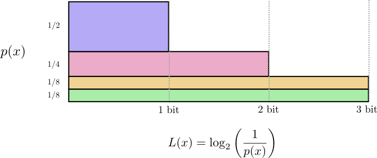

Earlier, we discussed how there is a fundamental limit to how short one can get the average message to communicate events from a particular probability distribution, pp. This limit, the average message length using the best possible code, is called the entropy of pp, H(p)H(p). Now that we know the optimal lengths of the codewords, we can actually calculate it!

H(p)=∑xp(x)log2(1p(x))H(p)=∑xp(x)log2⁡(1p(x))

*(People often write entropy as H(p)=−∑p(x)log2(p(x))H(p)=−∑p(x)log2⁡(p(x)) using the identity log(1/a)=−log(a)log⁡(1/a)=−log⁡(a). I think the first version is more intuitive, and will continue to use it in this essay.)*

No matter what I do, on average I need to send at least that number of bits if I want to communicate which event occurred.

The average amount of information needed to communicate something has clear implications for compression. But are there other reasons we should care about it? Yes! It describes how uncertain I am and gives a way to quantify information.

If I knew for sure what was going to happen, I wouldn’t have to send a message at all! If there’s two things that could happen with 50% probability, I only need to send 1 bit. But if there’s 64 different things that could happen with equal probability, I’d have to send 6 bits. The more concentrated the probability, the more I can craft a clever code with short average messages. The more diffuse the probability, the longer my messages have to be.

The more uncertain the outcome, the more I learn, on average, when I find out what happened.

## Cross-Entropy

Shortly before his move to Australia, Bob married Alice, another figment of my imagination. To the surprise of myself, and also the other characters in my head, Alice was not a dog lover. She was a cat lover. Despite this, the two of them were able to find common ground in their shared obsession with animals and very limited vocabulary size.

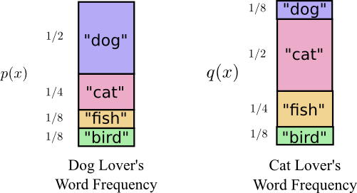

The two of them say the same words, just at different frequencies. Bob talks about dogs all the time, Alice talks about cats all the time.

Initially, Alice sent me messages using Bob’s code. Unfortunately, her messages were longer than they needed to be. Bob’s code was optimized to his probability distribution. Alice has a different probability distribution, and the code is suboptimal for it. While the average length of a codeword when Bob uses his own code is 1.75 bits, when Alice uses his code it's 2.25. It would be worse if the two weren’t so similar!

This length – the average length of communicating an event from one distribution with the optimal code for another distribution – is called the cross-entropy. Formally, we can define cross-entropy as:[4](https://colah.github.io/posts/2015-09-Visual-Information/#fn4)

Hp(q)=∑xq(x)log2(1p(x))Hp(q)=∑xq(x)log2⁡(1p(x))

In this case, it’s the cross-entropy of Alice the cat-lovers word frequency with respect to the Bob the dog-lovers word frequency.

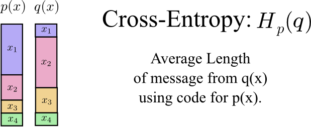

To keep the cost of our communications down, I asked Alice to use her own code. To my relief, this pushed down her average message length. But it introduced a new problem: sometimes Bob would accidentally use Alice’s code. Surprisingly, it’s worse for Bob to accidentally use Alice's code than for Alice to use his!

So, now we have four possibilities:

- Bob using his own code (H(p)=1.75 bits)(H(p)=1.75 bits)
- Alice using Bob’s code (Hp(q)=2.25 bits)(Hp(q)=2.25 bits)
- Alice using her own code (H(q)=1.75 bits)(H(q)=1.75 bits)
- Bob using Alice’s code (Hq(p)=2.375 bits)(Hq(p)=2.375 bits)

This isn’t necessarily as intuitive as one might think. For example, we can see that Hp(q)≠Hq(p)Hp(q)≠Hq(p). Is there some way we can see how these four values relate to each other?

In the following diagram, each subplot represents one of these 4 possibilities. Each subplot visualizes average message length the same way our previous diagrams did. They are organized in a square, so that if the messages are coming from the same distribution the plots are beside each other, and if they use the same codes they are on top of each other. This allows you to kind of visually slide the distributions and codes together.

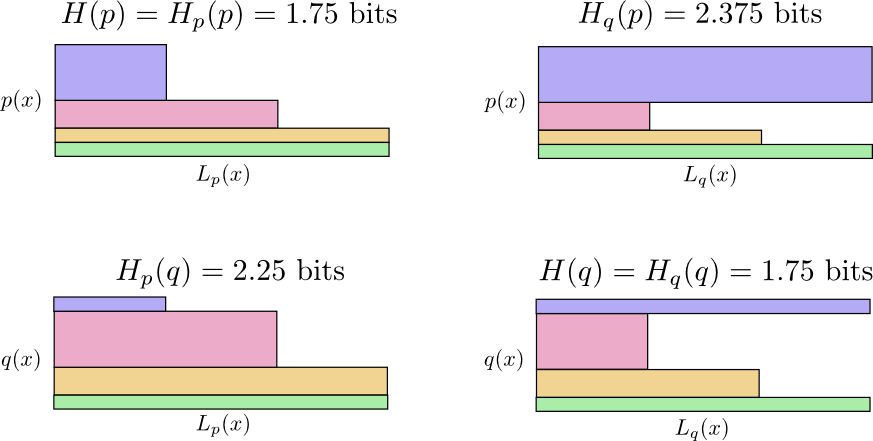

Can you see why Hp(q)≠Hq(p)Hp(q)≠Hq(p)? Hq(p)Hq(p) is large because there is an event (blue) which is very common under pp but gets a long code because it is very uncommon under qq. On the other hand, common events under qq are less common under pp, but the difference is less drastic, so Hp(q)Hp(q) isn’t as high.

Cross-entropy isn’t symmetric.

So, why should you care about cross-entropy? Well, cross-entropy gives us a way to express how different two probability distributions are. The more different the distributions pp and qq are, the more the cross-entropy of pp with respect to qq will be bigger than the entropy of pp.

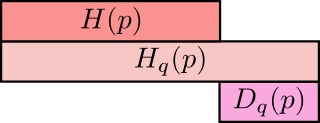

Similarly, the more different pp is from qq, the more the cross-entropy of qq with respect to pp will be bigger than the entropy of qq.

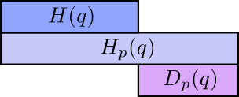

The really interesting thing is the difference between the entropy and the cross-entropy. That difference is how much longer our messages are because we used a code optimized for a different distribution. If the distributions are the same, this difference will be zero. As the difference grows, it will get bigger.

We call this difference the Kullback–Leibler divergence, or just the KL divergence. The KL divergence of pp with respect to qq, Dq(p)Dq(p),[5](https://colah.github.io/posts/2015-09-Visual-Information/#fn5) is defined:[6](https://colah.github.io/posts/2015-09-Visual-Information/#fn6)

Dq(p)=Hq(p)−H(p)Dq(p)=Hq(p)−H(p)

The really neat thing about KL divergence is that it’s like a distance between two distributions. It measures how different they are! (If you take that idea seriously, you end up with information geometry.)

Cross-Entropy and KL divergence are incredibly useful in machine learning. Often, we want one distribution to be close to another. For example, we might want a predicted distribution to be close to the ground truth. KL divergence gives us a natural way to do this, and so it shows up everywhere.

## Entropy and Multiple Variables

Let’s return to our weather and clothing example from earlier:
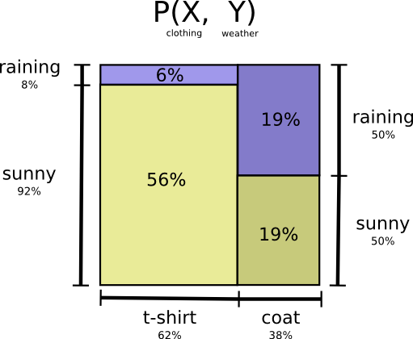

My mother, like many parents, sometimes worries that I don’t dress appropriately for the weather. (She has reasonable cause for suspicion – I have often failed to wear coats in winter.) So, she often wants to know both the weather and what clothing I’m wearing. How many bits do I have to send her to communicate this?

Well, the easy way to think about this is to flatten the probability distribution:

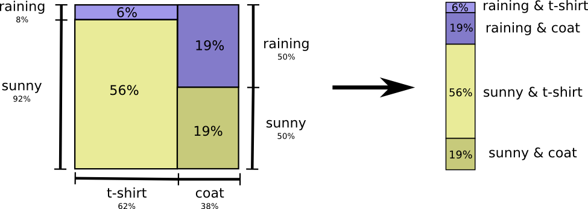

Now we can figure out the optimal codewords for events of these probabilities and compute the average message length:

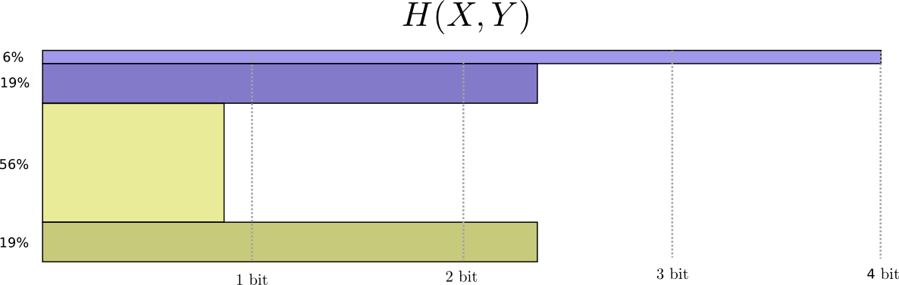
We call this the joint entropy of XX and YY, defined
H(X,Y)=∑x,yp(x,y)log2(1p(x,y))H(X,Y)=∑x,yp(x,y)log2⁡(1p(x,y))

This is the exact same as our normal definition, except with two variables instead of one.

A slightly nicer way to think about this is to avoid flattening the distribution, and just think of the code lengths as a third dimension. Now the entropy is the volume!

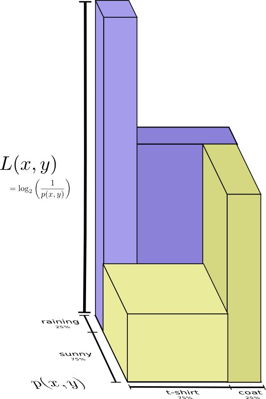

But suppose my mom already knows the weather. She can check it on the news. Now how much information do I need to provide?

It seems like I need to send however much information I need to communicate the clothes I’m wearing. But I actually need to send less, because the weather strongly implies what clothing I’ll wear! Let’s consider the case where it’s raining and where it’s sunny separately.

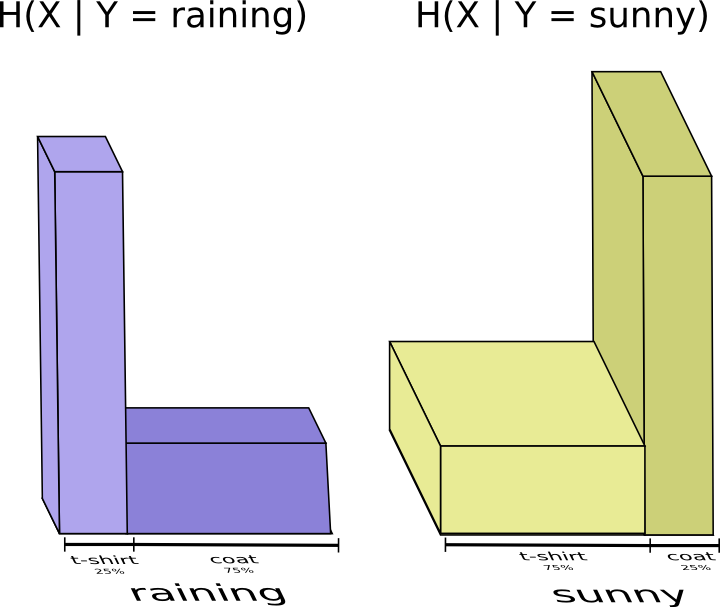

In both cases, I don’t need to send very much information on average, because the weather gives me a good guess at what the right answer will be. When it’s sunny, I can use a special sunny-optimized code, and when it’s raining I can use a raining optimized code. In both cases, I send less information than if I used a generic code for both. To get the average amount of information I need to send my mother, I just put these two cases together…

We call this the conditional entropy. If you formalize it into an equation, you get:

H(X|Y)=∑yp(y)∑xp(x|y)log2(1p(x|y))H(X|Y)=∑yp(y)∑xp(x|y)log2⁡(1p(x|y))

    =∑x,yp(x,y)log2(1p(x|y))    =∑x,yp(x,y)log2⁡(1p(x|y))

## Mutual Information

In the previous section, we observed that knowing one variable can mean that communicating another variable requires less information.

One nice way to think about this is to imagine amounts of information as bars. These bars overlap if there’s shared information between them. For example, some of the information in XX and YY is shared between them, so H(X)H(X) and H(Y)H(Y) are overlapping bars. And since H(X,Y)H(X,Y) is the information in both, it’s the union of the bars H(X)H(X) and H(Y)H(Y).[7](https://colah.github.io/posts/2015-09-Visual-Information/#fn7)

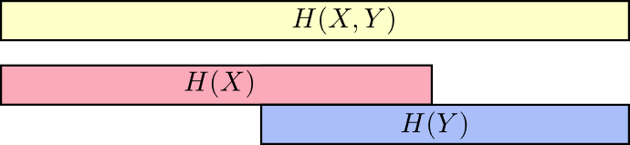
Once we think about things this way, a lot of things become easier to see.

For example, we previously noted it takes more information to communicate both XX and YY (the “joint entropy,” H(X,Y)H(X,Y)) than it takes to just communicate XX (the “marginal entropy,” H(X)H(X)). But if you already know YY, then it takes less information to communicate XX (the “conditional entropy,” H(X|Y)H(X|Y)) than it would if you didn’t!

That sounds a bit complicated, but it’s very simple when we think about it from the bar perspective. H(X|Y)H(X|Y) is the information we need to send to communicate XX to someone who already knows YY, the information in XX which isn’t also in YY. Visually, that means H(X|Y)H(X|Y) is the part of H(X)H(X) bar which doesn’t overlap with H(Y)H(Y).

You can now read the inequality H(X,Y)≥H(X)≥H(X|Y)H(X,Y)≥H(X)≥H(X|Y) right off the following diagram.

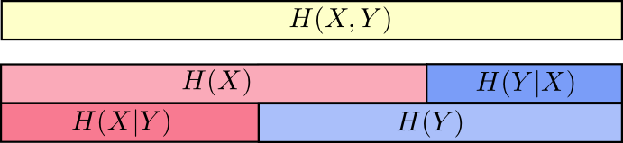

Another identity is that H(X,Y)=H(Y)+H(X|Y)H(X,Y)=H(Y)+H(X|Y). That is, the information in XX and YY is the information in YY plus the information in XX which is not in YY.

Again, it’s difficult to see in the equations, but easy to see if you’re thinking in terms of these overlapping bars of information.

At this point, we’ve broken the information in XX and YY up in several ways. We have the information in each variable, H(X)H(X) and H(Y)H(Y). We have the the union of the information in both, H(X,Y)H(X,Y). We have the information which is in one but not the other, H(X|Y)H(X|Y) and H(Y|X)H(Y|X). A lot of this seems to revolve around the information shared between the variables, the intersection of their information. We call this “mutual information,” I(X,Y)I(X,Y), defined as:[8](https://colah.github.io/posts/2015-09-Visual-Information/#fn8)

I(X,Y)=H(X)+H(Y)−H(X,Y)I(X,Y)=H(X)+H(Y)−H(X,Y)

This definition works because H(X)+H(Y)H(X)+H(Y) has two copies of the mutual information, since it’s in both XX and YY, while H(X,Y)H(X,Y) only has one. (Consider the previous bar diagram.)

Closely related to the mutual information is the variation of information. The variation of information is the information which isn’t shared between the variables. We can define it like so:

V(X,Y)=H(X,Y)−I(X,Y)V(X,Y)=H(X,Y)−I(X,Y)

Variation of information is interesting because it gives us a metric, a notion of distance, between different variables. The variation of information between two variables is zero if knowing the value of one tells you the value of the other and increases as they become more independent.

How does this relate to KL divergence, which also gave us a notion of distance? Well, KL divergence gives us a distance between two distributions over the same variable or set of variables. In contrast, variation of information gives us distance between two jointly distributed variables. KL divergence is between distributions, variation of information within a distribution.

We can bring this all together into a single diagram relating all these different kinds of information:

## Fractional Bits

A very unintuitive thing about information theory is that we can have fractional numbers of bits. That’s pretty weird. What does it mean to have half a bit?

Here’s the easy answer: often, we’re interested in the average length of a message rather than any particular message length. If half the time one sends a single bit, and half the time one sends two bits, on average one sends one and a half bits. There’s nothing strange about averages being fractional.

But that answer is really dodging the issue. Often, the optimal lengths of codewords are fractional. What do those mean?

To be concrete, let’s consider a probability distribution where one event, aa, happens 71% of the time and another event, bb, occurs 29% of the time.

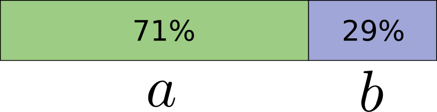

The optimal code would use 0.5 bits to represent aa, and 1.7 bits to represent bb. Well, if we want to send a single one of these codewords, it simply isn’t possible. We’re forced to round to a whole number of bits, and send on average 1 bit.

… But if we’re sending multiple messages at once, it turns out that we can do better. Let’s consider communicating two events from this distribution. If we sent them independently, we’d need to send two bits. Can we do better?

Half the time, we need to communicate aaaa, 21%21% of the time we need to send abab or baba, and 8%8% of the time we need to communicate bbbb. Again, the ideal code involves fractional numbers of bits.

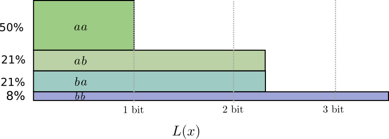
If we round the codeword lengths, we’ll get something like this:
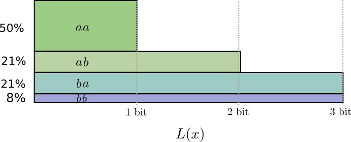

This codes give us an average message length of 1.8 bits. That’s less than the 2 bits when we send them independently. Another way of thinking of this is that we’re sending 0.9 bits on average for each event. If we were to send more events at once, it would become smaller still. As nn tends to infinity, the overhead due to rounding our code would vanish, and the number of bits per codeword would approach the entropy.

Further, notice that the ideal codeword length for aa was 0.5 bits, and the ideal codeword length for aaaa was 1 bit. Ideal codeword lengths add, even when they’re fractional! So, if we communicate a lot of events at once, the lengths will add.

There is a very real sense in which one can have fractional numbers of bits of information, even if actual codes can only use whole numbers.

(In practice, people use particular coding schemes which are efficient to different extents. [Huffman coding](https://en.wikipedia.org/wiki/Huffman_coding), which is basically the kind of code we've sketched out here, doesn't handle fractional bits very gracefully -- you have to group symbols, like we did above, or use more complicated tricks to approach the entropy limit. [Arithmetic coding](https://en.wikipedia.org/wiki/Arithmetic_coding) is a bit different, but elegantly handles fractional bits to be asymptotically optimal.)

## Conclusion

If we care about communicating in a minimum number of bits, these ideas are clearly fundamental. If we care about compressing data, information theory addresses the core questions and gives us the fundamentally right abstractions. But what if we don’t care – are they anything other than curiosities?

Ideas from information theory turn up in lots of contexts: machine learning, quantum physics, genetics, thermodynamics, and even gambling. Practitioners in these fields typically don’t care about information theory because they want to compress information. They care because it has a compelling connection to their field. Quantum entanglement can be described with entropy.[9](https://colah.github.io/posts/2015-09-Visual-Information/#fn9) Many results in statistical mechanics and thermodynamics can be derived by assuming maximum entropy about the things you don’t know.[10](https://colah.github.io/posts/2015-09-Visual-Information/#fn10) A gambler’s wins or losses are directly connected to KL divergence, in particular iterated setups.[11](https://colah.github.io/posts/2015-09-Visual-Information/#fn11)

Information theory turns up in all these places because it offers concrete, principled formalizations for many things we need to express. It gives us ways of measuring and expressing uncertainty, how different two sets of beliefs are, and how much an answer to one question tells us about others: how diffuse probability is, the distance between probability distributions, and how dependent two variables are. Are there alternative, similar ideas? Sure. But the ideas from information theory are clean, they have really nice properties, and a principled origin. In some cases, they’re precisely what you care about, and in other cases they’re a convenient proxy in a messy world.

Machine learning is what I know best, so let’s talk about that for a minute. A very common kind of task in machine learning is classification. Let’s say we want to look at a picture and predict whether it’s a picture of a dog or a cat. Our model might say something like “there’s a 80% chance this image is a dog, and a 20% chance it’s a cat.” Let’s say the correct answer is dog – how good or bad is it that we only said there was an 80% chance it was a dog? How much better would it have been to say 85%?

This is an important question because we need some notion of how good or bad our model is, in order to optimize it to do well. What should we optimize? The correct answer really depends on what we’re using the model for: Do we only care about whether the top guess was right, or do we care about how confident we are in the correct answer? How bad is it to be confidently wrong? There isn’t one right answer to this. And often it isn’t possible to know the right answer, because we don’t know how the model will be used in a precise enough way to formalize what we ultimately care about. The result is that there are situations where cross-entropy really is precisely what we care about, but that isn’t always the case. Much more often we don’t know exactly what we care about and cross-entropy is a really nice proxy.[12](https://colah.github.io/posts/2015-09-Visual-Information/#fn12)

Information gives us a powerful new framework for thinking about the world. Sometimes it perfectly fits the problem at hand; other times it’s not an exact fit, but still extremely useful. This essay has only scratched the surface of information theory – there are major topics, like error-correcting codes, that we haven’t touched at all – but I hope I’ve shown that information theory is a beautiful subject that doesn’t need to be intimidating.

*To help me become a better writer, please consider filling out this [feedback form](https://docs.google.com/forms/d/1zaMvi-yL04GEtS7RnGplZ9TDGO5965GLlDdd50y2zNI/viewform?usp=send_form).*

## Further Reading

Claude Shannon’s original paper on information theory, [A Mathematical Theory of Communication](http://worrydream.com/refs/Shannon%20-%20A%20Mathematical%20Theory%20of%20Communication.pdf), is remarkably accessible. (This seems to be a recurring pattern in early information theory papers. Was it the era? A lack of page limits? A culture emanating from Bell Labs?)

Cover & Thomas’ Elements of Information Theory seems to be the standard reference. I found it helpful.

## Acknowledgments

I’m very grateful to [Dan Mané](https://github.com/danmane), [David Andersen](https://www.cs.cmu.edu/~dga/), [Emma Pierson](http://obsessionwithregression.blogspot.com/) and Dario Amodei for taking time to give really incredibly detailed and extensive comments on this essay. I’m also grateful for the comments of [Michael Nielsen](http://michaelnielsen.org/), [Greg Corrado](http://research.google.com/pubs/GregCorrado.html), [Yoshua Bengio](http://www.iro.umontreal.ca/~bengioy/yoshua_en/index.html), [Aaron Courville](https://aaroncourville.wordpress.com/), [Nick Beckstead](http://www.nickbeckstead.com/), [Jon Shlens](http://research.google.com/pubs/JonathonShlens.html), Andrew Dai, [Christian Howard](http://research.google.com/pubs/ChristianHoward.html), and [Martin Wattenberg](http://www.bewitched.com/).

Thanks also to my first two neural network seminar series for acting as guinea pigs for these ideas.

Finally, thanks to the readers who caught errors and omissions. In particular, thanks to Connor Zwick, Kai Arulkumaran, Jonathan Heusser, Otavio Good, and an anonymous commenter.

* * *

#### More Posts

[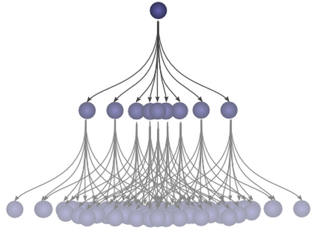### Understanding Convolutions](https://colah.github.io/posts/2014-07-Understanding-Convolutions/)

[(L)](https://colah.github.io/posts/2014-07-Understanding-Convolutions/)

[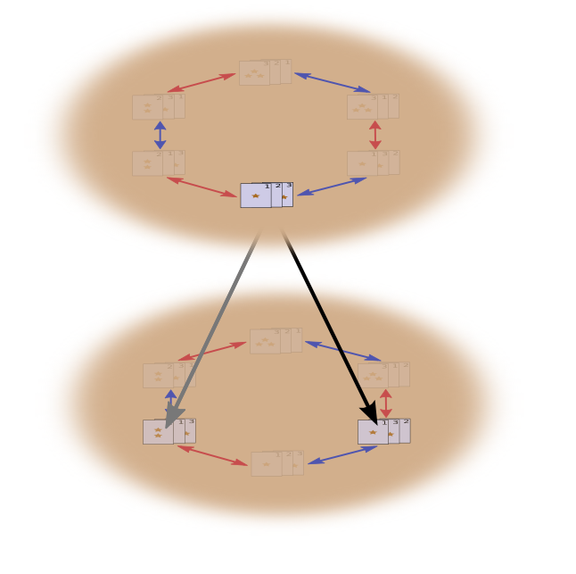### Groups & Group Convolutions](https://colah.github.io/posts/2014-12-Groups-Convolution/)

[(L)](https://colah.github.io/posts/2014-12-Groups-Convolution/)

[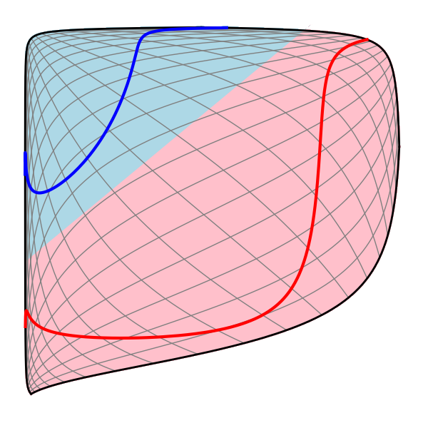### Neural Networks, Manifolds, and Topology](https://colah.github.io/posts/2014-03-NN-Manifolds-Topology/)

[(L)](https://colah.github.io/posts/2014-03-NN-Manifolds-Topology/)

[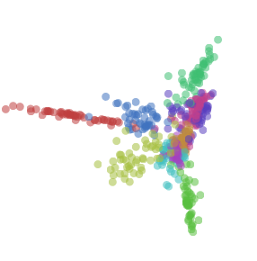### Visualizing Representations  #### Deep Learning and Human Beings](https://colah.github.io/posts/2015-01-Visualizing-Representations/)

[(L)](https://colah.github.io/posts/2015-01-Visualizing-Representations/)

* * *

1. It’s fun to use this to visualize naive Bayesian classifiers, which assume independence…[↩](https://colah.github.io/posts/2015-09-Visual-Information/#fnref1)

2. But horribly inefficient! If we have an extra symbol to use in our codes, only using it at the end of codewords like this would be a terrible waste.[↩](https://colah.github.io/posts/2015-09-Visual-Information/#fnref2)

3. I’m cheating a little here. I’ve been using an exponential of base 2 where this is not true, and am going to switch to a natural exponential. This saves us having a lot of log(2)log(2)s in our proof, and makes it visually a lot nicer.[↩](https://colah.github.io/posts/2015-09-Visual-Information/#fnref3)

4. Note that this notation for cross-entropy is non-standard. The normal notation is H(p,q)H(p,q). This notation is horrible for two reasons. Firstly, the exact same notation is also used for joint entropy. Secondly, it makes it seem like cross-entropy is symmetric. This is ridiculous, and I’ll be writing Hq(p)Hq(p) instead.[↩](https://colah.github.io/posts/2015-09-Visual-Information/#fnref4)

5. Also non-standard notation.[↩](https://colah.github.io/posts/2015-09-Visual-Information/#fnref5)

6. If you expand the definition of KL divergence, you get:
Dq(p)=∑xp(x)log2(p(x)q(x))Dq(p)=∑xp(x)log2⁡(p(x)q(x))

That might look a bit strange. How should we interpret it? Well, log2(p(x)q(x))log2⁡(p(x)q(x)) is just the difference between how many bits a code optimized for qq and a code optimized for pp would use to represent xx. The expression as a whole is the expected difference in how many bits the two codes would use.[↩](https://colah.github.io/posts/2015-09-Visual-Information/#fnref6)

7. This builds off the set interpretation of information theory layed out in Raymond W. Yeung’s paper [A New Outlook on Shannon’s Information Measures](http://www.cnd.mcgill.ca/~ivan/it_ineq_script/Raymond%20Yeung%20papers/A%20New%20Outlook%20on%20Shannon%E2%80%99s%20Information%20Measures%2000079902.pdf).[↩](https://colah.github.io/posts/2015-09-Visual-Information/#fnref7)

8. If you expand the definition of mutual information out, you get:
I(X,Y)=∑x,yp(x,y)log2(p(x,y)p(x)p(y))I(X,Y)=∑x,yp(x,y)log2⁡(p(x,y)p(x)p(y))
That looks suspiciously like KL divergence!

What’s going on? Well, it is KL divergence. It’s the KL divergence of P(X,Y) and its naive approximation P(X)P(Y). That is, it’s the number of bits you save representing XX and YY if you understand the relationship between them instead of assuming they’re independent.

One cute way to visualize this is to literally picture the ratio between a distribution and its naive approximation:

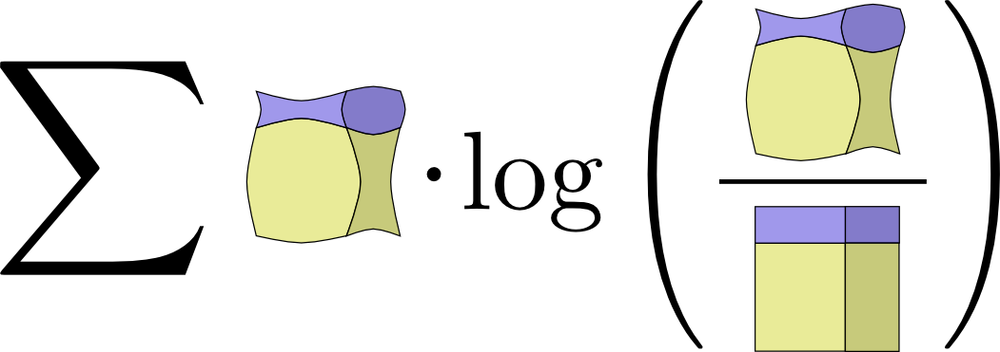
[↩](https://colah.github.io/posts/2015-09-Visual-Information/#fnref8)

9. There’s an entire field of quantum information theory. I know precisely nothing about the subject, but I’d bet with extremely high confidence, based on Michael’s other work, that Michael Nielsen and Issac Chuang’s *Quantum Computation and Quantum Information* is an excellent introduction.[↩](https://colah.github.io/posts/2015-09-Visual-Information/#fnref9)

10. As someone who knows nothing about statistical physics, I’ll very nervously try to sketch its connection to information theory as I understand it.

After Shannon discovered information theory, many noted suspicious similarities between equations in thermodynamics and equations in information theory. E.T. Jaynes found a very deep and principled connection. Suppose you have some system, and take some measurements like the pressure and temperature. How probable should you think a particular state of the system is? Jaynes suggested we should assume the probability distribution which, subject to the constraints of our measurement, maximizes the entropy. (Note that this “principle of maximum entropy” is much more general than physics!) That is, we should assume the possibility with the most unknown information. Many results can be derived from this perspective.

(Reading the first few sections of Jaynes’ papers ([part 1](http://bayes.wustl.edu/etj/articles/theory.1.pdf), [part 2](http://bayes.wustl.edu/etj/articles/theory.2.pdf)) I was impressed by how accessible they seem.)

If you’re interested in this connection but don’t want to work through the original papers, there’s a section in Cover & Thomas which derives a statistical version of the Second Law of Thermodynamics from Markov Chains

11. The connection between information theory and gambling was originally laid out by John Kelly in his paper ‘[A New Interpretation of Information Rate](http://www.princeton.edu/~wbialek/rome/refs/kelly_56.pdf).’ It’s a remarkably accessible paper, although it requires a few ideas we didn’t develop in this essay.

Kelly had an interesting motivation for his work. He noticed that entropy was being used in many cost functions which had no connection to encoding information and wanted some principled reason for it. In writing this essay, I’ve been troubled by the same thing, and have really appreciated Kelly’s work as an additional perspective. That said, I don’t find it completely convincing: Kelly only winds up with entropy because he considers iterated betting where one reinvests all their capital each bet. Different setups do not lead to entropy.

A nice discussion of Kelly’s connection between betting and information theory can be found in the standard reference on information theory, Cover & Thomas’ ‘Elements of Information Theory.’[↩](https://colah.github.io/posts/2015-09-Visual-Information/#fnref11)

12. It doesn’t resolve the issue, but I can’t resist offering a small further defense of KL divergence.

There’s a result which Cover & Thomas call Stein’s Lemma, although it seems unrelated to the result generally called Stein’s Lemma. At a high level, it goes like this:

Suppose you have some data which you know comes from one of two probability distributions. How confidently can you determine which of the two distributions it came from? In general, as you get more data points, your confidence should increase exponentially. For example, on average you might become 1.5 times as confident about which distribution is the truth for every data point you see.

How much your confidence gets multiplied depends on how different the distributions are. If they are very different, you might very quickly become confident. But if they’re only very slightly different, you might need to see lots of data before you have even a mildly confident answer.

Stein’s Lemma says, roughly, that the amount you multiply by is controlled by the KL divergence. (There’s some subtlety about the trade off between false-positives and false-negatives.) This seems like a really good reason to care about KL divergence

## [3 Comments](https://colah.github.io/posts/2015-09-Visual-Information/#disqus_thread)