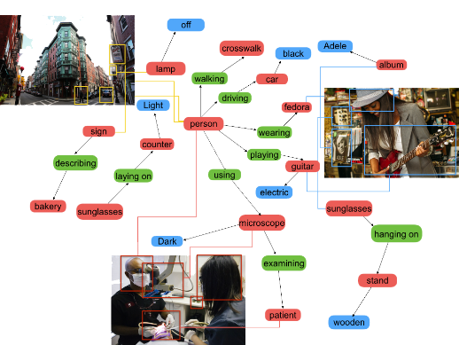

VisualGenome

 

Visual Genome is a dataset, a knowledge base, an ongoing effort to connect structured image concepts to language.

   Explore our data:  

 [throwing frisbee](https://visualgenome.org/VGViz/explore?query=throwing%20frisbee)[,]()  [helping](https://visualgenome.org/VGViz/explore?query=helping)[,]()  [angry](https://visualgenome.org/VGViz/explore?query=angry)

108,077 Images

5.4 Million Region Descriptions

1.7 Million Visual Question Answers

3.8 Million Object Instances

2.8 Million Attributes

2.3 Million Relationships

Everything Mapped to Wordnet Synsets

[Read](https://visualgenome.org/static/paper/Visual_Genome.pdf) our paper.