Visualizing Naive Bayes Theorem – Towards Data Science

# Visualizing Naive Bayes Theorem

## Bayesian Theorem visualized though Venn, Tree and Pie diagrams

[Hugegene](https://towardsdatascience.com/@eugene.chian)

May 4·5 min read

Ever needed to memorise the Bayesian Theorem formula? Visualise Bayesian Theorem through Venn diagram and do not need to memorise it again.

From the Venn diagram below, the probability that a randomly picked student is a girl in a class of 100, **P(Girl) **is the proportion of girls among 100 students:

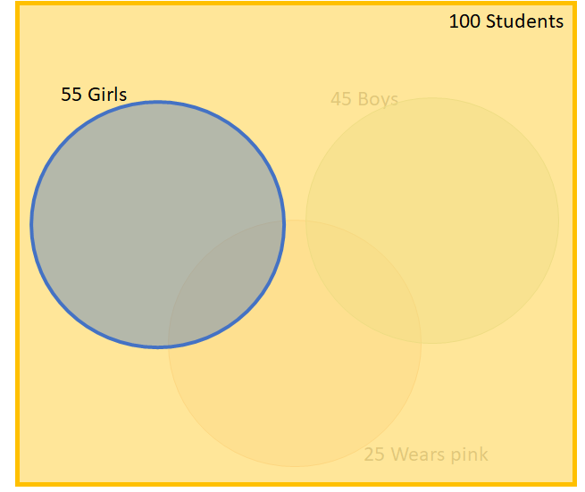

The conditional probability of she wears pink given that the student is a girl, **P(Wearing pink| Girls)** is the proportion who wear pink among all girls:

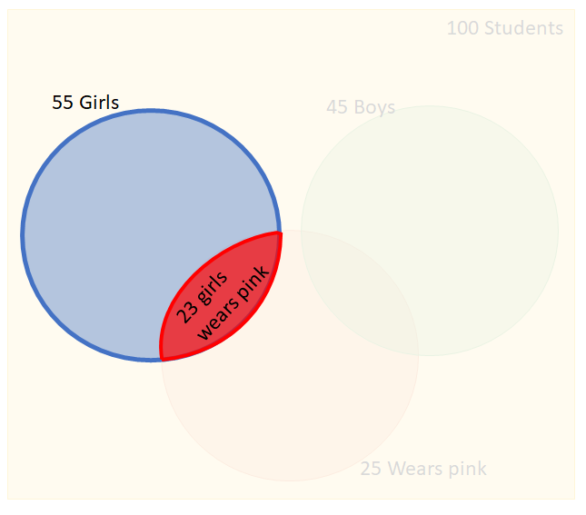

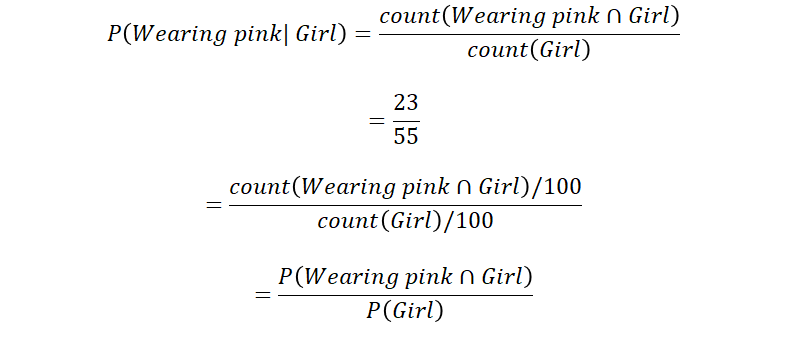

The probability that the student is a girl and she wears pink, P(Wearing pink ∩ Girl) or **P(Girl ∩ Wearing pink)** is the proportion of girls and wear pink among 100 students:

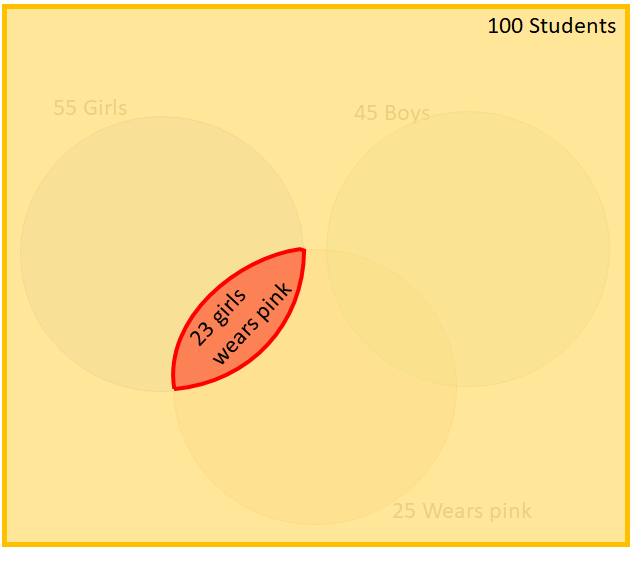

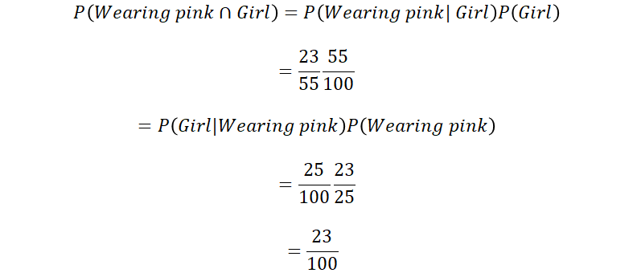

Hence, the conditional probability of the student is a girl given that the student is wearing pink, **P(Girls|Wearing pink)** is the proportion of girls among all that wear pink and can be found by dividing the intersection by the probability of Wearing pink, P(Wearing pink):

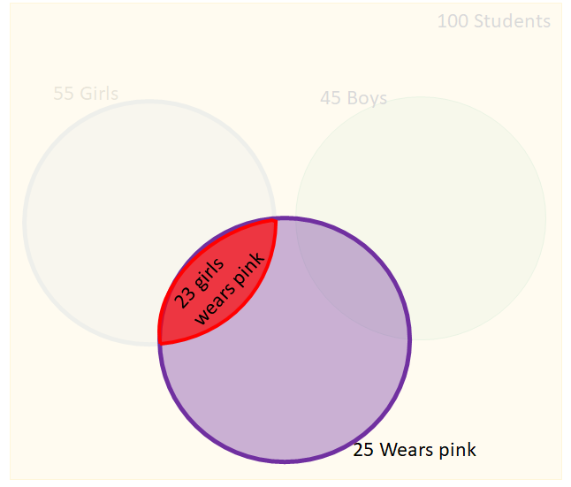

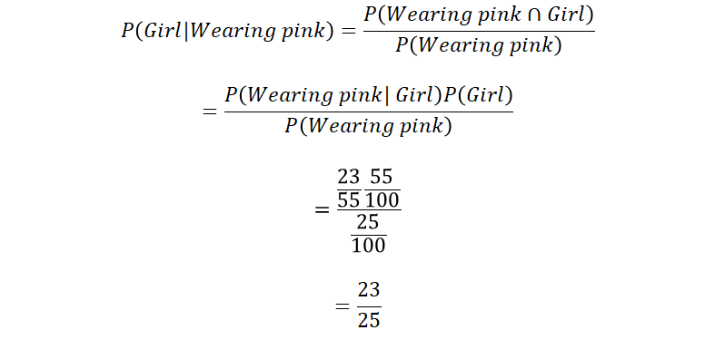

More frequently, Bayesian probability can be calculated through a Tree Diagram:

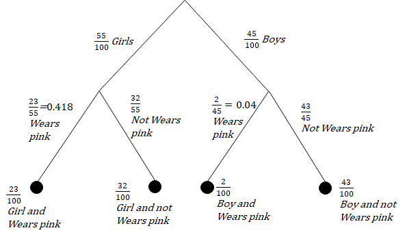

The probability of any student wearing pink,** P(Wears pink)** = P(Girl and Wears pink)+ P(Boy and Wears pink) = 23/100 + 2/100 = 25/100 =** 0.25**

The conditional probability of she wears pink given that the student is a girl, **P(Wears pink|girl)** is 23/55 = **0.418**

Knowing that the student is a girl, the probability of her wearing pink (0.418) is larger than the probability of any student wearing pink on the whole(0.25). Hence **knowing that the student is a girl, it increases the probability of her wearing pink**. It can also be said that being a girl and wearing pink are associated and they are** not mutually independent events.**

On the other hand, the following example shows mutually independent events:

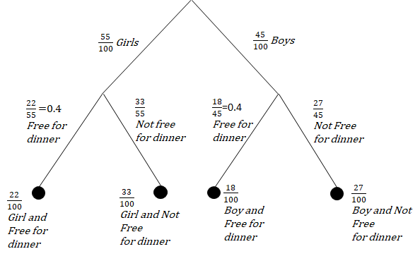

The probability of any student who is free for dinner, **P(Free for dinner) **is P(Girl and Free for dinner)+ P(Boy and Free for dinner) = 22/100 + 18/100 = 40/100 = **0.4**

The conditional probability of she is free for dinner given that the student is a girl, **P(Free for dinner|girl)** is 22/55 = **0.4**

Knowing that it is a girl, the probability of she is free for dinner (0.4) is the same as the probability of people who are free for dinner on the whole (0.25). Hence **knowing that it is a girl, it did not increase or decrease the probability that she is free for dinner**. It can also be said that being a girl and being free for dinner are not associated and they **are mutually independent events.**

Assuming there is another conditional probability of the student is wearing shorts given that it is a girl, **P(Wears shorts|girl) **= 7/55 and P(Wears shorts|girl) is mutually independent of P(Wearing pink|girl):

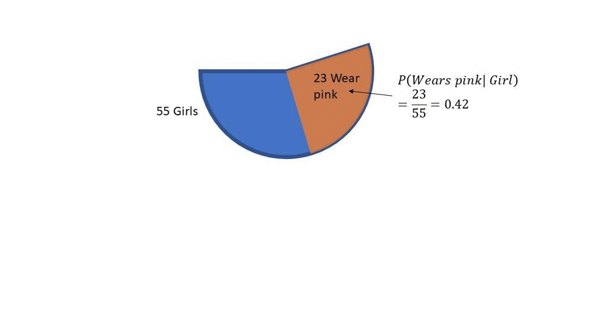

Since P(Wears shorts|girl) is mutually independent of P(Wearing pink|girl), whether the girl is wearing pink does not affect the probability of the girl wearing shorts (it is always 7/55 =0.13). 0.13 of girls who wear pink wear shorts. 0.13 of girls who do not wear pink also wear shorts. Hence the conditional probability of the student wearing pink and shorts given that the student is a girl, P(Wears shorts, Wears pink|girl) is:

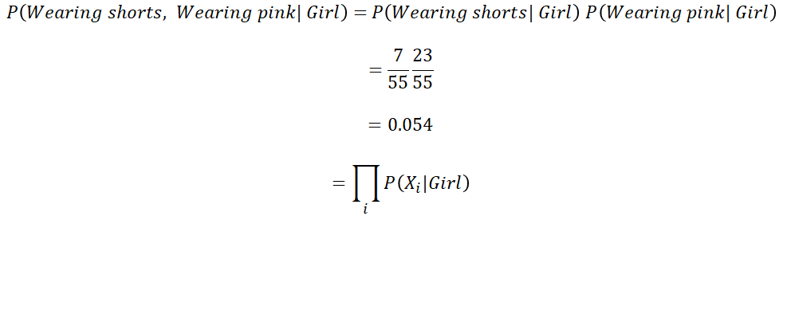

where Xi refers to the different feature given that it is a girl. As mutual independence are assumed between P(Wears shorts|Girl) and P(Wears pink|Girl), this method for the extraction of conditional probability from multiple features given a class label is called Naive Bayes.

If mutual independence is not assumed between P(Wears shorts|Girl) and P(Wears pink|Girl), knowing the girl is wearing pink may decrease the probability of the girl wearing shorts. The conditional probability of the girl wears shorts given that she is a girl and wear pink, P(Wears shorts|Wears pink, Girl) needs to be found:

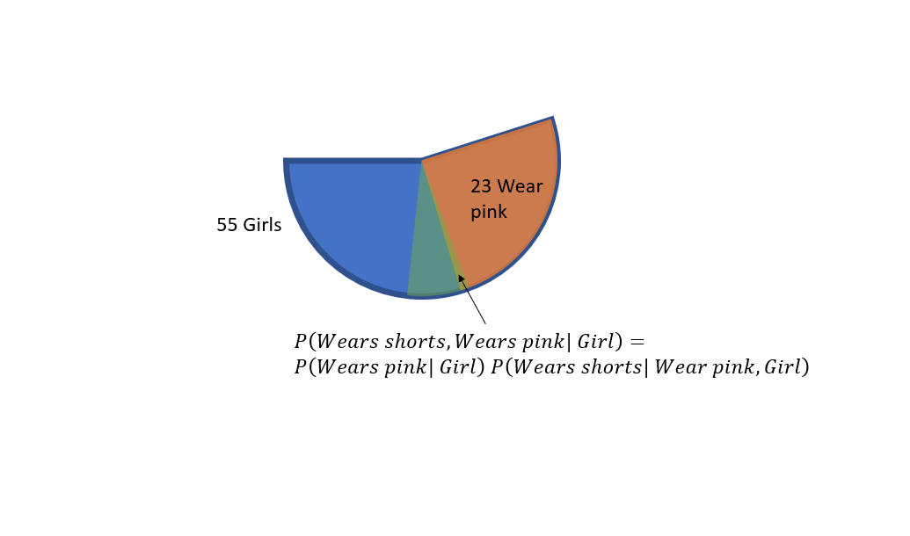

The Naive Bayes Classifier formula to predict the probability of an example with features X1 to Xi belongs to class j is given:

Where P(Cj|X1,..,Xi) is the posterior probability to be predicted, P(Xi|Cj) is the conditional probability of feature i given class j, P(Cj) is the prior probability of class j and P(Xi) is the probability of Xi.