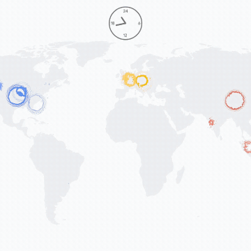

Visualizing Patterns in Google’s Cloud – Hi.Stamen

Visualizing Patterns in Google’s Cloud – Hi.Stamen

https://hi.stamen.com/visualizing-patterns-in-googles-cloud-7b43afddc791

What makes one place feel different from another? The language, the food, the landscape, but also a hundred subtler things: the colors…