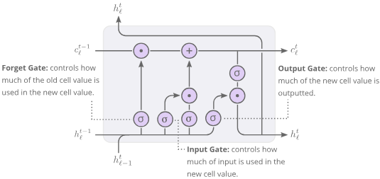
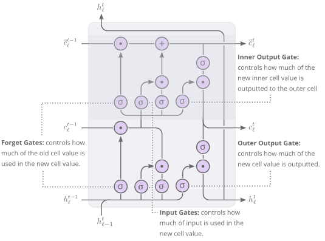

Visualizing memorization in RNNs

 [Distill](https://distill.pub/)

 [About](https://distill.pub/about/)  [Prize](https://distill.pub/prize/)  [Submit](https://distill.pub/journal/)

# Visualizing memorization in RNNs

Inspecting gradient magnitudes in context can be a powerful tool to see when recurrent units use short-term or long-term contextual understanding.

 context  the  formal  study  of  grammar  is  an  important  part  of  education

Nested LSTM

 context  the  formal  study  of  grammar  is  an  important  part  of  education

LSTM

 context  the  formal  study  of  grammar  is  an  important  part  of  education

GRU

This **connectivity visualization** shows how strongly previous input characters influence the current target character in an [autocomplete problem](https://distill.pub/2019/memorization-in-rnns/#ar-section-autocomplete). For example, in the prediction of “grammar” the GRU RNN [initially](#) uses long-term memorization but as [more characters become available](#) the RNN switches to short-term memorization. ([reset](#))

### Authors

### Affiliations

 [Andreas Madsen](https://github.com/AndreasMadsen)

 [NearForm Ltd](https://nearform.com/)

### Published

March 25, 2019

### DOI

[10.23915/distill.00016](https://doi.org/10.23915/distill.00016)

Memorization in Recurrent Neural Networks (RNNs) continues to pose a challenge in many applications. We’d like RNNs to be able to store information over many timesteps and retrieve it when it becomes relevant — but vanilla RNNs often struggle to do this.

Several network architectures have been proposed to tackle aspects of this problem, such as Long-Short-Term Memory (LSTM) units and Gated Recurrent Units (GRU). However, the practical problem of memorization still poses a challenge. As such, developing new recurrent units that are better at memorization continues to an active field of research.

To compare a recurrent unit against its alternatives, both past and recent papers, such as the Nested LSTM paper by Monzi et al. , heavily rely on quantitative comparisons. These comparisons often measure accuracy or cross entropy loss on standard problems such as Penn Treebank, Chinese Poetry Generation, or text8, where the task is to predict the next character given existing input.

While quantitative comparisons are useful, they only provide partial insight into the how a recurrent unit memorizes. A model can, for example, achieve high accuracy and cross entropy loss by just providing highly accurate predictions in cases that only require short-term memorization, while being inaccurate at predictions that require long-term memorization. For example, when autocompleting words in a sentence, a model with only short-term understanding could still exhibit high accuracy completing the ends of words once most of the characters are present. However, without longer term contextual understanding it won’t be able to predict words when only a few characters are known.

This article presents a qualitative visualization method for comparing recurrent units with regards to memorization and contextual understanding. The method is applied to the three recurrent units mentioned above: Nested LSTMs, LSTMs, and GRUs.

## Recurrent Units

The networks that will be analyzed all use a simple RNN structure:

 h_{\ell}^{t}*h*ℓ*t*​   Output for layer \ellℓ at time t*t*.   ==  \mathrm{Unit}Unit   Recurrent unit of choice.   (h_{\ell-1}^{t}, h_{\ell}^{t-1}), \text{ where: } h_{0}^t = x_t(*h*ℓ−1*t*​,*h*ℓ*t*−1​), where: *h*0*t*​=*x**t*​  y^t*y**t*  ==  \mathrm{Softmax}Softmax  (h_L^t)(*h**L**t*​)

In theory, the time dependency allows it in each iteration to know about every part of the sequence that came before. However, this time dependency typically causes a vanishing gradient problem that results in long-term dependencies being ignored during training .

 **Vanishing Gradient: ** where the contribution from the earlier steps becomes insignificant in the gradient for the vanilla RNN unit.

Softmax Layer
Recurrent Layer
Recurrent Layer
Input Layer

'%3e%3crect class='unit' width='12' height='30' rx='3' x='0' y='15' fill='rgb(243%2c 243%2c 243)'%3e%3c/rect%3e%3crect class='unit' width='12' height='30' rx='3' x='26' y='15' fill='rgb(243%2c 243%2c 243)'%3e%3c/rect%3e%3crect class='unit' width='12' height='30' rx='3' x='52' y='15' fill='rgb(243%2c 243%2c 243)'%3e%3c/rect%3e%3crect class='unit' width='12' height='30' rx='3' x='78' y='15' fill='rgb(243%2c 243%2c 243)'%3e%3c/rect%3e%3crect class='unit' width='12' height='30' rx='3' x='104' y='15' fill='rgb(243%2c 243%2c 243)'%3e%3c/rect%3e%3crect class='unit' width='12' height='30' rx='3' x='130' y='15' fill='rgb(243%2c 243%2c 243)'%3e%3c/rect%3e%3crect class='unit' width='12' height='30' rx='3' x='156' y='15' fill='rgb(243%2c 243%2c 243)'%3e%3c/rect%3e%3crect class='unit' width='12' height='30' rx='3' x='182' y='15' fill='rgb(243%2c 243%2c 243)'%3e%3c/rect%3e%3crect class='unit' width='12' height='30' rx='3' x='208' y='15' fill='rgb(243%2c 243%2c 243)'%3e%3c/rect%3e%3crect class='unit' width='12' height='30' rx='3' x='234' y='15' fill='rgb(243%2c 243%2c 243)'%3e%3c/rect%3e%3crect class='unit' width='12' height='30' rx='3' x='260' y='15' fill='rgb(243%2c 243%2c 243)'%3e%3c/rect%3e%3crect class='unit' width='12' height='30' rx='3' x='286' y='15' fill='rgb(155%2c 192%2c 219)'%3e%3c/rect%3e%3crect class='unit' width='12' height='30' rx='3' x='312' y='15' fill='rgb(243%2c 243%2c 243)'%3e%3c/rect%3e%3crect class='unit' width='12' height='30' rx='3' x='338' y='15' fill='rgb(243%2c 243%2c 243)'%3e%3c/rect%3e%3crect class='unit' width='12' height='30' rx='3' x='364' y='15' fill='rgb(243%2c 243%2c 243)'%3e%3c/rect%3e%3crect class='unit' width='12' height='30' rx='3' x='390' y='15' fill='rgb(243%2c 243%2c 243)'%3e%3c/rect%3e%3c/g%3e%3cg transform='translate(0%2c 60)'%3e%3crect class='unit' width='12' height='30' rx='3' x='0' y='15' fill='rgb(237%2c 239%2c 241)'%3e%3c/rect%3e%3crect class='unit' width='12' height='30' rx='3' x='26' y='15' fill='rgb(235%2c 239%2c 241)'%3e%3c/rect%3e%3crect class='unit' width='12' height='30' rx='3' x='52' y='15' fill='rgb(234%2c 238%2c 240)'%3e%3c/rect%3e%3crect class='unit' width='12' height='30' rx='3' x='78' y='15' fill='rgb(231%2c 236%2c 240)'%3e%3c/rect%3e%3crect class='unit' width='12' height='30' rx='3' x='104' y='15' fill='rgb(228%2c 234%2c 239)'%3e%3c/rect%3e%3crect class='unit' width='12' height='30' rx='3' x='130' y='15' fill='rgb(225%2c 232%2c 238)'%3e%3c/rect%3e%3crect class='unit' width='12' height='30' rx='3' x='156' y='15' fill='rgb(220%2c 230%2c 237)'%3e%3c/rect%3e%3crect class='unit' width='12' height='30' rx='3' x='182' y='15' fill='rgb(214%2c 226%2c 235)'%3e%3c/rect%3e%3crect class='unit' width='12' height='30' rx='3' x='208' y='15' fill='rgb(207%2c 222%2c 233)'%3e%3c/rect%3e%3crect class='unit' width='12' height='30' rx='3' x='234' y='15' fill='rgb(198%2c 217%2c 231)'%3e%3c/rect%3e%3crect class='unit' width='12' height='30' rx='3' x='260' y='15' fill='rgb(187%2c 210%2c 228)'%3e%3c/rect%3e%3crect class='unit' width='12' height='30' rx='3' x='286' y='15' fill='rgb(173%2c 202%2c 224)'%3e%3c/rect%3e%3crect class='unit' width='12' height='30' rx='3' x='312' y='15' fill='rgb(243%2c 243%2c 243)'%3e%3c/rect%3e%3crect class='unit' width='12' height='30' rx='3' x='338' y='15' fill='rgb(243%2c 243%2c 243)'%3e%3c/rect%3e%3crect class='unit' width='12' height='30' rx='3' x='364' y='15' fill='rgb(243%2c 243%2c 243)'%3e%3c/rect%3e%3crect class='unit' width='12' height='30' rx='3' x='390' y='15' fill='rgb(243%2c 243%2c 243)'%3e%3c/rect%3e%3cpath class='arrow-up active js-evernote-checked' d='M 6 15 v -15' marker-end='url(%23ar-memorization-problem-rnn-visual-rnn-arrow-up-active)' data-evernote-id='4943'%3e%3c/path%3e%3cpath class='arrow-up active js-evernote-checked' d='M 32 15 v -15' marker-end='url(%23ar-memorization-problem-rnn-visual-rnn-arrow-up-active)' data-evernote-id='4944'%3e%3c/path%3e%3cpath class='arrow-up active js-evernote-checked' d='M 58 15 v -15' marker-end='url(%23ar-memorization-problem-rnn-visual-rnn-arrow-up-active)' data-evernote-id='4945'%3e%3c/path%3e%3cpath class='arrow-up active js-evernote-checked' d='M 84 15 v -15' marker-end='url(%23ar-memorization-problem-rnn-visual-rnn-arrow-up-active)' data-evernote-id='4946'%3e%3c/path%3e%3cpath class='arrow-up active js-evernote-checked' d='M 110 15 v -15' marker-end='url(%23ar-memorization-problem-rnn-visual-rnn-arrow-up-active)' data-evernote-id='4947'%3e%3c/path%3e%3cpath class='arrow-up active js-evernote-checked' d='M 136 15 v -15' marker-end='url(%23ar-memorization-problem-rnn-visual-rnn-arrow-up-active)' data-evernote-id='4948'%3e%3c/path%3e%3cpath class='arrow-up active js-evernote-checked' d='M 162 15 v -15' marker-end='url(%23ar-memorization-problem-rnn-visual-rnn-arrow-up-active)' data-evernote-id='4949'%3e%3c/path%3e%3cpath class='arrow-up active js-evernote-checked' d='M 188 15 v -15' marker-end='url(%23ar-memorization-problem-rnn-visual-rnn-arrow-up-active)' data-evernote-id='4950'%3e%3c/path%3e%3cpath class='arrow-up active js-evernote-checked' d='M 214 15 v -15' marker-end='url(%23ar-memorization-problem-rnn-visual-rnn-arrow-up-active)' data-evernote-id='4951'%3e%3c/path%3e%3cpath class='arrow-up active js-evernote-checked' d='M 240 15 v -15' marker-end='url(%23ar-memorization-problem-rnn-visual-rnn-arrow-up-active)' data-evernote-id='4952'%3e%3c/path%3e%3cpath class='arrow-up active js-evernote-checked' d='M 266 15 v -15' marker-end='url(%23ar-memorization-problem-rnn-visual-rnn-arrow-up-active)' data-evernote-id='4953'%3e%3c/path%3e%3cpath class='arrow-up active js-evernote-checked' d='M 292 15 v -15' marker-end='url(%23ar-memorization-problem-rnn-visual-rnn-arrow-up-active)' data-evernote-id='4954'%3e%3c/path%3e%3cpath class='arrow-up inactive js-evernote-checked' d='M 318 15 v -15' marker-end='url(%23ar-memorization-problem-rnn-visual-rnn-arrow-up-inactive)' data-evernote-id='4955'%3e%3c/path%3e%3cpath class='arrow-up inactive js-evernote-checked' d='M 344 15 v -15' marker-end='url(%23ar-memorization-problem-rnn-visual-rnn-arrow-up-inactive)' data-evernote-id='4956'%3e%3c/path%3e%3cpath class='arrow-up inactive js-evernote-checked' d='M 370 15 v -15' marker-end='url(%23ar-memorization-problem-rnn-visual-rnn-arrow-up-inactive)' data-evernote-id='4957'%3e%3c/path%3e%3cpath class='arrow-up inactive js-evernote-checked' d='M 396 15 v -15' marker-end='url(%23ar-memorization-problem-rnn-visual-rnn-arrow-up-inactive)' data-evernote-id='4958'%3e%3c/path%3e%3cpath class='arrow-right active js-evernote-checked' d='M 12 30 h 10' marker-end='url(%23ar-memorization-problem-rnn-visual-rnn-arrow-right-active)' data-evernote-id='4991'%3e%3c/path%3e%3cpath class='arrow-right active js-evernote-checked' d='M 38 30 h 10' marker-end='url(%23ar-memorization-problem-rnn-visual-rnn-arrow-right-active)' data-evernote-id='4992'%3e%3c/path%3e%3cpath class='arrow-right active js-evernote-checked' d='M 64 30 h 10' marker-end='url(%23ar-memorization-problem-rnn-visual-rnn-arrow-right-active)' data-evernote-id='4993'%3e%3c/path%3e%3cpath class='arrow-right active js-evernote-checked' d='M 90 30 h 10' marker-end='url(%23ar-memorization-problem-rnn-visual-rnn-arrow-right-active)' data-evernote-id='4994'%3e%3c/path%3e%3cpath class='arrow-right active js-evernote-checked' d='M 116 30 h 10' marker-end='url(%23ar-memorization-problem-rnn-visual-rnn-arrow-right-active)' data-evernote-id='4995'%3e%3c/path%3e%3cpath class='arrow-right active js-evernote-checked' d='M 142 30 h 10' marker-end='url(%23ar-memorization-problem-rnn-visual-rnn-arrow-right-active)' data-evernote-id='4996'%3e%3c/path%3e%3cpath class='arrow-right active js-evernote-checked' d='M 168 30 h 10' marker-end='url(%23ar-memorization-problem-rnn-visual-rnn-arrow-right-active)' data-evernote-id='4997'%3e%3c/path%3e%3cpath class='arrow-right active js-evernote-checked' d='M 194 30 h 10' marker-end='url(%23ar-memorization-problem-rnn-visual-rnn-arrow-right-active)' data-evernote-id='4998'%3e%3c/path%3e%3cpath class='arrow-right active js-evernote-checked' d='M 220 30 h 10' marker-end='url(%23ar-memorization-problem-rnn-visual-rnn-arrow-right-active)' data-evernote-id='4999'%3e%3c/path%3e%3cpath class='arrow-right active js-evernote-checked' d='M 246 30 h 10' marker-end='url(%23ar-memorization-problem-rnn-visual-rnn-arrow-right-active)' data-evernote-id='5000'%3e%3c/path%3e%3cpath class='arrow-right active js-evernote-checked' d='M 272 30 h 10' marker-end='url(%23ar-memorization-problem-rnn-visual-rnn-arrow-right-active)' data-evernote-id='5001'%3e%3c/path%3e%3cpath class='arrow-right inactive js-evernote-checked' d='M 298 30 h 10' marker-end='url(%23ar-memorization-problem-rnn-visual-rnn-arrow-right-inactive)' data-evernote-id='5002'%3e%3c/path%3e%3cpath class='arrow-right inactive js-evernote-checked' d='M 324 30 h 10' marker-end='url(%23ar-memorization-problem-rnn-visual-rnn-arrow-right-inactive)' data-evernote-id='5003'%3e%3c/path%3e%3cpath class='arrow-right inactive js-evernote-checked' d='M 350 30 h 10' marker-end='url(%23ar-memorization-problem-rnn-visual-rnn-arrow-right-inactive)' data-evernote-id='5004'%3e%3c/path%3e%3cpath class='arrow-right inactive js-evernote-checked' d='M 376 30 h 10' marker-end='url(%23ar-memorization-problem-rnn-visual-rnn-arrow-right-inactive)' data-evernote-id='5005'%3e%3c/path%3e%3c/g%3e%3cg transform='translate(0%2c 120)'%3e%3crect class='unit' width='12' height='30' rx='3' x='0' y='15' fill='rgb(238%2c 240%2c 242)'%3e%3c/rect%3e%3crect class='unit' width='12' height='30' rx='3' x='26' y='15' fill='rgb(237%2c 239%2c 241)'%3e%3c/rect%3e%3crect class='unit' width='12' height='30' rx='3' x='52' y='15' fill='rgb(235%2c 239%2c 241)'%3e%3c/rect%3e%3crect class='unit' width='12' height='30' rx='3' x='78' y='15' fill='rgb(234%2c 238%2c 240)'%3e%3c/rect%3e%3crect class='unit' width='12' height='30' rx='3' x='104' y='15' fill='rgb(231%2c 236%2c 240)'%3e%3c/rect%3e%3crect class='unit' width='12' height='30' rx='3' x='130' y='15' fill='rgb(228%2c 234%2c 239)'%3e%3c/rect%3e%3crect class='unit' width='12' height='30' rx='3' x='156' y='15' fill='rgb(225%2c 232%2c 238)'%3e%3c/rect%3e%3crect class='unit' width='12' height='30' rx='3' x='182' y='15' fill='rgb(220%2c 230%2c 237)'%3e%3c/rect%3e%3crect class='unit' width='12' height='30' rx='3' x='208' y='15' fill='rgb(214%2c 226%2c 235)'%3e%3c/rect%3e%3crect class='unit' width='12' height='30' rx='3' x='234' y='15' fill='rgb(207%2c 222%2c 233)'%3e%3c/rect%3e%3crect class='unit' width='12' height='30' rx='3' x='260' y='15' fill='rgb(198%2c 217%2c 231)'%3e%3c/rect%3e%3crect class='unit' width='12' height='30' rx='3' x='286' y='15' fill='rgb(187%2c 210%2c 228)'%3e%3c/rect%3e%3crect class='unit' width='12' height='30' rx='3' x='312' y='15' fill='rgb(243%2c 243%2c 243)'%3e%3c/rect%3e%3crect class='unit' width='12' height='30' rx='3' x='338' y='15' fill='rgb(243%2c 243%2c 243)'%3e%3c/rect%3e%3crect class='unit' width='12' height='30' rx='3' x='364' y='15' fill='rgb(243%2c 243%2c 243)'%3e%3c/rect%3e%3crect class='unit' width='12' height='30' rx='3' x='390' y='15' fill='rgb(243%2c 243%2c 243)'%3e%3c/rect%3e%3cpath class='arrow-up active js-evernote-checked' d='M 6 15 v -15' marker-end='url(%23ar-memorization-problem-rnn-visual-rnn-arrow-up-active)' data-evernote-id='4959'%3e%3c/path%3e%3cpath class='arrow-up active js-evernote-checked' d='M 32 15 v -15' marker-end='url(%23ar-memorization-problem-rnn-visual-rnn-arrow-up-active)' data-evernote-id='4960'%3e%3c/path%3e%3cpath class='arrow-up active js-evernote-checked' d='M 58 15 v -15' marker-end='url(%23ar-memorization-problem-rnn-visual-rnn-arrow-up-active)' data-evernote-id='4961'%3e%3c/path%3e%3cpath class='arrow-up active js-evernote-checked' d='M 84 15 v -15' marker-end='url(%23ar-memorization-problem-rnn-visual-rnn-arrow-up-active)' data-evernote-id='4962'%3e%3c/path%3e%3cpath class='arrow-up active js-evernote-checked' d='M 110 15 v -15' marker-end='url(%23ar-memorization-problem-rnn-visual-rnn-arrow-up-active)' data-evernote-id='4963'%3e%3c/path%3e%3cpath class='arrow-up active js-evernote-checked' d='M 136 15 v -15' marker-end='url(%23ar-memorization-problem-rnn-visual-rnn-arrow-up-active)' data-evernote-id='4964'%3e%3c/path%3e%3cpath class='arrow-up active js-evernote-checked' d='M 162 15 v -15' marker-end='url(%23ar-memorization-problem-rnn-visual-rnn-arrow-up-active)' data-evernote-id='4965'%3e%3c/path%3e%3cpath class='arrow-up active js-evernote-checked' d='M 188 15 v -15' marker-end='url(%23ar-memorization-problem-rnn-visual-rnn-arrow-up-active)' data-evernote-id='4966'%3e%3c/path%3e%3cpath class='arrow-up active js-evernote-checked' d='M 214 15 v -15' marker-end='url(%23ar-memorization-problem-rnn-visual-rnn-arrow-up-active)' data-evernote-id='4967'%3e%3c/path%3e%3cpath class='arrow-up active js-evernote-checked' d='M 240 15 v -15' marker-end='url(%23ar-memorization-problem-rnn-visual-rnn-arrow-up-active)' data-evernote-id='4968'%3e%3c/path%3e%3cpath class='arrow-up active js-evernote-checked' d='M 266 15 v -15' marker-end='url(%23ar-memorization-problem-rnn-visual-rnn-arrow-up-active)' data-evernote-id='4969'%3e%3c/path%3e%3cpath class='arrow-up active js-evernote-checked' d='M 292 15 v -15' marker-end='url(%23ar-memorization-problem-rnn-visual-rnn-arrow-up-active)' data-evernote-id='4970'%3e%3c/path%3e%3cpath class='arrow-up inactive js-evernote-checked' d='M 318 15 v -15' marker-end='url(%23ar-memorization-problem-rnn-visual-rnn-arrow-up-inactive)' data-evernote-id='4971'%3e%3c/path%3e%3cpath class='arrow-up inactive js-evernote-checked' d='M 344 15 v -15' marker-end='url(%23ar-memorization-problem-rnn-visual-rnn-arrow-up-inactive)' data-evernote-id='4972'%3e%3c/path%3e%3cpath class='arrow-up inactive js-evernote-checked' d='M 370 15 v -15' marker-end='url(%23ar-memorization-problem-rnn-visual-rnn-arrow-up-inactive)' data-evernote-id='4973'%3e%3c/path%3e%3cpath class='arrow-up inactive js-evernote-checked' d='M 396 15 v -15' marker-end='url(%23ar-memorization-problem-rnn-visual-rnn-arrow-up-inactive)' data-evernote-id='4974'%3e%3c/path%3e%3cpath class='arrow-right active js-evernote-checked' d='M 12 30 h 10' marker-end='url(%23ar-memorization-problem-rnn-visual-rnn-arrow-right-active)' data-evernote-id='5006'%3e%3c/path%3e%3cpath class='arrow-right active js-evernote-checked' d='M 38 30 h 10' marker-end='url(%23ar-memorization-problem-rnn-visual-rnn-arrow-right-active)' data-evernote-id='5007'%3e%3c/path%3e%3cpath class='arrow-right active js-evernote-checked' d='M 64 30 h 10' marker-end='url(%23ar-memorization-problem-rnn-visual-rnn-arrow-right-active)' data-evernote-id='5008'%3e%3c/path%3e%3cpath class='arrow-right active js-evernote-checked' d='M 90 30 h 10' marker-end='url(%23ar-memorization-problem-rnn-visual-rnn-arrow-right-active)' data-evernote-id='5009'%3e%3c/path%3e%3cpath class='arrow-right active js-evernote-checked' d='M 116 30 h 10' marker-end='url(%23ar-memorization-problem-rnn-visual-rnn-arrow-right-active)' data-evernote-id='5010'%3e%3c/path%3e%3cpath class='arrow-right active js-evernote-checked' d='M 142 30 h 10' marker-end='url(%23ar-memorization-problem-rnn-visual-rnn-arrow-right-active)' data-evernote-id='5011'%3e%3c/path%3e%3cpath class='arrow-right active js-evernote-checked' d='M 168 30 h 10' marker-end='url(%23ar-memorization-problem-rnn-visual-rnn-arrow-right-active)' data-evernote-id='5012'%3e%3c/path%3e%3cpath class='arrow-right active js-evernote-checked' d='M 194 30 h 10' marker-end='url(%23ar-memorization-problem-rnn-visual-rnn-arrow-right-active)' data-evernote-id='5013'%3e%3c/path%3e%3cpath class='arrow-right active js-evernote-checked' d='M 220 30 h 10' marker-end='url(%23ar-memorization-problem-rnn-visual-rnn-arrow-right-active)' data-evernote-id='5014'%3e%3c/path%3e%3cpath class='arrow-right active js-evernote-checked' d='M 246 30 h 10' marker-end='url(%23ar-memorization-problem-rnn-visual-rnn-arrow-right-active)' data-evernote-id='5015'%3e%3c/path%3e%3cpath class='arrow-right active js-evernote-checked' d='M 272 30 h 10' marker-end='url(%23ar-memorization-problem-rnn-visual-rnn-arrow-right-active)' data-evernote-id='5016'%3e%3c/path%3e%3cpath class='arrow-right inactive js-evernote-checked' d='M 298 30 h 10' marker-end='url(%23ar-memorization-problem-rnn-visual-rnn-arrow-right-inactive)' data-evernote-id='5017'%3e%3c/path%3e%3cpath class='arrow-right inactive js-evernote-checked' d='M 324 30 h 10' marker-end='url(%23ar-memorization-problem-rnn-visual-rnn-arrow-right-inactive)' data-evernote-id='5018'%3e%3c/path%3e%3cpath class='arrow-right inactive js-evernote-checked' d='M 350 30 h 10' marker-end='url(%23ar-memorization-problem-rnn-visual-rnn-arrow-right-inactive)' data-evernote-id='5019'%3e%3c/path%3e%3cpath class='arrow-right inactive js-evernote-checked' d='M 376 30 h 10' marker-end='url(%23ar-memorization-problem-rnn-visual-rnn-arrow-right-inactive)' data-evernote-id='5020'%3e%3c/path%3e%3c/g%3e%3cg transform='translate(0%2c 180)'%3e%3crect class='unit' width='12' height='30' rx='3' x='0' y='15' fill='rgb(239%2c 241%2c 242)'%3e%3c/rect%3e%3crect class='unit' width='12' height='30' rx='3' x='26' y='15' fill='rgb(238%2c 240%2c 242)'%3e%3c/rect%3e%3crect class='unit' width='12' height='30' rx='3' x='52' y='15' fill='rgb(237%2c 239%2c 241)'%3e%3c/rect%3e%3crect class='unit' width='12' height='30' rx='3' x='78' y='15' fill='rgb(235%2c 239%2c 241)'%3e%3c/rect%3e%3crect class='unit' width='12' height='30' rx='3' x='104' y='15' fill='rgb(234%2c 238%2c 240)'%3e%3c/rect%3e%3crect class='unit' width='12' height='30' rx='3' x='130' y='15' fill='rgb(231%2c 236%2c 240)'%3e%3c/rect%3e%3crect class='unit' width='12' height='30' rx='3' x='156' y='15' fill='rgb(228%2c 234%2c 239)'%3e%3c/rect%3e%3crect class='unit' width='12' height='30' rx='3' x='182' y='15' fill='rgb(225%2c 232%2c 238)'%3e%3c/rect%3e%3crect class='unit' width='12' height='30' rx='3' x='208' y='15' fill='rgb(220%2c 230%2c 237)'%3e%3c/rect%3e%3crect class='unit' width='12' height='30' rx='3' x='234' y='15' fill='rgb(214%2c 226%2c 235)'%3e%3c/rect%3e%3crect class='unit' width='12' height='30' rx='3' x='260' y='15' fill='rgb(207%2c 222%2c 233)'%3e%3c/rect%3e%3crect class='unit' width='12' height='30' rx='3' x='286' y='15' fill='rgb(198%2c 217%2c 231)'%3e%3c/rect%3e%3crect class='unit' width='12' height='30' rx='3' x='312' y='15' fill='rgb(243%2c 243%2c 243)'%3e%3c/rect%3e%3crect class='unit' width='12' height='30' rx='3' x='338' y='15' fill='rgb(243%2c 243%2c 243)'%3e%3c/rect%3e%3crect class='unit' width='12' height='30' rx='3' x='364' y='15' fill='rgb(243%2c 243%2c 243)'%3e%3c/rect%3e%3crect class='unit' width='12' height='30' rx='3' x='390' y='15' fill='rgb(243%2c 243%2c 243)'%3e%3c/rect%3e%3cpath class='arrow-up active js-evernote-checked' d='M 6 15 v -15' marker-end='url(%23ar-memorization-problem-rnn-visual-rnn-arrow-up-active)' data-evernote-id='4975'%3e%3c/path%3e%3cpath class='arrow-up active js-evernote-checked' d='M 32 15 v -15' marker-end='url(%23ar-memorization-problem-rnn-visual-rnn-arrow-up-active)' data-evernote-id='4976'%3e%3c/path%3e%3cpath class='arrow-up active js-evernote-checked' d='M 58 15 v -15' marker-end='url(%23ar-memorization-problem-rnn-visual-rnn-arrow-up-active)' data-evernote-id='4977'%3e%3c/path%3e%3cpath class='arrow-up active js-evernote-checked' d='M 84 15 v -15' marker-end='url(%23ar-memorization-problem-rnn-visual-rnn-arrow-up-active)' data-evernote-id='4978'%3e%3c/path%3e%3cpath class='arrow-up active js-evernote-checked' d='M 110 15 v -15' marker-end='url(%23ar-memorization-problem-rnn-visual-rnn-arrow-up-active)' data-evernote-id='4979'%3e%3c/path%3e%3cpath class='arrow-up active js-evernote-checked' d='M 136 15 v -15' marker-end='url(%23ar-memorization-problem-rnn-visual-rnn-arrow-up-active)' data-evernote-id='4980'%3e%3c/path%3e%3cpath class='arrow-up active js-evernote-checked' d='M 162 15 v -15' marker-end='url(%23ar-memorization-problem-rnn-visual-rnn-arrow-up-active)' data-evernote-id='4981'%3e%3c/path%3e%3cpath class='arrow-up active js-evernote-checked' d='M 188 15 v -15' marker-end='url(%23ar-memorization-problem-rnn-visual-rnn-arrow-up-active)' data-evernote-id='4982'%3e%3c/path%3e%3cpath class='arrow-up active js-evernote-checked' d='M 214 15 v -15' marker-end='url(%23ar-memorization-problem-rnn-visual-rnn-arrow-up-active)' data-evernote-id='4983'%3e%3c/path%3e%3cpath class='arrow-up active js-evernote-checked' d='M 240 15 v -15' marker-end='url(%23ar-memorization-problem-rnn-visual-rnn-arrow-up-active)' data-evernote-id='4984'%3e%3c/path%3e%3cpath class='arrow-up active js-evernote-checked' d='M 266 15 v -15' marker-end='url(%23ar-memorization-problem-rnn-visual-rnn-arrow-up-active)' data-evernote-id='4985'%3e%3c/path%3e%3cpath class='arrow-up active js-evernote-checked' d='M 292 15 v -15' marker-end='url(%23ar-memorization-problem-rnn-visual-rnn-arrow-up-active)' data-evernote-id='4986'%3e%3c/path%3e%3cpath class='arrow-up inactive js-evernote-checked' d='M 318 15 v -15' marker-end='url(%23ar-memorization-problem-rnn-visual-rnn-arrow-up-inactive)' data-evernote-id='4987'%3e%3c/path%3e%3cpath class='arrow-up inactive js-evernote-checked' d='M 344 15 v -15' marker-end='url(%23ar-memorization-problem-rnn-visual-rnn-arrow-up-inactive)' data-evernote-id='4988'%3e%3c/path%3e%3cpath class='arrow-up inactive js-evernote-checked' d='M 370 15 v -15' marker-end='url(%23ar-memorization-problem-rnn-visual-rnn-arrow-up-inactive)' data-evernote-id='4989'%3e%3c/path%3e%3cpath class='arrow-up inactive js-evernote-checked' d='M 396 15 v -15' marker-end='url(%23ar-memorization-problem-rnn-visual-rnn-arrow-up-inactive)' data-evernote-id='4990'%3e%3c/path%3e%3c/g%3e%3c/svg%3e)

Several solutions to the vanishing gradient problem have been proposed over the years. The most popular are the aforementioned LSTM and GRU units, but this is still an area of active research. Both LSTM and GRU are well known and [thoroughly explained in literature](http://colah.github.io/posts/2015-08-Understanding-LSTMs/). Recently, Nested LSTMs have also been proposed  — an explanation of Nested LSTMs can be found [in the appendix](https://distill.pub/2019/memorization-in-rnns/#appendix-nestedlstm).

- Nested LSTM
- LSTM
- GRU

 

 **Recurrent Unit, LSTM:** allows for long-term memorization by gateing its update, thereby solving the vanishing gradient problem.

It is not entirely clear why one recurrent unit performs better than another in some applications, while in other applications it is another type of recurrent unit that performs better. Theoretically they all solve the vanishing gradient problem, but in practice their performance is highly application dependent.

Understanding why these differences occur is likely an opaque and challenging problem. The purpose of this article is to demonstrate a visualization technique that can better highlight what these differences are. Hopefully, such an understanding can lead to a deeper understanding.

## Comparing Recurrent Units

Comparing different Recurrent Units is often more involved than simply comparing the accuracy or cross entropy loss. Differences in these high-level quantitative measures can have many explanations and may only be because of some small improvement in predictions that only requires short-term contextual understanding, while it is often the long-term contextual understanding that is of interest.

### A problem for qualitative analysis

Therefore a good problem for qualitatively analyzing contextual understanding should have a human-interpretable output and depend both on long-term and short-term contextual understanding. The typical problems that are often used, such as Penn Treebank, Chinese Poetry Generation, or  generation do not have outputs that are easy to reason about, as they require an extensive understanding of either grammar, Chinese poetry, or only output a single letter.

To this end, this article studies the autocomplete problem. Each character is mapped to a target that represents the entire word. The space leading up to the word should also map to that target. This prediction based on the space character is in particular useful for showing contextual understanding.

The autocomplete problem is quite similar to the text8 generation problem: the only difference is that instead of predicting the next letter, the model predicts an entire word. This makes the output much more interpretable. Finally, because of its close relation to text8 generation, existing literature on text8 generation is relevant and comparable, in the sense that models that work well on text8 generation should work well on the autocomplete problem.

User types input sequence.

Recurrent neural network processes the sequence.

The output for the last character is used.

The most likely suggestions are extracted.

 parts  of  north  af

'%3e%3crect x='5' width='9.612500190734863' height='30' data-evernote-id='4883' class='js-evernote-checked'%3e%3c/rect%3e%3crect x='16.212493896484375' width='9.612500190734863' height='30' data-evernote-id='4884' class='js-evernote-checked'%3e%3c/rect%3e%3crect x='27.42498779296875' width='9.612500190734863' height='30' data-evernote-id='4885' class='js-evernote-checked'%3e%3c/rect%3e%3crect x='38.637481689453125' width='9.612500190734863' height='30' data-evernote-id='4886' class='js-evernote-checked'%3e%3c/rect%3e%3crect x='49.8499755859375' width='9.612500190734863' height='30' data-evernote-id='4887' class='js-evernote-checked'%3e%3c/rect%3e%3crect x='61.0625' width='9.612500190734863' height='30' data-evernote-id='4888' class='js-evernote-checked'%3e%3c/rect%3e%3crect x='72.27499389648438' width='9.612500190734863' height='30' data-evernote-id='4889' class='js-evernote-checked'%3e%3c/rect%3e%3crect x='83.48748779296875' width='9.612500190734863' height='30' data-evernote-id='4890' class='js-evernote-checked'%3e%3c/rect%3e%3crect x='94.69998168945312' width='9.612500190734863' height='30' data-evernote-id='4891' class='js-evernote-checked'%3e%3c/rect%3e%3crect x='105.9124755859375' width='9.612500190734863' height='30' data-evernote-id='4892' class='js-evernote-checked'%3e%3c/rect%3e%3crect x='117.125' width='9.612500190734863' height='30' data-evernote-id='4893' class='js-evernote-checked'%3e%3c/rect%3e%3crect x='128.33749389648438' width='9.612500190734863' height='30' data-evernote-id='4894' class='js-evernote-checked'%3e%3c/rect%3e%3crect x='139.54998779296875' width='9.612500190734863' height='30' data-evernote-id='4895' class='js-evernote-checked'%3e%3c/rect%3e%3crect x='150.76248168945312' width='9.612500190734863' height='30' data-evernote-id='4896' class='js-evernote-checked'%3e%3c/rect%3e%3crect x='161.9749755859375' width='9.612500190734863' height='30' data-evernote-id='4897' class='js-evernote-checked'%3e%3c/rect%3e%3crect x='173.1875' width='9.612500190734863' height='30' data-evernote-id='4898' class='js-evernote-checked'%3e%3c/rect%3e%3crect x='184.39999389648438' width='9.612500190734863' height='30' data-evernote-id='4899' class='js-evernote-checked'%3e%3c/rect%3e%3crect x='195.61251831054688' width='9.612500190734863' height='30' data-evernote-id='4900' class='js-evernote-checked'%3e%3c/rect%3e%3crect x='206.82498168945312' width='9.612500190734863' height='30' data-evernote-id='4901' class='js-evernote-checked'%3e%3c/rect%3e%3crect x='218.03750610351562' width='9.612500190734863' height='30' data-evernote-id='4902' class='js-evernote-checked'%3e%3c/rect%3e%3crect x='229.24996948242188' width='9.612500190734863' height='30' data-evernote-id='4903' class='js-evernote-checked'%3e%3c/rect%3e%3crect x='240.46249389648438' width='9.612500190734863' height='30' data-evernote-id='4904' class='js-evernote-checked'%3e%3c/rect%3e%3crect x='251.67501831054688' width='9.612500190734863' height='30' data-evernote-id='4905' class='js-evernote-checked'%3e%3c/rect%3e%3crect x='262.8874816894531' width='9.612500190734863' height='30' data-evernote-id='4906' class='js-evernote-checked'%3e%3c/rect%3e%3crect x='274.1000061035156' width='9.612500190734863' height='30' data-evernote-id='4907' class='js-evernote-checked'%3e%3c/rect%3e%3crect x='285.3124694824219' width='9.612500190734863' height='30' data-evernote-id='4908' class='js-evernote-checked'%3e%3c/rect%3e%3crect x='296.5249938964844' width='9.612500190734863' height='30' data-evernote-id='4909' class='js-evernote-checked'%3e%3c/rect%3e%3crect x='307.7375183105469' width='9.612500190734863' height='30' data-evernote-id='4910' class='js-evernote-checked'%3e%3c/rect%3e%3crect x='318.9499816894531' width='9.612500190734863' height='30' data-evernote-id='4911' class='js-evernote-checked'%3e%3c/rect%3e%3crect x='330.1625061035156' width='9.612500190734863' height='30' data-evernote-id='4912' class='js-evernote-checked'%3e%3c/rect%3e%3crect x='341.3749694824219' width='9.612500190734863' height='30' data-evernote-id='4913' class='js-evernote-checked'%3e%3c/rect%3e%3crect x='352.5874938964844' width='9.612500190734863' height='30' data-evernote-id='4914' class='js-evernote-checked'%3e%3c/rect%3e%3crect x='363.8000183105469' width='9.612500190734863' height='30' data-evernote-id='4915' class='js-evernote-checked'%3e%3c/rect%3e%3crect x='375.0124816894531' width='9.612500190734863' height='30' data-evernote-id='4916' class='js-evernote-checked'%3e%3c/rect%3e%3c/g%3e%3cg class='flow-in'%3e%3crect x='5' width='9.612500190734863' height='45' data-evernote-id='4917' class='js-evernote-checked'%3e%3c/rect%3e%3crect x='16.212493896484375' width='9.612500190734863' height='45' data-evernote-id='4918' class='js-evernote-checked'%3e%3c/rect%3e%3crect x='27.42498779296875' width='9.612500190734863' height='45' data-evernote-id='4919' class='js-evernote-checked'%3e%3c/rect%3e%3crect x='38.637481689453125' width='9.612500190734863' height='45' data-evernote-id='4920' class='js-evernote-checked'%3e%3c/rect%3e%3crect x='49.8499755859375' width='9.612500190734863' height='45' data-evernote-id='4921' class='js-evernote-checked'%3e%3c/rect%3e%3crect x='61.0625' width='9.612500190734863' height='45' data-evernote-id='4922' class='js-evernote-checked'%3e%3c/rect%3e%3crect x='72.27499389648438' width='9.612500190734863' height='45' data-evernote-id='4923' class='js-evernote-checked'%3e%3c/rect%3e%3crect x='83.48748779296875' width='9.612500190734863' height='45' data-evernote-id='4924' class='js-evernote-checked'%3e%3c/rect%3e%3crect x='94.69998168945312' width='9.612500190734863' height='45' data-evernote-id='4925' class='js-evernote-checked'%3e%3c/rect%3e%3crect x='105.9124755859375' width='9.612500190734863' height='45' data-evernote-id='4926' class='js-evernote-checked'%3e%3c/rect%3e%3crect x='117.125' width='9.612500190734863' height='45' data-evernote-id='4927' class='js-evernote-checked'%3e%3c/rect%3e%3crect x='128.33749389648438' width='9.612500190734863' height='45' data-evernote-id='4928' class='js-evernote-checked'%3e%3c/rect%3e%3crect x='139.54998779296875' width='9.612500190734863' height='45' data-evernote-id='4929' class='js-evernote-checked'%3e%3c/rect%3e%3crect x='150.76248168945312' width='9.612500190734863' height='45' data-evernote-id='4930' class='js-evernote-checked'%3e%3c/rect%3e%3crect x='161.9749755859375' width='9.612500190734863' height='45' data-evernote-id='4931' class='js-evernote-checked'%3e%3c/rect%3e%3crect x='173.1875' width='9.612500190734863' height='45' data-evernote-id='4932' class='js-evernote-checked'%3e%3c/rect%3e%3crect x='184.39999389648438' width='9.612500190734863' height='45' data-evernote-id='4933' class='js-evernote-checked'%3e%3c/rect%3e%3crect x='195.61251831054688' width='9.612500190734863' height='45' data-evernote-id='4934' class='js-evernote-checked'%3e%3c/rect%3e%3c/g%3e%3cg transform='translate(0%2c 45)' class='flow-out'%3e%3cpath d='M195.61251831054688%2c0Q195.61251831054688%2c15%2c0%2c30L400%2c30Q205.22501850128174%2c15%2c205.22501850128174%2c0Z' data-evernote-id='4935' class='js-evernote-checked'%3e%3c/path%3e%3c/g%3e%3cpath transform='translate(0%2c 30)' marker-start='url(%23ar-demo-marker-circle)' marker-mid='url(%23ar-demo-marker-circle)' marker-end='url(%23ar-demo-marker-arrow)' class='flow-arrow js-evernote-checked' d='M9.806250095367432%2c0L21.018743991851807%2c0L32.23123788833618%2c0L43.44373178482056%2c0L54.65622568130493%2c0L65.86875009536743%2c0L77.0812439918518%2c0L88.29373788833618%2c0L99.50623178482056%2c0L110.71872568130493%2c0L121.93125009536743%2c0L133.1437439918518%2c0L144.35623788833618%2c0L155.56873178482056%2c0L166.78122568130493%2c0L177.99375009536743%2c0L189.2062439918518%2c0L200.4187684059143%2c0' data-evernote-id='4936'%3e%3c/path%3e%3cdefs%3e%3cmarker id='ar-demo-marker-circle' markerWidth='3' markerHeight='3' refX='1.5' refY='1.5'%3e%3ccircle r='1.5' cx='1.5' cy='1.5' fill='rgb(70%2c 130%2c 180)'%3e%3c/circle%3e%3c/marker%3e%3cmarker id='ar-demo-marker-arrow' markerWidth='3' markerHeight='3' refX='2' refY='1.5'%3e%3cpath d='M0%2c0 L0%2c3 L3%2c1.5 Z' fill='rgb(70%2c 130%2c 180)'%3e%3c/path%3e%3c/marker%3e%3c/defs%3e%3c/svg%3e)

africa(85.30%)
africans(1.40%)
african(8.90%)

 **Autocomplete:** An application that has a humanly interpretable output, while depending on both short and long-term contextual understanding. In this case, the network uses past information and understands the next word should be a country.

The output in this figure was produced by the GRU model; all model setups are [described in the appendix](https://distill.pub/2019/memorization-in-rnns/#appendix-autocomplete). * Try [removing the last letters](#) to see that the network continues to give meaningful suggestions. *  *You can also type in your own text.* ([reset](#)).

The autocomplete dataset is constructed from the full [text8](http://mattmahoney.net/dc/textdata.html) dataset. The recurrent neural networks used to solve the problem have two layers, each with 600 units. There are three models, using GRU, LSTM, and Nested LSTM. See [the appendix](https://distill.pub/2019/memorization-in-rnns/#appendix-autocomplete) for more details.

### Connectivity in the Autocomplete Problem

In the recently published Nested LSTM paper , they qualitatively compared their Nested LSTM unit to other recurrent units, to show how it memorizes in comparison, by visualizing individual cell activations.

This visualization was inspired by Karpathy et al.  where they identify cells that captures a specific feature. For identifying a specific feature, this visualization approach works well. However, it is not a useful argument for memorization in general as the output is entirely dependent on what feature the specific cell captures.

Instead, to get a better idea of how well each model memorizes and uses memory for contextual understanding, the connectivity between the desired output and the input is analyzed. This is calculated as:

 \textrm{connectivity}(connectivity(  t*t*   Input time index.   ,,  \tilde{t}*t*~   Output time index.   ) =)=  \left|\left|\frac{\partial (h_L^{\tilde{t}})_k}{\partial x^t}ight|ight|_2∣∣∣∣∣​∣∣∣∣∣​∂*x**t*∂(*h**L**t*~​)*k*​​∣∣∣∣∣​∣∣∣∣∣​2​   Magnitude of the gradient, between the logits for the desired output (h_L^{\tilde{t}})_k(*h**L**t*~​)*k*​ and the input x^t*x**t*.

Exploring the connectivity gives a surprising amount of insight into the different models’ ability for long-term contextual understanding. Try and interact with the figure below yourself to see what information the different models use for their predictions.

 context  the  formal  study  of  grammar  is  an  important  part  of  education  from  a  young  age  through  advanced  learning  though  the  rules  taught  in  schools  are  not  a  grammar  in  the  sense  most  linguists  use

less(8.40%)
level(5.90%)
left(5.70%)
Nested LSTM

 context  the  formal  study  of  grammar  is  an  important  part  of  education  from  a  young  age  through  advanced  learning  though  the  rules  taught  in  schools  are  not  a  grammar  in  the  sense  most  linguists  use

level(26.30%)
levels(25.30%)
learning(8.10%)
LSTM

 context  the  formal  study  of  grammar  is  an  important  part  of  education  from  a  young  age  through  advanced  learning  though  the  rules  taught  in  schools  are  not  a  grammar  in  the  sense  most  linguists  use

learning(57.50%)
legal(7.60%)
length(4.40%)
GRU

 **Connectivity:** the connection strength between the target for the selected character and the input characters is highlighted in green ([reset](#)). *Hover over or tap the text to change the selected character.*

Let’s highlight three specific situations:

1

Observe how the models predict the word “learning” with [only the first two characters as input](#). The Nested LSTM model barely uses past information and thus only suggests common words starting with the letter “l”.

In contrast, the LSTM and GRU models both suggests the word “learning”. The GRU model shows stronger connectivity with the word “advanced”, and we see in the suggestions that it predicts a higher probability for “learning” than the LSTM model.

 1  2  3

 *The colored number links above change the connectivity figure’s displayed timestep and explanation.*

These observations show that the connectivity visualization is a powerful tool for comparing models in terms of which previous inputs they use for contextual understanding. However, it is only possible to compare models on the same dataset, and on a specific example. As such, while these observations may show that Nested LSTM is not very capable of long-term contextual understanding in this example; these observations may not generalize to other datasets or hyperparameters.

### Future work; quantitative metric

From the above observations it appears that short-term contextual understanding often involves the word that is being predicted itself. That is, the models switch to using previously seen letters from the word itself, as more letters become available. In contrast, at the beginning of predicting a word, models — especially the GRU network — use previously seen words as context for the prediction.

This observation suggests a quantitative metric: measure the accuracy given how many letters from the word being predicted are already known. It is not clear that this is best quantitative metric: it is highly problem dependent, and it also doesn’t summarize the model to a single number, which one may wish for a more direct comparison.

'%3e%3crect class='background js-evernote-checked' height='295' width='432' data-evernote-id='5829'%3e%3c/rect%3e%3cg class='grid js-evernote-checked' transform='translate(0%2c295)' fill='none' font-size='10' font-family='sans-serif' text-anchor='middle' data-evernote-id='321'%3e%3cpath class='domain js-evernote-checked' stroke='currentColor' d='M0.5%2c-360V0.5H432.5V-360' data-evernote-id='5851'%3e%3c/path%3e%3cg class='tick' opacity='1' transform='translate(20.136363636363637%2c0)'%3e%3cline stroke='currentColor' y2='-360' data-evernote-id='5720' class='js-evernote-checked'%3e%3c/line%3e%3ctext fill='currentColor' y='3' dy='0.71em' data-evernote-id='162' class='js-evernote-checked'%3e0%3c/text%3e%3c/g%3e%3cg class='tick minor' opacity='1' transform='translate(59.40909090909091%2c0)'%3e%3cline stroke='currentColor' y2='-360' data-evernote-id='5721' class='js-evernote-checked'%3e%3c/line%3e%3ctext fill='currentColor' y='3' dy='0.71em' data-evernote-id='163' class='js-evernote-checked'%3e2%3c/text%3e%3c/g%3e%3cg class='tick minor' opacity='1' transform='translate(98.68181818181817%2c0)'%3e%3cline stroke='currentColor' y2='-360' data-evernote-id='5722' class='js-evernote-checked'%3e%3c/line%3e%3ctext fill='currentColor' y='3' dy='0.71em' data-evernote-id='164' class='js-evernote-checked'%3e4%3c/text%3e%3c/g%3e%3cg class='tick minor' opacity='1' transform='translate(137.95454545454544%2c0)'%3e%3cline stroke='currentColor' y2='-360' data-evernote-id='5723' class='js-evernote-checked'%3e%3c/line%3e%3ctext fill='currentColor' y='3' dy='0.71em' data-evernote-id='165' class='js-evernote-checked'%3e6%3c/text%3e%3c/g%3e%3cg class='tick minor' opacity='1' transform='translate(177.22727272727275%2c0)'%3e%3cline stroke='currentColor' y2='-360' data-evernote-id='5724' class='js-evernote-checked'%3e%3c/line%3e%3ctext fill='currentColor' y='3' dy='0.71em' data-evernote-id='166' class='js-evernote-checked'%3e8%3c/text%3e%3c/g%3e%3cg class='tick minor' opacity='1' transform='translate(216.5%2c0)'%3e%3cline stroke='currentColor' y2='-360' data-evernote-id='5725' class='js-evernote-checked'%3e%3c/line%3e%3ctext fill='currentColor' y='3' dy='0.71em' data-evernote-id='167' class='js-evernote-checked'%3e10%3c/text%3e%3c/g%3e%3cg class='tick minor' opacity='1' transform='translate(255.77272727272728%2c0)'%3e%3cline stroke='currentColor' y2='-360' data-evernote-id='5726' class='js-evernote-checked'%3e%3c/line%3e%3ctext fill='currentColor' y='3' dy='0.71em' data-evernote-id='168' class='js-evernote-checked'%3e12%3c/text%3e%3c/g%3e%3cg class='tick minor' opacity='1' transform='translate(295.0454545454545%2c0)'%3e%3cline stroke='currentColor' y2='-360' data-evernote-id='5727' class='js-evernote-checked'%3e%3c/line%3e%3ctext fill='currentColor' y='3' dy='0.71em' data-evernote-id='169' class='js-evernote-checked'%3e14%3c/text%3e%3c/g%3e%3cg class='tick minor' opacity='1' transform='translate(334.3181818181818%2c0)'%3e%3cline stroke='currentColor' y2='-360' data-evernote-id='5728' class='js-evernote-checked'%3e%3c/line%3e%3ctext fill='currentColor' y='3' dy='0.71em' data-evernote-id='170' class='js-evernote-checked'%3e16%3c/text%3e%3c/g%3e%3cg class='tick minor' opacity='1' transform='translate(373.5909090909091%2c0)'%3e%3cline stroke='currentColor' y2='-360' data-evernote-id='5729' class='js-evernote-checked'%3e%3c/line%3e%3ctext fill='currentColor' y='3' dy='0.71em' data-evernote-id='171' class='js-evernote-checked'%3e18%3c/text%3e%3c/g%3e%3cg class='tick minor' opacity='1' transform='translate(412.8636363636364%2c0)'%3e%3cline stroke='currentColor' y2='-360' data-evernote-id='5730' class='js-evernote-checked'%3e%3c/line%3e%3ctext fill='currentColor' y='3' dy='0.71em' data-evernote-id='172' class='js-evernote-checked'%3e20%3c/text%3e%3c/g%3e%3c/g%3e%3cg class='grid js-evernote-checked' fill='none' font-size='10' font-family='sans-serif' text-anchor='end' data-evernote-id='322'%3e%3cpath class='domain js-evernote-checked' stroke='currentColor' d='M432%2c0.5H0.5V295.5H432' data-evernote-id='5852'%3e%3c/path%3e%3cg class='tick' opacity='1' transform='translate(0%2c0.5)'%3e%3cline stroke='currentColor' x2='432' data-evernote-id='5731' class='js-evernote-checked'%3e%3c/line%3e%3ctext fill='currentColor' x='-3' dy='0.32em' data-evernote-id='173' class='js-evernote-checked'%3e1.0%3c/text%3e%3c/g%3e%3cg class='tick minor' opacity='1' transform='translate(0%2c30)'%3e%3cline stroke='currentColor' x2='432' data-evernote-id='5732' class='js-evernote-checked'%3e%3c/line%3e%3ctext fill='currentColor' x='-3' dy='0.32em' data-evernote-id='174' class='js-evernote-checked'%3e0.9%3c/text%3e%3c/g%3e%3cg class='tick' opacity='1' transform='translate(0%2c59.5)'%3e%3cline stroke='currentColor' x2='432' data-evernote-id='5733' class='js-evernote-checked'%3e%3c/line%3e%3ctext fill='currentColor' x='-3' dy='0.32em' data-evernote-id='175' class='js-evernote-checked'%3e0.8%3c/text%3e%3c/g%3e%3cg class='tick minor' opacity='1' transform='translate(0%2c89)'%3e%3cline stroke='currentColor' x2='432' data-evernote-id='5734' class='js-evernote-checked'%3e%3c/line%3e%3ctext fill='currentColor' x='-3' dy='0.32em' data-evernote-id='176' class='js-evernote-checked'%3e0.7%3c/text%3e%3c/g%3e%3cg class='tick' opacity='1' transform='translate(0%2c118.5)'%3e%3cline stroke='currentColor' x2='432' data-evernote-id='5735' class='js-evernote-checked'%3e%3c/line%3e%3ctext fill='currentColor' x='-3' dy='0.32em' data-evernote-id='177' class='js-evernote-checked'%3e0.6%3c/text%3e%3c/g%3e%3cg class='tick minor' opacity='1' transform='translate(0%2c148)'%3e%3cline stroke='currentColor' x2='432' data-evernote-id='5736' class='js-evernote-checked'%3e%3c/line%3e%3ctext fill='currentColor' x='-3' dy='0.32em' data-evernote-id='178' class='js-evernote-checked'%3e0.5%3c/text%3e%3c/g%3e%3cg class='tick' opacity='1' transform='translate(0%2c177.5)'%3e%3cline stroke='currentColor' x2='432' data-evernote-id='5737' class='js-evernote-checked'%3e%3c/line%3e%3ctext fill='currentColor' x='-3' dy='0.32em' data-evernote-id='179' class='js-evernote-checked'%3e0.4%3c/text%3e%3c/g%3e%3cg class='tick minor' opacity='1' transform='translate(0%2c207)'%3e%3cline stroke='currentColor' x2='432' data-evernote-id='5738' class='js-evernote-checked'%3e%3c/line%3e%3ctext fill='currentColor' x='-3' dy='0.32em' data-evernote-id='180' class='js-evernote-checked'%3e0.3%3c/text%3e%3c/g%3e%3cg class='tick' opacity='1' transform='translate(0%2c236.5)'%3e%3cline stroke='currentColor' x2='432' data-evernote-id='5739' class='js-evernote-checked'%3e%3c/line%3e%3ctext fill='currentColor' x='-3' dy='0.32em' data-evernote-id='181' class='js-evernote-checked'%3e0.2%3c/text%3e%3c/g%3e%3cg class='tick minor' opacity='1' transform='translate(0%2c266)'%3e%3cline stroke='currentColor' x2='432' data-evernote-id='5740' class='js-evernote-checked'%3e%3c/line%3e%3ctext fill='currentColor' x='-3' dy='0.32em' data-evernote-id='182' class='js-evernote-checked'%3e0.1%3c/text%3e%3c/g%3e%3cg class='tick' opacity='1' transform='translate(0%2c295.5)'%3e%3cline stroke='currentColor' x2='432' data-evernote-id='5741' class='js-evernote-checked'%3e%3c/line%3e%3ctext fill='currentColor' x='-3' dy='0.32em' data-evernote-id='183' class='js-evernote-checked'%3e0.0%3c/text%3e%3c/g%3e%3c/g%3e%3cg class='axis' transform='translate(0%2c295)' fill='none' font-size='10' font-family='sans-serif' text-anchor='middle'%3e%3cpath class='domain js-evernote-checked' stroke='currentColor' d='M0.5%2c6V0.5H432.5V6' data-evernote-id='5853'%3e%3c/path%3e%3cg class='tick' opacity='1' transform='translate(20.136363636363637%2c0)'%3e%3cline stroke='currentColor' y2='6' data-evernote-id='5742' class='js-evernote-checked'%3e%3c/line%3e%3ctext fill='currentColor' y='9' dy='0.71em' data-evernote-id='184' class='js-evernote-checked'%3e0%3c/text%3e%3c/g%3e%3cg class='tick' opacity='1' transform='translate(118.31818181818181%2c0)'%3e%3cline stroke='currentColor' y2='6' data-evernote-id='5743' class='js-evernote-checked'%3e%3c/line%3e%3ctext fill='currentColor' y='9' dy='0.71em' data-evernote-id='185' class='js-evernote-checked'%3e5%3c/text%3e%3c/g%3e%3cg class='tick' opacity='1' transform='translate(216.5%2c0)'%3e%3cline stroke='currentColor' y2='6' data-evernote-id='5744' class='js-evernote-checked'%3e%3c/line%3e%3ctext fill='currentColor' y='9' dy='0.71em' data-evernote-id='186' class='js-evernote-checked'%3e10%3c/text%3e%3c/g%3e%3cg class='tick' opacity='1' transform='translate(314.6818181818182%2c0)'%3e%3cline stroke='currentColor' y2='6' data-evernote-id='5745' class='js-evernote-checked'%3e%3c/line%3e%3ctext fill='currentColor' y='9' dy='0.71em' data-evernote-id='187' class='js-evernote-checked'%3e15%3c/text%3e%3c/g%3e%3cg class='tick' opacity='1' transform='translate(412.8636363636364%2c0)'%3e%3cline stroke='currentColor' y2='6' data-evernote-id='5746' class='js-evernote-checked'%3e%3c/line%3e%3ctext fill='currentColor' y='9' dy='0.71em' data-evernote-id='188' class='js-evernote-checked'%3e20%3c/text%3e%3c/g%3e%3c/g%3e%3cg class='axis' fill='none' font-size='10' font-family='sans-serif' text-anchor='end'%3e%3cpath class='domain js-evernote-checked' stroke='currentColor' d='M-6%2c0.5H0.5V295.5H-6' data-evernote-id='5854'%3e%3c/path%3e%3cg class='tick' opacity='1' transform='translate(0%2c0.5)'%3e%3cline stroke='currentColor' x2='-6' data-evernote-id='5747' class='js-evernote-checked'%3e%3c/line%3e%3ctext fill='currentColor' x='-9' dy='0.32em' data-evernote-id='189' class='js-evernote-checked'%3e100%25%3c/text%3e%3c/g%3e%3cg class='tick' opacity='1' transform='translate(0%2c59.5)'%3e%3cline stroke='currentColor' x2='-6' data-evernote-id='5748' class='js-evernote-checked'%3e%3c/line%3e%3ctext fill='currentColor' x='-9' dy='0.32em' data-evernote-id='190' class='js-evernote-checked'%3e80%25%3c/text%3e%3c/g%3e%3cg class='tick' opacity='1' transform='translate(0%2c118.5)'%3e%3cline stroke='currentColor' x2='-6' data-evernote-id='5749' class='js-evernote-checked'%3e%3c/line%3e%3ctext fill='currentColor' x='-9' dy='0.32em' data-evernote-id='191' class='js-evernote-checked'%3e60%25%3c/text%3e%3c/g%3e%3cg class='tick' opacity='1' transform='translate(0%2c177.5)'%3e%3cline stroke='currentColor' x2='-6' data-evernote-id='5750' class='js-evernote-checked'%3e%3c/line%3e%3ctext fill='currentColor' x='-9' dy='0.32em' data-evernote-id='192' class='js-evernote-checked'%3e40%25%3c/text%3e%3c/g%3e%3cg class='tick' opacity='1' transform='translate(0%2c236.5)'%3e%3cline stroke='currentColor' x2='-6' data-evernote-id='5751' class='js-evernote-checked'%3e%3c/line%3e%3ctext fill='currentColor' x='-9' dy='0.32em' data-evernote-id='193' class='js-evernote-checked'%3e20%25%3c/text%3e%3c/g%3e%3cg class='tick' opacity='1' transform='translate(0%2c295.5)'%3e%3cline stroke='currentColor' x2='-6' data-evernote-id='5752' class='js-evernote-checked'%3e%3c/line%3e%3ctext fill='currentColor' x='-9' dy='0.32em' data-evernote-id='194' class='js-evernote-checked'%3e0%25%3c/text%3e%3c/g%3e%3c/g%3e%3cg class='axis-title'%3e%3c/g%3e%3cg class='lines-container'%3e%3cg class='lines-type' style='stroke: rgb(248%2c 118%2c 109)%3b'%3e%3cpath class='line js-evernote-checked' d='M19.636363636363637%2c246.3301684L39.27272727272727%2c181.9788448L58.90909090909091%2c130.98258715000003L78.54545454545455%2c100.91370029999999L98.18181818181817%2c94.9872034L117.81818181818181%2c96.60811924999999L137.45454545454544%2c100.44018399999999L157.0909090909091%2c98.79768595000002L176.72727272727275%2c102.71839524999999L196.36363636363635%2c109.09241010000002L216%2c118.46343024999999L235.63636363636363%2c133.08974560000001L255.27272727272728%2c147.42324985L274.9090909090909%2c172.52864075000002L294.5454545454545%2c211.0938757L314.1818181818182%2c248.00473295L333.8181818181818%2c275.3478906L353.4545454545455%2c283.66837445L373.0909090909091%2c284.23819645L392.7272727272727%2c295L412.3636363636364%2c295L432%2c295' style='stroke-dasharray: 8%2c 0%3b' data-evernote-id='5836'%3e%3c/path%3e%3cpath class='line js-evernote-checked' d='M19.636363636363637%2c228.2937799L39.27272727272727%2c151.46306245L58.90909090909091%2c105.37339524999999L78.54545454545455%2c73.63542494999999L98.18181818181817%2c64.49675564999998L117.81818181818181%2c65.94505519999998L137.45454545454544%2c70.49602314999998L157.0909090909091%2c71.95204580000001L176.72727272727275%2c78.19804245L196.36363636363635%2c86.51208940000001L216%2c97.78208649999999L235.63636363636363%2c114.61198105L255.27272727272728%2c132.6717129L274.9090909090909%2c160.5414662L294.5454545454545%2c199.46156845000002L314.1818181818182%2c244.6313106L333.8181818181818%2c273.81939235L353.4545454545455%2c281.0243278L373.0909090909091%2c284.23819645L392.7272727272727%2c295L412.3636363636364%2c295L432%2c295' style='stroke-dasharray: 8%2c 8%3b' data-evernote-id='5837'%3e%3c/path%3e%3cpath class='line js-evernote-checked' d='M19.636363636363637%2c216.83061974999998L39.27272727272727%2c137.04838895L58.90909090909091%2c92.48347644999998L78.54545454545455%2c61.31510690000002L98.18181818181817%2c53.12586855000001L117.81818181818181%2c55.952865349999996L137.45454545454544%2c61.59511499999999L157.0909090909091%2c64.88390774999999L176.72727272727275%2c72.3317226L196.36363636363635%2c82.01005900000001L216%2c94.13809309999999L235.63636363636363%2c112.05206544999999L255.27272727272728%2c130.79899095L274.9090909090909%2c159.1838821L294.5454545454545%2c198.81204925L314.1818181818182%2c244.6313106L333.8181818181818%2c273.81939235L353.4545454545455%2c281.0243278L373.0909090909091%2c284.23819645L392.7272727272727%2c295L412.3636363636364%2c295L432%2c295' style='stroke-dasharray: 2%2c 2%3b' data-evernote-id='5838'%3e%3c/path%3e%3c/g%3e%3cg class='lines-type' style='stroke: rgb(0%2c 186%2c 56)%3b'%3e%3cpath class='line js-evernote-checked' d='M19.636363636363637%2c245.8036583L39.27272727272727%2c184.00124385L58.90909090909091%2c136.04179879999998L78.54545454545455%2c105.95676365000003L98.18181818181817%2c97.46580225L117.81818181818181%2c97.45317920000002L137.45454545454544%2c100.4642088L157.0909090909091%2c97.58875825000001L176.72727272727275%2c100.10443269999999L196.36363636363635%2c105.96644850000001L216%2c114.27940985000001L235.63636363636363%2c128.32693225L255.27272727272728%2c142.8269463L274.9090909090909%2c169.40679734999998L294.5454545454545%2c206.59417285L314.1818181818182%2c245.7562695L333.8181818181818%2c275.246505L353.4545454545455%2c283.37992345L373.0909090909091%2c284.2150537L392.7272727272727%2c295L412.3636363636364%2c295L432%2c295' style='stroke-dasharray: 8%2c 0%3b' data-evernote-id='5839'%3e%3c/path%3e%3cpath class='line js-evernote-checked' d='M19.636363636363637%2c227.6284369L39.27272727272727%2c154.97788125L58.90909090909091%2c111.37287515L78.54545454545455%2c78.58332425L98.18181818181817%2c66.66560745000001L117.81818181818181%2c66.43415340000001L137.45454545454544%2c70.23523724999998L157.0909090909091%2c71.29824024999999L176.72727272727275%2c76.7266621L196.36363636363635%2c85.22378014999998L216%2c96.0175735L235.63636363636363%2c112.97817665L255.27272727272728%2c131.01407545L274.9090909090909%2c159.5264125L294.5454545454545%2c199.06025635L314.1818181818182%2c244.8315035L333.8181818181818%2c273.94407705L353.4545454545455%2c281.1308759L373.0909090909091%2c284.2150537L392.7272727272727%2c295L412.3636363636364%2c295L432%2c295' style='stroke-dasharray: 8%2c 8%3b' data-evernote-id='5840'%3e%3c/path%3e%3cpath class='line js-evernote-checked' d='M19.636363636363637%2c216.1156489L39.27272727272727%2c141.14316595L58.90909090909091%2c98.76354560000001L78.54545454545455%2c65.55611540000001L98.18181818181817%2c54.748675349999985L117.81818181818181%2c56.311015999999995L137.45454545454544%2c61.47698224999999L157.0909090909091%2c64.41092245000002L176.72727272727275%2c71.6349031L196.36363636363635%2c81.33416679999999L216%2c93.58169949999998L235.63636363636363%2c111.32998805L255.27272727272728%2c130.49314379999998L274.9090909090909%2c159.3247741L294.5454545454545%2c198.94253659999998L314.1818181818182%2c244.8315035L333.8181818181818%2c273.94407705L353.4545454545455%2c281.1308759L373.0909090909091%2c284.2150537L392.7272727272727%2c295L412.3636363636364%2c295L432%2c295' style='stroke-dasharray: 2%2c 2%3b' data-evernote-id='5841'%3e%3c/path%3e%3c/g%3e%3cg class='lines-type' style='stroke: rgb(97%2c 156%2c 255)%3b'%3e%3cpath class='line js-evernote-checked' d='M19.636363636363637%2c254.6786861L39.27272727272727%2c198.78416585L58.90909090909091%2c149.8631034L78.54545454545455%2c120.62854440000001L98.18181818181817%2c111.62832450000002L117.81818181818181%2c110.31731205000003L137.45454545454544%2c112.27428304999998L157.0909090909091%2c107.63955279999999L176.72727272727275%2c108.9621558L196.36363636363635%2c113.03820324999998L216%2c121.83810340000002L235.63636363636363%2c134.7832993L255.27272727272728%2c148.46776814999998L274.9090909090909%2c174.07137275000002L294.5454545454545%2c210.73114665L314.1818181818182%2c247.81398005L333.8181818181818%2c275.2895337L353.4545454545455%2c283.7547652L373.0909090909091%2c284.19181065L392.7272727272727%2c295L412.3636363636364%2c295L432%2c295' style='stroke-dasharray: 8%2c 0%3b' data-evernote-id='5842'%3e%3c/path%3e%3cpath class='line js-evernote-checked' d='M19.636363636363637%2c239.1162384L39.27272727272727%2c170.9266226L58.90909090909091%2c126.8663961L78.54545454545455%2c92.93288535000002L98.18181818181817%2c77.66313664999998L117.81818181818181%2c75.2237256L137.45454545454544%2c77.21383985L157.0909090909091%2c76.5009163L176.72727272727275%2c80.4454203L196.36363636363635%2c87.69701294999999L216%2c97.72250829999999L235.63636363636363%2c114.28716835L255.27272727272728%2c132.07717285L274.9090909090909%2c160.32357625L294.5454545454545%2c199.63692824999998L314.1818181818182%2c244.78475485L333.8181818181818%2c273.7564954L353.4545454545455%2c281.1308759L373.0909090909091%2c284.19181065L392.7272727272727%2c295L412.3636363636364%2c295L432%2c295' style='stroke-dasharray: 8%2c 8%3b' data-evernote-id='5843'%3e%3c/path%3e%3cpath class='line js-evernote-checked' d='M19.636363636363637%2c228.8563862L39.27272727272727%2c157.10162755000002L58.90909090909091%2c114.6296604L78.54545454545455%2c78.94705925L98.18181818181817%2c63.37288235L117.81818181818181%2c62.17663670000002L137.45454545454544%2c65.5080068L157.0909090909091%2c67.09487375L176.72727272727275%2c73.09035640000002L196.36363636363635%2c82.43343709999999L216%2c94.21146255L235.63636363636363%2c111.83999879999999L255.27272727272728%2c130.3720581L274.9090909090909%2c159.28382514999998L294.5454545454545%2c198.75175124999998L314.1818181818182%2c244.66824755L333.8181818181818%2c273.7564954L353.4545454545455%2c281.1308759L373.0909090909091%2c284.19181065L392.7272727272727%2c295L412.3636363636364%2c295L432%2c295' style='stroke-dasharray: 2%2c 2%3b' data-evernote-id='5844'%3e%3c/path%3e%3c/g%3e%3c/g%3e%3c/g%3e%3ctext text-anchor='middle' y='345' x='286' data-evernote-id='195' class='js-evernote-checked'%3echarecters from word%3c/text%3e%3cpath d='M17.5%2c305 V10' id='ar-accuracy-graph-ylabel-vline'%3e%3c/path%3e%3ctext data-evernote-id='196' class='js-evernote-checked'%3e%3ctextPath startOffset='50%25' href='%23ar-accuracy-graph-ylabel-vline' text-anchor='middle' xlink:href='%23ar-training-graph--ylabel'%3eaccuracy%3c/textPath%3e%3c/text%3e%3c/svg%3e)

%3b stroke-dasharray: 8%2c 0%3b' data-evernote-id='5689'%3e%3c/path%3e%3ctext class='legend-text js-evernote-checked' x='28' y='12' data-evernote-id='197'%3eGRU - top 1%3c/text%3e%3c/svg%3e)%3b stroke-dasharray: 8%2c 8%3b' data-evernote-id='5690'%3e%3c/path%3e%3ctext class='legend-text js-evernote-checked' x='28' y='12' data-evernote-id='198'%3eGRU - top 2%3c/text%3e%3c/svg%3e)%3b stroke-dasharray: 2%2c 2%3b' data-evernote-id='5691'%3e%3c/path%3e%3ctext class='legend-text js-evernote-checked' x='28' y='12' data-evernote-id='199'%3eGRU - top 3%3c/text%3e%3c/svg%3e)%3b stroke-dasharray: 8%2c 0%3b' data-evernote-id='5692'%3e%3c/path%3e%3ctext class='legend-text js-evernote-checked' x='28' y='12' data-evernote-id='200'%3eLSTM - top 1%3c/text%3e%3c/svg%3e)%3b stroke-dasharray: 8%2c 8%3b' data-evernote-id='5693'%3e%3c/path%3e%3ctext class='legend-text js-evernote-checked' x='28' y='12' data-evernote-id='201'%3eLSTM - top 2%3c/text%3e%3c/svg%3e)%3b stroke-dasharray: 2%2c 2%3b' data-evernote-id='5694'%3e%3c/path%3e%3ctext class='legend-text js-evernote-checked' x='28' y='12' data-evernote-id='202'%3eLSTM - top 3%3c/text%3e%3c/svg%3e)%3b stroke-dasharray: 8%2c 0%3b' data-evernote-id='5695'%3e%3c/path%3e%3ctext class='legend-text js-evernote-checked' x='28' y='12' data-evernote-id='203'%3eNested LSTM - top 1%3c/text%3e%3c/svg%3e)%3b stroke-dasharray: 8%2c 8%3b' data-evernote-id='5696'%3e%3c/path%3e%3ctext class='legend-text js-evernote-checked' x='28' y='12' data-evernote-id='204'%3eNested LSTM - top 2%3c/text%3e%3c/svg%3e)%3b stroke-dasharray: 2%2c 2%3b' data-evernote-id='5697'%3e%3c/path%3e%3ctext class='legend-text js-evernote-checked' x='28' y='12' data-evernote-id='205'%3eNested LSTM - top 3%3c/text%3e%3c/svg%3e)

 **Accuracy Graph**: shows the accuracy given a fixed number of characters in a word that the RNN has seen. 0 characters mean that the RNN has only seen the space leading up to the word, including all the previous text which should provide context. The different line styles, indicates if the correct word should appear among the top 1, 2, or 3 suggestions.

These results suggest that the GRU model is better at long-term contextual understanding, while the LSTM model is better at short-term contextual understanding. These observations are valuable, as it justifies why the [overall accuracy of the GRU and LSTM models](https://distill.pub/2019/memorization-in-rnns/#ar-overall-accuracy) are almost identical, while the connectivity visualization shows that the GRU model is far better at long-term contextual understanding.

While more detailed qualitative metrics like this provides new insight, qualitative analysis like the connectivity figure presented in this article still has great value. As the connectivity visualization gives an intuitive understanding of how the model works, which a quantitative metric cannot. It also shows that a wrong prediction can still be considered a useful prediction, such as a synonym or a contextually reasonable prediction.

## Conclusion

Looking at overall accuracy and cross entropy loss in itself is not that interesting. Different models may prioritize either long-term or short-term contextual understanding, while both models can have similar accuracy and cross entropy.

A qualitative analysis, where one looks at how previous input is used in the prediction is therefore also important when judging models. In this case, the connectivity visualization together with the autocomplete predictions, reveals that the GRU model is much more capable of long-term contextual understanding, compared to LSTM and Nested LSTM. In the case of LSTM, the difference is much higher than one would guess from just looking at the overall accuracy and cross entropy loss alone. This observation is not that interesting in itself as it is likely very dependent on the hyperparameters, and the specific application.

Much more valuable is that this visualization method makes it possible to intuitively understand how the models are different, to a much higher degree than just looking at accuracy and cross entropy. For this application, it is clear that the GRU model uses repeating words and semantic meaning of past words to make its prediction, to a much higher degree than the LSTM and Nested LSTM models. This is both a valuable insight when choosing the final model, but also essential knowledge when developing better models in the future.

### Acknowledgments

Many thanks to the authors of the original Nested LSTM paper , Joel Ruben, Antony Moniz, and David Krueger. Even though the findings here were not the same, the paper have inspired much of this article, as it shows that something as familiar as the recurrent unit is still an open research area.

I am also grateful for the excellent feedback and patience from the Distill team, especially Christopher Olah and Ludwig Schubert, as well as the feedback from the peer-reviewers. Their feedback has dramatically improved the quality of this article.

### Discussion and Review

 [Review 1 - Abhinav Sharma](https://github.com/distillpub/post--memorization-in-rnns/issues/7)

 [Review 2 - Dylan Cashman](https://github.com/distillpub/post--memorization-in-rnns/issues/8)

 [Review 3 - Ruth Fong](https://github.com/distillpub/post--memorization-in-rnns/issues/9)

### Nested LSTM

The Nested LSTM unit attempt to solve the long-term memorization from a more practical point of view. Where the standard LSTM unit solves the vanishing gradient problem by adding internal memory, and the GRU attempt to be a faster solution than LSTM by using no internal memory, the Nested LSTM goes in the opposite direction of GRU by adding additional memory to the unit . The idea here is that adding additional memory to the unit allows for more long-term memorization.

 

 **Nested LSTM:** makes the cell update depend on another LSTM unit, supposedly this allows more long-term memory compared to stacking LSTM layers.

The additional memory is integrated into the LSTM unit by changing how the cell value c_\ell^t*c*ℓ*t*​ is updated. Instead of defining the cell value update as  c_\ell^t = i_\ell^t \odot z_\ell^t + f_\ell^t \odot c_\ell^{t-1} *c*ℓ*t*​=*i*ℓ*t*​⊙*z*ℓ*t*​+*f*ℓ*t*​⊙*c*ℓ*t*−1​, as done in vanilla LSTM, it uses another LSTM unit:  c_\ell^t = \mathrm{LSTM}(i_\ell^t \odot z_\ell^t, f_\ell^t \odot c_\ell^{t-1}) *c*ℓ*t*​=LSTM(*i*ℓ*t*​⊙*z*ℓ*t*​,*f*ℓ*t*​⊙*c*ℓ*t*−1​)  See the defintion of  \mathrm{LSTM}(\cdot, \cdot)LSTM(⋅,⋅) futher down [in the appendix](https://distill.pub/2019/memorization-in-rnns/#appendix-lstm).

The complete set of equations then becomes: \begin{aligned} i_\ell^t &= \sigma_i(IW_{\ell-1, \ell} h_{\ell-1}^{t} + IW_{\ell, \ell} h_{\ell}^{t-1}) \\ f_\ell^t &= \sigma_f(FW_{\ell-1, \ell} h_{\ell-1}^{t} + FW_{\ell, \ell} h_{\ell}^{t-1}) \\ o_\ell^t &= \sigma_o(OW_{\ell-1, \ell} h_{\ell-1}^{t} + OW_{\ell, \ell} h_{\ell}^{t-1}) \\ z_\ell^t &= \sigma_z(ZW_{\ell-1, \ell} h_{\ell-1}^{t} + ZW_{\ell, \ell} h_{\ell}^{t-1}) \\ c_\ell^t &= \mathrm{LSTM}(i_\ell^t \odot z_\ell^t, f_\ell^t \odot c_\ell^{t-1}) \\ h_{\ell}^{t} &= \mathrm{NLSTM}(h_{\ell-1}^{t}, h_{\ell}^{t-1}) \coloneqq o_\ell^t \odot \sigma_h(c_{\ell}^{t}) \end{aligned}*i*ℓ*t*​*f*ℓ*t*​*o*ℓ*t*​*z*ℓ*t*​*c*ℓ*t*​*h*ℓ*t*​​=*σ**i*​(*I**W*ℓ−1,ℓ​*h*ℓ−1*t*​+*I**W*ℓ,ℓ​*h*ℓ*t*−1​)=*σ**f*​(*F**W*ℓ−1,ℓ​*h*ℓ−1*t*​+*F**W*ℓ,ℓ​*h*ℓ*t*−1​)=*σ**o*​(*O**W*ℓ−1,ℓ​*h*ℓ−1*t*​+*O**W*ℓ,ℓ​*h*ℓ*t*−1​)=*σ**z*​(*Z**W*ℓ−1,ℓ​*h*ℓ−1*t*​+*Z**W*ℓ,ℓ​*h*ℓ*t*−1​)=LSTM(*i*ℓ*t*​⊙*z*ℓ*t*​,*f*ℓ*t*​⊙*c*ℓ*t*−1​)=NLSTM(*h*ℓ−1*t*​,*h*ℓ*t*−1​):=*o*ℓ*t*​⊙*σ**h*​(*c*ℓ*t*​)​

Like in vanilla LSTM, the gate activation functions  \left(\sigma_i(\cdot), \sigma_f(\cdot), \text{ and } \sigma_o(\cdot)ight) (*σ**i*​(⋅),*σ**f*​(⋅), and *σ**o*​(⋅)) are usually the simoid activation function. However, only the \sigma_h(\cdot)*σ**h*​(⋅) is set to \tanh(\cdot)tanh(⋅). While, \sigma_z(\cdot)*σ**z*​(⋅) is just the identity function, otherwise two non-linear activation functions would be applied on the same scalar without any change, except for the multiplication by the input gate. The activation functions for  \mathrm{LSTM}(\cdot, \cdot)LSTM(⋅,⋅) remains the same.

The abstraction, of how to combine the input with the cell value, allows for a lot of flexibility. Using this abstraction, it is not only possible to add one extra internal memory state but the internal \mathrm{LSTM}(\cdot, \cdot)LSTM(⋅,⋅) unit can recursively be replaced by as many internal \mathrm{NLSTM}(\cdot, \cdot)NLSTM(⋅,⋅) units as one would wish, thereby adding even more internal memory.

### Long Short-Term Memory

The equations defining  \mathrm{LSTM}(\cdot, \cdot)LSTM(⋅,⋅) as used in  \mathrm{NLSTM}(\cdot, \cdot)NLSTM(⋅,⋅) are: \begin{aligned} \tilde{i}_\ell^t &= \sigma_i(IW_{\ell-1, \ell} \tilde{h}_{\ell-1}^{t} + IW_{\ell, \ell} \tilde{h}_{\ell}^{t-1}) \\ \tilde{f}_\ell^t &= \sigma_f(FW_{\ell-1, \ell} \tilde{h}_{\ell-1}^{t} + FW_{\ell, \ell} \tilde{h}_{\ell}^{t-1}) \\ \tilde{o}_\ell^t &= \sigma_o(OW_{\ell-1, \ell} \tilde{h}_{\ell-1}^{t} + OW_{\ell, \ell} \tilde{h}_{\ell}^{t-1}) \\ \tilde{z}_\ell^t &= \sigma_z(ZW_{\ell-1, \ell} \tilde{h}_{\ell-1}^{t} + ZW_{\ell, \ell} \tilde{h}_{\ell}^{t-1}) \\ \tilde{c}_\ell^t &= \tilde{i}_\ell^t \odot \tilde{z}_\ell^t + \tilde{f}_\ell^t \odot \tilde{c}_\ell^{t-1} \\ \tilde{h}_{\ell}^{t} &= \mathrm{LSTM}(\tilde{h}_{\ell-1}^{t}, \tilde{h}_{\ell}^{t-1}) \coloneqq \tilde{o}_\ell^t \odot \sigma_h(\tilde{c}_\ell^t) \end{aligned}*i*~ℓ*t*​*f*~​ℓ*t*​*o*~ℓ*t*​*z*~ℓ*t*​*c*~ℓ*t*​*h*~ℓ*t*​​=*σ**i*​(*I**W*ℓ−1,ℓ​*h*~ℓ−1*t*​+*I**W*ℓ,ℓ​*h*~ℓ*t*−1​)=*σ**f*​(*F**W*ℓ−1,ℓ​*h*~ℓ−1*t*​+*F**W*ℓ,ℓ​*h*~ℓ*t*−1​)=*σ**o*​(*O**W*ℓ−1,ℓ​*h*~ℓ−1*t*​+*O**W*ℓ,ℓ​*h*~ℓ*t*−1​)=*σ**z*​(*Z**W*ℓ−1,ℓ​*h*~ℓ−1*t*​+*Z**W*ℓ,ℓ​*h*~ℓ*t*−1​)=*i*~ℓ*t*​⊙*z*~ℓ*t*​+*f*~​ℓ*t*​⊙*c*~ℓ*t*−1​=LSTM(*h*~ℓ−1*t*​,*h*~ℓ*t*−1​):=*o*~ℓ*t*​⊙*σ**h*​(*c*~ℓ*t*​)​ In terms of the Nested LSTM unit,  \tilde{h}_{\ell-1}^{t} = i_\ell^t \odot z_\ell^t*h*~ℓ−1*t*​=*i*ℓ*t*​⊙*z*ℓ*t*​ and \tilde{h}_{\ell}^{t-1} = f_\ell^t \odot c_\ell^{t-1}*h*~ℓ*t*−1​=*f*ℓ*t*​⊙*c*ℓ*t*−1​.

The gate activation functions  \left(\sigma_i(\cdot), \sigma_f(\cdot), \text{ and } \sigma_o(\cdot)ight) (*σ**i*​(⋅),*σ**f*​(⋅), and *σ**o*​(⋅)) are usually the simoid activation function. While  \left(\sigma_z(\cdot) \text{ and } \sigma_h(\cdot)ight) (*σ**z*​(⋅) and *σ**h*​(⋅)) are usually \tanh(\cdot)tanh(⋅).

### Autocomplete Problem

The autocomplete dataset is constructed from the full [text8](http://mattmahoney.net/dc/textdata.html) dataset, where each observation consists of maximum 200 characters and is ensured not to contain partial words. 90% of the observations are used for training, 5% for validation and 5% for testing.

The input vocabulary is a-z, space, and a padding symbol. The output vocabulary consists of the 2^{14} = 16384214=16384 most frequent words, and two additional symbols, one for padding and one for unknown words. The network is not penalized for predicting padding and unknown words wrong.

The GRU, LSTM each have 2 layers of 600 units. Similarly, the Nested LSTM model has 1 layer of 600 units but with 2 internal memory states. Additionally, each model has an input embedding layer and a final dense layer to match the vocabulary size.

| Model | Units | Layers | Depth | Parameters |
| --- | --- | --- | --- | --- |
|     |     |     |     | Embedding | Recurrent | Dense |
| GRU | 600 | 2   | N/A | 16200 | 4323600 | 9847986 |
| LSTM | 600 | 2   | N/A | 16200 | 5764800 | 9847986 |
| Nested LSTM | 600 | 1   | 2   | 16200 | 5764800 | 9847986 |

 **Model Configurations:** shows the number of layers, units, and parameters for each model.

There are 456896 sequences in the training dataset, and a mini-batch size of 64 observations is used. A single iteration over the entire dataset then corresponds to 7139 mini-batches. The training runs twice over the dataset, thus corresponding to trained for 14278 mini-batches. For training, Adam optimization is used with default parameters.

 '%3e%3crect class='background js-evernote-checked' height='130' width='412' data-evernote-id='5830'%3e%3c/rect%3e%3cg class='grid js-evernote-checked' transform='translate(0%2c130)' fill='none' font-size='10' font-family='sans-serif' text-anchor='middle' data-evernote-id='323'%3e%3cpath class='domain js-evernote-checked' stroke='currentColor' d='M0.5%2c-130V0.5H412.5V-130' data-evernote-id='5855'%3e%3c/path%3e%3cg class='tick' opacity='1' transform='translate(9.863636363636363%2c0)'%3e%3cline stroke='currentColor' y2='-130' data-evernote-id='5753' class='js-evernote-checked'%3e%3c/line%3e%3ctext fill='currentColor' y='3' dy='0.71em' data-evernote-id='206' class='js-evernote-checked'%3e01 AM%3c/text%3e%3c/g%3e%3cg class='tick minor' opacity='1' transform='translate(37.95454545454545%2c0)'%3e%3cline stroke='currentColor' y2='-130' data-evernote-id='5754' class='js-evernote-checked'%3e%3c/line%3e%3ctext fill='currentColor' y='3' dy='0.71em' data-evernote-id='207' class='js-evernote-checked'%3e01:30%3c/text%3e%3c/g%3e%3cg class='tick' opacity='1' transform='translate(66.04545454545455%2c0)'%3e%3cline stroke='currentColor' y2='-130' data-evernote-id='5755' class='js-evernote-checked'%3e%3c/line%3e%3ctext fill='currentColor' y='3' dy='0.71em' data-evernote-id='208' class='js-evernote-checked'%3e02 AM%3c/text%3e%3c/g%3e%3cg class='tick minor' opacity='1' transform='translate(94.13636363636364%2c0)'%3e%3cline stroke='currentColor' y2='-130' data-evernote-id='5756' class='js-evernote-checked'%3e%3c/line%3e%3ctext fill='currentColor' y='3' dy='0.71em' data-evernote-id='209' class='js-evernote-checked'%3e02:30%3c/text%3e%3c/g%3e%3cg class='tick' opacity='1' transform='translate(122.22727272727273%2c0)'%3e%3cline stroke='currentColor' y2='-130' data-evernote-id='5757' class='js-evernote-checked'%3e%3c/line%3e%3ctext fill='currentColor' y='3' dy='0.71em' data-evernote-id='210' class='js-evernote-checked'%3e03 AM%3c/text%3e%3c/g%3e%3cg class='tick minor' opacity='1' transform='translate(150.3181818181818%2c0)'%3e%3cline stroke='currentColor' y2='-130' data-evernote-id='5758' class='js-evernote-checked'%3e%3c/line%3e%3ctext fill='currentColor' y='3' dy='0.71em' data-evernote-id='211' class='js-evernote-checked'%3e03:30%3c/text%3e%3c/g%3e%3cg class='tick' opacity='1' transform='translate(178.4090909090909%2c0)'%3e%3cline stroke='currentColor' y2='-130' data-evernote-id='5759' class='js-evernote-checked'%3e%3c/line%3e%3ctext fill='currentColor' y='3' dy='0.71em' data-evernote-id='212' class='js-evernote-checked'%3e04 AM%3c/text%3e%3c/g%3e%3cg class='tick minor' opacity='1' transform='translate(206.5%2c0)'%3e%3cline stroke='currentColor' y2='-130' data-evernote-id='5760' class='js-evernote-checked'%3e%3c/line%3e%3ctext fill='currentColor' y='3' dy='0.71em' data-evernote-id='213' class='js-evernote-checked'%3e04:30%3c/text%3e%3c/g%3e%3cg class='tick' opacity='1' transform='translate(234.59090909090912%2c0)'%3e%3cline stroke='currentColor' y2='-130' data-evernote-id='5761' class='js-evernote-checked'%3e%3c/line%3e%3ctext fill='currentColor' y='3' dy='0.71em' data-evernote-id='214' class='js-evernote-checked'%3e05 AM%3c/text%3e%3c/g%3e%3cg class='tick minor' opacity='1' transform='translate(262.6818181818182%2c0)'%3e%3cline stroke='currentColor' y2='-130' data-evernote-id='5762' class='js-evernote-checked'%3e%3c/line%3e%3ctext fill='currentColor' y='3' dy='0.71em' data-evernote-id='215' class='js-evernote-checked'%3e05:30%3c/text%3e%3c/g%3e%3cg class='tick' opacity='1' transform='translate(290.7727272727273%2c0)'%3e%3cline stroke='currentColor' y2='-130' data-evernote-id='5763' class='js-evernote-checked'%3e%3c/line%3e%3ctext fill='currentColor' y='3' dy='0.71em' data-evernote-id='216' class='js-evernote-checked'%3e06 AM%3c/text%3e%3c/g%3e%3cg class='tick minor' opacity='1' transform='translate(318.8636363636364%2c0)'%3e%3cline stroke='currentColor' y2='-130' data-evernote-id='5764' class='js-evernote-checked'%3e%3c/line%3e%3ctext fill='currentColor' y='3' dy='0.71em' data-evernote-id='217' class='js-evernote-checked'%3e06:30%3c/text%3e%3c/g%3e%3cg class='tick' opacity='1' transform='translate(346.95454545454544%2c0)'%3e%3cline stroke='currentColor' y2='-130' data-evernote-id='5765' class='js-evernote-checked'%3e%3c/line%3e%3ctext fill='currentColor' y='3' dy='0.71em' data-evernote-id='218' class='js-evernote-checked'%3e07 AM%3c/text%3e%3c/g%3e%3cg class='tick minor' opacity='1' transform='translate(375.04545454545456%2c0)'%3e%3cline stroke='currentColor' y2='-130' data-evernote-id='5766' class='js-evernote-checked'%3e%3c/line%3e%3ctext fill='currentColor' y='3' dy='0.71em' data-evernote-id='219' class='js-evernote-checked'%3e07:30%3c/text%3e%3c/g%3e%3cg class='tick' opacity='1' transform='translate(403.1363636363636%2c0)'%3e%3cline stroke='currentColor' y2='-130' data-evernote-id='5767' class='js-evernote-checked'%3e%3c/line%3e%3ctext fill='currentColor' y='3' dy='0.71em' data-evernote-id='220' class='js-evernote-checked'%3e08 AM%3c/text%3e%3c/g%3e%3c/g%3e%3cg class='grid js-evernote-checked' fill='none' font-size='10' font-family='sans-serif' text-anchor='end' data-evernote-id='324'%3e%3cpath class='domain js-evernote-checked' stroke='currentColor' d='M412%2c130.5H0.5V0.5H412' data-evernote-id='5856'%3e%3c/path%3e%3cg class='tick minor' opacity='1' transform='translate(0%2c124)'%3e%3cline stroke='currentColor' x2='412' data-evernote-id='5768' class='js-evernote-checked'%3e%3c/line%3e%3ctext fill='currentColor' x='-3' dy='0.32em' data-evernote-id='221' class='js-evernote-checked'%3e1%3c/text%3e%3c/g%3e%3cg class='tick' opacity='1' transform='translate(0%2c111)'%3e%3cline stroke='currentColor' x2='412' data-evernote-id='5769' class='js-evernote-checked'%3e%3c/line%3e%3ctext fill='currentColor' x='-3' dy='0.32em' data-evernote-id='222' class='js-evernote-checked'%3e2%3c/text%3e%3c/g%3e%3cg class='tick minor' opacity='1' transform='translate(0%2c98)'%3e%3cline stroke='currentColor' x2='412' data-evernote-id='5770' class='js-evernote-checked'%3e%3c/line%3e%3ctext fill='currentColor' x='-3' dy='0.32em' data-evernote-id='223' class='js-evernote-checked'%3e3%3c/text%3e%3c/g%3e%3cg class='tick' opacity='1' transform='translate(0%2c85)'%3e%3cline stroke='currentColor' x2='412' data-evernote-id='5771' class='js-evernote-checked'%3e%3c/line%3e%3ctext fill='currentColor' x='-3' dy='0.32em' data-evernote-id='224' class='js-evernote-checked'%3e4%3c/text%3e%3c/g%3e%3cg class='tick minor' opacity='1' transform='translate(0%2c72)'%3e%3cline stroke='currentColor' x2='412' data-evernote-id='5772' class='js-evernote-checked'%3e%3c/line%3e%3ctext fill='currentColor' x='-3' dy='0.32em' data-evernote-id='225' class='js-evernote-checked'%3e5%3c/text%3e%3c/g%3e%3cg class='tick' opacity='1' transform='translate(0%2c59)'%3e%3cline stroke='currentColor' x2='412' data-evernote-id='5773' class='js-evernote-checked'%3e%3c/line%3e%3ctext fill='currentColor' x='-3' dy='0.32em' data-evernote-id='226' class='js-evernote-checked'%3e6%3c/text%3e%3c/g%3e%3cg class='tick minor' opacity='1' transform='translate(0%2c46)'%3e%3cline stroke='currentColor' x2='412' data-evernote-id='5774' class='js-evernote-checked'%3e%3c/line%3e%3ctext fill='currentColor' x='-3' dy='0.32em' data-evernote-id='227' class='js-evernote-checked'%3e7%3c/text%3e%3c/g%3e%3cg class='tick' opacity='1' transform='translate(0%2c33)'%3e%3cline stroke='currentColor' x2='412' data-evernote-id='5775' class='js-evernote-checked'%3e%3c/line%3e%3ctext fill='currentColor' x='-3' dy='0.32em' data-evernote-id='228' class='js-evernote-checked'%3e8%3c/text%3e%3c/g%3e%3cg class='tick minor' opacity='1' transform='translate(0%2c20)'%3e%3cline stroke='currentColor' x2='412' data-evernote-id='5776' class='js-evernote-checked'%3e%3c/line%3e%3ctext fill='currentColor' x='-3' dy='0.32em' data-evernote-id='229' class='js-evernote-checked'%3e9%3c/text%3e%3c/g%3e%3cg class='tick' opacity='1' transform='translate(0%2c7)'%3e%3cline stroke='currentColor' x2='412' data-evernote-id='5777' class='js-evernote-checked'%3e%3c/line%3e%3ctext fill='currentColor' x='-3' dy='0.32em' data-evernote-id='230' class='js-evernote-checked'%3e10%3c/text%3e%3c/g%3e%3c/g%3e%3cg class='axis hide-axis js-evernote-checked' transform='translate(0%2c130)' fill='none' font-size='10' font-family='sans-serif' text-anchor='middle' data-evernote-id='5863'%3e%3cpath class='domain js-evernote-checked' stroke='currentColor' d='M0.5%2c6V0.5H412.5V6' data-evernote-id='5857'%3e%3c/path%3e%3cg class='tick' opacity='1' transform='translate(9.863636363636363%2c0)'%3e%3cline stroke='currentColor' y2='6' data-evernote-id='5778' class='js-evernote-checked'%3e%3c/line%3e%3ctext fill='currentColor' y='9' dy='0.71em' data-evernote-id='231' class='js-evernote-checked'%3e00:00:00%3c/text%3e%3c/g%3e%3cg class='tick' opacity='1' transform='translate(66.04545454545455%2c0)'%3e%3cline stroke='currentColor' y2='6' data-evernote-id='5779' class='js-evernote-checked'%3e%3c/line%3e%3ctext fill='currentColor' y='9' dy='0.71em' data-evernote-id='232' class='js-evernote-checked'%3e01:00:00%3c/text%3e%3c/g%3e%3cg class='tick' opacity='1' transform='translate(122.22727272727273%2c0)'%3e%3cline stroke='currentColor' y2='6' data-evernote-id='5780' class='js-evernote-checked'%3e%3c/line%3e%3ctext fill='currentColor' y='9' dy='0.71em' data-evernote-id='233' class='js-evernote-checked'%3e02:00:00%3c/text%3e%3c/g%3e%3cg class='tick' opacity='1' transform='translate(178.4090909090909%2c0)'%3e%3cline stroke='currentColor' y2='6' data-evernote-id='5781' class='js-evernote-checked'%3e%3c/line%3e%3ctext fill='currentColor' y='9' dy='0.71em' data-evernote-id='234' class='js-evernote-checked'%3e03:00:00%3c/text%3e%3c/g%3e%3cg class='tick' opacity='1' transform='translate(234.59090909090912%2c0)'%3e%3cline stroke='currentColor' y2='6' data-evernote-id='5782' class='js-evernote-checked'%3e%3c/line%3e%3ctext fill='currentColor' y='9' dy='0.71em' data-evernote-id='235' class='js-evernote-checked'%3e04:00:00%3c/text%3e%3c/g%3e%3cg class='tick' opacity='1' transform='translate(290.7727272727273%2c0)'%3e%3cline stroke='currentColor' y2='6' data-evernote-id='5783' class='js-evernote-checked'%3e%3c/line%3e%3ctext fill='currentColor' y='9' dy='0.71em' data-evernote-id='236' class='js-evernote-checked'%3e05:00:00%3c/text%3e%3c/g%3e%3cg class='tick' opacity='1' transform='translate(346.95454545454544%2c0)'%3e%3cline stroke='currentColor' y2='6' data-evernote-id='5784' class='js-evernote-checked'%3e%3c/line%3e%3ctext fill='currentColor' y='9' dy='0.71em' data-evernote-id='237' class='js-evernote-checked'%3e06:00:00%3c/text%3e%3c/g%3e%3cg class='tick' opacity='1' transform='translate(403.1363636363636%2c0)'%3e%3cline stroke='currentColor' y2='6' data-evernote-id='5785' class='js-evernote-checked'%3e%3c/line%3e%3ctext fill='currentColor' y='9' dy='0.71em' data-evernote-id='238' class='js-evernote-checked'%3e07:00:00%3c/text%3e%3c/g%3e%3c/g%3e%3cg class='axis' fill='none' font-size='10' font-family='sans-serif' text-anchor='end'%3e%3cpath class='domain js-evernote-checked' stroke='currentColor' d='M-6%2c130.5H0.5V0.5H-6' data-evernote-id='5858'%3e%3c/path%3e%3cg class='tick' opacity='1' transform='translate(0%2c111)'%3e%3cline stroke='currentColor' x2='-6' data-evernote-id='5786' class='js-evernote-checked'%3e%3c/line%3e%3ctext fill='currentColor' x='-9' dy='0.32em' data-evernote-id='239' class='js-evernote-checked'%3e2%3c/text%3e%3c/g%3e%3cg class='tick' opacity='1' transform='translate(0%2c85)'%3e%3cline stroke='currentColor' x2='-6' data-evernote-id='5787' class='js-evernote-checked'%3e%3c/line%3e%3ctext fill='currentColor' x='-9' dy='0.32em' data-evernote-id='240' class='js-evernote-checked'%3e4%3c/text%3e%3c/g%3e%3cg class='tick' opacity='1' transform='translate(0%2c59)'%3e%3cline stroke='currentColor' x2='-6' data-evernote-id='5788' class='js-evernote-checked'%3e%3c/line%3e%3ctext fill='currentColor' x='-9' dy='0.32em' data-evernote-id='241' class='js-evernote-checked'%3e6%3c/text%3e%3c/g%3e%3cg class='tick' opacity='1' transform='translate(0%2c33)'%3e%3cline stroke='currentColor' x2='-6' data-evernote-id='5789' class='js-evernote-checked'%3e%3c/line%3e%3ctext fill='currentColor' x='-9' dy='0.32em' data-evernote-id='242' class='js-evernote-checked'%3e8%3c/text%3e%3c/g%3e%3cg class='tick' opacity='1' transform='translate(0%2c7)'%3e%3cline stroke='currentColor' x2='-6' data-evernote-id='5790' class='js-evernote-checked'%3e%3c/line%3e%3ctext fill='currentColor' x='-9' dy='0.32em' data-evernote-id='243' class='js-evernote-checked'%3e10%3c/text%3e%3c/g%3e%3c/g%3e%3cpath class='line js-evernote-checked' stroke='%23F8766D' d='M9.541545454545455%2c10.347999999999985L9.786560606060606%2c21.59299999999999L10.025333333333332%2c23.581999999999994L10.265666666666666%2c26.129999999999995L10.51068181818182%2c27.950000000000017L10.751015151515151%2c29.808999999999997L10.991348484848485%2c30.537000000000006L11.231681818181817%2c30.589L11.478257575757576%2c31.226L11.71859090909091%2c31.56400000000002L11.958924242424242%2c31.72L12.197696969696969%2c31.421000000000006L12.444272727272727%2c32.071L12.686166666666667%2c32.461L12.92962121212121%2c32.43499999999999L13.17151515151515%2c32.929000000000016L13.419635909090909%2c32.253L13.661545454545454%2c32.04499999999999L13.903439393939394%2c32.01899999999999L14.14689393939394%2c32.760000000000005L14.395030303030302%2c33.22800000000001L14.635363636363637%2c32.94199999999999L14.877257575757577%2c32.89L15.116030303030303%2c33.033L15.364166666666668%2c32.786L15.602939393939392%2c32.98100000000001L15.84171212121212%2c32.617000000000004L16.086727272727273%2c33.21499999999999L16.3255%2c33.04599999999999L16.565833333333334%2c32.70800000000001L16.804606060606062%2c32.525999999999996L17.049621212121213%2c32.253L17.286833333333334%2c32.5L17.524045454545455%2c32.110000000000014L17.761257575757575%2c32.05799999999999L18.00471212121212%2c32.682L18.245045454545455%2c32.565L18.483818181818183%2c32.812L18.72259090909091%2c32.916L18.969166666666666%2c33.630999999999986L19.237590909090912%2c33.67L19.47948484848485%2c33.86500000000001L19.722939393939395%2c33.891000000000005L19.971075757575758%2c33.41L20.21140909090909%2c33.566L20.45330303030303%2c33.93000000000001L20.69519696969697%2c33.903999999999996L20.943333333333335%2c33.735L21.188348484848483%2c33.748000000000005L21.43180303030303%2c33.735L21.675257575757573%2c33.306L21.92339393939394%2c33.41L22.166848484848487%2c34.06L22.41030303030303%2c33.995000000000005L22.65219696969697%2c34.164L22.900333333333332%2c33.553L23.142227272727272%2c33.18899999999999L23.38412121212121%2c32.96799999999999L23.62601515151515%2c33.11099999999999L23.874151515151517%2c33.501000000000005L24.119166666666665%2c33.266999999999996L24.36418181818182%2c33.007000000000005L24.607636363636363%2c33.319L24.85421212121212%2c32.604L25.09610606060606%2c33.487999999999985L25.33487878787879%2c33.787000000000006L25.578333333333333%2c33.85199999999999L25.817106060606058%2c33.982L26.055878787878786%2c33.553L26.294651515151514%2c33.383999999999986L26.538106060606058%2c33.787000000000006L26.778439393939394%2c33.44900000000001L27.02033333333333%2c33.553L27.260666666666665%2c34.034000000000006L27.507242424242424%2c33.82599999999999L27.746015151515152%2c34.047L27.98478787878788%2c33.956L28.222%2c33.47500000000001L28.465454545454545%2c33.37100000000001L28.704227272727273%2c32.89L28.97109090909091%2c32.94199999999999L29.214545454545455%2c32.73400000000001L29.462681818181817%2c32.382999999999996L29.70613636363636%2c32.669L29.94959090909091%2c33.43599999999999L30.194606060606063%2c33.566L30.444303030303033%2c33.553L30.68619696969697%2c33.630999999999986L30.929651515151512%2c33.527L31.171545454545456%2c33.877999999999986L31.41968181818182%2c33.943L31.663136363636365%2c33.566L31.9050303030303%2c33.839L32.14848484848485%2c33.76100000000001L32.39662121212121%2c33.982L32.641636363636366%2c34.125L32.8835303030303%2c33.57899999999999L33.12698484848485%2c33.44900000000001L33.37356060606061%2c33.319L33.617015151515155%2c33.72200000000001L33.85890909090909%2c33.877999999999986L34.100803030303034%2c33.501000000000005L34.34737878787879%2c33.943L34.59083333333333%2c33.150000000000006L34.83116666666667%2c33.41L35.068378787878785%2c33.43599999999999L35.31339393939394%2c33.150000000000006L35.55372727272727%2c33.28L35.7925%2c33.748000000000005L36.03751515151515%2c33.41L36.276287878787876%2c33.956L36.5135%2c33.956L36.75071212121212%2c33.709L36.99416666666667%2c33.774L37.23293939393939%2c34.254999999999995L37.47171212121212%2c34.19L37.71204545454545%2c34.164L37.95706060606061%2c34.489000000000004L38.19739393939394%2c34.489000000000004L38.436166666666665%2c33.787000000000006L38.70615151515152%2c34.125L38.95584848484849%2c33.956L39.19618181818181%2c34.203L39.43807575757576%2c34.307L39.67996969696969%2c34.138000000000005L39.926545454545455%2c33.956L40.17%2c34.268L40.41501515151515%2c34.67099999999999L40.658469696969696%2c34.034000000000006L40.90660606060606%2c34.333L41.15162121212121%2c33.61800000000001L41.39351515151515%2c33.383999999999986L41.63696969696969%2c33.787000000000006L41.88510606060606%2c34.07299999999999L42.126999999999995%2c33.735L42.367333333333335%2c33.748000000000005L42.609227272727274%2c33.28L42.85736363636364%2c33.774L43.100818181818184%2c33.891000000000005L43.34271212121212%2c33.76100000000001L43.58616666666667%2c34.437L43.834303030303026%2c34.19L44.07619696969697%2c33.995000000000005L44.318090909090905%2c34.19L44.55686363636364%2c34.501999999999995L44.80031818181818%2c34.93100000000001L45.03909090909091%2c34.63199999999999L45.277863636363634%2c33.67L45.51507575757576%2c34.034000000000006L45.76165151515151%2c33.891000000000005L46.00198484848485%2c34.358999999999995L46.24075757575757%2c34.723L46.48733333333333%2c34.81400000000001L46.727666666666664%2c34.242000000000004L46.966439393939396%2c33.774L47.20521212121212%2c33.12400000000001L47.450227272727275%2c33.43599999999999L47.68743939393939%2c33.41L47.92465151515152%2c33.68299999999999L48.18995454545455%2c33.917L48.4365303030303%2c34.437L48.67998484848485%2c33.85199999999999L48.9234393939394%2c33.956L49.165333333333336%2c33.47500000000001L49.4134696969697%2c33.61800000000001L49.65692424242424%2c34.203L49.898818181818186%2c33.96900000000001L50.14071212121212%2c34.29400000000001L50.38884848484849%2c34.437L50.63074242424243%2c34.307L50.87263636363636%2c33.68299999999999L51.11609090909091%2c33.37100000000001L51.36422727272727%2c33.566L51.60612121212122%2c33.019999999999996L51.851136363636364%2c33.21499999999999L52.09459090909091%2c33.163L52.342727272727274%2c33.241L52.584621212121206%2c33.85199999999999L52.82651515151516%2c33.839L53.06840909090909%2c34.19L53.314984848484855%2c33.917L53.55687878787879%2c34.411L53.79877272727273%2c34.047L54.04222727272727%2c34.229L54.28880303030303%2c34.07299999999999L54.52757575757576%2c34.891999999999996L54.766348484848486%2c34.229L55.01136363636363%2c34.45L55.250136363636365%2c34.19L55.48890909090909%2c35.152L55.727681818181814%2c34.995999999999995L55.972696969696976%2c34.93100000000001L56.21303030303031%2c33.891000000000005L56.45336363636363%2c34.56700000000001L56.69213636363637%2c34.254999999999995L56.93715151515152%2c34.346000000000004L57.175924242424244%2c34.58L57.41781818181818%2c34.034000000000006L57.656590909090916%2c34.242000000000004L57.92969696969696%2c34.852999999999994L58.17315151515152%2c34.268L58.41504545454546%2c34.736000000000004L58.656939393939396%2c34.80099999999999L58.90351515151515%2c34.38499999999999L59.1485303030303%2c34.150999999999996L59.391984848484846%2c33.8L59.63387878787879%2c34.515000000000015L59.883575757575755%2c34.501999999999995L60.12703030303031%2c34.63199999999999L60.37048484848485%2c34.80099999999999L60.6139393939394%2c34.84L60.86207575757576%2c34.593L61.1039696969697%2c34.242000000000004L61.34586363636363%2c33.76100000000001L61.58775757575758%2c34.086L61.835893939393934%2c34.397999999999996L62.07934848484849%2c34.45L62.32124242424243%2c34.68400000000001L62.56469696969697%2c34.80099999999999L62.815954545454545%2c34.501999999999995L63.0609696969697%2c34.67099999999999L63.30442424242424%2c34.554L63.54787878787879%2c34.397999999999996L63.792893939393934%2c34.203L64.03322727272727%2c34.866L64.272%2c35.009L64.51701515151515%2c35.568L64.75734848484848%2c35.385999999999996L64.99768181818182%2c35.425L65.23801515151516%2c35.88000000000001L65.48459090909091%2c36.10100000000001L65.72336363636363%2c36.491000000000014L65.96213636363636%2c36.881L66.2009090909091%2c36.894000000000005L66.44592424242424%2c37.361999999999995L66.68625757575758%2c37.218999999999994L66.9250303030303%2c37.336L67.16380303030303%2c38.376000000000005L67.41037878787878%2c38.20700000000001L67.68192424242424%2c39.025999999999996L67.92537878787878%2c39.429L68.17039393939393%2c40.521L68.4200909090909%2c40.07900000000001L68.66354545454544%2c40.57300000000001L68.90700000000001%2c41.535L69.15045454545455%2c42.05500000000001L69.40171212121213%2c42.471000000000004L69.64516666666667%2c42.081L69.88862121212121%2c42.965L70.13207575757576%2c43.628L70.38021212121212%2c44.538L70.62522727272727%2c44.90199999999999L70.87024242424242%2c45.422L71.11369696969696%2c46.007000000000005L71.36339393939393%2c47.164L71.60528787878788%2c47.605999999999995L71.84874242424243%2c48.672L72.0968787878788%2c49.20500000000001L72.34033333333333%2c50.10199999999999L72.58378787878787%2c50.622L72.82724242424243%2c50.894999999999996L73.0769393939394%2c51.51899999999999L73.32195454545455%2c52.416L73.56228787878787%2c54.31399999999999L73.80418181818182%2c55.146L74.05075757575759%2c55.77000000000001L74.2910753030303%2c55.809L74.52986363636363%2c56.524L74.77019696969697%2c57.47300000000001L75.01521212121213%2c58.486999999999995L75.25554545454546%2c59.123999999999995L75.49587878787878%2c59.82600000000001L75.73777272727273%2c60.31999999999999L75.9843484848485%2c60.852999999999994L76.22624242424243%2c61.334L76.46657575757575%2c62.33500000000001L76.70846969696969%2c61.983999999999995L76.95504545454546%2c63.05L77.2219090909091%2c64.15499999999999L77.46536363636365%2c64.48L77.7103787878788%2c66.07900000000001L77.96007575757575%2c66.01400000000001L78.2035303030303%2c67.392L78.44854545454545%2c68.133L78.69512121212122%2c67.36600000000001L78.94325757575758%2c67.73L79.18827272727273%2c68.27600000000001L79.43328787878788%2c68.744L79.67830303030303%2c68.99100000000001L79.928%2c70.34299999999999L80.16989393939394%2c70.48599999999999L80.41490909090909%2c71.11L80.66304545454545%2c71.305L80.9080606060606%2c71.40899999999999L81.15151515151514%2c72.774L81.3965303030303%2c72.67L81.64778787878788%2c72.74799999999999L81.89280303030303%2c72.501L82.13937878787878%2c72.81299999999999L82.38439393939393%2c73.22900000000001L82.6340909090909%2c74.477L82.87754545454546%2c74.334L83.1194393939394%2c73.892L83.35977272727273%2c74.30799999999999L83.60634848484848%2c74.893L83.84824242424243%2c75.244L84.08857575757575%2c76.62200000000001L84.3304696969697%2c77.03800000000001L84.57860606060606%2c77.688L84.8205%2c78.195L85.06239393939394%2c78.104L85.30272727272727%2c78.117L85.54930303030302%2c78.559L85.78963636363636%2c78.429L86.0299696969697%2c77.909L86.27030303030303%2c78.15599999999999L86.51687878787878%2c78.89699999999999L86.75721212121212%2c79.339L87.02719696969697%2c79.456L87.27221212121212%2c79.508L87.5234696969697%2c80.09299999999999L87.76692424242425%2c80.626L88.01037878787879%2c80.691L88.26007575757576%2c81.029L88.5035303030303%2c81.731L88.74854545454545%2c81.35400000000001L88.992%2c80.821L89.24169696969697%2c80.977L89.48671212121212%2c80.93799999999999L89.73328787878788%2c81.692L89.97830303030302%2c82.784L90.2295606060606%2c82.55L90.47457575757576%2c82.94L90.7180303030303%2c82.511L90.96148484848484%2c83.018L91.21118181818181%2c82.992L91.45463636363635%2c83.655L91.69965151515152%2c84.123L91.94310606060607%2c84.279L92.19436363636363%2c84.084L92.44093939393939%2c84.04499999999999L92.68595454545454%2c84.63L92.9309696969697%2c84.74700000000001L93.17754545454545%2c85.033L93.41787878787879%2c85.306L93.65821212121212%2c85.657L93.90010606060605%2c84.799L94.14512121212121%2c85.15L94.38545454545455%2c85.007L94.62734848484848%2c85.11099999999999L94.86768181818181%2c85.748L95.11425757575758%2c84.94200000000001L95.35771212121213%2c85.28L95.59804545454546%2c85.618L95.84618181818182%2c85.319L96.08807575757575%2c85.774L96.32840909090909%2c85.982L96.56874242424243%2c86.866L96.8449696969697%2c87.113L97.08842424242424%2c86.24199999999999L97.3334393939394%2c86.814L97.58001515151516%2c87.10000000000001L97.83127272727272%2c87.477L98.07628787878788%2c87.672L98.32286363636364%2c88.14L98.56787878787878%2c88.569L98.82069696969697%2c88.99799999999999L99.06415151515151%2c88.374L99.30916666666666%2c88.569L99.55262121212121%2c88.881L99.80231818181818%2c88.803L100.04733333333334%2c88.361L100.2939090909091%2c88.14L100.53892424242424%2c88.92L100.79018181818181%2c89.388L101.03675757575758%2c89.349L101.28333333333333%2c90.025L101.5330303030303%2c90.05099999999999L101.77960606060606%2c88.712L102.0246212121212%2c88.69900000000001L102.26963636363637%2c89.011L102.51777272727273%2c89.076L102.76122727272728%2c89.336L103.00312121212121%2c89.583L103.24657575757576%2c89.869L103.4947121212121%2c90.311L103.73660606060606%2c90.584L103.97850000000001%2c89.92099999999999L104.22039393939393%2c90.90899999999999L104.4685303030303%2c90.636L104.71042424242424%2c91.143L104.95231818181819%2c91.013L105.19265151515151%2c91.40299999999999L105.43922727272727%2c91.598L105.68112121212121%2c91.767L105.92457575757577%2c91.806L106.16646969696971%2c91.429L106.44113636363636%2c92.16999999999999L106.68771212121213%2c91.494L106.93428787878788%2c90.94800000000001L107.18242424242423%2c91.494L107.43368181818182%2c91.702L107.67869696969696%2c92.30000000000001L107.92215151515151%2c91.988L108.16872727272727%2c91.637L108.41998484848486%2c91.624L108.66499999999999%2c92.313L108.91001515151515%2c92.625L109.15971212121212%2c92.456L109.40628787878788%2c92.57300000000001L109.65286363636365%2c93.14500000000001L109.89787878787878%2c93.054L110.14757575757575%2c93.262L110.39259090909091%2c93.197L110.63760606060605%2c93.938L110.8810606060606%2c93.80799999999999L111.13231818181819%2c93.873L111.37889393939395%2c93.743L111.62390909090908%2c93.678L111.87048484848484%2c94.276L112.12174242424243%2c93.79499999999999L112.36519696969697%2c93.665L112.6055303030303%2c93.327L112.84742424242425%2c93.72999999999999L113.09400000000001%2c93.52199999999999L113.33589393939394%2c93.184L113.57622727272727%2c93.873L113.81812121212121%2c94.406L114.06469696969697%2c94.83500000000001L114.30815151515151%2c94.471L114.55004545454545%2c94.666L114.79193939393939%2c94.653L115.03851515151514%2c95.017L115.28040909090909%2c95.03L115.52074242424243%2c94.69200000000001L115.76575757575759%2c95.26400000000001L116.00609090909091%2c95.524L116.27451515151515%2c95.407L116.51953030303031%2c95.186L116.76922727272728%2c95.381L117.01424242424241%2c95.48500000000001L117.25925757575757%2c95.35499999999999L117.50583333333334%2c95.173L117.7570909090909%2c95.511L118.00210606060607%2c96.083L118.24556060606061%2c96.226L118.49213636363636%2c96.057L118.74183333333333%2c95.953L118.98684848484848%2c96.04400000000001L119.23030303030302%2c96.265L119.47531818181818%2c96.447L119.72813636363637%2c96.837L119.9731515151515%2c96.681L120.21816666666666%2c96.083L120.46318181818181%2c96.40799999999999L120.7144393939394%2c96.655L120.95945454545453%2c96.694L121.2044696969697%2c96.40799999999999L121.45416666666667%2c96.40799999999999L121.69762121212122%2c96.25200000000001L121.94263636363635%2c97.058L122.1845303030303%2c96.707L122.43266666666668%2c96.889L122.6745606060606%2c96.967L122.91801515151515%2c96.798L123.16146969696969%2c97.344L123.40804545454544%2c97.656L123.64993939393939%2c97.565L123.89027272727273%2c97.656L124.13060606060606%2c97.5L124.37562121212122%2c97.68199999999999L124.61751515151514%2c97.55199999999999L124.85940909090908%2c97.565L125.10130303030304%2c97.03200000000001L125.34943939393939%2c97.40899999999999L125.59133333333334%2c97.305L125.83322727272726%2c97.422L126.10477272727273%2c97.565L126.3544696969697%2c98.16300000000001L126.59948484848485%2c98.241L126.84293939393939%2c98.293L127.08795454545455%2c98.527L127.33765151515152%2c98.501L127.58266666666665%2c98.358L127.82924242424241%2c97.955L128.07425757575757%2c97.916L128.32395454545454%2c98.722L128.5705303030303%2c98.748L128.81398484848484%2c98.683L129.06524242424243%2c98.39699999999999L129.3102575757576%2c98.839L129.55371212121213%2c98.878L129.79560606060608%2c98.722L130.04686363636364%2c98.722L130.2918787878788%2c98.839L130.53533333333334%2c99.463L130.7819090909091%2c99.242L131.03160606060607%2c98.86500000000001L131.2766212121212%2c99.242L131.52319696969695%2c99.515L131.76977272727274%2c99.931L132.0163484848485%2c99.593L132.25668181818182%2c99.64500000000001L132.49701515151514%2c99.736L132.7373484848485%2c99.58L132.98392424242425%2c99.476L133.22581818181817%2c99.658L133.46771212121212%2c99.931L133.70960606060606%2c100.295L133.95618181818182%2c100.217L134.1996363636364%2c99.801L134.4399696969697%2c99.775L134.68186363636363%2c99.788L134.92843939393939%2c100.126L135.16721212121212%2c100.048L135.40754545454544%2c100.139L135.6525606060606%2c99.697L135.92410606060605%2c99.567L136.1691212121212%2c100.23L136.41257575757575%2c100.191L136.66383333333334%2c100.36L136.90728787878788%2c100.256L137.15230303030305%2c99.892L137.39575757575759%2c100.49L137.64701515151515%2c100.295L137.8904696969697%2c100.269L138.13390863636363%2c100.165L138.37737878787877%2c100.62L138.62707575757574%2c100.672L138.8736515151515%2c100.906L139.11709045454546%2c100.984L139.36368181818182%2c100.62L139.6133787878788%2c100.789L139.85837833333332%2c100.65899999999999L140.1018484848485%2c100.672L140.34374242424244%2c101.27L140.595%2c101.543L140.84001515151516%2c101.062L141.0834696969697%2c101.491L141.32692424242424%2c101.322L141.5766212121212%2c101.049L141.81851515151516%2c100.88L142.0604090909091%2c100.776L142.30854545454545%2c101.27L142.5504393939394%2c101.049L142.79077272727272%2c100.88L143.03110606060605%2c101.075L143.27924242424243%2c101.101L143.51957575757575%2c101.50399999999999L143.75834848484848%2c101.218L144.00024242424243%2c101.47800000000001L144.24681818181818%2c101.595L144.48871212121213%2c101.634L144.73060606060608%2c101.41300000000001L144.9725%2c101.582L145.22063636363637%2c101.283L145.4890606060606%2c101.27L145.73251515151514%2c101.33500000000001L145.97596969696968%2c100.542L146.22722727272728%2c101.348L146.47068181818182%2c101.686L146.71725757575757%2c101.673L146.96227272727273%2c101.582L147.2119696969697%2c101.855L147.45854545454546%2c101.855L147.70356060606062%2c101.686L147.95013636363637%2c101.985L148.19983333333334%2c101.959L148.44328787878788%2c101.764L148.68986363636364%2c102.32300000000001L148.93331818181818%2c102.557L149.18457575757574%2c102.583L149.4311515151515%2c101.72500000000001L149.67616666666666%2c101.777L149.92742424242425%2c102.128L150.1724393939394%2c102.037L150.41901515151517%2c102.28399999999999L150.6640303030303%2c102.05L150.91372727272727%2c101.972L151.15874242424243%2c102.206L151.40375757575757%2c102.193L151.6425303030303%2c102.297L151.89066666666665%2c102.336L152.1325606060606%2c102.49199999999999L152.37445454545454%2c102.42699999999999L152.6163484848485%2c102.42699999999999L152.86448484848486%2c102.947L153.10637878787878%2c103.10300000000001L153.34983333333332%2c102.908L153.59016666666668%2c102.49199999999999L153.83830303030302%2c102.791L154.07863636363635%2c102.856L154.31896969696967%2c102.986L154.56086363636365%2c102.752L154.8074393939394%2c102.96L155.04933333333335%2c102.69999999999999L155.31775757575758%2c102.778L155.56433333333334%2c102.973L155.81559090909093%2c102.856L156.06216666666668%2c102.557L156.30874242424244%2c102.739L156.55843939393938%2c102.362L156.80189393939395%2c102.791L157.04690909090908%2c103.10300000000001L157.29192424242424%2c103.194L157.5416212121212%2c103.207L157.78819696969697%2c103.181L158.03321212121213%2c103.571L158.2782272727273%2c103.493L158.52948484848486%2c103.24600000000001L158.7760606060606%2c103.22L159.02107575757577%2c102.908L159.2660909090909%2c103.051L159.5173484848485%2c103.233L159.76236363636363%2c103.45400000000001L160.00581818181817%2c103.714L160.25083333333333%2c103.636L160.5005303030303%2c103.45400000000001L160.74554545454546%2c103.194L160.99056060606063%2c103.22L161.23245454545454%2c103.649L161.48059090909092%2c103.584L161.72092424242425%2c103.636L161.96125757575757%2c103.779L162.20315151515152%2c103.81800000000001L162.44816666666665%2c103.519L162.68849999999998%2c103.81800000000001L162.92883333333333%2c103.831L163.1754090909091%2c103.428L163.41730303030303%2c103.649L163.65919696969698%2c103.623L163.8995303030303%2c103.857L164.14766666666665%2c104.039L164.3895606060606%2c103.90899999999999L164.62989393939392%2c104.143L164.87022727272728%2c103.961L165.14801515151515%2c104.234L165.3914696969697%2c104.624L165.63492424242423%2c104.455L165.8799393939394%2c104.403L166.131196969697%2c104.312L166.37777272727274%2c104.05199999999999L166.62278787878788%2c103.987L166.86780303030304%2c103.857L167.1190606060606%2c104.09100000000001L167.36407575757576%2c104.18199999999999L167.6090909090909%2c104.19500000000001L167.85410606060606%2c104.559L168.10380303030303%2c104.533L168.34725757575757%2c103.94800000000001L168.59071212121214%2c104.143L168.83572727272727%2c104.468L169.08698484848486%2c104.676L169.33356060606062%2c104.455L169.57857575757575%2c104.13L169.82983333333334%2c103.987L170.0764090909091%2c103.831L170.31986363636364%2c103.974L170.5664393939394%2c104.09100000000001L170.81613636363636%2c104.364L171.05646969696969%2c104.312L171.29836363636363%2c104.494L171.54025757575758%2c104.52L171.78839393939396%2c104.429L172.03028787878787%2c104.533L172.27218181818182%2c104.52L172.51407575757577%2c104.338L172.76221212121212%2c104.767L173.00254545454544%2c104.806L173.2444393939394%2c104.96199999999999L173.48477272727274%2c104.715L173.7329090909091%2c104.351L173.97480303030304%2c104.078L174.21669696969698%2c104.247L174.46015151515152%2c104.403L174.7332575757576%2c104.611L174.97983333333335%2c104.676L175.22484848484848%2c104.949L175.47142424242423%2c104.96199999999999L175.72268181818183%2c104.624L175.96613636363637%2c104.767L176.2111515151515%2c104.832L176.46084848484847%2c105.066L176.70586363636363%2c104.533L176.95243939393941%2c104.832L177.19745454545455%2c104.91L177.44871212121214%2c104.91L177.6952878787879%2c104.75399999999999L177.94186363636365%2c104.96199999999999L178.1884393939394%2c104.663L178.43813636363637%2c104.52L178.68159090909091%2c104.793L178.92504545454545%2c104.611L179.1685%2c104.793L179.41975757575756%2c104.806L179.66477272727272%2c104.832L179.90978787878788%2c104.598L180.15480303030304%2c104.845L180.4045%2c105.027L180.64795454545455%2c105.196L180.88984848484847%2c104.949L181.13174242424242%2c105.313L181.37675757575758%2c105.235L181.6170909090909%2c105.001L181.85586363636364%2c104.54599999999999L182.096196969697%2c104.793L182.34277272727275%2c105.287L182.58466666666666%2c105.469L182.8265606060606%2c105.066L183.07469696969696%2c105.07900000000001L183.3181515151515%2c104.689L183.55692424242423%2c104.923L183.79881818181818%2c105.07900000000001L184.04383333333334%2c104.975L184.45583333333332%2c104.845L184.69616666666667%2c104.58500000000001L184.93806060606062%2c104.54599999999999L185.17995454545456%2c105.274L185.42653030303032%2c105.07900000000001L185.66686363636364%2c105.586L185.90875757575756%2c105.326L186.15221212121213%2c105.248L186.39878787878789%2c105.56L186.6406818181818%2c105.352L186.88257575757575%2c105.443L187.12603030303032%2c105.404L187.37416666666667%2c105.248L187.6176212121212%2c105.144L187.86263636363637%2c105.235L188.1060909090909%2c104.949L188.35578787878788%2c105.092L188.59768181818183%2c105.014L188.84113636363637%2c105.248L189.08927272727271%2c105.378L189.33272727272725%2c105.521L189.57618181818182%2c105.209L189.81963636363636%2c105.001L190.06777272727274%2c105.391L190.31278787878787%2c105.547L190.55312121212123%2c105.599L190.79345454545455%2c105.07900000000001L191.0400303030303%2c105.274L191.28036363636363%2c105.287L191.52069696969696%2c105.50800000000001L191.75946969696972%2c105.95L192.00448484848485%2c105.846L192.24481818181818%2c105.71600000000001L192.48515151515153%2c105.573L192.72548484848485%2c105.625L192.9720606060606%2c105.586L193.21395454545453%2c105.378L193.45584848484847%2c105.74199999999999L193.69618181818183%2c105.521L193.94275757575758%2c105.872L194.2111818181818%2c106.002L194.45463636363638%2c105.794L194.69809090909092%2c105.703L194.9477878787879%2c105.937L195.19124242424243%2c105.846L195.43469696969697%2c105.82L195.6797121212121%2c106.223L195.92940909090908%2c106.17099999999999L196.17442424242424%2c106.106L196.41943939393937%2c106.106L196.66289393939394%2c106.47L196.9125909090909%2c106.327L197.15448484848486%2c105.703L197.3979393939394%2c105.352L197.64607575757577%2c105.222L197.8895303030303%2c105.352L198.13298484848485%2c105.53399999999999L198.378%2c105.664L198.62613636363636%2c105.469L198.87271212121212%2c105.547L199.11616666666666%2c105.859L199.35962121212123%2c106.041L199.6093181818182%2c105.768L199.85277272727274%2c106.08L200.09310606060606%2c105.976L200.3334393939394%2c105.976L200.57845454545455%2c106.054L200.81722727272725%2c106.002L201.0591212121212%2c105.976L201.29945454545455%2c106.197L201.5444696969697%2c106.236L201.78480303030304%2c106.236L202.02513636363636%2c106.236L202.2654696969697%2c105.833L202.50892424242423%2c105.872L202.74925757575758%2c106.145L202.98803030303029%2c106.21000000000001L203.22680303030305%2c106.366L203.4733787878788%2c106.37899999999999L203.71371212121213%2c106.08L203.98369696969698%2c106.132L204.22871212121214%2c106.327L204.47840909090908%2c106.535L204.72186363636365%2c106.28800000000001L204.9653181818182%2c106.249L205.21033333333332%2c106.405L205.4584696969697%2c106.847L205.70192424242424%2c106.626L205.94537878787878%2c106.262L206.19351515151516%2c106.002L206.4369696969697%2c105.768L206.68198484848486%2c105.937L206.927%2c106.08L207.17669696969696%2c106.028L207.4217121212121%2c106.262L207.6667272727273%2c106.457L207.91018181818183%2c106.106L208.1598787878788%2c106.49600000000001L208.40333333333334%2c106.301L208.64522727272728%2c106.327L208.88868181818182%2c106.561L209.1383787878788%2c106.535L209.38651515151514%2c106.561L209.63153030303033%2c106.21000000000001L209.87342424242422%2c106.34L210.1215606060606%2c106.52199999999999L210.3603333333333%2c106.392L210.60066666666665%2c106.548L210.841%2c106.743L211.08601515151514%2c106.873L211.32478787878787%2c106.561L211.56512121212123%2c106.574L211.80545454545452%2c106.795L212.0520303030303%2c106.66499999999999L212.29236363636366%2c106.912L212.53425757575755%2c106.691L212.7761515151515%2c106.756L213.02272727272728%2c106.899L213.2630606060606%2c107.34100000000001L213.52836363636362%2c107.263L213.7733787878788%2c107.094L214.02307575757578%2c107.081L214.26809090909092%2c106.873L214.51154545454546%2c106.548L214.76124242424243%2c106.587L215.00625757575756%2c106.37899999999999L215.25283333333334%2c106.418L215.49784848484848%2c106.535L215.74754545454545%2c106.223L215.99256060606058%2c106.47L216.23601515151515%2c106.132L216.4794696969697%2c106.717L216.72760606060606%2c106.49600000000001L216.9710606060606%2c106.392L217.21451515151514%2c106.47L217.45796969696968%2c106.158L217.70766666666665%2c106.249L217.9526818181818%2c106.37899999999999L218.19925757575757%2c106.548L218.44583333333333%2c106.66499999999999L218.6955303030303%2c106.743L218.93742424242424%2c106.821L219.18087878787878%2c106.483L219.42433333333332%2c106.66499999999999L219.6693484848485%2c106.561L219.9112424242424%2c106.925L220.15001515151516%2c107.003L220.39034848484846%2c106.964L220.63692424242424%2c107.172L220.8788181818182%2c106.99000000000001L221.11915151515151%2c106.70400000000001L221.36104545454546%2c106.6L221.6060606060606%2c106.509L221.84483333333336%2c106.886L222.08516666666665%2c106.964L222.33018181818184%2c107.029L222.57051515151514%2c107.172L222.8108484848485%2c107.133L223.05118181818182%2c106.873L223.32428787878789%2c107.133L223.56930303030305%2c106.86L223.811196969697%2c107.05499999999999L224.05621212121213%2c107.224L224.3059090909091%2c107.211L224.54780303030304%2c106.951L224.789696969697%2c107.276L225.03315151515153%2c107.445L225.28128787878785%2c107.471L225.52630303030304%2c107.30199999999999L225.76975757575758%2c106.925L226.01321212121212%2c107.06800000000001L226.2644696969697%2c107.094L226.50948484848485%2c106.951L226.75449999999998%2c106.925L226.99639393939393%2c107.30199999999999L227.2460909090909%2c107.19800000000001L227.48954545454544%2c107.497L227.73299999999998%2c107.263L227.97645454545452%2c107.05499999999999L228.2245909090909%2c107.016L228.46804545454546%2c107.354L228.7130606060606%2c107.471L228.95651515151513%2c107.627L229.2046515151515%2c107.081L229.44498484848486%2c106.795L229.68375757575757%2c106.47L229.92409090909092%2c106.483L230.16910606060605%2c106.652L230.4094393939394%2c106.587L230.64821212121214%2c106.886L230.89322727272727%2c106.977L231.13356060606063%2c106.6L231.37389393939392%2c106.912L231.61422727272728%2c107.029L231.860803030303%2c106.912L232.09957575757576%2c107.224L232.3414696969697%2c106.99000000000001L232.58024242424244%2c107.003L232.82525757575758%2c107.367L233.09368181818184%2c107.458L233.33713636363638%2c107.15899999999999L233.5821515151515%2c107.12L233.83028787878789%2c107.315L234.07374242424243%2c106.73L234.31875757575756%2c107.094L234.56377272727275%2c106.886L234.81190909090907%2c107.107L235.0553636363636%2c107.003L235.3003787878788%2c107.43199999999999L235.54383333333334%2c107.445L235.7919696969697%2c107.588L236.03542424242423%2c107.601L236.27887878787877%2c107.094L236.52389393939396%2c107.393L236.77515151515152%2c107.627L237.01860606060606%2c107.367L237.2636212121212%2c107.328L237.50707575757573%2c107.575L237.7567727272727%2c107.315L238.00022727272727%2c107.406L238.24524242424243%2c107.367L238.48557575757576%2c107.419L238.73371212121214%2c107.146L238.97560606060608%2c107.224L239.21593939393938%2c107.081L239.46095454545457%2c107.419L239.70128787878787%2c107.627L239.94162121212122%2c107.51L240.18195454545454%2c107.211L240.4285303030303%2c107.30199999999999L240.66886363636362%2c106.977L240.90763636363639%2c106.899L241.1464090909091%2c106.938L241.39142424242422%2c106.808L241.63019696969698%2c106.964L241.87053030303028%2c107.393L242.11086363636363%2c107.30199999999999L242.3558787878788%2c107.315L242.59621212121215%2c107.354L242.8677575757576%2c107.51L243.11121212121213%2c107.367L243.3609090909091%2c107.34100000000001L243.60436363636364%2c107.107L243.84781818181818%2c107.029L244.09127272727272%2c107.354L244.3394090909091%2c107.107L244.58286363636364%2c107.367L244.82631818181818%2c107.38L245.06977272727272%2c107.172L245.31946969696972%2c107.133L245.56448484848485%2c107.38L245.8079393939394%2c107.601L246.05139393939393%2c107.51L246.2995303030303%2c107.718L246.54298484848485%2c107.614L246.7848787878788%2c107.562L247.02833333333334%2c107.562L247.2764696969697%2c107.549L247.51992424242425%2c107.484L247.7633787878788%2c107.19800000000001L248.0130757575758%2c106.899L248.25653030303033%2c106.899L248.49998484848487%2c106.795L248.73875757575757%2c106.847L248.9837727272727%2c107.081L249.22410606060606%2c107.172L249.4644393939394%2c107.471L249.70321212121212%2c107.523L249.94822727272728%2c107.185L250.18856060606063%2c107.692L250.42889393939393%2c107.458L250.67078787878788%2c107.913L250.915803030303%2c107.692L251.15457575757577%2c107.458L251.39334848484847%2c107.484L251.63524242424242%2c107.627L251.88025757575758%2c107.991L252.12059090909094%2c107.9L252.38589393939395%2c108.069L252.6293484848485%2c108.056L252.87748484848487%2c107.939L253.1225%2c107.406L253.36751515151514%2c107.965L253.61096969696968%2c107.744L253.86222727272724%2c107.484L254.10568181818184%2c107.34100000000001L254.34913636363638%2c107.835L254.59259090909092%2c107.79599999999999L254.84072727272726%2c107.705L255.0841818181818%2c107.692L255.32763636363634%2c107.471L255.57265151515153%2c107.562L255.8223484848485%2c107.497L256.06736363636367%2c107.497L256.3108181818182%2c108.134L256.56207575757577%2c107.965L256.8055303030303%2c107.77000000000001L257.04898484848485%2c107.913L257.2924393939394%2c107.887L257.54057575757577%2c107.874L257.7840303030303%2c107.588L258.02748484848485%2c107.913L258.2693787878788%2c108.12100000000001L258.5143939393939%2c107.835L258.7562878787879%2c107.835L258.9981818181818%2c107.9L259.2369545454545%2c107.97800000000001L259.4835303030303%2c107.757L259.722303030303%2c107.848L259.96263636363636%2c108.043L260.2029696969697%2c108.00399999999999L260.44642424242426%2c108.316L260.6867575757576%2c108.108L260.9270909090909%2c108.446L261.16742424242426%2c108.00399999999999L261.4124393939394%2c107.874L261.65277272727275%2c108.173L261.89310606060604%2c108.134L262.1630909090909%2c108.069L262.41278787878787%2c108.225L262.65780303030306%2c107.79599999999999L262.89969696969695%2c107.718L263.1431515151515%2c107.926L263.38972727272727%2c107.913L263.6347424242424%2c108.32900000000001L263.87975757575754%2c108.00399999999999L264.1247727272727%2c107.965L264.3760303030303%2c107.51L264.61948484848483%2c107.666L264.86449999999996%2c107.237L265.11419696969693%2c107.419L265.3560909090909%2c107.562L265.5995454545455%2c107.43199999999999L265.8414393939394%2c107.445L266.0911363636364%2c107.65299999999999L266.3345753030303%2c107.939L266.5780454545455%2c107.77000000000001L266.8215%2c107.549L267.071196969697%2c107.965L267.3162121212121%2c107.783L267.5627878787879%2c107.731L267.80624242424244%2c107.757L268.05281818181817%2c108.225L268.2915909090909%2c108.14699999999999L268.53036363636363%2c108.277L268.770696969697%2c107.926L269.0157121212121%2c107.666L269.2560454545454%2c107.939L269.49637878787877%2c108.017L269.73515151515153%2c108.03L269.98016666666666%2c107.861L270.2204843939394%2c107.79599999999999L270.4592727272727%2c107.965L270.6996060606061%2c107.835L270.9446212121212%2c107.97800000000001L271.18339393939397%2c107.874L271.42216666666667%2c108.00399999999999L271.6609393939394%2c108.16L271.93716666666666%2c108.108L272.18218181818185%2c108.199L272.4256363636364%2c108.446L272.6706515151515%2c108.368L272.9203484848485%2c108.225L273.16380303030303%2c107.97800000000001L273.40725757575757%2c108.017L273.65539393939395%2c108.21199999999999L273.8988484848485%2c108.056L274.142303030303%2c107.97800000000001L274.38575757575757%2c107.9L274.63545454545454%2c108.264L274.8804696969697%2c108.277L275.12392424242427%2c108.043L275.3689393939394%2c107.861L275.6170757575758%2c107.913L275.8605303030303%2c107.692L276.10398484848486%2c107.692L276.3474393939394%2c107.497L276.5955757575758%2c107.926L276.8390303030303%2c108.485L277.08248484848485%2c108.199L277.3259393939394%2c107.744L277.57563636363636%2c108.069L277.8175303030303%2c107.861L278.05942424242426%2c108.082L278.29975757575755%2c107.822L278.54633333333334%2c107.848L278.78510606060604%2c107.9L279.0254393939394%2c107.965L279.26577272727275%2c107.783L279.5092272727273%2c107.471L279.74956060606064%2c107.783L279.98833333333334%2c107.497L280.22710606060605%2c107.9L280.47368181818183%2c108.16L280.7140151515152%2c107.9L280.9543484848485%2c107.744L281.1962424242424%2c108.069L281.4677878787879%2c108.017L281.7112424242424%2c108.043L281.95469696969695%2c107.97800000000001L282.20283333333333%2c107.887L282.44628787878787%2c107.9L282.6897424242424%2c108.12100000000001L282.93475757575754%2c108.095L283.1844545454545%2c108.238L283.4294696969697%2c108.459L283.67448484848484%2c108.108L283.9179393939394%2c108.381L284.16919696969694%2c108.03L284.4110909090909%2c108.498L284.6545454545455%2c108.641L284.898%2c108.96600000000001L285.1461363636364%2c108.407L285.38959090909094%2c108.29L285.6346060606061%2c108.472L285.8765%2c108.12100000000001L286.126196969697%2c108.303L286.3727727272727%2c108.251L286.61622727272726%2c108.68L286.86280303030304%2c108.459L287.1125%2c108.12100000000001L287.35439393939396%2c108.29L287.59472727272725%2c108.303L287.8335%2c108.459L288.07695454545456%2c108.29L288.31728787878785%2c108.654L288.5576212121212%2c108.55000000000001L288.79795454545456%2c108.29L289.0445303030303%2c108.251L289.28486363636364%2c108.238L289.5267575757576%2c108.277L289.76553030303035%2c108.472L290.0105454545455%2c108.069L290.2493181818182%2c107.861L290.48809090909094%2c108.00399999999999L290.7331060606061%2c107.965L290.9718787878788%2c107.822L291.24030303030304%2c108.082L291.4853181818182%2c107.965L291.73501515151514%2c108.16L291.9784696969697%2c107.97800000000001L292.2234848484848%2c108.485L292.46693939393936%2c108.667L292.7166363636363%2c108.472L292.9585303030303%2c108.368L293.2019848484848%2c108.511L293.44543939393935%2c108.277L293.6951363636363%2c108.524L293.9385909090909%2c108.745L294.18204545454546%2c108.771L294.4255%2c108.589L294.67519696969697%2c108.42L294.92021212121216%2c108.498L295.16210606060605%2c108.446L295.4055606060606%2c108.602L295.65369696969697%2c108.264L295.8971515151515%2c108.16L296.1421666666667%2c108.069L296.3840606060606%2c108.134L296.63375757575756%2c108.407L296.87877272727275%2c108.407L297.12066666666664%2c108.446L297.3625606060606%2c108.485L297.60913636363637%2c108.472L297.84790909090907%2c108.485L298.0882424242424%2c108.368L298.3285757575757%2c108.75800000000001L298.5735909090909%2c108.719L298.81236363636367%2c108.459L299.05269696969697%2c108.186L299.29771212121216%2c108.277L299.53804545454545%2c108.29L299.7799393939394%2c108.797L300.02027272727275%2c108.875L300.2668484848485%2c108.68L300.50718181818183%2c108.264L300.74751515151513%2c108.42L301.0159393939394%2c108.32900000000001L301.26407575757577%2c108.55000000000001L301.5075303030303%2c108.485L301.75098484848485%2c108.602L301.9944393939394%2c108.55000000000001L302.24413636363636%2c108.459L302.4875909090909%2c108.771L302.73260606060603%2c108.459L302.9791818181818%2c108.68L303.2288787878788%2c108.264L303.4723333333333%2c108.602L303.7173484848485%2c108.797L303.96080303030305%2c108.914L304.20893939393943%2c108.628L304.45239393939397%2c108.537L304.6958484848485%2c108.589L304.94086363636364%2c108.576L305.1905606060606%2c108.589L305.43557575757575%2c108.901L305.68059090909094%2c108.615L305.9318484848485%2c108.875L306.17530303030304%2c108.78399999999999L306.4203181818182%2c109.278L306.6637727272727%2c109.343L306.90878787878785%2c109.343L307.1491212121212%2c108.81L307.38945454545456%2c108.355L307.62978787878785%2c108.641L307.87636363636364%2c108.914L308.11669696969693%2c109.46000000000001L308.3570303030303%2c109.13499999999999L308.59736363636364%2c108.849L308.8439393939394%2c108.459L309.0827121212121%2c108.381L309.3230454545455%2c108.225L309.5618181818182%2c108.537L309.8068333333333%2c108.55000000000001L310.04716666666667%2c108.589L310.2875%2c108.75800000000001L310.55436363636363%2c108.888L310.8040606060606%2c109.044L311.04751515151514%2c109.07000000000001L311.2925303030303%2c109.434L311.53754545454547%2c109.044L311.7856818181818%2c108.875L312.0291363636363%2c108.94L312.2710303030303%2c108.641L312.5144848484848%2c108.511L312.7626212121212%2c108.381L313.00607575757573%2c108.186L313.2495303030303%2c108.238L313.49298484848487%2c108.303L313.74424242424243%2c108.485L313.9892575757576%2c108.81L314.23271212121216%2c109.369L314.4808484848485%2c109.07000000000001L314.7227424242424%2c108.92699999999999L314.9646363636364%2c108.615L315.2080909090909%2c108.693L315.4577878787879%2c108.68L315.69968181818183%2c108.96600000000001L315.94469696969696%2c108.706L316.1865909090909%2c108.78399999999999L316.4362878787879%2c109.044L316.6750606060606%2c109.07000000000001L316.91383333333334%2c108.836L317.15416666666664%2c109.187L317.3976212121212%2c109.161L317.63795454545453%2c109.2L317.8767272727273%2c109.044L318.1155%2c109.13499999999999L318.3605151515152%2c108.641L318.6008484848485%2c108.732L318.83962121212124%2c108.342L319.08151515151513%2c108.277L319.3280909090909%2c108.316L319.5668636363636%2c108.43299999999999L319.807196969697%2c108.654L320.04753030303027%2c108.92699999999999L320.3190757575758%2c109.122L320.5640909090909%2c109.356L320.80598484848485%2c109.109L321.0494393939394%2c108.901L321.30069696969696%2c109.551L321.5441515151515%2c109.33L321.78916666666663%2c109.109L322.0341818181818%2c109.122L322.28231818181814%2c108.797L322.52733333333333%2c109.13499999999999L322.7692272727273%2c109.122L323.01892424242425%2c108.901L323.2623787878788%2c108.836L323.5058333333333%2c108.953L323.74928787878787%2c108.75800000000001L323.99898484848484%2c108.68L324.2424393939394%2c108.368L324.48745454545457%2c108.797L324.7324696969697%2c109.018L324.98216666666667%2c109.044L325.2256212121212%2c109.161L325.47063636363634%2c108.849L325.7140909090909%2c108.99199999999999L325.96066666666667%2c108.888L326.2025606060606%2c108.953L326.4428939393939%2c109.005L326.6816666666667%2c108.78399999999999L326.9266818181818%2c108.745L327.16701515151516%2c108.75800000000001L327.4089090909091%2c108.99199999999999L327.64924242424246%2c108.888L327.8942575757576%2c109.187L328.1330303030303%2c109.005L328.37180303030306%2c109.044L328.61213636363635%2c109.109L328.85715151515154%2c108.862L329.09904545454543%2c108.68L329.3378181818182%2c108.797L329.5781515151515%2c109.031L329.8231666666667%2c108.92699999999999L330.09315151515153%2c109.057L330.33816666666667%2c109.031L330.5816212121212%2c109.239L330.8313181818182%2c109.057L331.0747727272727%2c109.07000000000001L331.31822727272726%2c109.122L331.5679242424242%2c108.849L331.81137878787877%2c108.719L332.0548333333333%2c108.862L332.2982878787879%2c108.771L332.5479848484849%2c108.836L332.793%2c108.797L333.0380151515152%2c108.836L333.28303030303033%2c108.901L333.5327272727273%2c108.849L333.77618181818184%2c108.81L334.0180757575758%2c108.901L334.2615303030303%2c109.252L334.5127878787879%2c109.59L334.75624242424243%2c109.109L335.00125757575756%2c108.96600000000001L335.2447121212121%2c108.901L335.4944090909091%2c109.018L335.74098484848486%2c109.083L335.9844393939394%2c109.46000000000001L336.2232121212121%2c109.2L336.46822727272723%2c108.849L336.707%2c108.628L336.9457727272727%2c109.278L337.18610606060605%2c109.265L337.43268181818183%2c109.226L337.67145454545454%2c109.2L337.9117878787879%2c109.616L338.1505606060606%2c109.59L338.3971363636364%2c109.304L338.6374696969697%2c109.044L338.877803030303%2c109.07000000000001L339.11657575757573%2c109.343L339.36003030303027%2c110.006L339.59880303030303%2c109.33L339.8672272727273%2c109.551L340.11692424242426%2c109.642L340.3603787878788%2c109.473L340.60383333333334%2c109.278L340.8488484848485%2c109.343L341.09854545454544%2c109.161L341.342%2c109.226L341.5854545454545%2c109.187L341.82890909090906%2c109.53800000000001L342.07548484848485%2c109.33L342.3189393939394%2c109.252L342.562393939394%2c109.356L342.8058484848485%2c109.408L343.05398484848484%2c109.395L343.29900000000004%2c109.62899999999999L343.54401515151517%2c109.42099999999999L343.7874696969697%2c109.13499999999999L344.0356060606061%2c109.564L344.2790606060606%2c109.668L344.52251515151517%2c109.77199999999999L344.7659696969697%2c109.343L345.0156666666667%2c109.343L345.2591212121212%2c109.77199999999999L345.50101515151516%2c109.616L345.74134848484846%2c109.733L345.9863636363636%2c109.395L346.22825757575754%2c109.291L346.4670303030303%2c109.759L346.70892424242425%2c109.824L346.95393939393944%2c109.62899999999999L347.19427272727273%2c109.356L347.4330454545455%2c109.52499999999999L347.6733787878788%2c109.2L347.91683333333333%2c109.005L348.1556060606061%2c109.265L348.3959393939394%2c109.434L348.63627272727274%2c109.018L348.88284848484847%2c109.07000000000001L349.1231818181818%2c108.82300000000001L349.38848484848484%2c109.252L349.6381818181818%2c108.953L349.88319696969694%2c109.122L350.1266515151515%2c109.109L350.37166666666667%2c109.564L350.619803030303%2c109.59L350.86325757575753%2c109.473L351.10515151515153%2c109.161L351.35016666666667%2c109.447L351.59986363636364%2c109.551L351.8433181818182%2c109.707L352.08833333333337%2c109.53800000000001L352.3333484848485%2c109.824L352.58304545454547%2c109.74600000000001L352.8265%2c109.642L353.07151515151514%2c109.499L353.3134090909091%2c109.122L353.56310606060606%2c108.901L353.8065606060606%2c108.82300000000001L354.05001515151514%2c109.213L354.2965909090909%2c109.447L354.54472727272724%2c109.408L354.78974242424243%2c109.239L355.03475757575757%2c109.551L355.2766515151515%2c109.46000000000001L355.52166666666665%2c109.681L355.76043939393935%2c109.252L355.9976515151515%2c109.278L356.2364242424243%2c109.77199999999999L356.483%2c109.824L356.72177272727276%2c109.642L356.96366666666665%2c110.058L357.204%2c110.019L357.4505757575758%2c109.941L357.6909090909091%2c109.928L357.93124242424244%2c109.473L358.17157575757574%2c109.395L358.4150303030303%2c109.733L358.65380303030304%2c110.24000000000001' data-evernote-id='5845'%3e%3c/path%3e%3cpath class='line js-evernote-checked' stroke='%2300BA38' d='M9.538424242424243%2c10.347999999999985L9.794363636363636%2c21.540999999999997L10.044060606060606%2c23.465000000000003L10.293757575757576%2c24.712999999999994L10.549696969696969%2c26.75399999999999L10.800954545454546%2c29.146000000000015L11.049090909090909%2c29.678999999999988L11.297227272727273%2c30.61500000000001L11.553166666666666%2c30.875L11.802863636363636%2c31.72L12.052560606060606%2c31.680999999999983L12.308499999999999%2c31.772000000000006L12.558196969696969%2c32.461L12.809454545454544%2c32.343999999999994L13.059151515151514%2c32.01899999999999L13.313530303030303%2c31.447000000000003L13.563227272727273%2c32.396000000000015L13.812924242424243%2c32.772999999999996L14.064181818181819%2c32.590999999999994L14.320121212121212%2c32.786L14.569818181818182%2c33.033L14.821075757575759%2c32.47399999999999L15.070772727272727%2c33.540000000000006L15.32671212121212%2c33.657L15.576409090909092%2c33.96900000000001L15.824545454545454%2c33.774L16.072681818181817%2c34.111999999999995L16.323939393939394%2c34.307L16.572075757575757%2c35.568L16.821772727272727%2c36.673L17.076151515151516%2c37.32300000000001L17.324287878787878%2c37.67399999999999L17.57242424242424%2c38.974000000000004L17.822121212121214%2c39.870999999999995L18.074939393939395%2c40.195999999999984L18.324636363636362%2c41.17099999999999L18.572772727272728%2c42.91300000000001L18.82090909090909%2c43.81L19.07528787878788%2c44.48599999999999L19.32498484848485%2c45.772999999999996L19.599651515151514%2c47.099000000000004L19.849348484848488%2c47.956999999999994L20.106848484848488%2c48.54199999999999L20.35810606060606%2c50.07599999999999L20.609363636363636%2c50.375L20.860621212121213%2c51.571L21.116560606060606%2c52.35100000000001L21.369378787878787%2c53.872L21.619075757575757%2c54.66499999999999L21.876575757575758%2c54.638999999999996L22.12939393939394%2c56.498000000000005L22.37909090909091%2c57.251999999999995L22.630348484848486%2c58.75999999999999L22.887848484848487%2c58.643L23.140666666666664%2c60.268L23.391924242424242%2c61.516000000000005L23.64318181818182%2c61.997L23.90068181818182%2c62.95899999999999L24.150378787878786%2c63.726L24.401636363636364%2c63.53099999999999L24.652893939393937%2c64.649L24.908833333333334%2c65.312L25.16009090909091%2c66.45599999999999L25.409787878787878%2c67.626L25.667287878787878%2c67.509L25.91698484848485%2c67.99000000000001L26.165121212121214%2c69.62799999999999L26.41481818181818%2c69.706L26.669196969696973%2c70.356L26.917333333333332%2c71.786L27.1670303030303%2c71.435L27.415166666666668%2c72.60499999999999L27.67110606060606%2c73.619L27.92080303030303%2c74.516L28.1705%2c75.114L28.420196969696967%2c74.659L28.67457575757576%2c75.98499999999999L28.924272727272726%2c76.674L29.17240909090909%2c77.55799999999999L29.422106060606062%2c78.143L29.703015151515153%2c77.701L29.954272727272727%2c77.883L30.203969696969697%2c78.533L30.45990909090909%2c79.36500000000001L30.709606060606063%2c80.483L30.960863636363634%2c81.211L31.210560606060607%2c81.224L31.468060606060607%2c81.57500000000002L31.719318181818185%2c81.484L31.972136363636363%2c81.77000000000001L32.223393939393944%2c82.47200000000001L32.47933333333334%2c83.03099999999999L32.73059090909091%2c83.291L32.981848484848484%2c82.94L33.231545454545454%2c83.798L33.489045454545455%2c84.34400000000001L33.738742424242425%2c84.929L33.99%2c85.475L34.2475%2c86.372L34.49875757575757%2c86.346L34.75001515151515%2c86.281L34.99971212121213%2c86.65799999999999L35.25565151515152%2c87.191L35.50534848484848%2c87.43799999999999L35.75504545454545%2c87.945L36.003181818181815%2c88.00999999999999L36.25756060606061%2c88.231L36.50569696969697%2c88.439L36.75383333333333%2c88.543L37.001969696969695%2c88.64699999999999L37.25634848484849%2c89.362L37.50448484848485%2c89.57L37.75262121212121%2c89.947L38.000757575757575%2c90.688L38.25357575757576%2c90.53200000000001L38.50171212121212%2c90.33699999999999L38.75140909090909%2c91.026L39.00422727272727%2c92.07900000000001L39.25392424242424%2c91.598L39.50362121212122%2c91.767L39.779848484848486%2c91.507L40.037348484848486%2c91.494L40.28704545454545%2c92.053L40.536742424242426%2c91.858L40.788000000000004%2c91.89699999999999L41.045500000000004%2c92.053L41.29519696969697%2c92.57300000000001L41.54643893939394%2c93.17099999999999L41.79771212121212%2c93.535L42.05363590909091%2c93.535L42.30490909090909%2c93.366L42.55460606060606%2c93.314L42.810545454545455%2c93.63900000000001L43.06180303030303%2c93.444L43.3130606060606%2c93.392L43.56275757575758%2c93.509L43.81869696969697%2c93.63900000000001L44.06995454545455%2c94.601L44.32121212121212%2c94.276L44.5724696969697%2c94.731L44.82840909090909%2c94.64L45.07966666666667%2c94.97800000000001L45.330924242424246%2c94.91300000000001L45.580621212121216%2c95.069L45.835%2c94.458L46.08313636363636%2c94.861L46.33127272727273%2c94.757L46.57940909090909%2c95.47200000000001L46.83378787878788%2c95.953L47.080363636363636%2c95.94L47.328500000000005%2c96.07L47.58287878787879%2c96.122L47.829454545454546%2c95.797L48.079151515151516%2c96.25200000000001L48.32572727272728%2c96.109L48.578545454545456%2c96.59L48.82668181818182%2c97.03200000000001L49.07481818181818%2c96.512L49.32295454545455%2c97.006L49.600742424242426%2c97.435L49.852%2c97.44800000000001L50.103257575757574%2c97.565L50.35295454545455%2c97.383L50.608893939393944%2c97.383L50.85859090909091%2c96.77199999999999L51.109848484848484%2c96.902L51.359545454545454%2c96.85L51.61548484848485%2c97.136L51.866742424242425%2c97.565L52.116439393939395%2c97.851L52.3739393939394%2c97.96799999999999L52.625196969696965%2c98.007L52.874893939393935%2c98.02L53.12615151515151%2c97.903L53.380530303030305%2c98.16300000000001L53.631787878787875%2c98.462L53.881484848484845%2c98.423L54.13274242424242%2c98.39699999999999L54.387121212121215%2c99.32L54.638378787878786%2c99.021L54.88963636363636%2c98.618L55.13933333333333%2c98.605L55.39683333333334%2c98.969L55.646530303030296%2c98.995L55.894666666666666%2c99.086L56.14280303030303%2c99.06L56.39562121212121%2c99.06L56.643757575757576%2c99.21600000000001L56.89189393939394%2c99.086L57.14471212121212%2c99.047L57.39284848484848%2c99.229L57.64254545454545%2c99.008L57.89068181818182%2c99.489L58.1435%2c99.788L58.391636363636366%2c99.424L58.63977272727273%2c99.515L58.88790909090909%2c99.333L59.142287878787876%2c99.398L59.39042424242424%2c99.84L59.666651515151514%2c99.983L59.916348484848484%2c99.64500000000001L60.173848484848484%2c99.788L60.423545454545454%2c100.23L60.67480303030303%2c100.08699999999999L60.93074242424242%2c99.632L61.18043939393939%2c99.658L61.430136363636365%2c100.412L61.68139393939394%2c100.555L61.938893939393935%2c100.20400000000001L62.19015151515151%2c100.646L62.43984848484848%2c100.65899999999999L62.69110606060606%2c100.386L62.94704545454545%2c100.464L63.19830303030303%2c100.36L63.448%2c100.477L63.69925757575758%2c100.438L63.953636363636356%2c100.672L64.20489393939394%2c100.763L64.45459090909091%2c100.84100000000001L64.70584848484849%2c100.997L64.96334848484848%2c100.94500000000001L65.21304545454545%2c100.62L65.46430303030303%2c100.42500000000001L65.71868181818182%2c100.984L65.96681818181818%2c100.906L66.21495454545455%2c100.646L66.46309090909091%2c100.86699999999999L66.7159090909091%2c101.283L66.96560606060606%2c101.322L67.21530303030303%2c101.127L67.46187878787879%2c101.179L67.71625757575758%2c100.919L67.96439393939393%2c101.153L68.21253030303029%2c100.789L68.46066666666667%2c101.036L68.71504545454546%2c101.556L68.96162121212122%2c101.634L69.20975757575758%2c101.569L69.45789393939394%2c102.037L69.73880303030303%2c102.128L69.9885%2c101.66L70.23975757575758%2c101.452L70.49569696969697%2c101.27L70.74539393939394%2c101.946L70.9950909090909%2c101.738L71.24634848484848%2c102.128L71.50384848484848%2c101.699L71.75354545454545%2c101.972L72.00480303030302%2c102.141L72.25450000000001%2c101.543L72.5104393939394%2c102.011L72.76013636363636%2c102.219L73.01139393939394%2c102.297L73.26265151515152%2c101.933L73.51703030303031%2c102.141L73.76827227272727%2c102.167L74.01796924242424%2c102.362L74.26924242424242%2c101.946L74.52362121212121%2c102.31L74.77486318181819%2c102.167L75.02613636363637%2c101.972L75.28207575757577%2c101.764L75.53177272727274%2c101.634L75.77990909090909%2c101.959L76.02804545454545%2c102.037L76.28242424242424%2c102.102L76.529%2c102.232L76.77713636363636%2c102.167L77.02371212121213%2c102.49199999999999L77.2780909090909%2c102.245L77.52466666666668%2c102.453L77.77436363636365%2c102.42699999999999L78.0225%2c102.349L78.27375757575757%2c102.167L78.52345454545454%2c102.28399999999999L78.7700303030303%2c102.635L79.01972727272727%2c102.193L79.27254545454547%2c102.31L79.5456515151515%2c102.609L79.79690909090908%2c102.31L80.05284848484848%2c102.25800000000001L80.30254545454545%2c102.518L80.55224242424242%2c102.69999999999999L80.8035%2c102.583L81.05787878787879%2c102.661L81.30913636363637%2c102.674L81.56039393939393%2c102.96L81.8100909090909%2c102.635L82.06759090909091%2c103.064L82.31728787878788%2c102.791L82.56854545454544%2c102.739L82.81824242424243%2c102.947L83.07418181818181%2c103.012L83.3254393939394%2c103.194L83.57513636363636%2c103.389L83.82639393939394%2c103.207L84.08077272727273%2c103.025L84.33203030303031%2c103.27199999999999L84.58328787878787%2c103.142L84.83766666666666%2c103.025L85.08892424242424%2c102.934L85.33862121212121%2c103.181L85.58987878787879%2c103.376L85.84269696969697%2c103.571L86.08927272727273%2c103.298L86.33740909090909%2c103.051L86.58554545454545%2c102.986L86.83836363636364%2c103.47999999999999L87.0865%2c103.636L87.33307575757576%2c103.168L87.58121212121212%2c103.181L87.8340303030303%2c103.389L88.08060606060606%2c103.441L88.32718181818181%2c103.701L88.57687878787878%2c103.844L88.82969696969697%2c103.493L89.07783333333333%2c103.142L89.3259696969697%2c103.402L89.60531818181818%2c103.714L89.85657575757575%2c103.753L90.10627272727272%2c103.714L90.3575303030303%2c103.571L90.61190909090908%2c103.766L90.86316666666667%2c103.675L91.11442424242425%2c103.701L91.36412121212122%2c103.714L91.62162121212121%2c103.545L91.87287878787879%2c103.116L92.12257575757576%2c103.519L92.37383333333334%2c103.402L92.62977272727272%2c103.45400000000001L92.8810303030303%2c103.662L93.13072727272727%2c103.389L93.38666666666666%2c103.376L93.63792424242423%2c103.61L93.88762121212122%2c103.805L94.13731818181819%2c103.662L94.39169696969698%2c103.766L94.64295454545454%2c103.636L94.89265151515151%2c103.649L95.14390909090909%2c103.779L95.39984848484849%2c103.662L95.64798484848484%2c103.831L95.8945606060606%2c104.026L96.14269696969697%2c104.09100000000001L96.39707575757576%2c103.61L96.64365151515152%2c103.974L96.89178787878788%2c103.805L97.13836363636364%2c103.831L97.39118181818182%2c104.156L97.63931818181818%2c104.18199999999999L97.88745454545455%2c103.844L98.13871212121212%2c103.636L98.38684848484849%2c103.636L98.63498484848485%2c104L98.8815606060606%2c103.883L99.1359393939394%2c104.156L99.38251515151515%2c104.247L99.65718181818183%2c103.675L99.90843939393939%2c103.779L100.16437878787879%2c103.94800000000001L100.41407575757576%2c103.844L100.66377272727273%2c104L100.91503030303029%2c104.065L101.17096969696969%2c103.987L101.42222727272727%2c104.026L101.67192424242425%2c104.13L101.92162121212121%2c104.13L102.17756060606061%2c104.676L102.42881818181819%2c104.234L102.67851515151516%2c104.19500000000001L102.93445454545454%2c104.19500000000001L103.18415151515153%2c104.455L103.43540909090909%2c104.117L103.68666666666665%2c103.922L103.94104545454546%2c103.727L104.19230303030302%2c103.961L104.44200000000001%2c104.05199999999999L104.69325757575757%2c104.026L104.94763636363638%2c103.883L105.19889393939394%2c103.59700000000001L105.44859090909091%2c103.90899999999999L105.69828787878788%2c104L105.95110606060607%2c104.299L106.19924242424241%2c104.767L106.44737878787879%2c104.429L106.69395454545455%2c104.416L106.94521212121212%2c104.429L107.19178787878788%2c104.143L107.43836363636363%2c104.611L107.69118181818182%2c105.053L107.93775757575757%2c104.832L108.18589393939394%2c104.949L108.43246969696969%2c104.96199999999999L108.6868484848485%2c105.07900000000001L108.93342424242425%2c105.03999999999999L109.1815606060606%2c104.819L109.45310606060607%2c104.325L109.70904545454545%2c104.078L109.96030303030304%2c104.429L110.21000000000001%2c104.286L110.45969696969698%2c104.468L110.71563636363635%2c104.715L110.96533333333332%2c104.572L111.21659090909091%2c104.312L111.47253030303031%2c104.767L111.72378787878787%2c104.442L111.97504545454545%2c104.58500000000001L112.22474242424242%2c104.416L112.48068181818182%2c104.312L112.73037878787879%2c104.416L112.98163636363635%2c104.286L113.23133333333332%2c104.988L113.48727272727272%2c104.975L113.7369696969697%2c104.52L113.98822727272726%2c104.416L114.23948484848485%2c104.611L114.49386363636363%2c104.598L114.7451212121212%2c104.78L114.99481818181818%2c104.494L115.24607575757577%2c104.494L115.50201515151517%2c104.75399999999999L115.75015151515152%2c104.988L115.99828787878789%2c105.027L116.25110606060605%2c104.533L116.4976818181818%2c104.663L116.74581818181818%2c104.845L116.99395454545454%2c105.066L117.24677272727273%2c105.261L117.49334848484848%2c105.287L117.74148484848486%2c105.157L117.98806060606061%2c104.897L118.24087878787877%2c105.027L118.48901515151515%2c104.806L118.73715151515151%2c104.65L118.98372727272726%2c104.663L119.23810606060607%2c104.75399999999999L119.51277272727273%2c104.819L119.7640303030303%2c105.131L120.01372727272727%2c104.832L120.27122727272729%2c104.598L120.52092424242426%2c104.611L120.77218181818182%2c104.468L121.02812121212122%2c104.819L121.27781818181819%2c104.806L121.52751515151516%2c104.637L121.77877272727272%2c104.715L122.03471212121212%2c105.092L122.2844090909091%2c104.87100000000001L122.53566666666667%2c104.832L122.78692424242423%2c104.611L123.04130303030304%2c104.75399999999999L123.29100000000001%2c104.845L123.54225757575757%2c104.741L123.79351515151514%2c104.767L124.04945454545454%2c104.741L124.30071212121213%2c104.58500000000001L124.5504090909091%2c104.468L124.80166666666666%2c104.676L125.05916666666666%2c105.352L125.30886363636364%2c105.248L125.55856060606061%2c104.897L125.81293939393939%2c105.157L126.06107575757576%2c104.975L126.30765151515152%2c104.793L126.55734848484849%2c104.819L126.81016666666667%2c104.663L127.05674242424243%2c104.624L127.30487878787878%2c104.54599999999999L127.55301515151515%2c105.03999999999999L127.80739393939395%2c105.521L128.0539696969697%2c105.07900000000001L128.30210606060606%2c104.676L128.55024242424244%2c104.832L128.80462121212122%2c104.689L129.0543181818182%2c105.053L129.30245454545457%2c105.027L129.58336363636363%2c105.261L129.8315%2c105.677L130.0827575757576%2c105.118L130.33401515151516%2c104.702L130.58995454545456%2c104.96199999999999L130.84121212121212%2c105.53399999999999L131.0909090909091%2c105.261L131.34216666666666%2c104.949L131.59810606060606%2c104.676L131.84780303030303%2c104.78L132.09906060606062%2c105.03999999999999L132.3487575757576%2c105.131L132.60625757575758%2c105.469L132.85751515151514%2c105.027L133.10721212121211%2c105.274L133.35846969696968%2c105.391L133.61440909090908%2c105.625L133.86566666666667%2c105.222L134.11536363636364%2c105.391L134.37286363636363%2c105.066L134.6241212121212%2c105.287L134.87381818181817%2c105.69L135.12507575757576%2c105.547L135.38101515151516%2c105.313L135.63071212121213%2c105.157L135.8788484848485%2c105.573L136.12542424242426%2c105.794L136.37980303030304%2c105.495L136.62793939393939%2c105.469L136.87607575757576%2c105.222L137.1242121212121%2c105.261L137.3770146969697%2c105.71600000000001L137.62516666666667%2c105.872L137.87330303030302%2c105.50800000000001L138.1214393939394%2c105.755L138.37425757575758%2c105.43L138.62239393939393%2c105.56L138.87053030303028%2c105.469L139.12489348484849%2c105.521L139.36992424242425%2c105.651L139.64769651515152%2c105.404L139.8989696969697%2c105.50800000000001L140.1548934848485%2c105.755L140.40616666666665%2c105.612L140.65586363636365%2c105.729L140.9071212121212%2c105.833L141.16462121212123%2c105.638L141.4143181818182%2c105.664L141.66557575757577%2c105.573L141.91527272727274%2c105.092L142.17121212121214%2c105.391L142.4209090909091%2c105.71600000000001L142.67216666666667%2c105.43L142.92342424242423%2c105.71600000000001L143.17780303030304%2c105.872L143.4290606060606%2c105.703L143.6803181818182%2c105.50800000000001L143.93469696969697%2c105.846L144.18595454545454%2c105.885L144.4356515151515%2c105.846L144.6869090909091%2c105.573L144.94128787878788%2c105.586L145.19254545454544%2c105.781L145.4422424242424%2c105.651L145.69193939393938%2c105.872L145.94475757575756%2c105.50800000000001L146.19133333333335%2c105.755L146.4394696969697%2c105.17L146.68760606060607%2c105.248L146.94042424242426%2c105.417L147.187%2c105.664L147.43513636363636%2c105.612L147.68171212121212%2c105.768L147.93609090909092%2c105.963L148.18266666666668%2c105.625L148.42924242424243%2c105.664L148.6820606060606%2c105.677L148.93019696969696%2c105.859L149.17677272727272%2c105.781L149.4498787878788%2c105.3L149.70425757575757%2c105.69L149.95551515151513%2c105.521L150.2052121212121%2c105.612L150.4564696969697%2c105.456L150.71084848484847%2c105.352L150.96210606060606%2c105.404L151.21336363636365%2c105.612L151.46306060606062%2c105.547L151.71900000000002%2c105.53399999999999L151.968696969697%2c105.547L152.21995454545456%2c106.054L152.47589393939396%2c105.846L152.72559090909093%2c105.56L152.9768484848485%2c105.547L153.22654545454546%2c105.586L153.48248484848486%2c105.599L153.73218181818183%2c105.586L153.9834393939394%2c105.846L154.23313636363636%2c105.625L154.49063636363636%2c105.586L154.74189393939395%2c105.547L154.99159090909092%2c105.404L155.24284848484848%2c105.638L155.49722727272726%2c105.56L155.743803030303%2c105.898L155.99037878787877%2c105.82L156.23851515151514%2c105.781L156.49133333333333%2c105.911L156.7394696969697%2c105.755L156.98604545454546%2c106.197L157.23730303030302%2c106.067L157.48387878787878%2c106.132L157.73201515151516%2c105.924L157.9801515151515%2c105.846L158.2314090909091%2c105.612L158.47954545454544%2c105.352L158.7261212121212%2c105.287L158.97425757575758%2c104.96199999999999L159.22707575757576%2c105.495L159.5001818181818%2c106.119L159.7514393939394%2c106.184L160.00269696969696%2c106.184L160.25707575757576%2c105.833L160.50833333333333%2c105.586L160.7580303030303%2c105.326L161.00928787878786%2c106.002L161.26366666666667%2c105.807L161.51492424242426%2c106.184L161.76618181818182%2c105.95L162.02212121212122%2c106.184L162.2718181818182%2c105.963L162.52307575757575%2c105.625L162.77277272727272%2c105.768L163.02871212121212%2c105.755L163.2784090909091%2c105.95L163.52966666666666%2c106.613L163.77936363636363%2c106.405L164.03530303030303%2c106.28800000000001L164.285%2c106.34L164.5362575757576%2c105.937L164.78595454545453%2c105.833L165.04033333333334%2c105.599L165.2915909090909%2c105.703L165.53972727272728%2c105.937L165.78786363636362%2c105.599L166.0406818181818%2c106.093L166.28725757575756%2c105.976L166.53383333333335%2c106.158L166.78665151515153%2c106.457L167.0332272727273%2c106.249L167.27980303030304%2c106.106L167.5279393939394%2c105.768L167.78075757575758%2c105.82L168.02733333333333%2c105.924L168.2739090909091%2c106.067L168.52048484848484%2c106.158L168.77330303030303%2c106.067L169.02143939393937%2c105.963L169.26645454545454%2c106.002L169.54268181818182%2c105.924L169.7970606060606%2c105.729L170.0483181818182%2c105.677L170.29801515151513%2c105.963L170.55551515151515%2c105.976L170.80521212121212%2c105.924L171.0549090909091%2c106.093L171.30460606060606%2c106.21000000000001L171.56054545454546%2c106.28800000000001L171.81180303030303%2c106.457L172.06150000000002%2c106.327L172.3127575757576%2c106.132L172.56713636363637%2c105.95L172.81839393939396%2c106.015L173.06965151515152%2c106.132L173.3193484848485%2c106.17099999999999L173.5752878787879%2c105.807L173.82498484848486%2c106.249L174.07624242424242%2c106.002L174.3275%2c105.937L174.5818787878788%2c106.015L174.83313636363636%2c105.82L175.08283333333333%2c106.301L175.33877272727273%2c106.47L175.58690909090907%2c106.314L175.83348484848483%2c106.197L176.0816212121212%2c106.782L176.3344393939394%2c106.626L176.58257575757577%2c106.769L176.82915151515152%2c106.132L177.0772878787879%2c106.158L177.33010606060606%2c106.444L177.5766818181818%2c106.314L177.82325757575757%2c106.028L178.07139393939394%2c106.52199999999999L178.3226515151515%2c106.70400000000001L178.56922727272726%2c106.847L178.81736363636364%2c106.821L179.0639393939394%2c106.535L179.34484848484848%2c106.366L179.59610606060605%2c106.353L179.84580303030302%2c106.327L180.10174242424242%2c106.249L180.3514393939394%2c105.768L180.60269696969695%2c105.638L180.85239393939392%2c105.963L181.10833333333332%2c106.366L181.3595909090909%2c106.66499999999999L181.60928787878788%2c106.353L181.86054545454544%2c106.353L182.11648484848484%2c106.52199999999999L182.36618181818181%2c106.34L182.6174393939394%2c106.444L182.86713636363638%2c106.249L183.12463636363637%2c106.327L183.37433333333334%2c106.405L183.6255909090909%2c106.236L183.87528787878787%2c106.483L184.13122727272727%2c106.561L184.38092424242424%2c106.561L184.6321818181818%2c106.47L184.8881212121212%2c106.392L185.13781818181818%2c106.574L185.38595454545455%2c106.925L185.6325303030303%2c106.509L185.88378787878787%2c106.509L186.13036363636363%2c106.86L186.37693939393938%2c106.678L186.62507575757576%2c106.782L186.87633333333335%2c106.639L187.1229090909091%2c106.49600000000001L187.36948484848486%2c106.353L187.6145%2c106.015L187.86731818181818%2c106.145L188.11389393939393%2c106.301L188.3604696969697%2c106.34L188.60704545454544%2c106.262L188.85830303030303%2c106.37899999999999L189.2843484848485%2c106.548L189.53248484848484%2c106.392L189.78374242424243%2c106.652L190.0334393939394%2c106.587L190.28937878787877%2c106.782L190.53907575757574%2c106.691L190.78877272727271%2c106.49600000000001L191.03846969696968%2c106.392L191.29440909090908%2c106.301L191.54566666666665%2c106.21000000000001L191.79536363636362%2c106.301L192.05286363636364%2c106.093L192.30256060606058%2c106.21000000000001L192.55381818181817%2c106.353L192.80507575757576%2c106.457L193.05945454545454%2c106.418L193.31071212121213%2c106.34L193.5604090909091%2c106.639L193.81010606060607%2c106.132L194.06448484848485%2c106.405L194.31574242424244%2c106.49600000000001L194.567%2c106.717L194.81669696969698%2c106.197L195.07263636363638%2c106.49600000000001L195.32233333333335%2c106.769L195.56734848484848%2c106.743L195.81392424242424%2c106.548L196.068303030303%2c106.392L196.31487878787877%2c106.366L196.56145454545452%2c106.561L196.81271212121212%2c106.366L197.05928787878787%2c106.067L197.30742424242425%2c106.262L197.554%2c106.37899999999999L197.8068181818182%2c106.587L198.05339393939394%2c106.52199999999999L198.2999696969697%2c106.561L198.54654545454545%2c106.639L198.79936363636364%2c106.639L199.0459393939394%2c106.977L199.31904545454546%2c106.834L199.56874242424243%2c106.70400000000001L199.82468181818183%2c106.483L200.0743787878788%2c106.886L200.32563636363636%2c107.06800000000001L200.58001515151514%2c107.276L200.8297121212121%2c107.484L201.07940909090908%2c106.977L201.33066666666667%2c106.70400000000001L201.58660606060604%2c106.86L201.83630303030301%2c106.587L202.08599999999998%2c106.457L202.33569696969695%2c106.249L202.59163636363635%2c106.28800000000001L202.84133333333332%2c106.197L203.09259090909092%2c106.652L203.3422878787879%2c106.782L203.59666666666666%2c106.808L203.84792424242426%2c106.548L204.09762121212123%2c106.418L204.3488787878788%2c106.405L204.6048181818182%2c107.029L204.85451515151516%2c106.873L205.10577272727272%2c106.561L205.36015151515153%2c106.99000000000001L205.60672727272728%2c106.782L205.85330303030304%2c106.717L206.0998787878788%2c106.548L206.35269696969695%2c106.717L206.59927272727273%2c106.509L206.8458484848485%2c106.639L207.09242424242424%2c106.70400000000001L207.34524242424243%2c106.834L207.5918181818182%2c106.808L207.83839393939394%2c106.834L208.08496969696972%2c106.964L208.33778787878788%2c106.99000000000001L208.58436363636366%2c107.276L208.8293787878788%2c107.12L209.07595454545452%2c106.808L209.35686363636364%2c106.886L209.6081212121212%2c106.652L209.85937878787877%2c106.70400000000001L210.11375757575757%2c106.899L210.36345454545454%2c106.795L210.61315151515151%2c106.834L210.86440909090908%2c106.886L211.12034848484848%2c107.016L211.37004545454545%2c106.795L211.621303030303%2c106.977L211.8694393939394%2c106.847L212.1253787878788%2c106.28800000000001L212.37507575757576%2c106.197L212.62633333333335%2c106.691L212.8744696969697%2c106.899L213.1304090909091%2c106.938L213.38010606060607%2c106.756L213.62980303030307%2c106.73L213.88106060606063%2c106.34L214.13543939393938%2c106.353L214.386696969697%2c106.717L214.63483333333332%2c106.873L214.89077272727272%2c106.938L215.1404696969697%2c107.029L215.38704545454547%2c106.925L215.6351818181818%2c106.899L215.888%2c106.73L216.13301515151514%2c106.951L216.37959090909092%2c107.06800000000001L216.62772727272727%2c107.419L216.87898484848486%2c107.263L217.12556060606062%2c107.25L217.37213636363637%2c106.964L217.61871212121213%2c106.52199999999999L217.87153030303028%2c106.756L218.11810606060607%2c106.392L218.3646818181818%2c106.405L218.61125757575758%2c106.678L218.86251515151514%2c106.70400000000001L219.13562121212124%2c106.613L219.3853181818182%2c106.561L219.63969696969696%2c106.756L219.88939393939393%2c106.847L220.1406515151515%2c106.847L220.3919090909091%2c107.107L220.64628787878786%2c107.12L220.89754545454542%2c107.172L221.1472424242424%2c106.964L221.3969393939394%2c106.86L221.6528787878788%2c106.808L221.90257575757576%2c106.587L222.15383333333332%2c107.016L222.4035303030303%2c106.951L222.6594696969697%2c107.15899999999999L222.91072727272726%2c106.587L223.16042424242423%2c106.756L223.41636363636363%2c106.756L223.6660606060606%2c106.847L223.91731818181816%2c107.354L224.16701515151513%2c107.34100000000001L224.42139393939394%2c106.886L224.6710909090909%2c106.834L224.92234848484847%2c107.224L225.17204545454544%2c107.315L225.42486363636365%2c107.30199999999999L225.67143939393938%2c107.263L225.91801515151516%2c107.263L226.1645909090909%2c107.06800000000001L226.41584848484848%2c106.769L226.66242424242424%2c106.834L226.9105606060606%2c106.574L227.15713636363637%2c107.06800000000001L227.40839393939393%2c106.678L227.65496969696972%2c106.613L227.90154545454544%2c106.743L228.152803030303%2c106.73L228.3993787878788%2c107.016L228.64595454545452%2c107.12L228.8909696969697%2c107.094L229.17031818181817%2c107.15899999999999L229.42001515151514%2c107.34100000000001L229.66971212121211%2c107.276L229.91940909090908%2c107.224L230.17534848484848%2c107.38L230.42660606060605%2c107.445L230.67474242424242%2c107.367L230.926%2c107.523L231.1819393939394%2c107.445L231.43163636363636%2c107.354L231.68133333333333%2c107.38L231.93103030303033%2c107.224L232.1869696969697%2c107.393L232.4366666666667%2c107.05499999999999L232.68792424242426%2c107.06800000000001L232.94386363636366%2c107.25L233.19356060606063%2c107.003L233.4432575757576%2c106.938L233.69295454545457%2c107.107L233.94733333333332%2c107.094L234.1970303030303%2c107.601L234.44672727272726%2c107.263L234.69642424242423%2c107.419L234.95236363636363%2c107.224L235.2020606060606%2c107.25L235.44707575757573%2c106.795L235.69365151515152%2c106.821L235.94490909090908%2c106.899L236.19148484848486%2c107.458L236.43806060606062%2c107.419L236.68463636363637%2c107.25L236.93589393939396%2c106.912L237.1824696969697%2c107.081L237.42904545454547%2c107.107L237.68030303030304%2c107.237L237.9284393939394%2c107.25L238.17345454545455%2c106.886L238.41846969696968%2c106.769L238.6712878787879%2c106.691L238.91786363636362%2c106.951L239.1925303030303%2c106.782L239.4406666666667%2c107.06800000000001L239.69660606060603%2c107.172L239.94786363636365%2c107.328L240.19756060606062%2c107.354L240.4472575757576%2c107.328L240.70319696969696%2c107.393L240.95445454545455%2c107.484L241.20571212121212%2c107.12L241.46165151515152%2c107.315L241.7129090909091%2c107.146L241.96104545454548%2c107.263L242.21230303030305%2c107.393L242.4666818181818%2c107.289L242.71793939393942%2c107.211L242.9676363636364%2c107.042L243.21889393939395%2c107.237L243.4732727272727%2c107.276L243.72296969696967%2c107.12L243.9742272727273%2c106.86L244.2223636363636%2c107.081L244.478303030303%2c107.224L244.72799999999998%2c107.25L244.97925757575754%2c107.523L245.22739393939392%2c107.38L245.48021212121213%2c107.744L245.72678787878786%2c107.458L245.97336363636364%2c107.965L246.22462121212124%2c107.874L246.47275757575758%2c107.549L246.71777272727275%2c107.211L246.96434848484847%2c107.12L247.21872727272728%2c107.731L247.46686363636366%2c107.952L247.71343939393938%2c107.65299999999999L247.96001515151517%2c107.601L248.21283333333332%2c107.965L248.45784848484845%2c107.666L248.70598484848483%2c107.952L248.951%2c107.15899999999999L249.23346969696968%2c107.419L249.48316666666665%2c107.484L249.7344242424242%2c107.614L249.9841212121212%2c107.861L250.24006060606058%2c107.822L250.48975757575758%2c107.614L250.74101515151514%2c107.679L250.99695454545454%2c107.549L251.2466515151515%2c107.523L251.49790909090908%2c107.354L251.7491666666667%2c106.821L252.00354545454545%2c106.951L252.25324242424242%2c107.146L252.50293939393939%2c107.43199999999999L252.75419696969695%2c107.393L253.00857575757576%2c107.029L253.25983333333332%2c107.393L253.51109090909088%2c107.484L253.76078787878785%2c107.731L254.01672727272725%2c107.133L254.26642424242422%2c107.042L254.51768181818184%2c107.34100000000001L254.76737878787876%2c107.263L255.02331818181815%2c107.289L255.26989393939394%2c107.19800000000001L255.5164696969697%2c107.19800000000001L255.76928787878788%2c107.016L256.01586363636363%2c107.276L256.2624393939394%2c107.12L256.50901515151514%2c107.43199999999999L256.7602727272727%2c107.15899999999999L257.0068484848485%2c107.77000000000001L257.2534242424242%2c107.744L257.5%2c107.887L257.75281818181816%2c107.744L257.99939393939394%2c107.445L258.24596969696967%2c107.05499999999999L258.49254545454545%2c107.406L258.7453636363636%2c107.562L259.0200303030303%2c107.38L259.26972727272727%2c107.601L259.52566666666667%2c107.458L259.77536363636364%2c107.77000000000001L260.0266212121212%2c107.575L260.2747575757576%2c107.575L260.530696969697%2c107.679L260.78195454545454%2c107.263L261.0316515151515%2c107.133L261.2813484848485%2c107.107L261.5388484848485%2c107.185L261.78854545454544%2c106.99000000000001L262.039803030303%2c106.977L262.29106060606057%2c107.15899999999999L262.5454393939394%2c107.601L262.79513636363635%2c107.666L263.0463939393939%2c107.536L263.29609090909094%2c107.965L263.5520303030303%2c107.835L263.8017272727273%2c107.536L264.05298484848487%2c107.874L264.3073636363637%2c107.64L264.5555%2c107.822L264.80519696969696%2c107.757L265.0564545454546%2c107.536L265.30771212121215%2c107.393L265.55427227272725%2c107.562L265.79930303030307%2c107.575L266.04586318181816%2c107.783L266.29713636363635%2c107.497L266.54371212121214%2c107.38L266.7887272727273%2c107.51L267.03530303030306%2c107.05499999999999L267.2881212121212%2c107.445L267.53313636363634%2c107.19800000000001L267.7797121212121%2c107.51L268.02628787878785%2c107.497L268.27752984848485%2c107.406L268.5256818181818%2c107.913L268.7722575757576%2c107.458L269.05160606060605%2c108.082L269.3028636363636%2c108.00399999999999L269.551%2c107.952L269.80069696969696%2c107.79599999999999L270.05507575757576%2c107.393L270.30631772727276%2c107.354L270.5560146969697%2c107.51L270.8057116666667%2c107.393L271.060106060606%2c107.575L271.31136363636364%2c107.757L271.5626212121212%2c107.913L271.81231818181817%2c107.913L272.06981818181816%2c107.562L272.31795454545454%2c107.588L272.5676515151515%2c107.822L272.8173484848485%2c107.822L273.0732878787879%2c107.497L273.32454545454544%2c107.289L273.57424242424247%2c107.43199999999999L273.8301818181818%2c107.588L274.08143939393943%2c107.679L274.3311363636364%2c107.757L274.58239393939397%2c107.393L274.8367727272728%2c107.445L275.0849090909091%2c107.783L275.3314848484849%2c107.549L275.5780606060606%2c107.744L275.82931818181817%2c108.069L276.07589393939395%2c108.14699999999999L276.3224696969697%2c108.186L276.56748484848487%2c107.835L276.820303030303%2c107.887L277.0668787878788%2c107.497L277.31345454545453%2c107.497L277.5600303030303%2c107.614L277.8112878787879%2c107.445L278.0578636363636%2c107.484L278.3028787878788%2c107.34100000000001L278.55569696969695%2c107.77000000000001L278.8007121212121%2c107.744L279.07693939393937%2c107.757L279.32819696969693%2c107.744L279.58257575757574%2c107.315L279.8338333333333%2c107.575L280.0835303030303%2c107.835L280.33322727272724%2c107.471L280.58760606060605%2c107.458L280.8388636363636%2c107.79599999999999L281.0885606060606%2c108.108L281.33981818181815%2c108.238L281.59419696969695%2c107.601L281.8454545454545%2c107.419L282.0951515151515%2c107.484L282.3510909090909%2c107.614L282.6023484848485%2c107.848L282.8504848484849%2c107.731L283.10174242424245%2c108.108L283.35768181818185%2c107.523L283.6089393939394%2c107.64L283.860196969697%2c107.9L284.10989393939394%2c107.952L284.36583333333334%2c107.835L284.6170909090909%2c107.458L284.8667878787879%2c107.705L285.11336363636366%2c107.809L285.3646212121212%2c108.14699999999999L285.611196969697%2c108.14699999999999L285.85777272727273%2c107.887L286.1043484848485%2c107.952L286.3556060606061%2c107.887L286.6021818181818%2c108.368L286.8503181818182%2c108.394L287.10157575757574%2c108.134L287.3481515151515%2c107.861L287.59472727272725%2c107.536L287.84130303030304%2c108.134L288.0925606060606%2c107.666L288.3391363636363%2c107.666L288.5857121212121%2c107.588L288.85725757575756%2c107.484L289.11319696969696%2c107.484L289.36133333333333%2c107.744L289.6125909090909%2c107.679L289.86228787878787%2c107.861L290.1166666666667%2c107.458L290.3663636363636%2c107.588L290.61606060606056%2c107.822L290.86419696969693%2c108.199L291.11857575757574%2c107.926L291.3698333333333%2c107.887L291.6179696969697%2c107.9L291.8739090909091%2c107.822L292.12360606060605%2c107.679L292.3717424242424%2c107.861L292.62300000000005%2c107.952L292.8789393939394%2c107.9L293.12863636363636%2c107.822L293.37833333333333%2c107.627L293.6280303030303%2c107.367L293.8839696969697%2c107.861L294.13366666666667%2c108.108L294.38492424242423%2c108.32900000000001L294.6330606060606%2c108.277L294.8874393939394%2c108.355L295.13401515151514%2c107.79599999999999L295.3805909090909%2c107.861L295.62716666666665%2c108.043L295.8784242424242%2c107.79599999999999L296.125%2c107.744L296.3715757575758%2c107.536L296.62283333333335%2c107.354L296.87096969696967%2c107.562L297.11754545454545%2c107.65299999999999L297.3625606060606%2c107.822L297.61381818181815%2c107.65299999999999L297.86039393939393%2c107.874L298.10540909090906%2c108.134L298.35198484848485%2c108.264L298.6032424242424%2c108.108L298.87634848484845%2c107.601L299.1260454545454%2c107.406L299.3757424242424%2c107.926L299.6316818181818%2c107.64L299.88137878787876%2c107.965L300.13107575757573%2c108.186L300.38545454545454%2c108.134L300.6335909090909%2c108.03L300.8832878787879%2c108.03L301.13454545454545%2c108.394L301.38892424242425%2c107.965L301.6401818181818%2c107.939L301.8883181818182%2c108.303L302.13957575757576%2c108.303L302.39395454545456%2c108.32900000000001L302.64365151515153%2c108.472L302.8933484848485%2c108.21199999999999L303.14460606060607%2c107.848L303.40054545454547%2c107.731L303.65024242424244%2c108.21199999999999L303.8999393939394%2c108.00399999999999L304.1496363636364%2c108.082L304.4055757575758%2c108.108L304.65527272727275%2c108.32900000000001L304.9049696969697%2c108.199L305.1562272727273%2c108.043L305.402803030303%2c107.848L305.6493787878788%2c108.537L305.8959545454545%2c108.186L306.1487727272727%2c107.575L306.39534848484845%2c108.056L306.64192424242424%2c107.913L306.8900606060606%2c107.913L307.1413181818182%2c108.082L307.3878939393939%2c107.991L307.6344696969697%2c108.511L307.8810454545454%2c108.186L308.1338636363636%2c107.97800000000001L308.38043939393935%2c108.238L308.62857575757573%2c108.303L308.9032424242424%2c108.21199999999999L309.15762121212117%2c107.913L309.40731818181814%2c108.134L309.65857575757576%2c108.316L309.9129545454545%2c108.082L310.16265151515154%2c108.12100000000001L310.4123484848485%2c108.316L310.6620454545455%2c108.16L310.9179848484849%2c108.069L311.16768181818185%2c108.16L311.4189393939394%2c108.498L311.6686363636364%2c107.97800000000001L311.9245757575758%2c107.874L312.17427272727275%2c108.095L312.4239696969697%2c108.277L312.6752272727273%2c108.12100000000001L312.9296060606061%2c107.952L313.18086363636365%2c107.952L313.4305606060606%2c108.316L313.6802575757576%2c108.264L313.9346363636364%2c108.108L314.18589393939396%2c107.965L314.43559090909093%2c108.043L314.6899696969697%2c108.095L314.93810606060606%2c107.97800000000001L315.1831212121212%2c107.939L315.43125757575757%2c107.913L315.68251515151513%2c107.991L315.9290909090909%2c108.316L316.17566666666664%2c108.394L316.42068181818183%2c107.666L316.6719393939394%2c107.77000000000001L316.9185151515151%2c107.185L317.1650909090909%2c107.731L317.41166666666663%2c107.926L317.6629242424242%2c108.316L317.9095%2c108.095L318.1545151515151%2c108.225L318.4010909090909%2c108.199L318.6773181818182%2c108.511L318.92857575757574%2c108.654L319.1782727272727%2c108.32900000000001L319.4342121212121%2c108.134L319.6854696969697%2c108.459L319.93360606060605%2c108.459L320.183303030303%2c108.264L320.43768181818183%2c108.407L320.6889393939394%2c108.68L320.93863636363636%2c108.667L321.18833333333333%2c108.511L321.44271212121214%2c108.134L321.6908484848485%2c108.264L321.9421060606061%2c107.887L322.19180303030305%2c108.225L322.44618181818186%2c108.342L322.6958787878788%2c108.264L322.94557575757574%2c108.355L323.20151515151514%2c108.43299999999999L323.4512121212121%2c108.368L323.7009090909091%2c108.16L323.95060606060605%2c107.77000000000001L324.20654545454545%2c107.536L324.457803030303%2c107.991L324.7059393939394%2c108.381L324.95407575757577%2c108.537L325.20533333333333%2c108.303L325.4519090909091%2c108.368L325.69692424242425%2c108.134L325.9435%2c108.368L326.1963181818182%2c108.68L326.4413333333333%2c108.42L326.6894696969697%2c108.615L326.9360454545454%2c108.42L327.187303030303%2c108.16L327.43387878787877%2c108.342L327.68045454545455%2c108.225L327.9332727272727%2c108.017L328.1798484848485%2c108.069L328.4264242424243%2c108.42L328.6979696969697%2c108.381L328.9554696969697%2c108.32900000000001L329.2051666666667%2c108.511L329.45486363636365%2c108.199L329.7045606060606%2c108.368L329.95893939393943%2c108.238L330.210196969697%2c108.446L330.45989393939396%2c108.94L330.70959090909093%2c109.109L330.96396969696974%2c108.82300000000001L331.2152272727273%2c108.75800000000001L331.4633636363636%2c108.368L331.7130606060606%2c108.238L331.969%2c108.03L332.21869696969696%2c108.251L332.4699545454545%2c108.095L332.72433333333333%2c107.939L332.9724696969697%2c108.277L333.2221666666667%2c108.303L333.47186363636365%2c108.446L333.72780303030305%2c108.511L333.9775%2c108.75800000000001L334.2287575757576%2c108.459L334.47845454545455%2c108.368L334.7328333333333%2c107.705L334.9794090909091%2c108.00399999999999L335.2259848484848%2c107.965L335.4725606060606%2c107.562L335.72537878787875%2c107.757L335.97195454545454%2c107.666L336.21696969696967%2c108.14699999999999L336.46510606060605%2c108.199L336.7179242424242%2c108.082L336.9645%2c108.264L337.2095151515151%2c108.42L337.46233333333333%2c108.797L337.7089090909091%2c108.849L337.95392424242425%2c108.511L338.20050000000003%2c108.368L338.4517575757576%2c108.381L338.72642424242423%2c108.238L338.97768181818185%2c108.602L339.2273787878788%2c108.32900000000001L339.4833181818182%2c107.887L339.73145454545454%2c108.225L339.9811515151515%2c108.069L340.2308484848485%2c108.524L340.4852272727273%2c108.238L340.73648484848485%2c108.537L340.9861818181818%2c108.576L341.2421212121212%2c108.602L341.4902575757576%2c108.082L341.74151515151516%2c108.576L341.99121212121213%2c108.42L342.24559090909094%2c108.342L342.4952878787879%2c108.264L342.74654545454547%2c108.472L342.99624242424244%2c108.173L343.2490606060606%2c108.12100000000001L343.49875757575757%2c108.069L343.75001515151513%2c108.069L343.9981515151515%2c108.14699999999999L344.2540909090909%2c108.14699999999999L344.5037878787879%2c108.303L344.75192424242425%2c108.368L344.9985%2c108.186L345.24975757575754%2c108.21199999999999L345.4978939393939%2c108.082L345.7444696969697%2c108.03L345.99572727272727%2c107.952L346.242303030303%2c107.965L346.4888787878788%2c108.238L346.7338939393939%2c108.576L346.9867121212121%2c108.485L347.2332878787879%2c108.576L347.47986363636363%2c108.693L347.7264393939394%2c108.602L347.977696969697%2c108.849L348.22427272727276%2c108.849L348.4692878787879%2c108.797L348.7439545454546%2c108.693L348.999893939394%2c108.446L349.2480303030303%2c108.654L349.4977272727273%2c108.446L349.74742424242424%2c108.537L350.00336363636364%2c108.43299999999999L350.2530606060606%2c108.225L350.501196969697%2c108.75800000000001L350.75557575757574%2c108.394L351.0037121212121%2c108.485L351.2549696969697%2c108.43299999999999L351.50466666666665%2c108.03L351.75904545454546%2c108.719L352.0087424242424%2c108.914L352.2584393939394%2c108.693L352.5065757575758%2c108.381L352.7609545454545%2c108.524L353.01221212121214%2c108.407L353.26034848484846%2c108.277L353.511606060606%2c108.459L353.76598484848483%2c108.407L354.0156818181818%2c108.407L354.2653787878788%2c108.342L354.51351515151515%2c108.14699999999999L354.7663333333333%2c107.887L355.0129090909091%2c107.809L355.2579242424242%2c108.16L355.5107424242424%2c108.238L355.75575757575757%2c108.29L356.00233333333335%2c108.446L356.2473484848485%2c108.602L356.5001666666667%2c108.225L356.74518181818183%2c108.368L356.9917575757576%2c108.446L357.23677272727275%2c108.303L357.4895909090909%2c108.381L357.7361666666667%2c108.42L357.9827424242424%2c108.78399999999999L358.2277575757576%2c108.901L358.5071060606061%2c108.524L358.75836363636364%2c108.29L359.0065%2c108.68L359.264%2c108.55000000000001L359.5121363636364%2c108.654L359.76183333333336%2c108.719L360.0115303030303%2c108.355L360.2643484848485%2c108.381L360.51560606060605%2c108.407L360.765303030303%2c108.446L361.015%2c108.225L361.2709393939394%2c108.303L361.51907575757576%2c108.082L361.7703333333333%2c108.186L362.0200303030303%2c108.303L362.2744090909091%2c108.82300000000001L362.5241060606061%2c108.836L362.77380303030304%2c108.316L363.02193939393936%2c108.32900000000001L363.27631818181817%2c108.186L363.52601515151514%2c107.666L363.7757121212121%2c108.186L364.0316515151515%2c108.017L364.2797878787879%2c108.16L364.5279242424242%2c108.108L364.7729393939394%2c108.511L365.02263636363637%2c108.82300000000001L365.2692121212121%2c108.459L365.5142272727273%2c108.303L365.7592424242424%2c108.381L366.01050000000004%2c108.563L366.25551515151517%2c108.264L366.50209090909095%2c108.21199999999999L366.7471060606061%2c108.446L366.99992424242424%2c108.498L367.24493939393943%2c108.849L367.48995454545457%2c108.55000000000001L367.7349696969697%2c108.459L367.98622727272726%2c108.32900000000001' data-evernote-id='5846'%3e%3c/path%3e%3cpath class='line js-evernote-checked' stroke='%23619CFF' d='M9.538424242424243%2c10.347999999999985L9.789681818181817%2c23.634L10.03469696969697%2c26.455L10.281272727272727%2c28.951000000000008L10.532530303030303%2c30.927000000000007L10.779106060606061%2c32.903000000000006L11.025681818181818%2c33.46199999999999L11.270696969696969%2c34.346000000000004L11.521954545454545%2c35.80199999999999L11.768530303030303%2c36.699L12.01510606060606%2c36.894000000000005L12.260121212121211%2c37.765L12.512939393939394%2c38.571L12.759515151515151%2c40.313L13.007651515151515%2c41.405L13.25890909090909%2c42.263000000000005L13.507045454545453%2c43.04299999999999L13.753621212121212%2c43.979L13.998636363636363%2c44.49900000000001L14.251454545454544%2c45.916L14.496469696969697%2c46.72200000000001L14.74460606060606%2c47.956999999999994L14.991181818181817%2c48.632999999999996L15.242439393939396%2c50.245000000000005L15.489015151515153%2c50.557L15.734030303030304%2c51.713999999999984L15.977484848484849%2c53.17L16.22718181818182%2c54.18400000000001L16.47219696969697%2c54.158000000000015L16.715651515151514%2c55.028999999999996L16.95910606060606%2c56.836L17.20880303030303%2c58.604L17.45069696969697%2c59.033L17.694151515151518%2c58.812L17.93760606060606%2c60.138000000000005L18.185742424242424%2c60.90499999999999L18.42919696969697%2c61.295L18.672651515151514%2c62.751000000000005L18.920787878787877%2c63.518L19.16580303030303%2c63.64800000000001L19.43422727272727%2c64.415L19.682363636363636%2c65.676L19.93362121212121%2c65.884L20.178636363636365%2c66.664L20.425212121212123%2c67.262L20.673348484848486%2c68.172L20.926166666666667%2c69.368L21.172742424242422%2c69.459L21.41931818181818%2c70.55099999999999L21.66589393939394%2c71.214L21.917151515151513%2c71.708L22.16372727272727%2c72.52699999999999L22.41030303030303%2c73.281L22.658439393939393%2c73.99600000000001L22.911257575757574%2c74.061L23.157833333333333%2c74.828L23.40440909090909%2c75.28300000000002L23.657227272727273%2c75.97200000000001L23.90380303030303%2c76.19299999999998L24.150378787878786%2c76.7L24.396954545454545%2c77.24600000000001L24.649772727272726%2c77.935L24.894787878787877%2c78.689L25.142924242424243%2c78.88399999999999L25.387939393939394%2c79.027L25.63919696969697%2c78.416L25.881090909090908%2c79.768L26.12454545454546%2c80.405L26.369560606060606%2c80.78200000000001L26.617696969696972%2c80.57400000000001L26.862712121212123%2c81.471L27.106166666666667%2c81.64L27.34806060606061%2c81.12L27.59931818181818%2c82.537L27.842772727272724%2c83.239L28.086227272727275%2c84.162L28.329681818181818%2c84.539L28.580939393939396%2c84.864L28.82439393939394%2c84.474L29.06940909090909%2c84.24000000000001L29.34719696969697%2c84.851L29.592212121212118%2c84.90299999999999L29.838787878787876%2c84.851L30.086924242424242%2c85.04599999999999L30.339742424242427%2c85.52700000000002L30.58475757575758%2c85.748L30.83289393939394%2c86.372L31.0794696969697%2c85.904L31.332287878787877%2c86.086L31.578863636363636%2c87.399L31.825439393939394%2c87.178L32.07201515151515%2c87.464L32.32483333333334%2c87.971L32.57140909090909%2c87.529L32.819545454545455%2c88.00999999999999L33.06612121212122%2c88.64699999999999L33.318939393939395%2c88.29599999999999L33.56551515151515%2c88.426L33.81209090909091%2c88.712L34.06490909090909%2c88.946L34.31304545454545%2c89.167L34.55962121212121%2c89.46600000000001L34.80619696969697%2c89.27099999999999L35.06057575757576%2c89.375L35.3040303030303%2c89.986L35.54748484848485%2c90.48L35.7909393939394%2c89.84299999999999L36.04063636363636%2c89.75200000000001L36.284090909090914%2c90.24600000000001L36.527545454545454%2c90.714L36.771%2c90.571L37.01913636363636%2c90.766L37.2625909090909%2c90.67500000000001L37.50604545454546%2c91.234L37.7495%2c91.468L37.99763636363636%2c91.89699999999999L38.24109090909091%2c92.118L38.484545454545454%2c92.07900000000001L38.728%2c92.03999999999999L38.976136363636364%2c91.975L39.25080303030303%2c91.64999999999999L39.49581818181818%2c91.572L39.748636363636365%2c91.806L39.99677272727273%2c91.988L40.24334848484849%2c92.586L40.489924242424244%2c93.262L40.741181818181815%2c92.755L40.98775757575758%2c93.054L41.232772727272724%2c92.833L41.47778787878788%2c92.586L41.72904545454546%2c93.14500000000001L41.97560560606061%2c93.366L42.22063636363636%2c93.72999999999999L42.46721212121212%2c93.63900000000001L42.7184696969697%2c93.054L42.963484848484846%2c93.262L43.21006060606061%2c93.17099999999999L43.45819696969697%2c93.34L43.70945454545455%2c94.06800000000001L43.9560303030303%2c93.834L44.20104545454546%2c94.029L44.453863636363636%2c94.458L44.70043939393939%2c94.081L44.945454545454545%2c94.731L45.18890909090909%2c94.536L45.438606060606055%2c94.70500000000001L45.68206060606061%2c94.83500000000001L45.92395454545454%2c94.83500000000001L46.167409090909096%2c94.653L46.41554545454545%2c94.809L46.659%2c94.263L46.902454545454546%2c94.91300000000001L47.145909090909086%2c95.134L47.394045454545456%2c95.394L47.6375%2c95.03L47.88095454545454%2c95.03L48.12284848484848%2c95.407L48.37254545454545%2c95.75800000000001L48.61287878787879%2c95.56299999999999L48.88286363636363%2c95.576L49.1294393939394%2c95.745L49.38069696969697%2c96.005L49.627272727272725%2c96.239L49.87228787878788%2c95.836L50.118863636363635%2c96.031L50.368560606060605%2c96.005L50.61513636363637%2c96.19999999999999L50.86171212121212%2c96.083L51.11140909090909%2c95.81L51.35642424242424%2c96.122L51.603%2c96.083L51.84957575757576%2c96.278L52.100833333333334%2c96.226L52.347409090909096%2c96.473L52.59398484848485%2c96.434L52.840560606060606%2c96.31700000000001L53.091818181818184%2c96.19999999999999L53.33683333333334%2c96.486L53.581848484848486%2c96.486L53.82842424242425%2c96.226L54.079681818181825%2c96.239L54.32625757575758%2c96.213L54.57439393939394%2c96.42099999999999L54.8194090909091%2c96.72L55.06754545454546%2c96.577L55.3094393939394%2c96.655L55.55289393939394%2c96.74600000000001L55.79634848484849%2c96.82400000000001L56.04448484848485%2c96.473L56.28793939393939%2c96.798L56.52983333333333%2c96.876L56.77796969696969%2c97.305L57.021424242424246%2c97.31800000000001L57.26487878787879%2c97.03200000000001L57.50521212121212%2c97.39599999999999L57.754909090909095%2c97.44800000000001L57.99680303030303%2c97.40899999999999L58.240257575757575%2c97.175L58.48215151515152%2c97.357L58.75837878787879%2c97.12299999999999L59.00339393939394%2c97.266L59.248409090909085%2c97.162L59.49498484848485%2c97.18799999999999L59.74780303030303%2c97.422L59.99437878787879%2c97.214L60.24095454545454%2c97.61699999999999L60.487530303030304%2c97.526L60.73878787878788%2c97.695L60.98536363636364%2c97.63L61.2319393939394%2c97.786L61.478515151515154%2c97.851L61.728212121212124%2c98.215L61.97478787878788%2c97.929L62.219803030303034%2c97.851L62.47106060606061%2c97.916L62.717636363636366%2c97.786L62.96265151515152%2c97.747L63.20766666666667%2c97.75999999999999L63.460484848484846%2c97.708L63.7070606060606%2c97.695L63.95207575757576%2c98.15L64.19709090909092%2c97.916L64.44834848484848%2c97.708L64.69180303030303%2c98.25399999999999L64.93525757575757%2c97.81200000000001L65.17871212121213%2c98.16300000000001L65.42684848484849%2c98.449L65.67030303030303%2c98.072L65.91219696969696%2c98.39699999999999L66.15721212121211%2c98.033L66.40534848484849%2c98.709L66.64880303030303%2c98.86500000000001L66.89069696969698%2c98.878L67.13415151515152%2c98.488L67.38228787878788%2c98.527L67.62574242424242%2c98.111L67.86763636363636%2c98.215L68.1110909090909%2c98.332L68.35922727272727%2c98.657L68.63077272727273%2c97.88999999999999L68.87578787878788%2c98.176L69.12704545454545%2c98.202L69.37362121212121%2c98.15L69.61863636363637%2c98.228L69.86521212121212%2c98.813L70.1164696969697%2c98.904L70.36148484848485%2c98.904L70.60962121212121%2c99.398L70.85463636363636%2c99.008L71.10745454545454%2c99.021L71.35403030303031%2c98.826L71.60060606060607%2c98.813L71.84562121212122%2c98.501L72.09843939393939%2c98.41L72.34345454545455%2c98.475L72.5900303030303%2c98.92999999999999L72.84284848484849%2c98.761L73.08942424242424%2c99.125L73.336%2c99.424L73.58099954545455%2c99.07300000000001L73.83069651515152%2c98.761L74.07728787878787%2c99.06L74.32386363636364%2c99.619L74.56731818181818%2c98.995L74.81701515151515%2c99.112L75.0589090909091%2c99.138L75.30080303030303%2c99.086L75.54425757575757%2c98.761L75.79239393939395%2c98.696L76.03584848484849%2c99.06L76.27774242424242%2c99.164L76.52119696969696%2c99.07300000000001L76.76777272727273%2c99.008L77.01122727272728%2c99.112L77.25312121212121%2c99.19L77.49501515151515%2c99.359L77.74315151515151%2c98.813L77.98660606060606%2c99.437L78.2550303030303%2c99.554L78.50316666666667%2c99.203L78.75286363636364%2c99.333L78.9994393939394%2c99.086L79.24601515151515%2c99.19L79.49883333333334%2c99.463L79.74384848484848%2c99.619L79.99042424242424%2c100.074L80.23700000000001%2c99.957L80.48825757575759%2c99.87899999999999L80.73483333333334%2c100.139L80.9814090909091%2c100.074L81.22798484848485%2c100.074L81.48080303030302%2c100.243L81.72737878787879%2c99.85300000000001L81.97239393939394%2c99.775L82.2189696969697%2c99.71L82.47022727272727%2c100.20400000000001L82.71680303030303%2c99.801L82.96181818181817%2c100.061L83.20839393939394%2c99.918L83.45965151515152%2c100.009L83.70622727272728%2c99.99600000000001L83.95124242424242%2c99.814L84.2025%2c99.892L84.44439393939393%2c99.944L84.68784848484849%2c99.801L84.92974242424243%2c100.035L85.17943939393939%2c99.84L85.42133333333334%2c99.97L85.66478787878788%2c99.918L85.90824242424243%2c100.035L86.1563787878788%2c100.451L86.39827272727273%2c100.36L86.64172727272727%2c99.99600000000001L86.88518181818182%2c99.97L87.13487878787879%2c99.385L87.37677272727274%2c99.892L87.62022727272728%2c100.178L87.86212121212121%2c100.23L88.13834848484849%2c100.217L88.38492424242425%2c100.126L88.63306060606061%2c100.321L88.87807575757576%2c100.152L89.13089393939394%2c100.217L89.3774696969697%2c99.87899999999999L89.62248484848485%2c99.801L89.87374242424242%2c100.165L90.12031818181818%2c100.035L90.36689393939393%2c100.464L90.61190909090908%2c100.334L90.86316666666667%2c100.113L91.10974242424243%2c100.30799999999999L91.35631818181818%2c99.99600000000001L91.60133333333333%2c100.373L91.85415151515151%2c100.763L92.09916666666666%2c100.178L92.34574242424243%2c100.464L92.59075757575758%2c100.607L92.84357575757576%2c100.724L93.09015151515152%2c100.503L93.33516666666667%2c100.607L93.58018181818181%2c100.893L93.833%2c100.763L94.07645454545455%2c100.88L94.31834848484849%2c100.958L94.56180303030303%2c100.36L94.80993939393939%2c100.282L95.05183333333333%2c100.30799999999999L95.29528787878789%2c100.42500000000001L95.54342424242425%2c100.451L95.78531818181818%2c100.282L96.02877272727272%2c100.65899999999999L96.27066666666667%2c100.685L96.51880303030303%2c100.477L96.76069696969697%2c100.321L97.00415151515152%2c99.97L97.24760606060606%2c99.97L97.49574242424242%2c100.243L97.73919696969698%2c100.269L98.01230303030303%2c100.386L98.2588787878788%2c100.269L98.51013636363636%2c100.347L98.75515151515151%2c100.347L99.00016666666666%2c100.438L99.24518181818182%2c100.438L99.49643939393938%2c100.178L99.74145454545454%2c100.386L99.9880303030303%2c100.36L100.23304545454546%2c100.49L100.48430303030302%2c100.49L100.73087878787878%2c100.776L100.97901515151514%2c100.386L101.22871212121213%2c100.581L101.47528787878788%2c100.958L101.72030303030303%2c100.737L101.96687878787878%2c101.114L102.21813636363636%2c101.452L102.46315151515151%2c100.737L102.70816666666667%2c100.69800000000001L102.95474242424243%2c100.776L103.20443939393941%2c100.62L103.44945454545454%2c100.438L103.6960303030303%2c100.516L103.93792424242424%2c100.789L104.18606060606061%2c100.75L104.42951515151515%2c100.815L104.6714090909091%2c101.023L104.91486363636363%2c101.27L105.163%2c101.491L105.40489393939394%2c101.348L105.64678787878789%2c101.075L105.88868181818181%2c100.854L106.13681818181819%2c100.86699999999999L106.37871212121212%2c100.958L106.62216666666666%2c101.231L106.86250000000001%2c100.919L107.11219696969698%2c100.906L107.3540909090909%2c100.84100000000001L107.62251515151516%2c100.815L107.87377272727272%2c100.69800000000001L108.11878787878788%2c100.906L108.36380303030303%2c100.49L108.6088181818182%2c101.049L108.86007575757576%2c101.088L109.10509090909092%2c100.789L109.35010606060605%2c100.997L109.59668181818182%2c100.789L109.8479393939394%2c101.29599999999999L110.09451515151517%2c101.075L110.33796969696971%2c100.932L110.58298484848484%2c100.75L110.83424242424243%2c101.101L111.07925757575758%2c101.218L111.32583333333334%2c101.101L111.57240909090909%2c101.036L111.82366666666665%2c101.023L112.06868181818182%2c100.932L112.31525757575757%2c100.75L112.56495454545454%2c100.932L112.81153030303031%2c101.14L113.05654545454547%2c101.062L113.30312121212123%2c101.153L113.55437878787879%2c101.686L113.79627272727274%2c101.27L114.03816666666667%2c101.205L114.28162121212121%2c101.374L114.52975757575759%2c101.361L114.77321212121213%2c101.53L115.01510606060606%2c101.257L115.257%2c101.50399999999999L115.50513636363635%2c101.192L115.7470303030303%2c101.231L115.98892424242425%2c101.023L116.23081818181818%2c101.166L116.47895454545456%2c100.69800000000001L116.72084848484847%2c100.88L116.96274242424242%2c101.543L117.20463636363637%2c101.426L117.48086363636362%2c101.231L117.72743939393938%2c101.244L117.97089393939395%2c101.14L118.22215151515152%2c101.465L118.46716666666666%2c101.39999999999999L118.71374242424241%2c101.218L118.96031818181817%2c101.72500000000001L119.21001515151514%2c101.803L119.4550303030303%2c101.933L119.70160606060607%2c101.673L119.94662121212123%2c101.751L120.19787878787879%2c102.089L120.44445454545455%2c101.855L120.68946969696968%2c101.41300000000001L120.93448484848484%2c101.075L121.18730303030303%2c101.439L121.43231818181818%2c101.517L121.67889393939393%2c101.33500000000001L121.92390909090909%2c101.33500000000001L122.17360606060606%2c101.33500000000001L122.42018181818182%2c101.491L122.66519696969696%2c101.374L122.91645454545456%2c101.62100000000001L123.16146969696969%2c101.907L123.40648484848485%2c101.64699999999999L123.6483787878788%2c101.452L123.89495454545455%2c101.543L124.13684848484849%2c101.71199999999999L124.37874242424243%2c102.076L124.62063636363635%2c101.751L124.86877272727273%2c101.322L125.10910606060607%2c100.984L125.35100000000001%2c101.257L125.59289393939393%2c101.556L125.83946969696969%2c101.64699999999999L126.08136363636363%2c101.595L126.32325757575757%2c101.933L126.56515151515151%2c101.47800000000001L126.81328787878789%2c101.39999999999999L127.05518181818181%2c101.72500000000001L127.32516666666666%2c101.608L127.57174242424242%2c101.543L127.8245606060606%2c101.322L128.06957575757576%2c101.322L128.3145909090909%2c101.78999999999999L128.56116666666665%2c101.569L128.81086363636365%2c101.491L129.0558787878788%2c101.556L129.30089393939394%2c101.72500000000001L129.5521515151515%2c101.972L129.79716666666667%2c101.64699999999999L130.04374242424242%2c101.946L130.2887575757576%2c101.816L130.54001515151515%2c101.855L130.7850303030303%2c101.751L131.03004545454544%2c102.089L131.2766212121212%2c101.699L131.5278787878788%2c101.29599999999999L131.77133333333333%2c101.66L132.0163484848485%2c101.816L132.26292424242425%2c101.556L132.5141818181818%2c101.491L132.75919696969697%2c101.71199999999999L133.00421212121213%2c101.82900000000001L133.24766666666667%2c101.816L133.49424242424243%2c101.868L133.73769696969697%2c102.076L133.9780303030303%2c102.336L134.22148484848486%2c101.933L134.46806060606062%2c102.141L134.71151515151516%2c102.336L134.95184848484848%2c102.245L135.19374242424243%2c102.089L135.44187878787878%2c102.11500000000001L135.68377272727272%2c101.71199999999999L135.92722727272727%2c101.92L136.1753636363636%2c101.82900000000001L136.41725757575756%2c101.933L136.66071212121213%2c102.024L136.90104545454545%2c102.05L137.17727272727274%2c102.011L137.42383287878786%2c102.102L137.67042424242425%2c101.751L137.91542378787878%2c101.699L138.16669696969697%2c101.764L138.41171212121213%2c101.387L138.65671166666667%2c101.907L138.90174242424243%2c101.738L139.153%2c102.141L139.39957575757575%2c101.881L139.6445909090909%2c101.82900000000001L139.88959045454544%2c102.063L140.1392874242424%2c102.076L140.3843181818182%2c101.998L140.62933333333334%2c101.92L140.88059090909093%2c102.05L141.12560606060606%2c102.375L141.37062121212122%2c101.933L141.61563636363636%2c102.46600000000001L141.86689393939395%2c102.297L142.11190909090908%2c102.25800000000001L142.35848484848484%2c102.05L142.6035%2c102.076L142.85631818181818%2c101.66L143.09821212121213%2c101.959L143.34010606060608%2c102.206L143.5804393939394%2c102.063L143.82857575757575%2c101.92L144.0704696969697%2c101.907L144.31236363636364%2c102.011L144.55269696969697%2c102.076L144.80083333333332%2c101.868L145.04116666666667%2c102.11500000000001L145.28306060606062%2c102.232L145.52651515151516%2c102.25800000000001L145.7730909090909%2c101.894L146.01498484848486%2c101.803L146.25687878787878%2c102.037L146.49877272727272%2c101.998L146.7718787878788%2c101.933L147.01689393939392%2c101.803L147.26190909090909%2c102.063L147.51316666666665%2c102.011L147.7566212121212%2c102.232L148.00163636363635%2c102.141L148.24821212121213%2c102.037L148.4979090909091%2c102.05L148.74292424242424%2c102.505L148.9879393939394%2c102.674L149.23295454545456%2c102.05L149.48421212121212%2c101.64699999999999L149.72922727272726%2c101.764L149.97424242424242%2c102.141L150.21769696969696%2c102.25800000000001L150.46739393939393%2c102.102L150.7124090909091%2c102.076L150.95742424242425%2c102.349L151.20243939393941%2c102.44L151.45369696969698%2c102.128L151.70027272727273%2c102.154L151.94372727272727%2c102.193L152.18874242424243%2c102.544L152.4384393939394%2c102.42699999999999L152.68189393939394%2c102.362L152.92378787878786%2c102.128L153.1672424242424%2c102.206L153.41537878787878%2c102.31L153.65727272727273%2c102.362L153.89760606060608%2c102.544L154.14106060606062%2c102.765L154.38763636363637%2c102.752L154.6295303030303%2c102.57L154.87142424242424%2c102.297L155.118%2c102.57L155.35989393939394%2c102.765L155.60178787878786%2c102.635L155.84680303030302%2c102.076L156.0933787878788%2c102.557L156.33527272727272%2c102.479L156.60525757575758%2c102.609L156.85027272727274%2c102.869L157.1015303030303%2c102.42699999999999L157.34498484848484%2c102.206L157.59%2c102.28399999999999L157.83657575757576%2c102.401L158.08627272727273%2c102.193L158.33284848484848%2c102.557L158.57786363636362%2c102.31L158.82287878787878%2c102.206L159.07257575757575%2c102.193L159.31915151515153%2c102.479L159.56416666666667%2c102.31L159.80918181818183%2c102.83L160.0588787878788%2c102.388L160.30389393939393%2c102.089L160.5489090909091%2c102.154L160.80016666666666%2c102.219L161.04518181818182%2c102.83L161.29019696969695%2c102.778L161.5352121212121%2c102.765L161.78646969696968%2c102.219L162.03148484848484%2c101.998L162.2765%2c101.881L162.51995454545457%2c102.362L162.76809090909092%2c102.271L163.00998484848486%2c102.193L163.25187878787878%2c102.375L163.49377272727273%2c102.271L163.74190909090908%2c102.713L163.98380303030302%2c102.297L164.22413636363635%2c102.193L164.46759090909092%2c102.297L164.71416666666667%2c102.401L164.95606060606062%2c102.726L165.19639393939394%2c102.375L165.4382878787879%2c102.44L165.68642424242424%2c102.28399999999999L165.92675757575756%2c102.947L166.1702121212121%2c102.999L166.44019696969696%2c102.869L166.69145454545455%2c102.687L166.93646969696968%2c102.869L167.18148484848484%2c103.09L167.4311818181818%2c102.752L167.67619696969697%2c102.713L167.92121212121214%2c102.206L168.16622727272727%2c102.42699999999999L168.41748484848486%2c102.349L168.6609393939394%2c102.232L168.90595454545453%2c102.518L169.1509696969697%2c102.25800000000001L169.40378787878788%2c102.414L169.64880303030301%2c102.011L169.89381818181818%2c102.063L170.13883333333334%2c102.141L170.3885303030303%2c102.271L170.63198484848485%2c102.154L170.877%2c102.17999999999999L171.12201515151514%2c102.414L171.37327272727273%2c102.44L171.6198484848485%2c102.791L171.86486363636362%2c102.869L172.10987878787878%2c102.726L172.35801515151513%2c102.453L172.59990909090908%2c101.972L172.84180303030303%2c101.972L173.08369696969697%2c102.232L173.33183333333335%2c102.596L173.57372727272727%2c102.362L173.8171818181818%2c102.375L174.06375757575756%2c102.206L174.3056515151515%2c102.505L174.54754545454546%2c102.583L174.78943939393938%2c102.622L175.03757575757575%2c102.999L175.2779090909091%2c102.49199999999999L175.52136363636365%2c102.648L175.7632575757576%2c102.531L176.03792424242425%2c102.69999999999999L176.2829393939394%2c102.882L176.52951515151514%2c103.051L176.7745303030303%2c103.168L177.02578787878787%2c102.92099999999999L177.27080303030303%2c102.986L177.51581818181816%2c102.973L177.76239393939392%2c102.674L178.0152121212121%2c102.69999999999999L178.26022727272726%2c102.752L178.50524242424243%2c102.622L178.7502575757576%2c102.882L179.00151515151515%2c102.28399999999999L179.2465303030303%2c102.895L179.49154545454545%2c102.57L179.74436363636363%2c102.739L179.9893787878788%2c102.44L180.23439393939393%2c102.349L180.47784848484847%2c102.778L180.73066666666665%2c103.12899999999999L180.9756818181818%2c103.285L181.22069696969697%2c103.24600000000001L181.46727272727273%2c102.986L181.71853030303032%2c102.92099999999999L181.96198484848486%2c102.622L182.20387878787878%2c102.752L182.44889393939394%2c102.713L182.6954696969697%2c102.973L182.93736363636364%2c102.49199999999999L183.18237878787878%2c102.414L183.4227121212121%2c102.752L183.66928787878788%2c102.895L183.91274242424242%2c102.934L184.156196969697%2c102.986L184.3980909090909%2c103.03800000000001L184.64466666666667%2c103.298L184.8865606060606%2c103.155L185.12845454545453%2c103.441L185.37190909090907%2c103.064L185.79795454545456%2c102.69999999999999L186.0414090909091%2c102.583L186.28486363636364%2c102.739L186.52831818181818%2c102.973L186.77801515151515%2c102.687L187.02303030303028%2c103.064L187.26648484848485%2c103.493L187.50993939393942%2c103.051L187.76119696969698%2c102.999L188.00465151515152%2c103.519L188.24810606060606%2c103.12899999999999L188.49312121212122%2c102.895L188.7443787878788%2c102.778L188.98783333333333%2c102.895L189.2328484848485%2c102.986L189.47786363636362%2c102.856L189.726%2c103.181L189.96945454545454%2c103.298L190.2144696969697%2c102.895L190.46416666666667%2c102.609L190.70918181818183%2c102.843L190.95419696969697%2c102.739L191.1976515151515%2c102.674L191.4489090909091%2c102.81700000000001L191.69236363636364%2c102.856L191.93425757575756%2c102.986L192.1730303030303%2c103.155L192.42116666666666%2c102.882L192.6630606060606%2c102.791L192.90339393939394%2c102.531L193.1437272727273%2c102.726L193.39186363636364%2c102.583L193.63219696969696%2c102.999L193.8756515151515%2c103.077L194.11598484848483%2c103.168L194.36256060606058%2c103.142L194.60445454545456%2c103.116L194.84478787878788%2c102.986L195.08668181818183%2c102.908L195.33325757575759%2c102.69999999999999L195.60168181818182%2c102.778L195.84669696969698%2c102.69999999999999L196.0917121212121%2c103.10300000000001L196.34140909090908%2c103.207L196.58486363636362%2c103.155L196.82987878787878%2c103.181L197.07333333333332%2c103.194L197.3230303030303%2c102.635L197.56804545454546%2c102.596L197.81306060606062%2c102.83L198.05651515151516%2c103.09L198.30621212121213%2c102.765L198.5512272727273%2c102.908L198.79468181818183%2c102.83L199.0443787878788%2c102.83L199.28939393939393%2c103.025L199.53284848484847%2c102.843L199.77786363636363%2c102.69999999999999L200.02599999999998%2c102.791L200.27101515151514%2c102.505L200.5144696969697%2c102.843L200.75792424242425%2c103.155L201.00918181818182%2c102.947L201.25419696969698%2c102.791L201.4960909090909%2c102.973L201.73798484848484%2c102.752L201.9845606060606%2c102.69999999999999L202.22489393939392%2c102.882L202.46522727272728%2c103.311L202.70556060606063%2c103.012L202.95213636363638%2c103.337L203.1940303030303%2c103.428L203.43436363636363%2c103.311L203.67625757575757%2c103.415L203.92283333333333%2c103.24600000000001L204.16472727272728%2c103.03800000000001L204.4050606060606%2c102.973L204.64695454545455%2c103.012L204.8919696969697%2c103.142L205.13230303030304%2c103.194L205.4022878787879%2c103.09L205.64574242424243%2c103.285L205.8954393939394%2c103.545L206.13889393939397%2c103.311L206.3823484848485%2c102.96L206.62736363636364%2c103.051L206.8786212121212%2c103.22L207.12207575757574%2c103.337L207.3670909090909%2c103.233L207.61678787878787%2c103.077L207.86024242424241%2c103.324L208.1052575757576%2c103.27199999999999L208.34871212121215%2c102.908L208.59840909090912%2c102.999L208.84186363636366%2c103.259L209.0868787878788%2c103.155L209.33033333333333%2c103.337L209.5800303030303%2c102.96L209.82348484848484%2c103.025L210.06693939393938%2c102.765L210.31195454545454%2c102.765L210.5616515151515%2c102.635L210.80666666666667%2c103.064L211.05012121212124%2c103.10300000000001L211.29357575757578%2c103.03800000000001L211.5401515151515%2c102.674L211.77892424242427%2c103.03800000000001L212.02081818181816%2c103.207L212.2627121212121%2c103.012L212.50772727272727%2c103.441L212.7496212121212%2c103.337L212.99151515151516%2c103.03800000000001L213.2318484848485%2c102.947L213.47998484848483%2c102.947L213.7203181818182%2c103.24600000000001L213.96065151515148%2c103.12899999999999L214.20254545454543%2c102.674L214.4491212121212%2c103.03800000000001L214.69101515151516%2c103.415L214.95787878787877%2c103.259L215.20289393939393%2c103.22L215.4525909090909%2c103.03800000000001L215.6976060606061%2c103.064L215.94262121212122%2c102.92099999999999L216.1923181818182%2c102.934L216.43733333333333%2c102.999L216.68078787878787%2c102.973L216.925803030303%2c103.428L217.17549999999997%2c103.09L217.42051515151516%2c102.947L217.6639696969697%2c102.635L217.90898484848486%2c102.349L218.16024242424243%2c102.791L218.40369696969697%2c102.986L218.64871212121216%2c102.804L218.8937272727273%2c102.531L219.14342424242426%2c102.92099999999999L219.3884393939394%2c102.609L219.63345454545453%2c103.181L219.87846969696972%2c103.857L220.12660606060604%2c103.324L220.37162121212123%2c103.467L220.61351515151514%2c103.363L220.8585303030303%2c103.662L221.10354545454547%2c103.285L221.34387878787877%2c103.03800000000001L221.58421212121212%2c102.999L221.82454545454547%2c103.324L222.0695606060606%2c103.27199999999999L222.30989393939393%2c103.311L222.55178787878788%2c103.571L222.79368181818182%2c103.506L223.03869696969696%2c103.441L223.2805909090909%2c103.181L223.52092424242426%2c103.064L223.76125757575755%2c103.493L224.00627272727274%2c103.532L224.24816666666663%2c103.077L224.4885%2c103.12899999999999L224.76316666666668%2c103.24600000000001L225.00662121212122%2c103.24600000000001L225.25163636363635%2c103.45400000000001L225.49509090909092%2c103.298L225.7432272727273%2c103.10300000000001L225.98824242424243%2c103.142L226.23169696969697%2c103.09L226.4767121212121%2c103.428L226.72640909090907%2c103.376L226.9698636363636%2c103.558L227.21331818181815%2c103.59700000000001L227.45833333333334%2c103.571L227.7080303030303%2c103.337L227.95148484848485%2c103.376L228.19493939393942%2c103.181L228.43839393939396%2c102.986L228.68809090909093%2c102.986L228.93310606060606%2c103.012L229.1765606060606%2c102.96L229.42157575757574%2c103.363L229.66971212121211%2c103.077L229.91472727272725%2c103.311L230.1581818181818%2c103.142L230.40319696969698%2c103.532L230.65133333333333%2c103.87L230.89166666666668%2c103.987L231.13356060606063%2c103.532L231.37389393939392%2c103.506L231.6204696969697%2c103.415L231.860803030303%2c103.22L232.10269696969695%2c103.24600000000001L232.3414696969697%2c103.467L232.58804545454547%2c103.311L232.8283787878788%2c103.22L233.0702727272727%2c103.545L233.31060606060606%2c103.662L233.55718181818185%2c103.636L233.79751515151514%2c103.805L234.0378484848485%2c103.35L234.28442424242422%2c103.259L234.55596969696967%2c103.441L234.7994242424242%2c103.545L235.0444393939394%2c103.688L235.29413636363637%2c103.545L235.5375909090909%2c103.441L235.78104545454548%2c103.22L236.0260606060606%2c103.467L236.27575757575758%2c103.259L236.5207727272727%2c103.324L236.7657878787879%2c103.324L237.00924242424244%2c103.805L237.25893939393941%2c103.532L237.50239393939395%2c103.506L237.7474090909091%2c103.714L237.99086363636363%2c103.662L238.24056060606063%2c103.493L238.48557575757576%2c103.324L238.7290303030303%2c103.24600000000001L238.97404545454543%2c103.012L239.2237424242424%2c102.81700000000001L239.46719696969694%2c102.778L239.71221212121213%2c102.96L239.95722727272727%2c102.869L240.20692424242424%2c103.285L240.44881818181818%2c103.441L240.69071212121213%2c103.155L240.93104545454545%2c103.428L241.17762121212124%2c103.675L241.41951515151513%2c103.47999999999999L241.65984848484848%2c103.675L241.90018181818184%2c103.779L242.14831818181815%2c103.545L242.3886515151515%2c103.22L242.63054545454546%2c103.47999999999999L242.8771212121212%2c103.506L243.11745454545456%2c103.441L243.3593484848485%2c103.051L243.5996818181818%2c103.025L243.8462575757576%2c103.116L244.0865909090909%2c102.92099999999999L244.35813636363633%2c103.207L244.60315151515152%2c103.805L244.8528484848485%2c103.675L245.09786363636363%2c103.779L245.3428787878788%2c103.584L245.58633333333333%2c103.415L245.83759090909092%2c103.519L246.08260606060608%2c103.402L246.32762121212122%2c103.311L246.574196969697%2c103.27199999999999L246.82389393939397%2c103.532L247.0673484848485%2c103.207L247.31236363636364%2c103.09L247.55737878787878%2c103.012L247.80707575757575%2c103.285L248.0520909090909%2c103.27199999999999L248.29710606060607%2c103.298L248.54212121212123%2c103.259L248.7933787878788%2c103.194L249.03683333333333%2c103.27199999999999L249.28184848484847%2c103.207L249.5331060606061%2c102.869L249.77656060606063%2c102.96L250.02157575757576%2c102.986L250.26190909090906%2c102.908L250.51004545454543%2c103.467L250.75193939393938%2c103.493L250.99227272727273%2c103.961L251.23416666666665%2c103.961L251.48230303030303%2c103.675L251.72263636363638%2c103.12899999999999L251.96453030303033%2c103.402L252.20642424242422%2c103.12899999999999L252.4514393939394%2c103.467L252.69333333333333%2c103.59700000000001L252.93522727272727%2c103.376L253.17556060606063%2c103.831L253.42369696969698%2c103.74L253.6640303030303%2c103.987L253.93401515151515%2c103.558L254.1790303030303%2c103.87L254.42872727272726%2c103.714L254.67374242424245%2c103.59700000000001L254.91875757575758%2c104.078L255.16221212121212%2c103.649L255.41346969696968%2c103.493L255.65692424242422%2c103.701L255.90037878787876%2c103.935L256.1453939393939%2c103.896L256.3966515151515%2c103.35L256.64166666666665%2c103.636L256.8866818181818%2c103.506L257.1301363636363%2c103.61L257.37983333333335%2c103.558L257.6248484848485%2c103.59700000000001L257.868303030303%2c103.675L258.118%2c103.519L258.3630151515152%2c103.519L258.6064696969697%2c103.90899999999999L258.84992424242427%2c103.922L259.09962121212124%2c103.896L259.3430757575758%2c103.493L259.5880909090909%2c103.493L259.83310606060604%2c103.402L260.0796818181818%2c103.675L260.3200151515151%2c103.87L260.5603484848485%2c103.59700000000001L260.8022424242424%2c103.363L261.04881818181815%2c103.324L261.2891515151515%2c103.649L261.53104545454545%2c103.545L261.77137878787875%2c103.27199999999999L262.01795454545453%2c103.493L262.2598484848485%2c103.662L262.50018181818183%2c103.402L262.7420757575758%2c103.47999999999999L262.98865151515156%2c103.675L263.22898484848486%2c103.584L263.4708787878788%2c103.493L263.74086363636366%2c103.727L263.9905606060606%2c103.61L264.23557575757576%2c103.623L264.4805909090909%2c103.415L264.7256060606061%2c103.701L264.9737424242424%2c103.922L265.21874196969696%2c104.065L265.4637727272727%2c104.208L265.70878787878786%2c104.039L265.95848484848483%2c104.09100000000001L266.20349999999996%2c103.94800000000001L266.44851515151515%2c103.727L266.6982121212121%2c103.532L266.9432116666667%2c103.90899999999999L267.1866818181818%2c104.039L267.43013636363634%2c103.935L267.6798333333333%2c103.896L267.9248484848485%2c104.117L268.16986363636363%2c103.675L268.4148787878788%2c103.857L268.6630151515152%2c103.714L268.90803030303033%2c103.922L269.15304545454546%2c103.766L269.3980606060606%2c103.376L269.646196969697%2c103.428L269.8865303030303%2c103.311L270.1284242424242%2c103.27199999999999L270.36874196969694%2c103.493L270.61689393939395%2c103.467L270.8587878787879%2c103.727L271.1006818181818%2c103.59700000000001L271.34257575757573%2c103.324L271.5891515151515%2c103.285L271.83104545454546%2c103.623L272.07137878787876%2c103.532L272.3132727272727%2c103.61L272.5598484848485%2c103.87L272.80174242424243%2c103.81800000000001L273.0420757575758%2c104.013L273.28396969696973%2c103.857L273.560196969697%2c103.662L273.80365151515156%2c103.376L274.0486666666667%2c103.571L274.29212121212123%2c103.675L274.5433787878788%2c103.519L274.78683333333333%2c103.623L275.03184848484847%2c103.662L275.28154545454544%2c103.688L275.525%2c103.675L275.77001515151517%2c103.805L276.0150303030303%2c103.649L276.26472727272727%2c103.45400000000001L276.5097424242424%2c103.324L276.75475757575754%2c103.649L276.9997727272727%2c103.779L277.2494696969697%2c103.558L277.49448484848483%2c103.532L277.73793939393937%2c103.623L277.98295454545456%2c103.649L278.23265151515153%2c103.298L278.47766666666666%2c103.623L278.72268181818185%2c103.545L278.9661363636364%2c103.753L279.21739393939396%2c104.221L279.4592878787879%2c104.65L279.70118181818185%2c104.611L279.94151515151515%2c104.13L280.18809090909093%2c104.13L280.4284242424242%2c104.312L280.6703181818182%2c103.844L280.9122121212121%2c103.844L281.15722727272725%2c103.337L281.3991212121212%2c103.324L281.63945454545456%2c103.558L281.87978787878785%2c103.74L282.12636363636364%2c103.363L282.3682575757576%2c103.519L282.61015151515153%2c103.519L282.8504848484849%2c103.753L283.1235909090909%2c103.532L283.36860606060606%2c103.571L283.61362121212125%2c103.87L283.8633181818182%2c103.935L284.10833333333335%2c103.831L284.3517878787879%2c103.792L284.59524242424243%2c103.792L284.8465%2c103.727L285.08995454545453%2c103.87L285.3349696969697%2c104.039L285.57998484848486%2c104.19500000000001L285.8312424242424%2c103.766L286.07469696969696%2c103.506L286.3197121212121%2c103.61L286.56316666666663%2c103.714L286.8128636363636%2c103.701L287.0578787878788%2c103.636L287.30133333333333%2c104.104L287.54634848484847%2c103.337L287.79604545454544%2c103.649L288.0395%2c103.987L288.28451515151517%2c103.857L288.5295303030303%2c103.805L288.78078787878786%2c104.013L289.02424242424246%2c103.935L289.2661363636364%2c103.727L289.5080303030303%2c103.506L289.7546060606061%2c103.883L289.99493939393943%2c103.47999999999999L290.2368333333333%2c103.363L290.4771666666667%2c103.61L290.7237424242424%2c103.051L290.96563636363635%2c102.804L291.2075303030303%2c103.688L291.44786363636365%2c103.766L291.69599999999997%2c103.896L291.9378939393939%2c103.74L292.17978787878786%2c103.675L292.4201212121212%2c103.94800000000001L292.66669696969694%2c103.662L292.9351212121212%2c103.714L293.18013636363634%2c103.545L293.4298333333333%2c103.857L293.6764090909091%2c104.026L293.9214242424243%2c103.688L294.1664393939394%2c103.441L294.4161363636364%2c103.116L294.6595909090909%2c103.47999999999999L294.90460606060606%2c103.675L295.14962121212125%2c103.90899999999999L295.3993181818182%2c104.156L295.64433333333335%2c103.779L295.8893484848485%2c104.013L296.1343636363636%2c104.169L296.3825%2c103.922L296.6275151515151%2c103.714L296.8725303030303%2c103.649L297.11754545454545%2c103.467L297.3672424242424%2c103.545L297.61069696969696%2c103.558L297.8557121212121%2c103.09L298.1007272727272%2c103.428L298.3504242424242%2c103.623L298.5954393939394%2c103.441L298.83733333333333%2c103.623L299.0776666666667%2c103.935L299.32580303030306%2c104.039L299.56613636363636%2c103.974L299.8064696969697%2c104.065L300.04836363636366%2c103.805L300.2949393939394%2c103.623L300.53683333333333%2c103.844L300.7787272727273%2c103.935L301.025303030303%2c103.727L301.26563636363636%2c103.779L301.5075303030303%2c103.558L301.74942424242425%2c103.636L301.9975606060606%2c103.792L302.2378939393939%2c103.753L302.4797878787879%2c103.831L302.7497727272727%2c103.675L302.9994696969697%2c103.714L303.24448484848483%2c103.883L303.48949999999996%2c103.519L303.73451515151515%2c103.675L303.9842121212121%2c103.87L304.22922727272726%2c103.727L304.47268181818185%2c103.636L304.717696969697%2c103.857L304.96739393939396%2c104L305.2124090909091%2c103.753L305.4574242424243%2c103.766L305.7024393939394%2c103.779L305.953696969697%2c104.117L306.1987121212121%2c104.117L306.4437272727273%2c104.312L306.68874242424243%2c104.05199999999999L306.9384393939394%2c104.13L307.18345454545454%2c104.39L307.42846969696967%2c104.156L307.67816666666664%2c104.039L307.92318181818183%2c104.026L308.16819696969696%2c103.94800000000001L308.4132121212121%2c103.935L308.6613484848485%2c103.857L308.90168181818177%2c103.974L309.1435757575757%2c103.896L309.38390909090907%2c103.649L309.63048484848485%2c103.623L309.8739393939394%2c103.792L310.11427272727275%2c103.844L310.3561666666667%2c103.701L310.6027424242424%2c103.649L310.84463636363637%2c104.117L311.0865303030303%2c104.078L311.3268636363636%2c103.779L311.5734393939394%2c103.74L311.81533333333334%2c103.857L312.0572272727273%2c103.792L312.3256515151515%2c104.013L312.5769090909091%2c103.896L312.82192424242425%2c104.065L313.0653787878788%2c103.844L313.3088333333333%2c104.013L313.5585303030303%2c103.90899999999999L313.80354545454543%2c103.935L314.04856060606056%2c103.636L314.29357575757575%2c103.87L314.5432727272727%2c103.987L314.78828787878786%2c103.766L315.03174242424245%2c103.766L315.2767575757576%2c103.714L315.52489393939396%2c103.701L315.7699090909091%2c103.766L316.01492424242423%2c103.961L316.2646212121212%2c104.026L316.50807575757574%2c104.065L316.75309090909093%2c104.299L316.99654545454547%2c104.18199999999999L317.24780303030303%2c103.896L317.4912575757576%2c104.039L317.7362727272727%2c104.741L317.97972727272725%2c104.494L318.2294242424242%2c104.429L318.47131818181816%2c104.208L318.7132121212121%2c104.351L318.95510606060606%2c103.987L319.2016818181818%2c104L319.44357575757573%2c104.325L319.6854696969697%2c104.65L319.9273636363637%2c104.507L320.1739393939394%2c104.065L320.41427272727276%2c103.805L320.6561666666667%2c103.974L320.8980606060606%2c104.104L321.1446363636364%2c104.104L321.3865303030303%2c104.19500000000001L321.6284242424242%2c104.09100000000001L321.86875757575757%2c104.026L322.14342424242426%2c103.896L322.3884393939394%2c104.13L322.6334545454545%2c104.208L322.8784696969697%2c103.974L323.1281666666667%2c104.013L323.3731818181818%2c103.922L323.61663636363636%2c103.506L323.86633333333333%2c103.922L324.11134848484846%2c104.169L324.3563636363636%2c104L324.59981818181814%2c104.338L324.84951515151516%2c104.611L325.0945303030303%2c104.676L325.33798484848484%2c104.19500000000001L325.583%2c103.59700000000001L325.832696969697%2c103.675L326.07771212121213%2c103.077L326.32116666666667%2c103.324L326.5661818181818%2c103.324L326.8174393939394%2c103.532L327.06245454545456%2c103.779L327.3059090909091%2c104.013L327.54936363636364%2c103.81800000000001L327.7990606060606%2c103.61L328.04407575757574%2c103.896L328.2844090909091%2c104.286L328.52630303030304%2c104.299L328.77287878787877%2c104.338L329.0132121212121%2c104.18199999999999L329.25510606060607%2c104.117L329.49543939393936%2c104.143L329.74201515151515%2c104.13L329.9839090909091%2c104.19500000000001L330.22424242424245%2c104.169L330.4645757575758%2c104.25999999999999L330.7127121212121%2c104.05199999999999L330.9530454545455%2c103.857L331.1949393939394%2c104.039L331.43683333333337%2c103.844L331.6818484848485%2c103.922L331.95183333333335%2c103.779L332.1968484848485%2c103.74L332.44654545454546%2c103.59700000000001L332.69%2c103.779L332.93501515151513%2c103.688L333.17846969696967%2c103.896L333.42816666666664%2c103.792L333.67318181818183%2c103.59700000000001L333.91819696969696%2c104.416L334.1616515151515%2c104.299L334.4113484848485%2c104.026L334.654803030303%2c104.234L334.89981818181815%2c104.104L335.14483333333334%2c104.364L335.3945303030303%2c103.94800000000001L335.63954545454544%2c104.325L335.88300000000004%2c104.338L336.12801515151517%2c104.013L336.37771212121214%2c104.286L336.6211666666667%2c104.09100000000001L336.8646212121212%2c103.584L337.10963636363635%2c103.59700000000001L337.3593333333333%2c103.792L337.6043484848485%2c103.94800000000001L337.8462424242424%2c103.81800000000001L338.08813636363635%2c104.039L338.33471212121214%2c104.377L338.576606060606%2c104.18199999999999L338.8169393939394%2c103.714L339.05727272727273%2c103.831L339.30384848484846%2c103.844L339.5457424242424%2c103.896L339.78607575757576%2c104L340.0279696969697%2c104.312L340.2745454545455%2c104.208L340.51643939393944%2c104.273L340.75677272727273%2c103.428L340.9971060606061%2c103.636L341.24524242424246%2c104.104L341.48401515151517%2c103.74L341.7571212121212%2c103.701L342.0068181818182%2c104.09100000000001L342.2502727272727%2c103.857L342.4952878787879%2c104.13L342.74030303030304%2c104.299L342.9884393939394%2c104.39L343.23345454545455%2c104.39L343.4769090909091%2c104.58500000000001L343.7219242424242%2c104.442L343.9716212121212%2c104.156L344.2166363636363%2c104.25999999999999L344.4616515151515%2c104.481L344.70510606060606%2c104.299L344.954803030303%2c104.25999999999999L345.19981818181816%2c104.13L345.4432727272727%2c104.273L345.6867272727273%2c104.533L345.93642424242427%2c104.468L346.1814393939394%2c103.753L346.4264545454546%2c103.922L346.66990909090913%2c104.05199999999999L346.9211666666667%2c104.377L347.1661818181818%2c104.299L347.41119696969696%2c104.572L347.6515303030303%2c104.637L347.89810606060604%2c104.05199999999999L348.14%2c104.221L348.38033333333334%2c104.273L348.6222272727273%2c104.19500000000001L348.8672424242424%2c104L349.1075757575757%2c104.05199999999999L349.34946969696966%2c104.026L349.5913636363636%2c104.18199999999999L349.83637878787874%2c104.05199999999999L350.07827272727275%2c103.961L350.31860606060604%2c104.221L350.5667424242424%2c104.312L350.80863636363637%2c104.13L351.0489696969697%2c104.18199999999999L351.317393939394%2c104.104L351.56709090909095%2c104.598L351.8105454545455%2c103.987L352.0555606060606%2c104.09100000000001L352.29901515151516%2c104.104L352.54871212121213%2c104.104L352.7921666666667%2c104.481L353.0371818181818%2c103.987L353.28219696969694%2c104.104L353.5318939393939%2c103.883L353.77534848484845%2c104.13L354.02036363636364%2c104.221L354.2653787878788%2c104.234L354.51507575757574%2c104.039L354.7585303030303%2c104.143L355.0035454545454%2c104.09100000000001L355.2485606060606%2c104.065L355.49981818181817%2c103.662L355.7448333333333%2c103.662L355.9898484848485%2c103.883L356.23330303030303%2c103.74L356.48456060606065%2c103.688L356.7280151515152%2c103.974L356.97146969696973%2c104.377L357.21648484848487%2c104.039L357.4630606060606%2c104.455L357.70339393939395%2c104.026L357.9437272727273%2c104.507L358.1840606060606%2c104.429L358.4306363636364%2c104.078L358.6709696969697%2c104.247L358.9128636363636%2c104.117L359.1594393939394%2c104.13L359.3997727272727%2c104.065L359.64010606060606%2c104.026L359.88043939393935%2c104.416L360.12701515151514%2c104.468L360.3689090909091%2c104.351L360.61080303030303%2c104.143' data-evernote-id='5847'%3e%3c/path%3e%3c/g%3e%3cg class='facet js-evernote-checked' transform='translate(472%2c 0)' data-evernote-id='5832'%3e%3crect class='facet-background js-evernote-checked' width='30' height='130' data-evernote-id='5834'%3e%3c/rect%3e%3cpath d='M10%2c0 V130' id='ar-training-graph-autocomplete-training-facet-text'%3e%3c/path%3e%3ctext data-evernote-id='244' class='js-evernote-checked'%3e%3ctextPath startOffset='50%25' href='%23ar-training-graph-autocomplete-training-facet-text' text-anchor='middle' xlink:href='%23ar-training-graph-autocomplete-training-facet-text'%3etraining%3c/textPath%3e%3c/text%3e%3c/g%3e%3c/g%3e%3cg transform='translate(0%2c 140)'%3e%3cg transform='translate(60%2c0)'%3e%3crect class='background js-evernote-checked' height='130' width='412' data-evernote-id='5831'%3e%3c/rect%3e%3cg class='grid js-evernote-checked' transform='translate(0%2c130)' fill='none' font-size='10' font-family='sans-serif' text-anchor='middle' data-evernote-id='325'%3e%3cpath class='domain js-evernote-checked' stroke='currentColor' d='M0.5%2c-130V0.5H412.5V-130' data-evernote-id='5859'%3e%3c/path%3e%3cg class='tick' opacity='1' transform='translate(9.863636363636363%2c0)'%3e%3cline stroke='currentColor' y2='-130' data-evernote-id='5791' class='js-evernote-checked'%3e%3c/line%3e%3ctext fill='currentColor' y='3' dy='0.71em' data-evernote-id='245' class='js-evernote-checked'%3e01 AM%3c/text%3e%3c/g%3e%3cg class='tick minor' opacity='1' transform='translate(37.95454545454545%2c0)'%3e%3cline stroke='currentColor' y2='-130' data-evernote-id='5792' class='js-evernote-checked'%3e%3c/line%3e%3ctext fill='currentColor' y='3' dy='0.71em' data-evernote-id='246' class='js-evernote-checked'%3e01:30%3c/text%3e%3c/g%3e%3cg class='tick' opacity='1' transform='translate(66.04545454545455%2c0)'%3e%3cline stroke='currentColor' y2='-130' data-evernote-id='5793' class='js-evernote-checked'%3e%3c/line%3e%3ctext fill='currentColor' y='3' dy='0.71em' data-evernote-id='247' class='js-evernote-checked'%3e02 AM%3c/text%3e%3c/g%3e%3cg class='tick minor' opacity='1' transform='translate(94.13636363636364%2c0)'%3e%3cline stroke='currentColor' y2='-130' data-evernote-id='5794' class='js-evernote-checked'%3e%3c/line%3e%3ctext fill='currentColor' y='3' dy='0.71em' data-evernote-id='248' class='js-evernote-checked'%3e02:30%3c/text%3e%3c/g%3e%3cg class='tick' opacity='1' transform='translate(122.22727272727273%2c0)'%3e%3cline stroke='currentColor' y2='-130' data-evernote-id='5795' class='js-evernote-checked'%3e%3c/line%3e%3ctext fill='currentColor' y='3' dy='0.71em' data-evernote-id='249' class='js-evernote-checked'%3e03 AM%3c/text%3e%3c/g%3e%3cg class='tick minor' opacity='1' transform='translate(150.3181818181818%2c0)'%3e%3cline stroke='currentColor' y2='-130' data-evernote-id='5796' class='js-evernote-checked'%3e%3c/line%3e%3ctext fill='currentColor' y='3' dy='0.71em' data-evernote-id='250' class='js-evernote-checked'%3e03:30%3c/text%3e%3c/g%3e%3cg class='tick' opacity='1' transform='translate(178.4090909090909%2c0)'%3e%3cline stroke='currentColor' y2='-130' data-evernote-id='5797' class='js-evernote-checked'%3e%3c/line%3e%3ctext fill='currentColor' y='3' dy='0.71em' data-evernote-id='251' class='js-evernote-checked'%3e04 AM%3c/text%3e%3c/g%3e%3cg class='tick minor' opacity='1' transform='translate(206.5%2c0)'%3e%3cline stroke='currentColor' y2='-130' data-evernote-id='5798' class='js-evernote-checked'%3e%3c/line%3e%3ctext fill='currentColor' y='3' dy='0.71em' data-evernote-id='252' class='js-evernote-checked'%3e04:30%3c/text%3e%3c/g%3e%3cg class='tick' opacity='1' transform='translate(234.59090909090912%2c0)'%3e%3cline stroke='currentColor' y2='-130' data-evernote-id='5799' class='js-evernote-checked'%3e%3c/line%3e%3ctext fill='currentColor' y='3' dy='0.71em' data-evernote-id='253' class='js-evernote-checked'%3e05 AM%3c/text%3e%3c/g%3e%3cg class='tick minor' opacity='1' transform='translate(262.6818181818182%2c0)'%3e%3cline stroke='currentColor' y2='-130' data-evernote-id='5800' class='js-evernote-checked'%3e%3c/line%3e%3ctext fill='currentColor' y='3' dy='0.71em' data-evernote-id='254' class='js-evernote-checked'%3e05:30%3c/text%3e%3c/g%3e%3cg class='tick' opacity='1' transform='translate(290.7727272727273%2c0)'%3e%3cline stroke='currentColor' y2='-130' data-evernote-id='5801' class='js-evernote-checked'%3e%3c/line%3e%3ctext fill='currentColor' y='3' dy='0.71em' data-evernote-id='255' class='js-evernote-checked'%3e06 AM%3c/text%3e%3c/g%3e%3cg class='tick minor' opacity='1' transform='translate(318.8636363636364%2c0)'%3e%3cline stroke='currentColor' y2='-130' data-evernote-id='5802' class='js-evernote-checked'%3e%3c/line%3e%3ctext fill='currentColor' y='3' dy='0.71em' data-evernote-id='256' class='js-evernote-checked'%3e06:30%3c/text%3e%3c/g%3e%3cg class='tick' opacity='1' transform='translate(346.95454545454544%2c0)'%3e%3cline stroke='currentColor' y2='-130' data-evernote-id='5803' class='js-evernote-checked'%3e%3c/line%3e%3ctext fill='currentColor' y='3' dy='0.71em' data-evernote-id='257' class='js-evernote-checked'%3e07 AM%3c/text%3e%3c/g%3e%3cg class='tick minor' opacity='1' transform='translate(375.04545454545456%2c0)'%3e%3cline stroke='currentColor' y2='-130' data-evernote-id='5804' class='js-evernote-checked'%3e%3c/line%3e%3ctext fill='currentColor' y='3' dy='0.71em' data-evernote-id='258' class='js-evernote-checked'%3e07:30%3c/text%3e%3c/g%3e%3cg class='tick' opacity='1' transform='translate(403.1363636363636%2c0)'%3e%3cline stroke='currentColor' y2='-130' data-evernote-id='5805' class='js-evernote-checked'%3e%3c/line%3e%3ctext fill='currentColor' y='3' dy='0.71em' data-evernote-id='259' class='js-evernote-checked'%3e08 AM%3c/text%3e%3c/g%3e%3c/g%3e%3cg class='grid js-evernote-checked' fill='none' font-size='10' font-family='sans-serif' text-anchor='end' data-evernote-id='326'%3e%3cpath class='domain js-evernote-checked' stroke='currentColor' d='M412%2c130.5H0.5V0.5H412' data-evernote-id='5860'%3e%3c/path%3e%3cg class='tick minor' opacity='1' transform='translate(0%2c124)'%3e%3cline stroke='currentColor' x2='412' data-evernote-id='5806' class='js-evernote-checked'%3e%3c/line%3e%3ctext fill='currentColor' x='-3' dy='0.32em' data-evernote-id='260' class='js-evernote-checked'%3e1%3c/text%3e%3c/g%3e%3cg class='tick' opacity='1' transform='translate(0%2c111)'%3e%3cline stroke='currentColor' x2='412' data-evernote-id='5807' class='js-evernote-checked'%3e%3c/line%3e%3ctext fill='currentColor' x='-3' dy='0.32em' data-evernote-id='261' class='js-evernote-checked'%3e2%3c/text%3e%3c/g%3e%3cg class='tick minor' opacity='1' transform='translate(0%2c98)'%3e%3cline stroke='currentColor' x2='412' data-evernote-id='5808' class='js-evernote-checked'%3e%3c/line%3e%3ctext fill='currentColor' x='-3' dy='0.32em' data-evernote-id='262' class='js-evernote-checked'%3e3%3c/text%3e%3c/g%3e%3cg class='tick' opacity='1' transform='translate(0%2c85)'%3e%3cline stroke='currentColor' x2='412' data-evernote-id='5809' class='js-evernote-checked'%3e%3c/line%3e%3ctext fill='currentColor' x='-3' dy='0.32em' data-evernote-id='263' class='js-evernote-checked'%3e4%3c/text%3e%3c/g%3e%3cg class='tick minor' opacity='1' transform='translate(0%2c72)'%3e%3cline stroke='currentColor' x2='412' data-evernote-id='5810' class='js-evernote-checked'%3e%3c/line%3e%3ctext fill='currentColor' x='-3' dy='0.32em' data-evernote-id='264' class='js-evernote-checked'%3e5%3c/text%3e%3c/g%3e%3cg class='tick' opacity='1' transform='translate(0%2c59)'%3e%3cline stroke='currentColor' x2='412' data-evernote-id='5811' class='js-evernote-checked'%3e%3c/line%3e%3ctext fill='currentColor' x='-3' dy='0.32em' data-evernote-id='265' class='js-evernote-checked'%3e6%3c/text%3e%3c/g%3e%3cg class='tick minor' opacity='1' transform='translate(0%2c46)'%3e%3cline stroke='currentColor' x2='412' data-evernote-id='5812' class='js-evernote-checked'%3e%3c/line%3e%3ctext fill='currentColor' x='-3' dy='0.32em' data-evernote-id='266' class='js-evernote-checked'%3e7%3c/text%3e%3c/g%3e%3cg class='tick' opacity='1' transform='translate(0%2c33)'%3e%3cline stroke='currentColor' x2='412' data-evernote-id='5813' class='js-evernote-checked'%3e%3c/line%3e%3ctext fill='currentColor' x='-3' dy='0.32em' data-evernote-id='267' class='js-evernote-checked'%3e8%3c/text%3e%3c/g%3e%3cg class='tick minor' opacity='1' transform='translate(0%2c20)'%3e%3cline stroke='currentColor' x2='412' data-evernote-id='5814' class='js-evernote-checked'%3e%3c/line%3e%3ctext fill='currentColor' x='-3' dy='0.32em' data-evernote-id='268' class='js-evernote-checked'%3e9%3c/text%3e%3c/g%3e%3cg class='tick' opacity='1' transform='translate(0%2c7)'%3e%3cline stroke='currentColor' x2='412' data-evernote-id='5815' class='js-evernote-checked'%3e%3c/line%3e%3ctext fill='currentColor' x='-3' dy='0.32em' data-evernote-id='269' class='js-evernote-checked'%3e10%3c/text%3e%3c/g%3e%3c/g%3e%3cg class='axis' transform='translate(0%2c130)' fill='none' font-size='10' font-family='sans-serif' text-anchor='middle'%3e%3cpath class='domain js-evernote-checked' stroke='currentColor' d='M0.5%2c6V0.5H412.5V6' data-evernote-id='5861'%3e%3c/path%3e%3cg class='tick' opacity='1' transform='translate(9.863636363636363%2c0)'%3e%3cline stroke='currentColor' y2='6' data-evernote-id='5816' class='js-evernote-checked'%3e%3c/line%3e%3ctext fill='currentColor' y='9' dy='0.71em' data-evernote-id='270' class='js-evernote-checked'%3e00:00:00%3c/text%3e%3c/g%3e%3cg class='tick' opacity='1' transform='translate(66.04545454545455%2c0)'%3e%3cline stroke='currentColor' y2='6' data-evernote-id='5817' class='js-evernote-checked'%3e%3c/line%3e%3ctext fill='currentColor' y='9' dy='0.71em' data-evernote-id='271' class='js-evernote-checked'%3e01:00:00%3c/text%3e%3c/g%3e%3cg class='tick' opacity='1' transform='translate(122.22727272727273%2c0)'%3e%3cline stroke='currentColor' y2='6' data-evernote-id='5818' class='js-evernote-checked'%3e%3c/line%3e%3ctext fill='currentColor' y='9' dy='0.71em' data-evernote-id='272' class='js-evernote-checked'%3e02:00:00%3c/text%3e%3c/g%3e%3cg class='tick' opacity='1' transform='translate(178.4090909090909%2c0)'%3e%3cline stroke='currentColor' y2='6' data-evernote-id='5819' class='js-evernote-checked'%3e%3c/line%3e%3ctext fill='currentColor' y='9' dy='0.71em' data-evernote-id='273' class='js-evernote-checked'%3e03:00:00%3c/text%3e%3c/g%3e%3cg class='tick' opacity='1' transform='translate(234.59090909090912%2c0)'%3e%3cline stroke='currentColor' y2='6' data-evernote-id='5820' class='js-evernote-checked'%3e%3c/line%3e%3ctext fill='currentColor' y='9' dy='0.71em' data-evernote-id='274' class='js-evernote-checked'%3e04:00:00%3c/text%3e%3c/g%3e%3cg class='tick' opacity='1' transform='translate(290.7727272727273%2c0)'%3e%3cline stroke='currentColor' y2='6' data-evernote-id='5821' class='js-evernote-checked'%3e%3c/line%3e%3ctext fill='currentColor' y='9' dy='0.71em' data-evernote-id='275' class='js-evernote-checked'%3e05:00:00%3c/text%3e%3c/g%3e%3cg class='tick' opacity='1' transform='translate(346.95454545454544%2c0)'%3e%3cline stroke='currentColor' y2='6' data-evernote-id='5822' class='js-evernote-checked'%3e%3c/line%3e%3ctext fill='currentColor' y='9' dy='0.71em' data-evernote-id='276' class='js-evernote-checked'%3e06:00:00%3c/text%3e%3c/g%3e%3cg class='tick' opacity='1' transform='translate(403.1363636363636%2c0)'%3e%3cline stroke='currentColor' y2='6' data-evernote-id='5823' class='js-evernote-checked'%3e%3c/line%3e%3ctext fill='currentColor' y='9' dy='0.71em' data-evernote-id='277' class='js-evernote-checked'%3e07:00:00%3c/text%3e%3c/g%3e%3c/g%3e%3cg class='axis' fill='none' font-size='10' font-family='sans-serif' text-anchor='end'%3e%3cpath class='domain js-evernote-checked' stroke='currentColor' d='M-6%2c130.5H0.5V0.5H-6' data-evernote-id='5862'%3e%3c/path%3e%3cg class='tick' opacity='1' transform='translate(0%2c111)'%3e%3cline stroke='currentColor' x2='-6' data-evernote-id='5824' class='js-evernote-checked'%3e%3c/line%3e%3ctext fill='currentColor' x='-9' dy='0.32em' data-evernote-id='278' class='js-evernote-checked'%3e2%3c/text%3e%3c/g%3e%3cg class='tick' opacity='1' transform='translate(0%2c85)'%3e%3cline stroke='currentColor' x2='-6' data-evernote-id='5825' class='js-evernote-checked'%3e%3c/line%3e%3ctext fill='currentColor' x='-9' dy='0.32em' data-evernote-id='279' class='js-evernote-checked'%3e4%3c/text%3e%3c/g%3e%3cg class='tick' opacity='1' transform='translate(0%2c59)'%3e%3cline stroke='currentColor' x2='-6' data-evernote-id='5826' class='js-evernote-checked'%3e%3c/line%3e%3ctext fill='currentColor' x='-9' dy='0.32em' data-evernote-id='280' class='js-evernote-checked'%3e6%3c/text%3e%3c/g%3e%3cg class='tick' opacity='1' transform='translate(0%2c33)'%3e%3cline stroke='currentColor' x2='-6' data-evernote-id='5827' class='js-evernote-checked'%3e%3c/line%3e%3ctext fill='currentColor' x='-9' dy='0.32em' data-evernote-id='281' class='js-evernote-checked'%3e8%3c/text%3e%3c/g%3e%3cg class='tick' opacity='1' transform='translate(0%2c7)'%3e%3cline stroke='currentColor' x2='-6' data-evernote-id='5828' class='js-evernote-checked'%3e%3c/line%3e%3ctext fill='currentColor' x='-9' dy='0.32em' data-evernote-id='282' class='js-evernote-checked'%3e10%3c/text%3e%3c/g%3e%3c/g%3e%3cpath class='line js-evernote-checked' stroke='%23F8766D' d='M9.541545454545455%2c10.347999999999985L9.786560606060606%2c17.65400000000001L10.025333333333332%2c23.672999999999988L10.265666666666666%2c25.02500000000002L10.51068181818182%2c27.40400000000001L10.751015151515151%2c28.899L10.991348484848485%2c30.030000000000015L11.231681818181817%2c30.70599999999999L11.478257575757576%2c31.056999999999988L11.71859090909091%2c31.09599999999999L11.958924242424242%2c31.73300000000002L12.197696969696969%2c31.680999999999983L12.444272727272727%2c31.668000000000006L12.686166666666667%2c31.772000000000006L12.92962121212121%2c32.604L13.17151515151515%2c32.513000000000005L13.419635909090909%2c32.35700000000001L13.661545454545454%2c32.162000000000006L13.903439393939394%2c31.915000000000006L14.14689393939394%2c32.55199999999999L14.395030303030302%2c32.73400000000001L14.635363636363637%2c33.18899999999999L14.877257575757577%2c32.94199999999999L15.116030303030303%2c33.04599999999999L15.364166666666668%2c33.137L15.602939393939392%2c33.07199999999999L15.84171212121212%2c32.682L16.086727272727273%2c33.293000000000006L16.3255%2c32.525999999999996L16.565833333333334%2c33.04599999999999L16.804606060606062%2c32.69499999999999L17.049621212121213%2c32.29199999999999L17.286833333333334%2c32.26599999999999L17.524045454545455%2c32.27900000000001L17.761257575757575%2c31.87599999999999L18.00471212121212%2c32.44800000000001L18.245045454545455%2c32.27900000000001L18.483818181818183%2c33.019999999999996L18.72259090909091%2c32.79899999999999L18.969166666666666%2c33.28L19.237590909090912%2c33.943L19.47948484848485%2c34.111999999999995L19.722939393939395%2c33.891000000000005L19.971075757575758%2c33.60499999999999L20.21140909090909%2c33.501000000000005L20.45330303030303%2c34.099000000000004L20.69519696969697%2c33.72200000000001L20.943333333333335%2c34.164L21.188348484848483%2c33.8L21.43180303030303%2c33.86500000000001L21.675257575757573%2c33.735L21.92339393939394%2c32.903000000000006L22.166848484848487%2c33.85199999999999L22.41030303030303%2c34.203L22.65219696969697%2c34.242000000000004L22.900333333333332%2c33.748000000000005L23.142227272727272%2c34.06L23.38412121212121%2c33.033L23.62601515151515%2c33.527L23.874151515151517%2c33.423L24.119166666666665%2c33.241L24.36418181818182%2c33.12400000000001L24.607636363636363%2c33.084999999999994L24.85421212121212%2c33.084999999999994L25.09610606060606%2c33.07199999999999L25.33487878787879%2c33.293000000000006L25.578333333333333%2c33.956L25.817106060606058%2c34.07299999999999L26.055878787878786%2c33.527L26.294651515151514%2c33.487999999999985L26.538106060606058%2c33.487999999999985L26.778439393939394%2c33.60499999999999L27.02033333333333%2c33.423L27.260666666666665%2c33.943L27.507242424242424%2c33.82599999999999L27.746015151515152%2c34.007999999999996L27.98478787878788%2c33.748000000000005L28.222%2c34.307L28.465454545454545%2c32.70800000000001L28.704227272727273%2c33.033L28.97109090909091%2c33.22800000000001L29.214545454545455%2c32.86399999999999L29.462681818181817%2c32.617000000000004L29.70613636363636%2c32.604L29.94959090909091%2c33.059L30.194606060606063%2c33.68299999999999L30.444303030303033%2c33.67L30.68619696969697%2c33.67L30.929651515151512%2c33.592L31.171545454545456%2c33.787000000000006L31.41968181818182%2c33.82599999999999L31.663136363636365%2c33.72200000000001L31.9050303030303%2c34.07299999999999L32.14848484848485%2c34.111999999999995L32.39662121212121%2c33.735L32.641636363636366%2c34.17699999999999L32.8835303030303%2c33.8L33.12698484848485%2c33.566L33.37356060606061%2c33.41L33.617015151515155%2c33.266999999999996L33.85890909090909%2c34.125L34.100803030303034%2c34.164L34.34737878787879%2c33.839L34.59083333333333%2c33.630999999999986L34.83116666666667%2c33.22800000000001L35.068378787878785%2c33.21499999999999L35.31339393939394%2c33.501000000000005L35.55372727272727%2c33.306L35.7925%2c33.319L36.03751515151515%2c33.630999999999986L36.276287878787876%2c33.487999999999985L36.5135%2c33.787000000000006L36.75071212121212%2c33.891000000000005L36.99416666666667%2c33.630999999999986L37.23293939393939%2c33.956L37.47171212121212%2c34.125L37.71204545454545%2c33.8L37.95706060606061%2c34.164L38.19739393939394%2c34.333L38.436166666666665%2c33.891000000000005L38.70615151515152%2c33.877999999999986L38.95584848484849%2c34.138000000000005L39.19618181818181%2c34.242000000000004L39.43807575757576%2c33.956L39.67996969696969%2c34.17699999999999L39.926545454545455%2c34.29400000000001L40.17%2c34.242000000000004L40.41501515151515%2c34.242000000000004L40.658469696969696%2c34.268L40.90660606060606%2c33.891000000000005L41.15162121212121%2c34.138000000000005L41.39351515151515%2c33.540000000000006L41.63696969696969%2c33.956L41.88510606060606%2c33.96900000000001L42.126999999999995%2c34.138000000000005L42.367333333333335%2c33.553L42.609227272727274%2c33.540000000000006L42.85736363636364%2c33.306L43.100818181818184%2c33.76100000000001L43.34271212121212%2c34.307L43.58616666666667%2c34.07299999999999L43.834303030303026%2c34.164L44.07619696969697%2c34.229L44.318090909090905%2c33.86500000000001L44.55686363636364%2c34.372L44.80031818181818%2c34.372L45.03909090909091%2c34.762000000000015L45.277863636363634%2c34.593L45.51507575757576%2c33.76100000000001L45.76165151515151%2c33.709L46.00198484848485%2c34.047L46.24075757575757%2c34.501999999999995L46.48733333333333%2c34.619L46.727666666666664%2c34.69699999999999L46.966439393939396%2c34.007999999999996L47.20521212121212%2c33.566L47.450227272727275%2c33.644000000000005L47.68743939393939%2c33.35799999999999L47.92465151515152%2c33.891000000000005L48.18995454545455%2c33.813L48.4365303030303%2c34.07299999999999L48.67998484848485%2c34.346000000000004L48.9234393939394%2c33.8L49.165333333333336%2c33.630999999999986L49.4134696969697%2c33.644000000000005L49.65692424242424%2c33.943L49.898818181818186%2c33.891000000000005L50.14071212121212%2c34.397999999999996L50.38884848484849%2c34.45L50.63074242424243%2c34.19L50.87263636363636%2c34.099000000000004L51.11609090909091%2c33.8L51.36422727272727%2c33.501000000000005L51.60612121212122%2c33.163L51.851136363636364%2c33.09800000000001L52.09459090909091%2c33.397000000000006L52.342727272727274%2c33.07199999999999L52.584621212121206%2c33.41L52.82651515151516%2c34.034000000000006L53.06840909090909%2c33.748000000000005L53.314984848484855%2c33.982L53.55687878787879%2c34.17699999999999L53.79877272727273%2c34.78800000000001L54.04222727272727%2c33.995000000000005L54.28880303030303%2c33.709L54.52757575757576%2c34.658L54.766348484848486%2c34.515000000000015L55.01136363636363%2c34.501999999999995L55.250136363636365%2c34.437L55.48890909090909%2c34.69699999999999L55.727681818181814%2c34.63199999999999L55.972696969696976%2c34.91799999999999L56.21303030303031%2c34.19L56.45336363636363%2c34.164L56.69213636363637%2c34.58L56.93715151515152%2c34.619L57.175924242424244%2c34.80099999999999L57.41781818181818%2c34.489000000000004L57.656590909090916%2c33.956L57.92969696969696%2c34.736000000000004L58.17315151515152%2c34.748999999999995L58.41504545454546%2c34.07299999999999L58.656939393939396%2c34.891999999999996L58.90351515151515%2c34.748999999999995L59.1485303030303%2c34.125L59.391984848484846%2c33.813L59.63387878787879%2c34.086L59.883575757575755%2c34.307L60.12703030303031%2c34.358999999999995L60.37048484848485%2c35.30800000000001L60.6139393939394%2c35.16499999999999L60.86207575757576%2c34.93100000000001L61.1039696969697%2c34.554L61.34586363636363%2c33.82599999999999L61.58775757575758%2c33.891000000000005L61.835893939393934%2c34.462999999999994L62.07934848484849%2c34.489000000000004L62.32124242424243%2c34.69699999999999L62.56469696969697%2c34.38499999999999L62.815954545454545%2c35.02199999999999L63.0609696969697%2c34.437L63.30442424242424%2c34.56700000000001L63.54787878787879%2c34.28099999999999L63.792893939393934%2c34.593L64.03322727272727%2c34.723L64.272%2c35.03500000000001L64.51701515151515%2c35.503L64.75734848484848%2c35.711L64.99768181818182%2c35.26899999999999L65.23801515151516%2c35.971000000000004L65.48459090909091%2c35.632999999999996L65.72336363636363%2c35.94499999999999L65.96213636363636%2c36.29600000000001L66.2009090909091%2c36.790000000000006L66.44592424242424%2c37.63499999999999L66.68625757575758%2c37.257999999999996L66.9250303030303%2c37.42699999999999L67.16380303030303%2c38.45400000000001L67.41037878787878%2c38.480000000000004L67.68192424242424%2c38.35000000000001L67.92537878787878%2c39.376999999999995L68.17039393939393%2c40.105000000000004L68.4200909090909%2c40.131L68.66354545454544%2c40.43000000000001L68.90700000000001%2c41.431L69.15045454545455%2c42.40599999999999L69.40171212121213%2c42.30199999999999L69.64516666666667%2c42.107L69.88862121212121%2c42.522999999999996L70.13207575757576%2c43.341999999999985L70.38021212121212%2c44.681L70.62522727272727%2c44.837L70.87024242424242%2c45.30500000000001L71.11369696969696%2c46.07199999999999L71.36339393939393%2c46.56599999999999L71.60528787878788%2c47.748999999999995L71.84874242424243%2c47.931L72.0968787878788%2c49.010000000000005L72.34033333333333%2c49.959L72.58378787878787%2c50.647999999999996L72.82724242424243%2c51.16799999999999L73.0769393939394%2c51.233000000000004L73.32195454545455%2c52.247L73.56228787878787%2c53.56L73.80418181818182%2c54.379000000000005L74.05075757575759%2c55.132999999999996L74.2910753030303%2c55.64L74.52986363636363%2c55.93900000000001L74.77019696969697%2c57.512L75.01521212121213%2c58.188L75.25554545454546%2c59.00699999999999L75.49587878787878%2c59.956L75.73777272727273%2c60.125L75.9843484848485%2c60.307L76.22624242424243%2c61.20399999999999L76.46657575757575%2c61.477000000000004L76.70846969696969%2c62.166L76.95504545454546%2c62.881L77.2219090909091%2c63.284000000000006L77.46536363636365%2c64.61L77.7103787878788%2c65.234L77.96007575757575%2c65.96199999999999L78.2035303030303%2c66.911L78.44854545454545%2c67.821L78.69512121212122%2c67.78200000000001L78.94325757575758%2c67.63900000000001L79.18827272727273%2c68.055L79.43328787878788%2c69.017L79.67830303030303%2c68.952L79.928%2c69.47200000000001L80.16989393939394%2c70.213L80.41490909090909%2c70.77199999999999L80.66304545454545%2c71.071L80.9080606060606%2c71.40899999999999L81.15151515151514%2c71.929L81.3965303030303%2c72.917L81.64778787878788%2c72.39699999999999L81.89280303030303%2c72.631L82.13937878787878%2c72.79999999999998L82.38439393939393%2c73.684L82.6340909090909%2c73.71000000000001L82.87754545454546%2c74.854L83.1194393939394%2c74.321L83.35977272727273%2c74.62L83.60634848484848%2c74.776L83.84824242424243%2c74.659L84.08857575757575%2c76.05L84.3304696969697%2c76.752L84.57860606060606%2c77.63600000000001L84.8205%2c78.13L85.06239393939394%2c77.24600000000001L85.30272727272727%2c78.29899999999999L85.54930303030302%2c78.117L85.78963636363636%2c78.637L86.0299696969697%2c77.94800000000001L86.27030303030303%2c78.221L86.51687878787878%2c78.247L86.75721212121212%2c78.767L87.02719696969697%2c79.443L87.27221212121212%2c79.521L87.5234696969697%2c79.664L87.76692424242425%2c80.314L88.01037878787879%2c80.769L88.26007575757576%2c80.44399999999999L88.5035303030303%2c81.276L88.74854545454545%2c81.341L88.992%2c80.50899999999999L89.24169696969697%2c80.49600000000001L89.48671212121212%2c81.497L89.73328787878788%2c81.679L89.97830303030302%2c82.28999999999999L90.2295606060606%2c82.81L90.47457575757576%2c82.693L90.7180303030303%2c82.784L90.96148484848484%2c82.784L91.21118181818181%2c82.953L91.45463636363635%2c83.42099999999999L91.69965151515152%2c83.88900000000001L91.94310606060607%2c83.967L92.19436363636363%2c84.09700000000001L92.44093939393939%2c84.31799999999998L92.68595454545454%2c84.214L92.9309696969697%2c84.82499999999999L93.17754545454545%2c85.137L93.41787878787879%2c85.423L93.65821212121212%2c85.475L93.90010606060605%2c85.15L94.14512121212121%2c84.90299999999999L94.38545454545455%2c84.82499999999999L94.62734848484848%2c84.864L94.86768181818181%2c85.54L95.11425757575758%2c85.25399999999999L95.35771212121213%2c84.929L95.59804545454546%2c85.52700000000002L95.84618181818182%2c85.644L96.08807575757575%2c85.787L96.32840909090909%2c86.09899999999999L96.56874242424243%2c86.476L96.8449696969697%2c86.58000000000001L97.08842424242424%2c86.84L97.3334393939394%2c86.489L97.58001515151516%2c87.20400000000001L97.83127272727272%2c87.555L98.07628787878788%2c87.88L98.32286363636364%2c88.153L98.56787878787878%2c88.608L98.82069696969697%2c88.803L99.06415151515151%2c88.4L99.30916666666666%2c88.569L99.55262121212121%2c88.97200000000001L99.80231818181818%2c89.06299999999999L100.04733333333334%2c88.595L100.2939090909091%2c88.348L100.53892424242424%2c88.50399999999999L100.79018181818181%2c88.78999999999999L101.03675757575758%2c89.596L101.28333333333333%2c89.583L101.5330303030303%2c89.68700000000001L101.77960606060606%2c89.349L102.0246212121212%2c88.82900000000001L102.26963636363637%2c88.803L102.51777272727273%2c89.089L102.76122727272728%2c89.31L103.00312121212121%2c89.47900000000001L103.24657575757576%2c90.363L103.4947121212121%2c90.389L103.73660606060606%2c90.46700000000001L103.97850000000001%2c90.779L104.22039393939393%2c90.584L104.4685303030303%2c90.922L104.71042424242424%2c90.987L104.95231818181819%2c90.94800000000001L105.19265151515151%2c91.468L105.43922727272727%2c91.468L105.68112121212121%2c91.468L105.92457575757577%2c91.884L106.16646969696971%2c91.637L106.44113636363636%2c91.689L106.68771212121213%2c92.157L106.93428787878788%2c91.338L107.18242424242423%2c91.09100000000001L107.43368181818182%2c92.157L107.67869696969696%2c92.07900000000001L107.92215151515151%2c92.209L108.16872727272727%2c91.793L108.41998484848486%2c91.494L108.66499999999999%2c92.09200000000001L108.91001515151515%2c92.105L109.15971212121212%2c92.352L109.40628787878788%2c92.57300000000001L109.65286363636365%2c92.74199999999999L109.89787878787878%2c93.002L110.14757575757575%2c93.366L110.39259090909091%2c93.197L110.63760606060605%2c93.47L110.8810606060606%2c93.574L111.13231818181819%2c93.626L111.37889393939395%2c93.821L111.62390909090908%2c93.72999999999999L111.87048484848484%2c93.951L112.12174242424243%2c94.107L112.36519696969697%2c93.834L112.6055303030303%2c93.49600000000001L112.84742424242425%2c93.834L113.09400000000001%2c93.483L113.33589393939394%2c93.301L113.57622727272727%2c93.14500000000001L113.81812121212121%2c94.185L114.06469696969697%2c94.536L114.30815151515151%2c94.991L114.55004545454545%2c94.50999999999999L114.79193939393939%2c94.50999999999999L115.03851515151514%2c95.238L115.28040909090909%2c94.809L115.52074242424243%2c94.97800000000001L115.76575757575759%2c94.952L116.00609090909091%2c95.368L116.27451515151515%2c95.394L116.51953030303031%2c95.316L116.76922727272728%2c95.134L117.01424242424241%2c95.56299999999999L117.25925757575757%2c95.32900000000001L117.50583333333334%2c95.069L117.7570909090909%2c95.524L118.00210606060607%2c95.615L118.24556060606061%2c95.92699999999999L118.49213636363636%2c96.226L118.74183333333333%2c96.31700000000001L118.98684848484848%2c95.875L119.23030303030302%2c96.34299999999999L119.47531818181818%2c96.434L119.72813636363637%2c96.62899999999999L119.9731515151515%2c96.785L120.21816666666666%2c96.42099999999999L120.46318181818181%2c96.161L120.7144393939394%2c96.577L120.95945454545453%2c96.72L121.2044696969697%2c96.564L121.45416666666667%2c96.25200000000001L121.69762121212122%2c96.42099999999999L121.94263636363635%2c96.512L122.1845303030303%2c96.72L122.43266666666668%2c96.85L122.6745606060606%2c96.77199999999999L122.91801515151515%2c97.071L123.16146969696969%2c97.136L123.40804545454544%2c97.708L123.64993939393939%2c97.305L123.89027272727273%2c98.007L124.13060606060606%2c97.695L124.37562121212122%2c97.838L124.61751515151514%2c97.474L124.85940909090908%2c97.96799999999999L125.10130303030304%2c97.12299999999999L125.34943939393939%2c97.292L125.59133333333334%2c97.513L125.83322727272726%2c97.39599999999999L126.10477272727273%2c97.357L126.3544696969697%2c97.565L126.59948484848485%2c98.137L126.84293939393939%2c98.345L127.08795454545455%2c98.592L127.33765151515152%2c98.488L127.58266666666665%2c98.384L127.82924242424241%2c98.53999999999999L128.07425757575757%2c98.475L128.32395454545454%2c98.813L128.5705303030303%2c98.774L128.81398484848484%2c98.709L129.06524242424243%2c98.774L129.3102575757576%2c98.501L129.55371212121213%2c99.021L129.79560606060608%2c98.969L130.04686363636364%2c98.904L130.2918787878788%2c98.761L130.53533333333334%2c98.683L130.7819090909091%2c99.346L131.03160606060607%2c99.047L131.2766212121212%2c98.86500000000001L131.52319696969695%2c99.411L131.76977272727274%2c99.333L132.0163484848485%2c99.762L132.25668181818182%2c99.606L132.49701515151514%2c99.775L132.7373484848485%2c99.723L132.98392424242425%2c99.268L133.22581818181817%2c99.84L133.46771212121212%2c99.85300000000001L133.70960606060606%2c99.736L133.95618181818182%2c100.243L134.1996363636364%2c100.386L134.4399696969697%2c99.684L134.68186363636363%2c99.944L134.92843939393939%2c99.892L135.16721212121212%2c99.957L135.40754545454544%2c100.165L135.6525606060606%2c100.113L135.92410606060605%2c99.52799999999999L136.1691212121212%2c99.814L136.41257575757575%2c100.282L136.66383333333334%2c100.282L136.90728787878788%2c100.334L137.15230303030305%2c99.85300000000001L137.39575757575759%2c100.048L137.64701515151515%2c100.503L137.8904696969697%2c99.931L138.13390863636363%2c100.113L138.37737878787877%2c100.724L138.62707575757574%2c100.594L138.8736515151515%2c100.971L139.11709045454546%2c100.984L139.36368181818182%2c100.62L139.6133787878788%2c100.62L139.85837833333332%2c100.711L140.1018484848485%2c100.63300000000001L140.34374242424244%2c100.737L140.595%2c101.348L140.84001515151516%2c101.29599999999999L141.0834696969697%2c101.166L141.32692424242424%2c101.582L141.5766212121212%2c100.984L141.81851515151516%2c100.906L142.0604090909091%2c100.86699999999999L142.30854545454545%2c100.932L142.5504393939394%2c101.023L142.79077272727272%2c100.529L143.03110606060605%2c101.049L143.27924242424243%2c101.088L143.51957575757575%2c101.218L143.75834848484848%2c101.764L144.00024242424243%2c101.439L144.24681818181818%2c101.556L144.48871212121213%2c101.582L144.73060606060608%2c101.582L144.9725%2c101.491L145.22063636363637%2c101.322L145.4890606060606%2c101.64699999999999L145.73251515151514%2c101.27L145.97596969696968%2c100.88L146.22722727272728%2c100.94500000000001L146.47068181818182%2c101.39999999999999L146.71725757575757%2c101.556L146.96227272727273%2c101.582L147.2119696969697%2c101.53L147.45854545454546%2c101.946L147.70356060606062%2c102.037L147.95013636363637%2c102.167L148.19983333333334%2c101.78999999999999L148.44328787878788%2c101.764L148.68986363636364%2c101.751L148.93331818181818%2c102.349L149.18457575757574%2c102.687L149.4311515151515%2c101.972L149.67616666666666%2c101.738L149.92742424242425%2c101.881L150.1724393939394%2c101.933L150.41901515151517%2c102.271L150.6640303030303%2c102.219L150.91372727272727%2c101.699L151.15874242424243%2c102.102L151.40375757575757%2c101.985L151.6425303030303%2c102.401L151.89066666666665%2c102.17999999999999L152.1325606060606%2c102.193L152.37445454545454%2c102.375L152.6163484848485%2c102.518L152.86448484848486%2c102.583L153.10637878787878%2c103.10300000000001L153.34983333333332%2c103.051L153.59016666666668%2c102.895L153.83830303030302%2c102.49199999999999L154.07863636363635%2c102.596L154.31896969696967%2c103.03800000000001L154.56086363636365%2c103.051L154.8074393939394%2c103.077L155.04933333333335%2c102.908L155.31775757575758%2c102.856L155.56433333333334%2c103.051L155.81559090909093%2c102.739L156.06216666666668%2c102.42699999999999L156.30874242424244%2c102.31L156.55843939393938%2c102.609L156.80189393939395%2c102.713L157.04690909090908%2c103.168L157.29192424242424%2c103.207L157.5416212121212%2c103.363L157.78819696969697%2c103.22L158.03321212121213%2c103.194L158.2782272727273%2c103.649L158.52948484848486%2c103.207L158.7760606060606%2c103.051L159.02107575757577%2c103.077L159.2660909090909%2c103.181L159.5173484848485%2c102.999L159.76236363636363%2c103.285L160.00581818181817%2c103.428L160.25083333333333%2c103.701L160.5005303030303%2c103.45400000000001L160.74554545454546%2c103.389L160.99056060606063%2c103.025L161.23245454545454%2c103.558L161.48059090909092%2c103.701L161.72092424242425%2c103.545L161.96125757575757%2c103.766L162.20315151515152%2c103.766L162.44816666666665%2c103.636L162.68849999999998%2c103.623L162.92883333333333%2c103.59700000000001L163.1754090909091%2c103.779L163.41730303030303%2c103.311L163.65919696969698%2c103.896L163.8995303030303%2c103.935L164.14766666666665%2c103.831L164.3895606060606%2c104L164.62989393939392%2c103.987L164.87022727272728%2c103.805L165.14801515151515%2c104.05199999999999L165.3914696969697%2c104.364L165.63492424242423%2c104.299L165.8799393939394%2c104.637L166.131196969697%2c104.247L166.37777272727274%2c104.05199999999999L166.62278787878788%2c103.90899999999999L166.86780303030304%2c103.662L167.1190606060606%2c104.169L167.36407575757576%2c104.325L167.6090909090909%2c104.221L167.85410606060606%2c104.273L168.10380303030303%2c104.455L168.34725757575757%2c104.351L168.59071212121214%2c103.987L168.83572727272727%2c104L169.08698484848486%2c104.75399999999999L169.33356060606062%2c104.468L169.57857575757575%2c104.351L169.82983333333334%2c104.169L170.0764090909091%2c103.922L170.31986363636364%2c103.844L170.5664393939394%2c104.104L170.81613636363636%2c104.351L171.05646969696969%2c104.247L171.29836363636363%2c104.247L171.54025757575758%2c104.169L171.78839393939396%2c104.533L172.03028787878787%2c104.494L172.27218181818182%2c104.65L172.51407575757577%2c104.338L172.76221212121212%2c104.715L173.00254545454544%2c104.793L173.2444393939394%2c104.741L173.48477272727274%2c104.767L173.7329090909091%2c104.468L173.97480303030304%2c104.104L174.21669696969698%2c104.299L174.46015151515152%2c104.338L174.7332575757576%2c104.442L174.97983333333335%2c104.58500000000001L175.22484848484848%2c104.702L175.47142424242423%2c105.07900000000001L175.72268181818183%2c104.793L175.96613636363637%2c104.806L176.2111515151515%2c104.884L176.46084848484847%2c104.91L176.70586363636363%2c104.741L176.95243939393941%2c104.741L177.19745454545455%2c104.87100000000001L177.44871212121214%2c104.793L177.6952878787879%2c104.702L177.94186363636365%2c104.78L178.1884393939394%2c104.75399999999999L178.43813636363637%2c104.715L178.68159090909091%2c104.598L178.92504545454545%2c104.468L179.1685%2c104.559L179.41975757575756%2c104.767L179.66477272727272%2c104.858L179.90978787878788%2c105.092L180.15480303030304%2c104.96199999999999L180.4045%2c104.377L180.64795454545455%2c105.001L180.88984848484847%2c105.222L181.13174242424242%2c105.053L181.37675757575758%2c105.066L181.6170909090909%2c105.092L181.85586363636364%2c104.65L182.096196969697%2c104.793L182.34277272727275%2c104.767L182.58466666666666%2c105.222L182.8265606060606%2c105.261L183.07469696969696%2c104.96199999999999L183.3181515151515%2c105.027L183.55692424242423%2c105.131L183.79881818181818%2c105.118L184.04383333333334%2c105.157L184.45583333333332%2c105.07900000000001L184.69616666666667%2c104.676L184.93806060606062%2c104.832L185.17995454545456%2c105.105L185.42653030303032%2c105.157L185.66686363636364%2c105.547L185.90875757575756%2c105.71600000000001L186.15221212121213%2c105.287L186.39878787878789%2c105.339L186.6406818181818%2c105.365L186.88257575757575%2c105.261L187.12603030303032%2c105.56L187.37416666666667%2c105.404L187.6176212121212%2c105.144L187.86263636363637%2c105.183L188.1060909090909%2c105.274L188.35578787878788%2c104.845L188.59768181818183%2c105.053L188.84113636363637%2c105.209L189.08927272727271%2c105.365L189.33272727272725%2c105.586L189.57618181818182%2c105.417L189.81963636363636%2c105.157L190.06777272727274%2c105.183L190.31278787878787%2c105.573L190.55312121212123%2c105.781L190.79345454545455%2c105.287L191.0400303030303%2c105.222L191.28036363636363%2c105.469L191.52069696969696%2c105.248L191.75946969696972%2c105.95L192.00448484848485%2c105.859L192.24481818181818%2c105.612L192.48515151515153%2c105.443L192.72548484848485%2c105.651L192.9720606060606%2c105.74199999999999L193.21395454545453%2c105.625L193.45584848484847%2c105.573L193.69618181818183%2c105.586L193.94275757575758%2c105.495L194.2111818181818%2c105.989L194.45463636363638%2c105.729L194.69809090909092%2c105.872L194.9477878787879%2c105.911L195.19124242424243%2c106.184L195.43469696969697%2c105.69L195.6797121212121%2c106.17099999999999L195.92940909090908%2c106.145L196.17442424242424%2c106.197L196.41943939393937%2c105.846L196.66289393939394%2c106.6L196.9125909090909%2c106.457L197.15448484848486%2c105.82L197.3979393939394%2c105.794L197.64607575757577%2c105.391L197.8895303030303%2c105.456L198.13298484848485%2c105.456L198.378%2c105.235L198.62613636363636%2c105.651L198.87271212121212%2c105.50800000000001L199.11616666666666%2c105.677L199.35962121212123%2c105.885L199.6093181818182%2c105.664L199.85277272727274%2c106.249L200.09310606060606%2c105.833L200.3334393939394%2c105.859L200.57845454545455%2c106.08L200.81722727272725%2c105.911L201.0591212121212%2c106.158L201.29945454545455%2c106.37899999999999L201.5444696969697%2c106.093L201.78480303030304%2c106.002L202.02513636363636%2c106.366L202.2654696969697%2c106.236L202.50892424242423%2c105.71600000000001L202.74925757575758%2c105.95L202.98803030303029%2c106.041L203.22680303030305%2c106.249L203.4733787878788%2c106.444L203.71371212121213%2c106.145L203.98369696969698%2c105.898L204.22871212121214%2c106.353L204.47840909090908%2c106.184L204.72186363636365%2c106.405L204.9653181818182%2c106.223L205.21033333333332%2c106.145L205.4584696969697%2c106.782L205.70192424242424%2c106.587L205.94537878787878%2c106.418L206.19351515151516%2c106.158L206.4369696969697%2c105.924L206.68198484848486%2c105.82L206.927%2c105.924L207.17669696969696%2c106.093L207.4217121212121%2c106.197L207.6667272727273%2c106.418L207.91018181818183%2c106.249L208.1598787878788%2c106.392L208.40333333333334%2c106.548L208.64522727272728%2c106.444L208.88868181818182%2c106.262L209.1383787878788%2c106.431L209.38651515151514%2c106.886L209.63153030303033%2c106.392L209.87342424242422%2c106.197L210.1215606060606%2c106.6L210.3603333333333%2c106.327L210.60066666666665%2c106.535L210.841%2c106.70400000000001L211.08601515151514%2c106.613L211.32478787878787%2c106.938L211.56512121212123%2c106.925L211.80545454545452%2c106.652L212.0520303030303%2c106.782L212.29236363636366%2c106.769L212.53425757575755%2c106.782L212.7761515151515%2c106.808L213.02272727272728%2c106.834L213.2630606060606%2c107.15899999999999L213.52836363636362%2c107.38L213.7733787878788%2c107.25L214.02307575757578%2c107.211L214.26809090909092%2c106.938L214.51154545454546%2c106.769L214.76124242424243%2c106.444L215.00625757575756%2c106.509L215.25283333333334%2c106.418L215.49784848484848%2c106.587L215.74754545454545%2c106.561L215.99256060606058%2c106.418L216.23601515151515%2c106.37899999999999L216.4794696969697%2c106.49600000000001L216.72760606060606%2c106.535L216.9710606060606%2c106.327L217.21451515151514%2c106.34L217.45796969696968%2c106.37899999999999L217.70766666666665%2c106.119L217.9526818181818%2c106.574L218.19925757575757%2c106.418L218.44583333333333%2c106.47L218.6955303030303%2c106.743L218.93742424242424%2c106.626L219.18087878787878%2c106.34L219.42433333333332%2c106.639L219.6693484848485%2c106.561L219.9112424242424%2c106.639L220.15001515151516%2c106.613L220.39034848484846%2c106.964L220.63692424242424%2c107.12L220.8788181818182%2c107.029L221.11915151515151%2c106.912L221.36104545454546%2c106.574L221.6060606060606%2c106.47L221.84483333333336%2c106.47L222.08516666666665%2c106.938L222.33018181818184%2c106.951L222.57051515151514%2c107.081L222.8108484848485%2c107.003L223.05118181818182%2c106.886L223.32428787878789%2c106.964L223.56930303030305%2c107.30199999999999L223.811196969697%2c107.003L224.05621212121213%2c107.029L224.3059090909091%2c107.224L224.54780303030304%2c107.042L224.789696969697%2c107.029L225.03315151515153%2c107.15899999999999L225.28128787878785%2c107.19800000000001L225.52630303030304%2c107.484L225.76975757575758%2c107.12L226.01321212121212%2c106.899L226.2644696969697%2c106.977L226.50948484848485%2c107.003L226.75449999999998%2c106.847L226.99639393939393%2c106.99000000000001L227.2460909090909%2c107.43199999999999L227.48954545454544%2c107.536L227.73299999999998%2c107.34100000000001L227.97645454545452%2c107.042L228.2245909090909%2c107.042L228.46804545454546%2c107.237L228.7130606060606%2c107.328L228.95651515151513%2c107.51L229.2046515151515%2c107.289L229.44498484848486%2c107.12L229.68375757575757%2c106.548L229.92409090909092%2c106.535L230.16910606060605%2c106.21000000000001L230.4094393939394%2c106.743L230.64821212121214%2c106.795L230.89322727272727%2c106.756L231.13356060606063%2c106.691L231.37389393939392%2c106.574L231.61422727272728%2c106.899L231.860803030303%2c106.86L232.09957575757576%2c107.25L232.3414696969697%2c106.99000000000001L232.58024242424244%2c107.237L232.82525757575758%2c107.094L233.09368181818184%2c107.354L233.33713636363638%2c107.289L233.5821515151515%2c107.224L233.83028787878789%2c107.19800000000001L234.07374242424243%2c107.05499999999999L234.31875757575756%2c106.847L234.56377272727275%2c107.016L234.81190909090907%2c106.86L235.0553636363636%2c106.899L235.3003787878788%2c106.964L235.54383333333334%2c107.315L235.7919696969697%2c107.64L236.03542424242423%2c107.458L236.27887878787877%2c107.497L236.52389393939396%2c107.276L236.77515151515152%2c107.43199999999999L237.01860606060606%2c107.627L237.2636212121212%2c107.64L237.50707575757573%2c107.30199999999999L237.7567727272727%2c107.458L238.00022727272727%2c107.43199999999999L238.24524242424243%2c107.458L238.48557575757576%2c107.328L238.73371212121214%2c107.38L238.97560606060608%2c107.354L239.21593939393938%2c107.042L239.46095454545457%2c106.977L239.70128787878787%2c107.627L239.94162121212122%2c107.38L240.18195454545454%2c107.614L240.4285303030303%2c107.38L240.66886363636362%2c107.19800000000001L240.90763636363639%2c106.66499999999999L241.1464090909091%2c107.06800000000001L241.39142424242422%2c106.964L241.63019696969698%2c106.873L241.87053030303028%2c107.315L242.11086363636363%2c107.211L242.3558787878788%2c107.43199999999999L242.59621212121215%2c107.34100000000001L242.8677575757576%2c107.471L243.11121212121213%2c107.38L243.3609090909091%2c107.64L243.60436363636364%2c107.172L243.84781818181818%2c106.938L244.09127272727272%2c107.146L244.3394090909091%2c107.042L244.58286363636364%2c107.445L244.82631818181818%2c107.30199999999999L245.06977272727272%2c107.30199999999999L245.31946969696972%2c106.925L245.56448484848485%2c107.315L245.8079393939394%2c107.276L246.05139393939393%2c107.51L246.2995303030303%2c107.64L246.54298484848485%2c107.861L246.7848787878788%2c107.679L247.02833333333334%2c107.406L247.2764696969697%2c107.679L247.51992424242425%2c107.627L247.7633787878788%2c107.43199999999999L248.0130757575758%2c107.12L248.25653030303033%2c106.951L248.49998484848487%2c106.873L248.73875757575757%2c106.821L248.9837727272727%2c107.289L249.22410606060606%2c107.15899999999999L249.4644393939394%2c107.484L249.70321212121212%2c107.562L249.94822727272728%2c107.276L250.18856060606063%2c107.315L250.42889393939393%2c107.757L250.67078787878788%2c107.65299999999999L250.915803030303%2c107.718L251.15457575757577%2c107.328L251.39334848484847%2c107.679L251.63524242424242%2c107.835L251.88025757575758%2c107.991L252.12059090909094%2c107.77000000000001L252.38589393939395%2c107.887L252.6293484848485%2c107.861L252.87748484848487%2c107.887L253.1225%2c107.79599999999999L253.36751515151514%2c107.835L253.61096969696968%2c107.9L253.86222727272724%2c107.666L254.10568181818184%2c107.393L254.34913636363638%2c107.666L254.59259090909092%2c108.00399999999999L254.84072727272726%2c107.874L255.0841818181818%2c107.835L255.32763636363634%2c107.51L255.57265151515153%2c107.51L255.8223484848485%2c107.471L256.06736363636367%2c107.419L256.3108181818182%2c107.991L256.56207575757577%2c108.277L256.8055303030303%2c107.887L257.04898484848485%2c107.874L257.2924393939394%2c107.484L257.54057575757577%2c107.79599999999999L257.7840303030303%2c107.679L258.02748484848485%2c107.848L258.2693787878788%2c107.939L258.5143939393939%2c107.9L258.7562878787879%2c107.705L258.9981818181818%2c107.77000000000001L259.2369545454545%2c107.627L259.4835303030303%2c107.848L259.722303030303%2c107.718L259.96263636363636%2c107.835L260.2029696969697%2c108.00399999999999L260.44642424242426%2c108.134L260.6867575757576%2c108.303L260.9270909090909%2c108.29L261.16742424242426%2c108.16L261.4124393939394%2c107.848L261.65277272727275%2c108.16L261.89310606060604%2c108.108L262.1630909090909%2c107.97800000000001L262.41278787878787%2c108.316L262.65780303030306%2c108.12100000000001L262.89969696969695%2c107.9L263.1431515151515%2c107.666L263.38972727272727%2c107.705L263.6347424242424%2c108.00399999999999L263.87975757575754%2c108.095L264.1247727272727%2c108.056L264.3760303030303%2c107.822L264.61948484848483%2c107.718L264.86449999999996%2c107.406L265.11419696969693%2c107.19800000000001L265.3560909090909%2c107.744L265.5995454545455%2c107.419L265.8414393939394%2c107.627L266.0911363636364%2c107.497L266.3345753030303%2c107.718L266.5780454545455%2c107.692L266.8215%2c107.445L267.071196969697%2c108.03L267.3162121212121%2c108.186L267.5627878787879%2c107.874L267.80624242424244%2c107.822L268.05281818181817%2c107.874L268.2915909090909%2c108.264L268.53036363636363%2c108.238L268.770696969697%2c107.952L269.0157121212121%2c108.043L269.2560454545454%2c107.861L269.49637878787877%2c108.069L269.73515151515153%2c108.32900000000001L269.98016666666666%2c107.666L270.2204843939394%2c107.77000000000001L270.4592727272727%2c107.718L270.6996060606061%2c107.666L270.9446212121212%2c107.77000000000001L271.18339393939397%2c108.00399999999999L271.42216666666667%2c108.082L271.6609393939394%2c108.238L271.93716666666666%2c108.12100000000001L272.18218181818185%2c108.069L272.4256363636364%2c108.303L272.6706515151515%2c108.459L272.9203484848485%2c108.00399999999999L273.16380303030303%2c108.12100000000001L273.40725757575757%2c108.082L273.65539393939395%2c108.095L273.8988484848485%2c108.056L274.142303030303%2c107.926L274.38575757575757%2c108.12100000000001L274.63545454545454%2c107.991L274.8804696969697%2c108.16L275.12392424242427%2c108.277L275.3689393939394%2c107.835L275.6170757575758%2c108.14699999999999L275.8605303030303%2c107.65299999999999L276.10398484848486%2c107.731L276.3474393939394%2c107.666L276.5955757575758%2c107.718L276.8390303030303%2c108.082L277.08248484848485%2c108.186L277.3259393939394%2c107.757L277.57563636363636%2c108.446L277.8175303030303%2c108.00399999999999L278.05942424242426%2c107.835L278.29975757575755%2c108.12100000000001L278.54633333333334%2c107.991L278.78510606060604%2c107.874L279.0254393939394%2c108.108L279.26577272727275%2c107.757L279.5092272727273%2c107.913L279.74956060606064%2c107.419L279.98833333333334%2c107.783L280.22710606060605%2c107.692L280.47368181818183%2c107.887L280.7140151515152%2c107.744L280.9543484848485%2c107.991L281.1962424242424%2c107.991L281.4677878787879%2c108.00399999999999L281.7112424242424%2c108.173L281.95469696969695%2c108.03L282.20283333333333%2c107.965L282.44628787878787%2c107.965L282.6897424242424%2c107.965L282.93475757575754%2c108.446L283.1844545454545%2c108.303L283.4294696969697%2c108.095L283.67448484848484%2c108.537L283.9179393939394%2c108.056L284.16919696969694%2c108.225L284.4110909090909%2c108.251L284.6545454545455%2c108.498L284.898%2c108.706L285.1461363636364%2c108.75800000000001L285.38959090909094%2c108.186L285.6346060606061%2c108.43299999999999L285.8765%2c108.186L286.126196969697%2c108.264L286.3727727272727%2c108.225L286.61622727272726%2c108.407L286.86280303030304%2c108.576L287.1125%2c108.225L287.35439393939396%2c108.29L287.59472727272725%2c108.29L287.8335%2c108.589L288.07695454545456%2c108.108L288.31728787878785%2c108.524L288.5576212121212%2c108.615L288.79795454545456%2c108.16L289.0445303030303%2c108.394L289.28486363636364%2c108.21199999999999L289.5267575757576%2c108.082L289.76553030303035%2c108.446L290.0105454545455%2c108.199L290.2493181818182%2c107.79599999999999L290.48809090909094%2c107.861L290.7331060606061%2c107.601L290.9718787878788%2c107.744L291.24030303030304%2c107.874L291.4853181818182%2c108.043L291.73501515151514%2c107.97800000000001L291.9784696969697%2c108.12100000000001L292.2234848484848%2c108.043L292.46693939393936%2c108.628L292.7166363636363%2c108.446L292.9585303030303%2c108.225L293.2019848484848%2c108.186L293.44543939393935%2c108.42L293.6951363636363%2c108.043L293.9385909090909%2c108.55000000000001L294.18204545454546%2c108.641L294.4255%2c108.82300000000001L294.67519696969697%2c108.368L294.92021212121216%2c108.238L295.16210606060605%2c108.485L295.4055606060606%2c108.615L295.65369696969697%2c108.21199999999999L295.8971515151515%2c108.095L296.1421666666667%2c108.264L296.3840606060606%2c107.991L296.63375757575756%2c108.303L296.87877272727275%2c108.537L297.12066666666664%2c108.277L297.3625606060606%2c108.628L297.60913636363637%2c108.316L297.84790909090907%2c108.485L298.0882424242424%2c108.576L298.3285757575757%2c108.355L298.5735909090909%2c108.953L298.81236363636367%2c108.537L299.05269696969697%2c108.056L299.29771212121216%2c108.381L299.53804545454545%2c108.42L299.7799393939394%2c108.589L300.02027272727275%2c108.706L300.2668484848485%2c108.719L300.50718181818183%2c108.316L300.74751515151513%2c108.498L301.0159393939394%2c108.407L301.26407575757577%2c108.394L301.5075303030303%2c108.628L301.75098484848485%2c108.303L301.9944393939394%2c108.485L302.24413636363636%2c108.498L302.4875909090909%2c108.394L302.73260606060603%2c108.42L302.9791818181818%2c108.381L303.2288787878788%2c108.446L303.4723333333333%2c108.446L303.7173484848485%2c108.94L303.96080303030305%2c108.628L304.20893939393943%2c108.654L304.45239393939397%2c108.537L304.6958484848485%2c108.407L304.94086363636364%2c108.498L305.1905606060606%2c108.524L305.43557575757575%2c108.641L305.68059090909094%2c108.628L305.9318484848485%2c108.82300000000001L306.17530303030304%2c108.745L306.4203181818182%2c108.96600000000001L306.6637727272727%2c109.473L306.90878787878785%2c109.317L307.1491212121212%2c109.239L307.38945454545456%2c108.446L307.62978787878785%2c108.225L307.87636363636364%2c109.005L308.11669696969693%2c109.096L308.3570303030303%2c109.07000000000001L308.59736363636364%2c108.849L308.8439393939394%2c108.82300000000001L309.0827121212121%2c108.459L309.3230454545455%2c108.238L309.5618181818182%2c108.238L309.8068333333333%2c108.485L310.04716666666667%2c108.485L310.2875%2c108.771L310.55436363636363%2c108.693L310.8040606060606%2c109.109L311.04751515151514%2c109.109L311.2925303030303%2c109.2L311.53754545454547%2c109.252L311.7856818181818%2c108.901L312.0291363636363%2c108.75800000000001L312.2710303030303%2c108.78399999999999L312.5144848484848%2c108.628L312.7626212121212%2c108.368L313.00607575757573%2c108.14699999999999L313.2495303030303%2c108.303L313.49298484848487%2c108.238L313.74424242424243%2c108.21199999999999L313.9892575757576%2c108.654L314.23271212121216%2c108.979L314.4808484848485%2c109.005L314.7227424242424%2c108.875L314.9646363636364%2c108.524L315.2080909090909%2c108.459L315.4577878787879%2c108.706L315.69968181818183%2c108.628L315.94469696969696%2c108.875L316.1865909090909%2c108.849L316.4362878787879%2c108.771L316.6750606060606%2c109.031L316.91383333333334%2c109.122L317.15416666666664%2c108.875L317.3976212121212%2c109.07000000000001L317.63795454545453%2c109.122L317.8767272727273%2c109.044L318.1155%2c109.148L318.3605151515152%2c108.914L318.6008484848485%2c108.55000000000001L318.83962121212124%2c108.615L319.08151515151513%2c108.446L319.3280909090909%2c108.472L319.5668636363636%2c108.32900000000001L319.807196969697%2c108.485L320.04753030303027%2c108.576L320.3190757575758%2c108.888L320.5640909090909%2c109.239L320.80598484848485%2c109.213L321.0494393939394%2c109.07000000000001L321.30069696969696%2c109.343L321.5441515151515%2c109.668L321.78916666666663%2c109.213L322.0341818181818%2c108.96600000000001L322.28231818181814%2c108.99199999999999L322.52733333333333%2c109.031L322.7692272727273%2c108.914L323.01892424242425%2c108.94L323.2623787878788%2c108.99199999999999L323.5058333333333%2c108.628L323.74928787878787%2c108.771L323.99898484848484%2c108.68L324.2424393939394%2c108.238L324.48745454545457%2c108.368L324.7324696969697%2c108.693L324.98216666666667%2c108.99199999999999L325.2256212121212%2c109.109L325.47063636363634%2c108.901L325.7140909090909%2c108.901L325.96066666666667%2c108.719L326.2025606060606%2c108.771L326.4428939393939%2c108.96600000000001L326.6816666666667%2c108.862L326.9266818181818%2c108.32900000000001L327.16701515151516%2c108.875L327.4089090909091%2c108.797L327.64924242424246%2c108.81L327.8942575757576%2c109.356L328.1330303030303%2c109.083L328.37180303030306%2c108.875L328.61213636363635%2c108.81L328.85715151515154%2c109.044L329.09904545454543%2c108.628L329.3378181818182%2c108.641L329.5781515151515%2c108.862L329.8231666666667%2c108.96600000000001L330.09315151515153%2c109.13499999999999L330.33816666666667%2c108.875L330.5816212121212%2c109.109L330.8313181818182%2c108.92699999999999L331.0747727272727%2c108.953L331.31822727272726%2c108.92699999999999L331.5679242424242%2c108.92699999999999L331.81137878787877%2c109.005L332.0548333333333%2c108.667L332.2982878787879%2c108.875L332.5479848484849%2c108.706L332.793%2c108.446L333.0380151515152%2c108.849L333.28303030303033%2c108.836L333.5327272727273%2c108.875L333.77618181818184%2c108.771L334.0180757575758%2c108.745L334.2615303030303%2c108.99199999999999L334.5127878787879%2c109.382L334.75624242424243%2c109.304L335.00125757575756%2c108.914L335.2447121212121%2c108.771L335.4944090909091%2c108.81L335.74098484848486%2c109.083L335.9844393939394%2c109.33L336.2232121212121%2c109.382L336.46822727272723%2c108.875L336.707%2c108.732L336.9457727272727%2c108.914L337.18610606060605%2c109.2L337.43268181818183%2c109.148L337.67145454545454%2c109.057L337.9117878787879%2c109.408L338.1505606060606%2c109.53800000000001L338.3971363636364%2c109.291L338.6374696969697%2c109.005L338.877803030303%2c109.083L339.11657575757573%2c109.057L339.36003030303027%2c109.53800000000001L339.59880303030303%2c109.551L339.8672272727273%2c109.52499999999999L340.11692424242426%2c109.733L340.3603787878788%2c109.408L340.60383333333334%2c109.213L340.8488484848485%2c109.356L341.09854545454544%2c109.395L341.342%2c109.382L341.5854545454545%2c109.096L341.82890909090906%2c109.317L342.07548484848485%2c109.291L342.3189393939394%2c109.2L342.562393939394%2c109.187L342.8058484848485%2c109.564L343.05398484848484%2c109.291L343.29900000000004%2c109.53800000000001L343.54401515151517%2c109.226L343.7874696969697%2c109.408L344.0356060606061%2c109.577L344.2790606060606%2c109.564L344.52251515151517%2c109.72L344.7659696969697%2c109.486L345.0156666666667%2c109.447L345.2591212121212%2c109.447L345.50101515151516%2c109.499L345.74134848484846%2c109.564L345.9863636363636%2c109.174L346.22825757575754%2c109.499L346.4670303030303%2c109.356L346.70892424242425%2c109.811L346.95393939393944%2c109.616L347.19427272727273%2c109.395L347.4330454545455%2c109.499L347.6733787878788%2c109.044L347.91683333333333%2c108.92699999999999L348.1556060606061%2c109.031L348.3959393939394%2c109.161L348.63627272727274%2c109.369L348.88284848484847%2c108.82300000000001L349.1231818181818%2c108.615L349.38848484848484%2c109.018L349.6381818181818%2c109.265L349.88319696969694%2c109.044L350.1266515151515%2c109.213L350.37166666666667%2c109.187L350.619803030303%2c109.59L350.86325757575753%2c109.486L351.10515151515153%2c109.148L351.35016666666667%2c109.291L351.59986363636364%2c109.239L351.8433181818182%2c109.74600000000001L352.08833333333337%2c109.564L352.3333484848485%2c109.59L352.58304545454547%2c109.62899999999999L352.8265%2c109.83699999999999L353.07151515151514%2c109.694L353.3134090909091%2c109.473L353.56310606060606%2c108.81L353.8065606060606%2c108.92699999999999L354.05001515151514%2c108.875L354.2965909090909%2c109.213L354.54472727272724%2c109.395L354.78974242424243%2c109.343L355.03475757575757%2c109.226L355.2766515151515%2c109.512L355.52166666666665%2c109.577L355.76043939393935%2c109.564L355.9976515151515%2c109.13499999999999L356.2364242424243%2c109.434L356.483%2c109.759L356.72177272727276%2c109.642L356.96366666666665%2c109.824L357.204%2c110.032L357.4505757575758%2c109.694L357.6909090909091%2c109.95400000000001L357.93124242424244%2c109.577L358.17157575757574%2c109.252L358.4150303030303%2c109.239L358.65380303030304%2c109.928' data-evernote-id='5848'%3e%3c/path%3e%3cpath class='line js-evernote-checked' stroke='%2300BA38' d='M9.538424242424243%2c10.347999999999985L9.794363636363636%2c18.667999999999992L10.044060606060606%2c22.815000000000012L10.293757575757576%2c24.635000000000005L10.549696969696969%2c26.41600000000001L10.800954545454546%2c28.287999999999997L11.049090909090909%2c29.873999999999995L11.297227272727273%2c29.873999999999995L11.553166666666666%2c30.628L11.802863636363636%2c31.264999999999986L12.052560606060606%2c31.73300000000002L12.308499999999999%2c31.576999999999998L12.558196969696969%2c32.396000000000015L12.809454545454544%2c31.941000000000003L13.059151515151514%2c31.888999999999996L13.313530303030303%2c31.78500000000001L13.563227272727273%2c31.694000000000003L13.812924242424243%2c32.617000000000004L14.064181818181819%2c32.760000000000005L14.320121212121212%2c32.629999999999995L14.569818181818182%2c32.812L14.821075757575759%2c32.95500000000001L15.070772727272727%2c32.903000000000006L15.32671212121212%2c33.37100000000001L15.576409090909092%2c33.76100000000001L15.824545454545454%2c34.034000000000006L16.072681818181817%2c33.917L16.323939393939394%2c34.099000000000004L16.572075757575757%2c35.41199999999999L16.821772727272727%2c36.19199999999999L17.076151515151516%2c37.167L17.324287878787878%2c37.661000000000016L17.57242424242424%2c38.402L17.822121212121214%2c39.741000000000014L18.074939393939395%2c40.39099999999999L18.324636363636362%2c40.754999999999995L18.572772727272728%2c42.224000000000004L18.82090909090909%2c43.706L19.07528787878788%2c43.693L19.32498484848485%2c45.11L19.599651515151514%2c46.644000000000005L19.849348484848488%2c47.268L20.106848484848488%2c48.06100000000001L20.35810606060606%2c49.087999999999994L20.609363636363636%2c50.53099999999999L20.860621212121213%2c50.998999999999995L21.116560606060606%2c51.935L21.369378787878787%2c53.053L21.619075757575757%2c54.548L21.876575757575758%2c54.782L22.12939393939394%2c55.19800000000001L22.37909090909091%2c57.096000000000004L22.630348484848486%2c58.370000000000005L22.887848484848487%2c58.890000000000015L23.140666666666664%2c59.748000000000005L23.391924242424242%2c60.99600000000001L23.64318181818182%2c61.659000000000006L23.90068181818182%2c62.55600000000001L24.150378787878786%2c63.855999999999995L24.401636363636364%2c63.400999999999996L24.652893939393937%2c64.662L24.908833333333334%2c65.039L25.16009090909091%2c65.77999999999999L25.409787878787878%2c67.314L25.667287878787878%2c67.47L25.91698484848485%2c68.06799999999998L26.165121212121214%2c69.498L26.41481818181818%2c69.537L26.669196969696973%2c70.03099999999999L26.917333333333332%2c70.97999999999999L27.1670303030303%2c71.734L27.415166666666668%2c72.17599999999999L27.67110606060606%2c73.50200000000001L27.92080303030303%2c74.28200000000001L28.1705%2c74.958L28.420196969696967%2c75.101L28.67457575757576%2c75.78999999999999L28.924272727272726%2c76.037L29.17240909090909%2c77.298L29.422106060606062%2c78.208L29.703015151515153%2c77.75299999999999L29.954272727272727%2c77.818L30.203969696969697%2c78.039L30.45990909090909%2c79.053L30.709606060606063%2c80.13199999999999L30.960863636363634%2c80.535L31.210560606060607%2c81.393L31.468060606060607%2c81.536L31.719318181818185%2c81.432L31.972136363636363%2c81.65299999999999L32.223393939393944%2c81.65299999999999L32.47933333333334%2c82.61500000000001L32.73059090909091%2c82.914L32.981848484848484%2c83.18700000000001L33.231545454545454%2c83.291L33.489045454545455%2c84.175L33.738742424242425%2c85.059L33.99%2c85.449L34.2475%2c85.982L34.49875757575757%2c86.047L34.75001515151515%2c86.047L34.99971212121213%2c86.723L35.25565151515152%2c87.009L35.50534848484848%2c87.529L35.75504545454545%2c87.62L36.003181818181815%2c88.036L36.25756060606061%2c88.114L36.50569696969697%2c88.244L36.75383333333333%2c88.517L37.001969696969695%2c88.28299999999999L37.25634848484849%2c88.92L37.50448484848485%2c89.362L37.75262121212121%2c89.47900000000001L38.000757575757575%2c90.09L38.25357575757576%2c90.545L38.50171212121212%2c90.285L38.75140909090909%2c90.649L39.00422727272727%2c91.286L39.25392424242424%2c91.58500000000001L39.50362121212122%2c91.598L39.779848484848486%2c92.222L40.037348484848486%2c91.38999999999999L40.28704545454545%2c91.64999999999999L40.536742424242426%2c92.144L40.788000000000004%2c92.001L41.045500000000004%2c92.027L41.29519696969697%2c92.71600000000001L41.54643893939394%2c93.49600000000001L41.79771212121212%2c93.314L42.05363590909091%2c93.834L42.30490909090909%2c93.548L42.55460606060606%2c93.49600000000001L42.810545454545455%2c93.405L43.06180303030303%2c93.63900000000001L43.3130606060606%2c93.34L43.56275757575758%2c93.431L43.81869696969697%2c93.886L44.06995454545455%2c94.12L44.32121212121212%2c94.289L44.5724696969697%2c94.614L44.82840909090909%2c94.91300000000001L45.07966666666667%2c94.757L45.330924242424246%2c94.9L45.580621212121216%2c94.874L45.835%2c94.91300000000001L46.08313636363636%2c94.432L46.33127272727273%2c94.757L46.57940909090909%2c94.952L46.83378787878788%2c95.94L47.080363636363636%2c95.78399999999999L47.328500000000005%2c96.13499999999999L47.58287878787879%2c96.018L47.829454545454546%2c95.732L48.079151515151516%2c96.304L48.32572727272728%2c96.161L48.578545454545456%2c96.447L48.82668181818182%2c96.97999999999999L49.07481818181818%2c96.733L49.32295454545455%2c96.512L49.600742424242426%2c97.37L49.852%2c97.292L50.103257575757574%2c97.669L50.35295454545455%2c97.435L50.608893939393944%2c97.292L50.85859090909091%2c97.03200000000001L51.109848484848484%2c96.85L51.359545454545454%2c96.941L51.61548484848485%2c97.11L51.866742424242425%2c97.03200000000001L52.116439393939395%2c97.786L52.3739393939394%2c98.007L52.625196969696965%2c98.215L52.874893939393935%2c97.838L53.12615151515151%2c97.838L53.380530303030305%2c97.59100000000001L53.631787878787875%2c98.657L53.881484848484845%2c98.53999999999999L54.13274242424242%2c98.306L54.387121212121215%2c98.878L54.638378787878786%2c98.683L54.88963636363636%2c98.86500000000001L55.13933333333333%2c98.566L55.39683333333334%2c99.021L55.646530303030296%2c99.03399999999999L55.894666666666666%2c98.917L56.14280303030303%2c98.761L56.39562121212121%2c99.125L56.643757575757576%2c98.94300000000001L56.89189393939394%2c99.086L57.14471212121212%2c99.255L57.39284848484848%2c99.086L57.64254545454545%2c99.112L57.89068181818182%2c99.281L58.1435%2c99.359L58.391636363636366%2c99.71L58.63977272727273%2c99.229L58.88790909090909%2c99.164L59.142287878787876%2c99.30699999999999L59.39042424242424%2c99.359L59.666651515151514%2c99.97L59.916348484848484%2c99.723L60.173848484848484%2c99.632L60.423545454545454%2c100.152L60.67480303030303%2c100.36L60.93074242424242%2c100.009L61.18043939393939%2c99.788L61.430136363636365%2c100.061L61.68139393939394%2c100.269L61.938893939393935%2c100.399L62.19015151515151%2c100.386L62.43984848484848%2c100.503L62.69110606060606%2c100.399L62.94704545454545%2c100.581L63.19830303030303%2c100.347L63.448%2c100.152L63.69925757575758%2c100.36L63.953636363636356%2c100.477L64.20489393939394%2c100.776L64.45459090909091%2c101.14L64.70584848484849%2c100.893L64.96334848484848%2c100.984L65.21304545454545%2c100.607L65.46430303030303%2c100.503L65.71868181818182%2c100.815L65.96681818181818%2c101.049L66.21495454545455%2c100.828L66.46309090909091%2c100.776L66.7159090909091%2c101.257L66.96560606060606%2c101.166L67.21530303030303%2c101.257L67.46187878787879%2c100.971L67.71625757575758%2c101.062L67.96439393939393%2c101.036L68.21253030303029%2c100.919L68.46066666666667%2c100.906L68.71504545454546%2c101.491L68.96162121212122%2c101.348L69.20975757575758%2c101.686L69.45789393939394%2c101.699L69.73880303030303%2c102.128L69.9885%2c102.076L70.23975757575758%2c101.41300000000001L70.49569696969697%2c101.361L70.74539393939394%2c101.78999999999999L70.9950909090909%2c101.777L71.24634848484848%2c102.076L71.50384848484848%2c102.05L71.75354545454545%2c101.972L72.00480303030302%2c102.037L72.25450000000001%2c101.777L72.5104393939394%2c101.803L72.76013636363636%2c101.842L73.01139393939394%2c102.271L73.26265151515152%2c102.076L73.51703030303031%2c101.816L73.76827227272727%2c102.154L74.01796924242424%2c102.193L74.26924242424242%2c102.05L74.52362121212121%2c102.037L74.77486318181819%2c102.557L75.02613636363637%2c102.037L75.28207575757577%2c102.089L75.53177272727274%2c101.751L75.77990909090909%2c101.881L76.02804545454545%2c102.024L76.28242424242424%2c102.232L76.529%2c102.349L76.77713636363636%2c102.25800000000001L77.02371212121213%2c102.375L77.2780909090909%2c102.05L77.52466666666668%2c102.531L77.77436363636365%2c102.349L78.0225%2c102.661L78.27375757575757%2c102.42699999999999L78.52345454545454%2c102.063L78.7700303030303%2c102.32300000000001L79.01972727272727%2c102.245L79.27254545454547%2c102.414L79.5456515151515%2c102.69999999999999L79.79690909090908%2c102.57L80.05284848484848%2c102.011L80.30254545454545%2c102.17999999999999L80.55224242424242%2c102.609L80.8035%2c102.804L81.05787878787879%2c102.791L81.30913636363637%2c102.778L81.56039393939393%2c102.739L81.8100909090909%2c102.804L82.06759090909091%2c102.81700000000001L82.31728787878788%2c103.064L82.56854545454544%2c102.92099999999999L82.81824242424243%2c103.10300000000001L83.07418181818181%2c102.765L83.3254393939394%2c103.09L83.57513636363636%2c103.441L83.82639393939394%2c103.077L84.08077272727273%2c103.116L84.33203030303031%2c103.12899999999999L84.58328787878787%2c102.999L84.83766666666666%2c103.142L85.08892424242424%2c103.181L85.33862121212121%2c103.35L85.58987878787879%2c103.415L85.84269696969697%2c103.493L86.08927272727273%2c103.389L86.33740909090909%2c103.168L86.58554545454545%2c103.181L86.83836363636364%2c103.012L87.0865%2c103.376L87.33307575757576%2c103.376L87.58121212121212%2c103.155L87.8340303030303%2c103.259L88.08060606060606%2c103.285L88.32718181818181%2c103.714L88.57687878787878%2c103.727L88.82969696969697%2c103.428L89.07783333333333%2c103.22L89.3259696969697%2c103.24600000000001L89.60531818181818%2c103.571L89.85657575757575%2c103.974L90.10627272727272%2c103.831L90.3575303030303%2c103.493L90.61190909090908%2c103.519L90.86316666666667%2c103.636L91.11442424242425%2c103.59700000000001L91.36412121212122%2c103.675L91.62162121212121%2c103.571L91.87287878787879%2c103.45400000000001L92.12257575757576%2c103.155L92.37383333333334%2c103.35L92.62977272727272%2c103.61L92.8810303030303%2c103.675L93.13072727272727%2c103.61L93.38666666666666%2c103.428L93.63792424242423%2c103.45400000000001L93.88762121212122%2c103.662L94.13731818181819%2c103.974L94.39169696969698%2c103.714L94.64295454545454%2c103.857L94.89265151515151%2c103.727L95.14390909090909%2c103.623L95.39984848484849%2c103.519L95.64798484848484%2c103.792L95.8945606060606%2c103.779L96.14269696969697%2c104.117L96.39707575757576%2c103.87L96.64365151515152%2c103.831L96.89178787878788%2c103.844L97.13836363636364%2c103.935L97.39118181818182%2c104.09100000000001L97.63931818181818%2c103.87L97.88745454545455%2c103.987L98.13871212121212%2c103.571L98.38684848484849%2c103.59700000000001L98.63498484848485%2c103.59700000000001L98.8815606060606%2c103.974L99.1359393939394%2c104L99.38251515151515%2c104.039L99.65718181818183%2c103.896L99.90843939393939%2c103.636L100.16437878787879%2c104.143L100.41407575757576%2c104.026L100.66377272727273%2c103.779L100.91503030303029%2c104.208L101.17096969696969%2c104.104L101.42222727272727%2c104.117L101.67192424242425%2c104.143L101.92162121212121%2c103.935L102.17756060606061%2c104.403L102.42881818181819%2c104.533L102.67851515151516%2c104.117L102.93445454545454%2c104L103.18415151515153%2c104.351L103.43540909090909%2c104.221L103.68666666666665%2c104.117L103.94104545454546%2c103.857L104.19230303030302%2c103.81800000000001L104.44200000000001%2c104.065L104.69325757575757%2c103.792L104.94763636363638%2c103.766L105.19889393939394%2c103.766L105.44859090909091%2c104.065L105.69828787878788%2c103.94800000000001L105.95110606060607%2c104.416L106.19924242424241%2c104.429L106.44737878787879%2c104.689L106.69395454545455%2c104.247L106.94521212121212%2c104.442L107.19178787878788%2c104.299L107.43836363636363%2c104.234L107.69118181818182%2c104.793L107.93775757575757%2c105.053L108.18589393939394%2c104.624L108.43246969696969%2c104.793L108.6868484848485%2c105.339L108.93342424242425%2c104.689L109.1815606060606%2c104.884L109.45310606060607%2c104.676L109.70904545454545%2c104.065L109.96030303030304%2c104.221L110.21000000000001%2c104.338L110.45969696969698%2c104.351L110.71563636363635%2c104.637L110.96533333333332%2c104.87100000000001L111.21659090909091%2c104.377L111.47253030303031%2c104.143L111.72378787878787%2c104.75399999999999L111.97504545454545%2c104.416L112.22474242424242%2c104.429L112.48068181818182%2c104.09100000000001L112.73037878787879%2c104.312L112.98163636363635%2c104.364L113.23133333333332%2c104.468L113.48727272727272%2c104.78L113.7369696969697%2c104.75399999999999L113.98822727272726%2c104.442L114.23948484848485%2c104.54599999999999L114.49386363636363%2c104.312L114.7451212121212%2c104.676L114.99481818181818%2c104.611L115.24607575757577%2c104.611L115.50201515151517%2c104.624L115.75015151515152%2c104.806L115.99828787878789%2c105.157L116.25110606060605%2c104.858L116.4976818181818%2c104.637L116.74581818181818%2c104.598L116.99395454545454%2c105.053L117.24677272727273%2c105.144L117.49334848484848%2c105.131L117.74148484848486%2c105.196L117.98806060606061%2c105.157L118.24087878787877%2c104.75399999999999L118.48901515151515%2c104.75399999999999L118.73715151515151%2c104.975L118.98372727272726%2c104.52L119.23810606060607%2c104.663L119.51277272727273%2c104.923L119.7640303030303%2c104.845L120.01372727272727%2c105.105L120.27122727272729%2c104.75399999999999L120.52092424242426%2c104.455L120.77218181818182%2c104.58500000000001L121.02812121212122%2c104.58500000000001L121.27781818181819%2c104.78L121.52751515151516%2c104.741L121.77877272727272%2c104.533L122.03471212121212%2c104.598L122.2844090909091%2c104.975L122.53566666666667%2c104.741L122.78692424242423%2c104.637L123.04130303030304%2c104.507L123.29100000000001%2c104.858L123.54225757575757%2c104.806L123.79351515151514%2c104.923L124.04945454545454%2c104.72800000000001L124.30071212121213%2c104.468L124.5504090909091%2c104.507L124.80166666666666%2c104.481L125.05916666666666%2c105.014L125.30886363636364%2c105.443L125.55856060606061%2c105.07900000000001L125.81293939393939%2c104.87100000000001L126.06107575757576%2c105.183L126.30765151515152%2c104.884L126.55734848484849%2c104.832L126.81016666666667%2c104.689L127.05674242424243%2c104.468L127.30487878787878%2c104.494L127.55301515151515%2c104.793L127.80739393939395%2c105.157L128.0539696969697%2c105.352L128.30210606060606%2c104.845L128.55024242424244%2c104.845L128.80462121212122%2c104.611L129.0543181818182%2c104.923L129.30245454545457%2c104.845L129.58336363636363%2c105.235L129.8315%2c105.326L130.0827575757576%2c105.378L130.33401515151516%2c105.053L130.58995454545456%2c104.793L130.84121212121212%2c105.157L131.0909090909091%2c105.196L131.34216666666666%2c104.975L131.59810606060606%2c104.936L131.84780303030303%2c104.78L132.09906060606062%2c105.053L132.3487575757576%2c105.001L132.60625757575758%2c105.391L132.85751515151514%2c105.07900000000001L133.10721212121211%2c105.105L133.35846969696968%2c105.222L133.61440909090908%2c105.287L133.86566666666667%2c105.43L134.11536363636364%2c105.261L134.37286363636363%2c105.3L134.6241212121212%2c105.235L134.87381818181817%2c105.404L135.12507575757576%2c105.833L135.38101515151516%2c105.378L135.63071212121213%2c105.105L135.8788484848485%2c105.391L136.12542424242426%2c105.521L136.37980303030304%2c105.729L136.62793939393939%2c105.651L136.87607575757576%2c105.768L137.1242121212121%2c105.209L137.3770146969697%2c105.43L137.62516666666667%2c105.638L137.87330303030302%2c105.53399999999999L138.1214393939394%2c105.781L138.37425757575758%2c105.495L138.62239393939393%2c105.287L138.87053030303028%2c105.573L139.12489348484849%2c105.586L139.36992424242425%2c105.71600000000001L139.64769651515152%2c105.482L139.8989696969697%2c105.482L140.1548934848485%2c105.612L140.40616666666665%2c105.729L140.65586363636365%2c105.898L140.9071212121212%2c105.573L141.16462121212123%2c105.833L141.4143181818182%2c105.794L141.66557575757577%2c105.378L141.91527272727274%2c105.118L142.17121212121214%2c105.443L142.4209090909091%2c105.43L142.67216666666667%2c105.495L142.92342424242423%2c105.391L143.17780303030304%2c105.612L143.4290606060606%2c105.703L143.6803181818182%2c105.74199999999999L143.93469696969697%2c105.573L144.18595454545454%2c105.82L144.4356515151515%2c105.495L144.6869090909091%2c105.664L144.94128787878788%2c105.365L145.19254545454544%2c105.664L145.4422424242424%2c105.573L145.69193939393938%2c105.859L145.94475757575756%2c105.573L146.19133333333335%2c105.521L146.4394696969697%2c105.573L146.68760606060607%2c105.144L146.94042424242426%2c105.339L147.187%2c105.261L147.43513636363636%2c105.924L147.68171212121212%2c105.898L147.93609090909092%2c105.612L148.18266666666668%2c105.924L148.42924242424243%2c105.573L148.6820606060606%2c105.82L148.93019696969696%2c105.53399999999999L149.17677272727272%2c105.924L149.4498787878788%2c105.586L149.70425757575757%2c105.664L149.95551515151513%2c105.625L150.2052121212121%2c105.586L150.4564696969697%2c105.612L150.71084848484847%2c105.69L150.96210606060606%2c105.521L151.21336363636365%2c105.599L151.46306060606062%2c105.495L151.71900000000002%2c105.664L151.968696969697%2c105.261L152.21995454545456%2c105.95L152.47589393939396%2c105.924L152.72559090909093%2c105.82L152.9768484848485%2c105.768L153.22654545454546%2c105.352L153.48248484848486%2c105.53399999999999L153.73218181818183%2c105.794L153.9834393939394%2c105.729L154.23313636363636%2c105.82L154.49063636363636%2c105.586L154.74189393939395%2c105.43L154.99159090909092%2c105.599L155.24284848484848%2c105.53399999999999L155.49722727272726%2c105.833L155.743803030303%2c105.794L155.99037878787877%2c105.664L156.23851515151514%2c106.067L156.49133333333333%2c105.703L156.7394696969697%2c105.885L156.98604545454546%2c106.106L157.23730303030302%2c106.041L157.48387878787878%2c106.119L157.73201515151516%2c105.937L157.9801515151515%2c105.859L158.2314090909091%2c105.846L158.47954545454544%2c105.521L158.7261212121212%2c105.313L158.97425757575758%2c105.07900000000001L159.22707575757576%2c105.365L159.5001818181818%2c105.859L159.7514393939394%2c106.197L160.00269696969696%2c106.236L160.25707575757576%2c105.976L160.50833333333333%2c105.885L160.7580303030303%2c105.651L161.00928787878786%2c105.56L161.26366666666667%2c105.872L161.51492424242426%2c105.885L161.76618181818182%2c105.95L162.02212121212122%2c105.872L162.2718181818182%2c106.132L162.52307575757575%2c105.807L162.77277272727272%2c105.651L163.02871212121212%2c105.612L163.2784090909091%2c105.56L163.52966666666666%2c106.236L163.77936363636363%2c106.366L164.03530303030303%2c106.457L164.285%2c106.37899999999999L164.5362575757576%2c105.989L164.78595454545453%2c105.794L165.04033333333334%2c106.015L165.2915909090909%2c105.872L165.53972727272728%2c106.002L165.78786363636362%2c105.989L166.0406818181818%2c106.028L166.28725757575756%2c105.768L166.53383333333335%2c106.015L166.78665151515153%2c106.457L167.0332272727273%2c106.132L167.27980303030304%2c106.067L167.5279393939394%2c106.119L167.78075757575758%2c105.976L168.02733333333333%2c106.041L168.2739090909091%2c105.937L168.52048484848484%2c106.17099999999999L168.77330303030303%2c105.989L169.02143939393937%2c105.95L169.26645454545454%2c105.898L169.54268181818182%2c105.976L169.7970606060606%2c105.924L170.0483181818182%2c105.625L170.29801515151513%2c105.69L170.55551515151515%2c105.82L170.80521212121212%2c106.015L171.0549090909091%2c105.833L171.30460606060606%2c106.52199999999999L171.56054545454546%2c106.366L171.81180303030303%2c106.509L172.06150000000002%2c106.509L172.3127575757576%2c105.963L172.56713636363637%2c105.924L172.81839393939396%2c106.028L173.06965151515152%2c106.262L173.3193484848485%2c106.041L173.5752878787879%2c105.703L173.82498484848486%2c105.989L174.07624242424242%2c105.937L174.3275%2c105.755L174.5818787878788%2c105.989L174.83313636363636%2c105.898L175.08283333333333%2c105.872L175.33877272727273%2c106.405L175.58690909090907%2c106.691L175.83348484848483%2c106.37899999999999L176.0816212121212%2c106.457L176.3344393939394%2c106.691L176.58257575757577%2c106.808L176.82915151515152%2c106.249L177.0772878787879%2c106.093L177.33010606060606%2c106.37899999999999L177.5766818181818%2c106.236L177.82325757575757%2c106.015L178.07139393939394%2c106.405L178.3226515151515%2c106.49600000000001L178.56922727272726%2c106.912L178.81736363636364%2c106.977L179.0639393939394%2c106.548L179.34484848484848%2c106.613L179.59610606060605%2c106.28800000000001L179.84580303030302%2c106.561L180.10174242424242%2c106.184L180.3514393939394%2c105.963L180.60269696969695%2c105.963L180.85239393939392%2c105.872L181.10833333333332%2c105.976L181.3595909090909%2c106.717L181.60928787878788%2c106.652L181.86054545454544%2c106.314L182.11648484848484%2c106.184L182.36618181818181%2c106.28800000000001L182.6174393939394%2c106.106L182.86713636363638%2c106.444L183.12463636363637%2c106.236L183.37433333333334%2c106.6L183.6255909090909%2c106.28800000000001L183.87528787878787%2c106.353L184.13122727272727%2c106.483L184.38092424242424%2c106.418L184.6321818181818%2c106.678L184.8881212121212%2c106.52199999999999L185.13781818181818%2c106.418L185.38595454545455%2c106.73L185.6325303030303%2c106.678L185.88378787878787%2c106.66499999999999L186.13036363636363%2c106.769L186.37693939393938%2c106.782L186.62507575757576%2c106.808L186.87633333333335%2c106.691L187.1229090909091%2c106.6L187.36948484848486%2c106.47L187.6145%2c106.249L187.86731818181818%2c106.119L188.11389393939393%2c106.145L188.3604696969697%2c106.314L188.60704545454544%2c106.041L188.85830303030303%2c106.535L189.2843484848485%2c106.483L189.53248484848484%2c106.52199999999999L189.78374242424243%2c106.34L190.0334393939394%2c106.873L190.28937878787877%2c106.49600000000001L190.53907575757574%2c106.639L190.78877272727271%2c106.52199999999999L191.03846969696968%2c106.73L191.29440909090908%2c106.405L191.54566666666665%2c106.37899999999999L191.79536363636362%2c106.392L192.05286363636364%2c106.119L192.30256060606058%2c106.132L192.55381818181817%2c106.457L192.80507575757576%2c106.366L193.05945454545454%2c106.457L193.31071212121213%2c106.197L193.5604090909091%2c106.34L193.81010606060607%2c106.37899999999999L194.06448484848485%2c106.327L194.31574242424244%2c106.405L194.567%2c106.613L194.81669696969698%2c106.34L195.07263636363638%2c106.535L195.32233333333335%2c106.808L195.56734848484848%2c106.717L195.81392424242424%2c106.561L196.068303030303%2c106.457L196.31487878787877%2c106.37899999999999L196.56145454545452%2c106.34L196.81271212121212%2c106.366L197.05928787878787%2c106.17099999999999L197.30742424242425%2c106.158L197.554%2c106.158L197.8068181818182%2c106.28800000000001L198.05339393939394%2c106.821L198.2999696969697%2c106.457L198.54654545454545%2c106.509L198.79936363636364%2c106.99000000000001L199.0459393939394%2c106.743L199.31904545454546%2c106.964L199.56874242424243%2c106.873L199.82468181818183%2c106.509L200.0743787878788%2c106.756L200.32563636363636%2c107.133L200.58001515151514%2c106.964L200.8297121212121%2c107.146L201.07940909090908%2c107.19800000000001L201.33066666666667%2c106.847L201.58660606060604%2c106.756L201.83630303030301%2c106.548L202.08599999999998%2c106.262L202.33569696969695%2c106.34L202.59163636363635%2c106.52199999999999L202.84133333333332%2c106.236L203.09259090909092%2c106.21000000000001L203.3422878787879%2c106.691L203.59666666666666%2c106.756L203.84792424242426%2c106.691L204.09762121212123%2c106.613L204.3488787878788%2c106.418L204.6048181818182%2c106.73L204.85451515151516%2c106.977L205.10577272727272%2c106.886L205.36015151515153%2c106.756L205.60672727272728%2c107.003L205.85330303030304%2c106.873L206.0998787878788%2c106.834L206.35269696969695%2c106.509L206.59927272727273%2c106.613L206.8458484848485%2c106.483L207.09242424242424%2c106.49600000000001L207.34524242424243%2c106.717L207.5918181818182%2c106.834L207.83839393939394%2c106.769L208.08496969696972%2c106.925L208.33778787878788%2c107.107L208.58436363636366%2c107.133L208.8293787878788%2c107.224L209.07595454545452%2c107.133L209.35686363636364%2c106.834L209.6081212121212%2c106.535L209.85937878787877%2c106.691L210.11375757575757%2c106.873L210.36345454545454%2c106.639L210.61315151515151%2c106.834L210.86440909090908%2c107.042L211.12034848484848%2c107.042L211.37004545454545%2c107.146L211.621303030303%2c106.821L211.8694393939394%2c106.886L212.1253787878788%2c106.561L212.37507575757576%2c106.21000000000001L212.62633333333335%2c106.262L212.8744696969697%2c106.912L213.1304090909091%2c106.899L213.38010606060607%2c106.782L213.62980303030307%2c106.73L213.88106060606063%2c106.49600000000001L214.13543939393938%2c106.301L214.386696969697%2c106.366L214.63483333333332%2c106.678L214.89077272727272%2c107.042L215.1404696969697%2c106.899L215.38704545454547%2c106.977L215.6351818181818%2c107.276L215.888%2c106.756L216.13301515151514%2c107.016L216.37959090909092%2c107.081L216.62772727272727%2c107.094L216.87898484848486%2c107.484L217.12556060606062%2c107.146L217.37213636363637%2c107.19800000000001L217.61871212121213%2c106.795L217.87153030303028%2c106.639L218.11810606060607%2c106.678L218.3646818181818%2c106.301L218.61125757575758%2c106.197L218.86251515151514%2c106.73L219.13562121212124%2c106.561L219.3853181818182%2c106.353L219.63969696969696%2c106.70400000000001L219.88939393939393%2c106.821L220.1406515151515%2c107.19800000000001L220.3919090909091%2c106.834L220.64628787878786%2c107.042L220.89754545454542%2c106.938L221.1472424242424%2c107.081L221.3969393939394%2c106.99000000000001L221.6528787878788%2c106.743L221.90257575757576%2c106.73L222.15383333333332%2c106.626L222.4035303030303%2c106.899L222.6594696969697%2c107.146L222.91072727272726%2c107.06800000000001L223.16042424242423%2c106.626L223.41636363636363%2c106.717L223.6660606060606%2c106.782L223.91731818181816%2c107.185L224.16701515151513%2c107.315L224.42139393939394%2c106.951L224.6710909090909%2c106.899L224.92234848484847%2c106.99000000000001L225.17204545454544%2c107.289L225.42486363636365%2c107.237L225.67143939393938%2c107.328L225.91801515151516%2c107.25L226.1645909090909%2c107.25L226.41584848484848%2c106.49600000000001L226.66242424242424%2c106.691L226.9105606060606%2c106.47L227.15713636363637%2c107.042L227.40839393939393%2c107.016L227.65496969696972%2c106.483L227.90154545454544%2c106.834L228.152803030303%2c106.886L228.3993787878788%2c106.795L228.64595454545452%2c106.99000000000001L228.8909696969697%2c107.081L229.17031818181817%2c107.05499999999999L229.42001515151514%2c107.15899999999999L229.66971212121211%2c107.315L229.91940909090908%2c107.25L230.17534848484848%2c107.224L230.42660606060605%2c107.354L230.67474242424242%2c107.666L230.926%2c107.601L231.1819393939394%2c107.15899999999999L231.43163636363636%2c107.445L231.68133333333333%2c107.367L231.93103030303033%2c107.146L232.1869696969697%2c107.263L232.4366666666667%2c107.393L232.68792424242426%2c107.042L232.94386363636366%2c107.19800000000001L233.19356060606063%2c106.977L233.4432575757576%2c106.899L233.69295454545457%2c107.15899999999999L233.94733333333332%2c107.146L234.1970303030303%2c107.393L234.44672727272726%2c107.601L234.69642424242423%2c107.575L234.95236363636363%2c107.38L235.2020606060606%2c107.146L235.44707575757573%2c107.15899999999999L235.69365151515152%2c106.964L235.94490909090908%2c107.081L236.19148484848486%2c107.289L236.43806060606062%2c107.328L236.68463636363637%2c107.276L236.93589393939396%2c107.003L237.1824696969697%2c107.003L237.42904545454547%2c107.354L237.68030303030304%2c107.237L237.9284393939394%2c107.25L238.17345454545455%2c106.99000000000001L238.41846969696968%2c106.938L238.6712878787879%2c106.808L238.91786363636362%2c107.003L239.1925303030303%2c106.73L239.4406666666667%2c106.847L239.69660606060603%2c107.172L239.94786363636365%2c107.172L240.19756060606062%2c107.445L240.4472575757576%2c107.224L240.70319696969696%2c107.172L240.95445454545455%2c107.51L241.20571212121212%2c107.34100000000001L241.46165151515152%2c107.34100000000001L241.7129090909091%2c107.34100000000001L241.96104545454548%2c107.38L242.21230303030305%2c107.34100000000001L242.4666818181818%2c107.419L242.71793939393942%2c107.289L242.9676363636364%2c107.042L243.21889393939395%2c107.237L243.4732727272727%2c107.263L243.72296969696967%2c107.133L243.9742272727273%2c107.029L244.2223636363636%2c106.925L244.478303030303%2c107.172L244.72799999999998%2c107.211L244.97925757575754%2c107.289L245.22739393939392%2c107.484L245.48021212121213%2c107.471L245.72678787878786%2c107.51L245.97336363636364%2c107.666L246.22462121212124%2c107.874L246.47275757575758%2c107.79599999999999L246.71777272727275%2c107.25L246.96434848484847%2c107.263L247.21872727272728%2c107.263L247.46686363636366%2c107.887L247.71343939393938%2c108.03L247.96001515151517%2c107.575L248.21283333333332%2c107.679L248.45784848484845%2c107.65299999999999L248.70598484848483%2c107.77000000000001L248.951%2c107.536L249.23346969696968%2c107.419L249.48316666666665%2c107.354L249.7344242424242%2c107.77000000000001L249.9841212121212%2c107.9L250.24006060606058%2c108.017L250.48975757575758%2c107.471L250.74101515151514%2c107.367L250.99695454545454%2c107.484L251.2466515151515%2c107.809L251.49790909090908%2c107.276L251.7491666666667%2c107.172L252.00354545454545%2c106.886L252.25324242424242%2c106.977L252.50293939393939%2c107.38L252.75419696969695%2c107.445L253.00857575757576%2c107.146L253.25983333333332%2c107.12L253.51109090909088%2c107.523L253.76078787878785%2c107.484L254.01672727272725%2c107.484L254.26642424242422%2c106.951L254.51768181818184%2c106.951L254.76737878787876%2c107.276L255.02331818181815%2c107.06800000000001L255.26989393939394%2c107.406L255.5164696969697%2c107.25L255.76928787878788%2c107.146L256.01586363636363%2c106.899L256.2624393939394%2c107.107L256.50901515151514%2c107.34100000000001L256.7602727272727%2c107.406L257.0068484848485%2c107.276L257.2534242424242%2c107.731L257.5%2c107.757L257.75281818181816%2c107.65299999999999L257.99939393939394%2c107.692L258.24596969696967%2c107.419L258.49254545454545%2c107.05499999999999L258.7453636363636%2c107.315L259.0200303030303%2c107.614L259.26972727272727%2c107.445L259.52566666666667%2c107.38L259.77536363636364%2c107.588L260.0266212121212%2c107.822L260.2747575757576%2c107.64L260.530696969697%2c107.705L260.78195454545454%2c107.65299999999999L261.0316515151515%2c107.30199999999999L261.2813484848485%2c106.99000000000001L261.5388484848485%2c107.211L261.78854545454544%2c107.19800000000001L262.039803030303%2c106.821L262.29106060606057%2c107.003L262.5454393939394%2c107.354L262.79513636363635%2c107.705L263.0463939393939%2c107.393L263.29609090909094%2c107.718L263.5520303030303%2c108.082L263.8017272727273%2c107.822L264.05298484848487%2c107.757L264.3073636363637%2c107.614L264.5555%2c107.393L264.80519696969696%2c108.14699999999999L265.0564545454546%2c107.705L265.30771212121215%2c107.614L265.55427227272725%2c107.30199999999999L265.79930303030307%2c107.65299999999999L266.04586318181816%2c107.744L266.29713636363635%2c107.952L266.54371212121214%2c107.328L266.7887272727273%2c107.614L267.03530303030306%2c107.289L267.2881212121212%2c107.354L267.53313636363634%2c107.601L267.7797121212121%2c107.549L268.02628787878785%2c107.65299999999999L268.27752984848485%2c107.406L268.5256818181818%2c107.549L268.7722575757576%2c107.9L269.05160606060605%2c107.627L269.3028636363636%2c107.9L269.551%2c107.861L269.80069696969696%2c107.757L270.05507575757576%2c107.692L270.30631772727276%2c107.081L270.5560146969697%2c107.601L270.8057116666667%2c107.64L271.060106060606%2c107.471L271.31136363636364%2c107.744L271.5626212121212%2c107.497L271.81231818181817%2c107.79599999999999L272.06981818181816%2c107.744L272.31795454545454%2c107.549L272.5676515151515%2c107.822L272.8173484848485%2c107.549L273.0732878787879%2c107.64L273.32454545454544%2c107.211L273.57424242424247%2c107.43199999999999L273.8301818181818%2c107.354L274.08143939393943%2c107.79599999999999L274.3311363636364%2c107.627L274.58239393939397%2c107.523L274.8367727272728%2c107.354L275.0849090909091%2c107.549L275.3314848484849%2c107.861L275.5780606060606%2c107.705L275.82931818181817%2c107.77000000000001L276.07589393939395%2c108.056L276.3224696969697%2c108.225L276.56748484848487%2c108.14699999999999L276.820303030303%2c108.03L277.0668787878788%2c107.445L277.31345454545453%2c107.211L277.5600303030303%2c107.549L277.8112878787879%2c107.445L278.0578636363636%2c107.484L278.3028787878788%2c107.406L278.55569696969695%2c107.445L278.8007121212121%2c107.705L279.07693939393937%2c107.861L279.32819696969693%2c107.913L279.58257575757574%2c107.38L279.8338333333333%2c107.536L280.0835303030303%2c107.887L280.33322727272724%2c107.64L280.58760606060605%2c107.263L280.8388636363636%2c107.705L281.0885606060606%2c107.952L281.33981818181815%2c108.173L281.59419696969695%2c107.874L281.8454545454545%2c107.549L282.0951515151515%2c107.133L282.3510909090909%2c107.588L282.6023484848485%2c107.445L282.8504848484849%2c107.718L283.10174242424245%2c107.874L283.35768181818185%2c108.00399999999999L283.6089393939394%2c107.65299999999999L283.860196969697%2c107.783L284.10989393939394%2c108.134L284.36583333333334%2c107.939L284.6170909090909%2c107.679L284.8667878787879%2c107.744L285.11336363636366%2c107.887L285.3646212121212%2c107.835L285.611196969697%2c108.173L285.85777272727273%2c108.03L286.1043484848485%2c107.97800000000001L286.3556060606061%2c107.952L286.6021818181818%2c108.017L286.8503181818182%2c108.186L287.10157575757574%2c108.21199999999999L287.3481515151515%2c107.97800000000001L287.59472727272725%2c107.783L287.84130303030304%2c107.562L288.0925606060606%2c107.809L288.3391363636363%2c107.575L288.5857121212121%2c107.874L288.85725757575756%2c107.445L289.11319696969696%2c107.354L289.36133333333333%2c107.731L289.6125909090909%2c107.601L289.86228787878787%2c107.874L290.1166666666667%2c107.627L290.3663636363636%2c107.549L290.61606060606056%2c107.744L290.86419696969693%2c108.03L291.11857575757574%2c107.97800000000001L291.3698333333333%2c107.627L291.6179696969697%2c107.861L291.8739090909091%2c107.79599999999999L292.12360606060605%2c107.731L292.3717424242424%2c107.64L292.62300000000005%2c107.965L292.8789393939394%2c108.095L293.12863636363636%2c107.79599999999999L293.37833333333333%2c107.497L293.6280303030303%2c107.34100000000001L293.8839696969697%2c107.783L294.13366666666667%2c107.809L294.38492424242423%2c108.12100000000001L294.6330606060606%2c108.225L294.8874393939394%2c108.264L295.13401515151514%2c108.082L295.3805909090909%2c107.731L295.62716666666665%2c107.939L295.8784242424242%2c108.16L296.125%2c107.861L296.3715757575758%2c107.51L296.62283333333335%2c107.601L296.87096969696967%2c107.65299999999999L297.11754545454545%2c107.887L297.3625606060606%2c107.939L297.61381818181815%2c107.51L297.86039393939393%2c107.705L298.10540909090906%2c107.9L298.35198484848485%2c107.991L298.6032424242424%2c108.082L298.87634848484845%2c107.97800000000001L299.1260454545454%2c107.263L299.3757424242424%2c107.79599999999999L299.6316818181818%2c107.65299999999999L299.88137878787876%2c107.575L300.13107575757573%2c108.21199999999999L300.38545454545454%2c108.238L300.6335909090909%2c108.12100000000001L300.8832878787879%2c107.952L301.13454545454545%2c107.913L301.38892424242425%2c107.97800000000001L301.6401818181818%2c107.835L301.8883181818182%2c108.069L302.13957575757576%2c108.32900000000001L302.39395454545456%2c108.095L302.64365151515153%2c108.225L302.8933484848485%2c108.173L303.14460606060607%2c108.017L303.40054545454547%2c107.809L303.65024242424244%2c107.705L303.8999393939394%2c108.082L304.1496363636364%2c107.744L304.4055757575758%2c107.952L304.65527272727275%2c108.29L304.9049696969697%2c108.225L305.1562272727273%2c108.264L305.402803030303%2c108.00399999999999L305.6493787878788%2c108.16L305.8959545454545%2c108.459L306.1487727272727%2c107.783L306.39534848484845%2c107.874L306.64192424242424%2c107.97800000000001L306.8900606060606%2c108.00399999999999L307.1413181818182%2c108.082L307.3878939393939%2c108.043L307.6344696969697%2c108.316L307.8810454545454%2c108.368L308.1338636363636%2c108.108L308.38043939393935%2c108.14699999999999L308.62857575757573%2c108.459L308.9032424242424%2c108.498L309.15762121212117%2c108.095L309.40731818181814%2c107.809L309.65857575757576%2c108.32900000000001L309.9129545454545%2c108.173L310.16265151515154%2c108.082L310.4123484848485%2c108.199L310.6620454545455%2c108.238L310.9179848484849%2c108.16L311.16768181818185%2c107.939L311.4189393939394%2c108.251L311.6686363636364%2c107.952L311.9245757575758%2c107.952L312.17427272727275%2c108.03L312.4239696969697%2c108.199L312.6752272727273%2c108.095L312.9296060606061%2c107.9L313.18086363636365%2c107.731L313.4305606060606%2c108.095L313.6802575757576%2c108.238L313.9346363636364%2c107.874L314.18589393939396%2c108.056L314.43559090909093%2c108.095L314.6899696969697%2c108.303L314.93810606060606%2c108.069L315.1831212121212%2c107.77000000000001L315.43125757575757%2c107.731L315.68251515151513%2c107.809L315.9290909090909%2c108.082L316.17566666666664%2c108.303L316.42068181818183%2c107.887L316.6719393939394%2c107.809L316.9185151515151%2c107.575L317.1650909090909%2c107.276L317.41166666666663%2c107.913L317.6629242424242%2c108.368L317.9095%2c108.173L318.1545151515151%2c107.9L318.4010909090909%2c108.21199999999999L318.6773181818182%2c108.251L318.92857575757574%2c108.654L319.1782727272727%2c108.199L319.4342121212121%2c108.303L319.6854696969697%2c108.238L319.93360606060605%2c108.238L320.183303030303%2c108.394L320.43768181818183%2c108.225L320.6889393939394%2c108.628L320.93863636363636%2c108.628L321.18833333333333%2c108.407L321.44271212121214%2c108.589L321.6908484848485%2c108.277L321.9421060606061%2c108.225L322.19180303030305%2c107.913L322.44618181818186%2c108.498L322.6958787878788%2c108.42L322.94557575757574%2c108.316L323.20151515151514%2c108.537L323.4512121212121%2c108.12100000000001L323.7009090909091%2c108.056L323.95060606060605%2c107.731L324.20654545454545%2c107.679L324.457803030303%2c107.77000000000001L324.7059393939394%2c108.186L324.95407575757577%2c108.21199999999999L325.20533333333333%2c108.43299999999999L325.4519090909091%2c107.77000000000001L325.69692424242425%2c108.225L325.9435%2c108.32900000000001L326.1963181818182%2c108.589L326.4413333333333%2c108.537L326.6894696969697%2c108.498L326.9360454545454%2c108.667L327.187303030303%2c108.32900000000001L327.43387878787877%2c107.991L327.68045454545455%2c108.14699999999999L327.9332727272727%2c107.9L328.1798484848485%2c107.861L328.4264242424243%2c108.12100000000001L328.6979696969697%2c108.32900000000001L328.9554696969697%2c108.563L329.2051666666667%2c108.186L329.45486363636365%2c108.32900000000001L329.7045606060606%2c108.199L329.95893939393943%2c108.381L330.210196969697%2c108.368L330.45989393939396%2c108.524L330.70959090909093%2c108.862L330.96396969696974%2c109.096L331.2152272727273%2c108.732L331.4633636363636%2c108.602L331.7130606060606%2c108.21199999999999L331.969%2c108.043L332.21869696969696%2c108.108L332.4699545454545%2c107.991L332.72433333333333%2c107.835L332.9724696969697%2c108.355L333.2221666666667%2c108.368L333.47186363636365%2c108.173L333.72780303030305%2c108.706L333.9775%2c109.057L334.2287575757576%2c108.394L334.47845454545455%2c108.303L334.7328333333333%2c107.848L334.9794090909091%2c107.822L335.2259848484848%2c108.251L335.4725606060606%2c107.731L335.72537878787875%2c107.64L335.97195454545454%2c107.64L336.21696969696967%2c107.939L336.46510606060605%2c108.00399999999999L336.7179242424242%2c108.16L336.9645%2c108.186L337.2095151515151%2c108.134L337.46233333333333%2c108.563L337.7089090909091%2c108.979L337.95392424242425%2c108.615L338.20050000000003%2c108.615L338.4517575757576%2c108.186L338.72642424242423%2c108.108L338.97768181818185%2c108.316L339.2273787878788%2c108.459L339.4833181818182%2c108.095L339.73145454545454%2c108.108L339.9811515151515%2c108.251L340.2308484848485%2c108.43299999999999L340.4852272727273%2c108.498L340.73648484848485%2c108.472L340.9861818181818%2c108.355L341.2421212121212%2c108.407L341.4902575757576%2c108.355L341.74151515151516%2c108.355L341.99121212121213%2c108.459L342.24559090909094%2c108.225L342.4952878787879%2c108.55000000000001L342.74654545454547%2c108.29L342.99624242424244%2c108.32900000000001L343.2490606060606%2c108.16L343.49875757575757%2c108.55000000000001L343.75001515151513%2c108.12100000000001L343.9981515151515%2c108.225L344.2540909090909%2c108.108L344.5037878787879%2c108.303L344.75192424242425%2c108.42L344.9985%2c108.043L345.24975757575754%2c108.00399999999999L345.4978939393939%2c108.277L345.7444696969697%2c107.952L345.99572727272727%2c107.991L346.242303030303%2c108.095L346.4888787878788%2c108.095L346.7338939393939%2c108.264L346.9867121212121%2c108.446L347.2332878787879%2c108.407L347.47986363636363%2c108.732L347.7264393939394%2c108.55000000000001L347.977696969697%2c108.849L348.22427272727276%2c108.78399999999999L348.4692878787879%2c108.75800000000001L348.7439545454546%2c108.667L348.999893939394%2c108.407L349.2480303030303%2c108.641L349.4977272727273%2c108.68L349.74742424242424%2c108.615L350.00336363636364%2c108.602L350.2530606060606%2c108.355L350.501196969697%2c108.628L350.75557575757574%2c108.55000000000001L351.0037121212121%2c108.316L351.2549696969697%2c108.355L351.50466666666665%2c108.199L351.75904545454546%2c108.069L352.0087424242424%2c108.771L352.2584393939394%2c108.55000000000001L352.5065757575758%2c108.537L352.7609545454545%2c108.277L353.01221212121214%2c108.654L353.26034848484846%2c108.14699999999999L353.511606060606%2c108.21199999999999L353.76598484848483%2c108.511L354.0156818181818%2c108.342L354.2653787878788%2c108.225L354.51351515151515%2c108.355L354.7663333333333%2c107.991L355.0129090909091%2c107.744L355.2579242424242%2c107.965L355.5107424242424%2c108.29L355.75575757575757%2c108.225L356.00233333333335%2c108.654L356.2473484848485%2c108.524L356.5001666666667%2c108.511L356.74518181818183%2c108.14699999999999L356.9917575757576%2c108.368L357.23677272727275%2c108.32900000000001L357.4895909090909%2c108.342L357.7361666666667%2c108.472L357.9827424242424%2c108.615L358.2277575757576%2c108.628L358.5071060606061%2c108.693L358.75836363636364%2c108.316L359.0065%2c108.407L359.264%2c108.485L359.5121363636364%2c108.797L359.76183333333336%2c108.628L360.0115303030303%2c108.394L360.2643484848485%2c108.186L360.51560606060605%2c108.355L360.765303030303%2c108.264L361.015%2c108.264L361.2709393939394%2c108.238L361.51907575757576%2c108.32900000000001L361.7703333333333%2c107.991L362.0200303030303%2c108.134L362.2744090909091%2c108.589L362.5241060606061%2c108.745L362.77380303030304%2c108.615L363.02193939393936%2c108.251L363.27631818181817%2c108.056L363.52601515151514%2c108.238L363.7757121212121%2c107.965L364.0316515151515%2c108.017L364.2797878787879%2c108.095L364.5279242424242%2c108.199L364.7729393939394%2c108.381L365.02263636363637%2c108.628L365.2692121212121%2c108.797L365.5142272727273%2c108.485L365.7592424242424%2c108.472L366.01050000000004%2c108.55000000000001L366.25551515151517%2c108.225L366.50209090909095%2c108.16L366.7471060606061%2c108.472L366.99992424242424%2c108.498L367.24493939393943%2c108.615L367.48995454545457%2c108.42L367.7349696969697%2c108.355L367.98622727272726%2c108.186' data-evernote-id='5849'%3e%3c/path%3e%3cpath class='line js-evernote-checked' stroke='%23619CFF' d='M9.538424242424243%2c10.361000000000018L9.789681818181817%2c19.539L10.03469696969697%2c25.947999999999993L10.281272727272727%2c27.923999999999992L10.532530303030303%2c29.873999999999995L10.779106060606061%2c32.084L11.025681818181818%2c33.592L11.270696969696969%2c34.307L11.521954545454545%2c35.256L11.768530303030303%2c36.334999999999994L12.01510606060606%2c36.59500000000001L12.260121212121211%2c37.18000000000001L12.512939393939394%2c37.869L12.759515151515151%2c39.715L13.007651515151515%2c40.403999999999996L13.25890909090909%2c41.873000000000005L13.507045454545453%2c42.705L13.753621212121212%2c43.251000000000005L13.998636363636363%2c44.304L14.251454545454544%2c45.69499999999999L14.496469696969697%2c46.266999999999996L14.74460606060606%2c47.150999999999996L14.991181818181817%2c48.620000000000005L15.242439393939396%2c49.387L15.489015151515153%2c50.07599999999999L15.734030303030304%2c51.29799999999999L15.977484848484849%2c53.07899999999999L16.22718181818182%2c53.352000000000004L16.47219696969697%2c54.41799999999999L16.715651515151514%2c54.69099999999999L16.95910606060606%2c55.91300000000001L17.20880303030303%2c58.34400000000001L17.45069696969697%2c58.90299999999999L17.694151515151518%2c59.631L17.93760606060606%2c60.03399999999999L18.185742424242424%2c60.242000000000004L18.42919696969697%2c61.516000000000005L18.672651515151514%2c62.29599999999999L18.920787878787877%2c62.82900000000001L19.16580303030303%2c63.622000000000014L19.43422727272727%2c63.998999999999995L19.682363636363636%2c64.922L19.93362121212121%2c66.07900000000001L20.178636363636365%2c66.45599999999999L20.425212121212123%2c67.132L20.673348484848486%2c67.899L20.926166666666667%2c69.303L21.172742424242422%2c69.576L21.41931818181818%2c70.07L21.66589393939394%2c71.03200000000001L21.917151515151513%2c71.357L22.16372727272727%2c72.137L22.41030303030303%2c72.969L22.658439393939393%2c73.983L22.911257575757574%2c74.269L23.157833333333333%2c74.919L23.40440909090909%2c75.244L23.657227272727273%2c75.738L23.90380303030303%2c75.855L24.150378787878786%2c76.479L24.396954545454545%2c77.285L24.649772727272726%2c77.233L24.894787878787877%2c78.88399999999999L25.142924242424243%2c78.97500000000001L25.387939393939394%2c78.54599999999999L25.63919696969697%2c79.118L25.881090909090908%2c79.03999999999999L26.12454545454546%2c79.88499999999999L26.369560606060606%2c80.30099999999999L26.617696969696972%2c81.237L26.862712121212123%2c81.14599999999999L27.106166666666667%2c81.445L27.34806060606061%2c81.30199999999999L27.59931818181818%2c81.62700000000001L27.842772727272724%2c83.2L28.086227272727275%2c83.90199999999999L28.329681818181818%2c84.357L28.580939393939396%2c84.487L28.82439393939394%2c84.838L29.06940909090909%2c84.305L29.34719696969697%2c84.61699999999999L29.592212121212118%2c84.5L29.838787878787876%2c84.838L30.086924242424242%2c84.799L30.339742424242427%2c85.241L30.58475757575758%2c85.68299999999999L30.83289393939394%2c85.813L31.0794696969697%2c86.229L31.332287878787877%2c86.281L31.578863636363636%2c87.02199999999999L31.825439393939394%2c87.13900000000001L32.07201515151515%2c87.308L32.32483333333334%2c87.945L32.57140909090909%2c87.789L32.819545454545455%2c87.80199999999999L33.06612121212122%2c88.374L33.318939393939395%2c88.28299999999999L33.56551515151515%2c88.374L33.81209090909091%2c88.50399999999999L34.06490909090909%2c88.64699999999999L34.31304545454545%2c88.608L34.55962121212121%2c89.32300000000001L34.80619696969697%2c89.375L35.06057575757576%2c89.167L35.3040303030303%2c89.622L35.54748484848485%2c90.077L35.7909393939394%2c90.441L36.04063636363636%2c89.791L36.284090909090914%2c89.986L36.527545454545454%2c90.87L36.771%2c90.402L37.01913636363636%2c90.41499999999999L37.2625909090909%2c90.88300000000001L37.50604545454546%2c90.584L37.7495%2c91.364L37.99763636363636%2c91.533L38.24109090909091%2c92.03999999999999L38.484545454545454%2c92.16999999999999L38.728%2c91.858L38.976136363636364%2c92.16999999999999L39.25080303030303%2c92.07900000000001L39.49581818181818%2c91.66300000000001L39.748636363636365%2c91.273L39.99677272727273%2c91.702L40.24334848484849%2c92.586L40.489924242424244%2c92.65100000000001L40.741181818181815%2c92.755L40.98775757575758%2c92.885L41.232772727272724%2c92.638L41.47778787878788%2c92.833L41.72904545454546%2c92.937L41.97560560606061%2c93.392L42.22063636363636%2c93.366L42.46721212121212%2c93.834L42.7184696969697%2c93.106L42.963484848484846%2c93.262L43.21006060606061%2c93.366L43.45819696969697%2c93.02799999999999L43.70945454545455%2c93.70400000000001L43.9560303030303%2c93.951L44.20104545454546%2c94.19800000000001L44.453863636363636%2c93.886L44.70043939393939%2c94.497L44.945454545454545%2c94.83500000000001L45.18890909090909%2c94.536L45.438606060606055%2c94.874L45.68206060606061%2c94.965L45.92395454545454%2c94.77L46.167409090909096%2c94.458L46.41554545454545%2c94.497L46.659%2c94.588L46.902454545454546%2c94.36699999999999L47.145909090909086%2c94.887L47.394045454545456%2c95.108L47.6375%2c95.28999999999999L47.88095454545454%2c94.952L48.12284848484848%2c95.26400000000001L48.37254545454545%2c95.407L48.61287878787879%2c95.69300000000001L48.88286363636363%2c95.667L49.1294393939394%2c95.75800000000001L49.38069696969697%2c95.719L49.627272727272725%2c96.382L49.87228787878788%2c96.018L50.118863636363635%2c96.018L50.368560606060605%2c96.304L50.61513636363637%2c96.031L50.86171212121212%2c96.356L51.11140909090909%2c95.836L51.35642424242424%2c95.719L51.603%2c96.13499999999999L51.84957575757576%2c96.083L52.100833333333334%2c96.34299999999999L52.347409090909096%2c96.62899999999999L52.59398484848485%2c96.434L52.840560606060606%2c96.265L53.091818181818184%2c96.161L53.33683333333334%2c96.174L53.581848484848486%2c96.382L53.82842424242425%2c96.265L54.079681818181825%2c96.291L54.32625757575758%2c95.979L54.57439393939394%2c96.473L54.8194090909091%2c96.603L55.06754545454546%2c96.902L55.3094393939394%2c96.447L55.55289393939394%2c96.811L55.79634848484849%2c96.993L56.04448484848485%2c96.77199999999999L56.28793939393939%2c96.499L56.52983333333333%2c96.82400000000001L56.77796969696969%2c97.03200000000001L57.021424242424246%2c97.422L57.26487878787879%2c97.474L57.50521212121212%2c97.61699999999999L57.754909090909095%2c97.344L57.99680303030303%2c97.422L58.240257575757575%2c97.045L58.48215151515152%2c97.24000000000001L58.75837878787879%2c97.292L59.00339393939394%2c96.967L59.248409090909085%2c97.253L59.49498484848485%2c97.09700000000001L59.74780303030303%2c97.136L59.99437878787879%2c97.383L60.24095454545454%2c97.61699999999999L60.487530303030304%2c97.461L60.73878787878788%2c97.708L60.98536363636364%2c97.994L61.2319393939394%2c97.422L61.478515151515154%2c97.903L61.728212121212124%2c98.111L61.97478787878788%2c97.981L62.219803030303034%2c98.111L62.47106060606061%2c97.747L62.717636363636366%2c97.59100000000001L62.96265151515152%2c97.851L63.20766666666667%2c97.799L63.460484848484846%2c97.864L63.7070606060606%2c97.422L63.95207575757576%2c98.098L64.19709090909092%2c97.88999999999999L64.44834848484848%2c97.825L64.69180303030303%2c98.28L64.93525757575757%2c98.072L65.17871212121213%2c98.059L65.42684848484849%2c98.176L65.67030303030303%2c98.332L65.91219696969696%2c98.462L66.15721212121211%2c98.358L66.40534848484849%2c98.319L66.64880303030303%2c98.618L66.89069696969698%2c98.826L67.13415151515152%2c98.709L67.38228787878788%2c98.514L67.62574242424242%2c98.215L67.86763636363636%2c98.332L68.1110909090909%2c98.475L68.35922727272727%2c98.813L68.63077272727273%2c98.124L68.87578787878788%2c98.319L69.12704545454545%2c97.916L69.37362121212121%2c98.25399999999999L69.61863636363637%2c98.202L69.86521212121212%2c98.08500000000001L70.1164696969697%2c98.592L70.36148484848485%2c98.761L70.60962121212121%2c99.255L70.85463636363636%2c98.995L71.10745454545454%2c99.112L71.35403030303031%2c98.982L71.60060606060607%2c98.735L71.84562121212122%2c98.618L72.09843939393939%2c98.39699999999999L72.34345454545455%2c98.332L72.5900303030303%2c98.748L72.84284848484849%2c99.03399999999999L73.08942424242424%2c99.151L73.336%2c99.151L73.58099954545455%2c99.047L73.83069651515152%2c98.878L74.07728787878787%2c98.94300000000001L74.32386363636364%2c99.463L74.56731818181818%2c99.476L74.81701515151515%2c99.086L75.0589090909091%2c98.852L75.30080303030303%2c99.03399999999999L75.54425757575757%2c98.631L75.79239393939395%2c98.644L76.03584848484849%2c98.969L76.27774242424242%2c98.995L76.52119696969696%2c99.07300000000001L76.76777272727273%2c99.151L77.01122727272728%2c99.398L77.25312121212121%2c99.151L77.49501515151515%2c99.333L77.74315151515151%2c99.008L77.98660606060606%2c98.696L78.2550303030303%2c99.749L78.50316666666667%2c99.346L78.75286363636364%2c99.203L78.9994393939394%2c99.047L79.24601515151515%2c99.138L79.49883333333334%2c99.437L79.74384848484848%2c99.749L79.99042424242424%2c99.892L80.23700000000001%2c99.97L80.48825757575759%2c99.983L80.73483333333334%2c99.931L80.9814090909091%2c99.827L81.22798484848485%2c100.217L81.48080303030302%2c99.84L81.72737878787879%2c99.97L81.97239393939394%2c99.71L82.2189696969697%2c99.736L82.47022727272727%2c100.1L82.71680303030303%2c99.944L82.96181818181817%2c99.983L83.20839393939394%2c99.814L83.45965151515152%2c99.736L83.70622727272728%2c99.97L83.95124242424242%2c99.684L84.2025%2c100.061L84.44439393939393%2c100.139L84.68784848484849%2c99.957L84.92974242424243%2c100.009L85.17943939393939%2c99.905L85.42133333333334%2c99.931L85.66478787878788%2c99.788L85.90824242424243%2c99.71L86.1563787878788%2c100.178L86.39827272727273%2c100.399L86.64172727272727%2c100.282L86.88518181818182%2c99.658L87.13487878787879%2c99.892L87.37677272727274%2c99.827L87.62022727272728%2c100.08699999999999L87.86212121212121%2c100.282L88.13834848484849%2c100.295L88.38492424242425%2c100.02199999999999L88.63306060606061%2c99.99600000000001L88.87807575757576%2c100.191L89.13089393939394%2c100.256L89.3774696969697%2c100.217L89.62248484848485%2c99.99600000000001L89.87374242424242%2c99.87899999999999L90.12031818181818%2c100.20400000000001L90.36689393939393%2c100.23L90.61190909090908%2c100.386L90.86316666666667%2c100.269L91.10974242424243%2c100.191L91.35631818181818%2c100.139L91.60133333333333%2c99.957L91.85415151515151%2c100.581L92.09916666666666%2c100.36L92.34574242424243%2c100.191L92.59075757575758%2c100.373L92.84357575757576%2c100.80199999999999L93.09015151515152%2c100.516L93.33516666666667%2c100.737L93.58018181818181%2c100.63300000000001L93.833%2c100.80199999999999L94.07645454545455%2c100.854L94.31834848484849%2c100.646L94.56180303030303%2c100.84100000000001L94.80993939393939%2c100.516L95.05183333333333%2c100.516L95.29528787878789%2c100.30799999999999L95.54342424242425%2c100.243L95.78531818181818%2c100.399L96.02877272727272%2c100.438L96.27066666666667%2c100.568L96.51880303030303%2c100.464L96.76069696969697%2c100.477L97.00415151515152%2c100.061L97.24760606060606%2c100.347L97.49574242424242%2c100.02199999999999L97.73919696969698%2c100.23L98.01230303030303%2c100.412L98.2588787878788%2c100.464L98.51013636363636%2c100.256L98.75515151515151%2c100.36L99.00016666666666%2c100.334L99.24518181818182%2c100.42500000000001L99.49643939393938%2c100.373L99.74145454545454%2c100.165L99.9880303030303%2c100.412L100.23304545454546%2c100.49L100.48430303030302%2c100.217L100.73087878787878%2c100.373L100.97901515151514%2c100.555L101.22871212121213%2c100.451L101.47528787878788%2c100.594L101.72030303030303%2c100.828L101.96687878787878%2c100.763L102.21813636363636%2c101.127L102.46315151515151%2c100.893L102.70816666666667%2c100.75L102.95474242424243%2c100.724L103.20443939393941%2c100.80199999999999L103.44945454545454%2c100.854L103.6960303030303%2c100.42500000000001L103.93792424242424%2c100.672L104.18606060606061%2c101.00999999999999L104.42951515151515%2c100.86699999999999L104.6714090909091%2c101.127L104.91486363636363%2c101.166L105.163%2c101.166L105.40489393939394%2c101.387L105.64678787878789%2c101.348L105.88868181818181%2c100.75L106.13681818181819%2c100.919L106.37871212121212%2c100.737L106.62216666666666%2c101.283L106.86250000000001%2c100.932L107.11219696969698%2c100.906L107.3540909090909%2c100.711L107.62251515151516%2c100.958L107.87377272727272%2c100.672L108.11878787878788%2c100.789L108.36380303030303%2c100.503L108.6088181818182%2c100.86699999999999L108.86007575757576%2c100.906L109.10509090909092%2c100.854L109.35010606060605%2c100.88L109.59668181818182%2c100.86699999999999L109.8479393939394%2c100.88L110.09451515151517%2c101.075L110.33796969696971%2c101.00999999999999L110.58298484848484%2c101.00999999999999L110.83424242424243%2c100.984L111.07925757575758%2c101.114L111.32583333333334%2c101.231L111.57240909090909%2c101.127L111.82366666666665%2c100.997L112.06868181818182%2c101.036L112.31525757575757%2c100.906L112.56495454545454%2c100.971L112.81153030303031%2c101.075L113.05654545454547%2c101.231L113.30312121212123%2c101.179L113.55437878787879%2c101.72500000000001L113.79627272727274%2c101.101L114.03816666666667%2c101.166L114.28162121212121%2c101.452L114.52975757575759%2c101.205L114.77321212121213%2c101.595L115.01510606060606%2c101.41300000000001L115.257%2c101.218L115.50513636363635%2c100.94500000000001L115.7470303030303%2c101.231L115.98892424242425%2c101.036L116.23081818181818%2c101.29599999999999L116.47895454545456%2c100.84100000000001L116.72084848484847%2c100.906L116.96274242424242%2c101.023L117.20463636363637%2c101.517L117.48086363636362%2c101.205L117.72743939393938%2c101.114L117.97089393939395%2c101.101L118.22215151515152%2c101.39999999999999L118.46716666666666%2c101.374L118.71374242424241%2c101.257L118.96031818181817%2c101.543L119.21001515151514%2c101.764L119.4550303030303%2c102.063L119.70160606060607%2c101.933L119.94662121212123%2c101.66L120.19787878787879%2c101.972L120.44445454545455%2c102.037L120.68946969696968%2c101.608L120.93448484848484%2c101.166L121.18730303030303%2c101.41300000000001L121.43231818181818%2c101.231L121.67889393939393%2c101.569L121.92390909090909%2c101.205L122.17360606060606%2c101.283L122.42018181818182%2c101.153L122.66519696969696%2c101.517L122.91645454545456%2c101.374L123.16146969696969%2c101.803L123.40648484848485%2c101.868L123.6483787878788%2c101.465L123.89495454545455%2c101.27L124.13684848484849%2c101.465L124.37874242424243%2c101.855L124.62063636363635%2c101.751L124.86877272727273%2c101.595L125.10910606060607%2c101.218L125.35100000000001%2c101.27L125.59289393939393%2c101.426L125.83946969696969%2c101.803L126.08136363636363%2c101.62100000000001L126.32325757575757%2c101.868L126.56515151515151%2c101.27L126.81328787878789%2c101.465L127.05518181818181%2c101.64699999999999L127.32516666666666%2c101.699L127.57174242424242%2c101.33500000000001L127.8245606060606%2c101.50399999999999L128.06957575757576%2c101.257L128.3145909090909%2c101.608L128.56116666666665%2c101.82900000000001L128.81086363636365%2c101.50399999999999L129.0558787878788%2c101.465L129.30089393939394%2c101.47800000000001L129.5521515151515%2c101.738L129.79716666666667%2c101.972L130.04374242424242%2c101.803L130.2887575757576%2c101.686L130.54001515151515%2c101.816L130.7850303030303%2c101.82900000000001L131.03004545454544%2c101.972L131.2766212121212%2c101.946L131.5278787878788%2c101.33500000000001L131.77133333333333%2c101.465L132.0163484848485%2c101.881L132.26292424242425%2c101.777L132.5141818181818%2c101.491L132.75919696969697%2c101.634L133.00421212121213%2c101.82900000000001L133.24766666666667%2c101.868L133.49424242424243%2c101.92L133.73769696969697%2c102.063L133.9780303030303%2c102.11500000000001L134.22148484848486%2c102.32300000000001L134.46806060606062%2c101.82900000000001L134.71151515151516%2c102.49199999999999L134.95184848484848%2c102.245L135.19374242424243%2c102.206L135.44187878787878%2c102.128L135.68377272727272%2c101.881L135.92722727272727%2c101.972L136.1753636363636%2c101.82900000000001L136.41725757575756%2c101.842L136.66071212121213%2c101.699L136.90104545454545%2c101.881L137.17727272727274%2c101.933L137.42383287878786%2c101.92L137.67042424242425%2c101.82900000000001L137.91542378787878%2c101.738L138.16669696969697%2c101.66L138.41171212121213%2c101.556L138.65671166666667%2c101.569L138.90174242424243%2c101.751L139.153%2c102.102L139.39957575757575%2c101.894L139.6445909090909%2c101.673L139.88959045454544%2c101.946L140.1392874242424%2c101.985L140.3843181818182%2c101.985L140.62933333333334%2c101.842L140.88059090909093%2c101.72500000000001L141.12560606060606%2c102.167L141.37062121212122%2c102.375L141.61563636363636%2c102.154L141.86689393939395%2c102.609L142.11190909090908%2c102.479L142.35848484848484%2c101.92L142.6035%2c102.11500000000001L142.85631818181818%2c102.193L143.09821212121213%2c101.543L143.34010606060608%2c102.102L143.5804393939394%2c102.063L143.82857575757575%2c101.946L144.0704696969697%2c101.842L144.31236363636364%2c102.102L144.55269696969697%2c102.219L144.80083333333332%2c101.699L145.04116666666667%2c101.868L145.28306060606062%2c102.362L145.52651515151516%2c102.31L145.7730909090909%2c101.933L146.01498484848486%2c102.011L146.25687878787878%2c101.907L146.49877272727272%2c101.946L146.7718787878788%2c102.076L147.01689393939392%2c102.089L147.26190909090909%2c102.037L147.51316666666665%2c101.803L147.7566212121212%2c102.206L148.00163636363635%2c102.219L148.24821212121213%2c102.17999999999999L148.4979090909091%2c101.959L148.74292424242424%2c102.453L148.9879393939394%2c102.674L149.23295454545456%2c102.505L149.48421212121212%2c101.738L149.72922727272726%2c101.868L149.97424242424242%2c101.92L150.21769696969696%2c102.089L150.46739393939393%2c102.11500000000001L150.7124090909091%2c102.141L150.95742424242425%2c102.271L151.20243939393941%2c102.245L151.45369696969698%2c102.375L151.70027272727273%2c101.985L151.94372727272727%2c102.297L152.18874242424243%2c102.479L152.4384393939394%2c102.336L152.68189393939394%2c102.31L152.92378787878786%2c102.245L153.1672424242424%2c102.42699999999999L153.41537878787878%2c102.245L153.65727272727273%2c102.28399999999999L153.89760606060608%2c102.414L154.14106060606062%2c102.661L154.38763636363637%2c102.583L154.6295303030303%2c102.661L154.87142424242424%2c102.375L155.118%2c102.362L155.35989393939394%2c102.505L155.60178787878786%2c102.648L155.84680303030302%2c102.193L156.0933787878788%2c102.17999999999999L156.33527272727272%2c102.479L156.60525757575758%2c102.648L156.85027272727274%2c102.752L157.1015303030303%2c102.505L157.34498484848484%2c102.349L157.59%2c102.154L157.83657575757576%2c102.219L158.08627272727273%2c102.193L158.33284848484848%2c102.297L158.57786363636362%2c102.557L158.82287878787878%2c102.57L159.07257575757575%2c102.154L159.31915151515153%2c102.25800000000001L159.56416666666667%2c102.557L159.80918181818183%2c102.362L160.0588787878788%2c102.596L160.30389393939393%2c102.336L160.5489090909091%2c102.141L160.80016666666666%2c102.206L161.04518181818182%2c102.388L161.29019696969695%2c102.804L161.5352121212121%2c102.908L161.78646969696968%2c102.544L162.03148484848484%2c102.362L162.2765%2c102.206L162.51995454545457%2c101.946L162.76809090909092%2c102.32300000000001L163.00998484848486%2c102.245L163.25187878787878%2c102.128L163.49377272727273%2c102.388L163.74190909090908%2c102.388L163.98380303030302%2c102.726L164.22413636363635%2c102.167L164.46759090909092%2c102.037L164.71416666666667%2c102.206L164.95606060606062%2c102.531L165.19639393939394%2c102.726L165.4382878787879%2c102.349L165.68642424242424%2c102.219L165.92675757575756%2c102.453L166.1702121212121%2c102.895L166.44019696969696%2c102.882L166.69145454545455%2c102.518L166.93646969696968%2c102.713L167.18148484848484%2c102.882L167.4311818181818%2c103.09L167.67619696969697%2c102.804L167.92121212121214%2c102.544L168.16622727272727%2c102.349L168.41748484848486%2c102.49199999999999L168.6609393939394%2c102.388L168.90595454545453%2c102.232L169.1509696969697%2c102.128L169.40378787878788%2c102.141L169.64880303030301%2c102.089L169.89381818181818%2c102.037L170.13883333333334%2c102.154L170.3885303030303%2c102.245L170.63198484848485%2c102.28399999999999L170.877%2c102.206L171.12201515151514%2c102.453L171.37327272727273%2c102.635L171.6198484848485%2c102.453L171.86486363636362%2c102.81700000000001L172.10987878787878%2c102.947L172.35801515151513%2c102.42699999999999L172.59990909090908%2c102.154L172.84180303030303%2c102.154L173.08369696969697%2c102.206L173.33183333333335%2c102.349L173.57372727272727%2c102.622L173.8171818181818%2c102.167L174.06375757575756%2c102.25800000000001L174.3056515151515%2c102.31L174.54754545454546%2c102.414L174.78943939393938%2c102.505L175.03757575757575%2c102.609L175.2779090909091%2c102.778L175.52136363636365%2c102.453L175.7632575757576%2c102.401L176.03792424242425%2c102.609L176.2829393939394%2c102.791L176.52951515151514%2c102.83L176.7745303030303%2c102.986L177.02578787878787%2c102.869L177.27080303030303%2c102.83L177.51581818181816%2c103.168L177.76239393939392%2c102.765L178.0152121212121%2c102.609L178.26022727272726%2c102.739L178.50524242424243%2c102.609L178.7502575757576%2c102.726L179.00151515151515%2c102.531L179.2465303030303%2c102.557L179.49154545454545%2c102.69999999999999L179.74436363636363%2c102.609L179.9893787878788%2c102.661L180.23439393939393%2c102.206L180.47784848484847%2c102.453L180.73066666666665%2c102.843L180.9756818181818%2c103.22L181.22069696969697%2c103.363L181.46727272727273%2c103.10300000000001L181.71853030303032%2c102.908L181.96198484848486%2c102.661L182.20387878787878%2c102.856L182.44889393939394%2c102.934L182.6954696969697%2c103.077L182.93736363636364%2c102.687L183.18237878787878%2c102.479L183.4227121212121%2c102.687L183.66928787878788%2c102.973L183.91274242424242%2c102.869L184.156196969697%2c102.947L184.3980909090909%2c102.947L184.64466666666667%2c102.908L184.8865606060606%2c103.09L185.12845454545453%2c103.389L185.37190909090907%2c103.363L185.79795454545456%2c102.856L186.0414090909091%2c102.96L186.28486363636364%2c102.596L186.52831818181818%2c102.973L186.77801515151515%2c102.69999999999999L187.02303030303028%2c102.804L187.26648484848485%2c103.363L187.50993939393942%2c103.116L187.76119696969698%2c103.077L188.00465151515152%2c103.194L188.24810606060606%2c103.558L188.49312121212122%2c102.869L188.7443787878788%2c102.869L188.98783333333333%2c102.856L189.2328484848485%2c103.025L189.47786363636362%2c102.856L189.726%2c102.804L189.96945454545454%2c103.24600000000001L190.2144696969697%2c103.259L190.46416666666667%2c102.518L190.70918181818183%2c102.661L190.95419696969697%2c102.804L191.1976515151515%2c102.81700000000001L191.4489090909091%2c102.661L191.69236363636364%2c102.895L191.93425757575756%2c102.908L192.1730303030303%2c102.973L192.42116666666666%2c103.12899999999999L192.6630606060606%2c102.83L192.90339393939394%2c102.986L193.1437272727273%2c102.83L193.39186363636364%2c102.44L193.63219696969696%2c102.687L193.8756515151515%2c103.10300000000001L194.11598484848483%2c103.233L194.36256060606058%2c103.168L194.60445454545456%2c103.142L194.84478787878788%2c103.012L195.08668181818183%2c103.077L195.33325757575759%2c102.752L195.60168181818182%2c102.609L195.84669696969698%2c102.765L196.0917121212121%2c102.856L196.34140909090908%2c103.285L196.58486363636362%2c103.168L196.82987878787878%2c102.973L197.07333333333332%2c102.947L197.3230303030303%2c103.012L197.56804545454546%2c102.518L197.81306060606062%2c102.765L198.05651515151516%2c102.843L198.30621212121213%2c102.973L198.5512272727273%2c102.778L198.79468181818183%2c102.986L199.0443787878788%2c102.856L199.28939393939393%2c102.999L199.53284848484847%2c103.051L199.77786363636363%2c102.752L200.02599999999998%2c102.765L200.27101515151514%2c102.622L200.5144696969697%2c102.882L200.75792424242425%2c103.03800000000001L201.00918181818182%2c103.155L201.25419696969698%2c102.986L201.4960909090909%2c102.92099999999999L201.73798484848484%2c102.882L201.9845606060606%2c102.869L202.22489393939392%2c102.947L202.46522727272728%2c102.895L202.70556060606063%2c103.12899999999999L202.95213636363638%2c103.22L203.1940303030303%2c103.259L203.43436363636363%2c103.47999999999999L203.67625757575757%2c103.259L203.92283333333333%2c103.142L204.16472727272728%2c103.24600000000001L204.4050606060606%2c103.168L204.64695454545455%2c103.012L204.8919696969697%2c102.999L205.13230303030304%2c103.12899999999999L205.4022878787879%2c103.168L205.64574242424243%2c103.24600000000001L205.8954393939394%2c103.298L206.13889393939397%2c103.519L206.3823484848485%2c103.10300000000001L206.62736363636364%2c102.635L206.8786212121212%2c103.10300000000001L207.12207575757574%2c103.051L207.3670909090909%2c103.519L207.61678787878787%2c102.856L207.86024242424241%2c103.441L208.1052575757576%2c103.324L208.34871212121215%2c102.895L208.59840909090912%2c103.03800000000001L208.84186363636366%2c103.051L209.0868787878788%2c103.27199999999999L209.33033333333333%2c103.27199999999999L209.5800303030303%2c103.285L209.82348484848484%2c103.233L210.06693939393938%2c102.999L210.31195454545454%2c102.83L210.5616515151515%2c102.726L210.80666666666667%2c102.999L211.05012121212124%2c103.03800000000001L211.29357575757578%2c103.116L211.5401515151515%2c102.674L211.77892424242427%2c103.077L212.02081818181816%2c102.96L212.2627121212121%2c103.077L212.50772727272727%2c103.116L212.7496212121212%2c103.298L212.99151515151516%2c102.973L213.2318484848485%2c103.064L213.47998484848483%2c102.713L213.7203181818182%2c103.012L213.96065151515148%2c103.389L214.20254545454543%2c103.142L214.4491212121212%2c102.869L214.69101515151516%2c103.285L214.95787878787877%2c103.259L215.20289393939393%2c103.259L215.4525909090909%2c103.10300000000001L215.6976060606061%2c102.999L215.94262121212122%2c102.869L216.1923181818182%2c103.077L216.43733333333333%2c103.012L216.68078787878787%2c102.96L216.925803030303%2c103.116L217.17549999999997%2c103.12899999999999L217.42051515151516%2c103.025L217.6639696969697%2c102.973L217.90898484848486%2c102.648L218.16024242424243%2c102.46600000000001L218.40369696969697%2c102.804L218.64871212121216%2c102.804L218.8937272727273%2c102.518L219.14342424242426%2c102.778L219.3884393939394%2c102.973L219.63345454545453%2c102.947L219.87846969696972%2c103.467L220.12660606060604%2c103.779L220.37162121212123%2c103.47999999999999L220.61351515151514%2c103.22L220.8585303030303%2c103.558L221.10354545454547%2c103.402L221.34387878787877%2c103.324L221.58421212121212%2c103.077L221.82454545454547%2c103.025L222.0695606060606%2c103.441L222.30989393939393%2c103.194L222.55178787878788%2c103.584L222.79368181818182%2c103.61L223.03869696969696%2c103.285L223.2805909090909%2c103.623L223.52092424242426%2c103.259L223.76125757575755%2c103.116L224.00627272727274%2c103.45400000000001L224.24816666666663%2c103.402L224.4885%2c102.81700000000001L224.76316666666668%2c102.999L225.00662121212122%2c103.311L225.25163636363635%2c103.298L225.49509090909092%2c103.441L225.7432272727273%2c102.999L225.98824242424243%2c103.194L226.23169696969697%2c103.233L226.4767121212121%2c103.155L226.72640909090907%2c103.441L226.9698636363636%2c103.311L227.21331818181815%2c103.649L227.45833333333334%2c103.74L227.7080303030303%2c103.233L227.95148484848485%2c103.064L228.19493939393942%2c103.285L228.43839393939396%2c102.947L228.68809090909093%2c103.025L228.93310606060606%2c102.83L229.1765606060606%2c103.064L229.42157575757574%2c103.012L229.66971212121211%2c103.363L229.91472727272725%2c102.986L230.1581818181818%2c103.35L230.40319696969698%2c103.363L230.65133333333333%2c103.571L230.89166666666668%2c103.987L231.13356060606063%2c103.402L231.37389393939392%2c103.493L231.6204696969697%2c103.532L231.860803030303%2c103.61L232.10269696969695%2c103.259L232.3414696969697%2c103.194L232.58804545454547%2c103.233L232.8283787878788%2c103.35L233.0702727272727%2c103.402L233.31060606060606%2c103.935L233.55718181818185%2c103.636L233.79751515151514%2c103.701L234.0378484848485%2c103.337L234.28442424242422%2c103.181L234.55596969696967%2c103.389L234.7994242424242%2c103.45400000000001L235.0444393939394%2c103.467L235.29413636363637%2c103.714L235.5375909090909%2c103.571L235.78104545454548%2c103.532L236.0260606060606%2c103.493L236.27575757575758%2c103.47999999999999L236.5207727272727%2c103.311L236.7657878787879%2c103.519L237.00924242424244%2c103.493L237.25893939393941%2c103.753L237.50239393939395%2c103.389L237.7474090909091%2c103.883L237.99086363636363%2c103.61L238.24056060606063%2c103.35L238.48557575757576%2c103.259L238.7290303030303%2c103.259L238.97404545454543%2c102.81700000000001L239.2237424242424%2c102.596L239.46719696969694%2c102.778L239.71221212121213%2c102.882L239.95722727272727%2c102.83L240.20692424242424%2c103.324L240.44881818181818%2c103.467L240.69071212121213%2c103.402L240.93104545454545%2c103.207L241.17762121212124%2c103.298L241.41951515151513%2c103.753L241.65984848484848%2c103.584L241.90018181818184%2c103.59700000000001L242.14831818181815%2c103.662L242.3886515151515%2c103.27199999999999L242.63054545454546%2c103.207L242.8771212121212%2c103.59700000000001L243.11745454545456%2c103.532L243.3593484848485%2c103.545L243.5996818181818%2c102.973L243.8462575757576%2c103.025L244.0865909090909%2c102.804L244.35813636363633%2c103.415L244.60315151515152%2c103.402L244.8528484848485%2c103.883L245.09786363636363%2c103.974L245.3428787878788%2c103.688L245.58633333333333%2c103.363L245.83759090909092%2c103.519L246.08260606060608%2c103.558L246.32762121212122%2c103.415L246.574196969697%2c103.35L246.82389393939397%2c103.24600000000001L247.0673484848485%2c103.311L247.31236363636364%2c103.09L247.55737878787878%2c103.116L247.80707575757575%2c103.168L248.0520909090909%2c103.311L248.29710606060607%2c103.24600000000001L248.54212121212123%2c103.12899999999999L248.7933787878788%2c103.27199999999999L249.03683333333333%2c103.03800000000001L249.28184848484847%2c103.27199999999999L249.5331060606061%2c102.92099999999999L249.77656060606063%2c102.986L250.02157575757576%2c102.791L250.26190909090906%2c102.765L250.51004545454543%2c103.428L250.75193939393938%2c103.59700000000001L250.99227272727273%2c103.857L251.23416666666665%2c104.039L251.48230303030303%2c103.714L251.72263636363638%2c103.493L251.96453030303033%2c103.324L252.20642424242422%2c103.402L252.4514393939394%2c103.532L252.69333333333333%2c103.415L252.93522727272727%2c103.376L253.17556060606063%2c103.74L253.42369696969698%2c103.727L253.6640303030303%2c103.779L253.93401515151515%2c103.961L254.1790303030303%2c103.59700000000001L254.42872727272726%2c103.922L254.67374242424245%2c103.844L254.91875757575758%2c103.90899999999999L255.16221212121212%2c103.844L255.41346969696968%2c103.571L255.65692424242422%2c103.519L255.90037878787876%2c103.831L256.1453939393939%2c103.844L256.3966515151515%2c103.649L256.64166666666665%2c103.35L256.8866818181818%2c103.376L257.1301363636363%2c103.59700000000001L257.37983333333335%2c103.558L257.6248484848485%2c103.662L257.868303030303%2c103.649L258.118%2c103.623L258.3630151515152%2c103.389L258.6064696969697%2c103.844L258.84992424242427%2c103.87L259.09962121212124%2c103.727L259.3430757575758%2c103.857L259.5880909090909%2c103.623L259.83310606060604%2c103.415L260.0796818181818%2c103.792L260.3200151515151%2c103.81800000000001L260.5603484848485%2c103.675L260.8022424242424%2c103.402L261.04881818181815%2c103.207L261.2891515151515%2c103.402L261.53104545454545%2c103.519L261.77137878787875%2c103.24600000000001L262.01795454545453%2c103.35L262.2598484848485%2c103.61L262.50018181818183%2c103.714L262.7420757575758%2c103.649L262.98865151515156%2c103.337L263.22898484848486%2c103.831L263.4708787878788%2c103.506L263.74086363636366%2c103.337L263.9905606060606%2c103.701L264.23557575757576%2c103.519L264.4805909090909%2c103.623L264.7256060606061%2c103.376L264.9737424242424%2c103.81800000000001L265.21874196969696%2c103.987L265.4637727272727%2c104.026L265.70878787878786%2c104.013L265.95848484848483%2c104L266.20349999999996%2c103.81800000000001L266.44851515151515%2c103.662L266.6982121212121%2c103.727L266.9432116666667%2c103.688L267.1866818181818%2c104.039L267.43013636363634%2c103.90899999999999L267.6798333333333%2c103.857L267.9248484848485%2c103.87L268.16986363636363%2c103.94800000000001L268.4148787878788%2c103.675L268.6630151515152%2c103.922L268.90803030303033%2c103.922L269.15304545454546%2c103.74L269.3980606060606%2c103.688L269.646196969697%2c103.389L269.8865303030303%2c103.35L270.1284242424242%2c103.363L270.36874196969694%2c103.27199999999999L270.61689393939395%2c103.415L270.8587878787879%2c103.636L271.1006818181818%2c103.571L271.34257575757573%2c103.506L271.5891515151515%2c103.207L271.83104545454546%2c103.415L272.07137878787876%2c103.519L272.3132727272727%2c103.61L272.5598484848485%2c103.844L272.80174242424243%2c103.584L273.0420757575758%2c103.90899999999999L273.28396969696973%2c103.857L273.560196969697%2c103.649L273.80365151515156%2c103.545L274.0486666666667%2c103.428L274.29212121212123%2c103.649L274.5433787878788%2c103.623L274.78683333333333%2c103.45400000000001L275.03184848484847%2c103.766L275.28154545454544%2c103.233L275.525%2c103.701L275.77001515151517%2c103.532L276.0150303030303%2c103.90899999999999L276.26472727272727%2c103.727L276.5097424242424%2c103.402L276.75475757575754%2c103.376L276.9997727272727%2c103.59700000000001L277.2494696969697%2c103.558L277.49448484848483%2c103.298L277.73793939393937%2c103.47999999999999L277.98295454545456%2c103.74L278.23265151515153%2c103.24600000000001L278.47766666666666%2c103.714L278.72268181818185%2c103.467L278.9661363636364%2c103.792L279.21739393939396%2c103.857L279.4592878787879%2c104.247L279.70118181818185%2c104.416L279.94151515151515%2c104.065L280.18809090909093%2c104.078L280.4284242424242%2c104.078L280.6703181818182%2c104.05199999999999L280.9122121212121%2c103.74L281.15722727272725%2c103.636L281.3991212121212%2c103.324L281.63945454545456%2c103.415L281.87978787878785%2c103.662L282.12636363636364%2c103.376L282.3682575757576%2c103.389L282.61015151515153%2c103.675L282.8504848484849%2c103.701L283.1235909090909%2c103.792L283.36860606060606%2c103.545L283.61362121212125%2c103.961L283.8633181818182%2c103.701L284.10833333333335%2c103.90899999999999L284.3517878787879%2c103.935L284.59524242424243%2c103.74L284.8465%2c103.831L285.08995454545453%2c104.13L285.3349696969697%2c103.935L285.57998484848486%2c104.13L285.8312424242424%2c103.935L286.07469696969696%2c103.545L286.3197121212121%2c103.467L286.56316666666663%2c103.792L286.8128636363636%2c103.857L287.0578787878788%2c103.649L287.30133333333333%2c104.05199999999999L287.54634848484847%2c103.883L287.79604545454544%2c103.584L288.0395%2c103.883L288.28451515151517%2c103.688L288.5295303030303%2c104.09100000000001L288.78078787878786%2c103.792L289.02424242424246%2c104.156L289.2661363636364%2c103.90899999999999L289.5080303030303%2c103.402L289.7546060606061%2c103.727L289.99493939393943%2c103.649L290.2368333333333%2c103.24600000000001L290.4771666666667%2c103.45400000000001L290.7237424242424%2c103.155L290.96563636363635%2c103.155L291.2075303030303%2c103.285L291.44786363636365%2c103.701L291.69599999999997%2c104.013L291.9378939393939%2c103.727L292.17978787878786%2c103.506L292.4201212121212%2c103.324L292.66669696969694%2c103.753L292.9351212121212%2c103.61L293.18013636363634%2c103.857L293.4298333333333%2c103.90899999999999L293.6764090909091%2c103.87L293.9214242424243%2c103.493L294.1664393939394%2c103.61L294.4161363636364%2c103.337L294.6595909090909%2c103.428L294.90460606060606%2c103.441L295.14962121212125%2c103.922L295.3993181818182%2c103.94800000000001L295.64433333333335%2c103.857L295.8893484848485%2c103.974L296.1343636363636%2c104.156L296.3825%2c103.922L296.6275151515151%2c103.675L296.8725303030303%2c103.74L297.11754545454545%2c103.662L297.3672424242424%2c103.636L297.61069696969696%2c103.571L297.8557121212121%2c103.285L298.1007272727272%2c103.181L298.3504242424242%2c103.61L298.5954393939394%2c103.363L298.83733333333333%2c103.61L299.0776666666667%2c103.87L299.32580303030306%2c104.09100000000001L299.56613636363636%2c103.922L299.8064696969697%2c104.039L300.04836363636366%2c104.143L300.2949393939394%2c103.558L300.53683333333333%2c103.45400000000001L300.7787272727273%2c103.961L301.025303030303%2c103.831L301.26563636363636%2c103.701L301.5075303030303%2c103.519L301.74942424242425%2c103.636L301.9975606060606%2c103.844L302.2378939393939%2c103.584L302.4797878787879%2c103.94800000000001L302.7497727272727%2c103.688L302.9994696969697%2c103.974L303.24448484848483%2c103.766L303.48949999999996%2c103.493L303.73451515151515%2c103.74L303.9842121212121%2c103.831L304.22922727272726%2c103.779L304.47268181818185%2c103.753L304.717696969697%2c103.688L304.96739393939396%2c103.90899999999999L305.2124090909091%2c103.87L305.4574242424243%2c103.792L305.7024393939394%2c103.896L305.953696969697%2c103.94800000000001L306.1987121212121%2c103.935L306.4437272727273%2c104.169L306.68874242424243%2c104.234L306.9384393939394%2c104.104L307.18345454545454%2c104.351L307.42846969696967%2c104.273L307.67816666666664%2c104.05199999999999L307.92318181818183%2c104.05199999999999L308.16819696969696%2c103.974L308.4132121212121%2c103.935L308.6613484848485%2c103.922L308.90168181818177%2c104.169L309.1435757575757%2c104.143L309.38390909090907%2c103.636L309.63048484848485%2c103.675L309.8739393939394%2c103.974L310.11427272727275%2c103.87L310.3561666666667%2c104.013L310.6027424242424%2c103.90899999999999L310.84463636363637%2c103.805L311.0865303030303%2c103.922L311.3268636363636%2c104.19500000000001L311.5734393939394%2c103.662L311.81533333333334%2c103.74L312.0572272727273%2c103.844L312.3256515151515%2c103.922L312.5769090909091%2c104.078L312.82192424242425%2c104.039L313.0653787878788%2c103.805L313.3088333333333%2c103.857L313.5585303030303%2c103.805L313.80354545454543%2c103.532L314.04856060606056%2c103.623L314.29357575757575%2c103.662L314.5432727272727%2c103.896L314.78828787878786%2c103.883L315.03174242424245%2c103.649L315.2767575757576%2c103.779L315.52489393939396%2c103.558L315.7699090909091%2c103.675L316.01492424242423%2c104.026L316.2646212121212%2c104.104L316.50807575757574%2c103.831L316.75309090909093%2c104.143L316.99654545454547%2c104.25999999999999L317.24780303030303%2c104.09100000000001L317.4912575757576%2c103.935L317.7362727272727%2c104.54599999999999L317.97972727272725%2c104.75399999999999L318.2294242424242%2c104.221L318.47131818181816%2c104.156L318.7132121212121%2c104.247L318.95510606060606%2c103.87L319.2016818181818%2c103.857L319.44357575757573%2c104.18199999999999L319.6854696969697%2c104.468L319.9273636363637%2c104.624L320.1739393939394%2c104.247L320.41427272727276%2c103.896L320.6561666666667%2c103.805L320.8980606060606%2c104.169L321.1446363636364%2c103.935L321.3865303030303%2c104.13L321.6284242424242%2c104.13L321.86875757575757%2c104L322.14342424242426%2c103.935L322.3884393939394%2c104.13L322.6334545454545%2c104.18199999999999L322.8784696969697%2c104.169L323.1281666666667%2c103.649L323.3731818181818%2c103.987L323.61663636363636%2c103.857L323.86633333333333%2c103.87L324.11134848484846%2c103.987L324.3563636363636%2c104.09100000000001L324.59981818181814%2c104.065L324.84951515151516%2c104.351L325.0945303030303%2c104.598L325.33798484848484%2c104.351L325.583%2c104L325.832696969697%2c103.675L326.07771212121213%2c103.441L326.32116666666667%2c103.24600000000001L326.5661818181818%2c103.233L326.8174393939394%2c103.376L327.06245454545456%2c103.883L327.3059090909091%2c103.90899999999999L327.54936363636364%2c104L327.7990606060606%2c103.94800000000001L328.04407575757574%2c103.935L328.2844090909091%2c103.90899999999999L328.52630303030304%2c104.143L328.77287878787877%2c104.52L329.0132121212121%2c103.935L329.25510606060607%2c104.286L329.49543939393936%2c104.065L329.74201515151515%2c103.883L329.9839090909091%2c104.117L330.22424242424245%2c104.078L330.4645757575758%2c104.312L330.7127121212121%2c104.104L330.9530454545455%2c103.831L331.1949393939394%2c104.013L331.43683333333337%2c104.117L331.6818484848485%2c104.143L331.95183333333335%2c103.81800000000001L332.1968484848485%2c103.571L332.44654545454546%2c103.441L332.69%2c103.727L332.93501515151513%2c103.662L333.17846969696967%2c103.81800000000001L333.42816666666664%2c103.662L333.67318181818183%2c103.727L333.91819696969696%2c103.935L334.1616515151515%2c104.533L334.4113484848485%2c104.026L334.654803030303%2c104.19500000000001L334.89981818181815%2c104.221L335.14483333333334%2c104.117L335.3945303030303%2c104.312L335.63954545454544%2c104.273L335.88300000000004%2c104.39L336.12801515151517%2c104.273L336.37771212121214%2c104.403L336.6211666666667%2c103.935L336.8646212121212%2c103.792L337.10963636363635%2c103.662L337.3593333333333%2c103.935L337.6043484848485%2c103.779L337.8462424242424%2c103.896L338.08813636363635%2c104L338.33471212121214%2c104.09100000000001L338.576606060606%2c104.286L338.8169393939394%2c104.078L339.05727272727273%2c103.545L339.30384848484846%2c103.766L339.5457424242424%2c103.766L339.78607575757576%2c103.844L340.0279696969697%2c104.19500000000001L340.2745454545455%2c104.442L340.51643939393944%2c104.39L340.75677272727273%2c104.104L340.9971060606061%2c103.558L341.24524242424246%2c103.896L341.48401515151517%2c104.09100000000001L341.7571212121212%2c103.688L342.0068181818182%2c103.844L342.2502727272727%2c104.104L342.4952878787879%2c104.013L342.74030303030304%2c104.273L342.9884393939394%2c104.54599999999999L343.23345454545455%2c104.429L343.4769090909091%2c104.663L343.7219242424242%2c104.325L343.9716212121212%2c104.507L344.2166363636363%2c104.156L344.4616515151515%2c104.13L344.70510606060606%2c104.19500000000001L344.954803030303%2c104.208L345.19981818181816%2c103.935L345.4432727272727%2c104.18199999999999L345.6867272727273%2c104.325L345.93642424242427%2c104.494L346.1814393939394%2c104.104L346.4264545454546%2c103.779L346.66990909090913%2c104.13L346.9211666666667%2c104.039L347.1661818181818%2c104.104L347.41119696969696%2c104.494L347.6515303030303%2c104.884L347.89810606060604%2c104.377L348.14%2c104.169L348.38033333333334%2c104.442L348.6222272727273%2c104.481L348.8672424242424%2c104.05199999999999L349.1075757575757%2c104.312L349.34946969696966%2c103.94800000000001L349.5913636363636%2c104.234L349.83637878787874%2c104.312L350.07827272727275%2c103.87L350.31860606060604%2c104.247L350.5667424242424%2c104.286L350.80863636363637%2c104.039L351.0489696969697%2c104.25999999999999L351.317393939394%2c104.273L351.56709090909095%2c104.52L351.8105454545455%2c104.416L352.0555606060606%2c104.05199999999999L352.29901515151516%2c103.974L352.54871212121213%2c103.805L352.7921666666667%2c104.286L353.0371818181818%2c104.351L353.28219696969694%2c104.039L353.5318939393939%2c103.94800000000001L353.77534848484845%2c103.701L354.02036363636364%2c104.221L354.2653787878788%2c103.87L354.51507575757574%2c104.156L354.7585303030303%2c104.09100000000001L355.0035454545454%2c104.065L355.2485606060606%2c103.922L355.49981818181817%2c103.987L355.7448333333333%2c103.636L355.9898484848485%2c103.59700000000001L356.23330303030303%2c103.701L356.48456060606065%2c103.493L356.7280151515152%2c103.558L356.97146969696973%2c104.364L357.21648484848487%2c104.117L357.4630606060606%2c104.13L357.70339393939395%2c104.312L357.9437272727273%2c104.18199999999999L358.1840606060606%2c104.325L358.4306363636364%2c104.299L358.6709696969697%2c103.987L358.9128636363636%2c104.104L359.1594393939394%2c104.026L359.3997727272727%2c103.896L359.64010606060606%2c104.05199999999999L359.88043939393935%2c104.247L360.12701515151514%2c104.18199999999999L360.3689090909091%2c104.247L360.61080303030303%2c103.883' data-evernote-id='5850'%3e%3c/path%3e%3c/g%3e%3cg class='facet js-evernote-checked' transform='translate(472%2c 0)' data-evernote-id='5833'%3e%3crect class='facet-background js-evernote-checked' width='30' height='130' data-evernote-id='5835'%3e%3c/rect%3e%3cpath d='M10%2c0 V130' id='ar-training-graph-autocomplete-validation-facet-text'%3e%3c/path%3e%3ctext data-evernote-id='283' class='js-evernote-checked'%3e%3ctextPath startOffset='50%25' href='%23ar-training-graph-autocomplete-validation-facet-text' text-anchor='middle' xlink:href='%23ar-training-graph-autocomplete-validation-facet-text'%3evalidation%3c/textPath%3e%3c/text%3e%3c/g%3e%3c/g%3e%3cg transform='translate(0%2c 0)'%3e%3cpath d='M30%2c290 V0' id='ar-training-graph-autocomplete-ylabel'%3e%3c/path%3e%3ctext data-evernote-id='284' class='js-evernote-checked'%3e%3ctextPath startOffset='50%25' href='%23ar-training-graph-autocomplete-ylabel' text-anchor='middle' xlink:href='%23ar-training-graph-autocomplete-ylabel'%3ecross entropy loss%3c/textPath%3e%3c/text%3e%3ctext text-anchor='middle' y='308' x='266' data-evernote-id='285' class='js-evernote-checked'%3etime%3c/text%3e%3c/g%3e%3cg class='legned' transform='translate(60%2c 320)'%3e%3cg transform='translate(57.2265625%2c 0)'%3e%3crect width='25' height='25' x='0' data-evernote-id='5864' class='js-evernote-checked'%3e%3c/rect%3e%3cline x1='2' x2='23' y1='12.5' y2='12.5' stroke='%23F8766D' data-evernote-id='5867' class='js-evernote-checked'%3e%3c/line%3e%3ctext x='30' y='19' data-evernote-id='286' class='js-evernote-checked'%3eGRU%3c/text%3e%3crect width='25' height='25' x='82.5' data-evernote-id='5865' class='js-evernote-checked'%3e%3c/rect%3e%3cline x1='84.5' x2='105.5' y1='12.5' y2='12.5' stroke='%2300BA38' data-evernote-id='5868' class='js-evernote-checked'%3e%3c/line%3e%3ctext x='112.5' y='19' data-evernote-id='287' class='js-evernote-checked'%3eLSTM%3c/text%3e%3crect width='25' height='25' x='173.6015625' data-evernote-id='5866' class='js-evernote-checked'%3e%3c/rect%3e%3cline x1='175.6015625' x2='196.6015625' y1='12.5' y2='12.5' stroke='%23619CFF' data-evernote-id='5869' class='js-evernote-checked'%3e%3c/line%3e%3ctext x='203.6015625' y='19' data-evernote-id='288' class='js-evernote-checked'%3eNested LSTM%3c/text%3e%3c/g%3e%3c/g%3e%3c/svg%3e)

 **Model training:** shows the training loss and validation loss for the GRU, LSTM, and Nested LSTM models when training on the autocomplete problem. The x-axis is [time](#) or [mini-batches](#).

Evaluating the model on the test-dataset yields the following cross entropy losses and accuracies.

| Model | Cross Entropy | Accuracy |
| --- | --- | --- |
| GRU | 2.1170 | 52.01% |
| LSTM | 2.1713 | 51.40% |
| Nested LSTM | 2.4950 | 47.10% |

 **Model testing:** shows the testing loss and accuracy for the GRU, LSTM, and Nested LSTM models on the autocomplete problem.

The implementation is available at [https://github.com/distillpub/post — memorization-in-rnns](https://github.com/distillpub/post--memorization-in-rnns).

### References

1. Long short-term memory

Hochreiter, S. and Schmidhuber, J., 1997. Neural computation, Vol 9(8), pp. 1735--1780. MIT Press.

2. Learning Phrase Representations using RNN Encoder–Decoder for Statistical Machine Translation  [[PDF]](https://arxiv.org/pdf/1406.1078.pdf)

Cho, K., Merrienboer, B.v., Gulcehre, C., Bahdanau, D., Bougares, F., Schwenk, H. and Bengio, Y., 2014. arXivreprint arXiv:1406.1078.

3. Nested LSTMs  [[PDF]](https://arxiv.org/pdf/1801.10308.pdf)
Moniz, J.R.A. and Krueger, D., 2018. arXivreprint arXiv:1801.10308.

4. The Penn Treebank: Annotating Predicate Argument Structure  [[link]](https://doi.org/10.3115/1075812.1075835)

Marcus, M., Kim, G., Marcinkiewicz, M.A., MacIntyre, R., Bies, A., Ferguson, M., Katz, K. and Schasberger, B., 1994. Proceedings of the Workshop on Human Language Technology, pp. 114--119. Association for Computational Linguistics. [DOI: 10.3115/1075812.1075835](https://doi.org/10.3115/1075812.1075835)

5. text8 Dataset  [[link]](http://mattmahoney.net/dc/textdata)
Mahoney, M., 2006.

6. On the difficulty of training recurrent neural networks  [[PDF]](https://arxiv.org/pdf/1211.5063.pdf)

Pascanu, R., Mikolov, T. and Bengio, Y., 2013. arXivreprint arXiv:1211.5063.

7. Visualizing and Understanding Recurrent Networks  [[PDF]](https://arxiv.org/pdf/1506.02078.pdf)

Karpathy, A., Johnson, J. and Fei-Fei, L., 2015. arXivreprint arXiv:1506.02078.

### Updates and Corrections

If you see mistakes or want to suggest changes, please [create an issue on GitHub](https://github.com/distillpub/post--memorization-in-rnns/issues/new).

### Reuse

Diagrams and text are licensed under Creative Commons Attribution [CC-BY 4.0](https://creativecommons.org/licenses/by/4.0/) with the [source available on GitHub](https://github.com/distillpub/post--memorization-in-rnns), unless noted otherwise. The figures that have been reused from other sources don’t fall under this license and can be recognized by a note in their caption: “Figure from …”.

### Citation

For attribution in academic contexts, please cite this work as

Madsen, "Visualizing memorization in RNNs", Distill, 2019.

BibTeX citation

@article{madsen2019visualizing,
author = {Madsen, Andreas},
title = {Visualizing memorization in RNNs},
journal = {Distill},
year = {2019},
note = {https://distill.pub/2019/memorization-in-rnns},
doi = {10.23915/distill.00016}
}

 [Distill](https://distill.pub/) is dedicated to clear explanations of machine learning

 [About](https://distill.pub/about/)  [Submit](https://distill.pub/journal/)  [Prize](https://distill.pub/prize/)  [Archive](https://distill.pub/archive/)  [RSS](https://distill.pub/rss.xml)  [GitHub](https://github.com/distillpub)  [Twitter](https://twitter.com/distillpub)      ISSN 2476-0757