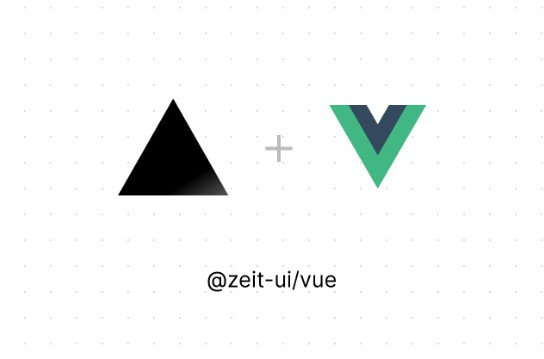

Vue implementation for Zeit Style

 28 April 2019  /  [Css](https://vuejsexamples.com/tag/css/)

# Vue implementation for Zeit Style

## @zeit-ui/vue

Vue implementation for Zeit Style, originating from Zeit Design.

[View Documentation](https://zeit-vue.now.sh/docs)[Download Source](https://github.com/zeit-ui/vue/archive/master.zip)

@zeit-ui/vue is a Vue implementation for zeit style, originating from Zeit Design. Lean more at GITHUB.

The design of the Zeit is concise and aesthetic feeling, this is an important reason for popular of Zeit. Now you can use them through the @zeit-ui/vue.

## Quick Start

1. run `yarn add @zeit-ui/vue` or `npm i @zeit-ui/vue` install it.
2. import to projcet:

	import· ZeitUI· from· '@zeit-ui/vue'␊
	import· '@zeit-ui/vue/dist/zeit-ui.css'␊

Js

## GitHub

### [zeit-ui](http://github.com/zeit-ui)/[vue](http://github.com/zeit-ui/vue)

[153](http://github.com/zeit-ui/vue/watchers)[11](http://github.com/zeit-ui/vue/network/members)

Vue implementation for Zeit Style — [Read More](http://github.com/zeit-ui/vue#readme)

[https://zeit-vue.now.sh](https://zeit-vue.now.sh/)
Latest commit to the **master** branch on 5-10-2019
[Download as zip](http://github.com/zeit-ui/vue/zipball/master)

#### [Vue.js Examples](https://vuejsexamples.com/author/vue/)

A nice collection of often useful examples done in Vue.js

 [Read More](https://vuejsexamples.com/author/vue/)

* * *

 — Vue.js Examples —

### [Css](https://vuejsexamples.com/tag/css/)

 [(L)](https://vuejsexamples.com/a-collection-of-css-effects-made-with-vue-js/)

 [ 12 March 2019 ## A collection of CSS effects made with Vue.js          A collection of CSS effects made with Vue.js.](https://vuejsexamples.com/a-collection-of-css-effects-made-with-vue-js/)

 [(L)](https://vuejsexamples.com/vue-components-for-the-cirrus-css-framework/)

 [ 27 February 2019 ## Vue components for the Cirrus CSS framework          A fully responsive and comprehensive CSS framework with beautiful controls and simplistic structure.](https://vuejsexamples.com/vue-components-for-the-cirrus-css-framework/)

 [(L)](https://vuejsexamples.com/a-simple-style-and-component-library/)

 [ 29 July 2018 ## A simple style and component library          A simple style and component library.](https://vuejsexamples.com/a-simple-style-and-component-library/)

 [See all 9 posts →](https://vuejsexamples.com/tag/css/)

* * *

— Next Post —

 [(L)](https://vuejsexamples.com/messenger-like-chat-app-made-with-vue-js/)

 [ 29 April 2019 ## Messenger-like chat app made with Vue.js          Messenger-like chat app made with Vue.js. Imagine using Messenger but with channels to talk about different topics!](https://vuejsexamples.com/messenger-like-chat-app-made-with-vue-js/)

 [Message](https://vuejsexamples.com/tag/message/)

— Prev Post —

 [(L)](https://vuejsexamples.com/navigation-tree-menu-component-with-nice-integration-with-vue-router-2/)

 [ 27 April 2019 ## Navigation tree menu component with nice integration with vue-router          Navigation tree menu component with nice integration with vue-router.](https://vuejsexamples.com/navigation-tree-menu-component-with-nice-integration-with-vue-router-2/)

 [Navigation](https://vuejsexamples.com/tag/navigation/), [Tree](https://vuejsexamples.com/tag/tree/)