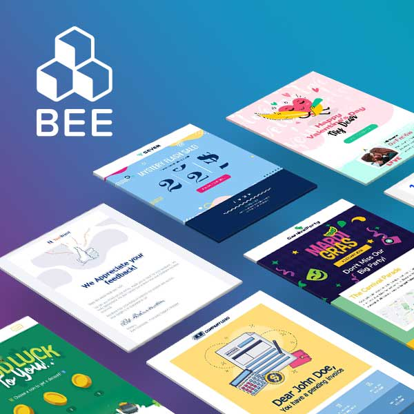

Vue.js: The Documentary | CSS-Tricks

[Home](https://css-tricks.com/)  /[Articles](https://css-tricks.com/archives/)  /

# Vue.js: The Documentary

Author
[Chris Coyier](https://css-tricks.com/author/chriscoyier/)
3 Comments

[Join Conversation' stroke-width='2' stroke-linecap='round' stroke-linejoin='round' data-evernote-id='217' class='js-evernote-checked'%3e%3c/path%3e %3cpath d='M1 12.5H2' stroke='url(%23paint1_linear)' stroke-width='2' stroke-linecap='round' stroke-linejoin='round' data-evernote-id='218' class='js-evernote-checked'%3e%3c/path%3e %3cpath d='M17.5 7L23 12.5L17.5 18' stroke='url(%23paint2_linear)' stroke-width='2' stroke-linecap='round' stroke-linejoin='round' data-evernote-id='219' class='js-evernote-checked'%3e%3c/path%3e %3cdefs data-evernote-id='220' class='js-evernote-checked'%3e %3clinearGradient id='paint0_linear' x1='10.7498' y1='12.5' x2='11.3447' y2='9.73465' gradientUnits='userSpaceOnUse' data-evernote-id='221' class='js-evernote-checked'%3e %3cstop stop-color='%23FF8A00' data-evernote-id='222' class='js-evernote-checked'%3e%3c/stop%3e %3cstop offset='1' stop-color='%23DA1B60' data-evernote-id='223' class='js-evernote-checked'%3e%3c/stop%3e %3c/linearGradient%3e %3clinearGradient id='paint1_linear' x1='1.23436' y1='12.5' x2='2.00945' y2='12.2748' gradientUnits='userSpaceOnUse' data-evernote-id='224' class='js-evernote-checked'%3e %3cstop stop-color='%23FF8A00' data-evernote-id='225' class='js-evernote-checked'%3e%3c/stop%3e %3cstop offset='1' stop-color='%23DA1B60' data-evernote-id='226' class='js-evernote-checked'%3e%3c/stop%3e %3c/linearGradient%3e %3clinearGradient id='paint2_linear' x1='18.789' y1='17.9995' x2='23.3162' y2='17.3419' gradientUnits='userSpaceOnUse' data-evernote-id='227' class='js-evernote-checked'%3e %3cstop stop-color='%23FF8A00' data-evernote-id='228' class='js-evernote-checked'%3e%3c/stop%3e %3cstop offset='1' stop-color='%23DA1B60' data-evernote-id='229' class='js-evernote-checked'%3e%3c/stop%3e %3c/linearGradient%3e %3c/defs%3e %3c/svg%3e)](https://css-tricks.com/vue-js-the-documentary/#comments)

Published
Mar 3, 2020

[documentary](https://css-tricks.com/tag/documentary/)  [vue](https://css-tricks.com/tag/vue/)

Personalized marketing with [Mailchimp](https://ad.doubleclick.net/ddm/clk/460200486;264821600;u)

Hey how cool! [A documentary about Vue!](https://www.youtube.com/watch?v=OrxmtDw4pVI) Good timing as it looks like [VueConf](https://us.vuejs.org/) is happening right now. (Reminder we have [a site for conferences](https://conferences.css-tricks.com/) to tell you stuff like that).

Sarah appears in it (about [21:13](https://youtu.be/OrxmtDw4pVI?t=1273)) and talks about CSS-Tricks for a second, so we're officially super famous now and I have already booked sailing lessons. The series Sarah mentioned [is here](https://css-tricks.com/intro-to-vue-1-rendering-directives-events/).

I'll embed it in the body of the post here.

As it's on the Honeypot YouTube channel, so I imagine it's Honeypot that pays for and produces these things. [They did the same for GraphQL](https://www.youtube.com/watch?v=783ccP__No8) and I enjoyed that one as well. I hope they keep doing them. I'd love to see them for other tech projects that went massive like jQuery, Bootstrap, and npm.

 

   [Create great-looking website forms that do real work. Intuitively add complex calculations, automations and integrations.](https://srv.buysellads.com/ads/click/x/GTND42QYCK7IPKQWCA7LYKQMFT7I55QJCYYDPZ3JCWADC53ECEBD5K7KC6BIEK7IFTBDVK3EHJNCLSIZ)

[Wufoo powers all our web forms here at CSS-Tricks, and has for over a decade!](https://www.wufoo.com/home/?utm_source=css-tricks)

 

   [Drag-n-drop stunning emails, faster! Fantastic design flexibility and 270+ ready-to-use email templates.](https://srv.buysellads.com/ads/click/x/GTND42QYCK7IPKQWCA7LYKQMFT7I55QEFT7DEZ3JCWADC53ECA7DKKQKC6BIEK7IFTBDVK3EHJNCLSIZ)

[WooCommerce is the most popular choice for building an online store. It's what we always use!](https://woocommerce.com/?aff=8638)

 

   [You have users exploring your app! Now what? Send them event-triggered automations. That’s what.](https://srv.buysellads.com/ads/click/x/GTND42QYCK7IPKQWCA7LYKQMFT7I55QECABIVZ3JCWADC53ECAYDKKQKC6BIEK7IFTBDVK3EHJNCLSIZ)

 ![B23623815.265163688;sz=1x1;ord=[timestamp\];dc_lat=;dc_rdid=;tag_for_child_directed_treatment=;tfua=](../_resources/ad4b0f606e0f8465bc4c4c170b37e1a3.gif)

Our Learning Partner

' data-evernote-id='314' class='js-evernote-checked'%3e%3c/polygon%3e%3c/svg%3e)

#### Wanna learn Vue deeply?

[Frontend Masters](https://frontendmasters.com/?utm_source=css-tricks&utm_medium=website&utm_campaign=css-tricks-tags-sidebar) has incredible courses on Vue, from an [Intro to Vue](https://frontendmasters.com/courses/vue/?utm_source=css-tricks&utm_medium=website&utm_campaign=css-tricks-tags-sidebar) course from our very own Sarah Drasner, to [Advanced Vue](https://frontendmasters.com/courses/advanced-vue/?utm_source=css-tricks&utm_medium=website&utm_campaign=css-tricks-tags-sidebar) from the creator himself, Evan You.