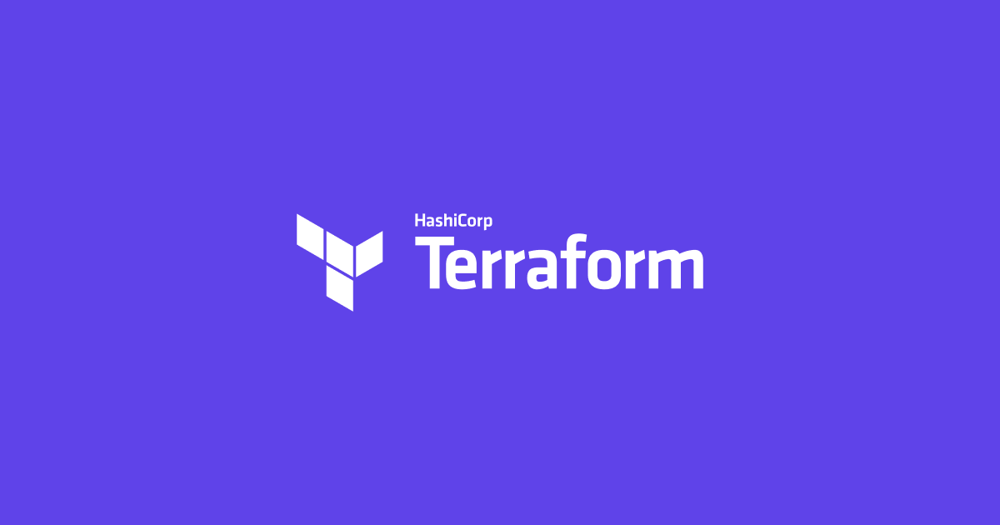

WTF is Terraform – Andrew E. Rhyne – Medium

# WTF is Terraform

[Andrew E. Rhyne](https://medium.com/@thebigredgeek)
May 29·6 min read

Let me be candid: Buzzwords suck. They create unnecessary work hours, missed dinners with family, production outages, and unnecessary refactors of large code bases resulting in the aforementioned undesirable circumstances happening even more often. They also create unhappy clients, missed contracts, lower conversion rates, employee turnover, and more when misapplied as is so often the case.

If you are anything like me, you are pragmatic and care deeply about the 80/20 rule in business. You enjoy working as little as possible for as much value as possible, both for yourself and for your employer and/or clients. So why should you care about yet another buzzphrase like Infrastructure As Code (IAC), or yet another DevOps hipster tool like Terraform? Ansible, Chef, and now Terraform? Give me a break and make up your mind already!

Let’s take a step back and think a little bit about what life looks like without IAC through a parable from the point of view of our favorite DevOps engineer, Bob.

* * *

*...*

### Bob the Builder

Bob is happy. He just landed his dream job as the first DevOps hire at a middle-stage startup called Fooify with an incredibly interesting value proposition in their product. Along with a decent salary, good benefits, and a generous equity package, Bob will have the chance to migrate Fooify’s tech stack from Heroku to a more robust cloud provider of his choice, such as AWS or Google Cloud.

Bob opts for AWS as the Cloud Provider. Bob installs the AWS CLI on his work computer and goes to town provisioning a development environment by setting up Elastic Kubernetes Service, setting up an ingress point, provisioning a managed relational database, setting up queuing with SQS, and more. He provides all engineers at the company with IAM user accounts and roles granting them access to the provisioned infrastructure. He also manually implements a few of his own “special hacks” on the infrastructure configuration to make things more secure and reliable, both via SSH and plain-jane CLI and UI interactions. At the end of this process, Bob feels like a badass and the development team is happy to be working with Kubernetes rather than EC2 or ECS because the developer experience feels amazing and fluid.

Fast forward a couple of weeks, and Bob is asked to provision staging and production environments based on the great success he had with the development environment. Bob once again pulls out his laptop and prepares to provision the environment. There is just one problem: Bob doesn’t remember all of the details of the development environment setup because he is a human and humans forget shit all the time. Bob spends time reverse engineering the existing development setup and builds a setup script in Bash that can be used to provision environments in the future with a single command. Bob checks this script into the company’s monorepo after deploying the two new environments. Crisis averted, Bob feels like a fucking beast and goes to the bar next door with his work friends to get hammered on craft beer and small batch whiskey like a true Silicon Valley geek star.

Over drinks, one of Bob’s coworkers asks him if he has heard of Terraform. Bob scoffs at this, saying that he is too pragmatic to fall for buzzword tech. His coworkers are impressed, knowing that buzzword jockeys often make for the most chaos inducing technical colleagues. Everyone feels great and assured and confident, knowing deeply that the right decisions are being made.

Two weeks later, the company has enough faith in the migration to AWS to pull the trigger and roll the new production environment out to their users. The CEO of the startup is so happy with the work so far that he gives Bob a retention bonus to ensure he doesn’t leave and join the next hot startup that rolls into Palo Alto. Bob and his family are thrilled, and life feels great! Other than the scare two weeks earlier, this has been the best month of work that Bob has experienced in his entire career.

* * *

*...*

### Tokyo Drift

A month later, the first production outage hits the company. Everyone is scrambling like chicken little, as the sky falls down on the entire engineering team. Bob works late into the night trying to find the source of the outage. It appears that containers on EKS can no longer access the RDS database, and the poorly written API application code lacks circuit breakers and is simply timing out requests while attempting to wait on an open connection with RDS with an unlimited retry and zero logging. After digging in a bit more, Bob notices that the VPC peering between the company’s RDS and EKS clusters created by his bash script have been accidentally subverted by a change made by one of the backend engineers on his team. The company is now experiencing it’s first documented case of infrastructure drift, whereby infrastructure configuration in the cloud changes without the provisioning script / program receiving the update in turn and without applying automated testing on the change to make sure that a newly created cluster will still function. Bob’s blood turns to ice when he realizes what is happening and the implications therein. This was simply the first encountered issue. Who knows what other changes have been made by the engineers on his team, and if he can’t remember how to provision infrastructure with the same configuration without a bash script how could his team possibly remember all of the undocumented changes they have been making? What’s more, how can Bob guarantee that the development and staging environments match production if changes can be made to the production environment without enforcing a lockstep change to his bash script? His infrastructure company’s infrastructure has now turned into a mine field, and Bob has reached the point where he anxiously ruminates on work while showering, trying to go to sleep, etc. Bob is no longer happy.

### Lessons learned the hard way

Bob learned the hard way that mutable infrastructure, that is infrastructure that can be changed, causes a plethora of problems stemming from human nature; more specifically, the fact that humans will almost always take the easiest path to solve a problem. When engineers are under crunch, trying to get features out the door or make large sweeping changes that are urgent and important corners will always get cut. However, just as you’d rather put crappy paint on a house than build the house on a shitty foundation, certain corners are better to cut than others. Modifying infrastructure configuration on-the-fly to get shit done is dangerous when changes to infrastructure aren’t **reviewed, tested, and deployed** in the same manner as your application code, and in lockstep with your application code, with the same CI/CD processes already in place. Code depends on the state of your infrastructure, so making changes on the fly to infrastructure is like SSHing into your PHP server and modifying the code with VIM. It’s just plain bad.

This raises an interesting question: How can we describe the state of our infrastructure in the same way that we describe the logic of our code? If you use Kubernetes, you are already used to a similar paradigm with Kubernetes YAML: You define the state of your application code and orchestration system using a file that lives along side your application code in source control. Kubernetes does the heavy lifting to make sure your containers and systems match the state described in the YAML. However, Kubernetes isn’t concerned with Infrastructure: VMs, managed databases, managed queuing systems, IaaS networking rules, IAM, etc. Kubernetes is simply concerned with how you run, access, and manage your containers running your application code. Is there a tool that can manage your infrastructure in the same way that Kubernetes manages your containers? The use of large robust bash scripts to provision infrastructure isn’t easy, so humans on Bob’s team will naturally circumvent any manual process involving that if given the chance or the incentive. There has to be a better way.

* * *

*...*

### Enter Terraform

Terraform is a tool built by Hashicorp for describing the desired state of infrastructure with a Domain-Specific Language (DSL), similar to how you describe the desired state of your workloads with Kubernetes YAML. The Terraform DSL is known as HashiCorp Configuration Language (HCL), and it’s insanely easy to work with once you get a few basics down. You can get a dead simple stack up and running with Terraform on AWS by following Terraform’s [getting started guide](https://learn.hashicorp.com/terraform/#getting-started).

* * *

*...*

### *Follow up*

I won’t be going into detail on this post on how to install or use Terraform, but [follow me on Twitter](https://www.twitter.com/thebigredgeek) as I’ll be posting another blog post next week detailing how you can use Terraform and Kubernetes to spin up a realtime GraphQL API on Google Cloud with NodeJS, Google Kubernetes Engine, Cloud Memstore, and Cloud SQL. Stay tuned!