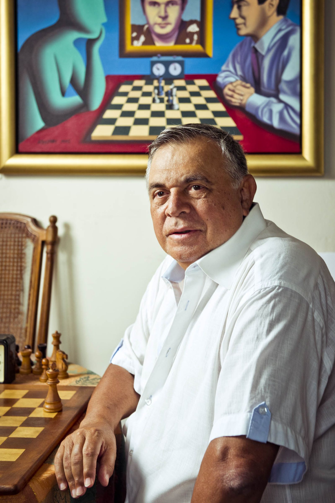
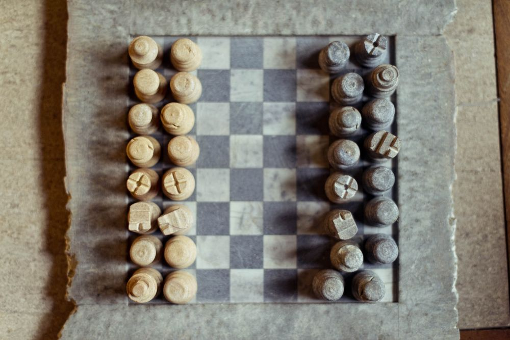
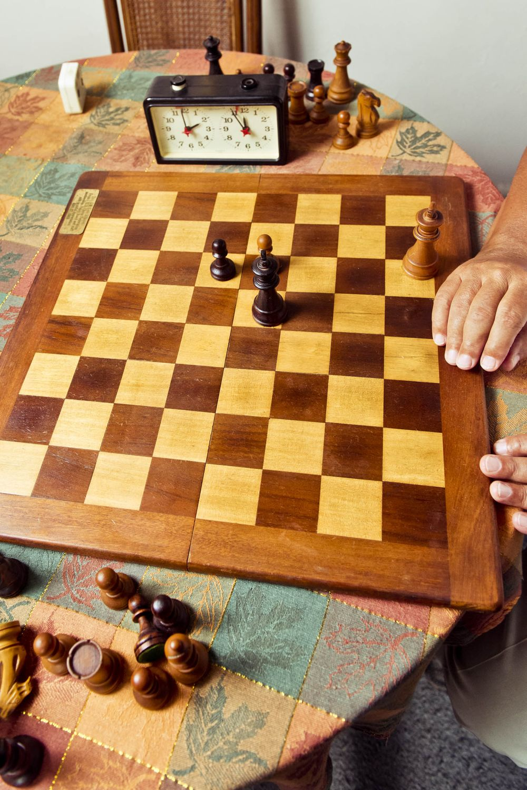
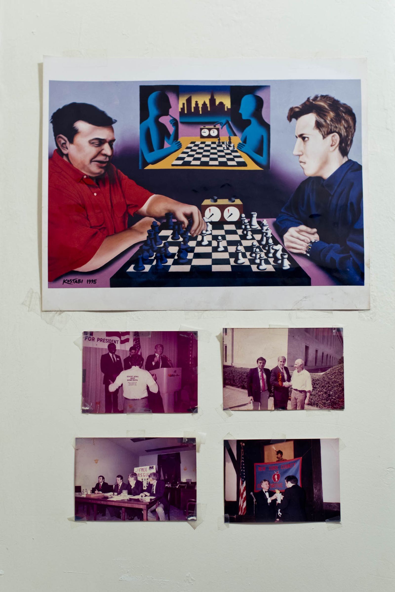

Wall Street’s Best-Kept Secret Is a 72-Year-Old Russian Chess Expert

 

Alburt poses with a pair of queens in Carl Schurz Park in Manhattan.

Photographer: Gabriela Herman for Bloomberg Businessweek

# Wall Street’s Best-Kept Secret Is a 72-Year-Old Russian Chess Expert

For over two decades, Lev Alburt has been teaching strategy, patience, and prognostication to the finest in finance.

By
James Tarmy
 September 21, 2017, 10:01 AM GMT+1

From [(L)](https://www.bloomberg.com/businessweek)  [|Subscribe](https://subscribe.businessweek.com/pubs/BW/BWK/BloombergBusiness_allaccess_05_15_RightRaUS_CA.jsp?cds_page_id=185262&cds_mag_code=BWK&id=1470086454872&lsid=62141620548031319&vid=1)  [|Reprints](https://olt.theygsgroup.com/bloomberg/)

On East 83rd Street there’s a squat brick walk-up that’s a viable contender for the least fancy apartment building on Manhattan’s Upper East Side. But for the past 25 years, Wall Street *machers* and captains of industry have marched up to its gray-carpeted third floor to learn the secrets of attack and defense from Lev Alburt, a three-time U.S. chess champion and one of the most prominent Soviet defectors of the 1970s. Alburt has long been giving ­patter-filled private lessons to New Yorkers from all walks of life, encouraging, cajoling, and reprimanding men and women as they attempt to learn the so-called game of kings.

Wall Street has a fairly well-trodden history with games: During off-hours and downtime, games of chance and risk mitigation such as ­backgammon and bridge offer the opportunity for high-level betting, and chess, with its ­corollaries with game theory, occupies a prime position. In 2015 at the Sohn conference, hundreds of finance professionals such as Bill Ackman paid $5,000 to watch Magnus Carlsen, the Norwegian grandmaster, play simultaneously against three people, blindfolded. George Soros is a well-known and aggressive chess player, as is Saba Capital founder Boaz Weinstein, a chess prodigy who reportedly got his start at Goldman Sachs & Co. when an executive at the bank who’d played him competitively set him up at the trading desk.

“I’d take a walk up there, spend an hour with the chessboard with [Alburt]. We were friendly, we might talk about life a little bit,” says corporate raider Carl Icahn, who took lessons with Alburt for years in an attempt to outplay his son, Brett. “The more you play, the better you get, if you have the time to do it. But obviously [Icahn vs. Alburt] is like a college player who plays Federer. You can never touch a guy like that,” he says. Icahn stopped taking lessons once his son could consistently beat him. (“It takes the fun out of it,” he says.)

Alburt in his home, seated in front of a Mark Kostabi portrait of him.
Photographer: Gabriela Herman for Bloomberg Businessweek

“I’ve been going to Lev every two weeks or so,” says Eliot Spitzer, the former governor of New York and currently the director of Spitzer Enterprises. “It is wonderful, frustrating, intimidating, and demoralizing.” Alburt’s lessons are invariably interspersed with political discussions and a light dose of fatalism—“what you’d expect from a grandmaster from Russia,” Spitzer says, but he keeps coming back. “We always have a good time talking.”

Spitzer was referred to Alburt by another pupil, Doug Hirsch, who manages Seneca Capital Investments LP, a hedge fund-turned-­family office. Additional students of Alburt’s, past and present, have included Ted Field, the billionaire movie producer and heir to the Marshall Field & Co. fortune, and Stephen Friedman, the former chairman of Goldman Sachs and current chairman of Stone Point Capital. When asked about his lessons with Alburt, Friedman says, “There’s nothing that I can add, other than that I was not a good chess player then, and I haven’t gotten any better.”

A stone chess set in Alburt’s apartment.
Photographer: Gabriela Herman for Bloomberg Businessweek

On a recent weekday afternoon, Alburt, 72, answers the door in a Hawaiian shirt. Ushering me inside to the small ­one-bedroom apartment, he offers wine, vodka, or water, in that order. He settles himself among totems of his past achievements: On the wall, a painting by the postsurrealist artist Mark Kostabi depicts a faceless chess player and a portrait-within-a-­portrait of Alburt. There are clusters of awards, photos of him with various luminaries (including Estée Lauder and Garry Kasparov), a small American flag, and many stacks of chess books, 17 of which he wrote.

Alburt’s path from being born in Orenburg, Russia to living in Ukraine to chitchatting with the ex-governor of New York reads, on one level, like a John le Carré novel replete with a cloak-and-­dagger defection to West Germany. But it’s also the story of chess and finance.

He started playing the game when he was 5. By his late teens he reached the designation of master and began to win tournaments. “Then, when I was in college, I became suddenly a much stronger player,” says Alburt, who still speaks with a heavy Russian accent. In his telling, he went from 1,800th in the Soviet Union “to about 30th” in a year.

A framed photograph by Leonid Lubenitsky of Alburt (left) with Kasparov.
Photographer: Gabriela Herman for Bloomberg Businessweek

At the height of the Cold War, when the emphasis on so-called soft power was at a premium and athletes, musicians, and academics who enhanced national prestige were considered state assets, Alburt was one of the better-paid men in the Soviet Union. “By Russian standards, I lived very, very well,” he says. “I was famous. Most people would recognize me on the street. And I could go to the best resorts and so on.”

During that time, he became acquainted with the cream of the Soviet hierarchy, including generals and politicians. But he never joined the Komsomol, the Communist Party’s youth organ, and nourished a quiet, deep hatred for their system. (The day Stalin died was “the best day of my life,” he says. He was 7.)

Alburt was repeatedly exposed to Western culture through the many international chess tournaments he attended, but his defection in 1979 wasn’t about the American quality of life. “To leave wasn’t to look for a better life,” he says. “I knew I’d be much better off economically if I stayed in the Soviet Union.” His decision was a reaction to what he called “the lies that surrounded me.” Books were censored, movement restricted, whole lives predetermined. In a story he tells often, Alburt says he’d made up his mind to defect, lost his nerve, and then, after reading an issue of *Pravda* on the plane and becoming disgusted with Soviet hypocrisy, his resolve returned. On a trip for a chess competition in Cologne, in West Germany, he took a taxi to a police station and asked for asylum.

The card table on which Alburt holds lessons.
Photographer: Gabriela Herman for Bloomberg Businessweek

Like other high-profile defectors, when he came to the West, Alburt had his pick of countries, but he chose the U.S. “I wanted to come here for political reasons,” he says. “I wanted to fight the Soviet regime.”

He soon moved to New York and became a fairly well-known political commentator, more often than not aligned with what he describes as the “conservative, anti-Soviet side.” He developed friendships with New York Republican congressman Jack Kemp and the right-wing commentator Charles Krauthammer (“We’re still the best of friends”), lectured at colleges denouncing the Soviets, and even appeared on Pat Robertson’s conservative Christian TV show, *The 700 Club*, where Alburt, who’s Jewish, prayed with Robertson for the release of one of Alburt’s chess colleagues in Russia.

Meanwhile, he was in the midst of a highly successful and lucrative chess career. “I played chess mostly to make a living,” he says. He competed for the U.S. Chess Olympiad team in Malta in 1980 and won the invitation-only, highly prestigious U.S. Chess Championship in 1984, 1985, and 1990. In 1987 and 1989 he also won the U.S. Open Chess Championship, a tournament where hundreds of people pay to play. Throughout his career, Alburt gave chess lectures, charging “a thousand dollars, at least” per appearance, he says.

After the Berlin Wall fell and the Soviet Union began to collapse, Alburt’s prominence as a commentator grew, and he wound down his competitive chess playing, finally giving it up in 1992. To supplant his dwindling income from tournaments, he slowly began to teach—charging a then-sky-high $100 an hour.

“I didn’t want to have too many students,” he says. He would charge even more to travel—one man paid him $3,000 a day to fly out to his house in California—and raised his fee to $200 an hour if he had to go to a client’s house or office. For trips to Brooklyn he’d often charge as much as $300 an hour. (Today his base rate has risen modestly, to $150 an hour for lessons in his home. Lessons usually last two hours.)

His first students simply approached him at tournaments: a few doctors, lawyers, businessmen, and a man who Alburt says was a fishmonger (“one of my longest-running students”).His clientele eventually grew to include some serious heavy hitters. He met Field, the movie producer, in 1989; on Alburt’s wall is a picture of him playing chess with Field at Greenacres, Field’s 44-room mansion in Beverly Hills. A year later, Field was so enraptured with the chess world that he became a sponsor of the highly publicized World Chess Championship between Kasparov and Anatoly Karpov.

Photographs and a reproduction of a Mark Kostabi painting taped up on the Alburt’s wall.

Photographer: Gabriela Herman for Bloomberg Businessweek

Alburt began to teach Friedman, then the co-chairman of Goldman Sachs, in 1990. He recalls that Friedman would occasionally play the game against juniors at the firm but preferred to do battle against a computer. “He said, ‘Lev, I’m kind of competitive, and I don’t like to lose. But against a computer there’s no pressure,’ ” Alburt says. (Icahn also was a fan of computer opponents: “I hate to say it’s easier, but you have half an hour, you go on the computer, and figure out what the hell you did wrong.”)

In contrast with chess’s deliberative reputation, Alburt says the game helps traders think on their feet. “Strong chess players are good at making quick, usually correct decisions,” he says. “Traders are basically doing the same things as chess ­grandmasters: You have to make quick decisions in by definition uncertain circumstances.” Other chess attributes that help those high up on the ladder, he says, are its emphasis on logic and “making people responsible for their decisions.” Or as Icahn puts it: “If he’s a good chess player, he has a good math mind. So if he’s a good player, he’s not an idiot.” Hirsch of Seneca Capital agrees. “There’s a great satisfaction in ­envisioning how something is going to play out and be right,” he says. While playing chess, Hirsch adds, he credits Alburt “with any good moves I make.” The blunders, he notes, “are all mine.”

Alburt likes it best when the game is divorced from any outside factors, including financial rewards. “Some of [my pupils] just want to understand chess better. Not so much how to do a great open or to have better endgames but to see beautiful combinations,” he says. “Others want to have higher online ratings or aspire to play in tournaments.” Many of his clients from the finance world, he says, “have this idea that it’s a good idea to distract themselves from their work.”

Spitzer, for his part, can’t wrap his head around why Alburt is so popular in financial circles. “I’m surprised so many people on Wall Street like chess,” he jokes. “It has rules.”