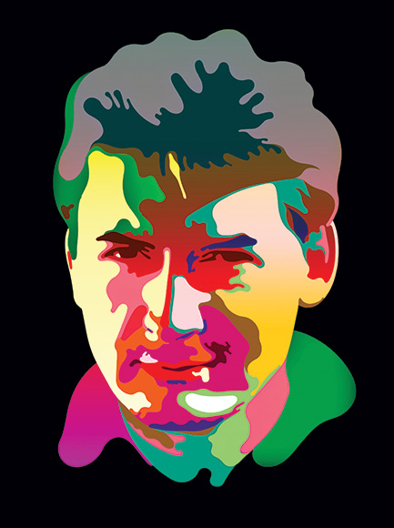
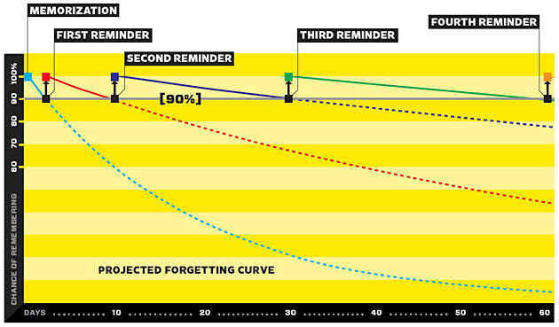
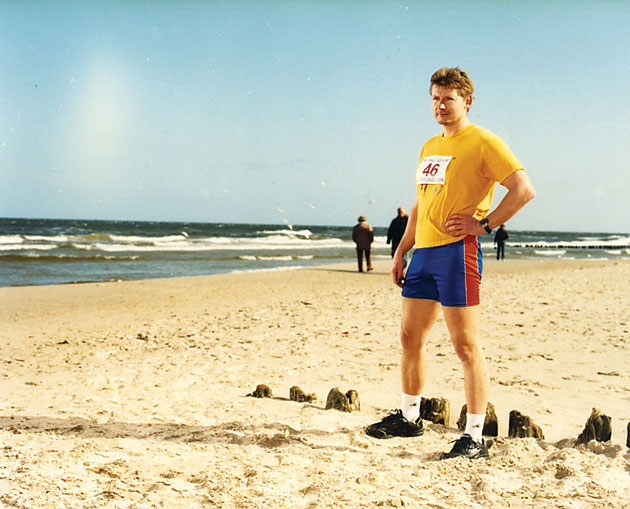

Want to Remember Everything You'll Ever Learn? Surrender to This Algorithm

**The winter sun sets** in mid-afternoon in Kolobrzeg, Poland, but the early twilight does not deter people from taking their regular outdoor promenade. Bundled up in parkas with fur-trimmed hoods, strolling hand in mittened hand along the edge of the Baltic Sea, off-season tourists from Germany stop openmouthed when they see a tall, well-built, nearly naked man running up and down the sand.

"*Kalt? Kalt?*" one of them calls out. The man gives a polite but vague answer, then turns and dives into the waves. After swimming back and forth in the 40-degree water for a few minutes, he emerges from the surf and jogs briefly along the shore. The wind is strong, but the man makes no move to get dressed. Passersby continue to comment and stare. "This is one of the reasons I prefer anonymity," he tells me in English. "You do something even slightly out of the ordinary and it causes a sensation."

Piotr Wozniak's quest for anonymity has been successful. Nobody along this string of little beach resorts recognizes him as the inventor of a technique to turn people into geniuses. A portion of this technique, embodied in a software program called [SuperMemo](http://www.supermemo.com/), has enthusiastic users around the world. They apply it mainly to learning languages, and it's popular among people for whom fluency is a necessity — students from Poland or other poor countries aiming to score well enough on English-language exams to study abroad. A substantial number of them do not pay for it, and pirated copies are ubiquitous on software bulletin boards in China, where it competes with knockoffs like SugarMemo.

SuperMemo is based on the insight that there is an ideal moment to practice what you've learned. Practice too soon and you waste your time. Practice too late and you've forgotten the material and have to relearn it. The right time to practice is just at the moment you're about to forget. Unfortunately, this moment is different for every person and each bit of information. Imagine a pile of thousands of flash cards. Somewhere in this pile are the ones you should be practicing right now. Which are they?

Fortunately, human forgetting follows a pattern. We forget exponentially. A graph of our likelihood of getting the correct answer on a quiz sweeps quickly downward over time and then levels off. This pattern has long been known to cognitive psychology, but it has been difficult to put to practical use. It's too complex for us to employ with our naked brains.

Twenty years ago, Wozniak realized that computers could easily calculate the moment of forgetting if he could discover the right algorithm. SuperMemo is the result of his research. It predicts the future state of a person's memory and schedules information reviews at the optimal time. The effect is striking. Users can seal huge quantities of vocabulary into their brains. But for Wozniak, 46, helping people learn a foreign language fast is just the tiniest part of his goal. As we plan the days, weeks, even years of our lives, he would have us rely not merely on our traditional sources of self-knowledge — introspection, intuition, and conscious thought — but also on something new: predictions about ourselves encoded in machines.

Given the chance to observe our behaviors, computers can run simulations, modeling different versions of our path through the world. By tuning these models for top performance, computers will give us rules to live by. They will be able to tell us when to wake, sleep, learn, and exercise; they will cue us to remember what we've read, help us track whom we've met, and remind us of our goals. Computers, in Wozniak's scheme, will increase our intellectual capacity and enhance our rational self-control.

The reason the inventor of SuperMemo pursues extreme anonymity, asking me to conceal his exact location and shunning even casual recognition by users of his software, is not because he's paranoid or a misanthrope but because he wants to avoid random interruptions to a long-running experiment he's conducting on himself. Wozniak is a kind of algorithmic man. He's exploring what it's like to live in strict obedience to reason. On first encounter, he appears to be one of the happiest people I've ever met.

**In the late 1800s,** a German scientist named Hermann Ebbinghaus made up lists of nonsense syllables and measured how long it took to forget and then relearn them. (Here is an example of the type of list he used: bes dek fel gup huf jeik mek meun pon daus dor gim ke4k be4p bCn hes.) In experiments of breathtaking rigor and tedium, Ebbinghaus practiced and recited from memory 2.5 nonsense syllables a second, then rested for a bit and started again. Maintaining a pace of rote mental athleticism that all students of foreign verb conjugation will regard with awe, Ebbinghaus trained this way for more than a year. Then, to show that the results he was getting weren't an accident, he repeated the entire set of experiments three years later. Finally, in 1885, he published a monograph called *Memory: A Contribution to Experimental Psychology*. The book became the founding classic of a new discipline.

Ebbinghaus discovered many lawlike regularities of mental life. He was the first to draw a learning curve. Among his original observations was an account of a strange phenomenon that would drive his successors half batty for the next century: the spacing effect.

Ebbinghaus showed that it's possible to dramatically improve learning by correctly spacing practice sessions. On one level, this finding is trivial; all students have been warned not to cram. But the efficiencies created by precise spacing are so large, and the improvement in performance so predictable, that from nearly the moment Ebbinghaus described the spacing effect, psychologists have been urging educators to use it to accelerate human progress. After all, there is a tremendous amount of material we might want to know. Time is short.

**How Supermemo Works**

SuperMemo is a program that keeps track of discrete bits of information you've learned and want to retain. For example, say you're studying Spanish. Your chance of recalling a given word when you need it declines over time according to a predictable pattern. SuperMemo tracks this so-called forgetting curve and reminds you to rehearse your knowledge when your chance of recalling it has dropped to, say, 90 percent. When you first learn a new vocabulary word, your chance of recalling it will drop quickly. But after SuperMemo reminds you of the word, the rate of forgetting levels out. The [program](http://www.supermemo.com/articles/soft/smnet.htm) tracks this new decline and waits longer to quiz you the next time.

However, this technique never caught on. The spacing effect is "one of the most remarkable phenomena to emerge from laboratory research on learning," the psychologist Frank Dempster wrote in 1988, at the beginning of a typically sad encomium published in *American Psychologist* under the title "The Spacing Effect: A Case Study in the Failure to Apply the Results of Psychological Research." The sorrrowful tone is not hard to understand. How would computer scientists feel if people continued to use slide rules for engineering calculations? What if, centuries after the invention of spectacles, people still dealt with nearsightedness by holding things closer to their eyes? Psychologists who studied the spacing effect thought they possessed a solution to a problem that had frustrated humankind since before written language: how to remember what's been learned. But instead, the spacing effect became a reminder of the impotence of laboratory psychology.

As a student at the Poznan University of Technology in western Poland in the 1980s, Wozniak was overwhelmed by the sheer number of things he was expected to learn. But that wasn't his most troubling problem. He wasn't just trying to pass his exams; he was trying to learn. He couldn't help noticing that within a few months of completing a class, only a fraction of the knowledge he had so painfully acquired remained in his mind. Wozniak knew nothing of the spacing effect, but he knew that the methods at hand didn't work.

The most important challenge was English. Wozniak refused to be satisfied with the broken, half-learned English that so many otherwise smart students were stuck with. So he created an analog database, with each entry consisting of a question and answer on a piece of paper. Every time he reviewed a word, phrase, or fact, he meticulously noted the date and marked whether he had forgotten it. At the end of the session, he tallied the number of remembered and forgotten items. By 1984, a century after Ebbinghaus finished his second series of experiments on nonsense syllables, Wozniak's database contained 3,000 English words and phrases and 1,400 facts culled from biology, each with a complete repetition history. He was now prepared to ask himself an important question: How long would it take him to master the things he wanted to know?

The answer: too long. In fact, the answer was worse than too long. According to Wozniak's first calculations, success was impossible. The problem wasn't learning the material; it was retaining it. He found that 40 percent of his English vocabulary vanished over time. Sixty percent of his biology answers evaporated. Using some simple calculations, he figured out that with his normal method of study, it would require two hours of practice every day to learn and retain a modest English vocabulary of 15,000 words. For 30,000 words, Wozniak would need twice that time. This was impractical.

Wozniak's discouraging numbers were roughly consistent with the results that Ebbinghaus had recorded in his own experiments and that have been confirmed by other psychologists in the decades since. If students nonetheless manage to become expert in a few of the things they study, it's not because they retain the material from their lessons but because they specialize in a relatively narrow subfield where intense practice keeps their memory fresh. When it comes to language, the received wisdom is that immersion — usually amounting to actual immigration — is necessary to achieve fluency. On one hand, this is helpful advice. On the other hand, it's an awful commentary on the value of countless classroom hours. Learning things is easy. But remembering them — this is where a certain hopelessness sets in.

As Wozniak later wrote in describing the failure of his early learning system: "The process of increasing the size of my databases gradually progressed at the cost of knowledge retention." In other words, as his list grew, so did his forgetting. He was climbing a mountain of loose gravel and making less and less progress at each step.

*Photo: Patrick Voigt***The problem of forgetting** might not torment us so much if we could only convince ourselves that remembering isn't important. Perhaps the things we learn — words, dates, formulas, historical and biographical details — don't really matter. Facts can be looked up. That's what the Internet is for. When it comes to learning, what really matters is how things fit together. We master the stories, the schemas, the frameworks, the paradigms; we rehearse the lingo; we swim in the episteme.

The disadvantage of this comforting notion is that it's false. "The people who criticize memorization — how happy would they be to spell out every letter of every word they read?" asks Robert Bjork, chair of UCLA's psychology department and one of the most eminent memory researchers. After all, Bjork notes, children learn to read whole words through intense practice, and every time we enter a new field we become children again. "You can't escape memorization," he says. "There is an initial process of learning the names of things. That's a stage we all go through. It's all the more important to go through it rapidly." The human brain is a marvel of associative processing, but in order to make associations, data must be loaded into memory.

Once we drop the excuse that memorization is pointless, we're left with an interesting mystery. Much of the information does remain in our memory, though we cannot recall it. "To this day," Bjork says, "most people think about forgetting as decay, that memories are like footprints in the sand that gradually fade away. But that has been disproved by a lot of research. The memory appears to be gone because you can't recall it, but we can prove that it's still there. For instance, you can still recognize a 'forgotten' item in a group. Yes, without continued use, things become inaccessible. But they are not gone."

After an ichthyologist named David Starr Jordan became the first president of Stanford University in the 1890s, he bequeathed to memory researchers one of their favorite truisms: Every time he learned the name of a student, Jordan is said to have complained, he forgot the name of a fish. But the fish to which Jordan had devoted his research life were still there, somewhere beneath the surface of consciousness. The difficulty was in catching them.

During the years that Wozniak struggled to master English, Bjork and his collaborator, Elizabeth Bjork (she is also a professor of psychology; the two have been married since 1969), were at work on a new theory of forgetting. Both were steeped in the history of laboratory research on memory, and one of their goals was to get to the bottom of the spacing effect. They were also curious about the paradoxical tendency of older memories to become stronger with the passage of time, while more recent memories faded. Their explanation involved an elegant model with deeply counterintuitive implications.

Long-term memory, the Bjorks said, can be characterized by two components, which they named retrieval strength and storage strength. Retrieval strength measures how likely you are to recall something right now, how close it is to the surface of your mind. Storage strength measures how deeply the memory is rooted. Some memories may have high storage strength but low retrieval strength. Take an old address or phone number. Try to think of it; you may feel that it's gone. But a single reminder could be enough to restore it for months or years. Conversely, some memories have high retrieval strength but low storage strength. Perhaps you've recently been told the names of the children of a new acquaintance. At this moment they may be easily accessible, but they are likely to be utterly forgotten in a few days, and a single repetition a month from now won't do much to strengthen them at all.

The Bjorks were not the first psychologists to make this distinction, but they and a series of collaborators used a broad range of experimental data to show how these laws of memory wreak havoc on students and teachers. One of the problems is that the amount of storage strength you gain from practice is inversely correlated with the current retrieval strength. In other words, the harder you have to work to get the right answer, the more the answer is sealed in memory. Precisely those things that seem to signal we're learning well — easy performance on drills, fluency during a lesson, even the subjective feeling that we know something — are misleading when it comes to predicting whether we will remember it in the future. "The most motivated and innovative teachers, to the extent they take current performance as their guide, are going to do the wrong things," Robert Bjork says. "It's almost sinister."

The most popular learning systems sold today — for instance, foreign language software like Rosetta Stone — cheerfully defy every one of the psychologists' warnings. With its constant feedback and easily accessible clues, Rosetta Stone brilliantly creates a sensation of progress. "Go to Amazon and look at the reviews," says Greg Keim, Rosetta Stone's CTO, when I ask him what evidence he has that people are really remembering what they learn. "That is as objective as you can get in terms of a user's sense of achievement." The sole problem here, from the psychologists' perspective, is that the user's sense of achievement is exactly what we should most distrust.

The battle between lab-tested techniques and conventional pedagogy went on for decades, and it's fair to say that the psychologists lost. All those studies of human memory in the lab — using nonsense syllables, random numbers, pictures, maps, foreign vocabulary, scattered dots — had so little influence on actual practice that eventually their irrelevance provoked a revolt. In the late '70s, Ulric Neisser, the pioneering researcher who coined the term cognitive psychology, launched a broad attack on the approach of Ebbinghaus and his scientific kin.

"We have established firm empirical generalizations, but most of them are so obvious that every 10-year-old knows them anyway," Neisser complained. "We have an intellectually impressive group of theories, but history offers little confidence that they will provide any meaningful insight into natural behavior." Neisser encouraged psychologists to leave their labs and study memory in its natural environment, in the style of ecologists. He didn't doubt that the laboratory theories were correct in their limited way, but he wanted results that had power to change the world.

Many psychologists followed Neisser. But others stuck to their laboratory methods. The spacing effect was one of the proudest lab-derived discoveries, and it was interesting precisely because it was not obvious, even to professional teachers. The same year that Neisser revolted, Robert Bjork, working with Thomas Landauer of Bell Labs, published the results of two experiments involving nearly 700 undergraduate students. Landauer and Bjork were looking for the optimal moment to rehearse something so that it would later be remembered. Their results were impressive: The best time to study something is at the moment you are about to forget it. And yet — as Neisser might have predicted — that insight was useless in the real world. Determining the precise moment of forgetting is essentially impossible in day-to-day life.

Obviously, computers were the answer, and the idea of using them was occasionally suggested, starting in the 1960s. But except for experimental software, nothing was built. The psychologists were interested mainly in theories and models. The teachers were interested in immediate signs of success. The students were cramming to pass their exams. The payoff for genuine progress was somehow too abstract, too delayed, to feed back into the system in a useful way. What was needed was not an academic psychologist but a tinkerer, somebody with a lot of time on his hands, a talent for mathematics, and a strangely literal temperament that made him think he should actually recall the things he learned.

**The day I first meet Wozniak,** we go for a 7-mile walk down a windy beach. I'm in my business clothes and half comatose from jet lag; he's wearing a track suit and comes toward me with a gait so buoyant he seems about to take to the air. He asks me to walk on the side away from the water. "People say that when I get excited I tend to drift in their direction, so it is better that I stand closer to the sea so I don't push you in," he says.

Wozniak takes an almost physical pleasure in reason. He loves to discuss things with people, to get insight into their personalities, and to give them advice — especially in English. One of his most heartfelt wishes is that the world have one language and one currency so this could all be handled more efficiently. He's appalled that Poland is still not in the Eurozone. He's baffled that Americans do not use the metric system. For two years he kept a diary in Esperanto.

Although Esperanto was the ideal expression of his universalist dreams, English is the leading real-world implementation. Though he has never set foot in an English-speaking country, he speaks the language fluently. "Two words that used to give me trouble are *perspicuous* and *perspicacious*," he confessed as we drank beer with raspberry syrup at a tiny beachside restaurant where we were the only customers. "Then I found a mnemonic to enter in SuperMemo: clear/clever. Now I never misuse them."

Wozniak's command of English is the result of a series of heroic experiments, in the tradition of Ebbinghaus. They involved relentless sessions of careful self-analysis, tracked over years. He began with the basic conundrum of too much to study in too little time. His first solution was based on folk wisdom. "It is a common intuition," Wozniak later wrote, "that with successive repetitions, knowledge should gradually become more durable and require less frequent review."

This insight had already been proven by Landauer and Bjork, but Wozniak was unaware of their theory of forgetting or of any of the landmark studies in laboratory research on memory. This ignorance was probably a blessing, because it forced him to rely on pragmatic engineering. In 1985, he divided his database into three equal sets and created schedules for studying each of them. One of the sets he studied every five days, another every 18 days, and the third at expanding intervals, increasing the period between study sessions each time he got the answers right.

This experiment proved that Wozniak's first hunch was too simple. On none of the tests did his recall show significant improvement over the naive methods of study he normally used. But he was not discouraged and continued making ever more elaborate investigations of study intervals, changing the second interval to two days, then four days, then six days, and so on. Then he changed the third interval, then the fourth, and continued to test and measure, measure and test, for nearly a decade. His conviction that forgetting could be tamed by following rules gave him the intellectual fortitude to continue searching for those rules. He doggedly traced a matrix of paths, like a man pacing off steps in a forest where he is lost.

All of his early work was done on paper. In the computer science department at the Poznan University of Technology, "we had a single mainframe of Polish-Russian design, with punch cards," Wozniak recalls. "If you could stand in line long enough to get your cards punched, you could wait a couple of days more for the machine to run your cards, and then at last you got a printout, which was your output."

The personal computer revolution was already pretty far along in the US by the time Wozniak managed to get his hands on an Amstrad PC 1512, imported through quasi-legal means from Hamburg, Germany. With this he was able to make another major advance in SuperMemo — computing the difficulty of any fact or study item and adjusting the unique shape of the predicted forgetting curve for every item and user. A friend of Wozniak's adapted his software to run on Atari machines, and as access to personal computers finally spread among students, so did SuperMemo.

After the collapse of Polish communism, Wozniak and some fellow students formed a company, SuperMemo World. By 1995, their program was one of the most successful applications developed by the country's fledgling software industry, and they were searching for funding that would allow them to relocate to Silicon Valley. That year, at Comdex in Las Vegas, 200,000 people got a look at Sony's new DVD technology, prototypes of flatscreens, and Wozniak's SuperMemo, which became the first Polish product shown at the great geek carnival, then at the height of its influence. In Europe, the old communist experiment in human optimization had run its course. Wozniak believed that in a world of open competition, where individuals are rewarded on merit, a scientific tool that accelerated learning would find customers everywhere.

**Wozniak's chief partner** in the campaign to reprogram the world's approach to learning through SuperMemo was Krzysztof Biedalak, who had been his classmate at the University of Technology. The two men used to run 6 miles to a nearby lake for an icy swim. Biedalak agrees with Wozniak that winter swimming is good for mental health. Biedalak also agrees with Wozniak that SuperMemo produces extreme learning. But Biedalak does not agree with Wozniak about everything. "I don't apply his whole technique," he says. "In my context, his technique is inapplicable."

What Biedalak means by Wozniak's technique is the extension of algorithmic optimization to all dimensions of life. Biedalak is CEO of SuperMemo World, which sells and licenses Wozniak's invention. Today, SuperMemo World employs just 25 people. The venture capital never came through, and the company never moved to California. About 50,000 copies of SuperMemo were sold in 2006, most for less than $30. Many more are thought to have been pirated.

Biedalak and I meet and talk in a restaurant in downtown Warsaw where the shelves are covered in gingham and the walls are lined with jars of pickled vegetables. He has an intelligent, somewhat hangdog expression, like a young Walter Matthau, and his tone is as measured as Wozniak's is impulsive. Until I let the information slip, he doesn't even know the exact location of his partner and friend.

"Piotr would never go out to promote the product, wouldn't talk to journalists, very rarely agreed to meet with somebody," Biedalak says. "He was the driving force, but at some point I had to accept that you cannot communicate with him in the way you can with other people."

The problem wasn't shyness but the same intolerance for inefficient expenditure of mental resources that led to the invention of SuperMemo in the first place. By the mid-'90s, with SuperMemo growing more and more popular, Wozniak felt that his ability to rationally control his life was slipping away. "There were 80 phone calls per day to handle. There was no time for learning, no time for programming, no time for sleep," he recalls. In 1994, he disappeared for two weeks, leaving no information about where he was. The next year he was gone for 100 days. Each year, he has increased his time away. He doesn't own a phone. He ignores his email for months at a time. And though he holds a PhD and has published in academic journals, he never attends conferences or scientific meetings.

Instead, Wozniak has ridden SuperMemo into uncharted regions of self-experimentation. In 1999, he started making a detailed record of his hours of sleep, and now he's working to correlate that data with his daily performance on study repetitions. Psychologists have long believed there's a correlation between sleep and memory, but no mathematical law has been discovered. Wozniak has also invented a way to apply his learning system to his intake of unstructured information from books and articles, winnowing written material down to the type of discrete chunks that can be memorized, and then scheduling them for efficient learning. He selects a short section of what he's reading and copies it into the SuperMemo application, which predicts when he'll want to read it again so it sticks in his mind. He cuts and pastes completely unread material into the system, assigning it a priority. SuperMemo shuffles all his potential knowledge into a queue and presents it to him on a study screen when the time is right. Wozniak can look at a graph of what he's got lined up to learn and adjust the priority rankings if his goals change.

These techniques are designed to overcome steep learning curves through automated steps, like stairs on a hill. He calls it incremental reading, and it has come to dominate his intellectual life. Wozniak no longer wastes time worrying that he hasn't gotten to some article he wants to read; once it's loaded into the system, he trusts his algorithm to apportion it to his consciousness at the appropriate time.

The appropriate time, that is, for him. Having turned over his mental life to a computerized system, he refuses to be pushed around by random inputs and requests. Naturally, this can be annoying to people whose messages tend to sift to the bottom. "After four months," Biedalak says sadly, "you sometimes get a reply to some sentence in an email that has been scrambled in his incremental reading process."

For Wozniak, these misfires were less a product of scrambling than of an inevitable clash of goals. A person who understands the exact relationship between learning and time is forced to measure out his hours with a certain care. SuperMemo was like a genie that granted Wozniak a wish: unprecedented power to remember. But the value of what he remembered depended crucially on what he studied, and what he studied depended on his goals, and the selection of his goals rested upon the efficient acquisition of knowledge, in a regressive function that propelled him relentlessly along the path he had chosen. The guarantee that he would not forget what he learned was both a gift and a demand, requiring him to sacrifice every extraneous thing.

From the business side of SuperMemo, Wozniak's priorities can sometimes look selfish. Janusz Murakowski, one of Wozniak's friends who worked as a manager at the company during its infancy, thinks that Wozniak's focus on his own learning has stunted the development of his invention. "Piotr writes this software for himself," says Murakowski, now a professor of electrical engineering at the University of Delaware. "The interface is just impossible." This is perhaps a bit unfair. SuperMemo comes in eight flavors, some of which were coded by licensees: SuperMemo for Windows, for Palm devices, for several cell phones, even an Internet version. It's true that Wozniak is no Steve Jobs, and his software has none of the viral friendliness of a casual game like *Brain Age* for Nintendo DS. Still, it can hardly be described as the world's most difficult program. After all, photographers can learn to produce the most arcane effects in Photoshop. Why shouldn't more people be able to master SuperMemo?

"It was never a feel-good product," Murakowski says, and here he may be getting closer to the true conflict that lies at the heart of the struggle to optimize intelligence, a conflict that transcends design and touches on some curious facts about human nature. We are used to the idea that normal humans can perform challenging feats of athleticism. We all know someone who has run a marathon or ridden a bike cross-country. But getting significantly smarter — that seems to be different. We associate intelligence with pure talent, and academic learning with educational experiences dating far back in life. To master a difficult language, to become expert in a technical field, to make a scientific contribution in a new area — these seem like rare things. And so they are, but perhaps not for the reason we assume.

The failure of SuperMemo to transform learning uncannily repeats the earlier failures of cognitive psychology to influence teachers and students. Our capacity to learn is amazingly large. But optimal learning demands a kind of rational control over ourselves that does not come easily. Even the basic demand for regularity can be daunting. If you skip a few days, the spacing effect, with its steady march of sealing knowledge in memory, begins to lose its force. Progress limps. When it comes to increasing intelligence, our brain is up to the task and our technology is up to the task. The problem lies in our temperament.

**The Baltic Sea** is dark as an unlit mirror. Wozniak and I walk along the shore, passing the wooden snack stands that won't be open until spring, and he tells me how he manages his life. He's married, and his wife shares his lifestyle. They swim together in winter, and though Polish is their native language, they communicate in English, which she learned with SuperMemo. Wozniak's days are blocked into distinct periods: a creative period, a reading and studying period, an exercise period, an eating period, a resting period, and then a second creative period. He doesn't get up at a regular hour and is passionate against alarm clocks. If excitement over his research leads him to work into the night, he simply shifts to sleeping in the day. When he sits down for a session of incremental reading, he attends to whatever automatically appears on his computer screen, stopping the instant his mind begins to drift or his comprehension falls too low and then moving on to the next item in the queue. SuperMemo graphs a distribution of priorities that he can adjust as he goes. When he encounters a passage that he thinks he'll need to remember, he marks it; then it goes into a pattern of spaced repetition, and the information it contains will stay in his brain indefinitely.

"Once you get the snippets you need," Wozniak says, "your books disappear. They gradually evaporate. They have been translated into knowledge."

As a science fiction fan, I had always assumed that when computers supplemented our intelligence, it would be because we outsourced some of our memory to them. We would ask questions, and our machines would give oracular — or supremely practical — replies. Wozniak has discovered a different route. When he entrusts his mental life to a machine, it is not to throw off the burden of thought but to make his mind more swift. Extreme knowledge is not something for which he programs a computer but for which his computer is programming him.

I've already told Wozniak that I am not optimistic about my ability to tame old reading habits in the name of optimized knowledge. Books, for me, are not merely sources of information I might want to load into memory but also subjective companions, almost substitute people, and I don't see why I would want to hold on to them in fragments. Still, I tell him I would like to give it a shot.

"So you believe in trying things for yourself?" he asks.

"Yes."

This provides his opening. "In that case, let's go swimming."

At the edge of the sea, I become afraid. I'm a strong swimmer, but there's something about standing on the beach in the type of minuscule bathing suit you get at the gift shop of a discount resort in Eastern Europe, and watching people stride past in their down parkas, that smacks of danger.

"I'm already happy with anticipation," Wozniak says.
"Will I have a heart attack?"

"There is less risk than on your drive here," he answers.

I realize he must be correct. Poland has few freeways, and in the rural north, lines of cars jockey behind communist-era farm machinery until they defy the odds and try to pass. There are spectacular wrecks. Wozniak gives close attention to the qualitative estimate of fatal risks. By graphing the acquisition of knowledge in SuperMemo, he has realized that in a single lifetime one can acquire only a few million new items. This is the absolute limit on intellectual achievement defined by death. So he guards his health. He rarely gets in a car. The Germans on the beach are staring at me. I dive in.

Philosopher William James once wrote that mental life is controlled by noticing. Climbing out of the sea and onto the windy beach, my skin purple and my mind in a reverie provoked by shock, I find myself thinking of a checklist Wozniak wrote a few years ago describing how to become a genius. His advice was straightforward yet strangely terrible: You must clarify your goals, gain knowledge through spaced repetition, preserve health, work steadily, minimize stress, refuse interruption, and never resist sleep when tired. This should lead to radically improved intelligence and creativity. The only cost: turning your back on every convention of social life. It is a severe prescription. And yet now, as I grin broadly and wave to the gawkers, it occurs to me that the cold rationality of his approach may be only a surface feature and that, when linked to genuine rewards, even the chilliest of systems can have a certain visceral appeal. By projecting the achievement of extreme memory back along the forgetting curve, by provably linking the distant future — when we will know so much — to the few minutes we devote to studying today, Wozniak has found a way to condition his temperament along with his memory. He is making the future noticeable. He is trying not just to learn many things but to warm the process of learning itself with a draft of utopian ecstasy.

*Contributing editor Gary Wolf* ([gary@aether.com](https://www.wired.com/2008/04/ff-wozniak/mailto:gary@aether.com)) *wrote about futurist Ray Kurzweil in issue 16.04.*

Related Get Smarter: [12 Hacks That Will Amp Up Your Brainpower](https://www.wired.com/medtech/health/magazine/16-05/gs_intro) 1: [Distract Yourself](https://www.wired.com/medtech/health/magazine/16-05/gs_01distract) 2: [Caffeinate With Care](https://www.wired.com/medtech/health/magazine/16-05/gs_02caffeinate) 3: [Choose Impressive Information](https://www.wired.com/special_multimedia/2008/gs_03feedyourmind) 4: [Think Positive](https://www.wired.com/medtech/health/magazine/16-05/gs_04thinkpositive) 5: [Do the Right Drugs](https://www.wired.com/medtech/health/magazine/16-05/gs_05drugs) 6: [Juice Your IQ Score](https://www.wired.com/medtech/health/magazine/16-05/gs_06iqtest) 7: [Know Your Brain](https://www.wired.com/medtech/health/magazine/16-05/gs_07yourbrain) 8: [Don't Panic](https://www.wired.com/medtech/health/magazine/16-05/gs_08dontpanic) 9: [Embrace Chaos](https://www.wired.com/medtech/health/magazine/16-05/gs_09embracechaos) 10: [Get Visual](https://www.wired.com/medtech/health/magazine/16-05/gs_10getvisual) 11: [Exercise Wisely](https://www.wired.com/medtech/health/magazine/16-05/gs_11exercise) 12: [Slow Down](https://www.wired.com/medtech/health/magazine/16-05/gs_12slowdown) Plus: [6 Intelligence Myths Exposed](https://www.wired.com/medtech/health/magazine/16-05/gs_myths)