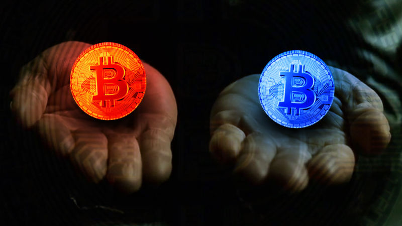
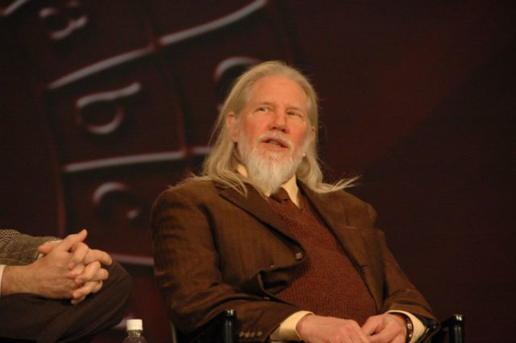
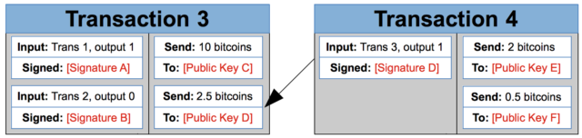
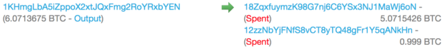

Want to really understand how bitcoin works? Here’s a gentle primer

####  Deep dive —

# Want to really understand how bitcoin works? Here’s a gentle primer

## Ars goes deep on the breakthrough online payment network.

 [Timothy B. Lee](https://arstechnica.com/author/timlee/) - 12/15/2017, 12:35 PM

 

[Enlarge](https://cdn.arstechnica.net/wp-content/uploads/2017/12/bitcoin-matrix.jpg)

The Matrix / Aurich

[reader comments108](https://arstechnica.com/tech-policy/2017/12/how-bitcoin-works/?comments=1)

 Share this story  [(L)](https://www.facebook.com/sharer.php?u=https%3A%2F%2Farstechnica.com%2F%3Fpost_type%3Dpost%26p%3D1227267)  [(L)](https://twitter.com/share?text=Want+to+really+understand+how+bitcoin+works%3F+Here%E2%80%99s+a+gentle+primer&url=https%3A%2F%2Farstechnica.com%2F%3Fpost_type%3Dpost%26p%3D1227267)  [(L)](https://www.reddit.com/submit?url=https%3A%2F%2Farstechnica.com%2F%3Fpost_type%3Dpost%26p%3D1227267&title=Want+to+really+understand+how+bitcoin+works%3F+Here%E2%80%99s+a+gentle+primer)  [(L)](https://plus.google.com/share?url=https%3A%2F%2Farstechnica.com%2F%3Fpost_type%3Dpost%26p%3D1227267)

The soaring price of bitcoin—the virtual currency is now worth more than $250 billion—has gotten a lot of attention in recent weeks. But the real significance of bitcoin isn't just its rising value. It's the technological breakthrough that allowed the network to exist in the first place.

Bitcoin's still anonymous inventor, who went by the pseudonym Satoshi Nakamoto, figured out a completely new way for a decentralized network to reach a consensus about a shared transaction ledger. This innovation made possible the kind of fully decentralized electronic payment systems that [cypherpunks](https://en.wikipedia.org/wiki/Cypherpunk) had dreamed about for decades.

As part of our recent efforts to shed light on the mechanics of the popular cryptocurrency, today we'll provide in-depth explanation of how bitcoin works, starting with the basics: how do digital signatures make digital cash possible? How did Nakamoto's invention of the blockchain solve the double-spending problem that had limited earlier digital cash efforts?

We'll also explore more recent happenings like the block size debate that has divided the bitcoin community into two warring camps. And finally, we'll look at the future and talk about why bitcoin's design could make it a uniquely fertile platform for innovation in the coming years. As you're about to see, there's simply *a lot *to cover.

## Asymmetric encryption made digital cash possible

[Enlarge](https://cdn.arstechnica.net/wp-content/uploads/2017/12/382336900_f874c2b7b7_o.jpg)  / Whitfield Diffie was a key figure in the development of public-key cryptography and digital signatures in the 1970s.

[Dan Farber](https://www.flickr.com/photos/farber/382336900/in/photolist-zMzrw-2kMDw-ebCJaz-qNpQJ-9ThSt3-4DW2ER)

Until the 1970s, all publicly known encryption schemes were symmetric: the recipient of an encrypted message would use the same secret key to unscramble the message that the sender had used to scramble it. But that all changed with the invention of asymmetric encryption schemes. These were schemes in which the key to decrypt a message (known as the private key) was different from the key needed to encrypt it (known as the public key)—and there was no practical way for someone who only had the public key to figure out the private key.

This meant you could publish your public key widely, allowing anyone to use it to encrypt a message that only you—as the holder of the private key—could decrypt. This breakthrough transformed the field of cryptography because it became possible for any two people to communicate securely over an unsecured channel without establishing a shared secret first.

Asymmetric encryption also had another groundbreaking application: digital signatures. In normal public-key cryptography, a sender encrypts a message with the recipient's public key and then the recipient decrypts it with her private key. But you can also flip this around: have the sender encrypt a message with his own *private* key and the recipient decrypt it with the sender's public key.

That doesn't protect the secrecy of the message since anyone can get the public key. Instead, it provides cryptographic proof that the message was created by the owner of the private key. Anyone who has the public key can verify the proof without knowing the private key.

[(L)](https://arstechnica.com/tech-policy/2017/12/bitcoin-a-beginners-guide/)

### Further Reading

[Bitcoin: Seven questions you were too embarrassed to ask](https://arstechnica.com/tech-policy/2017/12/bitcoin-a-beginners-guide/)

People soon realized that these digital signatures could make cryptographically secure digital cash possible. Using the classic example scenario, let's suppose Alice owns a coin and wants to transfer it to Bob.

She'll write a message that says, "I, Alice, transfer my coin to Bob," and then sign the message by encrypting it with her private key. Now Bob—or anyone else—can decrypt the signature using Alice's public key. Since only Alice could have created the encrypted message, Bob can use it to demonstrate that he's now the rightful owner of the coin.

If Bob wants to transfer the coin to Carol, he follows the same procedure, declaring that he's transferring the coin to Carol and encrypting the message with his private key. Carol can then use this chain of signatures—Alice's signature transferring the coin to Bob, and Bob's signature transferring the coin to Carol—as proof that she now owns the coin.

Notice that none of this requires an official third party to authorize or authenticate the transactions. Alice, Bob, and Carol can generate their own public-private key pairs without help from third parties. Anyone who knows Alice's and Bob's public keys can independently verify that the chain of signatures is cryptographically valid. Digital signatures—combined with a few innovations we'll discuss later—let people engage in banking without needing a bank.

## How bitcoin transactions work

The generic digital cash scheme I described in the previous section is very close to how real bitcoin payments work. Here's a simplified diagram of what real bitcoin transactions look like:

[Enlarge](https://cdn.arstechnica.net/wp-content/uploads/2017/12/Screen-Shot-2017-12-14-at-9.47.54-AM.png)

A bitcoin transaction contains a list of inputs and outputs. Each output has a public key associated with it. For a later transaction to spend those coins, it needs an input with a matching digital signature. Bitcoin uses [elliptic curve cryptography](https://arstechnica.com/information-technology/2013/10/a-relatively-easy-to-understand-primer-on-elliptic-curve-cryptography/) for digital signatures.

[(L)](https://arstechnica.com/information-technology/2013/10/a-relatively-easy-to-understand-primer-on-elliptic-curve-cryptography/)

### Further Reading

[A (relatively easy to understand) primer on elliptic curve cryptography](https://arstechnica.com/information-technology/2013/10/a-relatively-easy-to-understand-primer-on-elliptic-curve-cryptography/)

For example, suppose you own the private key corresponding to Public Key D in the diagram above. Someone wants to send you 2.5 bitcoins. The person will create a transaction like Transaction 3, with 2.5 bitcoins going to you—the owner of Public Key D.

When you're ready to spend those bitcoins, you create a new transaction like Transaction 4. You list Transaction 3, output 1 as a source of the funds (outputs are zero-indexed, so output 1 is the second output). You use your private key to generate Signature D, a signature that can be verified with Public Key D. These 2.5 bitcoins are then split up between two new outputs: 2 bitcoins for Public Key E and 0.5 bitcoins for Public Key F. Now they can only be spent by the owners of the corresponding private keys.

A transaction can have multiple inputs, and it must spend all of the bitcoins from the corresponding outputs of earlier transactions. If a transaction outputs fewer bitcoins than it takes in, the difference is treated as a transaction fee collected by the bitcoin miner who processed the transaction (more details on this later).

On the bitcoin network, the addresses people use to send each other bitcoins are derived from public keys like Public Key D. The exact details of bitcoin's address format are [complicated](https://en.bitcoinwiki.org/wiki/Bitcoin_address?mobileaction=toggle_view_desktop) and have changed over time, but you can think of a bitcoin address as a hash (a short, seemingly random string of bits that serves as a cryptographic fingerprint) of a public key. Bitcoin addresses are encoded in a custom format called [Base58Check](https://en.bitcoin.it/wiki/Base58Check_encoding) that minimizes the risk of mistyping. A typical bitcoin address is "18ZqxfuymzK98G7nj6C6YSx3NJ1MaWj6oN."

A [real-world transaction](https://blockchain.info/tx/ae51116179e79bd6ecaf72fcdc743375a49467bfc219b114fb81d630ce31a00b) looks like this:

[Enlarge](https://cdn.arstechnica.net/wp-content/uploads/2017/12/Screen-Shot-2017-12-06-at-9.24.54-PM.png)

[Blockchain.info](https://blockchain.info/tx/ae51116179e79bd6ecaf72fcdc743375a49467bfc219b114fb81d630ce31a00b)

This transaction took 6.07 bitcoins from one input address and split it between two output addresses. One output address got a bit more than 5 bitcoins, while the other got slightly less than 1 bitcoin. Most likely, one of those output addresses belongs to the sender—sending "change" back to themselves—while the other belongs to a third-party recipient.

Of course, real bitcoin transactions can be more complex than the simple examples I've shown so far. Probably the most important feature not illustrated above is that in place of a public key, an output can have a verification script written in a [simple bitcoin-specific scripting language](https://en.bitcoin.it/wiki/Script). To spend that output, a subsequent transaction must have parameters that allow the script to evaluate to true.

This allows the bitcoin network to enforce arbitrarily complex conditions governing how the money can be spent. For example, a script could require three different signatures held by different people and also require that the money not be spent prior to some future date. Unlike Ethereum, bitcoin's scripting language doesn't support loops, so scripts are guaranteed to complete in a short amount of time.