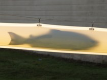

Was E-mail a Mistake?

[Annals of Technology](https://www.newyorker.com/tech/annals-of-technology)

# Was E-mail a Mistake?

## The mathematics of distributed systems suggests that meetings might be better.

By [Cal Newport](https://www.newyorker.com/contributors/cal-newport)
August 6, 2019

Illustration by Shira Inbar

The walls of the Central Intelligence Agency’s original headquarters, in Langley, Virginia, contain more than thirty miles of four-inch steel tubing. The tubes were installed in the early nineteen-sixties, as part of an elaborate, vacuum-powered intra-office mail system. Messages, sealed in fibreglass containers, rocketed at thirty feet a second among approximately a hundred and fifty stations spread over eight floors. Senders specified each capsule’s destination by manipulating brass rings at its base; electro-mechanical widgets in the tubes read those settings and routed each capsule toward its destination. At its peak, the system delivered seventy-five hundred messages each day.

According to oral histories maintained by the C.I.A., employees were saddened when, in the late nineteen-eighties, during an expansion of the headquarters, this steampunk mail system was shut down. Some of them reminisced about the comforting *thunk*, *thunk* of the capsules arriving at a station; others worried that internal office communication would become unacceptably slow, or that runners would wear themselves out delivering messages on foot. The agency’s archives contain a photograph of a pin that reads “Save the Tubes.”

The C.I.A.’s tube system is a defining example of one of the major technological movements of the twentieth century: the push to create what communication specialists call “asynchronous messaging” in the workplace. An interaction is said to be synchronous when all parties participate at the same time, while standing in the same room, perhaps, or by telephone. Asynchronous communication, by contrast, doesn’t require the receiver to be present when a message is sent. I can send a message to you whenever I want; you answer it at your leisure.

For much of workplace history, collaboration among colleagues was synchronous by default. From Renaissance workshops to the nineteenth-century rooms occupied by Charles Dickens’s Bob Cratchit and Herman Melville’s Bartleby, an office was usually a single space where a few people toiled. Though letter-writing—an asynchronous style of communication—had been a part of commerce for centuries, it was too slow for day-to-day collaboration. For most office work, synchrony ruled.

This status quo was upended by the rise of a new work setting: the large office. In the book “[Cubed: A Secret History of the Workplace](https://www.amazon.com/dp/0385536577/?tag=thneyo0f-20),” the critic and *New Yorker* contributor Nikil Saval writes that this shift took place between 1860, when the U.S. Census counted around seven hundred and fifty thousand people who worked in “professional service,” and 1920, by which time that number had increased to more than four million—a period, Saval writes, in which “business became big business.” The small counting house gave way to edifices such as the Larkin Building, designed in 1903, by Frank Lloyd Wright, which housed eighteen hundred employees, spread over five floors and a basement, and was anchored by a cavernous, light-bathed central atrium. The introduction of office telephone exchanges, in the early twentieth century, helped make such spaces more functional. But coördinating telephone conversations required drawn-out games of secretarial phone tag.

As message slips piled up on office desks, what seemed to be missing was a system of practical asynchronous messaging: a way for me to send you a message when it was convenient for me, and for you to read that message when it was convenient for you, all at speeds less sluggish than that of intra-office mail. If such a system could be built, managers thought, then efficient non-real-time collaboration would become possible: no more missed-call slips, no more waiting for the mail cart. In the emerging age of large offices, practical asynchrony seemed like a productivity silver bullet. This belief motivated investment in projects such as the C.I.A.’s pneumatic-tube network.

Other large office buildings also experimented with pneumatic solutions. But the expense and complexity of these systems rendered them essentially impractical. Then, in the nineteen-eighties, a far more convenient technology arrived, in the form of desktop computers connected through digital networks. As these networks spread, e-mail emerged as the killer app for bringing asynchronous communication to the office. To better understand this shift, I talked to Gloria Mark, a professor at the University of California, Irvine, who studies the impact that computer technology has had on the workplace. “I can show it to you,” she told me, when I asked about the spread of e-mail. She showed me a data table she had constructed, which summarized the results of office-time-use studies from 1965 to 2006. The studies can be divided into two groups: before e-mail and after. In the studies conducted before e-mail, workers spent around forty per cent of their time in “scheduled meetings,” and twenty per cent engaged in “desk work.” In those conducted after e-mail, the percentages are swapped.

With the arrival of practical asynchronous communication, people replaced a significant portion of the interaction that used to unfold in person with on-demand digital messaging, and they haven’t looked back. The Radicati Group, a technology-research firm, now estimates that more than a hundred and twenty-eight billion business e-mails will be sent and received daily in 2019, with the average business user dealing with a hundred and twenty-six messages a day. The domination of asynchronous communication over synchronous collaboration has been so complete that some developers of digital-collaboration tools mock the fact that we ever relied on anything so primitive as in-person meetings. In a blog post called “[Asynchronous Communication Is the Future of Work](http://blog.idonethis.com/asynchronous-communication/),” the technology marketer Blake Thorne compares synchronous communication to the fax machine: it’s a relic, he writes, that will “puzzle your grandkids” when they look back on how people once worked.

### Video From The New Yorker

[### Who Owns the Moon?](https://video.newyorker.com/watch/who-owns-the-moon/)

As e-mail was taking over the modern office, researchers in the theory of distributed systems—the subfield in which, as a computer scientist, I specialize—were also studying the trade-offs between synchrony and asynchrony. As it happens, the conclusion they reached was exactly the opposite of the prevailing consensus. They became convinced that synchrony was superior and that spreading communication out over time hindered work rather than enabling it.

The synchrony-versus-asynchrony issue is fundamental to the history of computer science. For the first couple of decades of the digital revolution, programs were designed to run on individual machines. Later, with the development of computer networks, programs were written to be deployed on multiple machines that operated together over a network. Many of these early distributed systems, as they came to be known, were asynchronous by default. In such a system, Machine A could send a message to Machine B, hoping that it would eventually be delivered and processed, but Machine A couldn’t know for sure how long that would take. (If the network was slow, or if Machine B’s processor was busy with other tasks, or if Machine B crashed, it might take a while—or it might not happen at all.) An obvious solution was to engineer synchronous distributed systems. In such a system, communication would be closer to real time, with messages being passed back and forth within tight and predictable time frames. Machines could work together in rounds, with all the loose ends tied up before each round ended.

MORE FROM
[Annals of Technology](https://www.newyorker.com/tech/annals-of-technology)

[A Summer Camp for the Next Generation of N.S.A. Agents](https://www.newyorker.com/tech/annals-of-technology/a-summer-camp-for-the-next-generation-of-nsa-agents)

By [Sue Halpern](https://www.newyorker.com/contributors/sue-halpern)

[The Nihilistic Euphoria of the Fish Tube](https://www.newyorker.com/science/elements/the-nihilistic-euphoria-of-the-fish-tube)

By [Rachel Riederer](https://www.newyorker.com/contributors/rachel-riederer)

[The Last Presidential Salmon](https://www.newyorker.com/science/elements/the-last-presidential-salmon)

By [Caroline Lester](https://www.newyorker.com/contributors/caroline-lester)

[Is Ebola Evolving Into a Deadlier Virus?](https://www.newyorker.com/science/elements/is-ebola-evolving-into-a-more-deadly-virus)

By [Richard Preston](https://www.newyorker.com/contributors/richard-preston)

[Facebook’s Audacious Pitch for a Global Cryptocurrency](https://www.newyorker.com/tech/annals-of-technology/facebooks-audacious-pitch-for-a-global-cryptocurrency)

By [Sue Halpern](https://www.newyorker.com/contributors/sue-halpern)

[The Hidden Costs of Automated Thinking](https://www.newyorker.com/tech/annals-of-technology/the-hidden-costs-of-automated-thinking)

By [Jonathan Zittrain](https://www.newyorker.com/contributors/jonathan-zittrain)

Advertisement

A few synchronous distributed systems were built in the nineteen-seventies and -eighties. *NASA*, for example, developed a computerized aircraft-control system, which relied on multiple computer processors to operate the aircraft’s control surfaces. The system was designed so that, if one processor failed in the extreme conditions of high-altitude flight, the system as a whole could keep functioning—preventing a crash from causing a crash. To simplify the task of writing software that safely implemented this sort of fault tolerance, the processors were connected on a custom timing circuit that kept their operations synchronized to within around fifty microseconds. But these synchronous systems were often costly to build. They required either custom hardware or special software that could precisely organize the processors’ activity. As in the world of workplace communication, synchrony was a more convenient way to communicate, once it was arranged, but arranging it required effort.

It was in the nineteen-eighties that business thinkers and computer scientists began to diverge in their thinking. People in office settings fixated on the organizational overhead required to organize synchronous collaboration. They believed that eliminating this overhead through asynchronous systems would make collaboration more efficient. Computer scientists, meanwhile, came to the opposite conclusion. Investigating asynchronous communication using a mathematical approach known as algorithm theory, they discovered that spreading out communication with unpredictable delays introduced new complexities that were difficult to reduce. While the business world came to see synchrony as an obstacle to overcome, theorists began to realize that it was fundamental for effective collaboration.

A striking computer-science discovery from this period is the difficulty of the so-called consensus problem. Imagine that each machine in a distributed system starts an operation, such as entering a transaction into a database, with an initial preference to either proceed or abort. The goal is for these machines to reach a consensus—either all agreeing to proceed or all agreeing to abort. The simplest solution is for each machine to gather the preferences of its peers and then apply some fixed rule—for example, counting the votes to determine a winner—to decide which preference to adopt. If all the machines gather the same set of votes, they will all adopt the same decision.

The problem is that some of the computers might crash. If that happens, the rest of the group will end up waiting forever to hear from peers that are no longer operating. In a synchronous system, this issue is easily sidestepped: if you don’t hear from a machine fast enough, you can assume that it has crashed and ignore it going forward. In asynchronous systems, these failures are more problematic. It’s difficult to differentiate between a computer that’s crashed and one that’s delayed. At first, to the engineers who studied this problem, it seemed obvious that, instead of waiting to learn the preference of every machine, one could just wait to hear from most of them. And yet, to the surprise of many people in the field, in a 1985 paper, three computer scientists—Michael Fischer, Nancy Lynch (my doctoral adviser), and Michael Paterson—proved, through a virtuosic display of mathematical logic, that, in an asynchronous system, no distributed algorithm could guarantee that a consensus would be reached, even if only a single computer crashed.

A major implication of research into distributed systems is that, without synchrony, such systems are just too hard for the average programmer to tame. It turns out that asynchrony makes coördination so complicated that it’s almost always worth paying the price required to introduce at least some synchronization. In fact, the fight against asynchrony has played a crucial role in the rise of the Internet age, enabling, among other innovations, huge data centers run by such companies as Amazon, Facebook, and Google, and fault-tolerant distributed databases that reliably process millions of credit-card transactions each day. In 2013, Leslie Lamport, a major figure in the field of distributed systems, was awarded the A. M. Turing Award—the highest distinction in computer science—for his work on algorithms that help synchronize distributed systems. It’s an irony in the history of technology that the development of synchronous distributed computer systems has been used to create a communication style in which we are always out of synch.

Anyone who works in a standard office environment has firsthand experience with the problems that followed the enthusiastic embrace of asynchronous communication. As the distributed-system theorists discovered, shifting away from synchronous interaction makes coördination more complex. The dream of replacing the quick phone call with an even quicker e-mail message didn’t come to fruition; instead, what once could have been resolved in a few minutes on the phone now takes a dozen back-and-forth messages to sort out. With larger groups of people, this increased complexity becomes even more notable. Is an unresponsive colleague just delayed, or is she completely checked out? When has consensus been reached in a group e-mail exchange? Are you, the e-mail recipient, required to respond, or can you stay silent without holding up the decision-making process? Was your point properly understood, or do you now need to clarify with a follow-up message? Office workers pondering these puzzles—the real-life analogues of the theory of distributed systems—now dedicate an increasing amount of time to managing a growing number of never-ending interactions.

Last year, the software company RescueTime gathered and aggregated anonymized computer-usage logs from tens of thousands of people. When its data scientists crunched the numbers, they found that, on average, users were checking e-mail or instant-messenger services like Slack once every six minutes. Not long before, a team led by Gloria Mark, the U.C. Irvine professor, had installed similar logging software on the computers of employees at a large corporation; the study found that the employees checked their in-boxes an average of seventy-seven times a day. Although we shifted toward asynchronous communication so that we could stop wasting time playing phone tag or arranging meetings, communicating in the workplace had become more onerous than it used to be. Work has become something we do in the small slivers of time that remain amid our Sisyphean skirmishes with our in-boxes.

There’s nothing intrinsically bad about e-mail as a tool. In situations where asynchronous communication is clearly preferable—broadcasting an announcement, say, or delivering a document—e-mails are superior to messengered printouts. The difficulties start when we try to undertake collaborative projects—planning events, developing strategies—asynchronously. In those cases, communication becomes drawn out, even interminable. Both workplace experience and the theory of distributed systems show that, for non-trivial coördination, synchrony usually works better. This doesn’t mean that we should turn back the clock, re-creating the mid-century workplace, with its endlessly ringing phones. The right lesson to draw from distributed-system theory is that useful synchrony often requires structure. For computer scientists, this structure takes the form of smart distributed algorithms. For managers, it takes the form of smarter business processes.

Isolated examples of well-planned, structured synchrony are starting to emerge in the business world. Many of these experiments come from the tech sector (where, perhaps not coincidentally, the ideas behind distributed-system theory are familiar). Recently, the founder and C.E.O. of a publicly traded technology company told me that he spends at most two or three hours a week sending and receiving e-mails; he has replaced most of his asynchronous messaging with a “regular rhythm” of meetings, which allows him to efficiently address issues in real time. “If you keep needing to send me urgent messages, then my assumption is that there’s something broken about the way you’re doing business,” he said.

Similarly, the software-development firm Basecamp now allows employees to set professor-style office hours: if you need to talk to an expert on a given subject, you can sign up for her office hours instead of shooting her an e-mail. “You get that person’s full, undivided attention,” Jason Fried, the company’s co-founder and C.E.O., said, on the podcast Curious Minds. “It’s such a calmer way of doing this.” If something is urgent and the expert’s office hours aren’t for another few days, then, Fried explained, “that’s just how it goes.”

At many technology companies, a popular alternative to hyperactive asynchronous messaging is a collaboration framework called Scrum, popular among software developers. Teams of programmers using Scrum divide their efforts into “sprints,” each focussed on introducing a related set of features to a piece of software. During these sprints, which last from one to four weeks, the team meets once a day. Everyone gets a chance to speak. Team members describe what they accomplished yesterday and what they’re going to work on today; if they think they’ll need help, they let the right people know. In classic Scrum, colored notes pinned to a board are arranged to publicly reflect these commitments, so that there’s no ambiguity about the plan. These meetings are often held standing up, so that no one feels tempted to bloviate, and they typically last for around fifteen minutes. The idea that a quarter of an hour of structured synchrony is enough time to enable a full day of work might sound preposterous, but, for more than twelve million software developers, it seems to be working. Many people are surprised when they first learn about the effectiveness of Scrum. This suggests that many of us are underestimating the value of synchrony: when organized properly, it’s more powerful than we realize.

We can acknowledge, with the benefit of hindsight, the reasonableness of the hypothesis that asynchrony in the office would increase productivity. We can also admit that this hypothesis has been largely refuted by experience. To use the terminology of computer science, it turned out that the distributed systems that resulted when we shifted toward asynchronous communication were soon overwhelmed by the increasing complexity induced by asynchrony. We must, therefore, develop better systems—ones that will almost certainly involve less ad-hoc messaging and more real-time coördination.

From this perspective, our moment in workplace history looks rather different. The era that will mystify our grandkids is ours—a period when, caught up in the promise of asynchronicity, we frantically checked our in-boxes every few minutes, exhausted by the deluge of complex and ambiguous messages, while applauding ourselves for eliminating the need to speak face to face.

- Cal Newport is a professor of computer science at Georgetown University.

[Read more »](https://www.newyorker.com/contributors/cal-newport)
More:

- [E-Mail](https://www.newyorker.com/tag/e-mail)
- [Office Culture](https://www.newyorker.com/tag/office-culture)
- [Computer Science](https://www.newyorker.com/tag/computer-science)

Sign up for our daily newsletter and get the best of *The New Yorker* in your in-box.

### Most Popular

- 1.

Q. & A.[##### A Penn Law Professor Wants to Make America White Again](https://www.newyorker.com/news/q-and-a/a-penn-law-professor-wants-to-make-america-white-again)

By [Isaac Chotiner](https://www.newyorker.com/contributors/isaac-chotiner)

- 2.

Puzzles Dept.[##### The Weekend Crossword: Friday, August 23, 2019](https://www.newyorker.com/crossword/puzzles-dept/2019/08/23)

By [Erik Agard](https://www.newyorker.com/contributors/erik-agard)

- 3.

Annals of Gastronomy[##### The Popeyes Chicken Sandwich Is Here to Save America](https://www.newyorker.com/culture/annals-of-gastronomy/the-popeyes-chicken-sandwich-is-here-to-save-america)

By [Helen Rosner](https://www.newyorker.com/contributors/helen-rosner)

- 4.

Persons of Interest[##### Félix Auger-Aliassime Is Trying to Stay Calm](https://www.newyorker.com/culture/persons-of-interest/felix-auger-aliassime-is-trying-to-stay-calm)

By [Louisa Thomas](https://www.newyorker.com/contributors/louisa-thomas)

- 5.

Profiles[##### Mike Pompeo, the Secretary of Trump](https://www.newyorker.com/magazine/2019/08/26/mike-pompeo-the-secretary-of-trump)

By [Susan B. Glasser](https://www.newyorker.com/contributors/susan-b-glasser)

[our thirty most popular»](https://www.newyorker.com/popular?intcid=most-popular)

- [**](https://www.facebook.com/sharer/sharer.php?u=https%3A%2F%2Fwww.newyorker.com%2Ftech%2Fannals-of-technology%2Fwas-e-mail-a-mistake&display=popup&ref=plugin)
- [**](https://twitter.com/intent/tweet?original_referer=https%3A%2F%2Fwww.newyorker.com%2Ftech%2Fannals-of-technology%2Fwas-e-mail-a-mistake&text=Was%20E-mail%20a%20Mistake%3F&tw_p=tweetbutton&url=https%3A%2F%2Fwww.newyorker.com%2Ftech%2Fannals-of-technology%2Fwas-e-mail-a-mistake)
- [**](https://www.newyorker.com/tech/annals-of-technology/was-e-mail-a-mistakemailto:?subject=From%20newyorker.com:%20Was%20E-mail%20a%20Mistake%3F&body=Digital%20messaging%20was%20supposed%20to%20make%20our%20work%20lives%20easier%20and%20more%20efficient%2C%20but%20the%20math%20suggests%20that%20meetings%20might%20be%20better.%0D%0Ahttps%3A%2F%2Fwww.newyorker.com%2Ftech%2Fannals-of-technology%2Fwas-e-mail-a-mistake)
- [**](https://www.newyorker.com/tech/annals-of-technology/was-e-mail-a-mistake#)

##### Video

The Epic Promise of Wedding Vows

The relationship expert Esther Perel, along with a professional wedding-vow writer, explain the evolution of vows, and why the best ones embrace marriage in all its imperfections.

##### Recommended Stories

[(L)](https://www.newyorker.com/tech/annals-of-technology/gmail-smart-replies-and-the-ever-growing-pressure-to-e-mail-like-a-machine)[Annals of Technology](https://www.newyorker.com/tech/annals-of-technology)[## Gmail Smart Replies and the Ever-Growing Pressure to E-mail Like a Machine](https://www.newyorker.com/tech/annals-of-technology/gmail-smart-replies-and-the-ever-growing-pressure-to-e-mail-like-a-machine)

## I’d avoided my in-box because I was overwhelmed by all the writing that I thought I had to do. But what if I could home in on the notes that demanded truly thoughtful responses and slough off the rest?

By [Rachel Syme](http://www.newyorker.com/contributors/rachel-syme)
Nov. 28, 2018

[(L)](https://www.newyorker.com/tech/annals-of-technology/can-indie-social-media-save-us)[Annals of Technology](https://www.newyorker.com/tech/annals-of-technology)[## Can “Indie” Social Media Save Us?](https://www.newyorker.com/tech/annals-of-technology/can-indie-social-media-save-us)

## Artisanal versions of Twitter and Facebook hope to keep the good while jettisoning the bad.

By [Cal Newport](https://www.newyorker.com/contributors/cal-newport)
May 18, 2019

[(L)](https://www.newyorker.com/news/q-and-a/a-penn-law-professor-wants-to-make-america-white-again)Q. & A.[## A Penn Law Professor Wants to Make America White Again](https://www.newyorker.com/news/q-and-a/a-penn-law-professor-wants-to-make-america-white-again)

## Amy Wax promotes the idea that the U.S. should limit immigration because of the superiority of Western culture.

By [Isaac Chotiner](https://www.newyorker.com/contributors/isaac-chotiner)
Aug. 23, 2019

[(L)](https://www.newyorker.com/crossword/puzzles-dept/2019/08/23)Puzzles Dept.[## The Weekend Crossword: Friday, August 23, 2019](https://www.newyorker.com/crossword/puzzles-dept/2019/08/23)

## ​T​wo or three in a Coco Gauff match​: four letters.​

By [Erik Agard](https://www.newyorker.com/contributors/erik-agard)
Aug. 23, 2019

#### [Listen to the New Yorker Radio Hour](https://www.newyorker.com/podcast/the-new-yorker-radio-hour)·

#### [Buy the Cover](http://www.condenaststore.com/-st/New-Yorker-Covers-Prints_c147247_.htm)·

#### [Play the Crossword](https://www.newyorker.com/crossword)·

#### [Play the Jigsaw Puzzle](https://www.newyorker.com/jigsaw)

#### [News & Politics](https://www.newyorker.com/news)

- [Daily Comment](https://www.newyorker.com/news/daily-comment)
- [Our Columnists](https://www.newyorker.com/news/our-columnists)
- [News Desk](https://www.newyorker.com/news/news-desk)

#### [Culture](https://www.newyorker.com/culture)

- [Cultural Comment](https://www.newyorker.com/culture/cultural-comment)
- [Culture Desk](https://www.newyorker.com/culture/culture-desk)
- [Goings On About Town](https://www.newyorker.com/goings-on-about-town)
- [The Critics](https://www.newyorker.com/magazine/critics)

#### [Business, Science & Tech](https://www.newyorker.com/business)

- [Currency](https://www.newyorker.com/business/currency)
- [Elements](https://www.newyorker.com/tech/elements)

#### [Humor](https://www.newyorker.com/humor)

- [Daily Shouts](https://www.newyorker.com/humor/daily-shouts)
- [Shouts & Murmurs](https://www.newyorker.com/magazine/shouts-murmurs)
- [The Borowitz Report](https://www.newyorker.com/humor/borowitz-report)

#### [Cartoons](https://www.newyorker.com/cartoons)

- [Daily Cartoon](https://www.newyorker.com/cartoons/daily-cartoon)
- [Cartoon Caption Contest](http://contest.newyorker.com/)
- [Cartoon Bank](https://condenaststore.com/conde-nast-brand/cartoonbank?utm_medium=referral)

#### [Books & Fiction](https://www.newyorker.com/books)

- [Page-Turner](https://www.newyorker.com/books/page-turner)
- [Books](https://www.newyorker.com/magazine/books)
- [Poems](https://www.newyorker.com/magazine/poems)
- [Fiction](https://www.newyorker.com/magazine/fiction)

#### [Magazine](https://www.newyorker.com/magazine)

- [This Week's Issue](https://www.newyorker.com/magazine)
- [Archive](https://www.newyorker.com/archive)
- [Subscribe](https://www.newyorker.com/subscribe)

#### [Photography](https://www.newyorker.com/tag/photography)

- [Photo Booth](https://www.newyorker.com/culture/photo-booth)
- [Portfolio](https://www.newyorker.com/magazine/portfolio)

#### [Video](http://video.newyorker.com/)

- [Culture](http://video.newyorker.com/genres/Culture)
- [Humor](http://video.newyorker.com/genres/Humor)
- [News](http://video.newyorker.com/genres/News)
- [Politics](http://video.newyorker.com/genres/Politics)
- [Science & Tech](http://video.newyorker.com/genres/Science%20&%20Tech)
- [Sports](http://video.newyorker.com/genres/Sports)

#### [Podcasts](https://www.newyorker.com/podcast)

- [The New Yorker Radio Hour](https://www.newyorker.com/podcast/the-new-yorker-radio-hour)
- [Political Scene](https://www.newyorker.com/podcast/political-scene)
- [The Writer's Voice](https://www.newyorker.com/podcast/the-authors-voice)
- [Fiction](https://www.newyorker.com/podcast/fiction)
- [Poetry](https://www.newyorker.com/podcast/poetry)

#### More

- [Customer Care](http://w1.buysub.com/servlet/CSGateway?cds_mag_code=NYR)
- [Buy the Cover](http://www.condenaststore.com/-st/New-Yorker-Covers-Prints_c147247_.htm)
- [Apps](https://www.newyorker.com/digital-editions)
- [Crossword Puzzle](https://www.newyorker.com/crossword)
- [Jigsaw Puzzle](https://www.newyorker.com/jigsaw)
- [SecureDrop](https://projects.newyorker.com/securedrop/)
- [Store](http://www.condenaststore.com/~/new-yorker-store)
- [RSS](https://www.newyorker.com/about/feeds)
- [Site Map](https://www.newyorker.com/sitemap)

#### [Newsletters](https://www.newyorker.com/newsletters)

- [The Daily](https://www.newyorker.com/newsletters/daily-newsletter)
- [The New Yorker Recommends](https://www.newyorker.com/newsletters/culture-review-newsletter)
- [Daily Humor](https://www.newyorker.com/newsletters/send-me-the-cartoon-chronicle-newsletter)
- [John Cassidy](https://www.newyorker.com/newsletters/john-cassidy-newsletter)
- [The Borowitz Report](https://www.newyorker.com/newsletters/andy-borowitz-newsletter)
- [Amy Davidson Sorkin](https://www.newyorker.com/home/about/sign-up-for-amy-davidson-sorkins-newsletter)
- [Midterms 2018](https://www.newyorker.com/home/about/sign-up-for-the-new-yorker-midterms-2018-newsletter)
- [Food](https://www.newyorker.com/home/about/sign-up-for-the-new-yorker-food-newsletter)

#### [About Us](https://www.newyorker.com/about/us)

- [About](https://www.newyorker.com/about/us)
- [Careers](https://www.newyorker.com/about/careers)
- [Contact](https://www.newyorker.com/about/contact)
- [FAQ](https://www.newyorker.com/about/faq)
- [Media Kit](http://www.condenast.com/brands/the-new-yorker)
- [Press](https://www.newyorker.com/about/press)
- [Accessibility Help](https://www.newyorker.com/about/accessibility-help/)

#### Follow Us

[![](data:image/svg+xml,%3csvg width='21' height='20' viewBox='0 0 21 20' xmlns='http://www.w3.org/2000/svg' xmlns:xlink='http://www.w3.org/1999/xlink' data-evernote-id='257' class='js-evernote-checked'%3e%3cdefs data-evernote-id='1135' class='js-evernote-checked'%3e%3cpath id='a' d='M20.3 19H0V0h20.3z' data-evernote-id='1136' class='js-evernote-checked'%3e%3c/path%3e%3c/defs%3e%3cg fill='none' fill-rule='evenodd' data-evernote-id='1137' class='js-evernote-checked'%3e%3cpath d='M10.3 19H10c-1.2 0-2-.6-2.7-1.2-.5-.3-1-.7-1.5-.7H4c-.3 0-.4.2-.5.2-.2 0-.3 0-.3-.2v-.5l-.4-.6c-2-.4-2.4-.8-2.6-1v-.2s0-.2.2-.2c3-.5 4-3.4 4.2-3.6.2-.3.2-.6 0-1 0-.4-.7-.6-1.2-.7h-.2c-1-.4-1-.8-1-1 0-.2.5-.4.8-.4h.3l1 .2c.4 0 .6-.2.6-.2v-.6c-.2-1.4-.3-3 0-4 1.4-3 4-3 5-3h.3c.8 0 3.6 0 4.8 3 .6 1 .5 2.6.4 4V8s0 .2.5.2c.2 0 .5 0 1-.3 0 0 0-.2.2-.2h.3c.3.2.5.4.5.6 0 .2-.2.5-1 .8H17c-.4.2-1 .4-1.2 1v.8c0 .2 1.4 3 4.3 3.6v.2c0 .4-.6.8-2.5 1-.2 0-.2.3-.3.7v.5l-.4.2h-.4c-.3-.2-.7-.2-1-.2h-1c-.5 0-1 .5-1.5.8-.8.6-1.6 1-2.7 1' fill='%23DDD' data-evernote-id='1138' class='js-evernote-checked'%3e%3c/path%3e%3cg transform='translate(0 .02)' data-evernote-id='1139' class='js-evernote-checked'%3e%3cmask id='b' fill='%23ddd' data-evernote-id='1140' class='js-evernote-checked'%3e%3c/mask%3e%3cpath d='M10.3 0H10C9 0 6.2.3 5 3.3c-.5 1-.4 2.7-.3 4V8h-.4c-.3 0-.6 0-1-.3H3c-.4 0-1 .2-1 .6 0 .3 0 .7 1 1l.4.2c.4 0 1 .3 1 .7.2.2.2.4 0 .7 0 0-1.3 3-4 3.3-.3 0-.4.3-.4.5v.2c.3.4 1 .8 2.7 1 0 0 0 .4.2.5v.5c0 .2 0 .4.5.4H4c.2-.2.5-.2 1-.2h.8c.5 0 1 .4 1.4.8.7.5 1.6 1 2.8 1h.3c1.2 0 2-.5 2.7-1 .5-.4 1-.7 1.5-.8h2.3c.3 0 .4 0 .5-.2v-.5l.2-.5c1.6-.2 2.5-.6 2.7-1v-.2c0-.2 0-.4-.3-.5C17 14 16 11 16 11c-.3-.4-.3-.6-.2-.8 0-.4.7-.6 1-.7h.4c.7-.4 1-.7 1-1 0-.4-.2-.7-.6-.8h-.4-.4l-1 .2h-.2v-.6c0-1.4.2-3-.3-4-1.3-3-4-3.4-5-3.4m0 .5c.8 0 3.4.2 4.7 3 .4 1 .3 2.5.2 3.8V8s.2.3.7.4c.2 0 .6 0 1-.3h.4l.4.4s0 .3-.8.6h-.2c-.5.2-1.2.5-1.4 1-.2.3 0 .7 0 1 .2.3 1.5 3.3 4.4 3.8 0 0-.3.5-2.3.8-.3 0-.4.4-.5.8v.5h-.2-.4c-.3-.2-.6-.2-1-.2h-1c-.6 0-1 .5-1.6.8-.7.5-1.4 1-2.5 1H10c-1 0-1.8-.5-2.5-1-.6-.3-1-.7-1.7-.8h-2-.3c-.2 0-.2-.2-.2-.4 0-.4-.2-.7-.5-.8-2-.3-2.3-.7-2.4-.8 3-.5 4.3-3.5 4.4-3.7.2-.3.2-.7 0-1 0-.5-.8-.8-1.3-1h-.3c-.6-.2-.8-.5-.7-.6 0-.2.3-.4.5-.4h.2c.4.3.8.4 1 .4.6 0 .8-.3 1-.3v-.7c-.2-1.3-.3-3 0-4C6.6.8 9.3.6 10 .6h.3' fill='%23DDD' mask='url(%23b)' data-evernote-id='1142' class='js-evernote-checked'%3e%3c/path%3e%3c/g%3e%3c/g%3e%3c/svg%3e)](https://www.snapchat.com/add/newyorkermag)[' data-evernote-id='1146' class='js-evernote-checked'%3e%3cg id='FOLLOW' transform='translate(850.000000%2c 528.000000)' data-evernote-id='1147' class='js-evernote-checked'%3e%3cg id='YT' transform='translate(2.000000%2c 79.000000)' data-evernote-id='1148' class='js-evernote-checked'%3e%3cmask fill='white' id='mask-2' data-evernote-id='1149' class='js-evernote-checked'%3e%3c/mask%3e%3cg id='Clip-2' data-evernote-id='1151' class='js-evernote-checked'%3e%3c/g%3e%3cpath d='M11.2732128%2c13.6774465 L11.2719054%2c5.6941363 L18.949235%2c9.69969958 L11.2732128%2c13.6774465 Z M28.1293185%2c4.31113213 C28.1293185%2c4.31113213 27.8516551%2c2.35316273 26.9997775%2c1.49093741 C25.9193324%2c0.35925452 24.7082615%2c0.353663421 24.152879%2c0.287404729 C20.1768846%2c5.56328223e-06 14.2126843%2c5.56328223e-06 14.2126843%2c5.56328223e-06 L14.2003338%2c5.56328223e-06 C14.2003338%2c5.56328223e-06 8.2362726%2c5.56328223e-06 4.26013908%2c0.287404729 C3.70472879%2c0.353663421 2.49410292%2c0.35925452 1.41326843%2c1.49093741 C0.561363004%2c2.35316273 0.284144645%2c4.31113213 0.284144645%2c4.31113213 C0.284144645%2c4.31113213 0%2c6.6104089 0%2c8.90971349 L0%2c11.0652907 C0%2c13.3645396 0.284144645%2c15.6638164 0.284144645%2c15.6638164 C0.284144645%2c15.6638164 0.561363004%2c17.6218136 1.41326843%2c18.4840389 C2.49410292%2c19.615694 3.91385257%2c19.5799221 4.54620306%2c19.6985313 C6.81927677%2c19.9165007 14.2065369%2c19.9839555 14.2065369%2c19.9839555 C14.2065369%2c19.9839555 20.1768846%2c19.9749708 24.152879%2c19.6875438 C24.7082615%2c19.6213129 25.9193324%2c19.615694 26.9997775%2c18.4840389 C27.8516551%2c17.6218136 28.1293185%2c15.6638164 28.1293185%2c15.6638164 C28.1293185%2c15.6638164 28.4130459%2c13.3645396 28.4130459%2c11.0652907 L28.4130459%2c8.90971349 C28.4130459%2c6.6104089 28.1293185%2c4.31113213 28.1293185%2c4.31113213 L28.1293185%2c4.31113213 Z' fill='%23DDDDDD' id='Fill-1' mask='url(%23mask-2)' data-evernote-id='1152' class='js-evernote-checked'%3e%3c/path%3e%3c/g%3e%3c/g%3e%3c/g%3e%3c/g%3e%3c/svg%3e)](https://www.youtube.com/user/NewYorkerDotCom)[' data-evernote-id='1156' class='js-evernote-checked'%3e%3cg id='FOLLOW' transform='translate(850.000000%2c 528.000000)' data-evernote-id='1157' class='js-evernote-checked'%3e%3cg id='insta' transform='translate(66.000000%2c 79.000000)' data-evernote-id='1158' class='js-evernote-checked'%3e%3cg id='Group-3' transform='translate(0.000000%2c 0.033390)' data-evernote-id='1159' class='js-evernote-checked'%3e%3cmask fill='white' id='mask-2' data-evernote-id='1160' class='js-evernote-checked'%3e%3c/mask%3e%3cg id='Clip-2' data-evernote-id='1162' class='js-evernote-checked'%3e%3c/g%3e%3cpath d='M10.0019917%2c0.00631277204 C7.28559403%2c0.00631277204 6.94498226%2c0.017826633 5.87820319%2c0.0665024727 C4.81356808%2c0.115059204 4.08652732%2c0.284154148 3.45028724%2c0.531384534 C2.79256786%2c0.786992247 2.23478086%2c1.12899362 1.67874078%2c1.6850337 C1.1227007%2c2.24111348 0.780699327%2c2.79890049 0.525091614%2c3.45661987 C0.277821524%2c4.09282024 0.108766283%2c4.81990071 0.0601698492%2c5.88449611 C0.0114940095%2c6.95131488 -1.98514845e-05%2c7.29192665 -1.98514845e-05%2c10.0083244 C-1.98514845e-05%2c12.7246824 0.0114940095%2c13.0652942 0.0601698492%2c14.1321129 C0.108766283%2c15.1967083 0.277821524%2c15.9237888 0.525091614%2c16.5599892 C0.780699327%2c17.2177086 1.1227007%2c17.7754956 1.67874078%2c18.3315753 C2.23478086%2c18.8876154 2.79256786%2c19.2296168 3.45028724%2c19.4852245 C4.08652732%2c19.7324549 4.81356808%2c19.9015498 5.87820319%2c19.9501066 C6.94498226%2c19.9987824 7.28559403%2c20.0102963 10.0019917%2c20.0102963 C12.7183895%2c20.0102963 13.0590012%2c19.9987824 14.1257803%2c19.9501066 C15.1904154%2c19.9015498 15.9174562%2c19.7324549 16.5536963%2c19.4852245 C17.2114156%2c19.2296168 17.7692026%2c18.8876154 18.3252427%2c18.3315753 C18.8812828%2c17.7754956 19.2232842%2c17.2177086 19.4788919%2c16.5599892 C19.726162%2c15.9237888 19.8952172%2c15.1967083 19.9438136%2c14.1321129 C19.9924895%2c13.0652942 20.0040033%2c12.7246824 20.0040033%2c10.0083244 C20.0040033%2c7.29192665 19.9924895%2c6.95131488 19.9438136%2c5.88449611 C19.8952172%2c4.81990071 19.726162%2c4.09282024 19.4788919%2c3.45661987 C19.2232842%2c2.79890049 18.8812828%2c2.24111348 18.3252427%2c1.6850337 C17.7692026%2c1.12899362 17.2114156%2c0.786992247 16.5536963%2c0.531384534 C15.9174562%2c0.284154148 15.1904154%2c0.115059204 14.1257803%2c0.0665024727 C13.0590012%2c0.017826633 12.7183895%2c0.00631277204 10.0019917%2c0.00631277204 M10.0019917%2c1.80847023 C12.6726516%2c1.80847023 12.9889652%2c1.81867389 14.0436349%2c1.86679389 C15.0188192%2c1.91126121 15.5484568%2c2.0742022 15.9009%2c2.21117744 C16.3677275%2c2.39262001 16.7009149%2c2.60935851 17.0509362%2c2.95937989 C17.4009179%2c3.30936156 17.6176961%2c3.64254887 17.7991387%2c4.10941608 C17.9360742%2c4.46185934 18.0990152%2c4.99145724 18.1435222%2c5.96664156 C18.1916422%2c7.02131122 18.2018062%2c7.33766447 18.2018062%2c10.0083244 C18.2018062%2c12.6789446 18.1916422%2c12.9952978 18.1435222%2c14.0499675 C18.0990152%2c15.0251518 17.9360742%2c15.5547497 17.7991387%2c15.907193 C17.6176961%2c16.3740602 17.4009179%2c16.7072475 17.0509362%2c17.0572292 C16.7009149%2c17.4072505 16.3677275%2c17.623989 15.9009%2c17.8054316 C15.5484568%2c17.9424068 15.0188192%2c18.1053478 14.0436349%2c18.1498152 C12.989124%2c18.1979351 12.6728105%2c18.2081388 10.0019917%2c18.2081388 C7.33117304%2c18.2081388 7.01485949%2c18.1979351 5.96034863%2c18.1498152 C4.98516432%2c18.1053478 4.45552671%2c17.9424068 4.10308346%2c17.8054316 C3.63625595%2c17.623989 3.30306864%2c17.4072505 2.95304726%2c17.0572292 C2.60306559%2c16.7072475 2.38628738%2c16.3740602 2.20484482%2c15.907193 C2.06790928%2c15.5547497 1.90496829%2c15.0251518 1.86046127%2c14.0499675 C1.81234127%2c12.9952978 1.80217731%2c12.6789446 1.80217731%2c10.0083244 C1.80217731%2c7.33766447 1.81234127%2c7.02131122 1.86046127%2c5.96664156 C1.90496829%2c4.99145724 2.06790928%2c4.46185934 2.20484482%2c4.10941608 C2.38628738%2c3.64254887 2.60306559%2c3.30936156 2.95304726%2c2.95937989 C3.30306864%2c2.60935851 3.63625595%2c2.39262001 4.10308346%2c2.21117744 C4.45552671%2c2.0742022 4.98516432%2c1.91126121 5.96030893%2c1.86679389 C7.0150183%2c1.81867389 7.33133185%2c1.80847023 10.0019917%2c1.80847023' fill='%23DDDDDD' id='Fill-1' mask='url(%23mask-2)' data-evernote-id='1163' class='js-evernote-checked'%3e%3c/path%3e%3c/g%3e%3cpath d='M10.0019917%2c13.375688 C8.16068716%2c13.375688 6.66797465%2c11.8830152 6.66797465%2c10.0417106 C6.66797465%2c8.20036631 8.16068716%2c6.7076935 10.0019917%2c6.7076935 C11.8432963%2c6.7076935 13.3359691%2c8.20036631 13.3359691%2c10.0417106 C13.3359691%2c11.8830152 11.8432963%2c13.375688 10.0019917%2c13.375688 M10.0019917%2c4.90553604 C7.16537344%2c4.90553604 4.86581719%2c7.20505259 4.86581719%2c10.0417106 C4.86581719%2c12.8783289 7.16537344%2c15.1778455 10.0019917%2c15.1778455 C12.8386101%2c15.1778455 15.1381663%2c12.8783289 15.1381663%2c10.0417106 C15.1381663%2c7.20505259 12.8386101%2c4.90553604 10.0019917%2c4.90553604' fill='%23DDDDDD' id='Fill-4' data-evernote-id='1164' class='js-evernote-checked'%3e%3c/path%3e%3cpath d='M16.5413208%2c4.70260623 C16.5413208%2c5.36548699 16.0039412%2c5.90282697 15.3411001%2c5.90282697 C14.6782193%2c5.90282697 14.1408396%2c5.36548699 14.1408396%2c4.70260623 C14.1408396%2c4.03972546 14.6782193%2c3.50238548 15.3411001%2c3.50238548 C16.0039412%2c3.50238548 16.5413208%2c4.03972546 16.5413208%2c4.70260623' fill='%23DDDDDD' id='Fill-6' data-evernote-id='1165' class='js-evernote-checked'%3e%3c/path%3e%3c/g%3e%3c/g%3e%3c/g%3e%3c/g%3e%3c/svg%3e)](https://www.instagram.com/newyorkermag/)

[![](data:image/svg+xml,%3csvg xmlns='http://www.w3.org/2000/svg' width='120' height='25' viewBox='0 120 288 50' data-evernote-id='260' class='js-evernote-checked'%3e%3cstyle data-evernote-id='1166' class='js-evernote-checked'%3e.a %7b fill:%23999%3b %7d%3c/style%3e%3cpath d='M26 161c-1.5 1.4-3.6 2.4-5.8 2.4-7 0-8.5-6-8.5-14s1.5-14 8.4-14c2.3 0 4.3 1 5.8 2.4l3.8 6.7h.2v-9.2h-.2l-3.6 2c-1-1-3-2.4-6-2.4-6.6 0-14.5 5.2-14.5 14.4S13.3 164 20.2 164c2.7 0 5-1.5 6-2.4l3.8 2h.2v-9.7H30l-4 7zm22.5-26.2c-6.5 0-14.2 5.7-14.2 14.5s7.7 14.5 14.2 14.5 14.2-5.7 14.2-14.5-7.7-14.5-14.2-14.5zm0 28.6c-6.6 0-8-5.6-8-14s1.4-14 8-14 8 5.6 8 14-1.3 14-8 14zm37-27.6h3.6v18l-12.4-18.4H66v.4h3.4V163H66v.4h7.5v-.4H70v-27.2l19.5 28h.2v-28h3.5v-.4h-7.6m22.8 0h-12v.4h3.4V163h-3.5v.4h12c6 0 16.3-2.7 16.3-14.2s-10.2-13.8-16.2-13.8zm-.2 27.6h-3v-27.2h3c7 0 10.4 5 10.4 13.6 0 8.5-3.3 13.6-10.4 13.6zm38.8 0h-10.3v-14.4h5.2c1.6 1.4 3.6 5.4 3.6 5.4h.2v-11.3h-.2s-2 4-3.7 5.4h-5.3V136h9.2c2.6 1.8 5 7 5 7v-7.4h-23.3v.4h3.5V163h-3.5v.4H152V154h-.3s-2.4 6.3-4.7 9zm-.5-33.6l-.7-2 .6-3.2h-.2l-8.6 7.2v.2m64.4 3.8h-7.6v.4h3.5v18l-12.6-18.4h-10.7v.4h3.5V163h-3.5v.4h7.6v-.4h-3.5v-27.2l19.5 28h.2v-28h3.5m14.7-1.4h-.2L204.8 163h-3.2v.4h7.3v-.4h-3.6l4.4-10.7h8.8l4.6 10.7h-3.5v.4h12.8v-.4h-3.3l-12.5-28.6zm-6.8 17.4l4-10 4.3 10H210zm38.2-5L243 145c-2.8-1-5-2.3-5-5 0-3 2.4-4.7 6-4.7 2.2 0 3.6.6 5 2l3.7 6.4h.2v-9h-.3l-3.6 2c-.8-1-2.4-2-5-2-5.2 0-8.6 3.6-8.6 8.5 0 4 2.7 6 5.8 7.2l5.5 2c3 1 4.8 2.4 4.8 5.3 0 2.8-1.8 5.6-6.5 5.6-2.2 0-4.8-1-6.2-2.5l-4-7.2h-.3l.2 9.7h.2l3.6-2c1 1 3.7 2.4 6.4 2.4 6 0 9.8-4.3 9.8-9 0-4.5-3.2-6.6-6.6-7.8zm9.2-11.4v8.7h.2s2.6-5.5 5-8.2h4.6V163H263v.4h14v-.4h-4.4v-27.2h4.7c2.4 2.7 5 8.3 5 8.3v-8.6h-25z' class='a js-evernote-checked' data-evernote-id='1167'%3e%3c/path%3e%3c/svg%3e)](https://www.condenast.com/)

© 2019 Condé Nast. All rights reserved. Use of and/or registration on any portion of this site constitutes acceptance of our [User Agreement](https://www.condenast.com/user-agreement/) (updated 5/25/18) and [Privacy Policy and Cookie Statement](https://www.condenast.com/privacy-policy#privacypolicy) (updated 5/25/18). [Your California Privacy Rights](https://www.condenast.com/privacy-policy#privacypolicy-california). The material on this site may not be reproduced, distributed, transmitted, cached or otherwise used, except with the prior written permission of Condé Nast. *The New Yorker* may earn a portion of sales from products and services that are purchased through links on our site as part of our affiliate partnerships with retailers. [Ad Choices](http://www.condenast.com/online-behavioral-advertising-oba-and-how-to-opt-out-of-oba/#clickheretoreadmoreaboutonlinebehavioraladvertising(oba))

