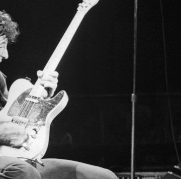

Watch Bruce Springsteen's All-Time Greatest Performance from 40 Years Ago Today

Watch Bruce Springsteen's All-Time Greatest Performance from 40 Years Ago Today

https://www.pastemagazine.com/articles/2018/09/watch-bruce-springsteens-all-time-greatest-perform.html

Watch Bruce Springsteen's All-Time Greatest Performance from 40 Years Ago Today By Michael Salfino | September 19, 2018 | 10:05am Photo by Joe Sia/Wolfgang's Music Features Bruce Springsteen Share Tweet Submit Pin Bruce Springsteen took the stage at the Capitol Theatre in Passaic, New Jersey 40 years ago as a man on a mission to prove that he wasn’t a flash in the pan who was washed up at just 28. He delivered to the 3,200 fans in attendance not merely a great show but the concert that many consider the single-best performance of his career, one captured for posterity on a WNEW-FM simulcast broadcast throughout the East Coast and recorded with then state-of-the-art video technology at the venue itself.