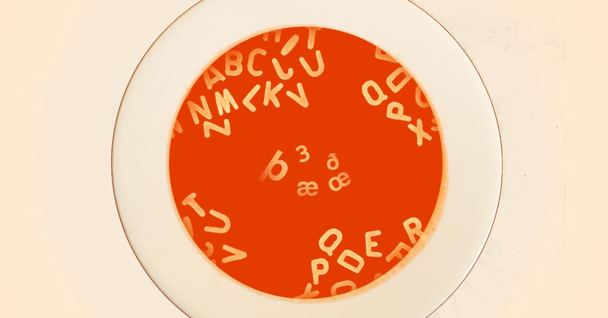
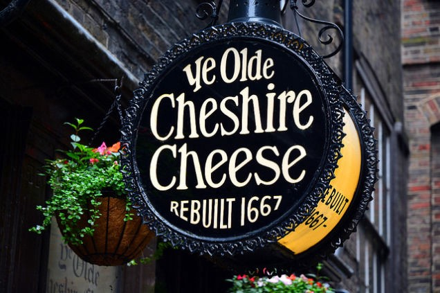

We Used To Have 6 More Letters In Our Alphabet – OMGFacts

Antonio Manaligod/Dose

# We Used To Have 6 More Letters In Our Alphabet

## 🎶 Where have all the letters gone? 🎶

Along quaint New England streets, you’ll probably spot a sign or two declaring itself “Ye Olde Tavern” or “Ye Old Soda Shoppe.” But before you adopt a British accent and order a pint of ale inside, there’s a bit of history you should know.

[Flickr](https://www.flickr.com/photos/rogersg/14276567866)

Phrases like *ye olde* are actually just some of the late 19th century’s [first marketing ploys](http://io9.gizmodo.com/ye-olde-is-fake-old-english-and-youre-mispronouncing-1679780566), meant to evoke a sentimental connection to older times. And *ye *has its own complicated story—based in the history of the alphabet.

English has always been a living language, changing and evolving with use. But before our modern alphabet was established, the language used many more characters we’ve since removed from our 26-letter lineup. The six that most recently got axed are:

#### Eth (ð)

The *y* in *ye* actually comes from the letter eth, which slowly merged with *y *over time. In its purest form, eth was pronounced like the *th *sound in words like *th*is, *th*at or *th*e. Linguistically, *ye* is meant to sound the same as *the* but the incorrect spelling and rampant mispronunciation live on.

#### Thorn (þ)

Thorn is in many ways the counterpart to eth. Thorn is also pronounced with a *th* sound, but it has a voiceless pronunciation — your vocal cords don’t vibrate when pronouncing the sound — like in *th*ing or *th*ought*.*

Today, the same* th* letter combo is used for both þ and ð sounds. There is a pronunciation difference — thorn is a voiceless pronunciation and eth is voiced — but that’s just something you pick up as you learn to speak. Of course, you’ll never hear about this in school, because that’s English for you.

#### Wynn (ƿ)

Wynn was incorporated into our alphabet to represent today’s *w *sound. Previously, scribes used two *u* characters next to each other, but preferred one character instead and chose wynn from the runic alphabet. The double *u* representation*  *became quite popular and eventually edged wynn out. Ouch.

#### Yogh (ȝ)

Yogh was historically used to denote throaty sounds like those in *Bach* or the Scottish *loch.* As English evolved, yogh was quickly abandoned in favor of the *gh *combo. Today, the sound is fairly rare. Most often, the *gh* substitute is completely silent, as in thou*gh* or dau*gh*ter*.*

#### Ash (æ)

Ash is still a functional letter in languages like Icelandic and Danish. In its original Latin, it denoted a certain type of long vowel sound, like the *i *in *fine.* In Old English, it represented a short vowel sound — somewhere between *a* and *e,* like in *cat.* In modern English, æ is occasionally used stylistically, like in archæology or medæval, but denotes the same sound as the letter *e.*

#### Ethel (œ)

Ethel also once represented a specific pronunciation somewhere between the two vowels *o* and *e,* though it was originally pronounced like the *oi *in *coil.* Like many clarifying distinctions, this letter also disappeared in favor of a simpler vowel lineup (a, e, i, o, u) with many different pronunciations.