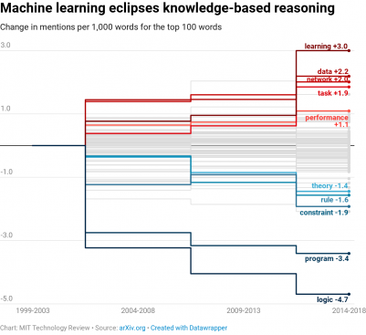
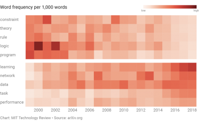
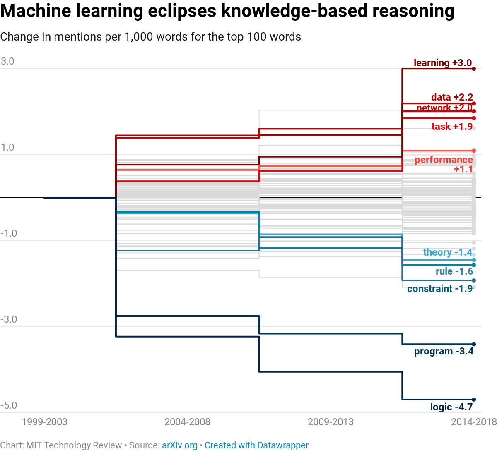
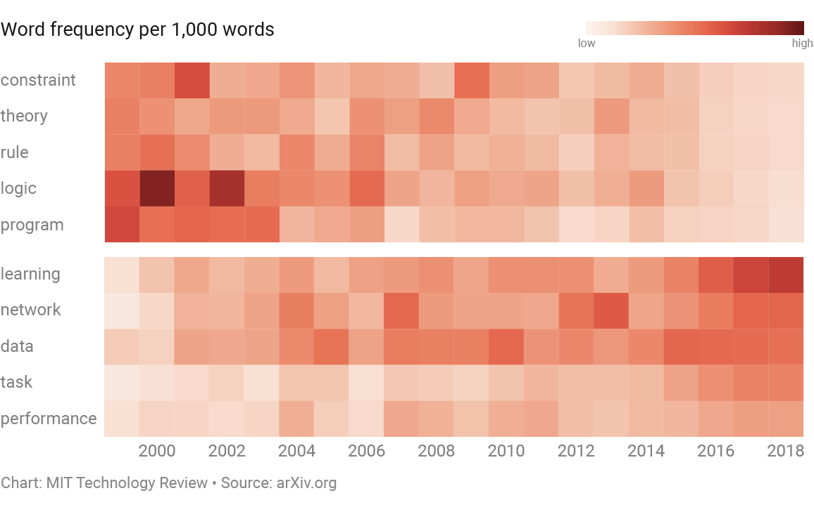

We analyzed 16,625 papers to figure out where AI is headed next

Daniel Zender

###   [Intelligent Machines](https://www.technologyreview.com/topic/intelligent-machines/)

# We analyzed 16,625 papers to figure out where AI is headed next

## Our study of 25 years of artificial-intelligence research suggests the era of deep learning may come to an end.

- by[Karen Hao](https://www.technologyreview.com/profile/karen-hao/)
- January 25, 2019
- [**](https://www.technologyreview.com/s/612768/we-analyzed-16625-papers-to-figure-out-where-ai-is-headed-next/#)
- [**](https://www.technologyreview.com/s/612768/we-analyzed-16625-papers-to-figure-out-where-ai-is-headed-next/#)
- [**](https://www.technologyreview.com/s/612768/we-analyzed-16625-papers-to-figure-out-where-ai-is-headed-next/#)
- [**](https://www.technologyreview.com/s/612768/we-analyzed-16625-papers-to-figure-out-where-ai-is-headed-next/#)
- [**](https://www.technologyreview.com/s/612768/we-analyzed-16625-papers-to-figure-out-where-ai-is-headed-next/#)
- [**](https://www.technologyreview.com/s/612768/we-analyzed-16625-papers-to-figure-out-where-ai-is-headed-next/#)

- [**](https://www.technologyreview.com/s/612768/we-analyzed-16625-papers-to-figure-out-where-ai-is-headed-next/#)
- [**](https://www.technologyreview.com/s/612768/we-analyzed-16625-papers-to-figure-out-where-ai-is-headed-next/#)
- [**](https://www.technologyreview.com/s/612768/we-analyzed-16625-papers-to-figure-out-where-ai-is-headed-next/#)
- [**](https://www.technologyreview.com/s/612768/we-analyzed-16625-papers-to-figure-out-where-ai-is-headed-next/#)
- [**](https://www.technologyreview.com/s/612768/we-analyzed-16625-papers-to-figure-out-where-ai-is-headed-next/#)
- [**](https://www.technologyreview.com/s/612768/we-analyzed-16625-papers-to-figure-out-where-ai-is-headed-next/#)

Almost everything you hear about artificial intelligence today is thanks to [deep learning](https://www.technologyreview.com/s/612437/what-is-machine-learning-we-drew-you-another-flowchart/). This category of algorithms works by using statistics to find patterns in data, and it has proved immensely powerful in [mimicking human](https://www.technologyreview.com/s/612404/is-this-ai-we-drew-you-a-flowchart-to-work-it-out/)[skills](https://www.technologyreview.com/s/612404/is-this-ai-we-drew-you-a-flowchart-to-work-it-out/) such as our ability to [see](https://www.technologyreview.com/s/525586/facebook-creates-software-that-matches-faces-almost-as-well-as-you-do/) and [hear](https://www.technologyreview.com/s/608571/alexa-understand-me/). To a very narrow extent, it can even emulate our ability to [reason](https://www.technologyreview.com/s/609141/alphago-zero-shows-machines-can-become-superhuman-without-any-help/). These capabilities power Google’s search, Facebook’s news feed, and Netflix’s recommendation engine—and are transforming industries like health care and education.

##### Recommended for You

1. [JPMorgan is launching its own cryptocurrency—but it’s nothing like Bitcoin](https://www.technologyreview.com/the-download/612961/jpmorgan-is-launching-its-own-cryptocurrency-but-its-very-different-from-bitcoin/)

2. [Pricing algorithms can learn to collude with each other to raise prices](https://www.technologyreview.com/the-download/612947/pricing-algorithms-can-learn-to-collude-with-each-other-to-raise-prices/)

3. [A cell-killing strategy to slow aging passed its first test this year](https://www.technologyreview.com/s/612943/a-cell-killing-strategy-to-slow-aging-passed-its-first-test-this-year/)

4. [The real reason America is scared of Huawei: internet-connected everything](https://www.technologyreview.com/s/612874/the-real-reason-america-is-scared-of-huawei-internet-connected-everything/)

5. [A new chemical process could turn a quarter of our plastic waste into clean fuel](https://www.technologyreview.com/the-download/612935/a-new-chemical-process-could-turn-a-quarter-of-our-plastic-waste-into-clean-fuel/)

But though deep learning has singlehandedly thrust AI into the public eye, it represents just a small blip in the history of humanity’s quest to replicate our own intelligence. It’s been at the forefront of that effort for less than 10 years. When you zoom out on the whole history of the field, it’s easy to realize that it could soon be on its way out.

Sign up for the **The Algorithm**

Artificial intelligence, demystified

*

Stay updated on MIT Technology Review initiatives and events?*

- Yes
- No

“If somebody had written in 2011 that this was going to be on the front page of newspapers and magazines in a few years, we would’ve been like, ‘Wow, you’re smoking something really strong,’” says Pedro Domingos, a professor of computer science at the University of Washington and author of *The Master Algorithm*.

The sudden rise and fall of different techniques has characterized AI research for a long time, he says. Every decade has seen a heated competition between different ideas. Then, once in a while, a switch flips, and everyone in the community converges on a specific one.

At MIT Technology Review, we wanted to visualize these fits and starts. So we turned to one of the largest open-source databases of scientific papers, known as the [arXiv](https://arxiv.org/) (pronounced “archive”). We downloaded the abstracts of all 16,625 papers available in the “artificial intelligence” section through November 18, 2018, and tracked the words mentioned through the years to see how the field has evolved.

#   The number of papers we downloaded from the arXiv

All of the papers available in the “artificial intelligence” section through November 18, 2018

%3b opacity: 1%3b' data-evernote-id='127'%3e%3c/path%3e%3cpath fill='none' stroke='%23d9d9d9' d='M0%2c137L600%2c137' class='grid y-gridline js-evernote-checked' opacity='1' style='-webkit-tap-highlight-color: rgba(0%2c 0%2c 0%2c 0)%3b opacity: 1%3b' data-evernote-id='128'%3e%3c/path%3e%3cpath fill='none' stroke='%23d9d9d9' d='M0%2c206L600%2c206' class='grid y-gridline js-evernote-checked' opacity='1' style='-webkit-tap-highlight-color: rgba(0%2c 0%2c 0%2c 0)%3b opacity: 1%3b' data-evernote-id='129'%3e%3c/path%3e%3cdesc style='-webkit-tap-highlight-color: rgba(0%2c 0%2c 0%2c 0)%3b'%3eCreated with Rapha%c3%abl 2.1.2%3c/desc%3e%3cdefs style='-webkit-tap-highlight-color: rgba(0%2c 0%2c 0%2c 0)%3b'%3e%3c/defs%3e%3crect x='8' y='275' width='18' height='0' r='0' rx='0' ry='0' fill='%23f90e1e' stroke='none' stroke-width='1' style='-webkit-tap-highlight-color: rgba(0%2c 0%2c 0%2c 0)%3b' data-evernote-id='130' class='js-evernote-checked'%3e%3c/rect%3e%3crect x='31' y='274' width='18' height='1' r='0' rx='0' ry='0' fill='%23f90e1e' stroke='none' stroke-width='1' style='-webkit-tap-highlight-color: rgba(0%2c 0%2c 0%2c 0)%3b' data-evernote-id='131' class='js-evernote-checked'%3e%3c/rect%3e%3crect x='53' y='273' width='18' height='2' r='0' rx='0' ry='0' fill='%23f90e1e' stroke='none' stroke-width='1' style='-webkit-tap-highlight-color: rgba(0%2c 0%2c 0%2c 0)%3b' data-evernote-id='132' class='js-evernote-checked'%3e%3c/rect%3e%3crect x='76' y='273' width='18' height='2' r='0' rx='0' ry='0' fill='%23f90e1e' stroke='none' stroke-width='1' style='-webkit-tap-highlight-color: rgba(0%2c 0%2c 0%2c 0)%3b' data-evernote-id='133' class='js-evernote-checked'%3e%3c/rect%3e%3crect x='99' y='274' width='18' height='1' r='0' rx='0' ry='0' fill='%23f90e1e' stroke='none' stroke-width='1' style='-webkit-tap-highlight-color: rgba(0%2c 0%2c 0%2c 0)%3b' data-evernote-id='134' class='js-evernote-checked'%3e%3c/rect%3e%3crect x='122' y='273' width='18' height='2' r='0' rx='0' ry='0' fill='%23f90e1e' stroke='none' stroke-width='1' style='-webkit-tap-highlight-color: rgba(0%2c 0%2c 0%2c 0)%3b' data-evernote-id='135' class='js-evernote-checked'%3e%3c/rect%3e%3crect x='145' y='273' width='18' height='2' r='0' rx='0' ry='0' fill='%23f90e1e' stroke='none' stroke-width='1' style='-webkit-tap-highlight-color: rgba(0%2c 0%2c 0%2c 0)%3b' data-evernote-id='136' class='js-evernote-checked'%3e%3c/rect%3e%3crect x='168' y='266' width='18' height='9' r='0' rx='0' ry='0' fill='%23f90e1e' stroke='none' stroke-width='1' style='-webkit-tap-highlight-color: rgba(0%2c 0%2c 0%2c 0)%3b' data-evernote-id='137' class='js-evernote-checked'%3e%3c/rect%3e%3crect x='191' y='270' width='18' height='5' r='0' rx='0' ry='0' fill='%23f90e1e' stroke='none' stroke-width='1' style='-webkit-tap-highlight-color: rgba(0%2c 0%2c 0%2c 0)%3b' data-evernote-id='138' class='js-evernote-checked'%3e%3c/rect%3e%3crect x='214' y='267' width='18' height='8' r='0' rx='0' ry='0' fill='%23f90e1e' stroke='none' stroke-width='1' style='-webkit-tap-highlight-color: rgba(0%2c 0%2c 0%2c 0)%3b' data-evernote-id='139' class='js-evernote-checked'%3e%3c/rect%3e%3crect x='237' y='266' width='18' height='9' r='0' rx='0' ry='0' fill='%23f90e1e' stroke='none' stroke-width='1' style='-webkit-tap-highlight-color: rgba(0%2c 0%2c 0%2c 0)%3b' data-evernote-id='140' class='js-evernote-checked'%3e%3c/rect%3e%3crect x='259' y='264' width='18' height='11' r='0' rx='0' ry='0' fill='%23f90e1e' stroke='none' stroke-width='1' style='-webkit-tap-highlight-color: rgba(0%2c 0%2c 0%2c 0)%3b' data-evernote-id='141' class='js-evernote-checked'%3e%3c/rect%3e%3crect x='282' y='264' width='18' height='11' r='0' rx='0' ry='0' fill='%23f90e1e' stroke='none' stroke-width='1' style='-webkit-tap-highlight-color: rgba(0%2c 0%2c 0%2c 0)%3b' data-evernote-id='142' class='js-evernote-checked'%3e%3c/rect%3e%3crect x='305' y='263' width='18' height='12' r='0' rx='0' ry='0' fill='%23f90e1e' stroke='none' stroke-width='1' style='-webkit-tap-highlight-color: rgba(0%2c 0%2c 0%2c 0)%3b' data-evernote-id='143' class='js-evernote-checked'%3e%3c/rect%3e%3crect x='328' y='262' width='18' height='13' r='0' rx='0' ry='0' fill='%23f90e1e' stroke='none' stroke-width='1' style='-webkit-tap-highlight-color: rgba(0%2c 0%2c 0%2c 0)%3b' data-evernote-id='144' class='js-evernote-checked'%3e%3c/rect%3e%3crect x='351' y='256' width='18' height='19' r='0' rx='0' ry='0' fill='%23f90e1e' stroke='none' stroke-width='1' style='-webkit-tap-highlight-color: rgba(0%2c 0%2c 0%2c 0)%3b' data-evernote-id='145' class='js-evernote-checked'%3e%3c/rect%3e%3crect x='374' y='249' width='18' height='26' r='0' rx='0' ry='0' fill='%23f90e1e' stroke='none' stroke-width='1' style='-webkit-tap-highlight-color: rgba(0%2c 0%2c 0%2c 0)%3b' data-evernote-id='146' class='js-evernote-checked'%3e%3c/rect%3e%3crect x='397' y='242' width='18' height='33' r='0' rx='0' ry='0' fill='%23f90e1e' stroke='none' stroke-width='1' style='-webkit-tap-highlight-color: rgba(0%2c 0%2c 0%2c 0)%3b' data-evernote-id='147' class='js-evernote-checked'%3e%3c/rect%3e%3crect x='420' y='221' width='18' height='54' r='0' rx='0' ry='0' fill='%23f90e1e' stroke='none' stroke-width='1' style='-webkit-tap-highlight-color: rgba(0%2c 0%2c 0%2c 0)%3b' data-evernote-id='148' class='js-evernote-checked'%3e%3c/rect%3e%3crect x='442' y='197' width='18' height='78' r='0' rx='0' ry='0' fill='%23f90e1e' stroke='none' stroke-width='1' style='-webkit-tap-highlight-color: rgba(0%2c 0%2c 0%2c 0)%3b' data-evernote-id='149' class='js-evernote-checked'%3e%3c/rect%3e%3crect x='465' y='156' width='18' height='119' r='0' rx='0' ry='0' fill='%23f90e1e' stroke='none' stroke-width='1' style='-webkit-tap-highlight-color: rgba(0%2c 0%2c 0%2c 0)%3b' data-evernote-id='150' class='js-evernote-checked'%3e%3c/rect%3e%3crect x='488' y='205' width='18' height='70' r='0' rx='0' ry='0' fill='%23f90e1e' stroke='none' stroke-width='1' style='-webkit-tap-highlight-color: rgba(0%2c 0%2c 0%2c 0)%3b' data-evernote-id='151' class='js-evernote-checked'%3e%3c/rect%3e%3crect x='511' y='199' width='18' height='76' r='0' rx='0' ry='0' fill='%23f90e1e' stroke='none' stroke-width='1' style='-webkit-tap-highlight-color: rgba(0%2c 0%2c 0%2c 0)%3b' data-evernote-id='152' class='js-evernote-checked'%3e%3c/rect%3e%3crect x='534' y='141' width='18' height='134' r='0' rx='0' ry='0' fill='%23f90e1e' stroke='none' stroke-width='1' style='-webkit-tap-highlight-color: rgba(0%2c 0%2c 0%2c 0)%3b' data-evernote-id='153' class='js-evernote-checked'%3e%3c/rect%3e%3crect x='557' y='82' width='18' height='193' r='0' rx='0' ry='0' fill='%23f90e1e' stroke='none' stroke-width='1' style='-webkit-tap-highlight-color: rgba(0%2c 0%2c 0%2c 0)%3b' data-evernote-id='154' class='js-evernote-checked'%3e%3c/rect%3e%3crect x='580' y='20' width='18' height='255' r='0' rx='0' ry='0' fill='%23f90e1e' stroke='none' stroke-width='1' style='-webkit-tap-highlight-color: rgba(0%2c 0%2c 0%2c 0)%3b' data-evernote-id='155' class='js-evernote-checked'%3e%3c/rect%3e%3cpath fill='none' stroke='%23333333' d='M0%2c275L600%2c275' class='grid x-axis js-evernote-checked' opacity='1' style='-webkit-tap-highlight-color: rgba(0%2c 0%2c 0%2c 0)%3b opacity: 1%3b' data-evernote-id='156'%3e%3c/path%3e%3c/svg%3e)

3,697
1,000
2,000
3,000
2018
1993
1994
1995
1996
1997
1998
1999
2000
2001
2002
2003
2004
2005
2006
2007
2008
2009
2010
2011
2012
2013
2014
2015
2016
2017
2018

  Chart: MIT Technology Review      • Source: [arXiv.org](https://arxiv.org/list/cs.AI/recent)      •  [Created with Datawrapper](https://www.datawrapper.de/_/WFufr/)

 

Through our analysis, we found three major trends: a shift toward machine learning during the late 1990s and early 2000s, a rise in the popularity of neural networks beginning in the early 2010s, and growth in [reinforcement learning](https://www.technologyreview.com/s/612437/what-is-machine-learning-we-drew-you-another-flowchart/) in the past few years.

There are a couple of caveats. First, the arXiv’s AI section goes back only to 1993, while the term “artificial intelligence” dates to the 1950s, so the database represents just the latest chapters of the field’s history. Second, the papers added to the database each year represent a fraction of the work being done in the field at that moment. Nonetheless, the arXiv offers a great resource for gleaning some of the larger research trends and for seeing the push and pull of different ideas.

#### **A machine-learning paradigm**

The biggest shift we found was a transition away from knowledge-based systems by the early 2000s. These computer programs are based on the idea that you can use rules to encode all human knowledge. In their place, researchers turned to machine learning—the parent category of algorithms that includes deep learning.

Among the top 100 words mentioned, those related to knowledge-based systems—like “logic,” “constraint,” and “rule”—saw the greatest decline. Those related to machine learning—like “data,” “network,” and “performance”—saw the highest growth.

The reason for this sea change is rather simple. In the ’80s, knowledge-based systems amassed a popular following thanks to the excitement surrounding ambitious projects that were attempting to [re-create common sense within machines](https://en.wikipedia.org/wiki/Cyc). But as those projects unfolded, researchers hit a major problem: there were simply too many rules that needed to be encoded for a system to do anything useful. This jacked up costs and significantly slowed ongoing efforts.

Machine learning became an answer to that problem. Instead of requiring people to manually encode hundreds of thousands of rules, this approach programs machines to extract those rules automatically from a pile of data. Just like that, the field abandoned knowledge-based systems and turned to refining machine learning.

#### **The neural-network boom**

Under the new machine-learning paradigm, the shift to deep learning didn’t happen immediately. Instead, as our analysis of key terms shows, researchers tested a variety of methods in addition to neural networks, the core machinery of deep learning. Some of the other popular techniques included Bayesian networks, support vector machines, and evolutionary algorithms, all of which take different approaches to finding patterns in data.

#   Neural networks take over other machine-learning methods

Percentage of papers that mention each method

'%3e%3crect class='bg js-evernote-checked' width='600' height='288' data-evernote-id='26'%3e%3c/rect%3e%3cg class='free-range'%3e%3c/g%3e%3cg class='y-grid'%3e%3cg class='tick tick-major js-evernote-checked' transform='translate(0%2c220)' data-evernote-id='27'%3e%3cline x2='569' class='y-gridline js-evernote-checked' data-evernote-id='80' style='stroke: rgb(230%2c 230%2c 230)%3b'%3e%3c/line%3e%3ctext class='y-tick-values js-evernote-checked' transform='translate(-4%2c4)' style='fill: rgb(128%2c 128%2c 128)%3b' data-evernote-id='85'%3e0%25%3c/text%3e%3c/g%3e%3cg class='tick tick-major js-evernote-checked' transform='translate(0%2c170.9459459465094)' data-evernote-id='28'%3e%3cline x2='569' class='y-gridline js-evernote-checked' data-evernote-id='81' style='stroke: rgb(230%2c 230%2c 230)%3b'%3e%3c/line%3e%3ctext class='y-tick-values js-evernote-checked' transform='translate(-4%2c4)' style='fill: rgb(128%2c 128%2c 128)%3b' data-evernote-id='86'%3e10%25%3c/text%3e%3c/g%3e%3cg class='tick tick-major js-evernote-checked' transform='translate(0%2c121.89189189301881)' data-evernote-id='29'%3e%3cline x2='569' class='y-gridline js-evernote-checked' data-evernote-id='82' style='stroke: rgb(230%2c 230%2c 230)%3b'%3e%3c/line%3e%3ctext class='y-tick-values js-evernote-checked' transform='translate(-4%2c4)' style='fill: rgb(128%2c 128%2c 128)%3b' data-evernote-id='87'%3e20%25%3c/text%3e%3c/g%3e%3cg class='tick tick-major js-evernote-checked' transform='translate(0%2c72.83783783952822)' data-evernote-id='30'%3e%3cline x2='569' class='y-gridline js-evernote-checked' data-evernote-id='83' style='stroke: rgb(230%2c 230%2c 230)%3b'%3e%3c/line%3e%3ctext class='y-tick-values js-evernote-checked' transform='translate(-4%2c4)' style='fill: rgb(128%2c 128%2c 128)%3b' data-evernote-id='88'%3e30%25%3c/text%3e%3c/g%3e%3cg class='tick tick-major js-evernote-checked' transform='translate(0%2c23.783783786037617)' data-evernote-id='31'%3e%3cline x2='569' class='y-gridline js-evernote-checked' data-evernote-id='84' style='stroke: rgb(230%2c 230%2c 230)%3b'%3e%3c/line%3e%3ctext class='y-tick-values js-evernote-checked' transform='translate(-4%2c4)' style='fill: rgb(128%2c 128%2c 128)%3b' data-evernote-id='89'%3e40%25%3c/text%3e%3c/g%3e%3c/g%3e%3cg class='x ticks' transform='translate(0%2c225)'%3e%3cg class='tick js-evernote-checked' transform='translate(31.633158298549965%2c0)' style='display: block%3b' data-evernote-id='32'%3e%3ctext class='x-tick-values js-evernote-checked' y='10' data-evernote-id='67' style='fill: rgb(128%2c 128%2c 128)%3b'%3e%3ctspan x='0' dy='0'%3e1994%3c/tspan%3e%3c/text%3e%3c/g%3e%3cg class='tick js-evernote-checked' transform='translate(75.57859204270252%2c0)' style='display: block%3b' data-evernote-id='33'%3e%3ctext class='x-tick-values js-evernote-checked' y='10' data-evernote-id='68' style='fill: rgb(128%2c 128%2c 128)%3b'%3e%3ctspan x='0' dy='0'%3e1996%3c/tspan%3e%3c/text%3e%3c/g%3e%3cg class='tick js-evernote-checked' transform='translate(119.58422501116215%2c0)' style='display: block%3b' data-evernote-id='34'%3e%3ctext class='x-tick-values js-evernote-checked' y='10' data-evernote-id='69' style='fill: rgb(128%2c 128%2c 128)%3b'%3e%3ctspan x='0' dy='0'%3e1998%3c/tspan%3e%3c/text%3e%3c/g%3e%3cg class='tick js-evernote-checked' transform='translate(163.52965875531473%2c0)' style='display: block%3b' data-evernote-id='35'%3e%3ctext class='x-tick-values js-evernote-checked' y='10' data-evernote-id='70' style='fill: rgb(128%2c 128%2c 128)%3b'%3e%3ctspan x='0' dy='0'%3e2000%3c/tspan%3e%3c/text%3e%3c/g%3e%3cg class='tick js-evernote-checked' transform='translate(207.53529172377432%2c0)' style='display: block%3b' data-evernote-id='36'%3e%3ctext class='x-tick-values js-evernote-checked' y='10' data-evernote-id='71' style='fill: rgb(128%2c 128%2c 128)%3b'%3e%3ctspan x='0' dy='0'%3e2002%3c/tspan%3e%3c/text%3e%3c/g%3e%3cg class='tick js-evernote-checked' transform='translate(251.4807254679269%2c0)' style='display: block%3b' data-evernote-id='37'%3e%3ctext class='x-tick-values js-evernote-checked' y='10' data-evernote-id='72' style='fill: rgb(128%2c 128%2c 128)%3b'%3e%3ctspan x='0' dy='0'%3e2004%3c/tspan%3e%3c/text%3e%3c/g%3e%3cg class='tick js-evernote-checked' transform='translate(295.4863584363865%2c0)' style='display: block%3b' data-evernote-id='38'%3e%3ctext class='x-tick-values js-evernote-checked' y='10' data-evernote-id='73' style='fill: rgb(128%2c 128%2c 128)%3b'%3e%3ctspan x='0' dy='0'%3e2006%3c/tspan%3e%3c/text%3e%3c/g%3e%3cg class='tick js-evernote-checked' transform='translate(339.4317921805391%2c0)' style='display: block%3b' data-evernote-id='39'%3e%3ctext class='x-tick-values js-evernote-checked' y='10' data-evernote-id='74' style='fill: rgb(128%2c 128%2c 128)%3b'%3e%3ctspan x='0' dy='0'%3e2008%3c/tspan%3e%3c/text%3e%3c/g%3e%3cg class='tick js-evernote-checked' transform='translate(383.4374251489987%2c0)' style='display: block%3b' data-evernote-id='40'%3e%3ctext class='x-tick-values js-evernote-checked' y='10' data-evernote-id='75' style='fill: rgb(128%2c 128%2c 128)%3b'%3e%3ctspan x='0' dy='0'%3e2010%3c/tspan%3e%3c/text%3e%3c/g%3e%3cg class='tick js-evernote-checked' transform='translate(427.38285889315125%2c0)' style='display: block%3b' data-evernote-id='41'%3e%3ctext class='x-tick-values js-evernote-checked' y='10' data-evernote-id='76' style='fill: rgb(128%2c 128%2c 128)%3b'%3e%3ctspan x='0' dy='0'%3e2012%3c/tspan%3e%3c/text%3e%3c/g%3e%3cg class='tick js-evernote-checked' transform='translate(471.3884918616109%2c0)' style='display: block%3b' data-evernote-id='42'%3e%3ctext class='x-tick-values js-evernote-checked' y='10' data-evernote-id='77' style='fill: rgb(128%2c 128%2c 128)%3b'%3e%3ctspan x='0' dy='0'%3e2014%3c/tspan%3e%3c/text%3e%3c/g%3e%3cg class='tick js-evernote-checked' transform='translate(515.3339256057635%2c0)' style='display: block%3b' data-evernote-id='43'%3e%3ctext class='x-tick-values js-evernote-checked' y='10' data-evernote-id='78' style='fill: rgb(128%2c 128%2c 128)%3b'%3e%3ctspan x='0' dy='0'%3e2016%3c/tspan%3e%3c/text%3e%3c/g%3e%3cg class='tick js-evernote-checked' transform='translate(559.339558574223%2c0)' style='display: block%3b' data-evernote-id='44'%3e%3ctext class='x-tick-values js-evernote-checked' y='10' data-evernote-id='79' style='fill: rgb(128%2c 128%2c 128)%3b'%3e%3ctspan x='0' dy='0'%3e2018%3c/tspan%3e%3c/text%3e%3c/g%3e%3c/g%3e%3cg class='x axis js-evernote-checked' transform='translate(0%2c220)' data-evernote-id='45'%3e%3cline class='x-axis js-evernote-checked' style='stroke: rgb(0%2c 0%2c 0)%3b' x2='569' data-evernote-id='66'%3e%3c/line%3e%3c/g%3e%3cpath class='area' d='M9.660441426473684%2c220L31.633158298549965%2c220L53.60587517062625%2c220L75.57859204270252%2c220L97.61150813908587%2c220L119.58422501116215%2c220L141.55694188323844%2c220L163.52965875531473%2c220L185.56257485169806%2c220L207.53529172377432%2c220L229.50800859585064%2c220L251.4807254679269%2c220L273.51364156431026%2c220L295.4863584363865%2c220L317.4590753084628%2c220L339.4317921805391%2c220L361.4647082769224%2c220L383.4374251489987%2c220L405.41014202107493%2c220L427.38285889315125%2c220L449.4157749895346%2c220L471.3884918616109%2c220L493.36120873368714%2c220L515.3339256057635%2c220L537.3668417021468%2c220L559.339558574223%2c220L559.339558574223%2c87.44657829098205L537.3668417021468%2c105.28952017172304L515.3339256057635%2c130.09711313603265L493.36120873368714%2c164.5591613323936L471.3884918616109%2c204.58025805579874L449.4157749895346%2c212.3308658984124L427.38285889315125%2c203.08480894741052L405.41014202107493%2c205.04069507991508L383.4374251489987%2c198.40387557526157L361.4647082769224%2c204.59034950975808L339.4317921805391%2c193.43643282239972L317.4590753084628%2c151.37515752065312L295.4863584363865%2c196.77914600846944L273.51364156431026%2c163.39916839227175L251.4807254679269%2c130.8108108207542L229.50800859585064%2c179.42897784916872L207.53529172377432%2c187.2972972960378L185.56257485169806%2c190.71399757868775L163.52965875531473%2c208.22702702716225L141.55694188323844%2c220L119.58422501116215%2c220L97.61150813908587%2c194.18207681266142L75.57859204270252%2c203.08480894741052L53.60587517062625%2c200.37837837860377L31.633158298549965%2c189.34121621656837L9.660441426473684%2c220Z' style='opacity: 1%3b fill: rgb(249%2c 14%2c 30)%3b'%3e%3c/path%3e%3cpath class='area' d='M9.660441426473684%2c220L31.633158298549965%2c189.34121621656837L53.60587517062625%2c200.37837837860377L75.57859204270252%2c203.08480894741052L97.61150813908587%2c194.18207681266142L119.58422501116215%2c220L141.55694188323844%2c220L163.52965875531473%2c208.22702702716225L185.56257485169806%2c190.71399757868775L207.53529172377432%2c187.2972972960378L229.50800859585064%2c179.42897784916872L251.4807254679269%2c130.8108108207542L273.51364156431026%2c163.39916839227175L295.4863584363865%2c196.77914600846944L317.4590753084628%2c151.37515752065312L339.4317921805391%2c193.43643282239972L361.4647082769224%2c204.59034950975808L383.4374251489987%2c198.40387557526157L405.41014202107493%2c205.04069507991508L427.38285889315125%2c203.08480894741052L449.4157749895346%2c212.3308658984124L471.3884918616109%2c204.58025805579874L493.36120873368714%2c164.5591613323936L515.3339256057635%2c130.09711313603265L537.3668417021468%2c105.28952017172304L559.339558574223%2c87.44657829098205L559.339558574223%2c70.59544260101345L537.3668417021468%2c83.04794621714069L515.3339256057635%2c100.72039517028901L493.36120873368714%2c129.07702458512549L471.3884918616109%2c169.8858386862513L449.4157749895346%2c112.91616455428408L427.38285889315125%2c121.5449136240228L405.41014202107493%2c182.60173769733498L383.4374251489987%2c172.69420363824608L361.4647082769224%2c190.464836561596L339.4317921805391%2c163.33105668615093L317.4590753084628%2c128.50021003571317L295.4863584363865%2c193.87653926136764L273.51364156431026%2c125.66528066032681L251.4807254679269%2c104.05405406207505L229.50800859585064%2c157.29932940638236L207.53529172377432%2c166.85810810544825L185.56257485169806%2c168.74949576515627L163.52965875531473%2c180.7567567572075L141.55694188323844%2c205.13513513679237L119.58422501116215%2c202.48069498299853L97.61150813908587%2c142.54623043798426L75.57859204270252%2c169.25442684223154L53.60587517062625%2c200.37837837860377L31.633158298549965%2c158.68243243313677L9.660441426473684%2c220Z' style='opacity: 1%3b fill: rgb(188%2c 0%2c 0)%3b'%3e%3c/path%3e%3cpath class='area' d='M9.660441426473684%2c220L31.633158298549965%2c158.68243243313677L53.60587517062625%2c200.37837837860377L75.57859204270252%2c169.25442684223154L97.61150813908587%2c142.54623043798426L119.58422501116215%2c202.48069498299853L141.55694188323844%2c205.13513513679237L163.52965875531473%2c180.7567567572075L185.56257485169806%2c168.74949576515627L207.53529172377432%2c166.85810810544825L229.50800859585064%2c157.29932940638236L251.4807254679269%2c104.05405406207505L273.51364156431026%2c125.66528066032681L295.4863584363865%2c193.87653926136764L317.4590753084628%2c128.50021003571317L339.4317921805391%2c163.33105668615093L361.4647082769224%2c190.464836561596L383.4374251489987%2c172.69420363824608L405.41014202107493%2c182.60173769733498L427.38285889315125%2c121.5449136240228L449.4157749895346%2c112.91616455428408L471.3884918616109%2c169.8858386862513L493.36120873368714%2c129.07702458512549L515.3339256057635%2c100.72039517028901L537.3668417021468%2c83.04794621714069L559.339558574223%2c70.59544260101345L559.339558574223%2c54.40773744967234L537.3668417021468%2c64.30898233263972L515.3339256057635%2c77.92811398929408L493.36120873368714%2c96.69957480128116L471.3884918616109%2c140.97382254332666L449.4157749895346%2c82.8077121549137L427.38285889315125%2c67.32955770761853L405.41014202107493%2c153.30643222863094L383.4374251489987%2c156.2400135989486L361.4647082769224%2c180.19173623476806L339.4317921805391%2c143.85110742094224L317.4590753084628%2c108.16692338243323L295.4863584363865%2c170.65568526983708L273.51364156431026%2c100.50935550569686L251.4807254679269%2c95.13513514415047L229.50800859585064%2c146.2345051825365L207.53529172377432%2c158.68243242823135L185.56257485169806%2c139.463493343844L163.52965875531473%2c180.7567567572075L141.55694188323844%2c190.27027027358474L119.58422501116215%2c202.48069498299853L97.61150813908587%2c116.72830725064568L75.57859204270252%2c152.33923578964203L53.60587517062625%2c180.7567567572075L31.633158298549965%2c128.02364864970514L9.660441426473684%2c220Z' style='opacity: 1%3b fill: rgb(255%2c 136%2c 106)%3b'%3e%3c/path%3e%3cpath class='area' d='M9.660441426473684%2c220L31.633158298549965%2c128.02364864970514L53.60587517062625%2c180.7567567572075L75.57859204270252%2c152.33923578964203L97.61150813908587%2c116.72830725064568L119.58422501116215%2c202.48069498299853L141.55694188323844%2c190.27027027358474L163.52965875531473%2c180.7567567572075L185.56257485169806%2c139.463493343844L207.53529172377432%2c158.68243242823135L229.50800859585064%2c146.2345051825365L251.4807254679269%2c95.13513514415047L273.51364156431026%2c100.50935550569686L295.4863584363865%2c170.65568526983708L317.4590753084628%2c108.16692338243323L339.4317921805391%2c143.85110742094224L361.4647082769224%2c180.19173623476806L383.4374251489987%2c156.2400135989486L405.41014202107493%2c153.30643222863094L427.38285889315125%2c67.32955770761853L449.4157749895346%2c82.8077121549137L471.3884918616109%2c140.97382254332666L493.36120873368714%2c96.69957480128116L515.3339256057635%2c77.92811398929408L537.3668417021468%2c64.30898233263972L559.339558574223%2c54.40773744967234L559.339558574223%2c38.618090622488836L537.3668417021468%2c44.519235426623794L515.3339256057635%2c60.45403175265696L493.36120873368714%2c77.18439958930261L471.3884918616109%2c113.98927414587986L449.4157749895346%2c62.35668788401347L427.38285889315125%2c44.34224679062581L405.41014202107493%2c127.12764861725597L383.4374251489987%2c119.21808601298196L361.4647082769224%2c137.81519739518725L339.4317921805391%2c94.26578201948477L317.4590753084628%2c42.08374175927335L295.4863584363865%2c121.31137052986332L273.51364156431026%2c31.330561340275267L251.4807254679269%2c17.837837835849143L229.50800859585064%2c120.41658199519792L207.53529172377432%2c130.0675675653303L185.56257485169806%2c117.49899153031251L163.52965875531473%2c168.9837837843698L141.55694188323844%2c175.4054054103771L119.58422501116215%2c184.96138996599706L97.61150813908587%2c90.91038406330713L75.57859204270252%2c152.33923578964203L53.60587517062625%2c161.13513513581128L31.633158298549965%2c128.02364864970514L9.660441426473684%2c220Z' style='opacity: 1%3b fill: rgb(255%2c 151%2c 119)%3b'%3e%3c/path%3e%3cpath class='area' d='M9.660441426473684%2c220L31.633158298549965%2c128.02364864970514L53.60587517062625%2c161.13513513581128L75.57859204270252%2c152.33923578964203L97.61150813908587%2c90.91038406330713L119.58422501116215%2c184.96138996599706L141.55694188323844%2c175.4054054103771L163.52965875531473%2c168.9837837843698L185.56257485169806%2c117.49899153031251L207.53529172377432%2c130.0675675653303L229.50800859585064%2c120.41658199519792L251.4807254679269%2c17.837837835849143L273.51364156431026%2c31.330561340275267L295.4863584363865%2c121.31137052986332L317.4590753084628%2c42.08374175927335L339.4317921805391%2c94.26578201948477L361.4647082769224%2c137.81519739518725L383.4374251489987%2c119.21808601298196L405.41014202107493%2c127.12764861725597L427.38285889315125%2c44.34224679062581L449.4157749895346%2c62.35668788401347L471.3884918616109%2c113.98927414587986L493.36120873368714%2c77.18439958930261L515.3339256057635%2c60.45403175265696L537.3668417021468%2c44.519235426623794L559.339558574223%2c38.618090622488836L559.339558574223%2c28.799318642952983L537.3668417021468%2c33.13575269272752L515.3339256057635%2c50.07088143692488L493.36120873368714%2c64.76565172579663L471.3884918616109%2c101.9426007525858L449.4157749895346%2c57.527973817325716L427.38285889315125%2c32.631729905422446L405.41014202107493%2c110.92173495423943L383.4374251489987%2c103.79228285175374L361.4647082769224%2c127.54209706835931L339.4317921805391%2c71.244023800533L317.4590753084628%2c11.583811779353454L295.4863584363865%2c98.09051653833276L273.51364156431026%2c21.89708940728906L251.4807254679269%2c0L229.50800859585064%2c120.41658199519792L207.53529172377432%2c121.8918918881134L185.56257485169806%2c110.17749092743715L163.52965875531473%2c168.9837837843698L141.55694188323844%2c175.4054054103771L119.58422501116215%2c184.96138996599706L97.61150813908587%2c90.91038406330713L75.57859204270252%2c152.33923578964203L53.60587517062625%2c161.13513513581128L31.633158298549965%2c128.02364864970514L9.660441426473684%2c220Z' style='opacity: 1%3b fill: rgb(126%2c 0%2c 0)%3b'%3e%3c/path%3e%3cg class='free-texts'%3e%3c/g%3e%3cg class='tooltip js-evernote-checked' data-evernote-id='23'%3e%3ctext class='tooltip bg js-evernote-checked' style='stroke: rgb(255%2c 255%2c 255)%3b' data-evernote-id='24'%3e%3ctspan x='0' dy='0' data-evernote-id='63' class='js-evernote-checked'%3e%3c/tspan%3e%3ctspan x='0' dy='13'%3e%3c/tspan%3e%3ctspan x='0' dy='13'%3e%3c/tspan%3e%3c/text%3e%3ctext class='tooltip fg js-evernote-checked' style='fill: rgb(0%2c 0%2c 0)%3b' data-evernote-id='25'%3e%3ctspan x='0' dy='0' data-evernote-id='64' class='js-evernote-checked'%3e%3c/tspan%3e%3ctspan x='0' dy='13'%3e%3c/tspan%3e%3ctspan x='0' dy='13'%3e%3c/tspan%3e%3c/text%3e%3cline y1='-13' y2='-5' style='stroke: rgb(0%2c 0%2c 0)%3b stroke-width: 3%3b' data-evernote-id='65' class='js-evernote-checked'%3e%3c/line%3e%3c/g%3e%3c/g%3e%3c/g%3e%3c/svg%3e)

neural networks

' style='opacity: 1%3b' data-evernote-id='47' class='js-evernote-checked'%3e%3c/rect%3e%3c/svg%3e)bayesian networks

' style='opacity: 1%3b' data-evernote-id='48' class='js-evernote-checked'%3e%3c/rect%3e%3c/svg%3e)markov methods

' style='opacity: 1%3b' data-evernote-id='49' class='js-evernote-checked'%3e%3c/rect%3e%3c/svg%3e)evolutionary algorithms

' style='opacity: 1%3b' data-evernote-id='50' class='js-evernote-checked'%3e%3c/rect%3e%3c/svg%3e)support vector machines

Hover over the chart areas to see their labels.

  Chart: MIT Technology Review      • Source: [arXiv.org](https://arxiv.org/list/cs.AI/recent)      •  [Created with Datawrapper](https://www.datawrapper.de/_/YN38t/)

Through the 1990s and 2000s, there was steady competition between all of these methods. Then, in 2012, a pivotal breakthrough led to another sea change. During the annual ImageNet competition, intended to spur progress in computer vision, a researcher named Geoffrey Hinton, along with his colleagues at the University of Toronto, achieved the best accuracy in image recognition by an astonishing margin of [more than 10 percentage points](https://qz.com/1034972/the-data-that-changed-the-direction-of-ai-research-and-possibly-the-world/).

The technique he used, deep learning, sparked a wave of new research—first within the vision community and then beyond. As more and more researchers began using it to achieve impressive results, its popularity—along with that of neural networks—exploded.

#### **The rise of reinforcement learning**

In the few years since the rise of deep learning, our analysis reveals, a third and final shift has taken place in AI research.

As well as the different techniques in machine learning, there are three different [types](https://www.technologyreview.com/s/612437/what-is-machine-learning-we-drew-you-another-flowchart/): supervised, unsupervised, and reinforcement learning. Supervised learning, which involves feeding a machine labeled data, is the most commonly used and also has the most practical applications by far. In the last few years, however, [reinforcement learning](https://www.technologyreview.com/s/603501/10-breakthrough-technologies-2017-reinforcement-learning/), which mimics the process of training animals through punishments and rewards, has seen a rapid uptick of mentions in paper abstracts.

#   Reinforcement learning is gaining momentum

Share of papers that mention it compared to any type of machine learning

'%3e%3crect class='bg js-evernote-checked' width='600' height='317' data-evernote-id='24'%3e%3c/rect%3e%3cg class='free-range'%3e%3c/g%3e%3cg class='y-grid'%3e%3cg class='tick tick-major js-evernote-checked' transform='translate(0%2c277)' data-evernote-id='25'%3e%3cline x2='478' class='y-gridline js-evernote-checked' data-evernote-id='65' style='stroke: rgb(230%2c 230%2c 230)%3b'%3e%3c/line%3e%3ctext class='y-tick-values js-evernote-checked' transform='translate(-4%2c4)' style='fill: rgb(128%2c 128%2c 128)%3b' data-evernote-id='71'%3e0.0%25%3c/text%3e%3c/g%3e%3cg class='tick tick-major js-evernote-checked' transform='translate(0%2c223.1299842216688)' data-evernote-id='26'%3e%3cline x2='478' class='y-gridline js-evernote-checked' data-evernote-id='66' style='stroke: rgb(230%2c 230%2c 230)%3b'%3e%3c/line%3e%3ctext class='y-tick-values js-evernote-checked' transform='translate(-4%2c4)' style='fill: rgb(128%2c 128%2c 128)%3b' data-evernote-id='72'%3e10.0%25%3c/text%3e%3c/g%3e%3cg class='tick tick-major js-evernote-checked' transform='translate(0%2c169.25996844333758)' data-evernote-id='27'%3e%3cline x2='478' class='y-gridline js-evernote-checked' data-evernote-id='67' style='stroke: rgb(230%2c 230%2c 230)%3b'%3e%3c/line%3e%3ctext class='y-tick-values js-evernote-checked' transform='translate(-4%2c4)' style='fill: rgb(128%2c 128%2c 128)%3b' data-evernote-id='73'%3e20.0%25%3c/text%3e%3c/g%3e%3cg class='tick tick-major js-evernote-checked' transform='translate(0%2c115.3899526650064)' data-evernote-id='28'%3e%3cline x2='478' class='y-gridline js-evernote-checked' data-evernote-id='68' style='stroke: rgb(230%2c 230%2c 230)%3b'%3e%3c/line%3e%3ctext class='y-tick-values js-evernote-checked' transform='translate(-4%2c4)' style='fill: rgb(128%2c 128%2c 128)%3b' data-evernote-id='74'%3e30.0%25%3c/text%3e%3c/g%3e%3cg class='tick tick-major js-evernote-checked' transform='translate(0%2c61.5199368866752)' data-evernote-id='29'%3e%3cline x2='478' class='y-gridline js-evernote-checked' data-evernote-id='69' style='stroke: rgb(230%2c 230%2c 230)%3b'%3e%3c/line%3e%3ctext class='y-tick-values js-evernote-checked' transform='translate(-4%2c4)' style='fill: rgb(128%2c 128%2c 128)%3b' data-evernote-id='75'%3e40.0%25%3c/text%3e%3c/g%3e%3cg class='tick tick-major js-evernote-checked' transform='translate(0%2c7.649921108344017)' data-evernote-id='30'%3e%3cline x2='478' class='y-gridline js-evernote-checked' data-evernote-id='70' style='stroke: rgb(230%2c 230%2c 230)%3b'%3e%3c/line%3e%3ctext class='y-tick-values js-evernote-checked' transform='translate(-4%2c4)' style='fill: rgb(128%2c 128%2c 128)%3b' data-evernote-id='76'%3e50.0%25%3c/text%3e%3c/g%3e%3c/g%3e%3cg class='x ticks' transform='translate(0%2c282)'%3e%3cg class='tick js-evernote-checked' transform='translate(33.72853373189836%2c0)' style='display: block%3b' data-evernote-id='31'%3e%3ctext class='x-tick-values js-evernote-checked' y='10' style='fill: rgb(128%2c 128%2c 128)%3b' data-evernote-id='55'%3e%3ctspan x='0' dy='0'%3e2000%3c/tspan%3e%3c/text%3e%3c/g%3e%3cg class='tick js-evernote-checked' transform='translate(82.0549240192613%2c0)' style='display: block%3b' data-evernote-id='32'%3e%3ctext class='x-tick-values js-evernote-checked' y='10' style='fill: rgb(128%2c 128%2c 128)%3b' data-evernote-id='56'%3e%3ctspan x='0' dy='0'%3e2002%3c/tspan%3e%3c/text%3e%3c/g%3e%3cg class='tick js-evernote-checked' transform='translate(130.31520433359094%2c0)' style='display: block%3b' data-evernote-id='33'%3e%3ctext class='x-tick-values js-evernote-checked' y='10' style='fill: rgb(128%2c 128%2c 128)%3b' data-evernote-id='57'%3e%3ctspan x='0' dy='0'%3e2004%3c/tspan%3e%3c/text%3e%3c/g%3e%3cg class='tick js-evernote-checked' transform='translate(178.6415946209539%2c0)' style='display: block%3b' data-evernote-id='34'%3e%3ctext class='x-tick-values js-evernote-checked' y='10' style='fill: rgb(128%2c 128%2c 128)%3b' data-evernote-id='58'%3e%3ctspan x='0' dy='0'%3e2006%3c/tspan%3e%3c/text%3e%3c/g%3e%3cg class='tick js-evernote-checked' transform='translate(226.9018749352835%2c0)' style='display: block%3b' data-evernote-id='35'%3e%3ctext class='x-tick-values js-evernote-checked' y='10' style='fill: rgb(128%2c 128%2c 128)%3b' data-evernote-id='59'%3e%3ctspan x='0' dy='0'%3e2008%3c/tspan%3e%3c/text%3e%3c/g%3e%3cg class='tick js-evernote-checked' transform='translate(275.2282652226464%2c0)' style='display: block%3b' data-evernote-id='36'%3e%3ctext class='x-tick-values js-evernote-checked' y='10' style='fill: rgb(128%2c 128%2c 128)%3b' data-evernote-id='60'%3e%3ctspan x='0' dy='0'%3e2010%3c/tspan%3e%3c/text%3e%3c/g%3e%3cg class='tick js-evernote-checked' transform='translate(323.4885455369761%2c0)' style='display: block%3b' data-evernote-id='37'%3e%3ctext class='x-tick-values js-evernote-checked' y='10' style='fill: rgb(128%2c 128%2c 128)%3b' data-evernote-id='61'%3e%3ctspan x='0' dy='0'%3e2012%3c/tspan%3e%3c/text%3e%3c/g%3e%3cg class='tick js-evernote-checked' transform='translate(371.81493582433905%2c0)' style='display: block%3b' data-evernote-id='38'%3e%3ctext class='x-tick-values js-evernote-checked' y='10' style='fill: rgb(128%2c 128%2c 128)%3b' data-evernote-id='62'%3e%3ctspan x='0' dy='0'%3e2014%3c/tspan%3e%3c/text%3e%3c/g%3e%3cg class='tick js-evernote-checked' transform='translate(420.0752161386687%2c0)' style='display: block%3b' data-evernote-id='39'%3e%3ctext class='x-tick-values js-evernote-checked' y='10' style='fill: rgb(128%2c 128%2c 128)%3b' data-evernote-id='63'%3e%3ctspan x='0' dy='0'%3e2016%3c/tspan%3e%3c/text%3e%3c/g%3e%3cg class='tick js-evernote-checked' transform='translate(468.4016064260316%2c0)' style='display: block%3b' data-evernote-id='40'%3e%3ctext class='x-tick-values js-evernote-checked' y='10' style='fill: rgb(128%2c 128%2c 128)%3b' data-evernote-id='64'%3e%3ctspan x='0' dy='0'%3e2018%3c/tspan%3e%3c/text%3e%3c/g%3e%3c/g%3e%3cg class='x axis js-evernote-checked' transform='translate(0%2c277)' data-evernote-id='41'%3e%3cline class='x-axis js-evernote-checked' x2='478' style='stroke: rgb(0%2c 0%2c 0)%3b' data-evernote-id='54'%3e%3c/line%3e%3c/g%3e%3cg class='lines'%3e%3cg class='line js-evernote-checked' data-evernote-id='42'%3e%3cpath d='M9.598393574733546%2c277L33.72853373189836%2c242.52318990186802L57.9247838620965%2c204.63729224288676L82.0549240192613%2c209.662480277086L106.18506417642612%2c191.9420803726855L130.31520433359094%2c143.14117290628764L154.51145446378908%2c194.1230526735843L178.6415946209539%2c229.18637652794902L202.77173477811868%2c168.14349141089554L226.9018749352835%2c216.7122567105598L251.09812506548164%2c224.82223602808517L275.2282652226464%2c205.85092255590465L299.35840537981124%2c211.9726620194998L323.4885455369761%2c217.46196313438608L347.6847956671742%2c244.55945778384546L371.81493582433905%2c209.79477404635435L395.94507598150386%2c153.77112122923072L420.0752161386687%2c87.60670756126521L444.2714662688668%2c39.28725630391412L468.4016064260316%2c0' class='line-style-width-0 line-style-dash-0 js-evernote-checked' style='stroke: rgb(196%2c 196%2c 196)%3b' data-evernote-id='77'%3e%3c/path%3e%3c/g%3e%3cg class='line js-evernote-checked' data-evernote-id='43'%3e%3cpath d='M9.598393574733546%2c277L33.72853373189836%2c272.6903987377335L57.9247838620965%2c244.83879654880278L82.0549240192613%2c254.55416009056634L106.18506417642612%2c256.7481143703445L130.31520433359094%2c267.2054516776465L154.51145446378908%2c277L178.6415946209539%2c264.24970040924876L202.77173477811868%2c268.6264224182947L226.9018749352835%2c257.5523408755906L251.09812506548164%2c265.71832130133146L275.2282652226464%2c263.4477947751185L299.35840537981124%2c262.62553581540385L323.4885455369761%2c259.8530453738685L347.6847956671742%2c269.5137210291132L371.81493582433905%2c262.7122747936934L395.94507598150386%2c251.67232531453445L420.0752161386687%2c232.22419958420932L444.2714662688668%2c203.91679403387545L468.4016064260316%2c194.38085221304286' class='line-style-width-0 line-style-dash-0 js-evernote-checked' style='stroke: rgb(249%2c 14%2c 30)%3b' data-evernote-id='78'%3e%3c/path%3e%3c/g%3e%3c/g%3e%3cg class='line-symbols'%3e%3c/g%3e%3cg class='free-texts'%3e%3c/g%3e%3cg class='tooltip js-evernote-checked' data-evernote-id='21'%3e%3ctext class='tooltip bg js-evernote-checked' style='stroke: rgb(255%2c 255%2c 255)%3b' data-evernote-id='22'%3e%3ctspan x='0' dy='0' data-evernote-id='50' class='js-evernote-checked'%3e%3c/tspan%3e%3ctspan x='0' dy='13'%3e%3c/tspan%3e%3ctspan x='0' dy='13'%3e%3c/tspan%3e%3c/text%3e%3ctext class='tooltip fg js-evernote-checked' style='fill: rgb(0%2c 0%2c 0)%3b' data-evernote-id='23'%3e%3ctspan x='0' dy='0' data-evernote-id='51' class='js-evernote-checked'%3e%3c/tspan%3e%3ctspan x='0' dy='13'%3e%3c/tspan%3e%3ctspan x='0' dy='13'%3e%3c/tspan%3e%3c/text%3e%3cline y1='-13' y2='-5' style='stroke: rgb(0%2c 0%2c 0)%3b stroke-width: 1%3b' data-evernote-id='52' class='js-evernote-checked'%3e%3c/line%3e%3ccircle r='5' style='stroke: rgb(0%2c 0%2c 0)%3b' data-evernote-id='53' class='js-evernote-checked'%3e%3c/circle%3e%3c/g%3e%3cg class='lbl-connect-lines'%3e%3cpath d='M468.4016064260316%2c0L475%2c0' style='stroke: rgb(196%2c 196%2c 196)%3b' data-evernote-id='79' class='js-evernote-checked'%3e%3c/path%3e%3cpath d='M468.4016064260316%2c194.38085221304286L475%2c194.38085221304286' style='stroke: rgb(249%2c 14%2c 30)%3b' data-evernote-id='80' class='js-evernote-checked'%3e%3c/path%3e%3c/g%3e%3c/g%3e%3c/g%3e%3c/svg%3e)

machine learning
reinforcement learning

  Chart: MIT Technology Review      • Source: [arXiv.org](https://arxiv.org/list/cs.AI/recent)      •  [Created with Datawrapper](https://www.datawrapper.de/_/kAnvy/)

The idea isn’t new, but for many decades it didn’t really work. “The supervised-learning people would make fun of the reinforcement-learning people,” Domingos says. But, just as with deep learning, one pivotal moment suddenly placed it on the map.

That moment came in October 2015, when DeepMind’s AlphaGo, trained with reinforcement learning, defeated the world champion in the ancient game of Go. The effect on the research community was immediate.

#### **The next decade**

Our analysis provides only the most recent snapshot of the competition among ideas that characterizes AI research. But it illustrates the fickleness of the quest to duplicate intelligence. “The key thing to realize is that nobody knows how to solve this problem,” Domingos says.

Many of the techniques used in the last 25 years originated at around the same time, in the 1950s, and have fallen in and out of favor with the challenges and successes of each decade. Neural networks, for example, peaked in the ’60s and briefly in the ’80s but nearly died before regaining their current popularity through deep learning.

Every decade, in other words, has essentially seen the reign of a different technique: neural networks in the late ’50s and ’60s, various symbolic approaches in the ’70s, knowledge-based systems in the ’80s, Bayesian networks in the ’90s, support vector machines in the ’00s, and neural networks again in the ’10s.

The 2020s should be no different, says Domingos, meaning the era of deep learning may soon come to an end. But characteristically, the research community has competing ideas about what will come next—whether an older technique will regain favor or whether the field will create an entirely new paradigm.

“If you answer that question,” Domingos says, “I want to patent the answer.”
Keep up with the latest in AI at EmTech Digital.

The Countdown has begun.
March 25-26, 2019
San Francisco, CA

[Register now](https://events.technologyreview.com/emtech/digital/19?utm_medium=trsite&utm_source=instory&utm_campaign=emtech_digital_2019.unpaid.acquisition&utm_content=tags&discount=TAGINST#section-register)

' data-evernote-id='621' class='js-evernote-checked'%3e %3canimateTransform attributeName='transform' type='rotate' from='0 16 16' to='360 16 16' dur='0.8s' repeatCount='indefinite' data-evernote-id='622' class='js-evernote-checked'%3e%3c/animateTransform%3e %3c/path%3e %3c/svg%3e)

From Our Advertisers

- [In association with**VMware**  Digital transformation sparks innovation in networking](https://www.technologyreview.com/s/612364/digital-transformation-sparks-innovation-in-networking/)
- [In association with**Google**  For data-savvy marketers, there’s a new keyword: Intent](https://www.technologyreview.com/s/612244/for-data-savvy-marketers-theres-a-new-keyword-intent/)
- [In association with**Google**  Machine learning teaches marketers to cultivate a growth mindset](https://www.technologyreview.com/s/611994/machine-learning-teaches-marketers-to-cultivate-a-growth-mindset/)
- [In association with**Oracle and Intel**  Machine learning - driven analytics: Key to digital transformation](https://www.technologyreview.com/s/611996/machine-learning-driven-analytics-key-to-digital-transformation/)

### Share

- [**](https://www.technologyreview.com/s/612768/we-analyzed-16625-papers-to-figure-out-where-ai-is-headed-next/#)
- [**](https://www.technologyreview.com/s/612768/we-analyzed-16625-papers-to-figure-out-where-ai-is-headed-next/#)
- [**](https://www.technologyreview.com/s/612768/we-analyzed-16625-papers-to-figure-out-where-ai-is-headed-next/#)
- [**](https://www.technologyreview.com/s/612768/we-analyzed-16625-papers-to-figure-out-where-ai-is-headed-next/#)
- [**](https://www.technologyreview.com/s/612768/we-analyzed-16625-papers-to-figure-out-where-ai-is-headed-next/#)
- [**](https://www.technologyreview.com/s/612768/we-analyzed-16625-papers-to-figure-out-where-ai-is-headed-next/#)

### Tagged

[AI](https://www.technologyreview.com/g/ai/),[deep learning](https://www.technologyreview.com/g/deep-learning/),[machine learning](https://www.technologyreview.com/g/machine-learning/)

[Karen Hao](https://www.technologyreview.com/profile/karen-hao/)

Karen Hao is the artificial intelligence reporter for *MIT Technology Review*. In particular she covers the ethics and social impact of the technology as well as its applications for social good. She also writes the AI newsletter, the Algorithm,… [More](https://www.technologyreview.com/s/612768/we-analyzed-16625-papers-to-figure-out-where-ai-is-headed-next/#) which thoughtfully examines the field’s latest news and research. Prior to joining the publication, she was a reporter and data scientist at Quartz and an application engineer at the first startup to spin out of Google X.