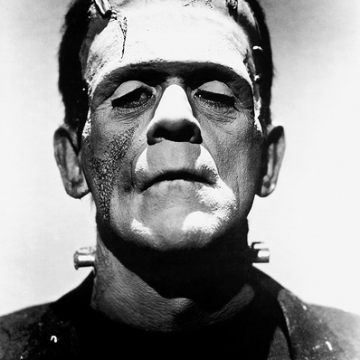

We are more often frightened than hurt: and we suffer more from imagination than from reality. - philosiblog

We are more often frightened than hurt: and we suffer more from imagination than from reality. - philosiblog

https://philosiblog.com/2013/10/12/we-are-more-often-frightened-than-hurt-and-we-suffer-more-from-imagination-than-from-reality/

We are more often frightened than hurt: and we suffer more from imagination than from reality. – Seneca What does that mean? Given that this is October, and the scariest night of the year is just a few weeks away, this is a very appropriate quote. This is what being frightened is all about, for those who …