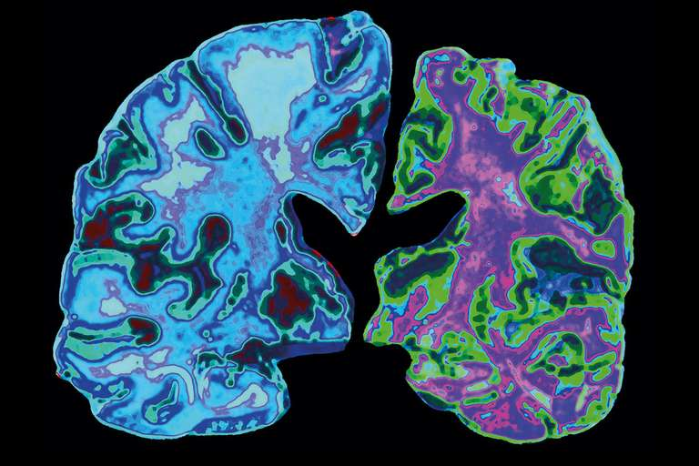
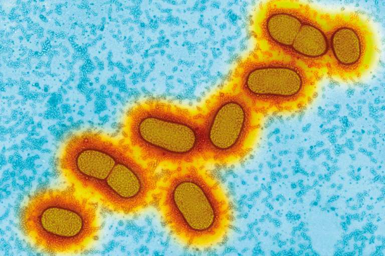

We may finally know what causes Alzheimer’s – and how to stop it

# We may finally know what causes Alzheimer’s – and how to stop it

[![](data:image/svg+xml,%3csvg xmlns='http://www.w3.org/2000/svg' xmlns:xlink='http://www.w3.org/1999/xlink' viewBox='0 0 32 32' version='1.1' role='img' aria-labelledby='at-svg-twitter-2' title='Twitter' alt='Twitter' style='width: 32px%3b height: 32px%3b' class='at-icon at-icon-twitter js-evernote-checked' data-evernote-id='751'%3e%3ctitle id='at-svg-twitter-2' data-evernote-id='752' class='js-evernote-checked'%3eTwitter%3c/title%3e%3cg data-evernote-id='753' class='js-evernote-checked'%3e%3cpath d='M27.996 10.116c-.81.36-1.68.602-2.592.71a4.526 4.526 0 0 0 1.984-2.496 9.037 9.037 0 0 1-2.866 1.095 4.513 4.513 0 0 0-7.69 4.116 12.81 12.81 0 0 1-9.3-4.715 4.49 4.49 0 0 0-.612 2.27 4.51 4.51 0 0 0 2.008 3.755 4.495 4.495 0 0 1-2.044-.564v.057a4.515 4.515 0 0 0 3.62 4.425 4.52 4.52 0 0 1-2.04.077 4.517 4.517 0 0 0 4.217 3.134 9.055 9.055 0 0 1-5.604 1.93A9.18 9.18 0 0 1 6 23.85a12.773 12.773 0 0 0 6.918 2.027c8.3 0 12.84-6.876 12.84-12.84 0-.195-.005-.39-.014-.583a9.172 9.172 0 0 0 2.252-2.336' fill-rule='evenodd' data-evernote-id='754' class='js-evernote-checked'%3e%3c/path%3e%3c/g%3e%3c/svg%3e)](https://www.newscientist.com/article/2191814-we-may-finally-know-what-causes-alzheimers-and-how-to-stop-it/#)[![](data:image/svg+xml,%3csvg xmlns='http://www.w3.org/2000/svg' xmlns:xlink='http://www.w3.org/1999/xlink' viewBox='0 0 32 32' version='1.1' role='img' aria-labelledby='at-svg-email-3' title='Email' alt='Email' style='width: 32px%3b height: 32px%3b' class='at-icon at-icon-email js-evernote-checked' data-evernote-id='755'%3e%3ctitle id='at-svg-email-3' data-evernote-id='756' class='js-evernote-checked'%3eEmail%3c/title%3e%3cg data-evernote-id='757' class='js-evernote-checked'%3e%3cg fill-rule='evenodd' data-evernote-id='758' class='js-evernote-checked'%3e%3c/g%3e%3cpath d='M27 22.757c0 1.24-.988 2.243-2.19 2.243H7.19C5.98 25 5 23.994 5 22.757V13.67c0-.556.39-.773.855-.496l8.78 5.238c.782.467 1.95.467 2.73 0l8.78-5.238c.472-.28.855-.063.855.495v9.087z' data-evernote-id='759' class='js-evernote-checked'%3e%3c/path%3e%3cpath d='M27 9.243C27 8.006 26.02 7 24.81 7H7.19C5.988 7 5 8.004 5 9.243v.465c0 .554.385 1.232.857 1.514l9.61 5.733c.267.16.8.16 1.067 0l9.61-5.733c.473-.283.856-.96.856-1.514v-.465z' data-evernote-id='760' class='js-evernote-checked'%3e%3c/path%3e%3c/g%3e%3c/svg%3e)](https://www.newscientist.com/article/2191814-we-may-finally-know-what-causes-alzheimers-and-how-to-stop-it/#)[![](data:image/svg+xml,%3csvg xmlns='http://www.w3.org/2000/svg' xmlns:xlink='http://www.w3.org/1999/xlink' viewBox='0 0 32 32' version='1.1' role='img' aria-labelledby='at-svg-whatsapp-4' title='WhatsApp' alt='WhatsApp' style='width: 32px%3b height: 32px%3b' class='at-icon at-icon-whatsapp js-evernote-checked' data-evernote-id='761'%3e%3ctitle id='at-svg-whatsapp-4' data-evernote-id='762' class='js-evernote-checked'%3eWhatsApp%3c/title%3e%3cg data-evernote-id='763' class='js-evernote-checked'%3e%3cpath d='M19.11 17.205c-.372 0-1.088 1.39-1.518 1.39a.63.63 0 0 1-.315-.1c-.802-.402-1.504-.817-2.163-1.447-.545-.516-1.146-1.29-1.46-1.963a.426.426 0 0 1-.073-.215c0-.33.99-.945.99-1.49 0-.143-.73-2.09-.832-2.335-.143-.372-.214-.487-.6-.487-.187 0-.36-.043-.53-.043-.302 0-.53.115-.746.315-.688.645-1.032 1.318-1.06 2.264v.114c-.015.99.472 1.977 1.017 2.78 1.23 1.82 2.506 3.41 4.554 4.34.616.287 2.035.888 2.722.888.817 0 2.15-.515 2.478-1.318.13-.33.244-.73.244-1.088 0-.058 0-.144-.03-.215-.1-.172-2.434-1.39-2.678-1.39zm-2.908 7.593c-1.747 0-3.48-.53-4.942-1.49L7.793 24.41l1.132-3.337a8.955 8.955 0 0 1-1.72-5.272c0-4.955 4.04-8.995 8.997-8.995S25.2 10.845 25.2 15.8c0 4.958-4.04 8.998-8.998 8.998zm0-19.798c-5.96 0-10.8 4.842-10.8 10.8 0 1.964.53 3.898 1.546 5.574L5 27.176l5.974-1.92a10.807 10.807 0 0 0 16.03-9.455c0-5.958-4.842-10.8-10.802-10.8z' fill-rule='evenodd' data-evernote-id='764' class='js-evernote-checked'%3e%3c/path%3e%3c/g%3e%3c/svg%3e)](https://www.newscientist.com/article/2191814-we-may-finally-know-what-causes-alzheimers-and-how-to-stop-it/#)[![](data:image/svg+xml,%3csvg xmlns='http://www.w3.org/2000/svg' xmlns:xlink='http://www.w3.org/1999/xlink' viewBox='0 0 32 32' version='1.1' role='img' aria-labelledby='at-svg-reddit-5' title='Reddit' alt='Reddit' style='width: 32px%3b height: 32px%3b' class='at-icon at-icon-reddit js-evernote-checked' data-evernote-id='765'%3e%3ctitle id='at-svg-reddit-5' data-evernote-id='766' class='js-evernote-checked'%3eReddit%3c/title%3e%3cg data-evernote-id='767' class='js-evernote-checked'%3e%3cpath d='M27 15.5a2.452 2.452 0 0 1-1.338 2.21c.098.38.147.777.147 1.19 0 1.283-.437 2.47-1.308 3.563-.872 1.092-2.06 1.955-3.567 2.588-1.506.634-3.143.95-4.91.95-1.768 0-3.403-.316-4.905-.95-1.502-.632-2.69-1.495-3.56-2.587-.872-1.092-1.308-2.28-1.308-3.562 0-.388.045-.777.135-1.166a2.47 2.47 0 0 1-1.006-.912c-.253-.4-.38-.842-.38-1.322 0-.678.237-1.26.712-1.744a2.334 2.334 0 0 1 1.73-.726c.697 0 1.29.26 1.78.782 1.785-1.258 3.893-1.928 6.324-2.01l1.424-6.467a.42.42 0 0 1 .184-.26.4.4 0 0 1 .32-.063l4.53 1.006c.147-.306.368-.553.662-.74a1.78 1.78 0 0 1 .97-.278c.508 0 .94.18 1.302.54.36.36.54.796.54 1.31 0 .512-.18.95-.54 1.315-.36.364-.794.546-1.302.546-.507 0-.94-.18-1.295-.54a1.793 1.793 0 0 1-.533-1.308l-4.1-.92-1.277 5.86c2.455.074 4.58.736 6.37 1.985a2.315 2.315 0 0 1 1.757-.757c.68 0 1.256.242 1.73.726.476.484.713 1.066.713 1.744zm-16.868 2.47c0 .513.178.95.534 1.315.356.365.787.547 1.295.547.508 0 .942-.182 1.302-.547.36-.364.54-.802.54-1.315 0-.513-.18-.95-.54-1.31-.36-.36-.794-.54-1.3-.54-.5 0-.93.183-1.29.547a1.79 1.79 0 0 0-.54 1.303zm9.944 4.406c.09-.09.135-.2.135-.323a.444.444 0 0 0-.44-.447c-.124 0-.23.042-.32.124-.336.348-.83.605-1.486.77a7.99 7.99 0 0 1-1.964.248 7.99 7.99 0 0 1-1.964-.248c-.655-.165-1.15-.422-1.486-.77a.456.456 0 0 0-.32-.124.414.414 0 0 0-.306.124.41.41 0 0 0-.135.317.45.45 0 0 0 .134.33c.352.355.837.636 1.455.843.617.207 1.118.33 1.503.366a11.6 11.6 0 0 0 1.117.056c.36 0 .733-.02 1.117-.056.385-.037.886-.16 1.504-.366.62-.207 1.104-.488 1.456-.844zm-.037-2.544c.507 0 .938-.182 1.294-.547.356-.364.534-.802.534-1.315 0-.505-.18-.94-.54-1.303a1.75 1.75 0 0 0-1.29-.546c-.506 0-.94.18-1.3.54-.36.36-.54.797-.54 1.31s.18.95.54 1.315c.36.365.794.547 1.3.547z' fill-rule='evenodd' data-evernote-id='768' class='js-evernote-checked'%3e%3c/path%3e%3c/g%3e%3c/svg%3e)](https://www.newscientist.com/article/2191814-we-may-finally-know-what-causes-alzheimers-and-how-to-stop-it/#)[[21K](https://www.newscientist.com/article/2191814-we-may-finally-know-what-causes-alzheimers-and-how-to-stop-it/#)](https://www.newscientist.com/article/2191814-we-may-finally-know-what-causes-alzheimers-and-how-to-stop-it/#)

   [Health](https://www.newscientist.com/subject/health/)     23 January 2019 , updated 30 January 2019

Alzheimer’s disease has destroyed neurons in the right-hand brain above
Jessica Wilson/Science Photo Library
By Debora MacKenzie

AFTER decades of disappointment, we may have a new lead on fighting Alzheimer’s disease. Compelling evidence that the condition is caused by a bacterium involved in gum disease could prove a game-changer in tackling one of medicine’s biggest mysteries, and lead to effective treatments or even a vaccine.

As populations have aged, dementia has skyrocketed to become the fifth biggest cause of death worldwide. Alzheimer’s constitutes some 70 per cent of these cases (see “[What is Alzheimer’s disease](https://www.newscientist.com/article/2191814-we-may-finally-know-what-causes-alzheimers-and-how-to-stop-it/#bx321530B1)”), yet we don’t know what causes it. The condition, which results in progressive loss of memory and cognitive function, usually over a decade or so, is devastating both to those who have it and to their loved ones.

The condition often involves the accumulation of two types of proteins – called amyloid and tau – in the brain. As these are among the earliest physical signs of the disease, the leading hypothesis [since 1984](https://www.sciencedirect.com/science/article/pii/S0006291X84801904?via%3Dihub) has been that the condition is caused by the defective control of these proteins, especially amyloid, which accumulates to form large, sticky plaques in the brain.

The bulk of research into understanding and treating Alzheimer’s has centred on this “amyloid hypothesis”. Huge sums of money have been invested in experiments involving mice genetically modified to produce amyloid, and in developing drugs that block or destroy amyloid proteins, or sometimes degraded tangles of tau.

It has become clear that this approach isn’t working. In 2018 alone, the US National Institutes of Health spent $1.9 billion on Alzheimer’s research. But according to [a recent study](https://www.sciencedirect.com/science/article/pii/S235287371830026X), the failure rate of drug development for Alzheimer’s has been 99 per cent.

Some have begun to [question the amyloid hypothesis](https://www.newscientist.com/article/mg23331103-300-the-alzheimers-problem-why-are-we-struggling-to-find-a-cure/). The lack of results has been compounded by the discovery that people – including some [in their 90s with exceptional memories](https://www.newscientist.com/article/2112820-superagers-with-amazing-memories-have-alzheimers-brain-plaques/) – can have brain plaques and tangles without having dementia. In a review of the research to date last year, Bryce Vissel at the University of Technology Sydney, Australia, concluded that there isn’t sufficient data to suggest that “amyloid has a central or unique role in Alzheimer’s”.

–– ADVERTISEMENT ––

“The bacteria in the brain are not the result of Alzheimer’s, but they could be the cause”

In 2016, researchers discovered that amyloid seems to function as a sticky defence against bacteria. They found that the protein can act as an anti-microbial compound that kills bacteria, and when they injected bacteria into the brains of mice engineered to make Alzheimer’s proteins, plaques developed round bacterial cells overnight.

At the time, the team said it still believed that amyloid itself went on to cause the brain damage of Alzheimer’s, not bacteria. But a spate of subsequent studies have [looked at microbes](https://www.ncbi.nlm.nih.gov/pmc/articles/PMC3073380/). Bacteria have been found in the brains of people who had Alzheimer’s when they were alive. But it hasn’t been clear whether the bacteria caused the disease or were simply able to enter brains damaged by Alzheimer’s.

Multiple teams have been researching Porphyromonas gingivalis, the main bacterium involved in [gum disease](https://www.ncbi.nlm.nih.gov/pmc/articles/PMC4399973/), which is a known risk factor for Alzheimer’s. So far, teams have found that P. gingivalis [invades and inflames brain regions](https://content.iospress.com/articles/journal-of-alzheimers-disease/jad140315) affected by Alzheimer’s; that gum infections can [worsen symptoms in mice](https://www.nature.com/articles/s41514-017-0015-x.pdf) genetically engineered to have Alzheimer’s; and that it can cause Alzheimer’s-like brain inflammation, neural damage and [amyloid plaques in healthy mice](https://doi.org/10.1371/journal.pone.0204941).

## A whole new hypothesis

“When science converges from multiple independent laboratories like this, it is very compelling,” says Casey Lynch of Cortexyme, a pharmaceutical firm in San Francisco.

Now researchers from Cortexyme and several universities have reported finding the two toxic enzymes that *P. gingivalis* uses to feed on human tissue in 99 and 96 per cent of 54 human Alzheimer’s brain samples taken from the hippocampus – a brain area important for memory (*Science Advances*, [doi.org/gftvdt](http://dx.doi.org/gftvdt)). These protein-degrading enzymes are called gingipains, and they were found in higher levels in brain tissue that also had more tau fragments and thus more cognitive decline.

The team also found genetic material from *P. gingivalis* in the cerebral cortex – a region involved in conceptual thinking – in all three Alzheimer’s brains they looked for it in.

“This is the first report showing *P. gingivalis* DNA in human brains, and the associated gingipains co-localising with plaques,” says Sim Singhrao at the University of Central Lancashire, UK, who wasn’t involved in the study. Her team has previously found that *P. gingivalis*  [actively invades the brains of mice](https://content.iospress.com/articles/journal-of-alzheimers-disease/jad140315) with gum infections.

When Lynch and her colleagues looked at brain samples from people without Alzheimer’s, they saw that some had *P. gingivalis* and protein accumulations, but at low levels. We already know that amyloid and tau can accumulate in the brain for 10 or 20 years before Alzheimer’s symptoms begin. This, says the team, shows that *P. gingivalis* doesn’t get into the brain as a result of Alzheimer’s – but could be the cause.

The *Porphyromonas gingivalis* bacteria that can cause gum disease
A. Dowsett, Public Health England/Science Photo Library

When the team gave *P. gingivalis* gum disease to mice, it led to brain infection, amyloid production, tangles of tau protein and neural damage in the regions and nerves normally affected by Alzheimer’s. This suggests causation, says Lynch.

She adds that *P. gingivalis* fulfils an updated set of criteria for attributing a disease to a particular pathogen. These conditions are named Koch’s postulates, after Robert Koch, a founder of the germ theory of disease.

“The study does address most of Koch’s postulates,” says Robert Genco of the University at Buffalo, New York. “Future studies need to be in humans to be convincing.”

We don’t know how *P. gingivalis* gets into the brain, but there are plausible routes it could take. Your mouth normally hosts a diverse and relatively stable community of bacteria, but when dental plaque builds under the edge of your gums, it can form inflamed pockets in which *P. gingivalis* can thrive and release toxins.

#### Read more: [Here’s how to avoid gum disease](https://www.newscientist.com/article/2191842-gum-disease-may-be-the-cause-of-alzheimers-heres-how-to-avoid-it/)

This inflammation can lead to [chronic periodontitis and tooth loss](https://www.newscientist.com/article/2191842-gum-disease-may-be-the-cause-of-alzheimers-heres-how-to-avoid-it/), and some studies have shown that people with [fewer teeth](https://jada.ada.org/article/S0002-8177(14)63215-3/abstract) are [more likely to have dementia](https://www.alzheimersanddementia.com/article/S1552-5260(06)00003-3/abstract). The inflammation and toxins caused by *P. gingivalis* damage the lining of your mouth, which may make it possible for oral bacteria to enter the bloodstream and then other organs. Even if you don’t have gum disease, transient damage to your mouth lining from eating or tooth-brushing can let mouth bacteria into your blood, says Lynch.

The blood-brain barrier should protect your brain from microbes, but *P. gingivalis* can invade white blood cells and the cells lining blood vessels, so might cross it that way. It may also invade cranial nerves near the mouth, then spread from cell to cell towards the brain over a period of years.

“This is why years of efforts to treat Alzheimer’s have seen few results”

As to how *P. gingivalis* might cause dementia after it arrives in the brain, there are two clear possibilities. It may trigger the release of amyloid, the brain’s method of trying to contain the infection, and this may then kill neurons.

Or *P. gingivalis* may directly damage the brain. We already know that Alzheimer’s involves inflammation, an excessive immune response that ends up killing neurons instead of protecting them. *P. gingivalis* is known to cause inflammation in gum tissue, and it may do so in the brain as well.

In response to the new findings, David Reynolds of the Alzheimer’s UK charity said he is dubious that *P. gingivalis* causes Alzheimer’s, because of the evidence showing that a person’s genes play a crucial role in the disease. “Strong genetic evidence indicates that factors other than bacterial infections are central to the development of Alzheimer’s, so these new findings need to be taken in the context of this existing research,” he said in a statement.

#### Read more: [Wake-up call: How a lack of sleep can cause Alzheimer’s](https://www.newscientist.com/article/mg23631470-600-wake-up-call-how-a-lack-of-sleep-can-cause-alzheimers/)

But a bacterial hypothesis for Alzheimer’s doesn’t conflict with genetic evidence. The human body’s propensity for inflammation can vary according to genetic variations that affect our immune systems, and this may influence how much damage *P. gingivalis* induces in a brain.

The biggest genetic risk factor for Alzheimer’s is a variant of the gene that makes the ApoE immune protein. Last year, a team in Sweden found that the gingipains released by *P. gingivalis* break up the ApoE protein into fragments, cleaving it at the site of a particular amino acid within the protein, and that these fragments may harm nerves. The ApoE4 variant of this protein contains more of this amino acid, suggesting that the reason people who make this variant are at a higher risk of developing Alzheimer’s may be because harmful levels of ApoE protein fragments build up more quickly in their brains than in those of other people.

## Hope for treatments

The speed at which damage accumulates is a key factor in the disease. Although many people harbour *P. gingivalis* in their mouths, only some develop Alzheimer’s. Because it can be decades before Alzheimer’s symptoms appear, whether a person develops the condition could come down to how much damage occurs before they die of other causes.

“Alzheimer’s strikes people who accumulate gingipains and damage in the brain fast enough to develop symptoms during their lifetimes,” says Lynch. She says her team’s findings are a “universal hypothesis of pathogenesis”, fully explaining the causes of Alzheimer’s disease.

But Vissel warns that Alzheimer’s is a complex disease. “The answer is unlikely to be one-cause-fits-all. We need to keep open eyes.”

However, the new study is “very exciting”, he says. “Alzheimer’s is so common in people at advanced age that I think it can only be either some intrinsic property of the brain, or an infection.”

If this new hypothesis of Alzheimer’s is borne out, the good news is that it could lead to effective treatments for the condition. Although there is plenty you can do to reduce your risk of gum disease, Cortexyme is hoping it can stop or even reverse Alzheimer’s using molecules it has developed that block gingipains. The firm found that giving some of these to mice with *P. gingivalis* infections reduced brain infection, halted amyloid production, lowered brain inflammation and even rescued damaged neurons. “This provides hope of treating or preventing Alzheimer’s disease one day,” says Singhrao.

#### Read more: [The Alzheimer’s problem: Why we are struggling to find a cure](https://www.newscientist.com/article/mg23331103-300-the-alzheimers-problem-why-are-we-struggling-to-find-a-cure/)

Cortexyme [reported last year](https://www.cortexyme.com/single-post/2018/10/24/Cortexyme-announces-phase-I-data-demonstrating-COR388-is-safe-and-well-tolerated-in-healthy-older-volunteers-and-Alzheimers-patients) that the best of its gingipain blockers had passed initial safety tests in people, and entered the brain. It also seemed to improve symptoms in participants with Alzheimer’s. The firm will launch a larger trial later this year.

The company also plans to test the drug against gum disease itself. Efforts to fight that have led a team in Melbourne to develop a vaccine for *P. gingivalis* that [started tests in 2018](https://www.mtpconnect.org.au/Article?Action=View). A vaccine for gum disease would be welcome – and if it also stops Alzheimer’s the impact could be enormous.

It is early days for this new hypothesis, and if the pursuit of amyloid-busting drugs over the past few decades has taught us anything, says Vissel, it is that a complex disease may not have a simple mechanism. Even if *P. gingivalis* is confirmed as a cause of Alzheimer’s, we don’t know yet whether it will turn out to be the only cause or one of several factors contributing to the disease.

“This paper is very important,” says George Perry at the University of Texas at San Antonio. “The view that pathogens might be one of several paths leading to Alzheimer’s disease fits my current thoughts of amyloid and tau being critical brain responses to injury, instead of the initiators.”

That, he says, is why years of efforts to treat Alzheimer’s by removing those proteins have seen few results: they are symptoms of the disease, not its cause. “This is a further turning point in the understanding that infections and inflammation can be at the heart of Alzheimer’s disease.”

### What is Alzheimer’s disease?

There are many types and causes of dementia, but Alzheimer’s disease is the most common form, accounting for between 60 and 70 per cent of all cases.

Common early symptoms of Alzheimer’s include short-term memory loss, apathy and depressed mood, but these symptoms are often just seen as being a part of normal ageing, making early diagnosis difficult.

Doctors diagnose Alzheimer’s on the basis of medical examination, patient history and cognitive tests, and can use imaging to rule out other forms of dementia. However, a definitive diagnosis of Alzheimer’s is only possible after death, when examination of brain tissue can reveal whether a person had the deposits of amyloid and tau proteins (see main story) that are characteristic of the condition.

The vast majority of people with Alzheimer’s are diagnosed with the condition after the age of 65, but clumps of amyloid protein can begin to build up in the brain some 15 or 20 years before symptoms appear. We have long hoped for diagnostic tests that can determine if someone has Alzheimer’s before death, and spot the condition before extensive brain damage has occurred. **Donna Lu**

### Bad bacteria and other microbes

It might seem surprising that a mouth bacterium has been implicated in Alzheimer’s disease (see main story). But it wouldn’t be the first time an illness has turned out to have an unexpected infectious origin.

The iconic case is stomach ulcers, once thought to be caused by stress or excess acid, and treated with acid-lowering medications. Then Australian doctor Barry Marshall showed that a stomach bacterium called *Helicobacter pylori* was behind them, a feat that won him a Nobel prize.

*Streptococcus* bacteria, which cause tonsillitis and “strep throat”, are suspected of triggering obsessive-compulsive disorder in children. The thinking is that the immune system’s attack on the bacteria cross-reacts with certain human proteins, causing an autoimmune attack against the person’s own brain tissue.

Bacteria aren’t the only ones under suspicion. There are indications that a virus is behind some cases of obesity. And one study has found that people with antibodies to a single-celled brain parasite called *Toxoplasma gondii*, which is spread in cat faeces, are more likely to develop schizophrenia. Some people think up to a third of cases could be caused by infection with *T. gondii*.

But not all purported links bear fruit. Twenty years ago, there was great excitement when a bacterium that can cause pneumonia lung infections was found in the blood vessel plaques that cause heart disease. But giving people antibiotics to kill this bug didn’t help reduce heart attacks. **Clare Wilson**

****

**Journal reference: *Science Advances*, [DOI: 10.1126/sciadv.aau3333](http://advances.sciencemag.org/content/5/1/eaau3333)**

*This article was updated on 30 January 2019 to add more detail and comment*

#### **Article amended on** 24 January 2019

The spelling of the toxic enzymes made by *P. gingivalis *was corrected
More on these topics:

- [mental health](https://www.newscientist.com/article-topic/mental-health/)
- [dementia](https://www.newscientist.com/article-topic/dementia/)
- [health](https://www.newscientist.com/article-topic/health/)
- [Alzheimer’s](https://www.newscientist.com/article-topic/alzheimers/)