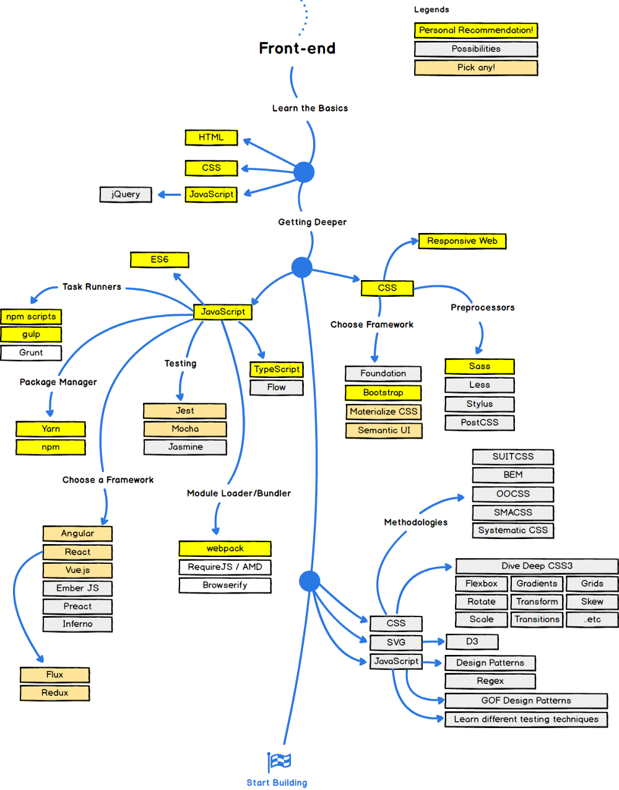

Web Development… How to get started in 2017? – hello JS

# Web Development… How to get started in 2017?

It’s 2017 and web development and machine learning are hot topics now. In this article I will talk about web development.

There are lots of new technologies for web development coming out every month. Recently I read an article on medium “[A roadmap to becoming a web developer](https://medium.freecodecamp.com/a-roadmap-to-becoming-a-web-developer-in-2017-b6ac3dddd0cf)” where a map of all the web related technologies are listed. Here are the maps for those lazy enough not to open the aforementioned article.

Many people have asked me how to start with web development from scratch.

I am assuming that you know Git before working on a project. If you don’t know it, learn it. It’s necessary.

* * *

*...*

### FrontEnd

Simple… Start with HTM5, CSS3, JS. But why all and how?

Soure: https://www.freecodecamp.com/

#### Level 0:

You need to learn HTML. Like don’t learn it just know how to use [https://www.w3schools.com](https://www.w3schools.com/) as a reference. You will learn it while you use it.

Then once you know how to put content on your browser, learn to make that beautiful. Again don’t mug it up just learn while doing.

Then comes JavaScript. [OK… One thing. People would say start with JavaScript but I would suggest starting with the latest version of ECMAScript. No confusing bindings or prototype salad with ES2016+]. Basically I would recommend not to start with jQuery at this moment but first get your hands dirty with VanillaJS (Plain old simple JavaScript).

Once you are comfortable with opening a code editor, browser and displaying your code in the browser, build a very small project… A really tiny project. (Replicate this if you wish: https://jazzyarchitects.github.io/NumberGuess/)

#### Level 1:

Now increase your learning rate and start either with AngularJS or ReactJS. Choose any one and stick to it for a while. This could take a while to learn and would also require more effort but it is worth it.

Once you start with React or Angular you will start using lots of libraries. So for managing these libraries start learning *yarn*. **Not NPM or BOWER but YARN**.

Also get your hands dirty with SASS or LESS. It is optional but will help in long run.

#### Level 2:

With all the libraries and optimizations you wish to include in your web page you would require the power of automation. **Start GruntJS or GulpJS**.

#### Level 3+ (If you still have motivation to learn):

With level 2 completed you can successfully build a website front end using the latest technology trends. But for getting a step ahead learn TypeScript and BabelJS. Get familiar with RequireJS or WebPacks. Migrate from ReactJS to InfernoJS (Its smaller and faster).

Do me a favor and don’t use jQuery with AngularJS or ReactJS.

If still you want to experiment, try all the other technologies shown in the chart.

* * *

*...*

### Backend

Every site requires a backend to serve files and a lot of technologies are there for the same and it is all confusing.

Source: https://www.freecodecamp.com/

#### Level 0:

Start your backend with NodeJS. Why? Well I assume you learned JavaScript from frontend so continuing the same path start NodeJS. Use ExpressJS along with MongoDB for a complete JavaScript oriented stack.

### Route 1:

#### Level 1:

Once you get a good idea of NodeJS use more interesting features like server side rendering, socket.io and automated testing methods. This will familiarize you with more concepts of web development.

#### Level 2:

Move from callbacks and promises to async/await. Start linting your code. Deploy the code on AWS EC2 instance. Get your site running.

Then keep NodeJS aside and start GoLang. Its faster.

### Route 2:

#### Level 1:

Move from NodeJS to Ruby on Rails. You will see how most of the code you had to write in NodeJS has already been implemented in Rails. But Rails won’t take you that far as it has its own drawbacks.

#### Level 2:

After few days or weeks of Rails move over to Django or Flask. The syntax is similar to rails but the architecture is different. Django is more in demand as compared to Rails (as far as I know). Start Unit testing and automations with django.

### Common to all Routes:

#### Level 3:

Leave a single database concept and move to redis with a primary database. Feel the power of caching with redis or memcache.

#### Concepts to know:

JWT (JSON web token)
Nginx
Elasticsearch
Security
Shell Scripts

I am leaving out the DevOps part as of now else the amount of things you need to learn would become demotivating for you.

Sooo…What more? Go now… Start…