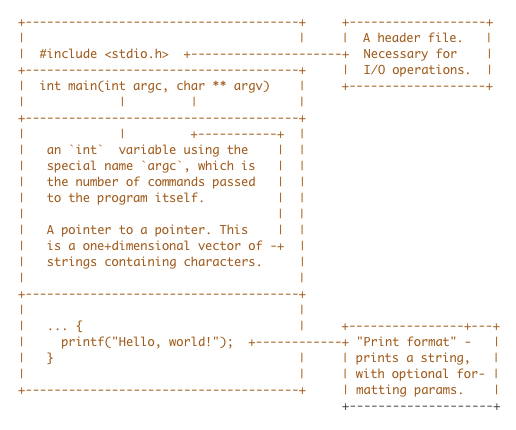

WebAssembly: JavaScript without the JavaScript

 WebAssembly: JavaScript without the JavaScript

EDIT: There's some discussion this blog post over at [Hacker News](https://news.ycombinator.com/item?id=14663828)

* * *

I think most of us know what WebAssembly is, or at least what it aims to achieve - a standardized solution to the "JavaScript problem". That is, it is a way to achieve all of the following goals at the same time [[0]](http://webassembly.org/docs/high-level-goals/):

- Not breaking any JavaScript-dependent applications and/or websites
- Providing new, concise and less confusing options -- instead of JavaScript -- for a developer targeting the web
- Allowing established developers to exercise paradigms such as functional programming, without having to learn a large number of workarounds
- Introducing important features like strong static type checking to a language that otherwise does not have it
- Making the entire idea of writing an application for the browser less painful as a whole
- (and more).

Indeed, there are a plethora of benefits to abstracting away JavaScript's many quirks, which are themselves largely due to the language’s forced and continued evolution over time; until recently, the powers that be (namely, the W3C) hadn't decided on a standard implementation that satisfied all of the goals above. Now, though, its sights are set on these, in addition to others such as isolated execution environments, and accelerated processing speed that is closer to what one would expect from a C or C++ program compiled locally [[1]](http://webassembly.org/docs/c-and-c++/).

## Architecture

The whole point of WebAssembly is to provide something - a binary target - that every other desired language can compile to. I think it's important that we understand this specification quite well, or we might be quite confused when we encounter an error relating to it (particularly in these earlier stages of development).

What is a "binary encoding"? It's an encoding of an otherwise "regular" file format that is designed to be:

- Very small
- Efficiently decoded
- Capable of any file data (After all, it is a simple representation of anything).

Due to the fact that binary files have existed for *quite* a while, they are usually also:

- Compiled from a target language
- Interoperable (capable of being run on multiple architectures and/or operating systems)
- Immutable (The binary file does not change at runtime).

According to the current specification of WebAssembly, these assumptions appear to be true, except that the number of target languages may expand over time [[2]](http://webassembly.org/docs/tooling/).

A human is not expected to modify the compiled source code of a traditional language such as C, and the same rule applies here - but,for the same reasons, it lends itself quite easily to many different tools (JIT compilation, explicit optimizations that we feeble humans are biologically incapable of producing, etc)

 [[3]](http://webassembly.org/docs/jit-library/).

Without even diving into the rest of this new web technology, we have access to C/C++ compilation to JavaScript (via Emscripten [[4]](http://kripken.github.io/emscripten-site/index.html), along with a profound increase in performance over manually authored versions [[5]](http://webassembly.org/docs/portability/).

It is planned, at the time of this writing, to provide two additional layers on top of the binary encoding already provided - compression based on the structure of the syntax tree, and compression with commonly used tools ( `gzip`, for instance).

## Syntax

Learning the language of WebAssembly's binary format is made easier with its inclusion of a text-oriented representation. In much the same way, I think, as one might learn x86 assembly, WebAssembly affords you a slightly more readable version of the encoded instructions in a familiar way: operations such as storing a value in a register (i.e, a 64-bit integer can allocate space to memory with opcode `0x37`, referred to as `i64.store`  [[6]](http://webassembly.org/docs/binary-encoding/#memory-related-operators-described-here)) are not just heavily inspired by "real" assembly languages, but directly analogous to them.

There is much more to read on this particular sub-topic from the actual [source](http://webassembly.org/docs/binary-encoding/), and I highly encourage experimentation to further your understanding. That being said, the learning materials are still being built, as the spec is quite new (and only the MVP has been finalized). There's nothing to be lost from trying, though, and with a project this interesting, you are sure to learn quite a bit.

## See some WASM

Before you begin tinkering with the future of the modern web, let's run through some of the results that have been obtained, and create a few of our own.

It is now well-known that the Unity [[7]](https://unity3d.com/) game

engine is now capable of exporting to WebAssembly for execution in the browser. There are several examples for us to gaze at - among them:

- The "Tanks!" Unity [tutorial project](https://unity3d.com/learn/tutorials/projects/tanks-tutorial)exported to WASM
- A nice ["Zen Garden"](https://s3.amazonaws.com/mozilla-games/ZenGarden/EpicZenGarden.html)built on Unreal Engine 4 and ported to WASM
- A demo FPS called[bananabread](https://kripken.github.io/BananaBread/cube2/bb.html)

There are more, and the list continues to grow (at a much larger

momentum, now, due to the aforementioned MVP consensus). Even so, it is quite impressive what can already be accomplished.

## Learn some WASM

The "de facto" example for newcomers wishing to compile C or C++ code to the WebAssembly format is probably something you've previously written - likely, you've already guessed it - a "Hello World" application. What would that look like, here? Well, since a "Hello World" program usually just outputs a string to the terminal, the analogue in a browser environment would be the developer console.

So, first, we'll need a functioning `C` or `C++` program that we want to see in the browser. Fair enough - we can do that, right? (Even if you haven't used either of these languages, I'm sure you'll be able to follow along to some degree.)

`ex1.c`

	#include <stdio.h>

	int main(int argc, char ** argv) { printf("Hello, world!"); }

Disclaimer: This is the same program to be found in various other
tutorials aimed specifically at WebAssembly compilation. However, its
purpose is much the same here, and so I choose to use it again.
To briefly explain for those not familiar with the `C` language:

If you compile this in the normal fashion (with `gcc`, or `clang`, for instance), and run your "program", the shocking result will be "Hello, world!" printed to the standard output (your terminal). Browsers do not have terminals, as I mentioned earlier, but they do have consoles to print to! That's what we'll do in a while. But first, you must learn about the `emscripten` project, and `LLVM`.

### Emscripten

`Emscripten` is a tool that converts `LLVM` bitcode into JavaScript. In short, it can take your C/C++ code, and output a browser-compliant version.

The Mozilla Emscripten project has existed far prior to the WASM standard, but we now see interoperability and the ability to compile a WASM module that conforms to the newly agreed-upon MVP. By default, it produces JavaScript compliant with `asm.js`, which is not the same as WebAssembly; however, they share similar goals. I find it likely that the `asm.js` format will decrease in popularity if WASM becomes a "mainstream" product, but this remains to be seen.

You can learn *far* more about `Emscripten` at its official [project page](http://kripken.github.io/emscripten-site/).

### LLVM

To put it simply, `LLVM` is a set of tools (once, LLVM stood for "Low Level Virtual Machine", but there are so many components included with it now that it does not make sense to keep referring to it in that manner) related to compilers. With them, you may produce byte/bitcode or machine code, optimize existing variants of both, and more. It's accordingly "language-agnostic" - that is, it doesn't care if your application was written in Haskell, C++, Perl, Python, or whatever your preference may be. `LLVM` is the concept of "abstraction" taken to a wonderful and successful extreme.

### Fitting them together

How do these tools work to create an optimized binary that conforms to the WASM standard? Well, in this scenario, `Emscripten` is simply a compiler front-end and back-end. It's used to interpret manually authored JavaScript, and send relevant information (by using `Clang`) to `LLVM`, which returns a result back to `Emscripten`'s back-end:

[Fastcomp](http://kripken.github.io/emscripten-site/docs/building_from_source/LLVM-Backend.html#llvm-backend). This is then packaged into some flavor of web-compatible goodness, depending on what configuration options you've set.

As I mentioned before, `Emscripten` produces `asm.js` code by default. If you've gotten this far, you might be happy to know that there's not much to change in order to direct `Emscripten` to compile to a different target. Here it is: run `Emscripten` with `-s WASM=1` to enable the WASM linker flag. That's it.

## A temporary conclusion

In this article, I've summarized the current state of the WebAssembly standard, how *good* it is despite its very young age as a web project, how some of its components work together to produce a strong result, and briefly exposed you to yet another "Hello world" program in C.

In my next post, I will dive deeper into specific mechanics of the assembly language specified by WASM, give instructions on how to compile our simple program, and we'll even start on a *real project*! How fun!

Until next time - don't forget to experiment!

HANDBOOK

Save more time, get more done!

 

FREE HANDBOOK

Innovate from the inside

 