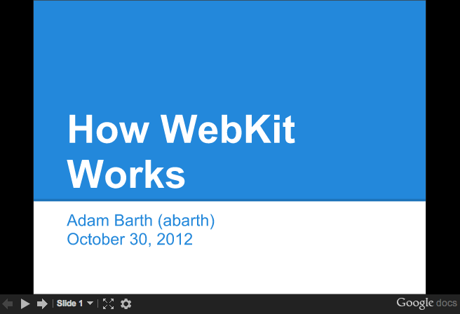

WebKit for Developers - Paul Irish

# WebKit for Developers

Feb 28th, 2013

Feb 2015: A lot’s happened since I wrote this post two years ago. Chrome forked WebKit and [started](http://www.cnet.com/news/google-parts-ways-with-apple-over-webkit-launches-blink/) Blink, Opera [adopted](http://www.brucelawson.co.uk/2013/hello-blink/) Chromium, and node-webkit [became](https://groups.google.com/forum/#!msg/nwjs-general/V1FhvfaFIzQ/720xKVd0jNkJ) nw.js. This post describes a complexity of defining WebKit that doesn’t exist much anymore; with Chrome’s departure the WebKit world is more simple and clear.

WebKit is deployed through iOS Safari and Mac Safari, and the active [GTK community](http://webkitgtk.org/) leverages WebKit inside the GNOME Platform. Some smaller mobile browsers use WebKit, some Chromium, some use forks of either, and many just use the system WebViews that are both powered by up-to-date version of iOS WebKit and Android Chromium.

The post below is kept intact and represents a snapshot of history in early 2013, rather than the modern WebKit landscape.

For many of us developers, **WebKit is a black box**. We throw HTML, CSS, JS and a bunch of assets at it, and WebKit, somehow.. magically, gives us a webpage that looks and works well. But in fact, [as my colleague Ilya Grigorik puts it](https://www.youtube.com/watch?v=kiPe7DPmEgE)…

**

> WebKit **> isn’t**>  a black box. It’s a white box. And not just that, but an **> open**> , white box.

**
So let’s take a moment to understand some things:
What is WebKit?
What isn’t WebKit?
How is WebKit used by WebKit-based browsers?
Why are all WebKits not the same?

Now, especially with the news that [Opera has moved to WebKit](http://my.opera.com/ODIN/blog/300-million-users-and-move-to-webkit), we have a lot of WebKit browsers out there, but its pretty hard to know what they share and where they part ways. Below we’ll hopefully shine some light on this. As a result you’ll be able to diagnose browser differences better, report bugs at the right tracker, and understand how to develop against specific browsers more effectively.

#### Standard Web Browser Components

Let’s lay out a few components of the modern day web browser:

- Parsing (HTML, XML, CSS, JavaScript)
- Layout
- Text and graphics rendering
- Image decoding
- GPU interaction
- Network access
- Hardware acceleration

Which of those are shared in WebKit-based browsers? **Pretty much only the first two.**

The others are handled by individual WebKit ports. Let’s review what that means…

#### The WebKit Ports

There are different “ports” of WebKit, but allow me to let Ariya Hidayat, WebKit hacker and eng director at Sencha[to explain](http://ariya.ofilabs.com/2011/06/your-webkit-port-is-special-just-like-every-other-port.html):

> What is the popular reference to WebKit is usually Apple’s own flavor of WebKit which runs on Mac OS X (> [> the first and the original](http://lists.kde.org/?l=kfm-devel&m=104197092318639&w=2)>  WebKit library). As you can guess, the various interfaces are implemented using different native libraries on Mac OS X, mostly centered around > [> CoreFoundation](http://developer.apple.com/corefoundation/)> . For example, if you specify a flat colored button with specific border radius, well WebKit knows where and how to draw that button. However, the final actual responsibility of drawing the button (as pixels on the user’s monitor) falls into > [> CoreGraphics](http://developer.apple.com/library/ios/#documentation/CoreGraphics/Reference/CoreGraphics_Framework/_index.html)> .

As mentioned above, using CG is unique to the Mac port. Chrome on Mac uses [Skia](http://www.chromium.org/developers/design-documents/graphics-and-skia) here.

> With time, WebKit was “ported” into different platform, both desktop and mobile. Such flavor is often called “a WebKit port”. For Safari Windows, Apple themselves also ported WebKit to run on Windows, using the > [> Windows version](http://developer.apple.com/opensource/internet/webkit_sptlib_agree.html)>  of its (limited implementation of) CoreFoundation library.

… though Safari for Windows is [now dead](http://www.macworld.com/article/1167904/safari_6_available_for_mountain_lion_and_lion_but_not_windows.html).

> Beside that, there were many other “ports” as well (see > [> the full list](http://trac.webkit.org/wiki#WebKitPorts)> ). Google has created and continues to maintain its Chromium port. There is also WebKitGtk which is based on Gtk+. Nokia (through Trolltech, which it acquired) maintains the Qt port of WebKit, popular as its > [> QtWebKit module](http://doc.qt.nokia.com/qtwebkit.html)> .

#### Some of the ports of WebKit

- **Safari**
    - Safari for OS X and Safari for Windows are two different ports
    - WebKit nightly is an edge build of the Mac port that’s used for Safari. More later…
- **Mobile Safari**
    - Maintained in a private branch, but lately [being](http://trac.webkit.org/changeset/142163)  [upstreamed](http://trac.webkit.org/changeset/142373)
    - Chrome on iOS (using Apple’s WebView; more on it’s differences later)
- **Chrome (Chromium)**
    - Chrome on Android (using the Chromium port directly)
    - Chromium also powers [Yandex Browser](http://browser.yandex.ru/), [360 Browser](http://se.360.cn/), [Sogou Browser](http://ie.sogou.com/), and soon, Opera.
- **Android Browser**
    - Used the latest WebKit source at the time
- **[Plenty more ports](http://trac.webkit.org/wiki#WebKitPorts)**: Amazon Silk, Dolphin, Blackberry, QtWebKit, WebKitGTK+, The EFL port (Tizen), wxWebKit, WebKitWinCE, etc

Different ports can have different focuses. The Mac port’s focus is split between Browser and OS, and introduces Obj-C and C++ bindings to embed the renderer into native applications. Chromium’s focus is purely on the browser. QtWebKit offers its port for applications to use as a runtime or rendering engine within its cross-platform GUI application architecture.

## What’s shared in all WebKit browsers

First, let’s review the commonalities shared by all WebKit ports.

You know it’s funny. I tried writing this a few times.
Each time I got corrected by Chrome team members, as you’ll see…

1. So first, WebKit parses HTML the same way. *Well, except Chromium is the only port so far to enable [threaded HTML parsing](https://bugs.webkit.org/showdependencytree.cgi?id=106127&hide_resolved=0) support.*

2. … Okay, but once parsed, the DOM tree is constructed the same. *Well, actually Shadow DOM is [only turned on](http://goo.gl/dsXQf) for the Chromium port, so DOM construction varies. Same goes for custom elements.*

3. … Okay, well WebKit creates a `window` object and `document` object for everyone. *True, though the properties and constructors it exposes can be conditional on the [feature flags](https://trac.webkit.org/wiki/FeatureFlags) enabled.*

4. … CSS parsing is the same, though. Slurping up your CSS and turning it into CSSOM’s pretty standard. *Yeah, though Chrome accepts just the `-webkit-` prefix whereas Apple and other ports accept legacy prefixes like `-khtml-` and `-apple-`.*

5. … Layout.. positioning? Those are the bread and butter. Same, right? Come on! *Sub-pixel layout and saturated layout arithmetic is part of WebKit but differs from port to port.*

6. Super.
So, it’s complicated.

Just like how [Flickr](http://code.flickr.net/2009/12/02/flipping-out/) and [Github](https://github.com/blog/677-how-we-deploy-new-features) implement features behind flags, WebKit does the same. This allows ports to enable/disable all sorts of functionality with [WebKit’s compile-time Feature Flags](https://trac.webkit.org/wiki/FeatureFlags). Features can also be exposed as run-time flags either through [command line switches (Chromium’s here)](http://peter.sh/experiments/chromium-command-line-switches/) or configuration like [about:flags](http://blogs.adobe.com/cantrell/archives/2012/07/all-about-chrome-flags.html).

All right, well let’s try again to codify what’s the same in WebKit land…

#### What’s common to every WebKit port

- The DOM, `window`, `document`
    - more or less
- The CSSOM
- CSS parsing, property/value handling
    - sans vendor prefix handling
- HTML parsing and DOM construction
    - same if we suspended belief in Web Components
- All layout and positioning
    - Flexbox, Floats, block formatting contexts… all shared
- The UI and instrumentation for the Chrome DevTools aka WebKit Inspector.
    - Though since last April, Safari uses it’s own, non-WebKit, closed-source UI for Safari Inspector
- Features like contenteditable, pushState, File API, most SVG, CSS Transform math, Web Audio API, localStorage
    - Though backends vary. Each port may use a different storage layer for localStorage and may use different audio APIs for Web Audio API.
- [Plenty of other features & functionality](http://trac.webkit.org/browser/trunk/Source/WebCore)

It gets a little murky in those areas. Let’s try some differences that are much less murky.

#### Now, what’s *not* shared in WebKit ports:

- Anything on the GPU
    - 3D Transforms
    - WebGL
    - Video decoding
- 2D drawing to the screen
    - Antialiasing approaches
    - SVG & CSS gradient rendering
- Text rendering & hyphenation
- Network stack (SPDY, prerendering, WebSocket transport)
- A JavaScript engine
    - JavaScriptCore is in the WebKit repo. There are bindings in WebKit for both it and V8
- Rendering of form controls
- `<video>` & `<audio>` element behavior (and codec support)
- Image decoding
- Navigating back/forward
    - The navigation parts of pushState()
- SSL features like Strict Transport Security and Public Key Pins

Let’s take one of these: **2D graphics** Depending on the port, we’re using completely different libraries to handle drawing to screen:

Or to go a little more micro… a recently landed feature: `CSS.supports()` was [enabled](http://trac.webkit.org/changeset/142739) for all ports except win and wincairo, which don’t have css3 conditional features enabled.

Now that we’ve gotten technical.. time to get pedantic. Even the above isn’t correct. It’s actually WebCore that’s shared. WebCore is a layout, rendering, and Document Object Model (DOM) library for HTML and SVG, and is generally what people think of when they say WebKit. In actuality “WebKit” is technically the binding layer between WebCore and the ports, though in casual conversation this distinction is mostly unimportant.

A diagram should help:

Many of the components within WebKit are swappable (shown above in gray).

As an example, WebKit’s JavaScript engine, JavaScriptCore, is a default in WebKit. (It is based originally on KJS (from KDE) back when WebKit started as a fork of KHTML). Meanwhile, the Chromium port swaps in V8 here, and uses unique DOM bindings to map things over.

Fonts and Text rendering is a huge part of platform. There are 2 separate text paths in WebKit: Fast and Complex. Both require platform-specific (port-side) support, but Fast just needs to know how to blit glyphs (which WebKit caches for the platform) and complex actually hands the whole string off to the platform layer and says “draw this, plz”.

**> “WebKit is like a Sandwich. Though in Chromium’s case it’s more like a taco. A delicious web platform taco.” > —>  Dimitri Glazkov, Chrome WebKit hacker. Champion of Web Components and Shadow DOM**

Now, let’s widen the lens and look at a few ports and a few subsystems. Below are five ports of WebKit; consider how varied their stacks are, despite sharing much of WebCore.

|     | Chrome (OS X) | Safari (OS X) | QtWebKit | Android Browser | Chrome for iOS |
| --- | --- | --- | --- | --- | --- |
| Rendering | Skia | CoreGraphics | QtGui | Android stack/Skia | CoreGraphics |
| Networking | Chromium network stack | CFNetwork | QtNetwork | Fork of Chromium’s network stack | Chromium stack |
| Fonts | CoreText via Skia | CoreText | Qt internals | Android stack | CoreText |
| JavaScript | V8  | JavaScriptCore | JSC (V8 is used elsewhere in Qt) | V8  | JavaScriptCore (without JITting) * |

* A side note on Chrome for IOS. It uses UIWebView, as you likely know. Due to the capabilities of UIWebView that means it can only use the same rendering layer as Mobile Safari, JavaScriptCore (instead of V8) and a single-process model. Still, considerable Chromium-side code [is leveraged](https://groups.google.com/a/chromium.org/forum/?fromgroups#!topic/chromium-dev/vYGxPx-tVKE), such as the network layer, the sync and bookmarks infrastructure, omnibox, metrics and crash reporting. (Also, for what it’s worth, JavaScript is so rarely the bottleneck on mobile that the lack of JITting compiler has minimal impact.)

## All right, so where does this leave us?

#### So, all WebKits are totally different now. I’m scared.

Don’t be! The [layoutTest coverage in WebKit](http://trac.webkit.org/browser/trunk/LayoutTests) is enormous (28,000 layoutTests at last count), not only for existing features but for any found regressions. In fact, whenever you’re exploring some new or esoteric DOM/CSS/HTML5-y feature, the layoutTests often have fantastic minimal demos of the entire web platform.

In addition, the [W3C is ramping up its effort for conformance suite testing](http://www.w3.org/QA/2013/02/testing_the_open_web_platform.html). This means we can expect both different WebKit ports and all browsers to be testing against the same suite of tests, leading to fewer quirks and a more interoperable web. For all those who have assisted this effort by going to a[Test The Web Forward event](http://testthewebforward.org/)… thank you!

#### Opera just moved to WebKit. How does that play out?

Robert Nyman and Rob Hawkes [touched on this, too](http://robertnyman.com/2013/02/14/webkit-an-objective-view/), but I’ll add that one of the significant parts of Opera’s announcement was that**Opera adopted Chromium**. This means the WebGL, Canvas, HTML5 forms, 2D graphics implementations–all that stuff will be the same on Chrome and Opera now. Same APIs, and same backend implementation. Since Opera is Chromium-based, you can feel confident that your cutting-edge work will be compatible with Chrome and Opera simultaneously.

I should also point out that **[all](http://twatlr.com/thread/301603979257856000)**[Opera browsers](http://twatlr.com/thread/301603979257856000) will be adopting Chromium. So Opera for Windows, Mac and Linux and Opera Mobile (the fully fledged mobile browser). Even Opera Mini, the thin client, will be swapping out the current server-side rendering farm based on Presto with one based on Chromium.

#### .. and the WebKit Nightly. What is that?

It’s the [mac port](http://trac.webkit.org/browser/trunk/Source/WebKit/mac) of WebKit, running inside of the same binary that Safari uses (though with a few underlying libraries swapped out). Apple mostly calls the shots in it, so its behavior and feature set is congruent with what you’ll find in Safari. In many cases Apple takes a conservative approach when enabling features that other ports may be implementing or experimenting with. Anyway, if you want to go back to middle-school analogies, think of it as… WebKit Nightly is to Safari what Chromium is to Chrome.

[Chrome Canary](https://paulirish.com/2012/chrome-canary-for-developers/) also has the latest WebKit source within a day or so.

#### Tell me more about WebKit internals.

You got it, bucko.

#### Further reading:

- [WebKit internals technical articles | webkit.org](http://www.webkit.org/coding/technical-articles.html)
- [WebKit: An Objective View | Robert Nyman & Rob Hawkes](http://robertnyman.com/2013/02/14/webkit-an-objective-view/)
- [your webkit port is special (just like every other port) | Ariya Hidayat](http://ariya.ofilabs.com/2011/06/your-webkit-port-is-special-just-like-every-other-port.html)
- [Getting Started With the WebKit Layout Code | Adobe Web Platform Blog](http://blogs.adobe.com/webplatform/2013/01/21/getting-started-with-the-webkit-layout-code/)
- [WebKit Documentation Overview | Arun Patole](http://arunpatole.com/blog/2011/webkit-documentation/)
- [Rendering in WebKit, by Eric Seidel | YouTube](https://www.youtube.com/watch?v=RVnARGhhs9w)
- [web performance for the curious | Ilya Grigorik](http://www.igvita.com/slides/2012/web-performance-for-the-curious/)

Hopefully this article described a bit of the internals of WebKit browsers and gave some insight on where the WebKit ends and the ports begin.

* * *

Reviewed by Peter Beverloo (Chrome), Eric Seidel (WebKit).
I’ll update with any corrections or modifications.

- 8:30am. Removing the slides embed because it’s making Firefox scroll to its position.
- 9:50am. Chrome for Mac’s font rendering in Skia uses CoreText to draw glyphs, so it’s more like CoreText via Skia. (thx thakis!)
- 10:49am. Fixed broken link and typo. (thx tim!) Fixed weird meta description choice.
- 3:00pm: Mike West pointed to Levi Weintraub’s sweet & *detailed*  [What is WebKit?” presentation (video)](https://www.youtube.com/watch?v=GGzmST5nNSM). [slides](http://www.slideshare.net/naseemh/airbnb-tech-talk)
- 4:00pm. tonikitoo, hacker on QtWebKit wanted to clear up some subtleties:

**> Nokia (through Trolltech, which it acquired) maintains the Qt port of WebKit, popular as its QtWebKit module. It might be valuable to mentioned that Digia acquired the Trolltech/Qt division of Nokia and now maintains QtWebKit. Also, not to be too nit-picker, in your subtitles “Some of the ports of WebKit” I would have said “Some of the Products running on top of specific ports of WebKit” because strictly speaking Safari is not a port, but a “Browser that makes use of the Apple WebKit port on Mac”.**

True.

- 5:00pm. [This article has been translated into Japanese](http://myakura.github.com/n/webkit4devs.html). Thanks Masataka Yakura!
- 2013-03-17: [This article has been translated into Russian](http://habrahabr.ru/post/173141/)
- 2013-03-18: [This article has been translated into Chinese](http://www.infoq.com/cn/articles/webkit-for-developers) (also [this one!](http://ued.taobao.com/blog/2013/03/webkit-for-developers/))
- 2013-04-06: [Chrome emeritus Ben Goodger gave more insight](https://plus.google.com/105636695715347097518/posts/Ubrgmz3LpaR) on the relationship between WebCore, WebKit, WebKit2 and the Chromium Content API that’s useful context.

Posted by Paul Irish•Feb 28th, 2013•[chrome](https://www.paulirish.com/blog/categories/chrome/), [front-end development](https://www.paulirish.com/blog/categories/front-end-development/)

[« Why moving elements with translate() is better than pos:abs top/left](https://www.paulirish.com/2012/why-moving-elements-with-translate-is-better-than-posabs-topleft/)[Advanced Performance Audits with DevTools »](https://www.paulirish.com/2015/advanced-performance-audits-with-devtools/)