WebSequenceDiagrams - Draw UML sequence diagrams online in seconds

Upgrade

 
Styles

 
Zoom in

 
Share

 
Account

 
My files

 
More

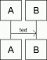

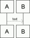

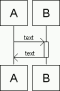

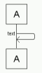

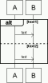

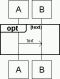

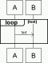

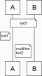

 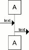
PREMIUM

 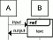
PREMIUM

 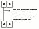
PREMIUM

 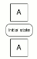
PREMIUM

 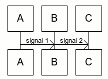
PREMIUM

 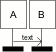
PREMIUM

Not saved

1
2
3
4
5
6
7
8
9
10
11
12
13
14
15
16
17
18
19
20
21

title Authentication Sequence

Alice->Bob: Authentication Request
note right of Bob: Bob thinks about it
Bob->Alice: Authentication Response

A->B: text

A->B: text

A-->B: text

opt text
A->B: text
end

Add text to the side of the diagram by
indenting it with a space.

A->B: Wow!

XXXXXXXXXXXXXXXXXXXXXXXXXXXXXXXXXXXXXXXXXXXXXXXXXX

Line 17: Extended text is a premium feature not available.
Line 17: Syntax error.
Line 18: Extended text is a premium feature not available.
Line 18: Syntax error.

