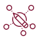

Welcome!

# Welcome!

The Physics Travel Guide is an expository wiki which explains concepts in three levels of difficulty. We call these levels: intuitive, concrete and abstract.

**Try it. What do you want to understand?**

* * *

### What is the Physics Travel Guide?

It's an expository physics wiki, but also much more than that:

- Every page emphasizes why the given topic is interesting.
- We publish for any given topic *different* explanations with increasing levels of sophistication.
- To illustrate the concepts, we collect concrete examples.
- We collect reading recommendations and answers to frequently asked questions.
- There are [roadmaps](https://physicstravelguide.com/resources), that give concrete advice on how to learn a given topic.

### Great Explanations in the Spotlight

There already exist great explanations for almost any topic. However, currently, they are often incredibly hard to find and hidden in old textbooks or in papers buried somewhere on the arXiv. Our goal is that great explanations get the attention they deserve.

In contrast to, for example, Wikipedia we do not simply refer the readers to the most rigorous textbook and the original paper, i.e. the "standard references". Instead, we want to collect those resources that are the most helpful for students. We want to help learners to discover the best resources for each stage during their journey.

### Made for Self-Directed Learning

The Physics Travel Guide tries to fill a gap because textbooks and lectures usually don't acknowledge that there is a difference between pedagogy and [andragogy](https://en.wikipedia.org/wiki/Andragogy). Textbooks and lectures explain things linearly and try to be pedagogical. "Pedagogy" is a synthesis of the two Greek words "paidos" (child) and "ágō" (to lead) and literally means ["to lead a child"](https://en.wikipedia.org/wiki/Pedagogy). In contrast, "andragogy" means literally "to lead a man" and is the study of methods and principles to teach adults. It's clear that you can't teach children and adults in the same way.

This Physics Travel Guide has the needs of adults in mind, is non-linear and ideally suited for self-directed learning.

### Examples

The following pages give an idea how this works in practice:

- [Lagrangian Formalism](https://physicstravelguide.com/formalisms/lagrangian_formalism)
- [Pendulum](https://physicstravelguide.com/models/basic_models/pendulum) and [Sine-Gordon Model](https://physicstravelguide.com/models/toy_models/sine_gordon)
- [Schrödinger Equation](https://physicstravelguide.com/equations/schroedinger_equation)
- [Configuration Space](https://physicstravelguide.com/basic_tools/configuration_space) and [Phase Space](https://physicstravelguide.com/basic_tools/phase_space)
- [Aharonov-Bohm Experiment](https://physicstravelguide.com/experiments/aharonov-bohm)
- [Group Theory](https://physicstravelguide.com/advanced_tools/group_theory)
- [Gauge Symmetry](https://physicstravelguide.com/advanced_tools/gauge_symmetry)
- [Duality](https://physicstravelguide.com/advanced_notions/duality)
- [Anomalies](https://physicstravelguide.com/advanced_notions/quantum_field_theory/anomalies)

### Who is it for?

The Physics Travel Guide exists to lower the entry barrier to technical topics for laymen, students and researchers alike. Specifically, it's a tool for:

- Students who prefer to learn at their own pace and want to know more than is taught in the lectures.
- Lecturers and teachers who search for inspiration of how to explain things better.
- Researchers who want to learn new topics more quickly.
- Interested laypersons who search for explanations that everyone can understand.

To get an overview of the topics which are currently included have a look at the **[Table of Contents](https://physicstravelguide.com/toc)**.

### Everyone can Participate

The Physics Travel Guide is currently not complete and never will be. However, everyone can help to make the current gaps smaller.

- If you are a beginner and find an explanation that finally makes it click for you, simply add a reference to it on the corresponding page.
- If you have an idea how something could be explained better, write it down. Your explanation helps hundreds of students.
- Experts can always help to make things more rigorous and clearer in the abstract section of each page.

**Latest changes:**

- [Quantum Gravity](https://physicstravelguide.com/theories/speculative_theories/quantum_gravity) Changed table to list structure. In a table the entries in the same row have some relation to each other, that was no the case.
- [Lagrangian Formalism](https://physicstravelguide.com/formalisms/lagrangian_formalism) Minor fixes and link added
- [Phase Space](https://physicstravelguide.com/basic_tools/phase_space) small fixes
- [General Relativity](https://physicstravelguide.com/models/general_relativity) There seems to be a typo (slows doesn't fit the context).
- [Strong CP Puzzle](https://physicstravelguide.com/open_problems/strong_cp_puzzle) fixed typos
- [Gauge Symmetry](https://physicstravelguide.com/advanced_tools/gauge_symmetry)
- [Formalisms](https://physicstravelguide.com/formalisms)
- [Lagrange Multiplier](https://physicstravelguide.com/basic_tools/lagrange_multiplier) spelling
- [Algebra](https://physicstravelguide.com/basic_tools/algebra) [Intuitive]
- [Logarithm](https://physicstravelguide.com/basic_tools/logarithm) [Abstract]

* * *

More information about the physics travel guide can be found [here](https://physicstravelguide.com/about).

