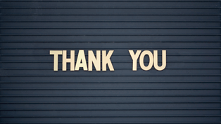
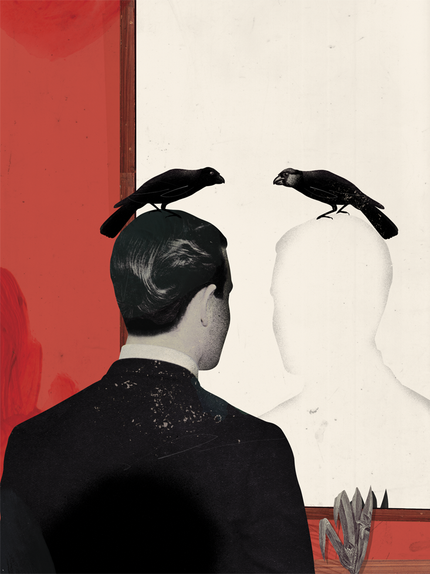
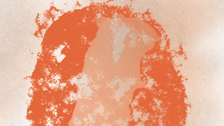
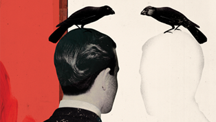
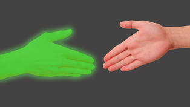
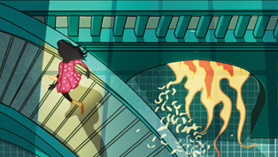
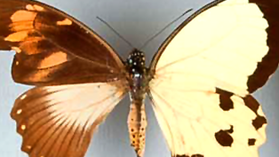
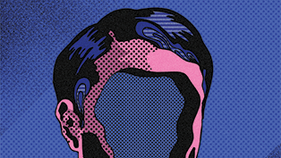

What Do Animals See in a Mirror? - Issue 47: Consciousness - Nautilus

|     |     |     |
| --- | --- | --- |
| [Biology](http://nautil.us/term/l/Biology) |     | [Psychology](http://nautil.us/term/f/Psychology) |

# What Do Animals See in a Mirror?

## A controversial test for self-awareness is dividing the animal kingdom.

By Chelsea Wald Illustration by Emmanuel PolancoApril 13, 2017

- [*c* Add a comment](http://nautil.us/issue/47/consciousness/what-do-animals-see-in-a-mirror-rp#comm)

- [*f* Facebook](https://www.facebook.com/sharer/sharer.php?s=100&p%5Bsite_name%5D=Nautilus&p%5Btype%5D=website&p%5Burl%5D=http%3A%2F%2Fnautil.us%2Fissue%2F47%2Fconsciousness%2Fwhat-do-animals-see-in-a-mirror-rp&p%5Btitle%5D=What+Do+Animals+See+in+a+Mirror%3F+-+Issue+47%3A+Consciousness+-+Nautilus&p%5Bsummary%5D=The+idea+for+a+tool+to+probe+the+basis+of+consciousness+came+to+Gordon+G.+Gallup%2C+Jr.+while+shaving.+%E2%80%9CIt+just+occurred+to+me%2C%E2%80%9D%26%238230%3B&p%5Bimages%5D%5B0%5D=http%3A%2F%2Fstatic.nautil.us%2F3289_645e6bfdd05d1a69c5e47b20f0a91d46.png)

- [*t* Twitter](https://twitter.com/share?url=http%3A%2F%2Fnautil.us%2Fissue%2F47%2Fconsciousness%2Fwhat-do-animals-see-in-a-mirror-rp&text=What+Do+Animals+See+in+a+Mirror%3F&via=NautilusMag)

- [*m* Email](http://nautil.us/issue/47/consciousness/what-do-animals-see-in-a-mirror-rpmailto:?subject=Nautilus:%20What%20Do%20Animals%20See%20in%20a%20Mirror?&body=I%20saw%20this%20article%20on%20Nautil.us%20and%20wanted%20to%20share%20it%20with%20you.%0D%0A---------------------------%0D%0AWhat%20Do%20Animals%20See%20in%20a%20Mirror?%0D%0APsychology:A%20controversial%20test%20for%20self-awareness%20is%20dividing%20the%20animal%20kingdom.%0D%0A%0D%0AThe%20idea%20for%20a%20tool%20to%20probe%20the%20basis%20of%20consciousness%20came%20to%20Gordon%20G.%0D%0A%0D%0Ahttp://nautil.us/issue/47/consciousness/what-do-animals-see-in-a-mirror-rp)

- [*U* Sharing]()
- [*X* Reddit](http://www.reddit.com/submit?title=What+Do+Animals+See+in+a+Mirror%3F&url=http%3A%2F%2Fnautil.us%2Fissue%2F47%2Fconsciousness%2Fwhat-do-animals-see-in-a-mirror-rp)

- [*Y* Stumbleupon](http://www.stumbleupon.com/badge/?url=http%3A%2F%2Fnautil.us%2Fissue%2F47%2Fconsciousness%2Fwhat-do-animals-see-in-a-mirror-rp)

- [*V* Tumblr](http://tumblr.com/share?s=&v=3&t=What+Do+Animals+See+in+a+Mirror%3F&u=http%3A%2F%2Fnautil.us%2Fissue%2F47%2Fconsciousness%2Fwhat-do-animals-see-in-a-mirror-rp)

- [*L* Pocket](https://getpocket.com/save?url=http%3A%2F%2Fnautil.us%2Fissue%2F47%2Fconsciousness%2Fwhat-do-animals-see-in-a-mirror-rp&title=What+Do+Animals+See+in+a+Mirror%3F)

The idea for a tool to probe the basis of consciousness came to Gordon G. Gallup, Jr. while shaving. “It just occurred to me,” he says, “wouldn’t it be interesting to see if other creatures could recognize themselves in mirrors?”

Showing chimpanzees their reflections seemed like a fascinating little experiment when he first tried it in the summer of 1969. He didn’t imagine that this would become one of the most influential—and most controversial—tests in comparative psychology, ushering the mind into the realm of experimental science and foreshadowing questions on the depth of animal suffering. “It’s not the ability to recognize yourself in a mirror that is important,” he would come to believe. “It’s what that says about your ability to conceive of yourself in the first place.”

Gallup was a new professor at Tulane University in Louisiana, where he had access to the chimps and gorillas at what would later be known as the Tulane National Primate Research Center. The chimpanzees there had been caught as youngsters in Africa and shipped to America, where they were used mainly in biomedical research. By comparison, his experiment was far less invasive. He isolated two chimps in cages, and placed a mirror in each cage for eight hours at a time over 10 days. Through a hole in the wall, Gallup witnessed a shift in the chimps’ behavior. First they treated the reflection like it was another chimp, with a combination of social, sexual, and aggressive gestures. But over time, they started using it to explore their own bodies. “They’d use the mirror to look at the inside of their mouths, to make faces at the mirror, to inspect their genitals, to remove mucous from the corner of their eyes,” Gallup says.

03:15

normal

**Mirror test:** Kitties and puppies see a playmate in the mirror. Are animals that recognize themselves somehow smarter?Video was compiled from various clips. Full credit info is below.

Gallup was sure that the chimps had learned to recognize themselves in the mirror, but he didn’t trust that other researchers would be convinced by his descriptions. So he moved on to phase two of the experiment. He anesthetized the chimps, then painted one eyebrow ridge and the opposite ear tip with a red dye that the chimps wouldn’t be able to feel or smell. If they truly recognized themselves, he thought he knew what would happen: “It seemed pretty obvious that if I saw myself in a mirror with marks on my face, that I’d reach up and inspect those marks.”

[Also in Psychology](http://nautil.us/term/f/Psychology)

#### [The Science of Gratitude](http://nautil.us/issue/7/Waste/the-science-of-gratitude)

By Chris Mooney

A few months ago, I conducted an early Thanksgiving experiment on myself. I was in Reykjavik, Iceland, on a lecture trip. My morning was free, and I took it to write two pages about how lucky I am—something, I’m embarrassed...**[READ MORE](http://nautil.us/issue/7/Waste/the-science-of-gratitude)**

That’s exactly what the chimps did. As far as Gallup was concerned, that was proof: “the first experimental demonstration of a self-concept in a subhuman form,” he wrote in the resulting 1970 report in *Science*. “It was just clear as day,” he remembers. “It didn’t require any statistics. There it was. Bingo.”

But the result that really blew Gallup’s mind came when he tested monkeys, and discovered that they did not do the same. The ability to recognize one’s reflection seemed not to be a matter of learning abilities, with some species being slower than others. It was an issue of higher intellectual capacity. Gallup had obtained the first good evidence that our closest relatives share with us a kind of self-awareness or even consciousness, to the exclusion of other animals. Here, finally, was an experimental handle on a topic that had been the subject of speculation for millennia: What is the nature of human consciousness?

DIY Mirror Test *u*

Gallup wasn’t the first to come up with the notion that it might be significant if a person or animal recognizes itself in the mirror. He would only later learn that Charles Darwin had shown mirrors to orangutans, but they didn’t figure the mirror out, at least while he was watching. Darwin had also noted that, for their first few years, his children couldn’t recognize themselves in their reflections. In 1889, German researcher Wilhelm Preyer became the first to posit a connection between mirror self-recognition and an inner sense of self in people.

More than 50 years later, French psychoanalyst Jacques Lacan conceived of a childhood “mirror stage,” in which mirrors contribute to the formation of the ego. By 1972, developmental psychologists started using mark tests similar to Gallup’s to pin down the age at which children begin to recognize themselves in the mirror: 18 to 24 months.

Meanwhile Gallup, who moved to the University at Albany-SUNY, became interested in whether any non-primates could pass. In the early 1990s, he encouraged one of his Ph.D. students, Lori Marino, to explore the question. Working with Diana Reiss at Marine World Africa USA in California, Marino exposed two bottlenose dolphins at an aquarium to a mirror. Like the chimpanzees, the dolphins learned to use the mirror in a variety of ways, even “having sex in front of the mirror with each other, which we call our dolphin porno tapes,” Marino says. The three researchers published the results, saying they were “suggestive” of mirror self-recognition.

Still, they were missing the crucial mark test for another decade. The biggest hurdle was anatomical: The dolphins didn’t have hands to touch a mark. But Reiss and Marino, by then at the New York Aquarium, designed a modified test. When marked with black ink on various parts of their bodies, the dolphins flipped and wriggled in an attempt to see it, convincing the researchers and many others that they recognized themselves.

For Reiss and Marino, the dolphin study was not only convincing, it was a call to action. They and others argue that passing the mirror test indicates a level of self-awareness that makes it unethical to keep a species in captivity. “These animals have at least some level of self-awareness, and if they do, they know where they are, they can be aware of the limitations of their physical environment,” Marino says. She is now the science director for the Nonhuman Rights Project, which is attempting to gain legal rights for animals with higher-order cognitive abilities by getting courts to recognize them as “legal persons,” and Reiss advocates for dolphin protection. Key to their arguments is the scientific evidence that chimps, elephants, cetaceans, and other animals are self-aware like humans. Not only can they suffer, but they can think to themselves, I am suffering.

Gallup, now in his 70s, mainly stays away from advocacy work but he likes to philosophize about what exactly mirror self-recognition shows, and why that capability might have evolved. Clearly, it has little to do with mirrors since aside from the occasional still pond, our distant ancestors would never have encountered their reflections. He’s come to the conclusion that a pass of the mirror test indicates a profound level of consciousness that includes animals’ ability to contemplate their own thoughts and experiences as well as to imagine what others could be thinking and experiencing. This ability is called “theory of mind.”

For support, he points to the fact that children start to demonstrate theory of mind at roughly around the same time that they start to recognize themselves in the mirror. “You have to be aware of yourself in the first place in order to begin to take into account what other people may know, want, or intend to do,” he says. He notes that people with schizophrenia often cannot recognize themselves in the mirror, and they struggle with theory of mind as well. For example, compared to controls, schizophrenic individuals were less likely to understand a request hidden in a husband’s statement to his wife, “I want to wear that blue shirt, but it’s very creased.”

> Povinelli calls this reasoning “folk psychology”—unscientific inferences made based on our own human experiences.

>

Gallup suggests that a powerful sense of self may have evolved because it helped great apes deal with complex social situations. “Intellectual prowess supplanted physical prowess as a means of achieving dominance,” he says. And, he suggests that strong self-awareness may also entail death-awareness. “The next step, it seems to me logically, is to confront and eventually grapple with the inevitability of your own individual demise,” he says.

As for why dolphins and other non-primates recognize themselves in mirrors, Gallup isn’t yet convinced they do. He suggests an alternative explanation for why his former student’s dolphins wriggled in the mirror: to see marks on what they perceived as another dolphin peering back at them. And he requires replication of recent studies finding that elephants use their trunks to touch white crosses on their foreheads, and magpies dislodge stickers on their chests with their beaks.

Then there are researchers who discount whether the mirror test says anything about theory of mind in any animal, including humans. Most notably, Gallup’s mentee, Daniel Povinelli. Like a son who witnesses his father’s foibles and decides to become his opposite, Povinelli, now at the University of Louisiana-Lafayette, has become one Gallup’s most outspoken critics, even as they remain close on a personal level. He’s come to believe that a chimp doesn’t need to have an integrated sense of self in order to pass the mirror test. Instead, it needs only to notice that the body in the mirror looks and moves the same as its own body, and then make the connection that if there’s a spot on the body in the mirror, there could also be a spot on its own body. That ability would still be pretty sophisticated, Povinelli adds, and it might reflect a keen awareness of the position of body parts that would likely be very helpful for swinging through trees. Indeed, he speculates that this high-level physical self-awareness may have developed when our tree-dwelling ancestors increased in size and faced more challenges while navigating their branchy, leafy world.

Povinelli’s concerns stretch to other landmark studies on theory of mind in chimps, such as those that document how a subordinate chimp refrained from hidden food when she watched a dominant chimp see researchers hide the food. The authors of this study argued that this was because the subordinate chimp reasoned about what the dominant chimp had seen and what it would do. Combined with results from other experiments, they concluded that chimps can “understand both the goals and intentions of others as well as the perception and knowledge of others,” and they can predict the action that will result.

But Povinelli calls this reasoning “folk psychology”—unscientific inferences made based on our own human experiences. The subordinate chimp doesn’t have to know the dominant’s mind, he says, all she has to know is to avoid interfering with the dominant chimp.

To apply Povinelli’s logic to humans, we may think deep, reflective thoughts when using a mirror to brush our teeth, but that doesn’t mean that the part of the brain that’s using the mirror to direct our toothbrush is the same part of the brain that’s contemplating the self. Those two abilities may develop at the same time in children, but that does not mean that they’re related, much less one and the same.

Povinelli’s critiques aside, most comparative psychologists say there’s something to mirror recognition, not least because it’s only been observed in intellectually superior animals. Neuroscientists are now trying to shed light on the matter by searching for a physical basis for the ability in the brain. Although they haven’t found a clear signal yet, Gallup remains undeterred. After nearly 45 years of fending off challengers, he is not likely to wake up in the morning, look in the mirror, and change his mind.

*Chelsea Wald is a freelance science writer who contributes to *Science *and *Nature. *She lives with her reflection in Vienna, Austria. *

*Dolphin clip courtesy of [Diana Reiss](http://www.pnas.org/content/98/10/5937.full.pdf+html)

Kitten clip originally from [Kayley D.](https://www.youtube.com/watch?v=5uHP4ndUCRk)

Puppy clip originally from [John E. Lester](https://www.youtube.com/watch?v=4ZVUoIpcC_4)

Baboon clip originally from [Srinivas Kumar](https://www.youtube.com/watch?v=GansbFmVP6E)

Magpie clip originally from [Helmut Prior, Ariane Schwarz, & Onur Güntürkün](http://www.plosbiology.org/article/info:doi/10.1371/journal.pbio.0060202)

Chimpanzee and gibbon clips originally from [Thomas Suddendorf](https://www.youtube.com/watch?v=LLBfJYnXFU4)*

*This article was originally published in our “Symmetry” issue in May, 2014.*

## Issue 047

### Consciousness

#### [Explore This Issue](http://nautil.us/issue/47/consciousness)

- Chapter two

Morals

    - [  Animals   What the Rat Brain Tells Us About Yours](http://nautil.us/issue/47/consciousness/what-the-rat-brain-tells-us-about-yours)
    - [  Climate   To Fix the Climate, Tell Better Stories](http://nautil.us/issue/47/consciousness/to-fix-the-climate-tell-better-stories)
    - [  Psychology   What Do Animals See in a Mirror?](http://nautil.us/issue/47/consciousness/what-do-animals-see-in-a-mirror-rp)

    - [  Aliens   Do Aliens Have Inalienable Rights?](http://nautil.us/issue/47/consciousness/do-aliens-have-inalienable-rights)

Join the Discussion

- [1 comment]()
- [**Nautilus**](https://disqus.com/home/forums/nautilusmag/)
- [Login](https://disqus.com/embed/comments/?base=default&f=nautilusmag&t_i=http%3A%2F%2Fnautil.us%2Fissue%2F47%2Fconsciousness%2Fwhat-do-animals-see-in-a-mirror-rp&t_u=http%3A%2F%2Fnautil.us%2Fissue%2F47%2Fconsciousness%2Fwhat-do-animals-see-in-a-mirror-rp&t_d=What%20Do%20Animals%20See%20in%20a%20Mirror%3F%20-%20Issue%2047%3A%20Consciousness%20-%20Nautilus&t_t=What%20Do%20Animals%20See%20in%20a%20Mirror%3F%20-%20Issue%2047%3A%20Consciousness%20-%20Nautilus&s_o=default#)
- [1](https://disqus.com/home/inbox/)
- [ Recommend](https://disqus.com/embed/comments/?base=default&f=nautilusmag&t_i=http%3A%2F%2Fnautil.us%2Fissue%2F47%2Fconsciousness%2Fwhat-do-animals-see-in-a-mirror-rp&t_u=http%3A%2F%2Fnautil.us%2Fissue%2F47%2Fconsciousness%2Fwhat-do-animals-see-in-a-mirror-rp&t_d=What%20Do%20Animals%20See%20in%20a%20Mirror%3F%20-%20Issue%2047%3A%20Consciousness%20-%20Nautilus&t_t=What%20Do%20Animals%20See%20in%20a%20Mirror%3F%20-%20Issue%2047%3A%20Consciousness%20-%20Nautilus&s_o=default#)
- [⤤Share](https://disqus.com/embed/comments/?base=default&f=nautilusmag&t_i=http%3A%2F%2Fnautil.us%2Fissue%2F47%2Fconsciousness%2Fwhat-do-animals-see-in-a-mirror-rp&t_u=http%3A%2F%2Fnautil.us%2Fissue%2F47%2Fconsciousness%2Fwhat-do-animals-see-in-a-mirror-rp&t_d=What%20Do%20Animals%20See%20in%20a%20Mirror%3F%20-%20Issue%2047%3A%20Consciousness%20-%20Nautilus&t_t=What%20Do%20Animals%20See%20in%20a%20Mirror%3F%20-%20Issue%2047%3A%20Consciousness%20-%20Nautilus&s_o=default#)
- [Sort by Best](https://disqus.com/embed/comments/?base=default&f=nautilusmag&t_i=http%3A%2F%2Fnautil.us%2Fissue%2F47%2Fconsciousness%2Fwhat-do-animals-see-in-a-mirror-rp&t_u=http%3A%2F%2Fnautil.us%2Fissue%2F47%2Fconsciousness%2Fwhat-do-animals-see-in-a-mirror-rp&t_d=What%20Do%20Animals%20See%20in%20a%20Mirror%3F%20-%20Issue%2047%3A%20Consciousness%20-%20Nautilus&t_t=What%20Do%20Animals%20See%20in%20a%20Mirror%3F%20-%20Issue%2047%3A%20Consciousness%20-%20Nautilus&s_o=default#)

[Avatar](../_resources/7b2fde640943965cc88df0cdee365907.png)
Join the discussion…

-

    - [−](https://disqus.com/embed/comments/?base=default&f=nautilusmag&t_i=http%3A%2F%2Fnautil.us%2Fissue%2F47%2Fconsciousness%2Fwhat-do-animals-see-in-a-mirror-rp&t_u=http%3A%2F%2Fnautil.us%2Fissue%2F47%2Fconsciousness%2Fwhat-do-animals-see-in-a-mirror-rp&t_d=What%20Do%20Animals%20See%20in%20a%20Mirror%3F%20-%20Issue%2047%3A%20Consciousness%20-%20Nautilus&t_t=What%20Do%20Animals%20See%20in%20a%20Mirror%3F%20-%20Issue%2047%3A%20Consciousness%20-%20Nautilus&s_o=default#)
    - [*⚑*](https://disqus.com/embed/comments/?base=default&f=nautilusmag&t_i=http%3A%2F%2Fnautil.us%2Fissue%2F47%2Fconsciousness%2Fwhat-do-animals-see-in-a-mirror-rp&t_u=http%3A%2F%2Fnautil.us%2Fissue%2F47%2Fconsciousness%2Fwhat-do-animals-see-in-a-mirror-rp&t_d=What%20Do%20Animals%20See%20in%20a%20Mirror%3F%20-%20Issue%2047%3A%20Consciousness%20-%20Nautilus&t_t=What%20Do%20Animals%20See%20in%20a%20Mirror%3F%20-%20Issue%2047%3A%20Consciousness%20-%20Nautilus&s_o=default#)

[ARaybold](https://disqus.com/by/ARaybold/)•[2 days ago](http://nautil.us/issue/47/consciousness/what-do-animals-see-in-a-mirror-rp#comment-3255148196)

"[Povinelli has] come to believe that a chimp doesn’t need to have an integrated sense of self in order to pass the mirror test. Instead, it needs only to notice that the body in the mirror looks and moves the same as its own body, and then make the connection that if there’s a spot on the body in the mirror, there could also be a spot on its own body."

...but to think there could be a spot on its own body, surely it must already have a concept of self? Furthermore, chimpanzees, once they are familiar with mirrors, apparently almost invariably use them to examine the parts of their bodies that they cannot see directly, such as inside their mouths, and their rear ends. If they do not have an understanding that the image in the mirror is themselves, why would they show such a fascination with those particular areas? Povinelli seems to be constructing a complicated hypothesis in order to avoid the simple one, and appears to fall foul of Occam's Razor.

- [Powered by Disqus](https://disqus.com/)
- [*✉*Subscribe  *✔*](https://disqus.com/embed/comments/?base=default&f=nautilusmag&t_i=http%3A%2F%2Fnautil.us%2Fissue%2F47%2Fconsciousness%2Fwhat-do-animals-see-in-a-mirror-rp&t_u=http%3A%2F%2Fnautil.us%2Fissue%2F47%2Fconsciousness%2Fwhat-do-animals-see-in-a-mirror-rp&t_d=What%20Do%20Animals%20See%20in%20a%20Mirror%3F%20-%20Issue%2047%3A%20Consciousness%20-%20Nautilus&t_t=What%20Do%20Animals%20See%20in%20a%20Mirror%3F%20-%20Issue%2047%3A%20Consciousness%20-%20Nautilus&s_o=default#)
- [*d*Add Disqus to your site](https://publishers.disqus.com/engage?utm_source=nautilusmag&utm_medium=Disqus-Footer)
- [*🔒*Privacy](https://help.disqus.com/customer/portal/articles/1657951?utm_source=disqus&utm_medium=embed-footer&utm_content=privacy-btn)

## Next Article:

Ideas

### [Do Aliens Have Inalienable Rights?](http://nautil.us/issue/47/consciousness/do-aliens-have-inalienable-rights)

*By Peter Singer*

## Related Articles:

- Culture

### [Want to Get Out Alive? Follow the Ants](http://nautil.us/issue/13/symmetry/want-to-get-out-alive-follow-the-ants)

*By Conor Myhrvold*

- Biology

### [Half Male, Half Female, Total Animal](http://nautil.us/issue/13/symmetry/half-male-half-female-total-animal)

*By Ferris Jabr*

- Matter

### [The Disappearing Physicist and His Elusive Particle](http://nautil.us/issue/13/symmetry/the-disappearing-physicist-and-his-elusive-particle)

*By João Magueijo*