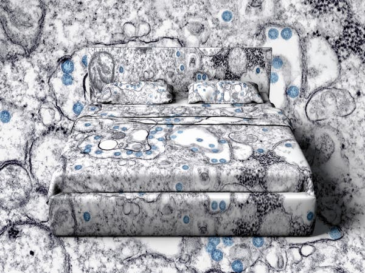

What I Learned When My Husband Got Sick With Coronavirus - The New York Times

Credit...Photo illustration by Delcan & Co.

# What I Learned When My Husband Got Sick With CoronavirusWhat I Learned When My Husband Got Sick With Coronavirus

Our world became one of isolation, round-the-clock care, panic and uncertainty — even as society carried on around us with all too few changes.

Credit...Photo illustration by Delcan & Co.
By Jessica Lustig

- March 24, 2020

-

    - 
    - 
    - [](https://www.nytimes.com/2020/03/24/magazine/coronavirus-family.htmlmailto:?subject=NYTimes.com%3A%20What%20I%20Learned%20When%20My%20Husband%20Got%20Sick%20With%20Coronavirus&body=From%20The%20New%20York%20Times%3A%0A%0AWhat%20I%20Learned%20When%20My%20Husband%20Got%20Sick%20With%20Coronavirus%0A%0AOur%20world%20became%20one%20of%20isolation%2C%20round-the-clock%20care%2C%20panic%20and%20uncertainty%20%E2%80%94%20even%20as%20society%20carried%20on%20around%20us%20with%20all%20too%20few%20changes.%0A%0Ahttps%3A%2F%2Fwww.nytimes.com%2F2020%2F03%2F24%2Fmagazine%2Fcoronavirus-family.html%3Fsmid%3Dem-share)

    -
    -
    -

“How are you doing, love?” I call to my husband from the living-room floor, where I now sleep each night on a roll-up foam sleeping pad that my daughter has used on camping trips, topped with a couple of thin blankets. It’s quite literally hard to sleep on the floor, but after trying the couch and then, on the floor, the couch mattress — a bit of fabric stretched over some coiled rings — the floor itself has been a relief.

“I need some help,” he whispers hoarsely, shivering inside the wool undershirt and sweater he insists on wearing. “I didn’t want to wake you.” I forgot to put the Advil in the plastic dish in the bathroom that is now his. I can’t leave the bottle in there; it has to stay uncontaminated in the other bathroom, so that I can dispense the capsules into the dish and keep the bottle protected. Anything my husband, T, touches has to stay in his room or be carefully taken from his room to the kitchen, where I stand holding dishes while our 16-year-old daughter, CK, opens the dishwasher and pulls out the racks so I don’t have to touch anything before she closes it again. She turns on the faucet for me, and I hit the soap dispenser with my elbow to wash my hands.

My husband, a tall, robust 56-year-old who regularly goes — who regularly went — on five-hour bike rides from our Brooklyn neighborhood to Jamaica Bay in Queens and back, has been lying on his back, staring at the ceiling, or curled on his side, wearing the same pajama bottoms for days because it is too hard to change out of them, too hard to stay that long on his feet, too cold outside the sheets and blankets he huddles beneath. It has been 12 days since T woke up in the middle of the night on March 12 with chills. The next day, just as reports were growing more urgent about the coronavirus spreading in the United States, he thought he felt better, but then the chills came back, along with aches and a fever of 100.4.

Since then, T has been confined alone in our bedroom at the front of the apartment, where he complains of hearing trucks idling at the curb just outside and long blasts from the ships in New York Harbor a few blocks west. He creeps out only to go to the bathroom. The bedroom door stays firmly shut to keep out the cat, who is determined to get in and who howls outside it at night. “What to do if you are sick with coronavirus disease 2019 (Covid-19)” reads the sheet T is handed at the clinic two days after his symptoms begin. “Separate yourself from other people and animals in your home.” By then he has a fever of 101.5. He tests negative for the flu. Then, because he is considered high risk with what his medical chart calls “severe” asthma that sent him to the emergency room with an acute attack a few months ago, he is tested for Covid-19, the disease caused by the coronavirus — just days before a national shortage of testing supplies emerged and the restrictions were tightened further.

Advertisement

[Continue reading the main story](https://www.nytimes.com/2020/03/24/magazine/coronavirus-family.html#after-story-ad-1)

***[ *****[*The Times is providing free access on the coronavirus crisis. Start here for a guide to all our coverage.*](https://www.nytimes.com/news-event/coronavirus?action=click&module=Spotlight&pgtype=Homepage)***** ]***

Now we live in a world in which I have planned with his doctor which emergency room we should head to if T suddenly gets worse, a world in which I am suddenly afraid we won’t have enough of the few things tempering the raging fever and soaking sweats and severe aches wracking him — the Advil and Tylenol that the doctors advise us to layer, one after the other, and that I scroll through websites searching for, seeing “out of stock” again and again. We are living inside the news stories of testing, quarantine, shortages and the disease’s progression. A friend scours the nearby stores and drops off a bunch of bodega packets of Tylenol. Another finds a bottle at a more remote pharmacy and drops it off, a golden prize I treasure against the feverish nights to come.

His doctor calls three days later to say the test is positive. I find T lying on his side, reading an article about the surge in confirmed cases in New York State. He is reading stories of people being hospitalized, people being put on ventilators to breathe, people dying, sick with the same virus that is attacking him from the inside now.

**CK and I had settled in to watch “Chernobyl,”** the HBO series about the 1986 nuclear accident and its aftermath, when T first felt sick and went to lie down in the bedroom. We stopped after three episodes. That time, when we would sit on the couch watching something together, is behind us. Now there is too much rushing back and forth, making sure T has a little dinner — just a tiny bowl of soup, just an appetizer, really, that he is unable to smell, that he fights nausea to choke down — taking his temperature, monitoring his oxygen-saturation levels with the fingertip pulse oximeter brought by a friend from the drugstore on the doctor’s advice, taking him tea, dispensing his meds, washing my hands over and over, texting the doctor to say T is worse again, standing next to him while he coughs into the covers, rubbing his knees through the blankets.

“You shouldn’t stay here,” he says, but he gets more frightened as night comes, dreading the long hours of fever and soaking sweats and shivering and terrible aches. “This thing grinds you like a mortar,” he says.

Advertisement

[Continue reading the main story](https://www.nytimes.com/2020/03/24/magazine/coronavirus-family.html#after-story-ad-2)

CK’s high school, closed on March 13, is now preparing with the rest of New York City’s public schools to begin distance learning. For days she and her classmates have received instructions about what to expect, turning administrator and teacher directives into endless memes, feeds filling with repeated admonitions: This is regular school. This is not vacation. I start an email to her principal, guidance counselors and teachers. “I am writing to let you know what CK has been going through at home.” The draft sits open all day.

‘This thing grinds you like a mortar.’

I am texting the doctor. I am texting T’s five siblings on a group chat, texting my parents and my brother, texting T’s business partner and employees and his dearest friends and mine, in loops and loops, with hearts and thankful prayer-hands emoji. He is too exhausted, too weak, to answer all the missives winging to him at all hours. “Don’t sugarcoat it for my family,” he tells me. He has asked for the gray sweater that was his father’s, that his father wore when he was alive. He will not take it off.

It’s as if we are in a time warp, in which we have accelerated at 1½ time speed, while everyone around us remains in the present — already the past to us — and they, blissfully, unconsciously, go about their ordinary lives, experiencing the growing news, the more urgent advisories and directives, as a vast communal experience, sharing posts and memes about cabin fever, about home-schooling, about social distancing, about how hard it all is, while we’re living in our makeshift sick ward, living in what will soon be the present for more and more of them. “I took out the kitty litter,” CK says, “and I saw some people standing on the corner, and I was like, I want to see strangers! And then I heard them saying: ‘It’s actually been really nice. It’s been a chance to connect as a family.’ And I was like, No, actually, I don’t want to see strangers, and I came back in.”

# [Latest Updates: Coronavirus Outbreak](https://www.nytimes.com/2020/03/25/world/coronavirus-news-maps.html?action=click&pgtype=Article&state=default&module=styln-coronavirus-world&variant=show&region=MID_MAIN_CONTENT&context=storyline_updates_world)

- •[The $2 trillion relief package is the biggest in American history.](https://www.nytimes.com/2020/03/25/world/coronavirus-news-maps.html?action=click&pgtype=Article&state=default&module=styln-coronavirus-world&variant=show&region=MID_MAIN_CONTENT&context=storyline_updates_world#link-494de88c)

- •[Trump wants U.S. “opened up” by Easter as New York infections soar and Spain’s crisis deepens.](https://www.nytimes.com/2020/03/25/world/coronavirus-news-maps.html?action=click&pgtype=Article&state=default&module=styln-coronavirus-world&variant=show&region=MID_MAIN_CONTENT&context=storyline_updates_world#link-16369abc)

- •[Global stocks surge on news of U.S. relief package.](https://www.nytimes.com/2020/03/25/world/coronavirus-news-maps.html?action=click&pgtype=Article&state=default&module=styln-coronavirus-world&variant=show&region=MID_MAIN_CONTENT&context=storyline_updates_world#link-3c47ece7)

[See more updates](https://www.nytimes.com/2020/03/25/world/coronavirus-news-maps.html?action=click&pgtype=Article&state=default&module=styln-coronavirus-world&variant=show&region=MID_MAIN_CONTENT&context=storyline_updates_world)

 More live coverage:  [Markets](https://www.nytimes.com/2020/03/25/business/stock-market-today-coronavirus.html?action=click&pgtype=Article&state=default&module=styln-coronavirus-world&variant=show&region=MID_MAIN_CONTENT&context=storyline_updates_world)  [U.S.](https://www.nytimes.com/live/2020/coronavirus-usa-live-03-24)  [New York](https://www.nytimes.com/2020/03/24/nyregion/coronavirus-new-york-update.html?action=click&pgtype=Article&state=default&module=styln-coronavirus-world&variant=show&region=MID_MAIN_CONTENT&context=storyline_updates_world)

CK and I confine ourselves to the half bathroom, the one with the litter box, which she is now in charge of. Over the past days and days, drifty, dreamy CK has become my chief assistant on my nursing/housekeeping/kitchen rotations, feeding the cat and cleaning the litter box, folding laundry, preparing T’s small meals, washing dishes and pots, coordinating with me in a complicated choreography when I come out of the sickroom holding dishes so we can get them into the dishwasher without my touching the handles or having to wash my dry, raw hands even more. “I feel like we’re talking to each other more like equals now,” she says. She is right.

I am consumed with trying to keep us safe. I wipe down the doorknobs, the light switches, the faucets, the handles, the counters with disinfectant. I swab my phone with alcohol. I throw the day’s hoodie into the laundry at night as if it were my scrubs. I wash all our towels, again and again. When CK wants to shower, I wipe down the whole main bathroom — where T refills his water cup, where he has had diarrhea, where he coughs and spits out phlegm — with bleach, take out T’s washcloth, towels and bathmat and replace them with clean ones, telling CK to try not to touch anything, to shower and go right back to her room. Then I do the same. If T needs to use the bathroom before we’re ready to shower, I do the whole bleach routine again before we go in. Twice, in the first week of the illness, I eased him into an Epsom-salt bath. But not since then. He is too weak. It would be too much. There is no way. When he shuffles down the hall from the bedroom to the bathroom, he lists against the wall. He splashes water on his face in the bathroom, and that has to be enough.

I run through possibilities. I’m not so worried about CK getting sick. I can nurse her too. It’s if I get sick. I show her how to do more things, where things go, what to remember, what to do if — What if T is hospitalized? What if I am? Could a 16-year-old be left to fend for herself at home, alone? How would she get what she needed? Could she do it? For how long?

Advertisement

[Continue reading the main story](https://www.nytimes.com/2020/03/24/magazine/coronavirus-family.html#after-story-ad-3)

The one thing I know is that I could not send her to my parents, 78 years old and nearby on Long Island. They would want her to come, but she could kill them, their dear grandchild coming forward to their embrace, radioactive, glowing with invisible incubating virus cells. No. Not them. Someone else would have to take her, someone who has a bedroom and a bathroom where she could isolate and be cared for. Someone would. I lie awake at 4 a.m., on the floor, listening, thinking, wide awake with adrenaline.

The nights are hardest, when the fear and dread descend, T feverish, lying on his back, murmuring hoarsely about “anomie,” saying he almost just called CK by the name of his 20-years-ago ex-girlfriend. Three times we have tried to decide whether we need to go to the emergency room while on speakerphone with the doctor, once after I burst into sobs in the bathroom, saying out loud, “I’m afraid to make the wrong call.” Each time we decided to stay at home. He doesn’t have trouble breathing, and that would be the reason to go to the hospital.

I burst into sobs in the bathroom, saying out loud, ‘I’m afraid to make the wrong call.’

We do a video call on one of these nights with a New York University emergency-room doctor, one of 250 who have been mobilized to do urgent-care video calls with patients who have flulike symptoms. She tells us that they are seeing this illness run two to three weeks. She tells us that T is OK to stay home if his oxygen-saturation reading doesn’t get too low, if he is not struggling to breathe. He is not. When I open the bedroom door to check on him and find him sleeping, I tiptoe closer and bend to make sure he is alive, to make sure he is still breathing, as I used to do when CK was an infant, asleep in her crib.

On one of the worst nights, I stay next to the bed, rubbing his body through the piled-on blankets, trying to comfort him. I hear myself start to hum, low, the only song I would: the song both my mother and my grandmother used to sing to me. When my mother sang it, it was “Tura Lura Lura,” with “When Irish Eyes Are Smiling” cut into it after the words “That’s an Irish lullaby.” When my grandmother sang it to me, it was “Tura Lura Lura” with the words changed to “That’s a Russian lullaby.” That is the song of my early childhood, and more than four decades later I am humming it to my gravely ill husband.

“Now we live in a dystopian story,” I say to CK in the kitchen.
“Yeah,” she says. And then: “Lots of people already did.”

**Out on the street, T somehow looks even more frail,** his 6-foot-1 frame stooped and swaddled in his winter jacket over another jacket over his father’s gray wool sweater over a Duofold wool undershirt over a white ribbed tank. He says it’s cold, blinking in the March sun over the white surgical mask he wore at the clinic when he was tested.

Advertisement

[Continue reading the main story](https://www.nytimes.com/2020/03/24/magazine/coronavirus-family.html#after-story-ad-4)

We both wear disposable gloves. I put my hand through the crook of his arm, and we slowly start for the clinic. The day before was one of the harder ones, with T lightheaded and nauseated most of the day, eating only if I spoon-fed him, coughing more and using his albuterol inhaler more, then coughing more again. He was soaked in sweat in the morning and by evening was lying curled up, looking apprehensive. “I coughed up blood just now,” he told me quietly.

We talked to his doctor on speakerphone. “We are all kind of working blind,” he told us. Many patients, he said, seem to begin to feel better after a week. But others, the more serious and severe cases, take a downturn, and the risks rise as the virus targets the lungs. Pneumonia is a common next step in that downward progression. We read about it in the patients admitted to the hospital. Now the doctor called in a prescription for antibiotics to the CVS pharmacy that would close in less than an hour. I texted T’s friend down the block, and he texted back that he would pick up the medicine. I asked if he would get oranges too; T has been accepting a little fresh-squeezed juice or cut-up pieces, and we were down to one last orange. They suddenly seemed an unimaginably exotic treat.

She could kill them, their dear grandchild coming forward to their embrace, radioactive, glowing with invisible incubating virus cells.

The doctor told us to go back to the clinic for a chest X-ray first thing in the morning. Now we slowly walk the three blocks, T coughing behind his mask. As we move along the street, we see some other people too — fewer than a few days ago, before Gov. Andrew Cuomo directed New Yorkers to stay indoors as much as possible. Some joggers go by. Just over a week ago, that was still me. Now I point out the buds about to bloom on the branches we pass, drawing T’s attention away from the few passers-by so we won’t see if they start or turn around. A few are wearing their own masks, but they are walking upright, striding along, using them as protection for themselves. Not like us.

At the clinic, another couple wearing masks opens the door and walks in. A man in a mask sits in the waiting area. T eases into a chair and leans against the wall with his eyes closed. I go to the desk. “My husband has already tested positive for Covid-19,” I tell the attendant, whose eyes meet mine over her mask.

She hands me a mask. T’s doctor is working at a different clinic today, so we’ll see another doctor, and they will compare notes. We wait, wearing our masks. T’s eyes are still closed. I look out the window behind us, where people on the street are walking along as if it were an ordinary day. A man opens the door of a tiny cafe across the street with his bare hand and goes inside.

Another attendant comes to the desk, and the first attendant murmurs quietly to her. The second attendant puts on a mask.

Advertisement

[Continue reading the main story](https://www.nytimes.com/2020/03/24/magazine/coronavirus-family.html#after-story-ad-5)

We’re called inside. The nurses, in masks, check T’s vitals. He has a slight fever, just over 99 degrees, but that may be lowered because of the recent ibuprofen and acetaminophen in his system. His blood pressure is fine. His pulse is fine. His oxygen saturation is fine. We tell them about the fevers, the sweats, the nausea, the coughing, the spots of blood he is continuing to cough up, the lower oxygen-saturation number we recorded at home this morning.

When the nurses leave, T leans back in the examination chair, resting his head with his eyes closed. Out in the hall, I hear someone telling a patient that he has been sick for a long time. It’s time to go to the hospital five blocks away.

The doctor comes in, wearing a mask and a plastic shield over it. T, shivering in a paper gown, follows her out for the X-ray. “That was strangely difficult,” he says when he returns. “Just holding my arms above my head.” The X-ray looks different from the one a week ago, the doctor tells us after consulting with the radiologist. Now it shows pneumonia in the left lung. T’s doctor was right to order the antibiotics last night. T’s lungs sound all right when she listens through a stethoscope — he is not wheezing. He is not having breathing problems. He can keep being treated at home. “But now we’re going to be watching you even more closely,” she says.

At the door of the clinic, we stand looking out at two older women chatting outside the doorway, oblivious. Do I wave them away? Call out that they should get far away, go home, wash their hands, stay inside? Instead we just stand there, awkwardly, until they move on. Only then do we step outside to begin the long three-block walk home. I point out the early magnolia, the forsythia. T says he is cold. The untrimmed hairs on his neck, under his beard, are white. The few people walking past us on the sidewalk don’t know that we are visitors from the future. A vision, a premonition, a walking visitation. This will be them: Either T, in the mask, or — if they’re lucky — me, tending to him.

* * *

Jessica Lustig is a deputy editor of The New York Times Magazine.

#  The Coronavirus Outbreak

-

## Answers to Your Frequently Asked Questions

Updated March 24, 2020

    - •

#### **How does coronavirus spread?**

It seems to spread [very easily from person to person,](https://www.nytimes.com/interactive/2020/03/22/world/coronavirus-spread.html?action=click&pgtype=Article&state=default&module=styln-coronavirus-world&variant=show&region=BELOW_MAIN_CONTENT&context=storyline_faq) especially in homes, hospitals and other confined spaces. The pathogen can be carried on tiny respiratory droplets that fall as they are coughed or sneezed out. It may also be transmitted when we touch a contaminated surface and then touch our face.

    - •

#### **Is there a vaccine yet?**

No. [The first testing in humans of an experimental vaccine began in mid-March.](https://www.nytimes.com/2020/03/19/us/politics/coronavirus-vaccine-competition.html?action=click&pgtype=Article&state=default&module=styln-coronavirus-world&variant=show&region=BELOW_MAIN_CONTENT&context=storyline_faq) Such rapid development of a potential vaccine is unprecedented, but even if it is proved safe and effective, it probably will not be available for 12 to18 months.

    - •

#### **What makes this outbreak so different?**

Unlike the flu, there is no known treatment or vaccine, and [little is known about this particular virus so far.](https://www.nytimes.com/article/what-is-coronavirus.html?action=click&pgtype=Article&state=default&module=styln-coronavirus-world&variant=show&region=BELOW_MAIN_CONTENT&context=storyline_faq) It seems to be more lethal than the flu, but the numbers are still uncertain. And it hits the elderly and those with underlying conditions — not just those with respiratory diseases — particularly hard.

    - •

#### **What should I do if I feel sick?**

[If you’ve been exposed to the coronavirus or think you have,](https://www.nytimes.com/2020/03/22/well/what-if-i-have-coronavirus.html?action=click&pgtype=Article&state=default&module=styln-coronavirus-world&variant=show&region=BELOW_MAIN_CONTENT&context=storyline_faq) and have a fever or symptoms like a cough or difficulty breathing, call a doctor. They should give you advice on whether you should be tested, how to get tested, and how to seek medical treatment without potentially infecting or exposing others.

    - •

#### **How do I get tested?**

If you’re sick and you think you’ve been exposed to the new coronavirus, [the C.D.C. recommends that you call your healthcare provider and explain your symptoms and fears.](https://www.nytimes.com/2020/03/22/well/what-if-i-have-coronavirus.html?action=click&pgtype=Article&state=default&module=styln-coronavirus-world&variant=show&region=BELOW_MAIN_CONTENT&context=storyline_faq)They will decide if you need to be tested. Keep in mind that there’s a chance — because of a lack of testing kits or because you’re asymptomatic, for instance — you won’t be able to get tested.

    - •

#### **What if somebody in my family gets sick?**

If the family member doesn’t need hospitalization and can be cared for at home, you should help him or her with basic needs and monitor the symptoms, while also keeping as much distance as possible, [according to guidelines issued by the C.D.C.](https://www.nytimes.com/2020/03/22/well/what-if-i-have-coronavirus.html?action=click&pgtype=Article&state=default&module=styln-coronavirus-world&variant=show&region=BELOW_MAIN_CONTENT&context=storyline_faq) If there’s space, the sick family member should stay in a separate room and use a separate bathroom. If masks are available, both the sick person and the caregiver should wear them when the caregiver enters the room. Make sure not to share any dishes or other household items and to regularly clean surfaces like counters, doorknobs, toilets and tables. Don’t forget to wash your hands frequently.

    - •

#### **Should I wear a mask?**

No. Unless you’re already infected, or caring for someone who is, [a face mask](https://www.nytimes.com/article/face-masks-coronavirus.html?action=click&pgtype=Article&state=default&module=styln-coronavirus-world&variant=show&region=BELOW_MAIN_CONTENT&context=storyline_faq)[is not recommended.](https://www.nytimes.com/article/face-masks-coronavirus.html?action=click&pgtype=Article&state=default&module=styln-coronavirus-world&variant=show&region=BELOW_MAIN_CONTENT&context=storyline_faq) And stockpiling them will make it harder for nurses and other workers to access the resources they need to help on the front lines.

    - •

#### **Should I stock up on groceries?**

Plan two weeks of meals if possible. But people should not hoard food or supplies. Despite the empty shelves, [the supply chain remains strong.](https://www.nytimes.com/2020/03/15/business/coronavirus-food-shortages.html?action=click&pgtype=Article&state=default&module=styln-coronavirus-world&variant=show&region=BELOW_MAIN_CONTENT&context=storyline_faq) And remember to wipe the handle of the grocery cart with a disinfecting wipe and wash your hands as soon as you get home.

    - •

#### **Can I go to the park?**

Yes, but make sure you keep six feet of distance between you and people who don’t live in your home. [Even if you just hang out in a park, rather than go for a jog or a walk, getting some fresh air, and hopefully sunshine, is a good idea.](https://www.nytimes.com/2020/03/19/well/move/coronavirus-covid-exercise-outdoors-infection-fitness.html?action=click&pgtype=Article&state=default&module=styln-coronavirus-world&variant=show&region=BELOW_MAIN_CONTENT&context=storyline_faq)

    - •

#### **Should I pull my money from the markets?**

[That’s not a good idea.](https://www.nytimes.com/2020/02/26/your-money/stock-market-changes-virus.html?action=click&pgtype=Article&state=default&module=styln-coronavirus-world&variant=show&region=BELOW_MAIN_CONTENT&context=storyline_faq) Even if you’re retired, having a balanced portfolio of stocks and bonds so that your money keeps up with inflation, or even grows, makes sense. But retirees may want to think about having enough cash set aside for a year’s worth of living expenses and big payments needed over the next five years.

    - •

#### **What should I do with my 401(k)?**

Watching your balance go up and down can be scary. [You may be wondering if you should decrease your contributions — don’t!](https://www.nytimes.com/2020/03/07/your-money/target-date-funds-stock-market.html?action=click&pgtype=Article&state=default&module=styln-coronavirus-world&variant=show&region=BELOW_MAIN_CONTENT&context=storyline_faq) If your employer matches any part of your contributions, make sure you’re at least saving as much as you can to get that “free money.”

* * *

 

Advertisement

[Continue reading the main story](https://www.nytimes.com/2020/03/24/magazine/coronavirus-family.html#after-bottom)