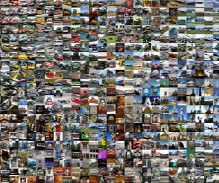

What I learned from competing against a ConvNet on ImageNet

What I learned from competing against a ConvNet on ImageNet

http://karpathy.github.io/2014/09/02/what-i-learned-from-competing-against-a-convnet-on-imagenet/

Musings of a Computer Scientist.