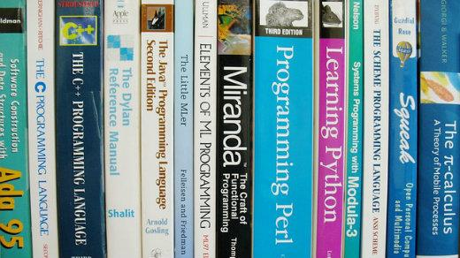
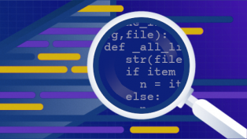
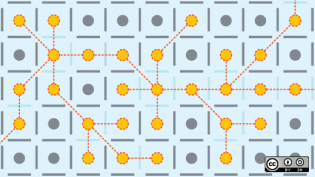

What I learned going from prison to Python | Opensource.com

# What I learned going from prison to Python

## How open source programming can offer opportunities after incarceration.

| 12 Jan 2020 | [Shadeed "Sha" Wallace-Stepter](https://opensource.com/users/shastepter) [Feed](https://opensource.com/user/342906/feed) |

39

[up](https://opensource.com/article/20/1/prison-to-python?rate=_OqWZiG8qLuuISuvvxUhl5aoRImkH1ArJBgNfG5LS5Y)

Image credits :

[geralt](https://pixabay.com/en/users/geralt-9301/) via [Pixabay](https://pixabay.com/en/books-bookshelf-computer-science-942485/), [CC0](https://pixabay.com/en/service/terms/#usage)

.

Less than a year ago, I was in San Quentin State Prison serving a life sentence.

In my junior year in high school, I shot a man while robbing him. Now, it took a while for me to see or even admit that what I did was wrong, but after going through a jury trial and seeing the devastating consequences of my actions, I knew that I needed to make a change, and I did. And although it was a great thing that I had changed, I had still shot a man and nearly killed him. And there are consequences to doing something like that, and rightfully so. So at the age of 18, I was sentenced to life in prison.

Now prison is a terrible place; I do not recommend it. But I had to go and so I went. I’ll spare you the details, but you can rest assured it’s a place where there isn’t much incentive to change, and many people pick up more bad habits than they went in with.

I’m one of the lucky ones. While I was in prison, something different happened. I started to imagine a future for myself beyond the prison bars where, up until that point, I had spent all of my adult life.

Now YOU think about this: I’m black, with nothing more than a high school education. I had no work history, and if I ever were to leave prison, I would be a convicted felon upon my release. And I think I’m being fair when I say that the first thought for an employer who sees this profile is not "I need to hire this person."

My options weren’t clear, but my mind was made up. I needed to do something to survive that wouldn’t look anything like my life before prison.

## A path to Python

Eventually, I wound up in San Quentin State Prison, and I had no idea how lucky I was to be there. San Quentin offered several self-help and education programs. These [rehabilitation opportunities](https://www.dailycal.org/2019/02/27/san-quentin-rehabilitation-programs-offer-inmates-education-a-voice/) ensured prisoners had skills that helped them avoid being repeat offenders upon release.

As part of one of these programs, I met [Jessica McKellar](https://twitter.com/jessicamckellar?lang=en) in 2017 through her work with the San Quentin Media Program. Jessica is an enthusiast of the programming language [Python](https://www.python.org/), and she started to sell me on how great Python is and how it’s the perfect language to learn for someone just starting out. And this is where the story becomes stranger than fiction.

Jessica told me about these Python video tutorials that she did for a company called [O’Reilly Media](http://shop.oreilly.com/product/110000448.do), that they were online, and how great it would be if I could get access to them. Unfortunately, internet access in prison isn’t a thing. But, I had met this guy named Tim O’Reilly, who had recently come to San Quentin. It turns out that, after his visit, Tim had donated a ton of content from his company, O’Reilly Media, to the prison’s programming class. I wound up getting my hands on a tablet that had Jessica’s Python tutorials on it and learned how to code using those Python tutorials.

It was incredible. Total strangers with a very different background and life from my own had connected the dots in a way that led to me learning to code.

## The love of the Python community

After this point, I started meeting with Jessica pretty frequently, and she began to tell me about the open source community. What I learned is that, on a fundamental level, open source is about fellowship and collaboration. It works so well because no one is excluded.

More Python Resources

- [Cheat sheet: Python 3.7 for beginners](https://opensource.com/downloads/cheat-sheet-python-37-beginners?intcmp=7016000000127cYAAQ)
- [Top Python IDEs](https://opensource.com/resources/python/ides?intcmp=7016000000127cYAAQ)
- [Top Python GUI frameworks](https://opensource.com/resources/python/gui-frameworks?intcmp=7016000000127cYAAQ)
- [Download: 7 essential PyPI libraries](https://opensource.com/downloads/7-essential-pypi-libraries?intcmp=7016000000127cYAAQ)
- [Latest Python content](https://opensource.com/tags/python?intcmp=7016000000127cYAAQ)

And for me, someone who struggled to see where they fit, what I saw was a very basic form of love—love by way of collaboration and acceptance, love by way of access, love by way of inclusion. And my spirit yearned to be a part of it. So I continued my education with Python, and, unfortunately, I wasn’t able to get more tutorials, but I was able to draw from the vast wealth of written knowledge that has been compiled by the open source community. I read anything that even mentioned Python, from paperback books to obscure magazine articles, and I used the tablet that I had to solve the Python problems that I read about.

My passion for Python and programming wasn’t something that many of my peers shared. Aside from the very small group of people who were in the prison’s programming class, no one else that I knew had ever mentioned programming; it’s just not on the average prisoner’s radar. I believe that this is due to the perception that programming isn’t accessible to people who have experienced incarceration, especially if you are a person of color.

## Life with Python outside of prison

Then, on August 17, 2018, I got the surprise of my life. Then-Governor Jerry Brown commuted my 27-years-to-life sentence, and I was released from prison after serving almost 19 years.

But here’s the reality of my situation and why I believe that programming and the open source community are so valuable. I am a 37-year-old, black, convicted felon, with no work history, who just served 18 years in prison. There aren’t many professions that exist that would prevent me from being at the mercy of the stigmas and biases that inevitably accompany my criminal past. But one of the few exceptions is programming.

The people who are now returning back to society after incarceration are in desperate need of inclusion, but when the conversation turns to diversity in the workplace and how much it’s needed, you really don’t hear this group being mentioned or included.

So with that, I want to humbly challenge all of the programmers and members of the open source community to expand your thinking around inclusion and diversity. I proudly stand before you today as the representative of a demographic that most people don’t think about—formerly incarcerated people. But we exist, and we are eager to prove our value, and, above all else, we are looking to be accepted. Many challenges await us upon our reentry back into society, and I ask that you allow us to have the opportunity to demonstrate our worth. Welcome us, accept us, and, more than anything else, include us.

##

 [Learn Python by teaching in your community](https://opensource.com/article/19/5/learn-python-teaching)

A free and fun way to learn by teaching others.

[Don Watkins (Correspondent)](https://opensource.com/users/don-watkins) |

.

##

 [My first contribution to open source: Impostor Syndrome](https://opensource.com/article/19/11/my-first-open-source-contribution-impostor-syndrome)

A new open source contributor documents a series of five mistakes she made starting out in open source.

[Galen Corey](https://opensource.com/users/galenemco) |

.

##

 [10 tips for onboarding open source contributors](https://opensource.com/article/19/12/open-source-contributors)

Making new contributors feel welcome in your community is essential to your project's future, so it's important to put time and attention into onboarding them.

[Anna Iosif](https://opensource.com/users/angamanga) | [Romina Suarez](https://opensource.com/users/rowasc) |

.

##  Topics :

[Python](https://opensource.com/tags/python)
[Diversity and inclusion](https://opensource.com/tags/diversity)

## About the author

 Shadeed "Sha" Wallace-Stepter - Sha is a filmmaker and entrepreneur from San Francisco. On August 24, 2018 Sha’s 27 year to life prison sentence for assault with a firearm was commuted by then Governor Jerry Brown and he was released from prison after serving more than 18 years. Since his release, Sha has founded Slow And Steady Media and is currently producing the documentary Growing Up Behind Bars as well as the podcast Convicts, Culture & Caucasian Women. Sha is also a Computer Science student at Berkeley City College...

[• More about me](https://opensource.com/users/shastepter)

- [Learn how you can contribute](https://opensource.com/participate)

.

##  Recommended reading

 [ setV: A Bash function to maintain Python virtual environments](https://opensource.com/article/20/1/setv-bash-function?utm_campaign=intrel)

 [ How piwheels will save Raspberry Pi users time in 2020](https://opensource.com/article/20/1/piwheels?utm_campaign=intrel)

 [ How to write a Python web API with Pyramid and Cornice](https://opensource.com/article/20/1/python-web-api-pyramid-cornice?utm_campaign=intrel)

 [ Add scorekeeping to your Python game](https://opensource.com/article/20/1/add-scorekeeping-your-python-game?utm_campaign=intrel)

 [ Put some loot in your Python platformer game](https://opensource.com/article/20/1/loot-python-platformer-game?utm_campaign=intrel)

 [ Namespaces are the shamash candle of the Zen of Python](https://opensource.com/article/19/12/zen-python-namespaces?utm_campaign=intrel)

##  Comment now

 [Login or Register](https://opensource.com/user/login?destination=node/60391) to earn points for your comments.

 Your name *
 E-mail *
The content of this field is kept private and will not be shown publicly.

 Accept the [Terms of Use](https://opensource.com/legal) to continue. You are licensing your contribution(s) as CC-BY-SA. *

CAPTCHA

This question is for testing whether or not you are a human visitor and to prevent automated spam submissions.

 .