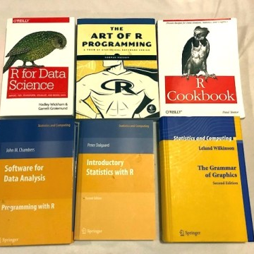

What Is a Data Frame? (In Python, R, and SQL)

What Is a Data Frame? (In Python, R, and SQL)

https://www.oilshell.org/blog/2018/11/30.html?utm_medium=email&utm_source=topic+optin&utm_campaign=awareness&utm_content=20181212+data+nl&mkt_tok=eyJpIjoiTUdJM056VXlNVEJsWldZNSIsInQiOiJVUW1IeHpJQkZONXUxYU9aTFppK0s0ZkxHZXl2bnJBQXpqZmNEZVBRQVBxenBnc08xeGVHVWZ6WHpZK3NkWU84T3YrNDJ2alRIM0VvdE9McjZSdFpvcVV6anVDOTQxUmpQTktva3d1SFV0MEN2SEJaTlNkMWZTeE0rdkZBaUpJSiJ9

blog | oilshell.org What Is a Data Frame? (In Python, R, and SQL) 2018-11-30 A data frame is a table-like data structure available in languages like R and Python . Statisticians, scientists, and programmers use them in data analysis code. Once you've tried data frames, you'll reach for them during every data analysis project . This post introduces the concepts behind them, and then shows how they work by solving the same problem in multiple ways: Without data frames, using straightforward but verbose Python code.