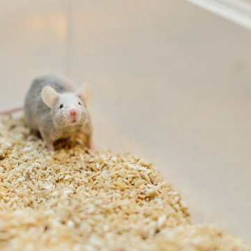

What Lonely Humans Can Learn From Lonely Mice – Member Feature Stories – Medium

What Lonely Humans Can Learn From Lonely Mice – Member Feature Stories – Medium

https://medium.com/s/story/what-lonely-humans-can-learn-from-lonely-mice-1c412f5b1d81

A dynamo young researcher has discovered that a pill could help address the loneliness epidemic and the aggression that often comes with it