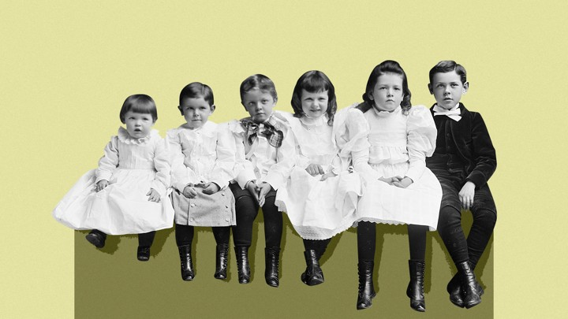
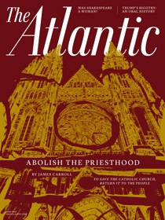
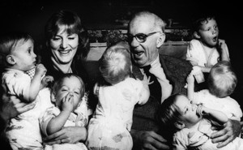
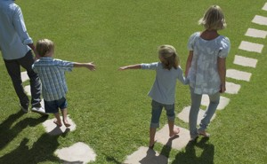
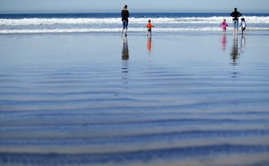

What Number of Kids Makes Parents Happiest?

 [Family](https://www.theatlantic.com/family/)

# What Number of Kids Makes Parents Happiest?

Zero? Three? Six? 2.1?

[Joe Pinsker](https://www.theatlantic.com/author/joe-pinsker/)
  May 3, 2019

C. M. Bell / Library of Congress / Katie Martin / The Atlantic

Bryan Caplan is an economist and a dad who has thought a lot about the joys and stresses of being a parent. When I asked him whether there is an ideal number of children to have, from the perspective of parents’ well-being, he gave a perfectly sensible response: “I’m tempted to start with the evasive economist answer of ‘Well, there’s an optimal number given your preferences.’”

Advertisement

When I pressed him, he was willing to play along: “If you have a typical level of American enjoyment of children and you’re willing to actually adjust your parenting to the evidence on what matters, then I’ll say the right answer is four.”

Four does happen to be the number of children Caplan himself has. But he has a rationale for why that number might apply more generally. His interpretation of the research on parenting, which he outlines in his 2011 book, [*Selfish Reasons to Have More Kids*](https://www.indiebound.org/book/9780465018673), is that many of the time- and money-intensive things that parents do in hopes of helping their children succeed—loading them up with extracurriculars, sending them to private school—don’t actually contribute much to their future earnings or happiness.

*[*[Read: Parenting like an economist is a lot less stressful](https://www.theatlantic.com/family/archive/2019/04/oster-cribsheet-parenting-guide/587734/)*]*

Advertisement

In other words, many parents make parenting unnecessarily dreadful, so maybe, Caplan suggests, they should revisit their child-rearing approach and then, if they can afford to, consider having more kids, because kids can be fun and fulfilling. No sophisticated math brought him to the number four. “It’s just based upon my sense of how much people intrinsically like kids compared to how much needless suffering they’re doing,” he said. Caplan even suspects that more than four would be optimal for him.

The prompt I gave to Caplan, of course, has no single correct response. There are multiple, sometimes conflicting, ways of evaluating the question of how many kids is best for one family: from the perspective of parents, of children, and of society. These various lines of inquiry warrant a tour of what’s known, and what isn’t, about how the size of a family shapes the lives of its members.

Get the latest issue now.

Subscribe and receive an entire year of The Atlantic’s illuminating reporting and expert analysis, starting today.

 [Subscribe](https://adclick.g.doubleclick.net/pcs/click%3Fxai%3DAKAOjsu-oJ3Ss3auj1BQSW8kvj-XyyC2yajSnXtIbjAMKcNNDlfsS1BGPiAIR5r2F6TeMZcZbo1Sco_z5opGheZ2Z6Mih8LimxB7gOnG-7BZN1RBWdu6MlkfNSpRcdTFQlAg2Lx7m286HhhjtmwMxh1qCtD9EpjhDnQZAKPZzerX7uLHIvgCBgQkpUMWsybtELI5Fwpn9k5NpB4OeBmmyUWjWycqiHlNUn9WgzAcsWe9pp95btpSkpSjOXEDpdj9-F8PQRk6Ox4a_ZO--oIiNlnUCcNUOUen5ghOppv6UIvVUA%26sig%3DCg0ArKJSzP5FcNJQzAZdEAE%26urlfix%3D1%26adurl%3Dhttps://subscribe.theatlantic.com/pubs/A5/ATL/PriceTest_ctrl.jsp?cds_page_id=233105&cds_mag_code=ATL&id=1541013055872&lsid=83041407475020706&vid=3&octtest=true&cds_response_key=I18ZXCTRL)

 [ ](https://adclick.g.doubleclick.net/pcs/click%3Fxai%3DAKAOjsu-oJ3Ss3auj1BQSW8kvj-XyyC2yajSnXtIbjAMKcNNDlfsS1BGPiAIR5r2F6TeMZcZbo1Sco_z5opGheZ2Z6Mih8LimxB7gOnG-7BZN1RBWdu6MlkfNSpRcdTFQlAg2Lx7m286HhhjtmwMxh1qCtD9EpjhDnQZAKPZzerX7uLHIvgCBgQkpUMWsybtELI5Fwpn9k5NpB4OeBmmyUWjWycqiHlNUn9WgzAcsWe9pp95btpSkpSjOXEDpdj9-F8PQRk6Ox4a_ZO--oIiNlnUCcNUOUen5ghOppv6UIvVUA%26sig%3DCg0ArKJSzP5FcNJQzAZdEAE%26urlfix%3D1%26adurl%3Dhttps://subscribe.theatlantic.com/pubs/A5/ATL/PriceTest_ctrl.jsp?cds_page_id=233105&cds_mag_code=ATL&id=1541013055872&lsid=83041407475020706&vid=3&octtest=true&cds_response_key=I18ZXCTRL)

* * *

A handful of studies have tried to pinpoint a number of children that maximizes parents’ happiness. [One study from the mid-2000s](https://penntoday.upenn.edu/2006-02-23/research/one-baby-or-two-study-looks-effect-having-second-child) indicated that a second child or a third didn’t make parents happier. “If you want to maximize your subjective well-being, you should stop at one child,” the study’s author [told](https://www.psychologytoday.com/us/articles/200501/is-one-kid-enough)[*Psychology Today*](https://www.psychologytoday.com/us/articles/200501/is-one-kid-enough). A [more recent study](https://link.springer.com/article/10.1007/s13524-014-0321-x), from Europe, found that two was the magic number; having more children didn’t bring parents more joy.

## More Stories

-

 

###   [There Used to Be Consensus on How to Raise Kids](https://www.theatlantic.com/family/archive/2018/03/america-new-dr-spock/555311/)

 [Paula Fass](https://www.theatlantic.com/author/paula-fass/)

-

 

###   [How to Talk to an Anti-vax Relative](https://www.theatlantic.com/family/archive/2019/04/when-families-feud-over-vaccines/587629/)

 [Ashley Fetters](https://www.theatlantic.com/author/ashley-fetters/)

-

 

###   [Parenting Like an Economist Is a Lot Less Stressful](https://www.theatlantic.com/family/archive/2019/04/oster-cribsheet-parenting-guide/587734/)

 [Joe Pinsker](https://www.theatlantic.com/author/joe-pinsker/)

-

 

###   [Grieving the Future I Imagined for My Daughter](https://www.theatlantic.com/family/archive/2019/04/1p36-genetic-disorder-reshaping-my-family/586717/)

 [Julie Kim](https://www.theatlantic.com/author/julie-kim/)

In the United States, [nearly half](https://news.gallup.com/poll/236696/americans-theory-think-larger-families-ideal.aspx) of adults consider two to be the ideal number of children, according to Gallup polls, with three as the next most popular option, preferred by 26 percent. Two is [the favorite across Europe, too](https://onlinelibrary.wiley.com/doi/full/10.1111/j.1728-4457.2014.00691.x).

Ashley Larsen Gibby, a Ph.D. student in sociology and demography at Penn State, notes that these numbers come with some disclaimers. “While a lot of [the] evidence points to two children being optimal, I would be hesitant to make that claim or generalize it past Western populations,” she wrote to me in an email. “Having the ‘normative’ number of children is likely met with more support both socially and institutionally. Therefore, perhaps two is optimal in places where two is considered the norm. However, if the norm changed, I think the answer to your question would change as well.”

Advertisement

The two-child ideal is a major departure from half a century ago: In 1957, [only 20 percent of Americans](https://www.pewresearch.org/fact-tank/2018/08/09/middle-children-have-become-rarer-but-a-growing-share-of-americans-now-say-three-or-more-kids-are-ideal/) said the ideal family meant two or fewer children, while 71 percent said it meant three or more. The economy seems to have played some role in this shift. Steven Mintz, a historian at the University of Texas at Austin and the author of [*Huck’s Raft: A History of American Childhood*](http://www.hup.harvard.edu/catalog.php?isbn=9780674019980), says that the ideal during the Baby Boom was in the neighborhood of three, four, or five children. “That number plummeted as the cost of rearing children rose and as more women entered the workforce and felt a growing sense of frustration about being reduced to childbearing machines,” he said.

The costs of raising children are not just financial. “As a parent who prizes his own mental and physical health,” says Robert Crosnoe, a sociology professor who is also at the University of Texas at Austin, “I had to stop at two, because this new style of [intensive parenting](https://www.theatlantic.com/family/archive/2019/01/intensive-helicopter-parenting-inequality/580528/) that people feel they have to follow these days really wears one out.” (He added: “I am glad, however, that my parents did not think this way, as I am the third of three.”)

Advertisement

*[*[Read: The way American parents think about chores is bizarre](https://www.theatlantic.com/family/archive/2018/12/allowance-kids-chores-help/578848/)*]*

At the same time, having only one kid means parents miss out on the opportunity to have at least one boy and one girl—an arrangement they have tended to prefer for half a century, if not longer. (Couples are generally more likely to stop having children once they have one of each.) Maybe this is another reason two is such a popular number—though in the long run, [one researcher found](https://www.theatlantic.com/family/archive/2018/11/parent-disappointed-child-gender-sex-preference/576907/) that having all girls or all boys doesn’t meaningfully affect the happiness of mothers who wanted at least one of each. (This researcher didn’t look at dads’ preferences.)

But plenty of people want more or fewer than two kids. In general, the experts I consulted agreed that the optimal number of children is specific to each family’s desires and constraints. “When a couple feels like they have more interest in kids; more energy for kids; maybe more support, like grandparents in the area; and a decent income, then having a large family can be the best option for them,” says Brad Wilcox, the director of the University of Virginia’s National Marriage Project. “And when a couple has fewer resources, either emotional, social, or financial, then having a smaller family would be best for them.”

Advertisement

[](https://d.agkn.com/pixel/4134/?che=826018&col=994051,8,4473130,,9125683,3c150c92-6591-47e9-9387-d3c762dd5e05&l0=http://insight.adsrvr.org/track/clk?imp=3c150c92-6591-47e9-9387-d3c762dd5e05&ag=k8i6oj2&sfe=f2098bd&sig=KSgBegXPjQVRKyAw7W6l8Myx53NxoeHIyvI9xMhsIbY.&crid=rf42hhml&cf=891265&fq=0&td_s=www.theatlantic.com&rcats=y29&mcat=gq_ivt_low_risk_display&mste=&mfld=2&mssi=None&mfsi=d4ps6x39y3&sv=casale&uhow=155&agsa=&rgco=United%20Kingdom&rgre=Camden&rgme=&rgci=Camden&rgz=NW1&dt=PC&osf=OSX&os=Other&br=Chrome&svpid=184516&rlangs=01&mlang=&did=&rcxt=Other&tmpc=18.33&vrtd=&osi=&osv=&daid=&dnr=0&vpb=&c=OAE.&dur=CjgKHmNoYXJnZS1hbGxHcmFwZXNob3RCcmFuZFNhZmV0eSIWCPb__________wESCWdyYXBlc2hvdAo_CiVjaGFyZ2UtYWxsR3JhcGVzaG90RGlzcGxheVBhZ2VRdWFsaXR5IhYI3v__________ARIJZ3JhcGVzaG90&crrelr=&npt=&svscid=187067&mk=Apple&mdl=Chrome%20-%20OS%20X&fpa=835&pcm=3&ict=Unknown&grdc=CAEYASABKAE.&r=https://servedby.flashtalking.com/click/1/108225;3776736;2616358;210;0/?ft_impID=33B514BD-487B-4A73-1F01-6FEBAF1EC2A1&g=411515E6833C29&random=73074067&ft_width=300&ft_height=250&url=https://pgpro.co.uk/manual-laundry-improved-formula)

What happens when there’s a gap between parents’ desires and reality? Per the General Social Survey, in 2018, 40 percent of American women ages 43 to 52 had had fewer children than what they considered ideal. “Part of the story here is that women are having children later in life, compared to much of human history, and they’re getting married later in life as well,” Wilcox says. “So those two things mean that at the end of the day, a fair number of women end up having fewer kids than they would like to, or they end up having no kids when they hoped to have children.”

Though the root causes can differ, this mismatch between hope and actuality is [seen worldwide](https://ifstudies.org/blog/the-global-fertility-gap), and [appears to](https://ifstudies.org/blog/the-fertility-gap-and-womens-happiness) make women measurably less happy. So while people’s ideal family size may vary—and is highly individualized—they’ll probably be happiest if they hit their target, whatever it may be.

* * *

Perhaps the most meaningful difference isn’t a matter of going from one to two children, or two to three, but from zero to one—from nonparent to parent.

Advertisement

“Having just one child [makes] various aspects of adults’ lives—how time, money, emotion, and mind are used and how new social networks are formed—child-centered,” says Kei Nomaguchi, a sociologist at Bowling Green State University. “If you want to enjoy adult-centered life, love expensive leisure activities, cherish intimate relationships with your partner, and both you and your partner want to devote your time to your careers, zero kids would be the ultimate.”

Mothers, of course, stand to lose more than fathers when they have kids in their household. Having children is [more stressful](https://www.ncbi.nlm.nih.gov/pmc/articles/PMC3489180/) for women than it is for men, and mothers suffer [professionally after having children in a way that fathers don’t](https://onlinelibrary.wiley.com/doi/full/10.1111/jomf.12086) (though parents’ happiness does seem to vary [based on their country’s policies about paid leave and child care](https://www.journals.uchicago.edu/doi/abs/10.1086/688892)). In these regards, too, zero is good.

*[*[Read: How well-intentioned white families can perpetuate racism](https://www.theatlantic.com/family/archive/2018/09/white-kids-race/569185/)*]*

Whether the optimal number of children is greater than zero is a question many researchers have tried to address, and the sum of their work points to a range of variables that seem to matter.

Advertisement

One recent paper suggested that becoming a parent does indeed make people happier, [as long as they can afford it](https://www.theatlantic.com/family/archive/2019/02/cost-raising-kids-parents-happiness/583699/). And [a 2014 review of existing research](https://cloudfront.escholarship.org/dist/prd/content/qt5rp9034f/qt5rp9034f.pdf), whose authors were skeptical of “overgeneralizations that most parents are miserable or that most parents are joyful,” detected other broad patterns: Being a parent tends to be a less positive experience for mothers and people who are young, single, or have young children. And it tends to be more positive for fathers and people who are married or who became parents later in life.

What’s optimal, then, depends on age, life stage, and family makeup—in other words, things that are subject to change. While being the parent of a young child may not seem to maximize happiness, parenthood may be more enjoyable years down the line.

Indeed, Bryan Caplan believes that when people think about having children, they tend to dwell on the early years of parenting—the stress and the sleep deprivation—but undervalue what family life will be like when their children are, say, 25 or 50. His advice to those who suspect they might be unhappy without grandchildren someday: “Well, there’s something you can do right now in order to reduce the risk of that, which is just have more kids.”

Advertisement

* * *

Parents may decide that a certain number of children is going to maximize *their* happiness, but what about the happiness of the children themselves? Is there an optimal number of siblings to have?

Generally speaking, as much as brothers and sisters bicker, relationships between siblings tend to be positive ones. In fact, there’s evidence that having siblings [improves young children’s social skills](https://psycnet.apa.org/record/2004-15844-007), and that good relationships between adult siblings in older age are [tied to better health](https://www.npr.org/sections/health-shots/2017/11/23/565362158/adult-siblings-can-make-our-lives-healthier-and-happier). (One study even found a correlation between having siblings and [a reduced risk of getting a divorce](https://journals.sagepub.com/doi/abs/10.1177/0192513X14560641)—the idea being that growing up with siblings might give people social toolkits that they can use later in life.)

There is, however, at least one less salutary outcome: The more siblings one has, the less education one is likely to get. Researchers have for decades discussed whether [“resource dilution”](https://psycnet.apa.org/record/2001-17729-003) might be at play—the idea that when parents have to divvy up their resources among more children, each child gets less. Under this framework, going from having zero siblings to having one would be the most damaging, from a child’s perspective—his or her claim to the household’s resources shrinks by half.

But this theory doesn’t really hold up, not least because children with one sibling tend to go further in school than only children. “Resource dilution is attractive because it’s intuitive and parsimonious—it explains a lot with a simple explanation—but it’s probably too simple,” says Douglas Downey, a sociologist at Ohio State University. “Many parental resources are probably not finite in the way the theory describes.”

A small example: Parents can read books to two children at once—this doesn’t “dilute” their limited time. A larger one: Instead of splitting up a fixed pile of cash, parents might start saving differently if they know they’re going to pay two kids’ college tuitions instead of one’s. “They put a bigger proportion of their money toward kids’ education and less toward new golf clubs,” Downey explains.

And if parents are enmeshed in a strong community that helps them raise their kids, they have more resources than just their own to rely on. In [a 2016 study](https://link.springer.com/article/10.1007/s13524-016-0471-0), Downey and two other researchers found that the negative correlation between “sibship size” and educational outcomes was three times as strong in Protestant families as in Mormon ones, which often take a more communal approach to raising children. “When child development is shared more broadly with nonparents, sibship size matters less,” Downey and his fellow researchers wrote.

The gender mix of siblings can be a factor too. “In places with strong preferences for sons over daughters, there is [some](https://www.popline.org/node/314352)  [evidence](https://link.springer.com/article/10.1353/dem.2003.0029) that girls with older sisters are the worst off in terms of parental investments (e.g. school fees, medical care, maybe even food/nutrition),” Sarah Hayford, a colleague of Downey’s at Ohio State, noted in an email.

Siblings, then, can be a mixed bag. It’s probably folly to try to game out just how many kids will give each one the best life. But Caplan has a simple theory for how to optimize children’s happiness: “The most important thing in your life is your parents deciding to have you in the first place. Each kid is another person that gets to be alive and will be very likely to be glad to be alive.”

* * *

Thinking about what’s best for any individual household is more subjective and nuanced than what number of kids would be best for the broader society. When it comes to ensuring that a given society’s population is steady in the long run, demographers don’t just have a number (an average of 2.1 births per woman, roughly) but a name for it: “replacement-level fertility.”

Sometimes, populations deviate from this replacement-level rate in a way that stresses out demographers. “Nothing guarantees that the number of children that is good for me is also good for the society,” said Mikko Myrskylä, the executive director of the Max Planck Institute for Demographic Research, in Rostock, Germany.

“Very low fertility,” Myrskylä wrote in an email, “creates a situation in which over time the share of working-age population compared to the elderly population becomes small, and this may present a challenge for social arrangements such as the social security system.” Japan’s population, for instance, has been shrinking in the past decade, and its growing elderly population and low fertility rate (1.43 births per woman) have its government [worried about the sustainability of its workforce and social-benefits programs](https://www.theguardian.com/world/2018/dec/27/japan-shrinking-as-birthrate-falls-to-lowest-level-in-history).

“Very high fertility,” Myrskylä continued, “in particular when mortality is low, creates a rapidly growing population, which requires expansion in the infrastructure and consumes increasingly large amounts of resources.” In Nigeria, the government has attempted to lower its high fertility rate [by increasing access to contraceptives and touting the economic advantages of smaller family units](https://www.nytimes.com/2012/04/15/world/africa/in-nigeria-a-preview-of-an-overcrowded-planet.html).

But families don’t base their desire for children on a society’s optimal number. In many countries in central and West Africa—such as Senegal, Mali, and Cameroon—the desired family size for many young women is four to six children, says John Casterline, a demographer at Ohio State who has conducted research in the region. This number has stayed relatively high even as people have attained higher average levels of education—a shift that, in Asia and Latin America, for instance, is usually accompanied by a shrinking of the hoped-for size of families.

It’s not entirely clear why women’s expectations in these parts of the world haven’t changed as those of women in other regions have. One guess, Casterline says, has to do with how family is conceptualized. “A lot of things in life are perceived as a collective endeavor of a large extended kin group, for the sharing of resources and labor, so that diminishes the personal cost of having a kid,” he told me. “It’s diffused among a larger group of people.” For example, maybe one child is particularly sharp, so his relatives save up to send him to college—“a sort of corporate collective effort,” as Casterline put it—and hope that he gets a high-paying urban job and can help support them.

Another possibility: “There was always the issue of protecting yourself against mortality,” Casterline said, referring to the possibility that a child might not make it into adulthood. He said that child mortality rates in many parts of the world have declined a lot in the past few decades. But they’re still high, and the impulse to hedge against them might linger. “‘How many babies do I need to have now if I’d like to have three adult children in 30 years?’” says Jenny Trinitapoli of the University of Chicago, describing the thought process. “That depends on the mortality rates.”

But these explanations aren’t definitive. Some hard-to-quantify preferences also seem to be playing a role. Casterline remembered conducting surveys in Egypt a decade or so ago, and listening to Egyptians discuss the merits of having three children versus two. “There was some indifference, but there was a real feeling that it’s more of a family—it feels better—to have three children rather than two, because so much of their social life is family gatherings, and having aunts and uncles and cousins,” he says. “And if you have three kids, you get a lot more of that.”

But as the economy and makeup of a society changes, so do people’s preferences, and in that sense, the United States is a telling example. At the beginning of the 19th century, the typical married woman had seven to 10 children, but by the beginning of the 20th, that number had fallen to three. Why? “Children were no longer economic assets who could be put to work,” says Mintz, the historian of childhood.

And some aspects of society are designed to work best for families of a certain size—a standard car in America, for instance, comfortably fits four people. (Mintz notes that in the ‘50s and ‘60s, sedans could seat six, because they typically had bench seats and lacked a center console.) Hotels, too, come to mind: Once a family has more people than can fit in two double beds, it’s time to consider booking another room.

After accounting for what a given society is like, and what a given household within that society is like, one could very well determine the optimal number of children to have. But those considerations are less compelling and more clinical when compared with the joy people have when they see a child hold his baby sister for the first time; attend an enormous, rowdy family reunion; or plan a blissful getaway without having to worry about who will watch the children. Those are the moments that feel truly optimal.

**We want to hear what you think about this article. [Submit a letter](https://www.theatlantic.com/contact/letters/) to the editor or write to letters@theatlantic.com.**

 [Joe Pinsker](https://www.theatlantic.com/author/joe-pinsker/) is a staff writer at *The Atlantic, *where he covers families and education.

[  Twitter](https://twitter.com/jpinsk)