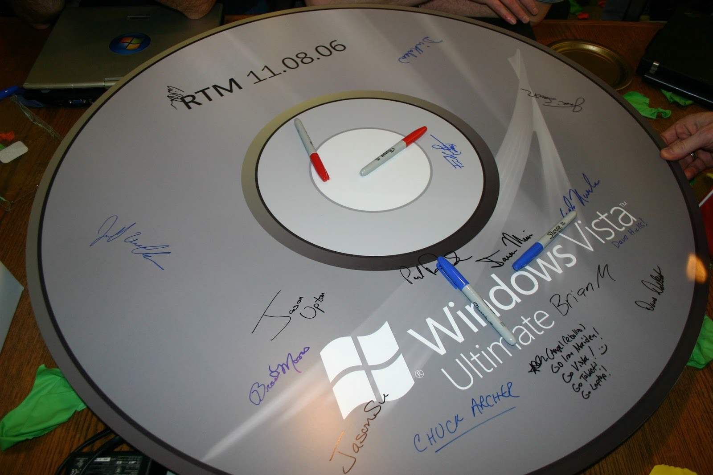
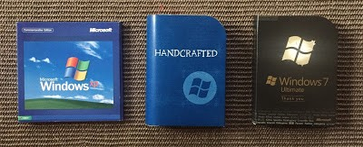
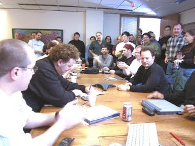

What Really Happened with Vista: An Insider’s Retrospective

# What Really Happened with Vista: An Insider’s Retrospective

It was a tradition for Windows team members to sign a poster (in this case an image of the DVD) upon release of a version of Windows. By the time the release party was over, there would be hundreds or thousands of signatures on the poster.

> “Experience is something you don’t get until just after you need it.” — Steven Wright.

[Author’s Note: Originally published [here](http://benbobsworld.blogspot.com/2017/06/what-really-happened-with-vista.html), this blog has recently been getting a lot of hits as it was referenced in [my recent blog on dogfooding](https://read.acloud.guru/the-gospel-of-dogfooding-can-i-hear-an-amen-brother-1af4d82cf221) so I decided to republish it on Medium in slightly different format and with a few updates.]

I enjoyed reading Terry Crowley’s thoughtful blog ([What Really Happened with Vista](https://hackernoon.com/what-really-happened-with-vista-4ca7ffb5a1a)). Terry worked in the Office organization and did a fantastic job covering the complex machinations that went into Windows Vista and the related but doomed Longhorn project — from an outsider’s point of view.

He correctly identified many of the problems that dogged the project and I don’t mean to rehash any of them here. I figured it was only fair to try to offer an insider’s view of the same events. I can’t hope to be as eloquent or thorough as Terry but hope to shed some light on what went wrong. Ten years have gone by since the original release date of Windows Vista but the lessons seem more relevant now than ever.

Windows is a beast. Thousands of developers, testers, program managers, security experts, UI designers, architects, you name it. And that’s before the supporting cast of HR people, recruiters, marketing folks, salespeople, lawyers, and of course many managers, directors, and vice presidents for each of the disciplines mentioned above. The entire ensemble cast is supported by many thousands of others at partner teams (within Microsoft as well as outside) that deliver everything from hardware underneath to device drivers and applications on top of the platform.

Aerial photo of the Windows team taken on the soccer field at Microsoft

Organizationally, at the time, Windows was really three teams: Core, Server, and Client. The core team delivered the “plumbing”, all the core components of the operating system (the kernel itself, storage, security, networking, device drivers, the installation and upgrade model, Win32, etc) shared by all versions of Windows. The server team, in turn, concentrated on technologies needed for the server market (terminal services, clustering and high availability, enterprise management tools, etc) while the client team was responsible for technologies related to the desktop and consumer releases (web browser, media player, graphics, shell, etc).

There were, of course, many reorgs but that basic structure was kept in place even as Windows grew in popularity and the teams grew in size. It would also be fair to say, culturally and organizationally speaking, that the core team was closer to the server team than it was to the client team — at least until after Vista shipped.

By the time I arrived at Microsoft, in early 1998, Windows meant Windows NT — architecturally, organizationally, and product wise. The Windows 95 code base had largely been abandoned and Windows NT had been adopted for every personality of Windows — from the laptop to the clustered Server. Two years later, the Windows 95/98 code base would be resurrected for one last release — the much maligned Windows ME — but that project was executed by a small team while the vast majority worked on the NT code base. I was lucky enough to spend a dozen years in the belly of the beast, joining during the heyday of Windows 2000 development and staying through to the completion of Windows 7.

I spent the first seven years of my tenure managing the teams responsible for storage, file systems, high availability/clustering, file level network protocols, distributed file systems, and related technologies. Later, I spent a year or two managing security for Microsoft. This included everything from security technologies in Windows to antivirus products as add-on solutions to security marketing and emergency response such as security patches. This was towards the tail end of Vista when viruses and worms were bringing Windows to its knees and when Microsoft’s reputation for building secure software had taken a massive beating in the marketplace.

For the last three or four years, for the duration of the Windows 7 release, I managed all core development in Windows. That meant dev ownership of pretty much all technologies running “under the hood” and used by both the client and server teams. After Vista shipped, the Windows team was organized by disciplines and a “triad” (Dev, Test, PM) was put in charge at every level of the org so I ended up with two partners in crime. I managed the development teams while they managed, respectively, the test and program management teams.

The Windows team had a history of attempting massive and ambitious projects that were often abandoned or repurposed after a few years. An earlier example was the ambitious Cairo project which was eventually gutted, with some pieces salvaged and shipped as part of Windows 2000.

By far the biggest problem with Windows releases, in my humble opinion, was the duration of each release. On average, a release took about three years from inception to completion but only about six to nine months of that time was spent developing “new” code. The rest of the time was spent in integration, testing, alpha and beta periods — each lasting a few months.

Some projects needed more than six months of core development so they proceeded in parallel and merged with the main code base when ready. This meant that the main tree was almost always in a semi-broken state as large pieces of functionality were being integrated or replaced. Much tighter controls were put in place during the Windows 7 release to ensure a constantly healthy and functioning code base but earlier releases were plagued with daily instability for months at a time.

The chaotic nature of development often resulted in teams playing schedule chicken, convincing themselves and others that their code was in better shape than other projects, that they could “polish” the few remaining pieces of work just in time, so they would be allowed to checkin their component in a half-finished state.

The three year release cycle meant we rarely knew what the competitive landscape and external ecosystem would look like when we started a release. Missing a release meant cancellation (as the feature rarely made sense six years later) or, worse, banishment to Siberia — continued development on a component that was mostly ignored by the rest of the organization and doomed to eventual failure or irrelevance, but one that the team or the execs simply couldn’t bring themselves to abandon. I was personally responsible for a few such projects. Hindsight is 20/20.

Given that each team was busy pushing their own agenda and features into the release, they often skimped on integration with other components, user interface, end to end testing, and ugly and tedious issues such as upgrade, leaving these thorny issues for the endgame. That, in turn, meant some teams quickly became bottlenecks as everyone jockeyed for their help in finishing their UI or upgrade testing at the last minute.

At any given point in time, there were multiple major releases in progress as well as multiple side projects. Different teams were responsible for code bases in various states of health resulting in a model where “the rich got richer and the poor got poorer” over time — teams that fell behind, for one reason or another, more often than not stayed behind.

As a project neared completion, program managers would start looking at requirements for the next release and developers in “healthy” (rich) teams would start implementing new code but vast parts of the organization (the poor) were still stuck on the current release. In particular, test teams rarely freed up from a release until it shipped so new code wasn’t thoroughly tested in the beginning of a project and “unhealthy” teams always lagged behind, putting the finishing touches on the current release and falling further and further behind. These teams were also often the ones with the lowest morale and highest attrition meaning that the engineers inherited fragile code they hadn’t written and hence didn’t understand.

For most of the duration of Vista/Longhorn, I was responsible for the storage and file systems technologies. That meant I was involved with the WinFS effort although it was driven primarily by the SQL database team, a sister organization to the Windows team.

Bill Gates was personally involved at a very detailed level and was even jokingly referred to as “the WinFS PM”: the program manager responsible for the project. Hundreds, if not thousands, of man years of engineering went into an idea whose time had simply passed: what if we combine the query capabilities of the database with the streaming capabilities and unstructured data functionality of the file system and expose it as a programming paradigm for the creation of unique new “rich” applications.

In hindsight, it’s obvious that Google handily solved this problem, providing a seamless and fast indexing experience for unstructured data. And they did so for the entire internet, not just for your local disk. And you didn’t even need to rewrite your applications to take advantage of it. Even if WinFS had been successful, it would have taken years for applications to be rewritten to take advantage of its features.

When Longhorn was cancelled and Vista was hastily put together from its smoldering embers, WinFS was kicked out of the OS release. It was pursued by the SQL team for a few more years as a standalone project. By this time, Windows had a built-in indexing engine and integrated search experience — implemented purely on the side with no application changes needed. So the relevance of WinFS became even murkier but the project still carried on.

The massive security related architectural changes in Longhorn were kept as part of the Windows Vista project. We had learned a lot about security in the rapidly expanding internet universe and wanted to apply those learnings at an architectural level in the OS to improve overall security for all customers.

We had no choice. Windows XP had shown that we were victims of our own success. A system that was designed for usability fell far short in terms of security when confronted with the realities of the internet age. Addressing these security problems meant the creation of a parallel project, Windows XP Service Pack 2, which (despite its name) was a huge undertaking sucking resources away from Longhorn.

We couldn’t exactly go backwards in terms of security in our next major OS release. So it was that Vista became massively more secure than any earlier OS shipped by Microsoft, but in the process also managed to break application and device driver compatibility in an unprecedented manner for the ecosystem. Customers hated it because their apps broke and ecosystem partners hated it because they felt they didn’t have enough time to update and certify their drivers and applications as Vista was rushed out the door to compete with a resurgent Apple.

In many cases, these security changes meant deep architectural changes were required to third party solutions. And most ecosystem vendors were not incented to invest heavily in their legacy apps. Some of these solutions took the unorthodox approach of modifying data structures and even instructions in the kernel in order to implement their functionality, bypassing APIs and multiprocessor locks that often caused havoc. Antivirus vendors were notorious for using this approach.

In my role as the head of Microsoft security, I personally spent many years explaining to antivirus vendors why we would no longer allow them to “patch” kernel instructions and data structures in memory, why this was a security risk, and why they needed to use approved APIs going forward, that we would no longer support their legacy apps with deep hooks in the Windows kernel — the same ones that hackers were using to attack consumer systems. Our “friends”, the antivirus vendors, turned around and sued us, claiming we were blocking their livelihood and abusing our monopoly power! With friends like that, who needs enemies? They just wanted their old solutions to keep working even if that meant reducing the security of our mutual customer — the very thing they were supposed to be improving.

There were so many seismic shifts happening in the computing industry during those years — the advent of the internet, the rise of the mobile phone, the emergence of cloud computing, the creation of new ad-supported business models, the viral growth of social media, the relentless march of Moore’s law, and the popularity of open source are just a few factors that assaulted Windows from all directions.

The response, not surprisingly for a wildly successful platform, was to dig its heels in and keep incrementally improving the existing system — innovator’s dilemma in a nutshell. The more code we added, the more complexity we created, the larger the team got, the bigger the ecosystem, the harder it became to leapfrog the competition.

As if the competitive forces weren’t enough, this was also the time when armies of engineers and program managers spent countless hours, days, weeks, and months with representatives from the DOJ and corporate lawyers, documenting existing APIs from previous releases in order to comply with the government’s antitrust rulings.

The stark reality is that, at this point in its lifecycle, it took roughly three years to get a major release of Windows out the door and that was simply too slow for the fast moving market. WinFS, Security, and Managed Code were just a few of the massive projects on the agenda for Longhorn. There were also hundreds of smaller bets.

When you have a multi-thousand person organization and literally billions of customers, everyone gets a say. The same OS release that is supposed to work on the forthcoming tablet and smartphone footprint is also supposed to work on your laptop, in servers running in the data center, and in embedded devices such as NAS boxes “Powered by Windows” — not to mention on top of a hypervisor (HyperV) in the cloud. The requirements pulled the team in opposite directions as we tried to make forward progress on all segments of the market simultaneously.

It’s impossible to look at Longhorn and Vista in isolation. They make sense only when viewed in conjunction with the releases right before and right after them — Windows 2000 and XP on the one hand, Windows Server 2008 and Windows 7 on the other — and with full knowledge of the broader industry in retrospect.

Windows was a victim of its own success. It had penetrated many markets successfully and each of those businesses now exerted some influence on the design of the operating system pulling it in different, and often conflicting, directions. Trying to deliver on all of those disparate requirements meant not satisfying any one of them completely.

An architecture that had been massively successful during the nineties became bogged down a decade later because the world around us was changing ever more rapidly while the organization struggled to keep up with it. To be clear, we saw all these trends and we worked hard to respond to them but, if I may mix my metaphors, it was hard to turn an aircraft carrier on a dime when you’re two years pregnant with a three year release.

In short, what we thought we knew three or four years ago when we planned a given OS release was laughably outdated and sometimes flat out wrong when the product finally shipped. The best thing we could have done was to enable incremental and friction-free delivery of new cloud based services to an ever-simplifying device. Instead, we kept adding features to an existing client-based monolithic system that required many months of testing before each release, slowing us down just when we needed to speed up. And, of course, we didn’t dare remove old pieces of functionality which were needed in the name of compatibility by applications already running on previous releases of Windows.

Now imagine supporting that same OS for a dozen years or more for a population of billions of customers, millions of companies, thousands of partners, hundreds of scenarios, and dozens of form factors — and you’ll begin to have an inkling of the support and compatibility nightmare.

In hindsight, Linux has been more successful in this respect. The open source community and approach to software development is undoubtedly part of the solution. The modular and pluggable architecture of Unix/Linux is also a big architectural improvement in this respect.

An organization, sooner or later, ships its org chart as its product; the Windows organization was no different. Open source doesn’t have that problem.

The Windows “War room”, later renamed the “Ship room”.

Add to this, if you will, internal organizational dynamics and personalities. We all had our own favorite features, our own ecosystem partners pushing us to adopt new standards, to help them certify their solutions on the platform, to add APIs for their particular scenarios. We all had ambitions for proving that our technology, our idea would win the battle… if we could just get it into the next release of Windows and instantly pick up millions of customers. We believed it enough to fight for it in planning meetings and war rooms. We also all had managers who wanted to get promoted and increase their sphere of influence or their team size, as a proxy.

Dev and test teams were often at odds, the former pushing hard to get code checked in while the latter was rewarded for finding ever more complex and esoteric test cases that had no earthly resemblance to customer environments. The internal dynamics were complex, to say the least. As if that weren’t enough, at least once a year we had a massive reorg and new organizational dynamics to deal with.

None of this, by the way, should be taken as excuses or apologies. It is not intended in that sense.

Did we make mistakes? Yup, aplenty.
Did we *intentionally *make bad decisions? Nope, not that I can ever recall.

Was it an incredibly complex product with an amazingly huge ecosystem (the largest in the world at that time)? Yup, that it was.

Could we have done better? Yup, you bet.

Would we make different decisions today? Yup. Hindsight is 20/20. We didn’t know then what we know now.

Should we look back in dismay or regret? No, I prefer looking at it as lessons learned. I’m pretty sure none of us went on to make the same set of mistakes on later projects. We learned from the experience — which means we made a whole *different *set of mistakes the next time. To err is human.