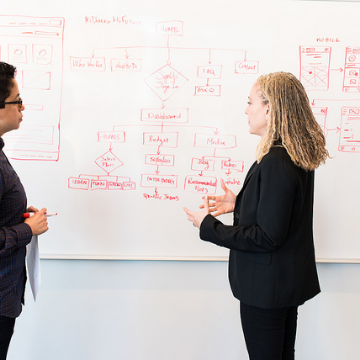

What You Need to Know Before Considering a PhD · fast.ai

What You Need to Know Before Considering a PhD · fast.ai

http://www.fast.ai/2018/08/27/grad-school/

What You Need to Know Before Considering a PhD Written: 27 Aug 2018 by Rachel Thomas My newest Ask-A-Data-Scientist post addresses the question of whether to pursue a PhD. You can find my previous Ask-A-Data-Scientist advice columns here . Question: I’m an undergrad student passionate about machine learning, and I feel a bit of pressure to get a PhD. Would it maybe make more sense to go into industry for a couple years and then consider going back to school? Any advice you have would be greatly appreciated.