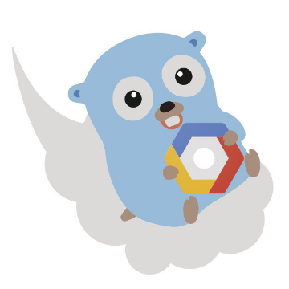

What a Go developer needs to know about Google Cloud Platform

What a Go developer needs to know about Google Cloud Platform

https://medium.com/@enocom/what-a-go-developer-needs-to-know-about-google-cloud-platform-e046c9e11abf

For running Go code on Google Cloud Platform (GCP), there are two great choices for portable code: Google Compute Engine (GCE), and Google…