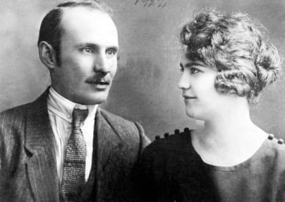

What does it mean to be genetically Jewish?

# What does it mean to be genetically Jewish?

[Family](https://www.theguardian.com/lifeandstyle/family)

DNA tests have been used in Israel to verify a person’s Jewishness. This brings a bigger question: what does it mean to be genetically Jewish? And can you prove religious identity scientifically?

[Oscar Schwartz](https://www.theguardian.com/profile/oscar-schwartz)
Thu 13 Jun 2019 06.00 BSTLast modified on Thu 13 Jun 2019 19.54 BST

- 
- 
- 

Shares

1,532

Gyula and Erzsebet Keimovits, the author’s great grandparents. His own parents took a DNA test to establish their genetic ancestry. Photograph: Oscar Schwartz

When my parents sent their saliva away to a genetic testing company late last year and were informed via email a few weeks later that they are both “100% Ashkenazi Jewish”, it struck me as slightly odd. Most people I know who have done DNA tests received ancestry results that correspond to geographical areas – Chinese, British, West African. Jewish, by comparison, is typically parsed as a religious or cultural identity. I wondered how this was traceable in my parents’ DNA.

After arriving in eastern Europe around a millennium ago, the company’s website explained, Jewish communities remained segregated, by force and by custom, mixing only occasionally with local populations. Isolation slowly narrowed the gene pool, which now gives modern Jews of European descent, like my family, a set of identifiable genetic variations that set them apart from other European populations at a microscopic level.

Advertisement

This genetic explanation of my Ashkenazi Jewish ancestry came as no surprise. According to family lore, my forebears lived in small towns and villages in eastern Europe for at least a few hundred years, where they kept their traditions and married within the community, up until the Holocaust, when they were either murdered or dispersed.

But still, there was something disconcerting about our Jewishness being “confirmed” by a biological test. After all, the reason my grandparents had to leave the towns and villages of their ancestors was because of ethno-nationalism emboldened by a racialized conception of Jewishness as something that exists “in the blood”.

The raw memory of this racism made any suggestion of Jewish ethnicity slightly taboo in my family. If I ever mentioned that someone “looked Jewish” my grandmother would respond, “Oh really? And what exactly does a Jew look like?” Yet evidently, this wariness of ethnic categorization didn’t stop my parents from sending swab samples from the inside of their cheeks off to a direct-to-consumer genetic testing company. The idea of having an ancient identity “confirmed” by modern science was too alluring.

Not that they’re alone. As of the beginning of this year, more than 26 million people have [taken](https://www.technologyreview.com/s/612880/more-than-26-million-people-have-taken-an-at-home-ancestry-test/) at-home DNA tests. For most, like my parents, genetic identity is assimilated into an existing life story with relative ease, while for others, the test can unearth family secrets or capsize personal narratives around ethnic heritage.

Advertisement

But as these genetic databases grow, genetic identity is reshaping not only how we understand ourselves, but how we can be identified by others. In the past year, law enforcement has become increasingly adept at [using](https://www.theguardian.com/science/2018/dec/01/how-home-dna-tests-are-solving-cold-cases-golden-state-killer) genetic data to solve cold cases; a recent study shows that even if you haven’t taken a test, chances are you can be identified by authorities via genealogical sleuthing.

What is perhaps more concerning, though, is how authorities around the world are also beginning to use DNA to not only identify individuals, but to categorize and discriminate against entire groups of people.

.

 .

**In February of this year,** the Israeli newspaper Haaretz, [reported](https://www.haaretz.com/israel-news/.premium-israeli-rabbinate-accused-of-using-dna-testing-to-prove-jewishness-1.6902132) that the Chief Rabbinate of Israel, the peak religious authority in the country, had been requesting DNA tests to confirm Jewishness before issuing some marriage licenses.

In Israel, matrimonial law is religious, not civil. Jews can marry Jews, but intermarriage with Muslims or Christians is legally unacknowledged. This means that when a Jewish couple want to tie the knot, they are required by law to prove their Jewishness to the Rabbinate according to Orthodox tradition, which defines Jewish ancestry as being passed down through the mother.

While for most Israeli Jews this simply involves handing over their mother’s birth or marriage certificate, for many recent immigrants to Israel, who often come from communities where being Jewish is defined differently or documentation is scarce, producing evidence that satisfies the Rabbinate’s standard of proof can be impossible.

In the past, confirming Jewishness in the absence of documentation has involved contacting rabbis from the countries where people originate or tracking genealogical records back to prove religious continuity along the matrilineal line. But as was reported in Haaretz, and later [confirmed](https://www.jpost.com/Israel-News/Chief-Rabbinate-admits-using-DNA-tests-for-Jewish-status-determination-582605) by David Lau, the Ashkenazi chief rabbi of Israel, in the past year, the rabbis have been requesting that some people undergo a DNA test to verify their claim before being allowed to marry.

For many Israelis, news that the rabbinical judges were turning to DNA testing was shocking, but for Seth Farber, an American-born Orthodox rabbi, it came as no surprise. Farber, who has been living in Israel since the 1990s, is the director of Itim, the Jewish Life Information Center, an organization that [helps](https://www.theguardian.com/world/2017/sep/16/rabbis-block-marriages-israeljewish-identity-human-rights) Israeli Jews navigate state-administered matters of Jewish life, like marriage and conversion. In the past year, the organization has seen up to 50 cases where families have been asked to undergo DNA tests to certify their Jewishness.

Those being asked to take these tests, Farber told me, are mostly Russian-speaking Israelis, members of an almost 1 million-strong immigrant community who began moving to Israel from countries of the former Soviet Union in the 1990s. Due to the fact that Jewish life was forcefully suppressed during the Soviet era, many members of this community lack the necessary documentation to prove Jewishness through matrilineal descent. This means that although most self-identify as Jewish, [hundreds of thousands](https://www.jpost.com/Israel-News/Israelis-to-protest-Rabbinates-usage-of-DNA-to-determine-Jewish-status-583152) are not considered so by the Rabbinate, and routinely have their Jewish status challenged when seeking religious services, including marriage.

.

 .
Advertisement

**For almost two decades,** Farber and his colleagues have advocated for this immigrant community in the face of what they see as targeted discrimination. In cases of marriage, Farber acts as a type of rabbinical lawyer, pulling together documentation and making a case for his clients in front of a board of rabbinical judges. He fears that DNA testing will place even more power in the hands of the Rabbinate and further marginalize the Russian-speaking community. “It’s as if the rabbis have become technocrats,” he told me. “They are using genetics to give validity to their discriminatory practices.”

Despite public outrage and [protests](https://www.jpost.com/Israel-News/Israelis-to-protest-Rabbinates-usage-of-DNA-to-determine-Jewish-status-583152) in central Tel Aviv, the Rabbinate have not indicated any intention of ending DNA testing, and reports continue to circulate in the Israeli media of how the test is being used. One woman allegedly had to [ask](https://www.ynetnews.com/articles/0,7340,L-5476939,00.html) her mother and aunt for genetic material to prove that she was not adopted. Another man was asked to have his grandmother, sick with dementia, [take](https://religionnews.com/2019/03/14/israeli-rabbinate-under-fire-for-pushing-for-dna-tests/) a test.

[  Facebook](https://www.facebook.com/dialog/share?app_id=180444840287&href=https%3A%2F%2Fwww.theguardian.com%2Flifeandstyle%2F2019%2Fjun%2F12%2Fwhat-does-it-mean-to-be-genetically-jewish%3FCMP%3Dshare_btn_fb%26page%3Dwith%3Aimg-2%23img-2&picture=https%3A%2F%2Fmedia.guim.co.uk%2F23c0f169bba6dd0061193667d3d70e51c007b412%2F0_190_4032_2735%2F4032.jpg)[  Twitter](https://twitter.com/intent/tweet?text=What%20does%20it%20mean%20to%20be%20genetically%20Jewish%3F&url=https%3A%2F%2Fwww.theguardian.com%2Flifeandstyle%2F2019%2Fjun%2F12%2Fwhat-does-it-mean-to-be-genetically-jewish%3FCMP%3Dshare_btn_tw%26page%3Dwith%3Aimg-2%23img-2)[  Pinterest](http://www.pinterest.com/pin/create/button/?description=What%20does%20it%20mean%20to%20be%20genetically%20Jewish%3F&url=https%3A%2F%2Fwww.theguardian.com%2Flifeandstyle%2F2019%2Fjun%2F12%2Fwhat-does-it-mean-to-be-genetically-jewish%3Fpage%3Dwith%3Aimg-2%23img-2&media=https%3A%2F%2Fmedia.guim.co.uk%2F23c0f169bba6dd0061193667d3d70e51c007b412%2F0_190_4032_2735%2F4032.jpg)

   A protest against DNA testing in Tel Aviv. Photograph: Boris Shindler

Boris Shindler, a political activist and active member of the Russian-speaking community, told me that he believes that the full extent of the practice remains unknown, because many of those who have been tested are unwilling to share their stories publicly out of a sense of shame. “I was approached by someone who was married in a Jewish ceremony maybe 15, 20 years ago, who recently received an official demand saying if you want to continue to be Jewish, we’d like you to do a DNA test,” Shindler said. “They said if she doesn’t do it then she has to sign papers saying she is not Jewish. But she is too humiliated to go to the press with this.”

What offends Shindler most is that the technique is being used to single out his community, which he sees as part of a broader stigmatization of Russian-speaking immigrants in Israeli society as unassimilated outsiders and second-class citizens. “It is sad because in the Soviet Union we were persecuted for being Jewish and now in Israel we’re being discriminated against for not being Jewish enough,” he said.

As well as being deeply humiliating, Shindler told me that there is confusion around what being genetically Jewish means. “How do they decide when someone becomes Jewish,” he asked. “If I have 51% Jewish DNA does that mean I’m Jewish, but if I’m 49% I’m not?”

.

 .

**But according to** Yosef Carmel, an Orthodox rabbi and co-head of Eretz Hemdah, a Jerusalem-based institute that trains rabbinical judges for the Rabbinate, this is a misunderstanding of how the DNA testing is being used. He explained that the Rabbinate are not using a generalized Jewish ancestry test, but one that screens for a specific variant on the mitochondrial DNA – DNA that is passed down through the mother – that can be found almost exclusively in Ashkenazi Jews.

Advertisement

A number of years ago Carmel consulted genetic experts who informed him that if someone bears this specific mitochondrial DNA marker, there is a 90 to 99% chance that this person is of Ashkenazi ancestry. This was enough to convince him to pass a religious ruling in 2017 that states that this specific DNA test can be used to confirm Jewishness if all other avenues have been exhausted, which now constitutes the theological justification for the genetic testing.

For David Goldstein, professor of medical research in genetics at Columbia University whose 2008 book, Jacob’s Legacy: A Genetic View of Jewish History,*  *outlines a decade’s worth of research into Jewish population genetics, translating scientific insights about small genetic variants in the DNA to normative judgments about religious or ethnic identity is not only problematic, but misunderstands what the science actually signals.

“When we say that there is a signal of Jewish ancestry, it’s a highly specific statistical analysis done over a population,” he said. “To think that you can use these type of analyses to make any substantive claims about politics or religion or questions of identity, I think that it’s frankly ridiculous.”

But others would disagree. As DNA sequencing becomes more sophisticated, the ability to identify genetic differences between human populations has improved. Geneticists can now locate variations in the DNA so acutely as to [differentiate](https://www.ncbi.nlm.nih.gov/pmc/articles/PMC4570283/) populations living on opposite sides of a mountain range.

In recent years, a number of high-profile commentators have appropriated these scientific insights to push the idea that genetics can determine who we are socially, none more controversially than the former New York Times science writer Nicholas Wade. In his 2014 book, A Troublesome Inheritance: Genes, Race and Human History, Wade argues that genetic differences in human populations manifest in predictable social differences between those groups.

His book was strongly [denounced](http://cehg.stanford.edu/letter-from-population-geneticists) by almost all prominent researchers in the field as a shoddy incarnation of race science, but the idea that our DNA can determine who we are in some social sense has also crept into more mainstream perspectives.

In an op-ed published in the New York Times last year, the Harvard geneticist David Reich [argued](https://www.theguardian.com/science/blog/2018/may/02/why-genetic-iq-differences-between-races-are-unlikely) that although genetics does not substantiate any racist *stereotypes*, differences in genetic ancestry do correlate to many of today’s racial constructs. “I have deep sympathy for the concern that genetic discoveries could be misused to justify racism,” he wrote. “But as a geneticist I also know that it is simply no longer possible to ignore average genetic differences among ‘races’.”

Reich’s op-ed was shared widely and drew condemnation from other geneticists and social science researchers.

Advertisement

In an open letter to Buzzfeed, a group of 67 experts also criticized Reich’s careless communication of his ideas. The signatories [worried](https://www.buzzfeednews.com/article/bfopinion/race-genetics-david-reich) that imprecise language within such a fraught field of research would make the insights of population genetics more susceptible to being “misunderstood and misinterpreted”, lending scientific validity to racist ideology and ethno-nationalist politics.

And indeed, this already appears to be happening. In the United States, white nationalists have [channeled](https://www.stormfront.org/forum/t135930/) the ideals of racial purity into an obsession with the reliability of direct-to-consumer DNA testing. In Greece, the neo-fascist Golden Dawn party regularly draw on [studies](https://www.nature.com/articles/nature23310.epdf?author_access_token=E4JxhmOKVE0Zk7xCXmpm99RgN0jAjWel9jnR3ZoTv0OwLzzqUmCLV4d2G6bjGa7kiPBb7TTVpAsutKGfIQRMrq8WVAMpP-SfGerriklOb5-JK4PQu2o4hKeBf7fel4E9) on the origins of Greek DNA to “[prove](https://www.lrb.co.uk/blog/2017/august/who-are-you-calling-mycenaean)” 4,000 years of racial continuity and ethnic supremacy.

Most concerning is how the conflation of genetics and racial identity is being mobilized politically. In Australia, the far-right One Nation party recently [suggested](https://www.theguardian.com/commentisfree/2019/mar/16/mark-latham-got-what-he-wanted-out-of-his-absurd-proposal-to-dna-test-aboriginal-people) that First Nations people be given DNA tests to “prove” how Indigenous they are before receiving government benefits. In February, the New York Times reported that authorities in China are using DNA testing to [determine](https://www.theguardian.com/news/2019/apr/11/china-hi-tech-war-on-muslim-minority-xinjiang-uighurs-surveillance-face-recognition) whether someone is of Uighur ancestry, as part of a broader campaign of surveillance and oppression against the Muslim minority.

.

 .

**While DNA testing** in Israel is still limited to proving Jewishness in relation to religious life, it comes at a time when the intersections of ethnic, political and religious identity are becoming increasingly blurry. Just last year, Benjamin Netanyahu’s government passed the Nation State law, which [codified](https://www.theguardian.com/world/2018/jul/19/israel-adopts-controversial-jewish-nation-state-law) that the right to national self-determination in the country is “unique to the Jewish people”.

Shlomo Sand, an Israeli historian who has [written](https://www.haaretz.com/israel-news/the-twisted-logic-of-the-jewish-historic-right-to-israel-1.6654428) extensively on the politics of Jewish population genetics, worries that if DNA testing is normalized by the Rabbinate, it could be used to confirm citizenship in the future. “Israeli society is becoming more of a closed, ethno-centric society,” he said. “I am worried that people will start to use this genetic testing to build this political national identity.”

For Sand, there is a particularly dark irony that this type of genetic discrimination is being weaponized by Jews against other Jews. “I am the descendant of Holocaust survivors, people who suffered because of biological and essentialist attitudes to human groups,” he told me. “When I hear stories of people using DNA to prove that you are a Jew, or French, or Greek, or Finnish, I feel like the Nazis lost the war, but they won the victory of an ideology of essentialist identity through the blood.”

But for Seth Farber, the problem with a DNA test for Jewishness runs deeper than politics; it contravenes what he believes to be the essence of Jewish identity. There is a specific principle in Jewish law, he told me, that instructs rabbis not to undermine someone’s self-declared religious identity if that person has been accepted by a Jewish community. The central principle is that when it comes to Jewish identity, the most important determinants are social – trust, kinship, commitment – not biological. “Our tradition has always been that if someone lives among us and partakes in communal and religious life, then they are one of us,” Farber said. “Just because we have 23andMe doesn’t mean that we should abandon this. That would be an unwarranted and radical reinterpretation of Jewish law.”

.

 .
Advertisement

**As I was reporting** this story, it often struck me as oxymoronic that an institution like the Rabbinate would embrace new technology to uphold an ancient identity. It seemed to contradict the very premise of Orthodoxy, which, by definition, is supposed to rigidly maintain tradition in the face of all that is new and unknown.

But Jessica Mozersky, assistant professor of medicine at Washington University in St Louis, explained that part of the reason why the Rabbinate might be comfortable with using DNA to confirm Jewishness is because of an existing familiarity with genetic testing in the community to screen for rare genetic conditions. “Because Ashkenazi communities have a history of marrying in, they have this high risk for certain heritable diseases and have established genetic screening programs,” she explained. “So this has made it less fraught and problematic to talk about Jewish genetics in Ashkenazi communities.”

In fact, the Orthodox Jewish community is so comfortable with the idea of genetic identity that they have even put together their own international genetic database called [Dor Yeshorim](http://doryeshorim.org/), which acts as both a dating service and public health initiative. When two members of the community are being set up for marriage, Mozersky explained, the matchmaker will check whether or not they are genetically compatible on the DNA database. “This means that the notion of genetics as a part of identity is deeply interwoven in many ways with communal life,” she said.

This is something I could identify with. When I was 16 and attending a Jewish day-school in Melbourne, Australia, we had what was called “mouth-swab day”. Everyone in my grade gathered on the basketball courts to provide spit samples that were sent off and screened for Tay-Sachs disease, a rare inherited disorder significantly more common among Ashkenazi Jews that eats away at the nerve cells in the brain and spinal cord. As we waited in line, we joked that this was our punishment for our ancestors marrying their cousins.

A few weeks later, after we got the results, I told my grandmother about “mouth-swab day”. I was interested in her thoughts on my newly discovered genetic identity, which seemed to connect me biologically to the world she grew up in, a world of insularity, religiosity, tradition, and trauma.

“It’s like I’ve always said,” she declared, after I told her that I wasn’t a carrier of this rare genetic mutation. “It’s important to mix the blood.”

Topics

- [Family/](https://www.theguardian.com/lifeandstyle/family)
- [DNA database/](https://www.theguardian.com/politics/dna-database)
- [Parents and parenting/](https://www.theguardian.com/lifeandstyle/parents-and-parenting)
- [features/](https://www.theguardian.com/tone/features)
- 
- 
- 
- [Share on LinkedIn](http://www.linkedin.com/shareArticle?mini=true&title=What%20does%20it%20mean%20to%20be%20genetically%20Jewish%3F&url=https%3A%2F%2Fwww.theguardian.com%2Flifeandstyle%2F2019%2Fjun%2F12%2Fwhat-does-it-mean-to-be-genetically-jewish)
- [Share on Pinterest](http://www.pinterest.com/pin/find/?url=https%3A%2F%2Fwww.theguardian.com%2Flifeandstyle%2F2019%2Fjun%2F12%2Fwhat-does-it-mean-to-be-genetically-jewish)
- [Reuse this content](https://syndication.theguardian.com/automation/?url=https%3A%2F%2Fwww.theguardian.com%2Flifeandstyle%2F2019%2Fjun%2F12%2Fwhat-does-it-mean-to-be-genetically-jewish&type=article&internalpagecode=6230242)