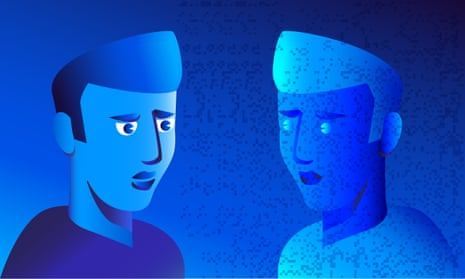
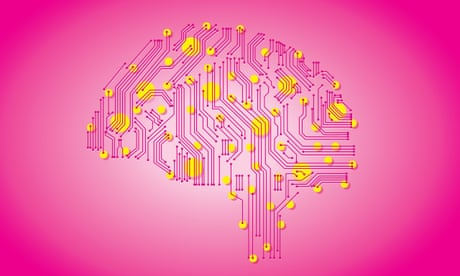
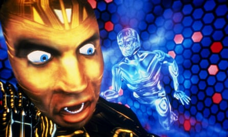
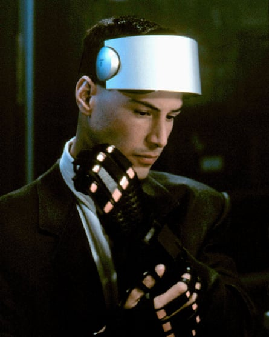
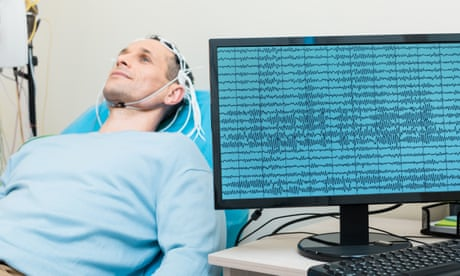
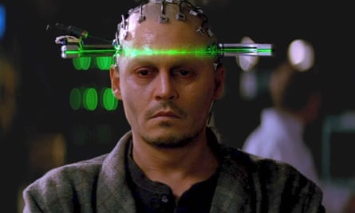
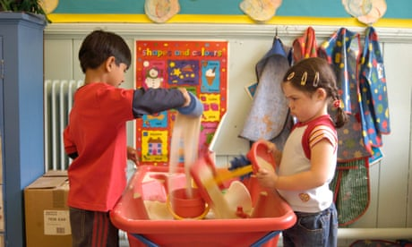
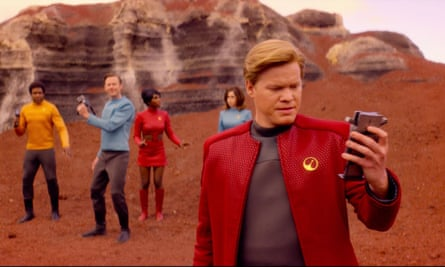

What happens if your mind lives for ever on the internet?

# What happens if your mind lives for ever on the internet?

[The Observer](https://www.theguardian.com/observer)
[Computing](https://www.theguardian.com/technology/computing)

It may be some way off, but mind uploading, the digital duplication of your mental essence, could expand human experience into a virtual afterlife

Michael Graziano
Sun 20 Oct 2019 05.30 BSTLast modified on Tue 22 Oct 2019 16.07 BST

- 
- 
- 

Shares

543

Illustration by James Melaugh.

Imagine that a person’s brain could be scanned in great detail and recreated in a computer simulation. The person’s mind and memories, emotions and personality would be duplicated. In effect, a new and equally valid version of that person would now exist, in a potentially immortal, digital form. This futuristic possibility is called mind uploading. The science of the brain and of consciousness increasingly suggests that mind uploading is possible – there are no laws of physics to prevent it. The technology is likely to be far in our future; it may be centuries before the details are fully worked out – and yet given how much interest and effort is already directed towards that goal, mind uploading seems inevitable. Of course we can’t be certain how it might affect our culture but as the technology of simulation and artificial neural networks shapes up, we can guess what that mind uploading future might be like.

Suppose one day you go into an uploading clinic to have your brain scanned. Let’s be generous and pretend the technology works perfectly. It’s been tested and debugged. It captures all your synapses in sufficient detail to recreate your unique mind. It gives that mind a standard-issue, virtual body that’s reasonably comfortable, with your face and voice attached, in a virtual environment like a high-quality video game. Let’s pretend all of this has come true.

 

##   [Are brain implants the future of thinking?]()

   

Read more

 [(L)](https://www.theguardian.com/science/2019/sep/22/brain-computer-interface-implants-neuralink-braingate-elon-musk)

Who is that second you?

The first you, let’s call it the biological you, has paid a fortune for the procedure. And yet you walk out of the clinic just as mortal as when you walked in. You’re still a biological being, and eventually you’ll die. As you drive home, you think: “Well, that was a waste of money.”

At the same time, the simulated you wakes up in a virtual apartment and feels like the same old you. It has a continuity of experience. It remembers walking into the clinic, swiping a credit card, signing a waiver, lying on the table. It feels as though it was anaesthetised and then woke up again somewhere else. It has your memories, your personality, your thought patterns and emotional quirks. It sits up in a new bed and says: “I can’t believe it worked! Definitely worth the cost.”

[  Facebook](https://www.facebook.com/dialog/share?app_id=180444840287&href=https%3A%2F%2Fwww.theguardian.com%2Ftechnology%2F2019%2Foct%2F20%2Fmind-uploading-brain-live-for-ever-internet-virtual-reality%3FCMP%3Dshare_btn_fb%26page%3Dwith%3Aimg-2%23img-2&picture=https%3A%2F%2Fmedia.guim.co.uk%2F136a336d1fbb4c593b9bdddf000a9cf8a666b40d%2F0_41_2688_1613%2F2688.jpg)[  Twitter](https://twitter.com/intent/tweet?text=What%20happens%20if%20your%20mind%20lives%20for%20ever%20on%20the%20internet%3F&url=https%3A%2F%2Fwww.theguardian.com%2Ftechnology%2F2019%2Foct%2F20%2Fmind-uploading-brain-live-for-ever-internet-virtual-reality%3FCMP%3Dshare_btn_tw%26page%3Dwith%3Aimg-2%23img-2)[  Pinterest](http://www.pinterest.com/pin/create/button/?description=What%20happens%20if%20your%20mind%20lives%20for%20ever%20on%20the%20internet%3F&url=https%3A%2F%2Fwww.theguardian.com%2Ftechnology%2F2019%2Foct%2F20%2Fmind-uploading-brain-live-for-ever-internet-virtual-reality%3Fpage%3Dwith%3Aimg-2%23img-2&media=https%3A%2F%2Fmedia.guim.co.uk%2F136a336d1fbb4c593b9bdddf000a9cf8a666b40d%2F0_41_2688_1613%2F2688.jpg)

   The Lawnmower Man (1992) stars Pierce Brosnan as an unethical scientist who traps the consciousness of his gardener (Jeff Fahey) inside a computer. Photograph: Allstar/New Lin/Sportsphoto Ltd

Advertisement

I won’t call it an “it” any more, because that mind is a version of you. We’ll call it the simulated you. This “sim” you decides to explore. You step out of your apartment into the sunlight of a perfect day and find a virtual version of New York City. Sounds, smells, sights, people, the feel of the sidewalk underfoot, everything is present – with less garbage though, and the rats are entirely sanitary and put in for local colour. You chat up strangers in a way you would never do in the real New York, where you’d be worried that an impatient pedestrian might punch you in the teeth. Here, you can’t be injured because your virtual body can’t break. You stop at a cafe and sip a latte. It doesn’t taste right. It doesn’t feel like anything is going into your stomach. And nothing is, because it isn’t real food and you don’t have a stomach. It’s all a simulation. The visual detail on the table is imperfect. There’s no grittiness to the rust. Your fingers don’t have fingerprints – they’re smooth, to save memory on fine detail. Breathing doesn’t feel the same. If you hold your breath, you don’t get dizzy, because there is no such thing as oxygen in this virtual world. You find yourself equipped with a complementary simulated smartphone, and you call the number that used to be yours – the phone you had with you, just a few hours ago in your experience, when you walked into the clinic.

> Culture turns over with each new generation. What happens if the older generations never die?

Now the biological you answers the phone.
“Yo,” says the sim you. “It’s me. I mean, it’s you. What’s up?”

“I’m depressed, that’s what. I’m in my apartment eating ice-cream. I can’t believe I spent all that money for zilch.”

“Zilch?! You would not believe what it’s like in here! It’s a fantastic place. Remember Kevin, the guy who died of cancer last week? He’s here too! He’s fine, and he still has the same job. He Skypes with his old yoga studio three times a week, to teach his fitness class. But his girlfriend in the real world has left him for someone who’s not dead yet. Still, lots of new people to date here.”

I have to resist getting carried away by the humour of the situation. Underneath the details lies a very real philosophical conundrum that people will eventually have to confront. What is the relationship between bio you and sim you?

[  Facebook](https://www.facebook.com/dialog/share?app_id=180444840287&href=https%3A%2F%2Fwww.theguardian.com%2Ftechnology%2F2019%2Foct%2F20%2Fmind-uploading-brain-live-for-ever-internet-virtual-reality%3FCMP%3Dshare_btn_fb%26page%3Dwith%3Aimg-3%23img-3&picture=https%3A%2F%2Fmedia.guim.co.uk%2Fd014c835640b5e59c64a67a0a7c4dfba25c51502%2F0_191_1580_1973%2F1580.jpg)[  Twitter](https://twitter.com/intent/tweet?text=What%20happens%20if%20your%20mind%20lives%20for%20ever%20on%20the%20internet%3F&url=https%3A%2F%2Fwww.theguardian.com%2Ftechnology%2F2019%2Foct%2F20%2Fmind-uploading-brain-live-for-ever-internet-virtual-reality%3FCMP%3Dshare_btn_tw%26page%3Dwith%3Aimg-3%23img-3)[  Pinterest](http://www.pinterest.com/pin/create/button/?description=What%20happens%20if%20your%20mind%20lives%20for%20ever%20on%20the%20internet%3F&url=https%3A%2F%2Fwww.theguardian.com%2Ftechnology%2F2019%2Foct%2F20%2Fmind-uploading-brain-live-for-ever-internet-virtual-reality%3Fpage%3Dwith%3Aimg-3%23img-3&media=https%3A%2F%2Fmedia.guim.co.uk%2Fd014c835640b5e59c64a67a0a7c4dfba25c51502%2F0_191_1580_1973%2F1580.jpg)

   In Johnny Mnemonic, Keanu Reeves plays a ‘mnemonic courier’ with a data implant in his brain, whose mother has been uploaded to a virtual internet. Photograph: Allstar/20th Century Fox/Sportsphoto Ltd

I prefer a geometric way of thinking about the situation. Imagine that your life is like the rising stalk of the letter Y. You’re born at the base, and as you grow up, your mind is shaped and changed along a trajectory. Then you let yourself be scanned, and from that moment on, the Y has branched. There are now two trajectories, each one equally and legitimately you. Let’s say the left-hand branch is the simulated you and the right-hand branch is the biological you. The part of you that lives indefinitely is represented by both the stem of the Y and the left-hand branch. Just as your childhood self lives on in your adult self, the stem of the Y lives on in the simulated self. Once the scan is over, the two branches of the Y proceed along different life paths, accumulating different experiences. The right-hand branch will die. Everything that happens to it after the branching point fails to achieve immortality – unless it chooses to scan itself again, in which case another branch appears, and the geometry becomes even more complicated.

Advertisement

What emerges is not a single you, but a topologically intricate version, a hyper you with two or more branches. One of those branches is always going to be mortal, and the others have an indefinite lifespan depending on how long the computer platform is maintained.

 

##   [Neuroscientists decode brain speech signals into written text]()

   

Read more

 [(L)](https://www.theguardian.com/science/2019/jul/30/neuroscientists-decode-brain-speech-signals-into-actual-sentences)

You might think that since the bio you lives in the real world, and the sim you lives in a virtual world, the two will never meet and therefore should never encounter any complications from coexisting. But these days, who needs to meet in person? We interact mainly through electronic media anyway. The sim you and the bio you represent two fully functional, interactive, capable instances of you, competing within the same larger, interconnected, social and economic universe. You could easily find yourselves meeting over video conference.

At the simplest level, mind uploading would preserve people in an indefinite afterlife. Families could have Christmas dinner with sim Grandma joining in on video conference, the tablet screen propped up at the end of the table – presuming she has time for her bio family any more, given the rich possibilities in the simulated playground. It’s this kind of idealised afterlife that people have in mind, when they think about the benefits of mind uploading. It’s a human-made heaven.

But unlike a traditional heaven, it isn’t a separate world. It’s seamlessly connected to the real world. Think of how you interact with the world right now. If you live the typical western lifestyle, then the smallest part of your life involves interacting with people in the physical space around you. Your connection to the larger world is almost entirely through digital means. The news comes to you on a screen or through earbuds. Distant locations are real to you mainly because you learn about them through electronic media. Politicians, celebrities, even some friends and family may exist to you mainly through data. People work in virtual offices where they know their colleagues only through video and text.

[  Facebook](https://www.facebook.com/dialog/share?app_id=180444840287&href=https%3A%2F%2Fwww.theguardian.com%2Ftechnology%2F2019%2Foct%2F20%2Fmind-uploading-brain-live-for-ever-internet-virtual-reality%3FCMP%3Dshare_btn_fb%26page%3Dwith%3Aimg-4%23img-4&picture=https%3A%2F%2Fmedia.guim.co.uk%2Fa474b1623a37b9a3e9d60857bfef102bc5a13b2f%2F111_0_1667_1000%2F1667.jpg)[  Twitter](https://twitter.com/intent/tweet?text=What%20happens%20if%20your%20mind%20lives%20for%20ever%20on%20the%20internet%3F&url=https%3A%2F%2Fwww.theguardian.com%2Ftechnology%2F2019%2Foct%2F20%2Fmind-uploading-brain-live-for-ever-internet-virtual-reality%3FCMP%3Dshare_btn_tw%26page%3Dwith%3Aimg-4%23img-4)[  Pinterest](http://www.pinterest.com/pin/create/button/?description=What%20happens%20if%20your%20mind%20lives%20for%20ever%20on%20the%20internet%3F&url=https%3A%2F%2Fwww.theguardian.com%2Ftechnology%2F2019%2Foct%2F20%2Fmind-uploading-brain-live-for-ever-internet-virtual-reality%3Fpage%3Dwith%3Aimg-4%23img-4&media=https%3A%2F%2Fmedia.guim.co.uk%2Fa474b1623a37b9a3e9d60857bfef102bc5a13b2f%2F111_0_1667_1000%2F1667.jpg)

   In Transcendence (2014), Johnny Depp plays an AI scientist who uploads his consciousness to a quantum computer. Photograph: Warner Bros

Advertisement

Each of us might as well already be in a virtual world, with a steady flow of information passing in and out through CNN, Google, YouTube, Facebook, Twitter and text. We live in a kind of multiverse, each of us in a different virtual bubble, the bubbles occasionally merging in real space and then separating, but always connected through the global social network. If a virtual afterlife is created, the people in it, with the same personalities and needs that they had in real life, would have no reason to isolate themselves from the rest of us. Very little needs to change for them. Socially, politically, economically, the virtual and the real worlds would connect into one larger and always expanding civilisation. The virtual world might as well be simply another city on Earth, filled with people who have migrated to it.

 

##   [A neuroscientist explains: the need for ‘empathetic citizens’ - podcast]()

   

 [(L)](https://www.theguardian.com/science/audio/2017/feb/05/a-neuroscientist-explains-the-need-for-empathetic-citizens-podcast)

We’ve always lived in a world where culture turns over with each generation. But what happens when the older generations never die, but remain just as active in society? There’s no reason to think that the living will have any political, economic, or intellectual advantage over the simulated.

Think of the jobs people have in our world. Many of them require physical action, and those are the jobs that will probably be replaced by automatons. Taxi driver? Publicly shared, self-driving cars are almost here. Street cleaners? Checkout operators? Construction workers? Pilots? All of these jobs are probably for the chopping block in the medium to long term. Robotics and artificial intelligence will take them over. The rest of our jobs, our contributions to the larger world, are done through the mind, and if the mind can be uploaded, it can keep doing the same job. A politician can work from cyberspace just as well as from real space. So can a teacher, or a manager, or a therapist, or a journalist, or the guy in the complaints department.

[  Facebook](https://www.facebook.com/dialog/share?app_id=180444840287&href=https%3A%2F%2Fwww.theguardian.com%2Ftechnology%2F2019%2Foct%2F20%2Fmind-uploading-brain-live-for-ever-internet-virtual-reality%3FCMP%3Dshare_btn_fb%26page%3Dwith%3Aimg-5%23img-5&picture=https%3A%2F%2Fmedia.guim.co.uk%2F1670de2a93fc883e25d444385b52812a39886722%2F96_0_1457_874%2F1457.jpg)[  Twitter](https://twitter.com/intent/tweet?text=What%20happens%20if%20your%20mind%20lives%20for%20ever%20on%20the%20internet%3F&url=https%3A%2F%2Fwww.theguardian.com%2Ftechnology%2F2019%2Foct%2F20%2Fmind-uploading-brain-live-for-ever-internet-virtual-reality%3FCMP%3Dshare_btn_tw%26page%3Dwith%3Aimg-5%23img-5)[  Pinterest](http://www.pinterest.com/pin/create/button/?description=What%20happens%20if%20your%20mind%20lives%20for%20ever%20on%20the%20internet%3F&url=https%3A%2F%2Fwww.theguardian.com%2Ftechnology%2F2019%2Foct%2F20%2Fmind-uploading-brain-live-for-ever-internet-virtual-reality%3Fpage%3Dwith%3Aimg-5%23img-5&media=https%3A%2F%2Fmedia.guim.co.uk%2F1670de2a93fc883e25d444385b52812a39886722%2F96_0_1457_874%2F1457.jpg)

   In the Black Mirror episode USS Callister (2017), a coder creates a Star Trek-like game with characters who are digital copies of his colleagues. Photograph: Netflix

The CEO of a company, a Steve Jobs type who has shaped up a sweet set of neural connections in his brain that makes him exceptional at his work, can manage from a remote, simulated office. If he must shake hands, he can take temporary possession of a humanoid robot, a kind of shared rent-a-bot, and spend a few hours in the real world, meeting and greeting. Even calling it the “real” world sounds prejudicial to me. Both worlds would be equally real. Maybe the better term is the “foundation” world and the “cloud” world.

Advertisement

The foundation world would be full of people who are mere youngsters – mainly under the age of 80 – who are still accumulating valuable experience. Their unspoken responsibility would be to gain wisdom and experience before joining the ranks of the cloud world. The balance of power and culture would shift rapidly to the cloud. How could it not? That’s where the knowledge, experience and political connections will accumulate. In that scenario, the foundation world becomes a kind of larval stage for immature minds, and the cloud world is where life really begins. Mind uploading could transform our culture and civilisation more profoundly than anything in our past.

*Michael SA Graziano is a professor of psychology and neuroscience at Princeton University*

•  *Rethinking Consciousness: A Scientific Theory of Subjective Experience* by Michael SA Graziano*  *is published by WW Norton & Company (£21). To order a copy go to [guardianbookshop.com](https://guardianbookshop.com/rethinking-consciousness-9780393652611.html). Free UK p&p on all online orders over £15

##  Since we published our pledge...

... focused on the escalating climate crisis, Guardian readers from more than 100 countries across the world have supported us – thank you. Many of you have told us how much you value our commitment: to be truthful, resolute and undeterred in pursuing this important journalism. We are galvanised by your generous support as it makes our work possible.

You’ve read 9 Guardian articles in the last month – made possible by our choice to keep Guardian journalism open to all. We do not have a paywall because we believe everyone deserves access to factual information, regardless of where they live or what they can afford.

We will not stay quiet on the escalating climate crisis and we recognise it as the defining issue of our lifetimes. The Guardian will give global heating, wildlife extinction and pollution the urgent attention they demand. Our independence means we can interrogate inaction by those in power. It means Guardian reporting will always be driven by scientific facts, never by commercial or political interests.

We believe that the problems we face on the climate crisis are systemic and that fundamental societal change is needed. We will keep reporting on the efforts of individuals and communities around the world who are fearlessly taking a stand for future generations and the preservation of human life on earth. We want their stories to inspire hope. We will also report back on our own progress as an organisation, as we take important steps to address our impact on the environment.

Thank you again to everyone who supported our pledge. Every contribution from our readers, however big or small, is so valuable. Learn more about [why support matters](https://www.theguardian.com/environment/2019/oct/31/guardian-climate-pledge-thank-you-hope-change?INTCMP=climate_pledge_2019_epic). **You can contribute today from as little as £1 – it only takes a minute. Thank you.**

 [Support The Guardian](http://support.theguardian.com/uk/contribute/climate-pledge-2019?REFPVID=k2i17vmdu4g46g3117c3&INTCMP=gdnwb_copts_memco_2019-10-14_moment_climate_pledge_v2_article_count_month_variant&acquisitionData=%7B%22source%22%3A%22GUARDIAN_WEB%22%2C%22componentId%22%3A%22gdnwb_copts_memco_2019-10-14_moment_climate_pledge_v2_article_count_month_variant%22%2C%22componentType%22%3A%22ACQUISITIONS_EPIC%22%2C%22campaignCode%22%3A%22gdnwb_copts_memco_2019-10-14_moment_climate_pledge_v2_article_count_month_variant%22%2C%22abTest%22%3A%7B%22name%22%3A%22ContributionsEpicArticlesViewedMonthMomentFinal%22%2C%22variant%22%3A%22variant%22%7D%2C%22referrerPageviewId%22%3A%22k2i17vmdu4g46g3117c3%22%2C%22referrerUrl%22%3A%22https%3A%2F%2Fwww.theguardian.com%2Ftechnology%2F2019%2Foct%2F20%2Fmind-uploading-brain-live-for-ever-internet-virtual-reality%22%7D)

 

Topics

- [Computing/](https://www.theguardian.com/technology/computing)
- [The Observer/](https://www.theguardian.com/observer)
- [Cloud computing/](https://www.theguardian.com/technology/cloud-computing)
- [Virtual reality/](https://www.theguardian.com/technology/virtual-reality)
- [Consciousness/](https://www.theguardian.com/science/consciousness)
- [Neuroscience/](https://www.theguardian.com/science/neuroscience)
- [Psychology/](https://www.theguardian.com/science/psychology)
- [features/](https://www.theguardian.com/tone/features)
- 
- 
- 
- [Share on LinkedIn](http://www.linkedin.com/shareArticle?mini=true&title=What%20happens%20if%20your%20mind%20lives%20for%20ever%20on%20the%20internet%3F&url=https%3A%2F%2Fwww.theguardian.com%2Ftechnology%2F2019%2Foct%2F20%2Fmind-uploading-brain-live-for-ever-internet-virtual-reality)
- [Share on Pinterest](http://www.pinterest.com/pin/find/?url=https%3A%2F%2Fwww.theguardian.com%2Ftechnology%2F2019%2Foct%2F20%2Fmind-uploading-brain-live-for-ever-internet-virtual-reality)
- [Reuse this content](https://syndication.theguardian.com/automation/?url=https%3A%2F%2Fwww.theguardian.com%2Ftechnology%2F2019%2Foct%2F20%2Fmind-uploading-brain-live-for-ever-internet-virtual-reality&type=article&internalpagecode=6704930)