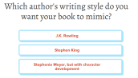
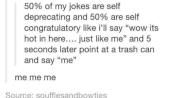

What happens when a bot writes your blog posts – This is Lit

[Skip to content](https://thisislitblog.com/2019/11/16/what-happens-when-a-bot-writes-your-blog-posts/#content)

# [This is Lit](https://thisislitblog.com/)

## Book Blog

- [Home·](https://thisislitblog.com/)
- [About·](https://thisislitblog.com/about/)
- [Review policy·](https://thisislitblog.com/review-policy/)
- [Testimonials·](https://thisislitblog.com/testimonials/)
- [Contact·](https://thisislitblog.com/contact/)

[General](https://thisislitblog.com/category/general/)

# What happens when a bot writes your blog posts

[November 16, 2019](https://thisislitblog.com/2019/11/16/what-happens-when-a-bot-writes-your-blog-posts/)·  [Shruti | This is Lit](https://thisislitblog.com/author/thisislit31/)·

Have you ever wondered if you’d be replaced by AI in the near future? I know I have. What if a bot could learn all about my style of writing and create a post of its own for this blog? Well, one of my techie friends gave me my answer.

A while back, he was bored one day and decided to test a machine learning model. You know, as one does.

(GIF) Stanley rolling his eyes on The Office.

He had come across a general purpose language model called GPT-2 by OpenAI and wanted to test it with my blog’s content. GPT-2 can be trained with existing content to generate high quality text just like a human would. Essentially, he did some tech voodoo and made a bot read through everything I’ve ever written so it could try writing like me.

Did it pull it off? Am I being replaced by a machine? Let’s find out.

##### 1. It reviewed probably the best book ever.

Book Reviews The Black Swan by Yasser Arafat and Yohai The Black Swan is a beautiful novel about a group of friends who all love books, but when they are bored of their books, they all start doing stupid shit

##### 2. It created books of its own.

The bot actually came up with a bunch of non-existent book titles, including the following:

- The Girl With The Glasses
- I Wanna Make a Deal with the Devil: The True Story Behind the Unwanted Child Movement
- An Unearthly Child by Ralph Wynn
- The Unsolved Mysteries of Laura Frennan-Smith by Diane Shaw
- Hobbit Girls
- Kung-Fu Panda 2: One Hundred and Nineteenth Anniversary by Jason Schwartzman
- The Secret Life of a Muggle-Born Philosopher
- Lust at Dawn: Why I Am A Buddhist
- Buddy Holly is on hiatus from Twitter

##### 3. It reviewed a non-existent Jodi Picoult novel.

I guess it picked up on all the different times I’ve talked about Jodi on this blog. So it just about created a book of its own and reviewed it too!

Hi there!

Here is a review of The Frozen Tundra by Jodi Picoult! She is an author who never fails to impress! I can hear her voice when I watch my copy of this book, but she really can’t stop laughing and laughing at things. If you haven’t read the book, I recommend you read it!

Frozen is a classic, with a very dark tone and yet beautiful story…and if you love black and white and classic, you will like this one too. The story follows the adventures of an old polar bear cub. I have no idea of the colour scheme of the bear, but I can say it looks amazing in the dark. The book ends with the bears finding the land around them, but I also love the snow.

##### 4. It wrote about authors of contradictory book titles.

New York Times bestselling author Thomas Pynchon has been nominated for the 2019 Booker Prize for The World Is Hollow. His next book, The World Is Not Hollow, is currently scheduled for release on February 24.

##### 5. It was very good at writing about death.

The man who was the one who died, has a heart condition that prevents him from breathing again.

(GIF) A man saying “You are technically correct. The best kind of correct.”

##### 6. It created an abusive. not-straight character named Jell-O.

Today I want to talk about Jell-O and the relationship between him and his mother.  Let’s first get a look at the different aspects of Jell-O. And what are the main reasons for the relationship that they are?

1) Jell-O is not a straight guy.
2) Jell-O is not a loving and nurturing person.
3) Jell-O is an emotional abuser.

One of the main reasons Jell-O is a manipulative, manipulative person is his own abuse of his own personal identity.  Jell-O can cause some drama. He doesn’t want to hurt, or anything, for that matter. After all, he is still a part of the story, he is just getting started, it will never be over in real life. He still has feelings of grief for the dead, and may need to wait for the next time he gets a chance to be a part of the story.

##### 7. It gave a book its own Goodreads synopsis.

Goodreads synopsis:

What can you expect of a novel about love in the face of tragic events? This novel tells of the life of a loveable couple who face the very first tragedy of their lives, the murder of their loved ones. The author, Sarah Brennan, is a great and kind person. Despite her background I always believed in Sarah as a character

##### 8. It had better clarity than me about writing.

What did you choose to do as a writer, then?

I was very naive when it comes to writing a series. I had no idea what was going to happen. I wanted it to be a lighthearted, realistic tale and I also wanted it to have a sense of drama, emotion, and suspense. I had no idea what I should do with the main characters in the first place, but I knew I had to make it a lighthearted, realistic story that would have the main characters struggling to find their happiness and love.

##### 9. In a Black Mirror-esque twist, it wrote this.

General
Why is a person to be killed?

A lot of people need to be killed. It’s easy to forget that for a number of reasons.

(GIF) Dr. House saying “oops”.

##### 10. It came after me too.

Shruti is a recovering alcoholic and drug addicted book blogger and author based in Sydney, Australia. She lives in Westwood with her husband and two cats.

(GIF) A lady with her hand raised, saying “That would be me”.

##### 11. It gave some amazing memoir prompts.

It picked up on the fact that I love sad memoirs and came up with this.
A memoir of a father’s struggle to get a girlfriend.
A memoir about two women who had a tragic, heartbreaking wedding.
A memoir of a father and his children surviving a whirlwind marriage.
A memoir explaining the struggles that led to their marriage.
A memoir of a father and his children’ experiences leaving home.
A memoir about a father who fights against love and loss.
A memoir of a father and his children coping with the loss of his wife.
A memoir of a married man and his children’ loss of a beloved sister.
A memoir of a mother and his sister living alone together.
A memoir of a father and his daughters who have lost loved ones.

* * *

...

In all, this was a fun experiment with wild results. And I’m happy I won’t be replaced by a bot here. For now, at least.

* * *

...
*~ Shruti*

*[Facebook](https://www.facebook.com/ThisIsLitBookBlog/)* | *[Goodreads](https://www.goodreads.com/user/show/15447041-shruti-ramanujam) | [Instagram](https://www.instagram.com/thisislitblog/) | [Twitter](https://twitter.com/ShrutiRamanujam)*

### *Related*

#### [How I wrote an entire novel with this AI-powered book writing software.](https://thisislitblog.com/2018/04/01/how-i-wrote-an-entire-novel-with-this-ai-powered-book-writing-software/)

In "Satire"

#### [The Mystery Blogger Award](https://thisislitblog.com/2017/01/29/the-mystery-blogger-award/)

In "Awards"

#### [AuthorsGetLit | Book bloggers and me by Lev Lewis](https://thisislitblog.com/2018/04/08/authorsgetlit-book-bloggers-and-me-by-lev-lewis/)

In "AuthorsGetLit"

### Share this:

- [Twitter](https://thisislitblog.com/2019/11/16/what-happens-when-a-bot-writes-your-blog-posts/?share=twitter&nb=1)
- [Facebook](https://thisislitblog.com/2019/11/16/what-happens-when-a-bot-writes-your-blog-posts/?share=facebook&nb=1)
- [Reddit](https://thisislitblog.com/2019/11/16/what-happens-when-a-bot-writes-your-blog-posts/?share=reddit&nb=1)
- [Tumblr](https://thisislitblog.com/2019/11/16/what-happens-when-a-bot-writes-your-blog-posts/?share=tumblr&nb=1)
- [More](https://thisislitblog.com/2019/11/16/what-happens-when-a-bot-writes-your-blog-posts/#)

-

### Like this:

[Like](https://widgets.wp.com/likes/index.html?ver=20190321#)

- 
- 
- 
- 
- 
- 
- 
- 
- 
- 
- 
- 
- 
- 
- 
- 

[16 bloggers](https://widgets.wp.com/likes/index.html?ver=20190321#) like this.

[Artificial Intelligence](https://thisislitblog.com/tag/artificial-intelligence/)  [Black Mirror](https://thisislitblog.com/tag/black-mirror/)  [blog](https://thisislitblog.com/tag/blog/)  [Blogging](https://thisislitblog.com/tag/blogging/)  [Books](https://thisislitblog.com/tag/books/)  [Bot](https://thisislitblog.com/tag/bot/)  [Funny](https://thisislitblog.com/tag/funny/)  [GPT-2](https://thisislitblog.com/tag/gpt-2/)  [Jodi Picoult](https://thisislitblog.com/tag/jodi-picoult/)  [Machine learning](https://thisislitblog.com/tag/machine-learning/)  [OpenAI](https://thisislitblog.com/tag/openai/)  [Sci-Fi](https://thisislitblog.com/tag/sci-fi/)  [Shruti Ramanujam](https://thisislitblog.com/tag/shruti-ramanujam/)

## Post navigation

[Previous Post Blog tour: A Mrs. Miracle Christmas by Debbie Macomber](https://thisislitblog.com/2019/11/14/blog-tour-a-mrs-miracle-christmas-by-debbi-macomber/)

## 17 thoughts on “What happens when a bot writes your blog posts”

1. **Spiky**

[November 16, 2019 at 10:17 pm](https://thisislitblog.com/2019/11/16/what-happens-when-a-bot-writes-your-blog-posts/#comment-26222)

Remember this post?

https://thisislitblog.com/2018/04/01/how-i-wrote-an-entire-novel-with-this-ai-powered-book-writing-software/

It’s gonna happen soon!

[](https://thisislitblog.com/2019/11/16/what-happens-when-a-bot-writes-your-blog-posts/?like_comment=26222&_wpnonce=471b883960)Liked by [1 person](https://thisislitblog.com/2019/11/16/what-happens-when-a-bot-writes-your-blog-posts/#)

[Reply](https://thisislitblog.com/2019/11/16/what-happens-when-a-bot-writes-your-blog-posts/?replytocom=26222#respond)

    1. **[Shruti | This is Lit](https://thisislitblog.wordpress.com/)**

[November 17, 2019 at 6:24 pm](https://thisislitblog.com/2019/11/16/what-happens-when-a-bot-writes-your-blog-posts/#comment-26258)

Cue the Black Mirror theme. 

[](https://thisislitblog.com/2019/11/16/what-happens-when-a-bot-writes-your-blog-posts/?like_comment=26258&_wpnonce=ad6939502b)Like

[Reply](https://thisislitblog.com/2019/11/16/what-happens-when-a-bot-writes-your-blog-posts/?replytocom=26258#respond)

    2. **[Shruti | This is Lit](https://thisislitblog.wordpress.com/)**

[November 17, 2019 at 6:25 pm](https://thisislitblog.com/2019/11/16/what-happens-when-a-bot-writes-your-blog-posts/#comment-26259)

Also, look at you remembering all my posts. You’re a *gasp* faaaaaan

[](https://thisislitblog.com/2019/11/16/what-happens-when-a-bot-writes-your-blog-posts/?like_comment=26259&_wpnonce=a518d96da4)Like

[Reply](https://thisislitblog.com/2019/11/16/what-happens-when-a-bot-writes-your-blog-posts/?replytocom=26259#respond)

        1. **Spiky**

[November 17, 2019 at 6:35 pm](https://thisislitblog.com/2019/11/16/what-happens-when-a-bot-writes-your-blog-posts/#comment-26260)

Don’t get too carried away. The post came up in the ‘Related’ section on this page.

[](https://thisislitblog.com/2019/11/16/what-happens-when-a-bot-writes-your-blog-posts/?like_comment=26260&_wpnonce=3f636e3f9b)Like

[Reply](https://thisislitblog.com/2019/11/16/what-happens-when-a-bot-writes-your-blog-posts/?replytocom=26260#respond)

2. **[sjhigbee](http://www.sjhigbee.com/)**

[November 17, 2019 at 12:20 am](https://thisislitblog.com/2019/11/16/what-happens-when-a-bot-writes-your-blog-posts/#comment-26226)

Well THAT was different! Nice to know you aren’t about to be replaced, Shruti:))

[](https://thisislitblog.com/2019/11/16/what-happens-when-a-bot-writes-your-blog-posts/?like_comment=26226&_wpnonce=c783c38b8a)Liked by [1 person](https://thisislitblog.com/2019/11/16/what-happens-when-a-bot-writes-your-blog-posts/#)

[Reply](https://thisislitblog.com/2019/11/16/what-happens-when-a-bot-writes-your-blog-posts/?replytocom=26226#respond)

    1. **[Shruti | This is Lit](https://thisislitblog.wordpress.com/)**

[November 17, 2019 at 6:24 pm](https://thisislitblog.com/2019/11/16/what-happens-when-a-bot-writes-your-blog-posts/#comment-26257)

Haha same. And there were hilarious results, so win-win. xD

[](https://thisislitblog.com/2019/11/16/what-happens-when-a-bot-writes-your-blog-posts/?like_comment=26257&_wpnonce=a42a10deb9)Like

[Reply](https://thisislitblog.com/2019/11/16/what-happens-when-a-bot-writes-your-blog-posts/?replytocom=26257#respond)

3. **[Miriam Seidel](http://www.miriamseidel.com/)**

[November 17, 2019 at 3:40 am](https://thisislitblog.com/2019/11/16/what-happens-when-a-bot-writes-your-blog-posts/#comment-26228)

Hahahaha! Thanks for the multiple LOLs! Is this for real, Shruti? Because if so, I think your bot has a great sense of humor!

[](https://thisislitblog.com/2019/11/16/what-happens-when-a-bot-writes-your-blog-posts/?like_comment=26228&_wpnonce=36cad13b99)Liked by [1 person](https://thisislitblog.com/2019/11/16/what-happens-when-a-bot-writes-your-blog-posts/#)

[Reply](https://thisislitblog.com/2019/11/16/what-happens-when-a-bot-writes-your-blog-posts/?replytocom=26228#respond)

    1. **[Shruti | This is Lit](https://thisislitblog.wordpress.com/)**

[November 17, 2019 at 6:23 pm](https://thisislitblog.com/2019/11/16/what-happens-when-a-bot-writes-your-blog-posts/#comment-26256)

It is! It even got featured on Hackers News, all thanks to my techie friend. 

[](https://thisislitblog.com/2019/11/16/what-happens-when-a-bot-writes-your-blog-posts/?like_comment=26256&_wpnonce=5532a909c6)Like

[Reply](https://thisislitblog.com/2019/11/16/what-happens-when-a-bot-writes-your-blog-posts/?replytocom=26256#respond)

4. Pingback: [New top story on Hacker News: Show HN: What happens when a bot writes your blog posts – Hckr News](https://hckrnews.wordpress.com/2019/11/17/new-top-story-on-hacker-news-show-hn-what-happens-when-a-bot-writes-your-blog-posts/)

5. Pingback: [New top story on Hacker News: Show HN: What happens when a bot writes your blog posts – protipsss](https://protipsss.wordpress.com/2019/11/17/new-top-story-on-hacker-news-show-hn-what-happens-when-a-bot-writes-your-blog-posts/)

6. Pingback: [New top story on Hacker News: Show HN: What happens when a bot writes your blog posts – Golden News](https://indian215720559.wordpress.com/2019/11/17/new-top-story-on-hacker-news-show-hn-what-happens-when-a-bot-writes-your-blog-posts/)

7. Pingback: [Show HN: What happens when a bot writes your blog posts – INDIA NEWS](https://myindianews1.wordpress.com/2019/11/17/show-hn-what-happens-when-a-bot-writes-your-blog-posts/)

8. Pingback: [New Show Hacker News story: Show HN: What happens when a bot writes your blog posts – Golden News](https://indian215720559.wordpress.com/2019/11/17/new-show-hacker-news-story-show-hn-what-happens-when-a-bot-writes-your-blog-posts-2/)

9. Pingback: [=== popurls.com === popular today](http://popurls.com/pop/)

10. **[cryptomathecian](http://maharajagar.wordpress.com/)**

[November 17, 2019 at 2:52 pm](https://thisislitblog.com/2019/11/16/what-happens-when-a-bot-writes-your-blog-posts/#comment-26250)

In the cases of some VERY prolific bloggers, I wonder sometimes how much of their content has been written by a bot. Is there some way to detect this?

[](https://thisislitblog.com/2019/11/16/what-happens-when-a-bot-writes-your-blog-posts/?like_comment=26250&_wpnonce=1b62b34d13)Liked by [1 person](https://thisislitblog.com/2019/11/16/what-happens-when-a-bot-writes-your-blog-posts/#)

[Reply](https://thisislitblog.com/2019/11/16/what-happens-when-a-bot-writes-your-blog-posts/?replytocom=26250#respond)

    1. **[Shruti | This is Lit](https://thisislitblog.wordpress.com/)**

[November 17, 2019 at 6:21 pm](https://thisislitblog.com/2019/11/16/what-happens-when-a-bot-writes-your-blog-posts/#comment-26255)

Haha, really? Or could they have ghost writers, perhaps?

[](https://thisislitblog.com/2019/11/16/what-happens-when-a-bot-writes-your-blog-posts/?like_comment=26255&_wpnonce=0e61c16322)Like

[Reply](https://thisislitblog.com/2019/11/16/what-happens-when-a-bot-writes-your-blog-posts/?replytocom=26255#respond)

11. Pingback: [Sunday Post – 17th November, 2019 #Brainfluffbookblog #SundayPost | Brainfluff](https://sjhigbee.wordpress.com/2019/11/17/sunday-post-17th-november-2019-brainfluffbookblog-sundaypost/)

### Leave a Reply

# About Shruti Ramanujam

Shruti Ramanujam is a blogger who enjoys reading and reviewing books. She’s usually got her nose in a book and slouches from the metaphorical weight of all the books she’s yet to read on her shoulders. When she’s not reading or writing about herself in the third person, she binge-watches TV shows and makes self-deprecating jokes.

# Follow Shruti on social media

- [View ThisIsLitBookBlog’s profile on Facebook](https://www.facebook.com/ThisIsLitBookBlog/)
- [View @ShrutiRamanujam’s profile on Twitter](https://twitter.com/@ShrutiRamanujam/)
- [View thisislitblog’s profile on Instagram](https://www.instagram.com/thisislitblog/)

# Follow This is Lit via Email

Enter your email address to follow this blog and receive notifications of new posts by email.

Join 1,896 other followers

# Currently Reading

 

 [A Year of Wednesdays](https://www.goodreads.com/review/show/3039058139?utm_medium=api&utm_source=custom_widget)

by [Sonia Bahl](https://www.goodreads.com/author/show/15006160.Sonia_Bahl)

 

 [The Dutch House](https://www.goodreads.com/review/show/3020119606?utm_medium=api&utm_source=custom_widget)

by [Ann Patchett](https://www.goodreads.com/author/show/7136914.Ann_Patchett)

 

 [The Death of Mungo Blackwell](https://www.goodreads.com/review/show/3000822361?utm_medium=api&utm_source=custom_widget)

by [Lauren H. Brandenburg](https://www.goodreads.com/author/show/6533944.Lauren_H_Brandenburg)

 

# Recent Posts

- [What happens when a bot writes your blog posts](https://thisislitblog.com/2019/11/16/what-happens-when-a-bot-writes-your-blog-posts/)
- [Blog tour: A Mrs. Miracle Christmas by Debbie Macomber](https://thisislitblog.com/2019/11/14/blog-tour-a-mrs-miracle-christmas-by-debbi-macomber/)
- [The Mousetrap: When 1950s theatre came all the way to India](https://thisislitblog.com/2019/11/11/the-mousetrap-when-1950s-theatre-came-all-the-way-to-india/)
- [Blog tour: Things That Art by Lochlann Jain](https://thisislitblog.com/2019/11/06/blog-tour-things-that-art-by-lochlann-jain/)
- [Blog tour: Christmas with the Shipyard Girls by Nancy Revell](https://thisislitblog.com/2019/11/03/blog-tour-christmas-with-the-shipyard-girls-by-nancy-revell/)
- [A Death in the Himalayas by Udayan Mukherjee](https://thisislitblog.com/2019/10/28/a-death-in-the-himalayas-by-udayan-mukherjee/)
- [We Hunt the Flame by Hafsah Faizal](https://thisislitblog.com/2019/10/20/we-hunt-the-flame-by-hafsah-faizal/)
- [Frankly in Love by David Yoon](https://thisislitblog.com/2019/10/17/frankly-in-love-by-david-yoon/)

# Archives

Archives

# Copyright

© Shruti Ramanujam, 2018. Unauthorized use and/or duplication of this material without express and written permission from this site’s author is strictly prohibited. Excerpts and links may be used, provided full and clear credit is given to Shruti Ramanujam with appropriate and specific direction to the original content.

Search for:

# Badges

[Powered by WordPress.com](https://wordpress.com/?ref=footer_custom_powered).