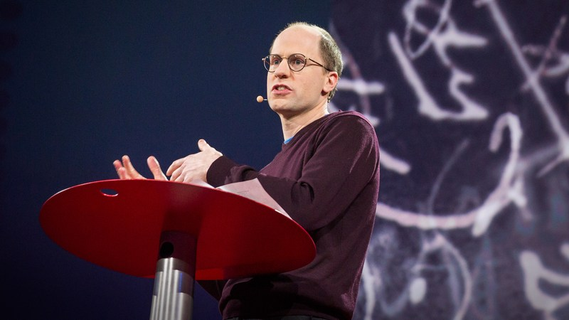
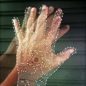
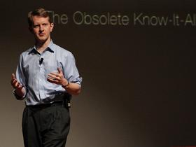
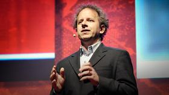
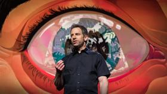
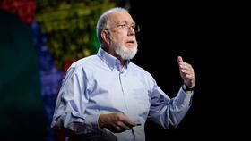

What happens when our computers get smarter than we are?

 

[(L)](https://www.ted.com/talks/nick_bostrom_what_happens_when_our_computers_get_smarter_than_we_are#)

#

Nick Bostrom:
What happens when our computers get smarter than we are?
**TED2015**·16:31·**Filmed**Mar 2015
**29 subtitle languages**Help with subtitles

[**View interactive transcript](https://www.ted.com/talks/nick_bostrom_what_happens_when_our_computers_get_smarter_than_we_are/transcript?language=en)

-
-
-
-

2,590,613
Totalviews

Artificial intelligence is getting smarter by leaps and bounds — within this century, research suggests, a computer AI could be as "smart" as a human being. And then, says Nick Bostrom, it will overtake us: "Machine intelligence is the last invention that humanity will ever need to make." A philosopher and technologist, Bostrom asks us to think hard about the world we're building right now, driven by thinking machines. Will our smart machines help to preserve humanity and our values — or will they have values of their own?

- [**Interactive transcriptInteractive transcript](https://www.ted.com/talks/nick_bostrom_what_happens_when_our_computers_get_smarter_than_we_are/transcript?language=en)

[Nick Bostrom](https://www.ted.com/speakers/nick_bostrom)
Philosopher

Nick Bostrom asks big questions: What should we do, as individuals and as a species, to optimize our long-term prospects? Will humanity’s technological advancements ultimately destroy us?[Full bio](https://www.ted.com/speakers/nick_bostrom)

- Similar topics
- [AI](https://www.ted.com/topics/ai)
- [Future](https://www.ted.com/topics/future)
- [Machine learning](https://www.ted.com/topics/machine+learning)
- [Philosophy](https://www.ted.com/topics/philosophy)
- [Technology](https://www.ted.com/topics/technology)

This talk was presented at an official TED conference, and was featured by our editors on the home page.

[Get all the talks from TED2015 at TED Live](https://tedlive.ted.com/webcasts/2015/purchase)

TED Talks are free thanks to our partners & advertisers

Playlists to watch
[Browse all](https://www.ted.com/playlists)

- 

####

[What does the future look like?](https://www.ted.com/playlists/85/what_does_the_future_look_like)

[Playlist (13 talks)](https://www.ted.com/playlists/85/what_does_the_future_look_like)

- 

####

[Artificial intelligence](https://www.ted.com/playlists/310/talks_on_artificial_intelligen)

[Playlist (8 talks)](https://www.ted.com/playlists/310/talks_on_artificial_intelligen)

- 

####

[New tech, new ethics](https://www.ted.com/playlists/329/new_tech_new_morals)
[Playlist (9 talks)](https://www.ted.com/playlists/329/new_tech_new_morals)

### Related talks

[17:52](https://www.ted.com/talks/ken_jennings_watson_jeopardy_and_me_the_obsolete_know_it_all)

#### [Ken Jennings Watson, Jeopardy and me, the obsolete know-it-all](https://www.ted.com/talks/ken_jennings_watson_jeopardy_and_me_the_obsolete_know_it_all)

[17:58](https://www.ted.com/talks/fei_fei_li_how_we_re_teaching_computers_to_understand_pictures)

#### [Fei-Fei Li How we're teaching computers to understand pictures](https://www.ted.com/talks/fei_fei_li_how_we_re_teaching_computers_to_understand_pictures)

[19:45](https://www.ted.com/talks/jeremy_howard_the_wonderful_and_terrifying_implications_of_computers_that_can_learn)

#### [Jeremy Howard The wonderful and terrifying implications of computers that can learn](https://www.ted.com/talks/jeremy_howard_the_wonderful_and_terrifying_implications_of_computers_that_can_learn)

[14:27](https://www.ted.com/talks/sam_harris_can_we_build_ai_without_losing_control_over_it)

#### [Sam Harris Can we build AI without losing control over it?](https://www.ted.com/talks/sam_harris_can_we_build_ai_without_losing_control_over_it)

[11:48](https://www.ted.com/talks/alex_wissner_gross_a_new_equation_for_intelligence)

#### [Alex Wissner-Gross A new equation for intelligence](https://www.ted.com/talks/alex_wissner_gross_a_new_equation_for_intelligence)

[13:44](https://www.ted.com/talks/kevin_kelly_how_ai_can_bring_on_a_second_industrial_revolution)

#### [Kevin Kelly How AI can bring on a second Industrial Revolution](https://www.ted.com/talks/kevin_kelly_how_ai_can_bring_on_a_second_industrial_revolution)

### Discuss

354 comments
Enthusiastically agree? Respectfully beg to differ? Have your say here.

[Log in to comment](https://www.ted.com/session/new)Don't have an account?[Sign up now](https://www.ted.com/users/new)— it's fast and free.

[Show more comments](https://www.ted.com/talks/nick_bostrom_what_happens_when_our_computers_get_smarter_than_we_are#)