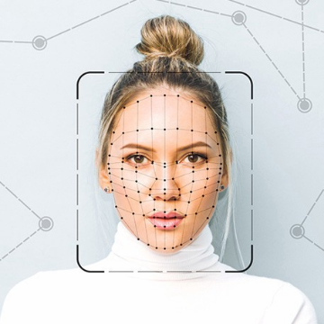
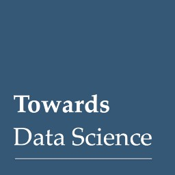

What is AI bias? – Towards Data Science

What is AI bias? – Towards Data Science

https://towardsdatascience.com/what-is-ai-bias-6606a3bcb814

The amazing thing about AI is just how un(human)biased it is. If it had personhood and opinions of its own, it might stand up to those who…