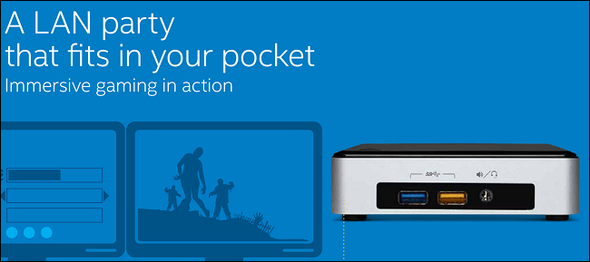
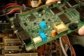
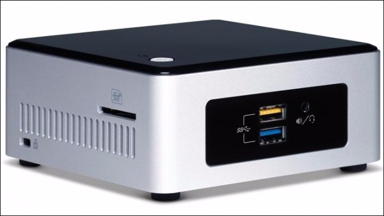
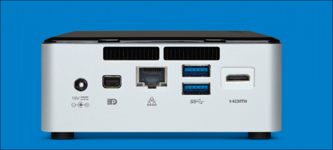
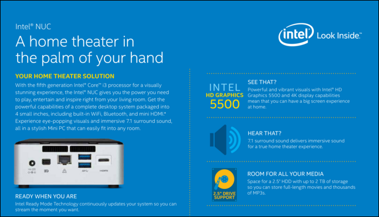

What is a NUC PC, and Should You Get One?

A few years back, Intel noticed that less and less people were as interested in buying desktop and tower PCs as they were during the roaring 90’s. As sales continued to decline for the dinosaurs of modern computing, the company decided to mix the best of both worlds up in a blender to see what came out the other side, and their new line of NUC computers are the result of that experiment.

But what is a “NUC” exactly? Confusing acronyms and ad-speak aside, are these tiny little boxes worth enough that you should you look into buying one for yourself? Read on in our guide to find out.

## “What’s up NUC?”

A NUC, short for “Next Unit of Computing”, is a small box-shaped computer that often won’t measure more than a few inches across or deep, containing an entire system crammed into its miniscule chassis. A DIYers dream, NUC computers are sold as barebones kits that users need to assemble themselves in order to get it working, sort of like an old-timey airplane model that also happens to be able to play Starcraft at 60fps.

RELATED ARTICLE

[How to Build a New Custom PC Without Touching a Screwdriver](https://www.howtogeek.com/219729/how-to-build-a-new-custom-pc-without-touching-a-screwdriver/)

The power you can get out of a NUC will vary greatly depending on the type of unit you opt for, equipped with anything from an Intel G3258 1.5GHz dual-core and 1GB of RAM, up to an i7-5577u quad-core and 8GB of RAM. In general, NUCs are fairly limited on the number of ports they can hold or the extra features they can support, but they aren’t missed nearly as much when you see that NUCs come with a price to match.

Some older generation NUCs can be found for as low as $100 out the door, and will still give you all the umph you’d expect out of a laptop that costs three times as much. The higher-end new models can be customized to cost upwards of $500 without a keyboard, monitor, or mouse (all additions a NUC will need to attain full functionality).

Because of their size, no NUCs come with an optical drive, nor do they come preinstalled with a ready-out-of-the-box version of Windows. This means that if you plan on getting one, be sure you’ve acquired a licensed copy of the operating system loaded onto a flashable USB thumb-drive before you get the NUC shipped, or at the very least order an external DVD drive that plugs in via USB to handle a disc.

As anyone doing the math out there has probably already figured out, with all the extra parts added on plus an the cost of an operating system, a NUC can easily end up costing just as much as you’d pay for a standard laptop or regular desktop, so what’s the actual point of picking a NUC over a traditional desktop PC or laptop instead?

## Power in Portability

A NUC is great for a lot of reasons, but the one that trumps them all is the fact that it’s just so dang small. Some NUCs are so thin and light they’ll literally fit in your pocket, but still have the same amount of power you’d expect from a 15″ or 17″ laptop.

Intel isn’t the only one who sees the value in this either, as several other companies have begun releasing their own versions of mini-PCs to compensate. Both Google’s Chromeboxes and Apple’s Mac Mini (which predicated the first NUC by about two years) work as examples of small, portability-centric computers that can double as plug-and play media streamers or web browsers on the go, so why should you choose one of Intel’s NUCs over the cheaper, easier to set up competition?

RELATED ARTICLE

[Why You Should Connect a PC to Your TV (Don’t Worry; It’s Easy!)](https://www.howtogeek.com/200557/why-you-should-connect-a-pc-to-your-tv-dont-worry-its-easy/)

For starters, NUC PCs are great if you’re a road warrior who needs a powerful PC that they can tow along with them when they need to power a big display at a tradeshow, or just to pull a little extra weight that a regular laptop may not be able to handle on its own. Pound for pound NUCs can offer better processors than what you might pay for in a laptop, because with the increased space and airflow that NUCs offer, Intel has been able to equip their NUCs with the full-fledged versions of their Intel Iris HD graphics chips that don’t skimp on power the way their laptop-based counterparts do.

Not only that, but the little systems can be a perfect fit if you’re looking to set up a media center in the living room, but don’t want a loud, overheated standard desktop tower taking up all the space in your entertainment center in order to make it work. NUCs fit snugly behind any TV without imposing on the design of your home, and most even have VESA adaptable mounts which allow you to attach the NUC directly to the back of your TV for ultra-discrete operation, all for much less than what you’d expect to pay for a Mac Mini.

With the 4K streaming revolution waiting just over the horizon, a NUC is a perfect investment for Xbox or PS4 owners who are still holding with bated breath to see if their console will be updated to handle the resolution anytime in the next few years. Most NUCs above $200 can stream Netflix in 4K resolution without a stutter, and even the lowest end models come with ports to plug in the networking equipment you’d need to run a dedicated media server that’s immediately accessible from any mobile device or a separate desktop.

Lastly, NUCs can also make awesome hobby kits for the aspiring computer scientist in your home, with tons of modular parts that can be swapped in or out of the system on a dime. All the boxes are sold in barebones kits, which can then be upgraded with various parts that you put together yourself or with your kids. NUCs are quick, simple introductions into the foundation of learning how computers work, which can encourage anyone in your household to be more interested in learning which parts go where and what makes the whole thing tick from the inside out.

* * *

As the consumer market continues to plow ever forward into the world of mobile and portable devices, it’s nice to see that a company like Intel isn’t afraid to adapt or roll with the punches as they come. NUCs are undoubtedly a very specific product for a very specific type of consumer, but even so, they’re stil a fun addition to the market that gives users the option to customize their computing experience from scratch.

If you want to build a 4K streaming box or something that can run rudimentary games (think mostly 2D and some older 3D titles like Diablo III on the lowest settings), a NUC is a cheap and easy way to fill out your PC lineup without having to empty out your wallet at the checkout counter in the process. Otherwise, if you just want a project computer that you and your kids can build as a team, a baseline NUC is a great weekend hobby that will let their imagination and interest in computers run wild.

NUCs may not be right for everyone, but they’re still fun for some, and that’s reason enough to give them a chance.

Image Credits: Intel [1](http://www.intel.com/content/www/us/en/nuc/nuc-kit-nuc5pgyh.html), [2](http://www.intel.com/content/dam/www/public/us/en/images/photography-consumer/rwd/231000-mini-pc-front-angle-rwd.jpg/jcr:content/renditions/intel.web.720.405.jpg), [3](http://www.intel.com/content/www/us/en/nuc/nuc-core-i5-gaming-usage-guide.html)