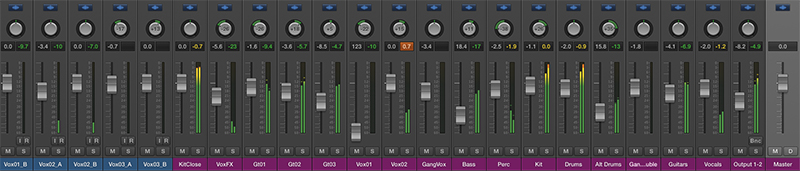

What is a decibel, anyway? | Tom Hazledine

       

# What is a decibel, anyway?

 Published on   Mar 2017  Modified on Mar 2017   –   Read time: four and a half minutes.  P4M34S      [Tom Hazledine](https://plus.google.com/111879829548102811838)

 

The decibel has always confused me. Sometimes people use decibels as an absolute value where “0” is silence and anything over “120” is very loud. Journalists do this when describing how loud a band is*For instance, this [from Wikipedia](https://en.wikipedia.org/wiki/Loudest_band_in_the_world): The heavy metal band Manowar is one claimant of the title of “loudest band in the world”, citing a measurement of 129.5 dB in 1994 in Hanover.*. Sound engineers do it too, when boasting about the power of their speaker-setup. “It’s louder than a jet engine at 50 paces, man”. But when I look at the volume meter on a mixing desk, things are different. The desk shows the loudest value as zero, all the way down to silence at “-96” (or sometimes even “∞”). See what I mean? Confusing.

 
The mixer section of Logic X (a typical DAW – Digital Audio Workstation)

For a long time I’ve been at least tangentially connected to the world of “pro” audio. As such, I’d feel uneasy when I overheard a lay-person talking about volume. I would often catch myself thinking “I know they are getting it wrong, but I don’t know why”. So after years of pretty much taking the decibel for granted, I finally had enough. I did some research, and it turns out the decibel is actually pretty interesting.

- ·A decibel is a relative unit. That means it expresses a ratio, and not an explicit value.
- ·Decibels are measured using a logarithmic scale*For a deeper dive into the science, check out [this fantastically thorough explanation](http://www.animations.physics.unsw.edu.au/jw/dB.htm) from Australia’s UNSW.*.
- ·They are a good unit for expressing very small *and* very large differences, and can do both on the same scale. This works because they are relative and logarithmic.
- ·Decibels are a technical measure of intensity and/or pressure. Humans don’t hear all frequencies equally, so “loudness” is a subjective concept.
- ·When decibels *are* used to express “loudness”, (for instance, by journalists) they are used with a fixed point of reference. In this context, the unit we’re using is dBSPL (decibels relative to sound pressure level).
- ·dBSPL represent an absolute value of sound pressure. Just like 20 metres is the same length wherever you go, 20 dBSPL always represents the same level of sound pressure. To use a decibel this way, we need a fixed point of reference. The reference point for dBSPL is 20μPa (micropascals) – roughly the limit of sensitivity of the human ear.
- ·Levels of >120 dBSPL will damage our ears, but our pain threshold is somewhere around 150 dBSPL. So be careful, you could do lasting damage without realizing.
- ·If you want to reference “loudness” using decibels, then you need to apply a filter of some kind. This more accurately describes the idea of “volume” as humans understand it.
- ·The most common filter is the “A scale” (dBA). This is a “band-pass” filter, which is less sensitive to very high and very low frequencies. It’s simplistic, but “close-enough” to have become a standard.
- ·A less-simplistic approximation of what our ears hear would be a “hearing response curve”. These are much more complex than the “A” scale, with peaks and troughs at different frequencies.

                               10  100  1000  10k  100k    10  100  1000  10k  100k      0  +10  +20  -10  -20  -30  -40  -50    Gain (dBFS)

The graph on the left shows an "A" scale frequency response curve, while the graph on the right shows one that more closely matches the response of an average human ear.

Now that I’ve done my research, the dB markings on a mixing desk look far more logical. I can see now that using a simple low-to-high dB meter wouldn’t make any sense. Any dB scale *requires* a defined reference point, which doesn’t exist in this context. A mixer-channel *cannot* have a fixed frame of reference because it gets mixed. A mixer routes all channels to the “master bus” output channel, which has its own volume control. Knowing the value of a signal at the channel-level tells us nothing about the final output value.

But if we flip things around, a channel strip *can* have a fixed reference point. That fixed point is the maximum level that it can output. Because decibels are *relative* units, we can use them to express how far below the max-level a signal is. By putting 0dB at the top of the meter (and negative values on the downward scale) we can gain useful information about the level of the signal.

There is a technical term for this kind of decibel-usage – dBFS (decibel full scale). The highest possible level of sound produced by audio equipment is 0 dBFS. All other levels are then expressed in negative numbers. Absolute silence in dBFS is ∞ (infinity), but in practical terms -96 makes for a useable bottom point.

## Putting dBFS to use on the web.

Much like a mixing desk, the Web Audio API does not use dBSPL. The final volume depends on both the level set by your operating system and the level of your speakers. Your computer has no way of knowing what your audio-out connects to (in an analogue setting, at least). It could be going to a set of tiny tinny earbuds, or a 500w amplifier and massive speaker stack. Providing a dBSPL reading of the level would be both meaningless and impossible. For this reason the Web Audio API uses dBFS.

In this scenario the dBFS value *is* useful information. It lets us know if a channel is “clipping”, and gives us the information we need to keep on top of our gain-staging. It also gives us a value to compare against other channels on the same system. We may not know the volume of the final destination, but we can compare the individual channels. If we look at a drum track and a guitar track, for instance, we can use the dBFS values to guide how we mix the levels of the two.

I’ve built this keyboard using the Web Audio API. Now I know how the decibel actual works as a unit, I was able to incorporate it into my project. The volume meters now show their values in dBFS.

- ·C
- ·C#
- ·D
- ·D#
- ·E
- ·F
- ·F#
- ·G
- ·G#
- ·A
- ·A#
- ·B
- ·C
- ·C#
- ·D
- ·D#
- ·E
- ·F
- ·F#
- ·G
- ·G#
- ·A
- ·A#
- ·B

- ·
- ·
- ·
- ·
- ·
- ·
- ·
- ·
- ·

 0dB  -96dB
   Gain

- ·
- ·
- ·
- ·
- ·
- ·
- ·
- ·
- ·

 0dB  -96dB

The example keyboard above (go on, have a play with it!) shows us two VU meters (“VU” == volume units). The first shows us the inital volume of the sound *source*, and the second shows us the final level that is sent to our speakers. Both VU meters use a scale of 0 dBFS to -96 dBFS.

       *Want to comment on this topic?*  [Join the discussion on Twitter](https://twitter.com/intent/tweet?source=webclient&text=What+is+a+decibel,+anyway?+https://tomhazledine.com/what-is-a-decibel-anyway/+@thomashazledine)