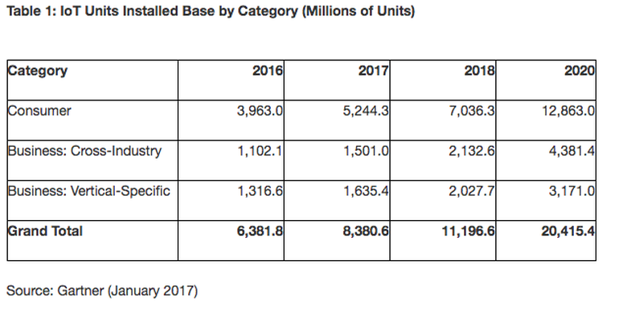
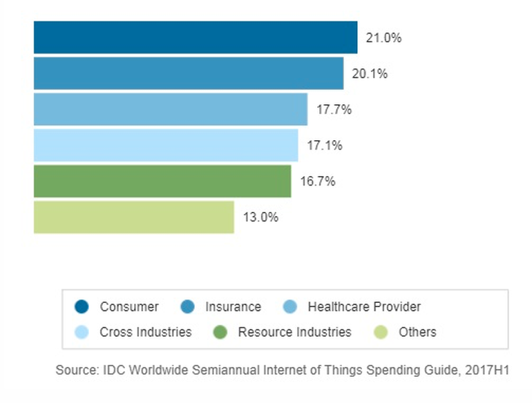

What is the IoT? Everything you need to know about the Internet of Things right now | ZDNet

# What is the IoT? Everything you need to know about the Internet of Things right now

The Internet of Things explained: What the IoT is, and where it's going next.

Your video will resume in 8 seconds

- playlist
- 0:07 / 0:15
- Autoplay: onoff
- share
- fullscreen

*Video: Everything you need to know about the Internet of Things*
**What is the Internet of Things?**

The Internet of Things, or IoT, refers to billions of physical devices around the world that are now connected to the internet, collecting and sharing data. Thanks to cheap processors and wireless networks, it's possible to turn anything, from [a pill](http://www.zdnet.com/article/how-sensors-enabled-eli-lilly-to-improve-the-patient-experience/)to [an aeroplane](http://www.zdnet.com/article/ten-examples-of-iot-and-big-data-working-well-together/), into part of the IoT. This adds a level of digital intelligence to devices that would be otherwise dumb, enabling them to communicate without a human being involved, and merging the digital and physical worlds.

- [**The Internet of Things? It's really a giant robot and we don't know how to fix it**](http://www.zdnet.com/article/the-internet-of-things-its-really-a-giant-robot-and-we-dont-know-how-to-fix-it/)

**What is an example of an Internet of Things device?**

### FREE DOWNLOAD

 

 [Special Report: Harnessing IoT in the Enterprise](http://www.techrepublic.com/resource-library/whitepapers/special-report-harnessing-iot-in-the-enterprise-free-pdf/)

You can download all of the articles in this series in one PDF. It's free to registered ZDNet and TechRepublic members.

 [Read More](http://www.techrepublic.com/resource-library/whitepapers/special-report-harnessing-iot-in-the-enterprise-free-pdf/)

Pretty much any physical object can be transformed into an IoT device if it can be connected to the internet and controlled that way.

[A lightbulb](http://www.zdnet.com/article/building-my-own-internet-of-things-ambient-experience-one-step-at-a-time/) that can be switched on using a smartphone app is an IoT device, as is a motion sensor or a [smart thermostat](http://www.zdnet.com/article/johnson-controls-cortana-powered-thermostat-is-up-for-preorder-in-march/) in your office or a connected streetlight. An IoT device could be as fluffy as [a child's toy](http://www.zdnet.com/article/fbi-to-parents-beware-your-kids-smart-toy-could-be-a-security-risk/) or as serious as [a driverless truck](http://www.zdnet.com/article/driverless-trucks-are-coming-but-for-now-adoption-is-in-the-slow-lane/), or as complicated as a jet engine that's now filled with thousands of sensors collecting and transmitting data. At an even bigger scale, [smart cities projects are filling entire regions with sensors](http://www.zdnet.com/article/las-vegas-announces-smart-city-plans-with-cisco/) to help us understand and control the environment.

The term 'IoT' is mainly used for devices that wouldn't usually be generally expected to have an internet connection, that can communicate with the network independently of human action. For this reason, a PC isn't generally considered an IoT device and neither is a smartphone -- even though the latter is crammed with sensors. A [smartwatch](http://www.zdnet.com/article/could-your-apple-watch-save-your-life-how-smartwatch-sensors-are-helping-tackle-a-dangerous-heart/) or a [fitness band](https://www.zdnet.com/product/fitbit-ionic/) might be counted as an IoT device, however.

- [**Google and Levi's unveil internet-connected jacket**](http://www.zdnet.com/article/google-and-levis-unveil-internet-connected-jacket/)

[  Simple and Powerful Accounting for Your Business  Learn how to easily manage your finances and accounting with the Sage Business Cloud Accounting technology. Find out more and get started today!  Sponsored by Sage](http://eb2.3lift.com/pass?tl_clickthrough=true&redir=http%3A%2F%2Fbttrack.com%2FClick%2FNative%3Fdata%3DOuJifVtEKZqw3ATnef7NW7OqevdXGm0xKzJdr5RBGDZgrJcgu163OeBSFaSwsPywWtaHsUlsOnYp_pVpbfN0sneCbpXXzy-JZeN1WSHX5hKsEgpM5rx0B60b9EN4TkGohSMXqL7PxtHciAIgEn9WAVVlD-L18JFO0JKlcjvhzM3kN_jf_3LKyrx1wjpJYz9McojDfkd19IFrt00BVDc5f5_saYVA-urPafH8EtzI8TB0dIXk4tOXQPxWASxAiwN11fFRpB5_sGTak5DQEP8fLIu4shP3hpuAcmlt9Zh7dgs0uwXolPfd40k07DkSUWXSw7wdv1dF12zuUjrdB5jrj4mMQBeCC4iFdpK95hnSBy0SafYzGCrovV-S9rVQ8gO_jEmbrseNcs2EAWk0z0Iprp1lGNIoCPidp1fBa9fEEUwBlfU1UagOrHvLjofRuYbycGIH7mGcu4IqiJ8a30NWJaDL8snNTXJnHrpUEFGXoxei-eAOL8VlvDc1)

**What is the history of the Internet of Things?**

The idea of adding sensor and intelligence to basic objects was discussed throughout the 1980s and 1990s (and there are arguably some [much earlier ancestors](https://innovateuk.blog.gov.uk/2017/07/03/the-history-of-internet-of-things-iot/)), but apart from some early projects -- including an internet-connected vending machine -- progress was slow simply because the technology wasn't in place.

Processors that were cheap and power-frugal enough to be all but disposable were required before it became cost-effective to connect up billions of devices. The [adoption of RFID tags](http://www.zdnet.com/article/rfid-heralds-the-internet-of-things/) -- low-power chips that can communicate wirelessly -- solved some of this issue, along with the increasing availability of broadband internet and cellular and wireless networking. The [adoption of IPv6](http://www.zdnet.com/article/finally-ipv6s-killer-app-the-internet-of-things/)-- which, among other things, should provide enough IP addresses for every device the world (or indeed this galaxy) is ever likely to need -- was also a necessary step for the IoT to scale. [Kevin Ashton](https://en.wikipedia.org/wiki/Kevin_Ashton) coined the phrase 'Internet of Things' in 1999, although it took at least another decade for the technology to catch up with the vision.

"The IoT integrates the interconnectedness of human culture -- our 'things' -- with the interconnectedness of our digital information system -- 'the internet.' That's the IoT," Ashton [told ZDNet](http://www.zdnet.com/article/if-you-want-to-succeed-you-must-fail-first-says-the-man-who-dreamt-up-the-internet-of-things/).

Adding RFID tags to [expensive pieces of equipment](http://www.zdnet.com/article/uk-hospitals-embrace-rfid/) to help track their location was one of the first IoT applications. But since then, the cost of adding sensors and an internet connection to objects has continued to fall, and experts predict that this basic functionality could one day cost as little as 10 cents, making it possible to connect nearly everything to the internet.

The IoT was initially most interesting to business and manufacturing, where its application is sometimes known as machine-to-machine (M2M), but the emphasis is now on filling our homes and offices with smart devices, transforming it into something that's relevant to almost everyone. Early suggestions for internet-connected devices included 'blogjects' (objects that blog and record data about themselves to the internet), ubiquitous computing (or 'ubicomp'), invisible computing, and pervasive computing. However, it was Internet of Things and IoT that stuck.

- [**If you want to succeed you must fail first, says the man who dreamt up the Internet of Things**](http://www.zdnet.com/article/if-you-want-to-succeed-you-must-fail-first-says-the-man-who-dreamt-up-the-internet-of-things/)

**How big is the Internet of Things?**

Big and getting bigger -- there are already more connected things than people in the world. [Analyst Gartner calculates](https://www.gartner.com/newsroom/id/3598917) that around 8.4 billion IoT devices were in use in 2017, up 31 percent from 2016, and this will likely reach 20.4 billion by 2020. Total spending on IoT endpoints and services will reach almost $2tn in 2017, with two-thirds of those devices found in China, North America and Western Europe, said Gartner.

Out of that 8.4 billion devices, more than half will be consumer products like smart TVs and smart speakers. The most-used enterprise IoT devices will be smart electric meters and commercial security cameras, according to Gartner.

Image: Gartner

Another analyst, IDC, [puts worldwide spending on IoT](https://www.idc.com/getdoc.jsp?containerId=prUS43295217) at $772.5bn in 2018 -- up nearly 15 percent on the $674bn that will be spent in 2017. IDC predicts that total spending will hit $1tn in 2020 and $1.1tn in 2021.

According to IDC, hardware will be the largest technology category in 2018 with $239bn going on modules and sensors, with some spending on infrastructure and security. Services will be the second largest technology category, followed by software and connectivity.

 **What are the benefits of the Internet of Things for business?**

Occasionally known as the Industrial Internet of Things (IIoT), the benefits of the IoT for business depend on the particular implementation, but the key is that enterprises should have access to more data about their own products and their own internal systems, and a greater ability to make changes as a result.

**See also: [How SMBs can maximize the benefits of IoT initiatives](http://www.techproresearch.com/article/how-smbs-can-make-the-best-use-of-iot-initiatives/)**

Manufacturers are adding sensors to the components of their products so that they can transmit back data about how they are performing. This can help companies spot when a component is likely to fail and to swap it out before it causes damage. Companies can also use the data generated by these sensors to make their systems and their supply chains more efficient, because they will have much more accurate data about what's really going on.

"With the introduction of comprehensive, real-time data collection and analysis, production systems can become dramatically more responsive," [say consultants McKinsey](https://www.mckinsey.com/industries/semiconductors/our-insights/whats-new-with-the-internet-of-things).

Enterprise use of the IoT can be divided into two segments: industry-specific offerings like sensors in a generating plant or real-time location devices for healthcare; and IoT devices that can be used in all industries, like smart air conditioning or security systems.

While industry-specific products will make the early running, by 2020 Gartner predicts that cross-industry devices will reach 4.4 billion units, while vertical-specific devices will amount to 3.2 billion units. Consumers purchase more devices, but businesses spend more: the analyst group said that while consumer spending on IoT devices was around $725bn last year, businesses spending on IoT hit $964bn. By 2020, business and consumer spending on IoT hardware will hit nearly $3tn.

The Internet of Things, broken down by industry.
Image: IDC

For IDC the three industries that are expected to spend the most on IoT in 2018 are manufacturing ($189bn), transportation ($85bn), and utilities ($73bn). Manufacturers will largely focus on improving the efficiency of their processes and asset tracking, while two-thirds of IoT spending by transport will go toward freight monitoring, followed by fleet management.

IoT spending in the utilities industry will be dominated by smart grids for electricity, gas, and water. IDC puts spending on cross-industry IoT areas like connected vehicles and smart buildings, at nearly $92bn in 2018.

 **What are the benefits of the Internet of Things for consumers?**

The IoT promises to make our environment -- our homes and offices and vehicles -- smarter, more measurable, and chattier. Smart speakers like [Amazon's Echo](http://www.zdnet.com/article/amazon-echo-the-four-hard-problems-amazon-had-to-solve-to-make-it-work/) and [Google Home](https://www.zdnet.com/product/google-home/) make it easier to play music, set timers, or get information. [Home security systems](https://www.zdnet.com/product/amazon-cloud-cam/) make it easier to monitor what's going on inside and outside, or to see and talk to visitors. Meanwhile, smart thermostats can help us heat our homes before we arrive back, and smart lightbulbs can make it look like we're home even when we're out.

Looking beyond the home, sensors can help us to understand how noisy or polluted our environment might be. Autonomous cars and smart cities could change how we build and manage our public spaces.

However, many of these innovations could have major implications for [our personal privacy](http://www.zdnet.com/article/business-must-tone-down-its-lust-for-big-data/).

- [**Hive thinks it knows how to get the smart home buzzing**](http://www.zdnet.com/article/hive-thinks-it-knows-how-to-get-the-smart-home-buzzing/)

 **The Internet of Things and smart homes**

The House that Alexa Built: An Amazon showcase in London in 2017.
Image: Steve Ranger/ZDNet

For consumers, the smart home is probably where they are likely to come into contact with internet-enabled things, and it's one area where the big tech companies (in particular Amazon, Google, and Apple) are competing hard.

The most obvious of these are [smart speakers](http://www.zdnet.com/article/smart-speakers-are-now-the-fastest-growing-consumer-technology/) like Amazon's Echo, but there are also smart plugs, lightbulbs, cameras, thermostats, and the much-mocked [smart fridge](http://www.zdnet.com/article/samsung-connected-home-fridge-becomes-weapon-in-mitm-attacks/). But as well as showing off your enthusiasm for shiny new gadgets, there's a more serious side to smart home applications. They may be able to [help keep older people independent](http://www.zdnet.com/article/trusense-aging-in-place-system-passively-monitors-independent-seniors/) and in their own homes longer by making easier for family and carers to communicate with them and monitor how they are getting on. A better understanding of how our homes operate, and the ability to tweak those settings, could help save energy -- [by cutting heating costs](http://www.zdnet.com/article/origin-energy-launches-smart-home-kit-for-optimising-energy-usage/), for example.

- [**Qualcomm: Mesh networking is the future of smart homes**](http://www.zdnet.com/article/mesh-networking-is-the-future-of-iot-smart-homes/)

 **What about Internet of Things security?**

Security is one the biggest issues with the IoT. These sensors are collecting in many cases extremely sensitive data -- [what you say and do in your own home](http://www.zdnet.com/article/how-to-keep-your-smart-tv-from-spying-on-you/), for example. Keeping that secure is vital to consumer trust, but so far the IoT's security track record has been extremely poor. Too many IoT devices give little thought to basics of security, like encrypting data in transit and at rest.

Flaws in software -- even old and well-used code -- are discovered on a regular basis, but many IoT devices lack the capability to be patched, which means they are permanently at risk. Hackers are now actively targeting IoT devices such as routers and webcams because their inherent lack of security makes them easy to compromise and [roll up into giant botnets](http://www.zdnet.com/article/satori-malware-code-given-away-for-christmas/).

Flaws have left smart home devices like refrigerators, ovens, and dishwashers open to hackers. Researchers found [100,000 webcams that could be hacked with ease](http://www.zdnet.com/article/175000-iot-cameras-can-be-remotely-hacked-thanks-to-flaw-says-security-researcher/), while some internet-connected smartwatches for children have been found to contain security vulnerabilities that allow hackers to track the [wearer's location, eavesdrop on conversations](http://www.zdnet.com/article/security-flaws-in-childrens-smartwatches-make-them-vulnerable-to-hackers/), or even communicate with the user.

When the cost of making a device smart becomes negligible, these problems will only become more widespread and intractable.

The IoT bridges the gap between the digital world and the physical world, which means that hacking into devices can have dangerous real-world consequences. Hacking into the sensors controlling the temperature in a power station could trick the operators into making a catastrophic decision; taking control of a driverless car could also end in disaster.

 **What about privacy and the Internet of Things?**

With all those sensors collecting data on everything you do, the IoT is a potentially vast privacy headache. Take the smart home: it can tell when you wake up (when the smart coffee machine is activated) and how well you brush your teeth (thanks to your smart toothbrush), what radio station you listen to (thanks to your smart speaker), what type of food you eat (thanks to your smart oven or fridge), what your children think (thanks to their smart toys), and who visits you and passes by your house (thanks to your smart doorbell).

What happens to that data is a vitally important privacy matter. Not all smart home companies build their business model around harvesting and selling your data, but some do. It's surprisingly easy to find out a lot about a person from a few different sensor readings. In one project, a researcher found that by analysing data charting just the home's energy consumption, carbon monoxide and carbon dioxide levels, temperature, and humidity throughout the day they could work out what someone was having for dinner.

Consumers need to understand the exchange they are making and whether they are happy with that. Some of the same issues apply to business: would your executive team be happy to discuss a merger in a meeting room equipped with smart speakers and cameras, for example? One recent survey found that four out of five companies would be unable to identify all the IoT devices on their network.

 **The Internet of Things and cyberwarfare **

The IoT makes computing physical. So if things go wrong with IoT devices, there can be major real-world consequences -- something that nations planning their cyberwarfare strategies are now taking into account.

Last year, a US intelligence community briefing warned that the country's adversaries already have the ability to threaten its critical infrastructure as well "as the broader ecosystem of connected consumer and industrial devices known as the Internet of Things". US intelligence has also warned that connected thermostats, cameras, and cookers could all be used either to spy on citizens of another country, or to cause havoc if they were hacked. Adding key elements of national critical infrastructure (like dams, bridges, and elements of the electricity grid) to the IoT makes it even more vital that security is as tight as possible.

 **Internet of Things and big data**

The IoT generates vast amounts of data: from sensors attached to machine parts or environment sensors, or the words we shout at our smart speakers. That means the IoT is a significant driver of big data projects because it allows companies to create vast data sets and analyse them. Giving a manufacturer vast amounts of data about how its components behave in real-world situations can help them to make improvements much more rapidly, while data culled from sensors around a city could help planners make traffic flow more efficiently.

In particular, the IoT will deliver large amounts of real-time data. Cisco calculates that machine-to machine connections that support IoT applications will account for more than half of the total 27.1 billion devices and connections, and will account for [five percent of global IP traffic by 2021](https://newsroom.cisco.com/press-release-content?type=webcontent&articleId=1853168).

 **Internet of Things and the cloud**

The huge amount of data that IoT applications generate means that many companies will choose to do their data processing in the cloud rather than build huge amounts of in-house capacity. Cloud computing giants are already courting these companies: Microsoft has its [Azure IoT suite](https://azure.microsoft.com/en-gb/suites/iot-suite/), while [Amazon Web Services](https://aws.amazon.com/iot/) provides a range of IoT services, as does [Google Cloud](https://cloud.google.com/solutions/iot/).

 **The Internet of Things and smart cities**

By spreading a vast number of sensors over a town or city, planners can get a better idea of what's really happening, in real time. As a result, smart cities projects are a key feature of the IoT. Cities already generate large amounts of data (from security cameras and environmental sensors) and already contain big infrastructure networks (like those controlling traffic lights). IoT projects aim to connect these up, and then add further intelligence into the system.

There are plans to blanket Spain's Balearic Islands with [half a million sensors](http://www.zdnet.com/article/how-do-you-turn-these-islands-into-a-living-iot-lab-just-add-500000-sensors/) and turn it into a lab for IoT projects, for example. One scheme could involve the regional social-services department using the sensors to help the elderly, while another could identify if a beach has become too crowded and offer alternatives to swimmers. In another example, AT&T is launching a service to [monitor infrastructure such as bridges](http://www.zdnet.com/article/at-t-plans-to-monitor-bridge-infrastructure-health-via-iot/), roadways, and railways with LTE-enabled sensors to monitor structural changes such as cracks and tilts.

The ability to better understand how a city is functioning should allow planners to make changes and monitor how this improves residents' lives.

Big tech companies see smart cities projects as a potentially huge area, and many -- including mobile operators and networking companies -- are now positioning themselves to get involved.

 **How do Internet of Things devices connect?**

IoT devices use a variety of methods to connect and share data: homes and offices will use standard wi-fi or Bluetooth Low Energy (or even Ethernet if they aren't especially mobile); other devices will use LTE or even satellite connections to communicate. However, the vast number of different options has already led some to argue that IoT communications standards need to be as accepted and interoperable as wi-fi is today.

One likely trend is that, as the IoT develops, it could be that less data will be sent for processing in the cloud. To keep costs down, more processing could be done on-device with only the useful data sent back to the cloud -- a strategy known as 'edge computing'.

** Where does the Internet of Things go next?**

As the price of sensors and communications continue to drop, it becomes cost-effective to add more devices to the IoT -- even if in some cases there's little obvious benefit to consumers. As the number of connected devices continues to rise, our living and working environments will become filled with smart products -- assuming we are willing to accept the security and privacy trade-offs. Some will welcome the new era of smart things. Others will pine for the days when a chair was simply a chair.

- [**The future of digital will be human-centric and voice will reign supreme**](http://www.zdnet.com/article/the-future-of-digital-will-be-human-centric-and-voice-will-reign-supreme/)

### Recent and related coverage

>

> [**> Internet of Things: CIOs are getting ready for the next big revolution**](http://www.zdnet.com/article/internet-of-things-cios-are-getting-ready-for-the-next-big-revolution/)

> What steps should your organisation take to be ready for the Internet of Things?

> [**> IoT devices will outnumber the world's population this year for the first time**](http://www.zdnet.com/article/iot-devices-will-outnumber-the-worlds-population-this-year-for-the-first-time/)

> But analyst firm Gartner has slashed its 2020 forecast for Internet of Things devices by 20 percent, or five billion units.

**> [> IoT in the real world: Five top use cases](http://www.techproresearch.com/article/iot-in-the-real-world-five-top-use-cases/)>  (Tech Pro Research)**

> The number and variety of enterprise IoT initiatives are growing, but Gartner says most businesses are still holding back. Here are some compelling use cases and what companies can take away from them.

**> [> 17 ways the Internet of Things is changing the world](https://www.techrepublic.com/article/17-ways-the-internet-of-things-is-changing-the-world/)>  (TechRepublic)**

> IoT is having a profound impact on transportation, sustainability, manufacturing, city services and more. Here are 17 video interviews with tech leaders.

**> [> For CES 2018, security of connected devices still a core fear](https://www.cnet.com/news/at-ces-security-risks-still-a-core-internet-of-things-fear/)>  (CNET)**

> Internet-connected devices will be all the rage at CES, but security experts see the trend setting us up for future attacks.