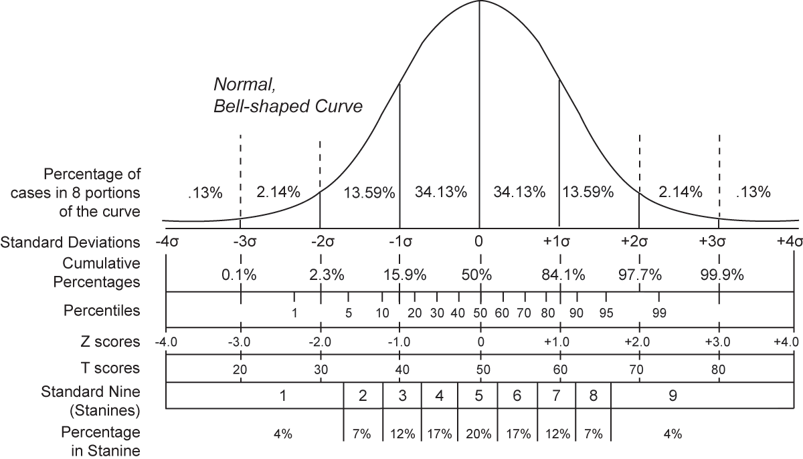
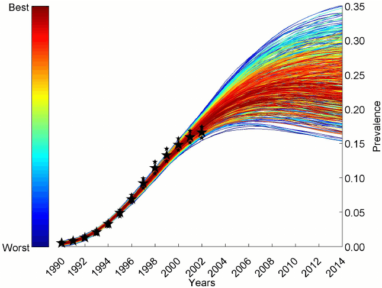
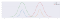
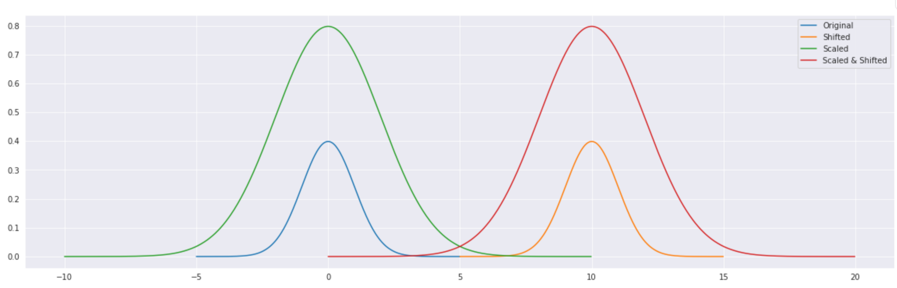
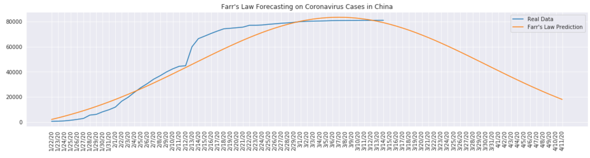
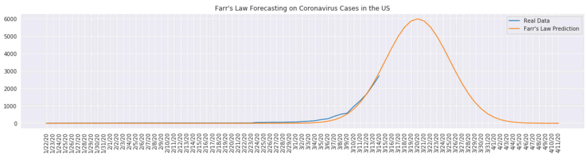
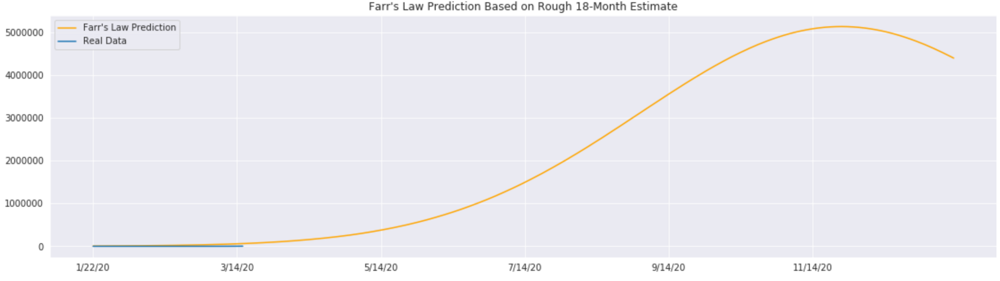
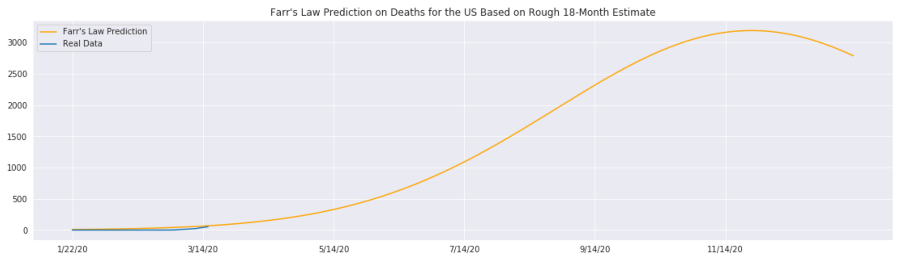

What the Law that Forecasted AIDS, Ebola, & SARS Has to Say About the Coronavirus

Anyone can publish on Medium per our [Policies](https://help.medium.com/hc/en-us/categories/201931128-Policies-Safety?source=post_page-----2473894f03c5----------------------), but we don’t fact-check every story. For more info about the coronavirus, see [cdc.gov](https://www.cdc.gov/coronavirus/2019-nCoV?source=post_page-----2473894f03c5----------------------).

Hi Source: [Pixabay](https://pixabay.com/photos/the-fear-coronavirus-epidemic-4915904/)

# What the Law that Forecasted AIDS, Ebola, & SARS Has to Say About the Coronavirus

## A Little-Known ‘Law of Epidemics’ from the 1840s

[Andre Ye](https://towardsdatascience.com/@andre_ye?source=post_page-----2473894f03c5----------------------)

[Mar 18](https://towardsdatascience.com/what-the-law-that-forecasted-aids-ebola-sars-has-to-say-about-the-coronavirus-2473894f03c5?source=post_page-----2473894f03c5----------------------) · ![](data:image/svg+xml,%3csvg xmlns='http://www.w3.org/2000/svg' width='19' height='19' viewBox='0 0 19 19' data-evernote-id='215' class='js-evernote-checked'%3e%3cg fill-rule='evenodd' data-evernote-id='216' class='js-evernote-checked'%3e%3cpath d='M4.13 12.21a15.4 15.4 0 0 1-2.54-2.28 6.61 6.61 0 0 1-.16-.2l-.25-.3.25-.3a13.08 13.08 0 0 1 .63-.7 15.4 15.4 0 0 1 1.7-1.51C5.55 5.54 7.5 4.7 9.51 4.7c.62 0 1.28.13 1.98.37l-.8.78a4.54 4.54 0 0 0-1.18-.18c-1.76 0-3.52.76-5.18 2.02-.58.45-1.12.93-1.58 1.41-.28.3-.28.36 0 .65a14.43 14.43 0 0 0 2.08 1.77l-.71.7zm3.05 1.57a6.32 6.32 0 0 0 4.61-.11c1-.38 2.04-.98 3.1-1.72a25.27 25.27 0 0 0 2.68-2.17l.37-.35-.37-.36a23.05 23.05 0 0 0-.76-.68 25.26 25.26 0 0 0-2.28-1.73l-.72.7a24.05 24.05 0 0 1 2.37 1.77c.2.17.2.42 0 .59-.57.49-1.2.97-1.84 1.43-1.01.7-2 1.26-2.9 1.61a5.4 5.4 0 0 1-1.92.42A6.6 6.6 0 0 1 8 13l-.81.78z' data-evernote-id='217' class='js-evernote-checked'%3e%3c/path%3e%3cpath d='M12.05 9.06a2.68 2.68 0 0 1-2.7 3A2.74 2.74 0 0 1 9 12l3.06-2.96zM9.72 6.79a2.83 2.83 0 0 0-.37-.02 2.68 2.68 0 0 0-2.7 3l3.07-2.98zM3.6 14.3l-.35.34.68.7.35-.34 10.4-10.08.36-.34-.68-.7-.35.34z' data-evernote-id='218' class='js-evernote-checked'%3e%3c/path%3e%3c/g%3e%3c/svg%3e) Unlisted

There’s a little known statistical law from the 1840. Even though its creator, William Farr, is long gone, his simple Law of Epidemics has shown to be applicable to many modern events — and it has a lot to offer on the coronavirus.

* * *

*...*

*Note from the editors: *[*towardsdatascience.com*](https://slack-redir.net/link?url=http%3A%2F%2Ftowardsdatascience.com)* is a Medium publication primarily based on the study of data science and machine learning. We aren’t health professionals or epidemiologists. To learn more about the coronavirus pandemic, you can click *[*here*](https://slack-redir.net/link?url=https%3A%2F%2Fwww.who.int%2Femergencies%2Fdiseases%2Fnovel-coronavirus-2019)*.*

* * *

*...*

# What is Farr’s Law?

Farr’s Law states that epidemics tend to rise and fall in a roughly symmetric, Bell-curve shaped path (normal distribution).

A Bell Curve and statistical properties. [Source](https://upload.wikimedia.org/wikipedia/commons/b/bb/Normal_distribution_and_scales.gif). Image free to share and use commercially.

This means that in an epidemic, the number of cases starts out small, incrementally picking up pace, then slowing down as it reaches a peak, before sloping down at a roughly symmetrical rate to how it approached the peak, eventually dying down to the point where there are still a few cases (perhaps per year).

However, when forecasting the turnout of an epidemic with a limited amount of data, there are a variety of possible normal-like distributions that vary in standard deviation and means. Take this example that outlines various possible curves given some HIV data points (stars).

[Nadia Abuelazam](https://www.researchgate.net/profile/Nadia_Abuelezam/publication/262682750/figure/fig3/AS:296418733510658@1447683141717/HIV-epidemic-curves-from-the-fitting-procedures-This-graph-depicts-that-HIV-epidemic.png). Image free to use with credit.

Farr’s law says that the statistical normal distribution (with standard deviation of 1 and mean of 0) can be shifted (all values of *x* increased by some constant) or scaled (*x* and *y* values multiplied by some constant) to fit the data.

However, the standard deviation should remain as close to 1 as possible — this is the defining feature of a Bell curve. Sometimes the standard deviation needs to be adjusted to account for real-world context, such as the scale of dates.

Farr’s law has shown itself useful in several epidemics, including AIDS (and HIV), Ebola, and SARS. Part of what makes it successful in epidemic forecasting is that it does not rely on complex polynomial regressions that fit the data in certain segments and then spin wildly out of control — but more importantly, it agrees with what epidemiology says about the nature of epidemics and pandemics, namely;

- The epidemic starts off small, with a few people infected.
- The epidemic progressively gets worse as the number of people infected grows exponentially (the derivative goes up).
- At some point, most everyone within the region of infection who is susceptible to being infected has been infected, and the infection rate begins to become less steep (the derivative decreases closer to 0).
- The epidemic/pandemic reaches a peak. This is usually when some solution or vaccine is introduced and implemented across a reasonable area.
- More people are being infected, but progressively less and less, until it reaches near zero
- At the tail of the epidemic, a few people (perhaps who have not been vaccinated from the virus) will still get the virus every year.

So what does Farr’s law have to say about the coronavirus?

* * *

*...*

# Applying Farr’s Law to the Coronavirus

China’s situation with the coronavirus seems to be dying down. Just from the real world data, one can identify the gradual slowing down of cases signature of a peak. The number of coronavirus cases in China will probably begin to be tapering down in the next few weeks.

With the United States, there is much less data as the epidemic has only really began to accelerate. Here’s a very, *very* optimistic estimate.

This reveals one issue with Farr’s law — when there is little data, it is difficult to scale the normal distribution. The estimate could have just as easily been

However, Farr’s Law is helpful in that if given one of two variables — the expected time frame (how wide the normal distribution will be) or the maximum expected given confirmed cases (how large the peak is), Farr’s law can solve for the other variable.

Given the White House’s recent estimate of an 18-month-long pandemic, here is an estimate for how the coronavirus might run through the US. It would peak at a little over 5 million people (out of a 327 million population).

Be aware — the dataset we are working with is confirmed cases. Health agencies have stated that demographics at low risk of the coronavirus do not need to be tested, which may mean that the data under-captures the true number of confirmed cases.

The number of deaths does not have the same issue. The current number of deaths is still very low, but according to Farr’s Law the deaths will peak at 3,000 deaths (.0009% of the US population, 1 in every 109,000 people).

Note that Farr’s law, like many forecasting methods, has a weakness in that it is limited to numerical data — it is much like predicting the stock market without knowledge of what is happening politically or economically. The most trustworthy sources are from the CDC and other health organizations that have access to more dimensions of data than Farr’s law has.

* * *

*...*

# Conclusion

Farr’s Law is an incredibly simple tool to map out the general trend of epidemics and pandemics. While it succeeds at doing this, it has little access to higher dimensions of data and could be wrong in the finer details. The fact is that the coronavirus will get worse for the next few months — but when the death count begins to slow down, you have Farr’s Law to know that the coronavirus has probably reached its peak.