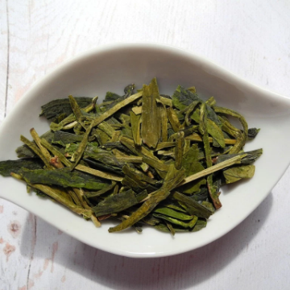

What the heck is going on with measures of programming language popularity? – TechCrunch

What the heck is going on with measures of programming language popularity? – TechCrunch

https://techcrunch.com/2018/09/30/what-the-heck-is-going-on-with-measures-of-programming-language-popularity/amp/

What the heck is going on with measures of programming language popularity? Jon Evans @rezendi / 1 week ago I looked at the TIOBE index today, as I do every so often, as most of the software pros I know do every so often. It purports to measure the popularity of the world’s programming languages, and its popularity-over-time chart tells a simple story: Java and C are, and have been since time immemorial, by some distance the co-kings of language. But wait. Not so fast. The rival “ PYPL Index ” (PopularitY of Programming Languages) says that Python and Java are co-kings, and C (which is lumped in with C++, surprisingly) is way down the list. What’s going on here?