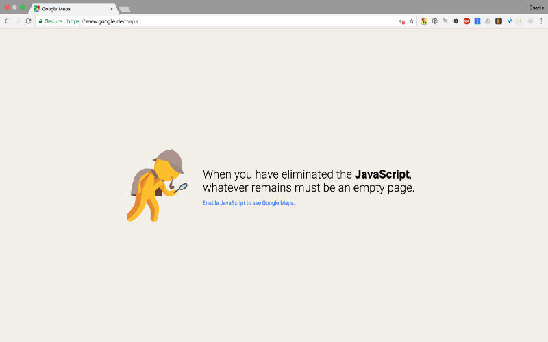
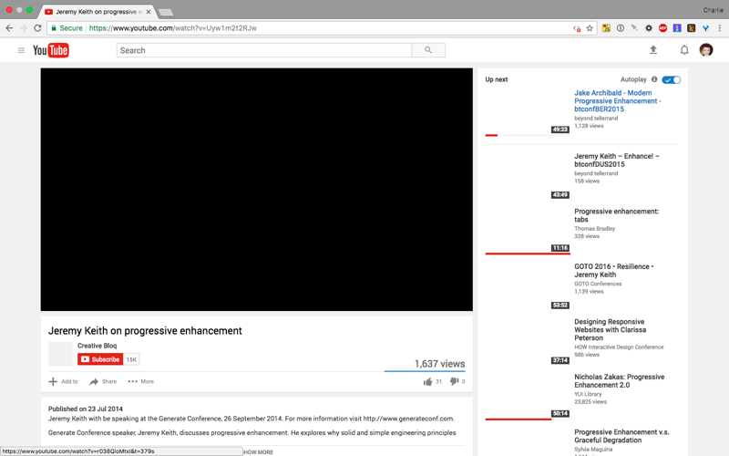
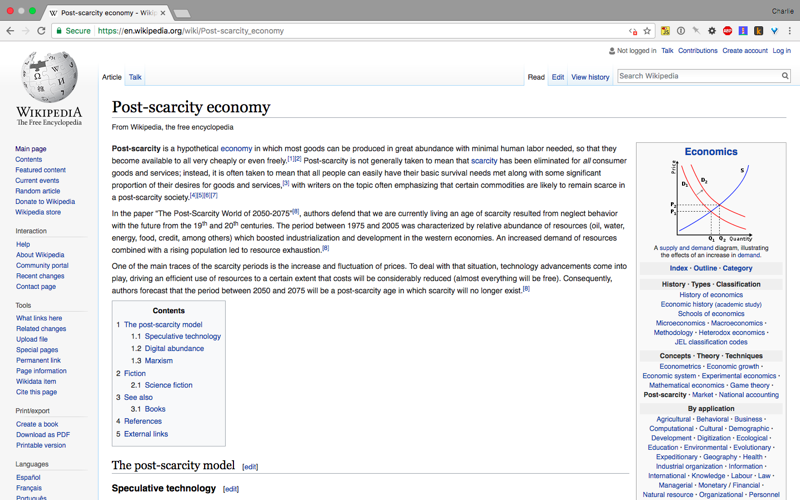

What the web looks like without JavaScript – freeCodeCamp

# What the web looks like without JavaScript

Google Maps when you turn off JavaScript

A Berlin-based web developer — who codes JavaScript for a living — decided to go an entire day without JavaScript.

Let’s face it — in an insane world where the average webpage is 2.4 megabytes — [the same size as the 1993 game Doom](https://fcc.im/2rClKqV) — turning off JavaScript completely can seem like a sane thing to do.

Well, here are her main observations after disabling JavaScript in the browser for a day:

- •The web is really fast without JavaScript
- •There aren’t any ads. No auto-playing videos or “tell us your email address” pop-ups.
- •But… a lot of websites don’t work at all. Images don’t load, and forms can’t be submitted.

Here’s what several popular websites she visited looked like with JavaScript disabled:

**YouTube**’s videos and thumbnails don’t load.

**Netflix** doesn’t load anything except for its logo in the upper left hand corner.

**Amazon** looks a bit odd, but it still works.

**Wikipedia** still works great.

You can read her full thoughts on her day without JavaScript experiment here: ([6 minute read](https://fcc.im/2sEuawe))

### Here are three other links worth your time:

1. 1How to travel the world as a developer ([8 minute read](https://fcc.im/2rWzCwH))

2. 2Going Serverless: how to run your first AWS Lambda function in the cloud ([8 minute read](https://fcc.im/2r3n5YW))

3. 3Between the Wires: An interview with core contributors to MooTools ([20 minute read](https://fcc.im/2rWvGMd))

### Thought of the day:

> “Any application that can be written in JavaScript, will eventually be written in JavaScript.” — Atwood’s Law

### Funny of the day:

The Stack Overflow keyboard

### Study group of the day:

[freeCodeCamp Berlin](https://fcc.im/2r2VeYY)

Happy coding!
– Quincy Larson, teacher at [freeCodeCamp](http://bit.ly/2j7Q1dN)

If you get value out of these emails, please consider [supporting our nonprofit](http://bit.ly/donate-to-fcc).