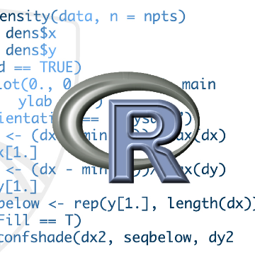

Whats The Best Way To Learn The Programming Language R?

Whats The Best Way To Learn The Programming Language R?

http://houseofbots.com/news-detail/4102-1-whats-the-best-way-to-learn-the-programming-language-r

As data becomes an ever larger part of work, for many people spreadsheets just are not enough. Programs like Microsoft Excel and Google Sheets are powerful tools, but they have limitations i