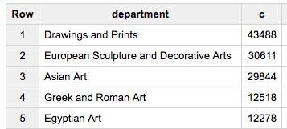
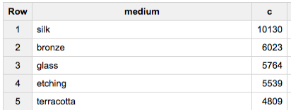
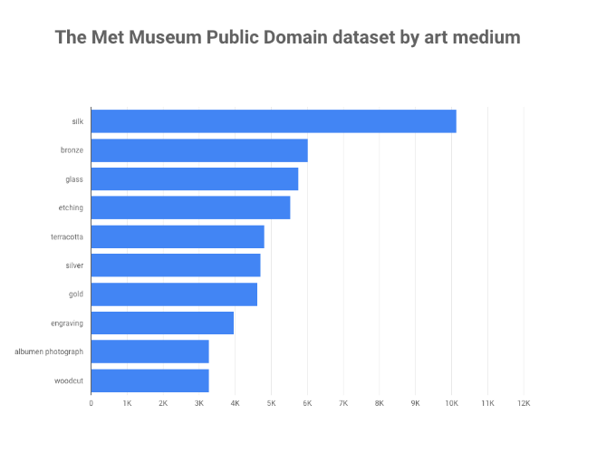
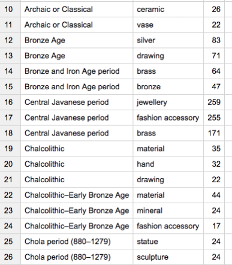
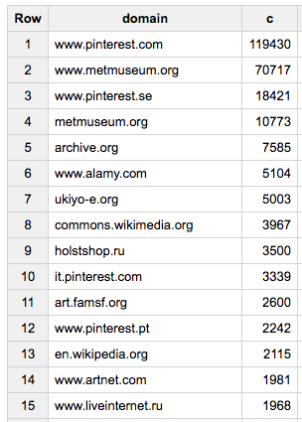
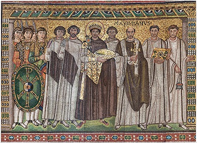

When art meets big data: Analyzing 200,000 items from The Met collection in BigQuery | Google Cloud Big Data and Machine Learning Blog  |  Google Cloud Platform

 

## [When art meets big data: Analyzing 200,000 items from The Met collection in BigQuery](https://cloud.google.com/blog/big-data/2017/08/when-art-meets-big-data-analyzing-200000-items-from-the-met-collection-in-bigquery.html)

Monday, August 7, 2017

### This new public dataset is invaluable for anyone who wants to learn how to build a custom machine-learning model, create an app for sorting and visualizing the images, and more.

*By Sara Robinson, Developer Advocate*

Today we’re adding a [new public dataset](https://bigquery.cloud.google.com/dataset/bigquery-public-data:the_met?pli=1) to Google BigQuery: over 200,000 items from [The Metropolitan Museum of Art](http://www.metmuseum.org/) (aka “The Met”), representing all its public domain art from a total of 1.5 million art objects. The Met Museum Public Domain dataset includes metadata about each piece of art, along with an image or images of the artifact. Google and The Met Museum have been close collaborators for years through [Google Arts & Culture](https://www.google.com/culturalinstitute/beta/partner/the-metropolitan-museum-of-art) and we’re incredibly excited to bring the museum's public dataset to BigQuery.

Let’s dive right into the data by looking at the museum departments represented by our collection:

hdr_weak

	#standardSQL
	SELECT department, COUNT(*) c
	FROM `bigquery-public-data.the_met.objects`
	GROUP BY 1
	ORDER BY c DESC

Similarly, we can find the top media used for the items in our collection. `medium` is a comma-separated string in the table, so we’ll use `SPLIT` to get the results:

hdr_weak

	#standardSQL
	SELECT
	      LOWER(label) as medium,
	      COUNT(*) c
	FROM `bigquery-public-data.the_met.objects`,
	UNNEST(SPLIT(medium, ',')) label
	GROUP BY 1
	ORDER BY c DESC

We can use [Google Data Studio](https://datastudio.google.com/) to visualize the results from both of these queries:

### 

### 

### Analyzing the image data

Because art is visual, our analysis can only go so far by looking at metadata. We’ve got images for 200,000 pieces of art - that’s a lot of pixels! I took one image for each of our 200,000 pieces and sent it to the [Cloud Vision API](https://cloud.google.com/vision/). Then I took the Cloud Vision API’s JSON response and stored the result in a [BigQuery table](https://bigquery.cloud.google.com/dataset/bigquery-public-data:the_met?pli=1). This gives us lots of information on each piece of art: what’s in the image, where the image can be found on the web, urls of similar images, and more. For details on how I processed these images, check out [this post](https://medium.com/the-node-js-collection/processing-a-large-dataset-in-less-than-100-lines-of-node-js-with-async-queue-9766a78fa088).

### Labels by time period

To start, let’s JOIN the time period for each piece of art from our metadata table with the labels returned by the Cloud Vision API’s label detection method. This query will give us the top 3 labels for each time period:

hdr_weak

	#standardSQL
	SELECT period, description, c FROM (
	  SELECT
	a.period,
	b.description,
	count(*) c,
	row_number() over (partition by period order by count(*) desc) seqnum
	  FROM `bigquery-public-data.the_met.objects` a
	  JOIN (
	    SELECT
	        label.description as description,
	        object_id
	    FROM `bigquery-public-data.the_met.vision_api_data`, UNNEST(labelAnnotations) label
	  ) b
	  ON a.object_id = b.object_id
	  WHERE a.period is not null
	  group by 1,2
	)
	WHERE seqnum <= 3
	AND c >= 10 # only include labels that have 10 or more pieces associated with it
	AND description != "art"
	ORDER BY period, c desc

### 

Cloud Vision API web detection

The web detection feature of the Cloud Vision API finds all the pages on the internet where our image exists, along with the URLs of visually similar images. With web detection we also get a list of entities - these are labels describing the image based on the context of where it was found on the web. Let’s look at the web detection response we get back for this image:

Creative Commons Zero http://www.metmuseum.org/art/collection/search/23939
Here’s a sample of the JSON response:
hdr_weak

	  "webDetection": {
	    "webEntities": [
	      {
	        "entityId": "/m/09c7b",
	        "score": 3.07616,
	        "description": "Metropolitan Museum of Art"
	      },
	      {
	        "entityId": "/m/02jx1",
	        "score": 1.0786,
	        "description": "England"
	      },
	      {
	        "entityId": "/m/04rjz",
	        "score": 0.75304,
	        "description": "Middle Ages"
	      },
	      {
	        "entityId": "/m/0x44",
	        "score": 0.74545,
	        "description": "Armour"
	      },
	      ...
	    ],
	    "fullMatchingImages": [
	      {
	        "url": "http://images.metmuseum.org/CRDImages/aa/original/DT753.jpg"
	      },
	      ...
	    ],
	    "pagesWithMatchingImages": [
	      {
	        "url": "http://www.metmuseum.org/art/collection/search/23939"
	      },
	      ...
	    ],
	    "visuallySimilarImages": [
	      {
	        "url": "https://s-media-cache-ak0.pinimg.com/736x/ce/c9/34/cec9340be5a4d789fd1156413140dd75.jpg"
	      },
	      ...
	    ]
	  }

Notice that we get the URLs for all exact image matches and the pages where those images were found. This can be used to see all the places a particular image has been shared. For our Met dataset, we’ll find the most common domains where our images are found on the web with this query:

hdr_weak

	#standardSQL
	SELECT REGEXP_EXTRACT(page.url, '//([^/]*)/?') domain, COUNT(*) c
	FROM `bigquery-public-data.the_met.vision_api_data`,
	UNNEST(webDetection.pagesWithMatchingImages) as page
	GROUP BY 1
	ORDER BY c DESC

And here’s the result in BigQuery:

### Sorting images by color

The Cloud Vision API can also find the dominant colors in an image and the RGB value for those colors, so sort our images by color. The following query will give us the URLs of all the images that are a particular shade of blue:

hdr_weak

	#standardSQL
	SELECT
	color.color.red as r,
	color.color.green as g,
	color.color.blue as b,
	concat("https://storage.cloud.google.com/gcs-public-data--met/",
	cast(object_id as string), "/0.jpg") as img_url
	FROM `bigquery-public-data.the_met.vision_api_data`,
	UNNEST(imagePropertiesAnnotation.dominantColors.colors) color
	WHERE color.color.red < 0x64
	AND (color.color.green > 0x96 or color.color.green < 0xC8)
	AND color.color.blue > 0xC8

Here’s a sample:

Creative Commons Zero http://www.metmuseum.org/art/collection/search/544864 ​

Creative Commons Zero http://www.metmuseum.org/art/collection/search/5592

Creative Commons Zero http://www.metmuseum.org/art/collection/search/2941

### Which images contain famous landmarks?

We can use the Vision API’s `landmarkAnnotations` feature to identify common landmarks in our photos (more on that [here](https://cloud.google.com/blog/big-data/2016/09/around-the-world-landmark-detection-with-the-cloud-vision-api)), so I was interested to see if it was able to extract a landmark from items in The Met collection.

The following query returns the images containing landmarks, sorted by the Vision API’s confidence score:

hdr_weak

	#standardSQL
	SELECT b.object_id, b.original_image_url, landmark.description, landmark.mid, landmark.score
	FROM `bigquery-public-data.the_met.vision_api_data` a,
	UNNEST(landmarkAnnotations) landmark
	JOIN (
	  SELECT object_id, original_image_url, gcs_url
	  FROM `bigquery-public-data.the_met.images`
	) b
	ON a.object_id = b.object_id
	AND ends_with(lower(b.gcs_url), '/0.jpg')
	ORDER BY score DESC

The API identified this photograph from the collection as Yosemite with 98% confidence:

Creative Commons Zero http://www.metmuseum.org/art/collection/search/689997
And it knew this piece of art was from the Basilica of San Vitale in Italy:

Creative Commons Zero http://www.metmuseum.org/art/collection/search/466586

### Next steps

These examples just scratch the surface of what you can do with [this dataset](https://bigquery.cloud.google.com/dataset/bigquery-public-data:the_met?pli=1): there are possibilities for comparing the images with other art collections, using the data to build and train a custom machine learning model, building an app for sorting and visualizing the images, and more. I’d love to see what you do with the Met data--leave a comment or find me on Twitter [@SRobTweets](https://twitter.com/srobtweets).

To learn more about the Cloud Vision API, try it out on your own images by uploading them [directly in the browser](https://cloud.google.com/vision) to see the API response. Then start diving into code by going through the Cloud Vision API [quickstart](https://cloud.google.com/vision/docs/quickstart).

Stay tuned for more posts exploring this dataset, including training a model on the Met data using TensorFlow, and for many exciting collaborations between Google and The Met.