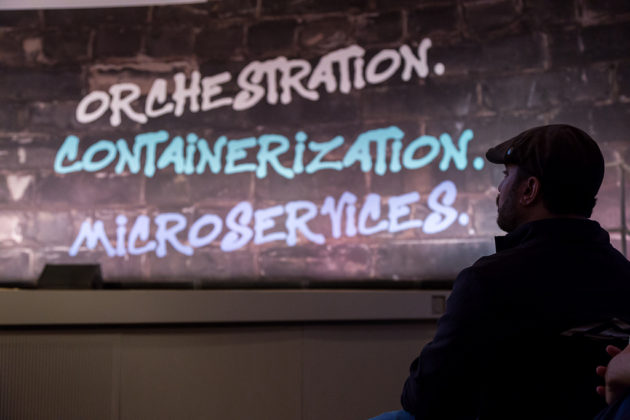
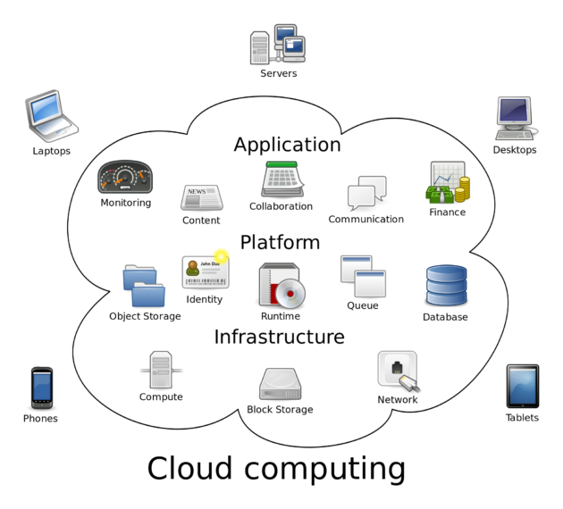

When standards aren’t standard: Inside a growing movement to shape the booming cloud industry

 [Cloud Tech](https://www.geekwire.com/cloud/)

Presented by

# When standards aren’t standard: Inside a growing movement to shape the booming cloud industry

**by [Tom Krazit](https://www.geekwire.com/author/tomkrazit/)** on June 2, 2017 at 9:15 am

 [1 Comment](https://www.geekwire.com/2017/standards-arent-standard-inside-growing-movement-shape-booming-cloud-industry/#disqus_thread)  [ Share  25]()  [ Tweet](https://twitter.com/intent/tweet?url=https%3A%2F%2Fwww.geekwire.com%2F2017%2Fstandards-arent-standard-inside-growing-movement-shape-booming-cloud-industry%2F&via=GeekWire&text=When%20standards%20aren%E2%80%99t%20standard%3A%20Inside%20a%20growing%20movement%20to%20shape%20the%20booming%20cloud%20industry&related=tomkrazit%3AAuthor)  [ Share  186](https://www.linkedin.com/shareArticle?mini=true&url=https%3A%2F%2Fwww.geekwire.com%2F2017%2Fstandards-arent-standard-inside-growing-movement-shape-booming-cloud-industry%2F&title=When%20standards%20aren%E2%80%99t%20standard%3A%20Inside%20a%20growing%20movement%20to%20shape%20the%20booming%20cloud%20industry&summary=What%E2%80%99s%20the%20best%20way%20to%20shepherd%20the%20promising%20technologies%20underpinning%20a%20sea%20change%20in%20computing%3F%20The%20Cloud%20Native%20Computing%20Foundation%20is%20determined%20not%E2%80%A6&source=GeekWire)  [ Reddit](https://www.reddit.com/submit?url=https%3A%2F%2Fwww.geekwire.com%2F2017%2Fstandards-arent-standard-inside-growing-movement-shape-booming-cloud-industry%2F)  [ Email](https://www.geekwire.com/2017/standards-arent-standard-inside-growing-movement-shape-booming-cloud-industry/mailto:?subject=When%20standards%20aren%E2%80%99t%20standard%3A%20Inside%20a%20growing%20movement%20to%20shape%20the%20booming%20cloud%20industry&body=Article%20from%20GeekWire:%0D%0A%0D%0AWhen%20standards%20aren%E2%80%99t%20standard%3A%20Inside%20a%20growing%20movement%20to%20shape%20the%20booming%20cloud%20industry%0D%0A%0D%0Ahttps%3A%2F%2Fwww.geekwire.com%2F2017%2Fstandards-arent-standard-inside-growing-movement-shape-booming-cloud-industry%2F%0D%0A)

 [FAQ: What to know for the Cloud Tech Summit](https://www.geekwire.com/2017/geekwire-cloud-tech-summit-know-youre-attending-wednesdays-big-tech-conference/)

An attendee at CloudNativeCon + KubeCon Europe. ([Cloud Native Computing Foundation Photo](https://flic.kr/p/SeXUQq))

What’s the best way to shepherd the promising technologies underpinning a sea change in computing? The [Cloud Native Computing Foundation](https://www.cncf.io/) is determined not to make the same mistakes as past tech industry standards-setting groups, favoring community encouragement and a light touch.

[Launched almost two years ago](https://www.sdxcentral.com/articles/news/google-friends-launch-cloud-native-computing-foundation/2015/07/) as an offshoot of The Linux Foundation, the CNCF now boasts dozens of members and has accepted ten projects under its wing. The most prominent project in the CNCF remains Kubernetes, the container-orchestration system that Google donated to the CNCF upon its founding, but several other projects from a wide variety of cloud companies have started to form a blueprint of sorts for adopting modern cloud concepts such as microservices, containerization, and container orchestration across multiple cloud environments.

But ask nearly any member of the CNCF if they are trying to develop cloud-computing standards, and they’ll recoil in horror.

“We always had this strong intention that we don’t want to be seen as a kingmaker,” said Chris Wright, vice president and chief technologist at Red Hat and a member of the [CNCF Governing Board](https://www.cncf.io/people/governing-board/).

[CNCF Webinar Series Jamie Dobson Cloud Native Strategy](https://www.youtube.com/watch?list=PLj6h78yzYM2PKJZ9hZ8CtDxJMzO5I6lZL&v=MWQ-d8hQAj8)

This laissez-faire, vendor-neutral approach to cloud development is very much in keeping with the open-source philosophies that govern most of the participants’ approach to the tech world. But as cloud adoption really takes off among enterprises with more traditional approaches to computing, the pressure will grow for official standards that promise cloud interoperability and give end users an easier path to cloud-native application development practices.

And if the two biggest players in the public infrastructure cloud — Amazon Web Services and Microsoft Azure — remain on the sidelines of the CNCF, end users might find it hard to implement a cloud strategy that doesn’t have the tacit approval of their vendor.

## Clubhouse in the clouds

The CNCF was created in 2015 to create a “vendor-agnostic safe space for Kubernetes,” said Craig McLuckie, now Heptio’s CEO and a former Googler who developed Kubernetes with Heptio CTO Joe Beda. (Beda will be giving a talk on how older IT organizations should chart a course to modern infrastructure practices at our [Cloud Tech Summit](https://www.geekwire.com/events/geekwire-cloud-tech-summit-2017/) next week.) Since then, it has added nine other projects to its roster, [most recently CNI](https://www.geekwire.com/2017/cloud-native-computing-foundation-adds-coreos-backed-cni-latest-hosted-project/), a method for connecting containers with outside networking resources.

Dan Kohn, executive director, Cloud Native Computing Foundation

“We are not developing any of the software projects or specifications in house. We’re finding the best of breed projects in these different spaces and bringing them together and we’re making some investments to show that they do work well together and produce a cohesive stack,” said Dan Kohn, executive director of the CNCF.

One of the main goals of CNCF was to avoid the rancor that had accompanied the [OpenStack](https://www.openstack.org/) project, an earlier top-down effort to define open-source standards around cloud-computing technology that turned into [a disheartening and unproductive battle](https://stochasticresonance.wordpress.com/2013/11/04/openstack-a-plea/) between vendors, according to several members of the CNCF interviewed for this story.

What we think of as “the cloud” is actually a compilation of multiple products and services that allow companies to define the best setup for their applications. This includes everything from containers themselves to the resources that need to connect those containers with networking, storage, and all other parts of the computing stack.

A primer on the components of cloud computing. (Courtesy: Wikimedia)

OpenStack tried to define that recipe for everybody, and [that approach didn’t work as well as some had hoped](https://rackn.com/2017/05/31/openstack-pivot-kubernetes/) for something as complex as modern cloud computing. The CNCF is trying to do the opposite, elevating projects that have already won widespread developer support and giving those projects the help they need to flourish.

“When people think about standards, it carries a lot of negative connotations,” McLuckie said. “We wanted to take a community-first approach.”

It works like this: developers working on open-source projects that solve an outstanding problem with an area of cloud-native technologies can [submit them to the CNCF through Github](https://github.com/cncf/toc/blob/master/process/project_proposals.adoc). The Technical Oversight Committee — [a who’s who of cloud engineering talent](https://www.cncf.io/people/technical-oversight-committee/) — meets twice a month to discuss projects, and the approval of a supermajority of its nine members is required to accept a project into the fold. ([Here are the notes of the most recent meeting](https://docs.google.com/presentation/d/1SHfBDI3YeyCTJ3ZrGoc0S4EmfHsUVW2jMmXmcYQe96E/edit#slide=id.gd5ae4e962_2_136).)

Projects selected for the CNCF are granted access to better documentation tools and testing suites that they might not have been able to employ on their own, as well as access to some of the best and brightest minds in cloud computing.

According to [a set of guidelines being drafted by the TOC](https://docs.google.com/document/d/1Yl3IPpZnEWJRaXSBsTQ22ymQF57N5x_nHVHvmJdAj9Y/edit): “The CNCF is a badge of quality and velocity. CNCF projects should be on a path to being tools that users can trust, broadly work together, and that meet other cloud native criteria.”

## Just don’t call it a standard

Formal tech industry standards bodies have a mixed track record.

There have been some great successes, such as [Wi-Fi](http://www.wi-fi.org/): imagine a world in which Wi-Fi providers competed like wireless carriers. There have been some spectacular failures, such as DRAM in the 1990s, a process during which [Rambus somehow managed to get its own intellectual property](https://www.law360.com/articles/54058/rambus-case-may-impact-standard-setting-experts) accepted as part of the standard for PC memory and spent the next several years suing everybody.

The open-source world operates a little differently. If everyone is using the same basic underlying code as the basis for their commercial product, you’ve already coalesced around a de-facto standard. There are [66 different versions of Kubernetes](https://docs.google.com/spreadsheets/d/1LxSqBzjOxfGx3cmtZ4EbB_BGCxT_wlxW_xgHVVa23es/edit#gid=0) in use by commercial vendors such as Microsoft and Red Hat and small community projects like [Clocker](http://www.clocker.io/), and “most of them are 99 percent the same,” Kohn said.

However, the extremely complex nature of modern cloud-computing deployment almost cries out for rules, guidelines, blueprints: anything that prevents cloud newbies from making the same mistakes over and over. De-facto standards have emerged, like Docker and Kubernetes, but end users looking to move to the cloud still have to piece together the system that will work best for them either by evaluating all the different options or by throwing up their hands in frustration and hiring a consulting firm.

 We’re years away from standards, but eventually all things that come together and solidify end up with a standard at some point.

This is one of the most interesting things about the CNCF: it is trying to endorse certain methods for solving technology problems that work well together without enforcing a formal certification process in which vendors can use some sort of “CNCF-approved” marketing strategy to sell products based around the various CNCF projects.

The CNCF is taking baby steps toward a tighter governance model when it comes to Kubernetes — the crown jewel — by organizing a meeting last month to discuss conformance models for Kubernetes that will hopefully be available by the end of the year, Kohn said.

“The aspiration here is that there will be a set of comprehensive tests, and you can run that test to see that you are still conforming,” he said, adding that a successful test will grant those vendors the right to use some sort of “Powered by Kubernetes” badge in their marketing.

## Two elephants in the room

A core part of the mission of the CNCF is to identify open-source projects that allow end users to run workloads across multiple clouds, in hopes of [avoiding the dreaded “lock-in”](https://www.geekwire.com/2017/coreos-ceo-amazon-web-services-heading-proprietary-path/) so associated with the previous generation of enterprise technology companies. But one of the problems with this approach is that the two leading cloud providers aren’t formally involved with the CNCF, although they do support some of the projects hosted by the foundation, namely Kubernetes.

There’s little financial incentive for AWS to make it easy for its customers to move workloads between its services and those of its rivals. Instead, AWS has focused on making it [easier for its customers to use Amazon-developed services](https://www.geekwire.com/2017/new-goodies-aws-customers-include-database-accelerators-tech-behind-alexa/) that accomplish many of the same goals, which can be seen as a win-win from its perspective: the customer’s experience has improved, and AWS has kept that workload on its servers.

But at certain level, AWS and Microsoft don’t really want to develop a completely custom cloud computing service that doesn’t take advantage of the rapid-fire pace of innovation in the open-source community. And if they bet on the wrong technological approach and lose developers because their effort isn’t as good as what the community produces, they lose accounts; both companies spend millions of dollars wooing developers to their sides for just this reason.

There have been talks between the CNCF and the two cloud companies about joining, according to CNCF representatives, but no agreements have been reached. Both AWS and Microsoft declined to comment on any discussions they might have had with the CNCF.

It feels necessary in almost every story about the cloud to note that even though many of us have been talking about cloud computing for over a decade, it is still a relatively new phenomenon in enterprise computing. A [majority of IT applications still run the old-fashioned way](https://www.geekwire.com/2017/dell-technologies-makes-case-safe-place-spend-budget/), on servers purchased, deployed, and maintained by the organization responsible for that product.

That means there are still lots of open questions about how cloud computing will evolve, and it will take a long time for the industry to settle on a basic template for the best way to move workloads to the cloud and improve them over time.

“We’re years away from standards, but eventually all things that come together and solidify end up with a standard at some point,” said Todd Moore, vice president of open technology at IBM and chairman of the CNCF board.

Who will define the future of the cloud? The CNCF wants to make sure the open-source community has a seat at that table.

### Sponsor Post

### **[Salesforce is ready for you.](http://salesforce.com/tech)**

We pioneered the global shift to cloud, social, mobile, and data science technologies, and we’ve been disrupting enterprise software ever since. Are you ready to push your limits at the world’s fastest-growing enterprise software company? We’re looking for the industry’s best technical talent—we’re looking for you! [Join us](http://salesforce.com/tech) in our Bellevue office.

### More Cloud Tech

**[Spinnaker, an open-source project for continuous delivery, hits the 1.0 milestone](https://www.geekwire.com/2017/spinnaker-open-source-project-continuous-delivery-hits-1-0-milestone/)**

**[Amazon Web Services’ Swami Sivasubramanian on the future of AI in the cloud](https://www.geekwire.com/2017/amazon-web-services-swami-sivasubramanian-future-ai-cloud/)**

**[Seahawks legend and former Congressman Steve Largent on tech, sports, politics and Trump](https://www.geekwire.com/2017/seahawks-legend-former-congressman-steve-largent-feels-sorry-donald-trump/)**

***Tom Krazit, **GeekWire's Cloud & Enterprise Editor, covered technology for news organizations including IDG, CNET, and paidContent before serving as executive editor of Gigaom and the Structure conference series. Reach him at [tom@geekwire.com](https://www.geekwire.com/2017/standards-arent-standard-inside-growing-movement-shape-booming-cloud-industry/mailto:tom@geekwire.com) and follow him [@tomkrazit](https://twitter.com/tomkrazit).*

 [1 Comment](https://www.geekwire.com/2017/standards-arent-standard-inside-growing-movement-shape-booming-cloud-industry/#disqus_thread)  [ Share  25]()  [ Tweet](https://twitter.com/intent/tweet?url=https%3A%2F%2Fwww.geekwire.com%2F2017%2Fstandards-arent-standard-inside-growing-movement-shape-booming-cloud-industry%2F&via=GeekWire&text=When%20standards%20aren%E2%80%99t%20standard%3A%20Inside%20a%20growing%20movement%20to%20shape%20the%20booming%20cloud%20industry&related=tomkrazit%3AAuthor)  [ Share  186](https://www.linkedin.com/shareArticle?mini=true&url=https%3A%2F%2Fwww.geekwire.com%2F2017%2Fstandards-arent-standard-inside-growing-movement-shape-booming-cloud-industry%2F&title=When%20standards%20aren%E2%80%99t%20standard%3A%20Inside%20a%20growing%20movement%20to%20shape%20the%20booming%20cloud%20industry&summary=What%E2%80%99s%20the%20best%20way%20to%20shepherd%20the%20promising%20technologies%20underpinning%20a%20sea%20change%20in%20computing%3F%20The%20Cloud%20Native%20Computing%20Foundation%20is%20determined%20not%E2%80%A6&source=GeekWire)  [ Reddit](https://www.reddit.com/submit?url=https%3A%2F%2Fwww.geekwire.com%2F2017%2Fstandards-arent-standard-inside-growing-movement-shape-booming-cloud-industry%2F)  [ Email](https://www.geekwire.com/2017/standards-arent-standard-inside-growing-movement-shape-booming-cloud-industry/mailto:?subject=When%20standards%20aren%E2%80%99t%20standard%3A%20Inside%20a%20growing%20movement%20to%20shape%20the%20booming%20cloud%20industry&body=Article%20from%20GeekWire:%0D%0A%0D%0AWhen%20standards%20aren%E2%80%99t%20standard%3A%20Inside%20a%20growing%20movement%20to%20shape%20the%20booming%20cloud%20industry%0D%0A%0D%0Ahttps%3A%2F%2Fwww.geekwire.com%2F2017%2Fstandards-arent-standard-inside-growing-movement-shape-booming-cloud-industry%2F%0D%0A)

- [ ###### Previous Story Media Partners raises $1.1M to produce ‘Hollywood-grade’ training videos](https://www.geekwire.com/2017/media-partners-raises-1-1m-produce-hollywood-grade-training-videos/)

- [###### Next Story Sphere of influence: 46-story tower near Amazon campus will have domed top reminiscent of tech giant’s new landmark](https://www.geekwire.com/2017/sphere-influence-46-story-tower-near-amazon-campus-will-domed-top-reminiscent-tech-giants-new-landmark/)

 Filed Under: [Amazon](https://www.geekwire.com/amazon/) • [Cloud Tech](https://www.geekwire.com/cloud/) • [Microsoft](https://www.geekwire.com/microsoft/)  Tagged With: [Amazon Web Services](https://www.geekwire.com/tag/amazon-web-services/) • [Chris Wright](https://www.geekwire.com/tag/chris-wright/) • [Cloud Native Computing Foundation](https://www.geekwire.com/tag/cloud-native-computing-foundation/) • [Craig McLuckie](https://www.geekwire.com/tag/craig-mcluckie/) • [Dan Kohn](https://www.geekwire.com/tag/dan-kohn/) • [Heptio](https://www.geekwire.com/tag/heptio/) • [IBM](https://www.geekwire.com/tag/ibm/) • [Red Hat](https://www.geekwire.com/tag/red-hat/) • [Todd Moore](https://www.geekwire.com/tag/todd-moore/)

### GeekWire Newsletters

Subscribe to GeekWire's free newsletters to catch every headline

 Email address

### Send Us a Tip

Have a scoop that you'd like GeekWire to cover? Let us know.

 [Send Us a Tip](https://www.geekwire.com/tips/)

### [See More](https://www.geekwire.com/events/)GeekWire Events

     