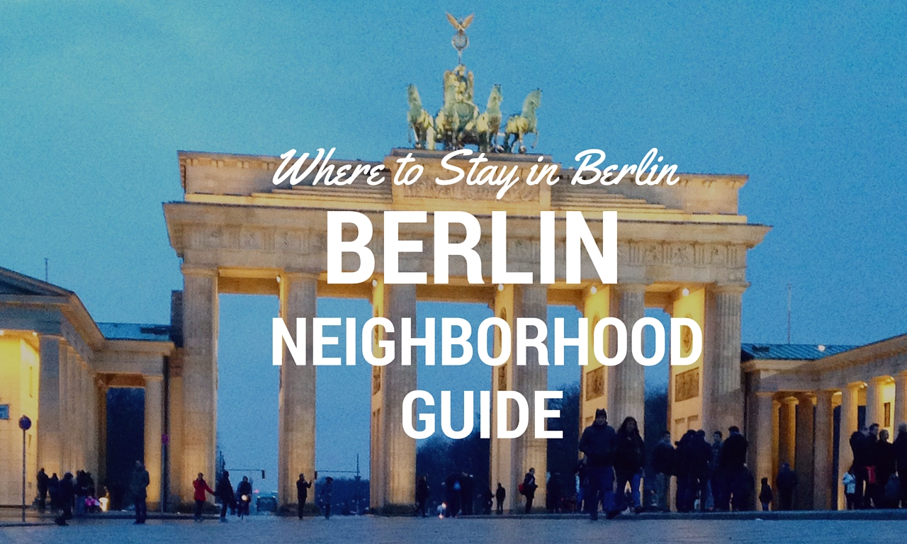
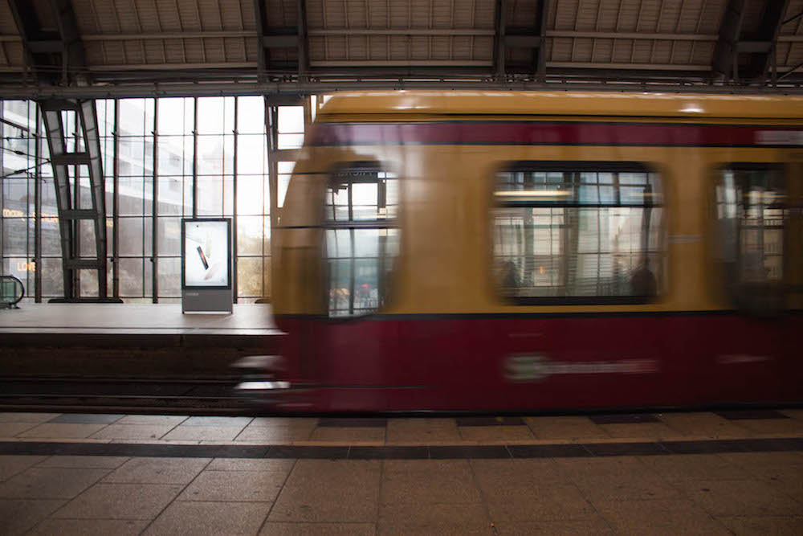
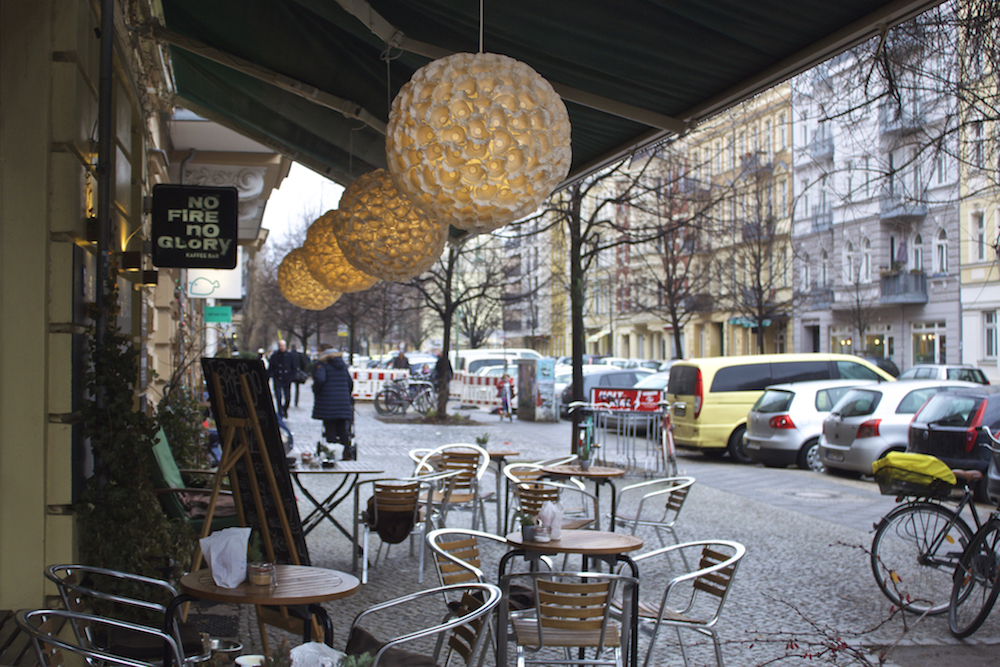
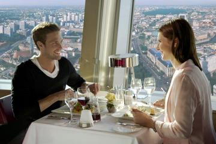
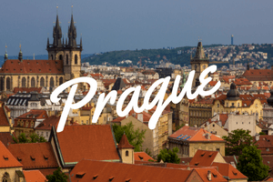
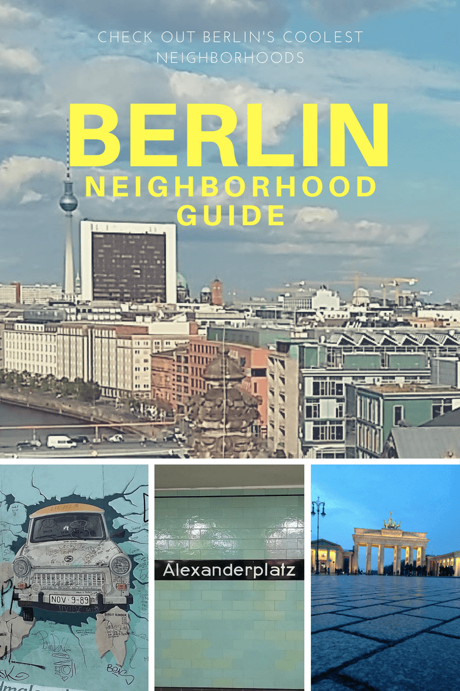

Where to Stay in Berlin

# Where to Stay in Berlin: Berlin’s Coolest Neighborhoods

by [Katie Matthews](https://www.wandertooth.com/author/katie/) | Jul 15, 2016 | [5 comments](https://www.wandertooth.com/where-to-stay-in-berlin-neighborhoods/#respond)

[initialinitialinitial*j*initial Share](https://www.facebook.com/share.php?u=http%3A%2F%2Fbit.ly%2F2kKUf8t)

[initialinitialinitial*b*initial Pin]()

[initialinitialinitial*s*initial Tweet](https://twitter.com/share?original_referer=/&text=Where+to+stay+in++Berlin%2C+according+to+a+local.+Best+Berlin+neighborhoods+to+stay+%26+visit&url=http://bit.ly/2kKUf8t&via=wandertooth)

[initialinitialinitial*q*initial Stumble](http://www.stumbleupon.com/submit?url=https://www.wandertooth.com/where-to-stay-in-berlin-neighborhoods/&title=Where+to+Stay+in+Berlin)

[initialinitialinitial*h*initial +1](https://plus.google.com/share?url=http%3A%2F%2Fbit.ly%2F2kKUf8t)

[initialinitialinitial*C*initial Flip](https://share.flipboard.com/bookmarklet/popout?v=2&title=Tools%20-%20Flipboard&url=http%3A%2F%2Fbit.ly%2F2kKUf8t)

**Where to Stay in Berlin: Advice from a local Canadian expat and travel blogger about the best neighborhoods to stay in Berlin, Germany! Includes recommendations for 23 of the best apartments and hotels to stay in Berlin. **

.

[bSave](http://pinterest.com/pin/create/bookmarklet/?media=https://15854-presscdn-0-0-pagely.netdna-ssl.com/wp-content/uploads/2016/07/Where-to-Stay-in-Berlin-Coolest-Neighborhood-Guide.jpg&url=https://www.wandertooth.com/where-to-stay-in-berlin-neighborhoods/&is_video=false&description=Where%20to%20Stay%20in%20Seville%20Spain)

***Disclosure:**** All our Where to Stay Guides, including this one, contain affiliate links. That means we earn a small commission when you click through or [book a hotel](https://www.wandertooth.com/vwgm), [buy your travel insurance](https://www.wandertooth.com/o3mz), etc.. You don’t pay anything extra. Affiliate links are one of the ways we make money from this blog ([our travel-inspired adult coloring books](http://amzn.to/2ds0kG0) are another way) to keep the laptops humming!*

### Where to Stay in Berlin: Start Here For A Quick Look At Berlin’s Coolest Neighborhoods

If you’re looking for quick answer about the best area to stay in Berlin, you’ve come to the right place. And while we’ve outlined all the best places to stay in Berlin in some detail below, we also wanted to provide an at-a-glance summary to help you choose where to stay in Berlin. So you can start out by checking out this summary of Berlin’s best neighborhoods, and then click on the neighborhood names in blue to go straight to that section.

If you’re not sure where to stay in Berlin and don’t already have a neighborhood in mind, skip over this section and read the whole post, which outlines in detail the best places to stay in Berlin!

- **[Prenzlauerberg](https://www.wandertooth.com/where-to-stay-in-berlin-neighborhoods/#Prenzlauerberg): **Stay in Prenzlauerberg if you’re looking for a bohemian-meets-bourgeois vibe filled with beautiful buildings, modern design, and hip cafés and wine bars…all with a relaxed vibe.
- **[Kreuzberg](https://www.wandertooth.com/where-to-stay-in-berlin-neighborhoods/#Kreuzberg): **Stay in Kreuzberg if you want an alternative, subversive cool – Berlin’s home to punk rock, LGBTQI-friendly, and politically left wing types. East Kreuzberg (Kreuzberg 61) is edgier, and West Kreuzberg (SO36) is more gentrified.
- **[Friedrichshain](https://www.wandertooth.com/where-to-stay-in-berlin-neighborhoods/#Friedrichshain): **Stay in Friedrichshain if you’re looking for an artsy-alternative vibe, want to be close to Berlin’s best clubs, or are interested in digging into many of former East Berlin’s biggest attractions, such as the Eastside Gallery.
- **[Neukölln](https://www.wandertooth.com/where-to-stay-in-berlin-neighborhoods/#Neukolln): **Stay in Neukölln if you want the coolness of Kreuzberg, with way fewer visitors and tourists, and you’re as happy to hang out Berlin style as you are to go sightseeing. *(This section is under development!)*
- **[Mitte](https://www.wandertooth.com/where-to-stay-in-berlin-neighborhoods/#Mitte): **Stay in Mitte if you want an upmarket experience that’s right in the center of many of Berlin’s biggest attractions.
- **[Wedding](https://www.wandertooth.com/where-to-stay-in-berlin-neighborhoods/#Wedding): **Stay in Wedding if you want multicultural-meets-hipster, combining street art, man buns, beards, and artists, with shops and services from around the world, and are looking for rough-around-the-edges cool.
- **[Schöneberg](https://www.wandertooth.com/where-to-stay-in-berlin-neighborhoods/#Schöneberg): **Stay in Schöneberg if you want to be close to Berlin’s best shopping, and love glamorous turn-of-the-century buildings, wide open boulevards, and cute bars that once housed some of Berlin’s most famous foreigners including David Bowie and Nick Cave.
- **[Charlottenburg](https://www.wandertooth.com/where-to-stay-in-berlin-neighborhoods/#Charlottenburg): **Stay in Charlottenburg if you want a genteel and quiet residential vibe, all while having access to high-end restaurants, cafés and shops.

### Also Check Out

- **[Top Berlin Guide Books](https://www.wandertooth.com/where-to-stay-in-berlin-neighborhoods/#guidebooks):** A selection of the top rated Berlin city guide books. Available in both Kindle and paperback.
- **[Top Berlin Tours](https://www.wandertooth.com/where-to-stay-in-berlin-neighborhoods/#tours):** Top rated Berlin city tours.
- **[More Where to Stay Guides](https://www.wandertooth.com/where-to-stay-in-berlin-neighborhoods/#wheretostay):** Check out more of our Where to Stay City Guides for other popular destinations from Berlin to help you plan.

### Where to Stay in Berlin: Our Top 10 Hotel Picks for Berlin

If you’re in a rush and want the quick and dirty on the best places to stay in Berlin, take a peek at my Top 10 hotel picks for Berlin (these are a combo of the ones our readers book the most, and the ones I want to stay in the most).

Most visitors to Berlin stay in Mitte, and there’s a great reason for that: it’s uber convenient, and will put you in the centre of the action.** If you want to stay in Mitte, we’d suggest you consider the following hotels:**

- **[Hotel Casa Camper](https://www.wandertooth.com/nksp) (Luxury – Mitte) **— An ultra funky luxury boutique hotel in the super cool Hackescher Markt area of Mitte. Rates an impressive 9.5/10 on Booking.com.
- **[Boutique Hotel i31 Berlin Mitte](https://www.wandertooth.com/toaa) (MidRange – Mitte) **— A modern design hotel right near an U-Bahn and S-Bahn station in Mitte. Rates 9.2/10 on Booking.com.
- **[Grimm’s Hotel am Potsdamer Platz](https://www.wandertooth.com/cgh0) (MidRange – Mitte) **— A Grimm’s fairytale-themed affordable boutique hotel at Potsdamer Platz. Rates 9.1/10 on Booking.com.
- **[Hotel Gat Point Charlie](https://www.wandertooth.com/mlwz) ****(MidRange – Mitte)**** **— A fun and affordable boutique hotel with with a quirky military-cat theme. It sounds insane, but it’s great, and we’ve stayed here personally and loved it. Rates 8.5/10 on Booking.com.

**If you’re interested in getting out of Mitte and staying in a different Berlin neighborhood, consider the following hotels.**

- **[Ackselhaus & Blue Home](https://www.wandertooth.com/fism) (Luxury – Prenzlauer Berg)** — A luxury hotel in a beautiful character home in *bohemian-meets-bourgeois* Prenzlauer Berg. Rates 9.3/10 on Booking.com.
- **[Hotel Oderberger](https://www.wandertooth.com/zs0k) (Luxury – Prenzlauer Berg) **— A boutique, design-focused hotel with exposed brick, and floor-to- ceiling windows in a hip and desirable neighborhood.** **Rates 8.9/10 on Booking.com.
- **[Linnen](https://www.wandertooth.com/8j4h) (Midrange – Prenzlauer Berg) **— A cool, café-meets-hotel boutique in Prenzlauer Berg. Rates 9.1 /10 on Booking.com.
- **[Hotel Vier Jahreszeiten Berlin City](https://www.wandertooth.com/s1ua)** **(Midrange – Kreuzberg)** — A 4-star chain-style hotel fright in the heart of Kreuzberg. Rates 8.1 /10 on Booking.com.
- **[Holiday Inn Eastside Berlin](https://www.wandertooth.com/gv3b) (Budget – Friedrichshain) **— A Holiday Inn with more of an upmarket, design hotel vibe to it in the artsy-alternative vibe area of Friedrichshain. Rates 8.7 /10 on Booking.com.
- **[Hotel ibis Berlin Kurfuerstendamm](https://www.wandertooth.com/gl1j) (Budget -Schöneberg)** — A cheap and cheerful option with a boutique feel to it in the lovely Schöneberg area. Rates 8.7/10 on Booking.com.

### Introducing Our Berlin Neighborhood Expert, Cheryl

We created this Where to Stay in Berlin guide in collaboration with our friend, fellow Canadian, and blogger Cheryl Howard of [CherylHoward.com](http://cherylhoward.com/). Cheryl’s lived in Berlin as an expat twice now, and blogs all about the city, as well as co-hosting the wildly popular monthly Make Friends in Berlin meet-up. Since we’ve never actually lived in Berlin — only visiting for a few weeks here, and then a few weeks there — we really needed Cheryl’s expertise to get our heads around the most popular, most convenient and coolest neighbourhoods in Berlin. Luckily, Cheryl was happy to do so!

**And now…over to Cheryl!**

### Where to Stay in Berlin: Getting Your Bearings

One of the biggest dilemmas travelers face when visiting Germany’s capital is working out where to stay in Berlin, something that is compounded by the fact many people underestimate the sheer size of the city. Berlin is nine times the size of Paris, and is officially made up of 12 districts, all with their own distinct personality and flair.

The good news is, wherever you stay within Berlin, you’ll more than likely be connected a great public transport system including the U-Bahn (metro), S-Bahn (city train), tram network, and buses, with many of these services operating overnight on weekends. You’ll also find a great infrastructure of bike lanes, with many visitors opting to hire a bike which makes for a cool and easy way to see the city in style.

I’ve lived in Berlin for three years and most of my time has been spent living, working and hanging out in the city’s former east, mostly in the popular Prenzlauer Berg area. However, between meeting friends from different neighbours as well as running a popular expat meetup event (we host at a different venue each month), I’ve spent a fair amount of time exploring Berlin’s other neighbourhoods.

[bSave](http://pinterest.com/pin/create/bookmarklet/?media=https://15854-presscdn-0-0-pagely.netdna-ssl.com/wp-content/uploads/2016/07/Where-t-Stay-Berlin-We-Love-You.jpg&url=https://www.wandertooth.com/where-to-stay-in-berlin-neighborhoods/&is_video=false&description=Where%20to%20Stay%20in%20Seville%20Guide)

###

### When Trying to Decide Where to Stay in Berlin, Consider Hotels AND Apartments

The first thing you need to ask yourself when trying to decide where to stay in Berlin is what type of place would you like to stay in? Berlin hotels are extremely good value, size, and cleanliness when compared to other European capital cities, and are often located in close proximity to many of the city’s historical landmarks and nightlife.

For a more authentic and local experience, you might consider getting an apartment from a popular vacation rental website such as Airbnb (just bare in mind the Berlin law concerning Airbnb rentals, which can be contentious with local residents in a tense rental market – be sure to only rent a room from genuine hosts). If you’re new to Airbnb, and **[use this link](http://www.airbnb.com/c/kmatthews92),** you’ll get some credit to get you started!

Whether you choose to stay in a hotel or rent an apartment may shape your final decision about where to stay in Berlin, as some areas have more hotels, and some areas have fewer, including some of Berlin’s most popular residential neighbourhoods such as Prenzlauer Berg, Kreuzberg, Neukölln, and Friedrichshain.

Note that Berlin’s districts are quite large, and each district is comprised of small villages known as *kieze.* Some of the more popular ones include Prenzlauer Berg’s Kollwitzkiez and Helmholtzkietz, Kreuzberg’s Wranglerkiez, Neukölln’s Schillerkiez, and the area around Boxenhagener Platz and Simon-Dach Strasse in Friedrichshain.

Consider Staying Near An U-Bahn Station

Berlin’s public transport system is world-class, meaning no matter where you stay in Berlin, you’ll probably be able to get around pretty easily via the U-Bahn (pronounced “Ooooooh bahn”) underground metro, S-Bahn above-ground train, or bus and tram network.

While transit is great, we’d definitely recommend you stay on the “inside” of the S-Bahn train ring route that encircles the city. You’ll save a lot of time getting to and from the most popular tourist attractions, and you’ll find some of Berlin’s coolest neighborhoods within that ring.

Both of Berlin’s airports (Tegel and Schönefeld) are connected by either an airport bus (which goes direct to Alexanderplatz) or an S-bahn line. Be sure to buy the correct public transport ticket (AB for Tegel and ABC for Schonefeld) and validate the ticket at the start of your journey. Depending on how long you’re staying in Berlin, you may also want to buy a [Berlin WelcomeCard](https://www.wandertooth.com/i4qr), or a monthly ticket. Just carry your validated ticket with you at all times – no need to swipe on and off.

### When considering where to stay in Berlin, these are some good lines and stations to look for:

**U2**: The U2 line runs from Pankow to Ruhleben, but most importantly connects some of the most beautiful residential neighborhoods such as Prenzlauer Berg and Schöneberg, to transport and shopping hubs like Alexanderplatz, and to popular tourist attractions around Potsdamer Platz and Zoologischer Garten.

**U7**: The colourful U7 line passes through no less than 12 of Berlin’s neighbourhoods including Neukölln, Kreuzberg, Charlottenburg, and Wilmersdorf. Hermannplatz is a big and bustling station, which just a few streets away you can access cool bars, cute cafes, sprawling parks, all within a buzzing multicultural atmosphere.

**The Ringbahn**: The Ringbahn is the S-bahn ring which does a complete 37 km circuit of Berlin. All you need to remember is that the S41 goes clockwise and the S42 goes anti-clockwise. Try not to miss your stop late at night when tired, as you may end up “riding the ring” and completing several laps.

[bSave](http://pinterest.com/pin/create/bookmarklet/?media=https://15854-presscdn-0-0-pagely.netdna-ssl.com/wp-content/uploads/2016/07/Where-to-stay-Berlin-Sunday-Train-Alexanderplatz.jpg&url=https://www.wandertooth.com/where-to-stay-in-berlin-neighborhoods/&is_video=false&description=)

.

.

### Looking for An Easy Intro to Berlin? Stay In **Prenzlauerberg**

**Top hotel recommendations in Prenzlauerberg**: ***[Hotel Oderberger](https://www.wandertooth.com/6buv)**** **(boutique luxury), **[Adele Design Hotel](https://www.wandertooth.com/65d6)**  (affordable boutique), ****[Linnen](https://www.wandertooth.com/g82b)* ***(affordable boutique) and **[Ackselhaus & Blue Home](https://www.wandertooth.com/tusl)** (boutique luxury)*

#### Stay In Prenzlauer Berg If You’re Looking For A Bohemian-Meets-Bourgois Vibe

With its tree-lined streets, boutique shops and wine bars, bohemian-meets-bourgeois Prenzlauer Berg makes for an easygoing introduction to Berlin. Once an alternative hotspot, these days it’s much more chilled out, making it a great neighborhood for families and those who want a relaxing stay. Sundays are often best started with brunch and then it’s on to a flea market such as Mauerpark where you can also partake in some public karaoke if you’re game.

Popular *kieze* are centered around Kollwitzplatz and Helmholtzplatz, packed with cafes, bars and restaurants. My tip would be to use Google Street View before you book and check out some of the quieter streets rather than staying on the main *platz* (square). Or, rent an apartment in the ‘Hinterhof’ which is located in the back of the apartment building and then you’ll definitely get a good night’s sleep.

Prenzlauer Berg offers a cool residential local experience while being well-connected to most tourist sites, public transport, and both airports. It’s a fantastic area to stay in Berlin!

[*back to top* ↑](https://www.wandertooth.com/where-to-stay-in-berlin-neighborhoods/#top)

[*Skip ahead to the next neighborhood* ↓](https://www.wandertooth.com/where-to-stay-in-berlin-neighborhoods/#Kreuzberg)

[bSave](http://pinterest.com/pin/create/bookmarklet/?media=https://15854-presscdn-0-0-pagely.netdna-ssl.com/wp-content/uploads/2016/07/Where-to-Stay-in-Berlin-PrenzlauerBerg.jpg&url=https://www.wandertooth.com/where-to-stay-in-berlin-neighborhoods/&is_video=false&description=)

Prenzlauer Berg has a mix of modern apartments, luxury hotels, and budget accommodations…something for everyone! I’ve broken them out below, based on places I want to stay (or would recommend to a friend with confidence!).

.

.

#### Affordable Boutique

[**8.2 / 10 on Booking.com**](https://www.wandertooth.com/sqv8)

[**Adele Designhotel**](https://www.wandertooth.com/sqv8) — Boutique design that’s affordable, this place has a fun, kitschy look to it without sacrificing on comfort and a little bit of luxury. The design theme is officially art deco, but it definitely looks like they’ve added some twists and personality, as animal prints, natural materials and found objects show-up in the decor. Gets great reviews, and when I check prices on Booking.com, it looks as though rooms start at around $US 90 per night.

Check Availability & Prices on

**[*Booking.com*](https://www.wandertooth.com/sqv8)**     /     ***[Trip Advisor](https://www.wandertooth.com/1pa7)*****

#### Affordable Boutique

[**9.2 / 10 on Booking.com**](https://www.wandertooth.com/5evk)

[**Linnen**](https://www.wandertooth.com/5evk) — Linnen has two locations in Prenzlauer Berg (and one in Mitte), and they all look drop-dead beautiful. The Sleeping Inn offers 6 rooms with an on-site café, and is the one I’d be most interested in staying in (When you click on the specific room listing on Booking.com, make sure it indicates the room connects to the café below – that’s how you know it’s the right location!). Prices start around USD $110 per night.

Check Availability & Prices on

**[*Booking.com*](https://www.wandertooth.com/5evk)**     /     ***[Trip Advisor](https://www.wandertooth.com/lr9i)*****

#### Luxury Hotel in a Character Home

[**9.3 / 10 on Booking.com**](https://www.wandertooth.com/54kk)

[**Ackselhaus & Blue Home**](https://www.wandertooth.com/54kk) — A stately character home that’s been converted into a boutique hotel (with a beautiful back garden). This place has 13 rooms, each with a distinct and totally unique theme (from Africa to New York to Beach House). To me, this place seems to strike a nice balance between a cozy, at-home feeling and boutique luxury. When I check prices on Booking.com, rooms start at around US $170 per night.

Check Availability & Prices on

**[*Booking.com*](https://www.wandertooth.com/54kk)**     /     ***[Trip Advisor](https://www.wandertooth.com/khh0)*****

.

.

#### Lux Boutique in a Historic Landmark Building

[**8.9 / 10 on Booking.com**](https://www.wandertooth.com/ftle)

[**Hotel Oderberger**](https://www.wandertooth.com/ftle) — I want to stay here right now, and then I never want to leave. Exposed brick, floor to ceiling windows, balconies, modern design details and a beautiful restaurant. Seriously, don’t make me leave! The Oderberger gets fantastic reviews, with past guests commenting on how quiet, tranquil, and beautiful the hotel is. Plus, it’s a great story: the building used to be public baths, with the swimming pool re-opening in September 2016 for guests. Also cool, is they have rooms for more than 2 people. The apartment-style rooms fit up to 8, and aren’t that much more expensive, considering you’d be splitting it among more people. When I checked prices on Booking.com, rooms seem to start at around US$130 per night.

Check Availability & Prices on

**[*Booking.com*](https://www.wandertooth.com/ftle)**     /     ***[Trip Advisor](https://www.wandertooth.com/d0ch)*****

.

There are also loads of** beautiful, modern apartments** in Prenzlauer Berg with high ceilings, great light, and unique touches, like rooftop terraces and exposed brick walls. The problem is, these apartments sometimes book out months in advance. So if you’re planning on staying in a beautiful apartment in Prenzlauer Berg, book early! Also of note, some of these apartments seem to require a minimum nights’ stay of 2 or 3 nights. If your search is coming back “not available” for one night, try upping it to 2 or 3 nights and see if that does the trick. Berlin is too awesome for just one night anyway – stay for three nights (at least) if you can!

- For a Luxury Design Apartment, check out **[Berlin Base Apartments](https://www.wandertooth.com/1f6c).** The places (there are multiple units available) look stunningly beautiful, and get fantastic reviews. Think exposed brick wall and wide-panel wood flooring with bright white modern fixtures, and a tonne of natural daylight. Plus: rooftop terrace! There’s also a lift, which is great if you have a lot of luggage or have trouble with stairs! They are only a five-minute walk from Schönhauser Allee U-Bahn. When I [checked prices on Booking.com](https://www.wandertooth.com/1f6c) for 3 nights in May, it worked out to around USD $160 per night. **Check Availability: **[**Booking.com**](https://www.wandertooth.com/1f6c)
- For an Affordable Modern Apartment, check out [**Apartment Heinrich-Roller-Str.**](https://www.wandertooth.com/rdn8) Bright, spacious and beautiful, this apartment features lovely wooden floors, high ceilings, a nice bathroom, and a well-equipped kitchen. It’s walking distance to the M2 (Tram) Prenzlauer Allee/Metzer Str. stop, and within easy distance to Alexander Platz and Museum Island. It gets fantastic reviews on [Booking.com](https://www.wandertooth.com/rdn8) — the very best reviews in Prenzlauerberg, in fact! When I checked prices, it worked out to around USD $115 per night. BUT — fair warning — this place seems to book up really early, so plan in advance…probably a good plan with an international destination like Berlin anyway :) **Check Availability:** [**Booking.com**](https://www.wandertooth.com/mlqv)
- If you’re travelling as a family, check out [**Familienstudio 27**](https://www.wandertooth.com/o4q4) — This looks like a great option for a family of four (2 adults, 2 kids) or 4 adults (a couple and 2 friends, or two couples). The apartment consists of a double/queen bed, plus two bunk beds, meaning it can comfortably sleep 4. Again, it’s bright and modern-looking with wooden floors and high ceilings, and is on the ground floor giving easy access in a building with no lift. It’s walking distance to the Prenzlauer Allee S-Bahn station, making it convenient to get around, and again gets fantastic [reviews on Booking.com](https://www.wandertooth.com/o4q4). When I checked prices, it worked out to around USD $111 per night. Same with the last one, this family studio also seems to book up really early, so it’s best to plan your Berlin stay in advance.  **Check Availability: **[**Booking.com**](https://www.wandertooth.com/o4q4)

#### If Those Apartments Are Full, and You Really Want to Stay in An Apartment (Not a Hotel), Try These Places….

A few more apartments in Prenzlauerberg that look good, get good reviews, and seem to have fewer issues with availability:

- **[Ferienwohnung](https://www.wandertooth.com/rxsc) **– Absolutely beautiful, and it looks like you can get it for under $100 per night during some dates!
- [**Apartment Prenzlauer Berg**](https://www.wandertooth.com/6cod)— Another beautiful space, with an amazing-looking spa bath. I would be tempted to stay in the apartment all day. Plus, this place looks pretty massive!

.

# Looking for Some Of That Famous Berlin Cool? Check Out Kreuzberg, Friedrichshain & Neukölln

### **Kreuzberg: **Enjoy Berlin’s Reputation for Edgy, Subversive Cool

**Top hotel recommendations in Kreuzberg**: *[**Hotel Vier Jahreszeiten Berlin City**](https://www.wandertooth.com/f8fe)** **(4-Star in the Heart of East Kreuzberg) and [**Hotel Sarotti-Höfe**](https://www.wandertooth.com/et8r) (boutique cool in West Kreuzberg)*

Punk rock, LGBTQI-friendly, and politically left wing, East Kreuzberg (Kreuzberg 61) is the heart of alternative Berlin. Where squat houses, decaying buildings, street art meets third wave coffee, E. Kreuzberg is truly diverse and full of alternative and subversive cool. Kreuzberg has a long history of immigrants which is evidenced by its large Turkish population and canalside food markets (Turkish Markets at Maybachufer), as well as hipster street food at [Markthalle Neun](https://markthalleneun.de/).

Different Kreuzberg *kieze* all have their own kind of flavour but some popular kiez include Wranglerkiez and Kotti.

- **Wranglerkiez**, which has great access to pubs, live music, bars, and is a short bike away from some of Berlin’s most popular techno hotspots. There are a few hostels to choose from in this area, but not much in the way of boutique or upmarket accomodation.
- **Kotti**, in and around Oranienstraße, which has a definite edgy feel to it, and loads of good restaurants, cafés and bars.

If you’re looking for some fantastic nightlife and an edgy crowd, definitely stay in east part of Kreuzberg, around Köttbusser Tor, Görlitzer Bahnhof, and Schlesisches Tor on the U1 U-Bahn line.

Still somewhat alternative, but far more gentrified than the east, is the west part of Kreuzberg (SO36). **Bergmannkiez** (running between Mehringdamm and Südstern) is probably your best bet for a short-term visit to Berlin if you want to stay in SO36. It has loads of cute shops and cafés and a great market. This kiez is the least gritty and most gentrified area in Kreuzberg.

[*back to top* ↑](https://www.wandertooth.com/where-to-stay-in-berlin-neighborhoods/#top)

[*Skip ahead to the next neighborhood* ↓](https://www.wandertooth.com/where-to-stay-in-berlin-neighborhoods/#Friedrichshain)

.

#### 4-Star in the Heart of East Kreuzberg (Kotti/Kreuzberg 61)

[**8.1 / 10 on Booking.com**](https://www.wandertooth.com/lf9e)

[**Hotel Vier Jahreszeiten Berlin City**](https://www.wandertooth.com/lf9e) — A fantastic location right in the heart of Kreuzberg’s action, this hotel offers upmarket feel amidst the sea of counter outside your windows. If you stay here, you won’t be wanting for places to eat, bars, and cafés, including Santa Maria, an insanely popular Mexican place (go on Tuesdays for cheap eats and tequila!). Plus, it’s right on the metro for anywhere you want to go. When I checked prices on Booking.com, I found rooms starting around USD $90-100 per night in off season.

Check Availability & Prices on

**[*Booking.com*](https://www.wandertooth.com/lf9e)**     /     ***[Trip Advisor](https://www.wandertooth.com/xhe6)*****

#### Boutique Cool in West Kreuzberg/SO36

[**8.4 / 10 on Booking.com**](https://www.wandertooth.com/ceff)

[**Hotel Sarotti-Höfe**](https://www.wandertooth.com/ceff) — Set in a former chocolate factory in the cute Bergmannkiez area of Kreuzberg, past guests rave about this hotel. Clean, comfortable and quiet, and in a great location with more of a local vibe than Mitte and more of an upmarket vibe than east Kreuzberg, it’s served by both the U6 and U7, which is just a few steps away.

Check Availability & Prices on

**[*Booking.com*](https://www.wandertooth.com/ceff)**     /     ***[Trip Advisor](https://www.wandertooth.com/mgsk)*****

.

### **Friedrichshain**: Get an East-Berlin Vibe

**Top hotel recommendations in Friedrichshain**: *[**nhow Berlin**](https://www.wandertooth.com/4hr7)** **(4-Star Design & Music Hotel) and [**Holiday Inn Berlin**](https://www.wandertooth.com/beo2) (looks way cooler than a typical Holiday Inn!)*

Friedrichshain is where the biggest chunk of the Berlin Wall — the East Side Gallery — survives today, and another good neighborhood to stay in if you’re interested in East Berlin history. For those seeking rowdier distractions, Friedrichshain is (apparently – because we’re too old for clubbing!) home to Berlin’s best clubs.

If you want to stay somewhere with an artsy-alternative vibe, want to be close to Berlin’s best clubs, or are interested in digging into many of former East Berlin’s biggest attractions, such as the Eastside Gallery, check out Friedrichshain.

[*back to top* ↑](https://www.wandertooth.com/where-to-stay-in-berlin-neighborhoods/#top)

[*Skip ahead to the next neighborhood* ↓](https://www.wandertooth.com/where-to-stay-in-berlin-neighborhoods/#Neukolln)

.

#### 4-Star Design (& Music) Hotel

[**8.7 / 10 on Booking.com**](https://www.wandertooth.com/sq78)

[**nhow Berlin**](https://www.wandertooth.com/sq78) — This hotel looks exceedingly cool. To start with, it’s a music hotel with electric guitars, keyboards, or DJ set-ups you can borrow. Yep – you can have a DJ set-up delivered to your room to rock out. Even though I have absolutely no musical talent, I REALLY WANT TO DO THIS. Other features: in-room Nespresso machines, heated floors, rain shower, and an interior designed by Karim Rashid.

Check Availability & Prices on

**[*Booking.com*](https://www.wandertooth.com/sq78)**     /     ***[Trip Advisor](https://www.wandertooth.com/yhdg)*****

#### Fancy Holiday Inn

[**8.8 / 10 on Booking.com**](https://www.wandertooth.com/0mnj)

[**Holiday Inn Berlin** ](https://www.wandertooth.com/0mnj)— Holiday Inn doesn’t exactly scream “boutique,” but this one seems to be doing a great job. This property gets fantastic reviews, and has a design boutique-ish look on the inside, if not the exterior (which is pretty plain looking).

Check Availability & Prices on

**[*Booking.com*](https://www.wandertooth.com/0mnj)**     /     ***[Trip Advisor](https://www.wandertooth.com/3yn3)*****

.

### **Neukölln**: Hang With the Locals

**Top hotel recommendation in Neukölln**: *[**Hüttenpalast**](https://www.wandertooth.com/2mh8)** **(Uber cool quirky boutique hotel)*

Edgy like Kreuzberg, Neukölln is a bit more out of the way, meaning it hasn’t become as popular with tourists quite yet. If you want to experience that Berlin edginess, and blend in like a local in a relatively residential area, Neukölln is the place to do it.

A huge plus of staying in Neukölln, in our opinion, is the proximity to Tempelhof, a former airport that closed down in 2008 and was converted to a huge park. On nice weekend afternoons, Tempelhof is filled with people hanging out in the park, kite surfing on the old runways, and playing soccer or frisbee.

[*back to top* ↑](https://www.wandertooth.com/where-to-stay-in-berlin-neighborhoods/#top)

[*Skip ahead to the next neighborhood* ↓](https://www.wandertooth.com/where-to-stay-in-berlin-neighborhoods/#Mitte)

#### Quirky, Cool Boutique Hotel

[**4.5 / 5 on Trip Advisor**](https://www.wandertooth.com/6bzh)

[**Hüttenpalast**](https://www.wandertooth.com/gsyn) — This place — which offers indoor “camping” in Retro caravans — just looks so quintessentially Berlin. I 100% want to stay here next time we go to Berlin. Seriously – look at the pictures on Booking.com – this is just such a strange and appealing concept, and so very Berlin!

Check Availability & Prices on
**[*Booking.com*](https://www.wandertooth.com/gsyn)**

.

# Looking for the Most Convenient Spot in Berlin? Stay In Mitte

### **Mitte**: Stay Right in the Centre of Sight-Seeing Action

**Top hotel recommendations in Mitte**: ***[Hotel Casa Camper](https://www.wandertooth.com/aa4p)**** **(Luxury quirky boutique hotel), **[Hotel Gat Point Charlie](https://www.wandertooth.com/5m7a)** (affordable boutique),** [Boutique Hotel i31 Berlin Mitte](https://www.wandertooth.com/ii1w)** (affordable boutique), **[Grimm’s Hotel am Potsdamer Platz](https://www.wandertooth.com/yzr8) **(cool and affordable design hotel), **[art’otel Berlin Mitte](https://www.wandertooth.com/1vdl) **(upscale design hotel).*

Mitte has a reputation for being chic, but compared to other European cities it’s far from pretentious. Offering fantastic dining, boutique hotels, plenty of art galleries, Mitte is about as commercial as Berlin dares to get. It’s also in proximity to some of Berlin’s most historic sites. From here you can walk to Museum Island, take a tour of the Reichstag, stroll along the famous Unter Den Linden, all the way to the mighty Brandenburg Gate.

For a slightly more upmarket experience in Berlin, stay in Mitte.

[*back to top* ↑](https://www.wandertooth.com/where-to-stay-in-berlin-neighborhoods/#top)

[*Skip ahead to the next neighborhood* ↓](https://www.wandertooth.com/where-to-stay-in-berlin-neighborhoods/#Wedding)

.

#### Luxury Boutique

[**9.5 / 10 on Booking.com**](https://www.wandertooth.com/ct9v)

**[Hotel Casa Camper](https://www.wandertooth.com/ct9v) **— This hotel is nailing it – another one of those *I want to stay here right now and I never want to leave *hotels. Reviews are absolutely glowing as well, with points for location, design, top-floor lounge, comfort, and free snacks!  When I check prices on Booking.com, rooms seem to run between US $190 to $250. This one is on my “dream hotels Berlin” mental list.

Check Availability & Prices on

**[*Booking.com*](https://www.wandertooth.com/ct9v)**     /     ***[Trip Advisor](https://www.wandertooth.com/5s3m)*****

#### Affordable Boutique

[**8.5 / 10 on Booking.com**](https://www.wandertooth.com/lt1h)

[**Hotel Gat Point Charlie **](https://www.wandertooth.com/lt1h)— This is one of the few hotels on this list we have personal experience with! We stayed here a few summers ago on a short weekend trip, and loved it. It’s upscale with quirky (military-cat-themed…yes you read that right) touches. We really enjoyed our time at this hotel, and would absolutely stay there again: great location, good value, great wifi, comfy beds, and beautiful, but with a sense of humour! When I check prices on Booking.com, I can find rooms starting around US $90 per night.

Check Availability & Prices on

**[*Booking.com*](https://www.wandertooth.com/lt1h)**     /     ***[Trip Advisor](https://www.wandertooth.com/2sgm)*****

#### Affordable Boutique

[**9.2 / 10 on Booking.com**](https://www.wandertooth.com/0okj)

**[Boutique Hotel i31 Berlin Mitte](https://www.wandertooth.com/0okj) **— A lovely, modern-looking and design-focused 4-star boutique hotel, i31 is firmly in Mitte, close to both an U-Bahn and an S-Bahn station. Lobby bar, free soft drinks, and a nice-looking lounge, you can rent bikes on site and they offer a number of tours and activities you can arrange as well. When I check prices on Booking.com, I can find rooms starting around US $110 to $140 per night.

Check Availability & Prices on

**[*Booking.com*](https://www.wandertooth.com/0okj)**     /     ***[Trip Advisor](https://www.wandertooth.com/ws8r)*****

.

#### A Few More Hotel Options in Mitte…

The thing about this area of Berlin, is there’s lots of choice. If you haven’t fallen in love with the options above,  give these a try:

- **[Grimm’s Hotel am Potsdamer Platz](https://www.wandertooth.com/xbg7) **– Really cool looking design hotel with cool decor and great reviews. Rooms can be had for less than USD $100. ([Booking.com](https://www.wandertooth.com/xbg7) I [TripAdvisor Reviews](https://www.wandertooth.com/q02b))
- [**art’otel Berlin Mitte**](https://www.wandertooth.com/wdyh) – Nice looking hotel closer to the Kreuzberg end of Mitte, and close to the river. Great looking rooms with design touches, and hotel decor featuring a local artist. ([Booking.com](https://www.wandertooth.com/wdyh) I [TripAdvisor Reviews](https://www.wandertooth.com/0by4))

.

### Also Check Out Wedding…

Declared Berlin’s [hottest new neighborhood by Business Insider in 2015](http://www.businessinsider.com/berlins-hottest-new-neighborhood-2015-8), Wedding is working-class and immigrant neighborhood that is just now starting to become gentrified, like so many of its sister neighborhoods before it. In the 18th century, Wedding served as Berlin’s gambling and red light district, before becoming a low-income neighbourhood for working-class Germans and immigrants in the 19th century. Post-war, Wedding became part of the French part of West Berlin, with its southern border along Bernauer Straße butting against the Soviet sector.

Stay in Wedding if you want multicultural-meets-hipster, combining street art, man buns, beards, and artists, with shops and services from around the world, and are looking for rough-around-the-edges cool.

[*back to top* ↑](https://www.wandertooth.com/where-to-stay-in-berlin-neighborhoods/#top)

[*Skip ahead to the next neighborhood* ↓](https://www.wandertooth.com/where-to-stay-in-berlin-neighborhoods/#Schöneberg)

.

# Looking For Old West German Glamour, Cute Bars, and Beautiful Buildings? Stay in Schöneberg

### **Schöneberg**

**Top hotel recommendations in Schöneberg**: ***[Crowne Plaza](https://www.wandertooth.com/rvly) **or** [Riu Plaza](https://www.wandertooth.com/pr7x)**** **(4-star chain hotels), **[Motel One Berlin-Tiergarten](https://www.wandertooth.com/raue)** (3-star chain hotels), **[Hotel ibis Berlin Kurfuerstendamm](https://www.wandertooth.com/z19h)**** **(Cheap and Cheerful 2-Star)*

Schöneberg means “beautiful mountain” and its glamorous turn-of-the-century buildings, wide open boulevards, and cute bars once housed some of Berlin’s most famous foreigners including David Bowie and Nick Cave. Hidden art galleries, churches that double as live music venues, and enticing cafes make it a perfect neighbourhood for relaxing with a glass of wine and mingling with local residents. Despite all the cultural attractions, Schöneberg remains blissfully quiet and is also well connected to Kreuzberg, keeping you close to the action.

### International Chain Hotels

Schöneberg has a wide variety of international chain hotels, and many of the familiar players have a property in the area. These ones look like the best value at the time of research…

[*back to top* ↑](https://www.wandertooth.com/where-to-stay-in-berlin-neighborhoods/#top)

[*Skip ahead to the next neighborhood* ↓](https://www.wandertooth.com/where-to-stay-in-berlin-neighborhoods/#Charlottenburg)

.

#### 4-Star Chain

[**8.6 / 10 on Booking.com**](https://www.wandertooth.com/0gaq)

**[Crowne Plaza](https://www.wandertooth.com/0gaq) **— A 4-star with an indoor pool, the Crowne Plaza is within a short walk to Kurfürstendamm shopping street and KaDeWe department store (hot tip: check out the food floor for a glass of something nice!)

Check Availability & Prices on

**[*Booking.com*](https://www.wandertooth.com/0gaq)**     /     ***[Trip Advisor](https://www.wandertooth.com/rtl3)*****

#### 3-Star Chain

[**8.6 / 10 on Booking.com**](https://www.wandertooth.com/6848)

**[Motel One Berlin-Tiergarten](https://www.wandertooth.com/6848) **— Forget the “Motel” in the name, and give this property a chance. It’s really cool looking, and like the ibis, it’s channeling a boutique hotel feel, despite being a chain hotel. 24-hour lounge, beautiful, and great location – what’s not to like? When I check prices on Booking.com, I can find rooms starting around US $90 per night.

Check Availability & Prices on

**[*Booking.com*](https://www.wandertooth.com/6848)**     /     ***[Trip Advisor](https://www.wandertooth.com/8kw4)*****

#### Also Try: the Riu Plaza

[**8.7 / 10 on Booking.com**](https://www.wandertooth.com/5afi)

**[Riu Plaza](https://www.wandertooth.com/5afi) **— A 4-star alternative to the Crowne Plaza, with more of a design hotel vibe. It’s only 4 blocks away from the Crowne Plaza, so no real difference in location.

Check Availability & Prices on

**[*Booking.com*](https://www.wandertooth.com/5afi)**     /     ***[Trip Advisor](https://www.wandertooth.com/w4tr)*****

.

#### 2-Star Chain

[**8.7 / 10 on Booking.com**](https://www.wandertooth.com/g128)

**[Hotel ibis Berlin Kurfuerstendamm](https://www.wandertooth.com/g128) **– I’m just going to come out and say it: I really like ibis hotels. Typically, we try to stay in locally-owned or boutique-style properties, but as far as chain hotels go, ibis does a great job and really manages to capture that boutique, design hotel vibe, at a great price. This one appears to be no different: awesome reviews, great location, nice-looking decor. When I check prices on Booking.com, I can find rooms starting around US $75 per night.

Check Availability & Prices on

**[*Booking.com*](https://www.wandertooth.com/g128)**     /     ***[Trip Advisor](https://www.wandertooth.com/1u0x)*****

.

# Looking For high-end restaurants, cafés and shops, and beautiful pre-war buildings? Charlottenburg might be the best area in Berlin for you!

### **Charlottenburg**

Home to Berlin’s largest surviving royal palace (yes – really!) Charlottenburg is the very definition of upmarket Berlin. Up until the second decade of the 20th century, Charlottenburg was a separate town from Berlin, and during the last decades of its freedom, it developed into a centre of high-culture entertainment – think theaters, grand cafés, shopping, wide boulevards and green spaces, all filled with the bourgeois Berliners and culture-shaping intellectuals such as Bertold Brecht. Prior to Germany’s division, Charlottenburg was the heart of West Berlin, and today it retains its upmarket feel.

Stay in Charlottenburg if you want a genteel and quiet residential vibe, all while having access to high-end restaurants, cafés and shops, and beautiful pre-war buildings.

[*back to top* ↑](https://www.wandertooth.com/where-to-stay-in-berlin-neighborhoods/#top)

.

#### Stylish & Modern 4-Star

[**9 / 10 on Booking.com**](https://www.wandertooth.com/vjpq)

[**H10 Berlin Ku’Damm**](https://www.wandertooth.com/vjpq) – A super modern 4 star with an onsite gym and spa and offers a daily breakfast. Stylish rooms have hardwood floors, air conditioning, USB ports, comfy beds and walk-in showers. A great location with lot’s of bars, restaurants and cafes nearby, and the metro is literally one minute from the hotel. Past guests have commented that the rooms are very quiet, both from street noise and room to room.

Check Availability & Prices on

**[*Booking.com*](https://www.wandertooth.com/vjpq)**     /     ***[Trip Advisor](https://www.wandertooth.com/u0c3)*****

#### 4-Star with Amazing View

[**9 / 10 on Booking.com**](https://www.wandertooth.com/ssk3)

[**25hours Hotel Bikini Berlin **](https://www.wandertooth.com/ssk3)— A relatively new hotel overlooking Kufürstendamm shopping street. Hotel boasts a great bar with giant windows looking out over the Tiergarten. Even the on-site sauna has a great view from its large windows. Each unique room is nicely designed, many with great views, some overlook the elephant enclosure at Berlin Zoo! You can always enjoy a drink on the rooftop terrace, or in the restaurant but there are many other options nearby, 5 minute walk to the metro.

Check Availability & Prices on

**[*Booking.com*](https://www.wandertooth.com/ssk3)**     /     ***[Trip Advisor](https://www.wandertooth.com/1q4e)*****

#### 4-Star Relaxation

[**8.8 / 10 on Booking.com**](https://www.wandertooth.com/gqyj)

**[Hotel Q!](https://www.wandertooth.com/gqyj) **– Relax in this hotel with multiple wellness options including a Finnish sauna, and a sand relaxation room (whatever that is)! Hotel offers a daily buffet breakfast, a restaurant and a seasonal terrace and courtyard. Uber modern rooms with features maybe not everyone will appreciate, open plan rooms so only the toilet is truly ‘private’, great showers and comfortable beds. Lots of shopping, food and entertainment around the hotel, and very close to the metro.

Check Availability & Prices on

**[*Booking.com*](https://www.wandertooth.com/gqyj)**     /     ***[Trip Advisor](https://www.wandertooth.com/5ubz)*****

.

# Cheryl's Recommendation for the Best Place to Stay in Berlin

### So…Where Should You Stay in Berlin?

If I had friends coming to stay in Berlin for only a few days up to a week, I’d recommend them to stay in Prenzlauer Berg (family-friendly chill), Kreuzberg (edgy nightlife), or Mitte (close to everything).

For the most part, Berlin is a very safe city. Staying inside the ring (ringbahn) and close to a U-bahn station means you’re well connected, wherever you may decide to stay.

I hope you found my neighbourhood guide helpful! If you’re still wondering where to stay in Berlin, or have any questions, please leave a comment or send us a tweet.

And if you’re looking for things to do while you’re visiting the city, visit Cheryl’s small, but constantly updated list of [things to do in Berlin](http://cherylhoward.com/berlin/things-to-do-in-berlin/)!

[*back to top* ↑](https://www.wandertooth.com/where-to-stay-in-berlin-neighborhoods/#top)

### Where to Stay in Berlin Map

To make it a little easier for you to find the best area to stay in Berlin, I’ve created a google map. Each neighbourhood is color-coded, and the (affiliate) link to the hotel is in the description, which will take you straight to Booking.com to check availability and prices. Click on the icon to the left of the map title to see the legend, which breaks recommendations down by neighbourhood! Hopefully this is helpful – I’ll continue to update it when I find the time :)

.

### About Cheryl

Cheryl’s mission is to inspire you to travel more or even move abroad!  Over 34,000 people follow her round-the-world travels and expat adventures at home in Berlin. Her wanderlust has taken her to 32 countries, stretching across four continents. Upon falling in love with Europe, she left Canada, quitting her job, selling everything she owns, and moving to Berlin. When she’s not jetting off on a weekend getaway, she works as an Agile Coach by day, writer by night, and hosts monthly expat meetups in Berlin. Find more at [cherylhoward.com](http://cherylhoward.com/)

[*back to top* ↑](https://www.wandertooth.com/where-to-stay-in-berlin-neighborhoods/#top)

.

.

### Top Rated Berlin Guide Books

.

**2017 DK Eyewitness Guide**

**4.7 / 5 from 30 reviews on Amazon**

 [DK Eyewitness Berlin Guide](https://www.wandertooth.com/product/k-DK+Eyewitness+Travel+Guide+Berlin/UK/wandertooth-21/) updated for 2017 receives top marks from customer reviews on Amazon. Excellent suggested itineraries, 3D maps, and even contains museum floor plans to help you maximize efficiency. You’ll find a public transit map and loads of restaurant suggestions and area guides.

**Rick Steves Snapshot Berlin**

**4.0 / 5 from 21 reviews on Amazon**

 [Rick Steves Snapshot Berlin](https://www.wandertooth.com/product/k-Rick+Steves+Snapshot+Berlin/UK/wandertooth-21/) is a compact and comprehensive guide from one of the most trusted names in travel. It covers everything from the moment you arrive to suggested tours, even the best times to visit certain attractions. Trustworthy advice on areas, restaurants and self-guided tours.

**Lonely Planet Pocket Berlin (Travel Guide)**

**4.4 / 5 from 11 reviews on Amazon**

 [Lonely Planet Pocket Berlin](https://www.wandertooth.com/product/k-Lonely+Planet+Pocket+Berlin+%28Travel+Guide%29/UK/wandertooth-21/) is a bit more of a basic travel companion as it fits in your pocket. Get the low down on all the top sites, as well as some of Berlin’s famed ‘beach bars’ and coolest areas. Contains maps and a bunch of ‘extra’ suggestions. It’s available in both Kindle and paperback.

.

[*back to top* ↑](https://www.wandertooth.com/where-to-stay-in-berlin-neighborhoods/#top)

.

.

### Top Rated Berlin Tours

.

**5 / 5 on Trip Advisor**

 [Berlin Off-the-Beaten-Path Walking Tour](https://www.wandertooth.com/dii4) takes you on a journey through the neighborhoods of Kreuzberg, Mitte and Friedrichshain. Get a first hand look at what makes Berlin such a creative and vibrant city. This tour gets fantastic reviews, it covers each neighborhood’s cultural diversity, history, food scene and more. You’ll also learn about street art and underground music scene.

[5Learn More5](https://www.wandertooth.com/dii4)

**5 / 5 on Trip Advisor**

 [Cold War Walking Tour of Berlin](https://www.wandertooth.com/qkmt) takes you back to the time of post WWII East Germany and the divided city of Berlin. Learn how citizens on both sides coped, the struggle, the uprising and surveillance capabilities used by the Allies, the KGB and DDR. The tour covers cold war attractions such as the Berlin Wall Memorial, Checkpoint Charlie, Brandenburg Gate, the Soviet Embassy and much more.

[5Learn More5](https://www.wandertooth.com/qkmt)

**4.5 / 5 on Trip Advisor**

[Lunch at the Berlin TV Tower](https://www.wandertooth.com/dxuu) 679 feet above the city. Skip the long line-ups and head straight to the top and enjoy a 2 course VIP lunch at a window seat in the rotating restaurant. Pamper yourself with a gourmet meal, including a glass of wine while soaking up spectacular views of many of the city’s landmarks. Choose from a noon, 1pm, or 2pm seating, a truly unforgettable experience.

[5Learn More5](https://www.wandertooth.com/dxuu)
.

[*back to top* ↑](https://www.wandertooth.com/where-to-stay-in-berlin-neighborhoods/#top)

.

.

### More Where to Stay Guides

.

[*Where to Stay in Prague*](https://www.wandertooth.com/where-to-stay-in-prague-neighbourhoods/)

[*Where to Stay in Vienna*](https://www.wandertooth.com/where-to-stay-in-vienna/)

[*Where to Stay in Budapest*](https://www.wandertooth.com/where-to-stay-in-budapest/)

.

[*Click here to see all of our **Free Travel Guides**!*](https://www.wandertooth.com/free-travel-guides/)

.

[*back to top* ↑](https://www.wandertooth.com/where-to-stay-in-berlin-neighborhoods/#top)

.

.

### Like this Guide? Pin it For Later!

.

[bSave](http://pinterest.com/pin/create/bookmarklet/?media=https://15854-presscdn-0-0-pagely.netdna-ssl.com/wp-content/uploads/2017/01/Berlin_Pinterest.png&url=https://www.wandertooth.com/where-to-stay-in-berlin-neighborhoods/&is_video=false&description=Pin%20this%20where%20to%20stay%20in%20Berlin%20Guide%20to%20help%20you%20plan%20your%20trip%20to%20Berlin)

.

.

[initialinitialinitial*j*initial Share](https://www.facebook.com/share.php?u=http%3A%2F%2Fbit.ly%2F2kKUf8t)

[initialinitialinitial*b*initial Pin]()

[initialinitialinitial*s*initial Tweet](https://twitter.com/share?original_referer=/&text=Where+to+stay+in++Berlin%2C+according+to+a+local.+Best+Berlin+neighborhoods+to+stay+%26+visit&url=http://bit.ly/2kKUf8t&via=wandertooth)

[initialinitialinitial*q*initial Stumble](http://www.stumbleupon.com/submit?url=https://www.wandertooth.com/where-to-stay-in-berlin-neighborhoods/&title=Where+to+Stay+in+Berlin)

[initialinitialinitial*h*initial +1](https://plus.google.com/share?url=http%3A%2F%2Fbit.ly%2F2kKUf8t)

[initialinitialinitial*C*initial Flip](https://share.flipboard.com/bookmarklet/popout?v=2&title=Tools%20-%20Flipboard&url=http%3A%2F%2Fbit.ly%2F2kKUf8t)

# 5 Comments

1.

Vania Salgaron November 20, 2016 at 9:50 am

Suggestions for a late night arrival/afternoon flight departure in Helsinki?

[5Reply5](https://www.wandertooth.com/where-to-stay-in-berlin-neighborhoods/?replytocom=313923#respond)

    -

Katie Matthewson November 21, 2016 at 9:17 am

Like a place to stay in Helsinki? Or a place to stay in Berlin before you fly to Helsinki?

[5Reply5](https://www.wandertooth.com/where-to-stay-in-berlin-neighborhoods/?replytocom=314018#respond)

2.

[Joey](http://www.changeyouraltitude.net/)on January 9, 2017 at 3:50 pm

I stayed at the Westin in Berlin – admittedly not the best Westin I’ve ever stayed at, but the location was very convenient to seeing all the landmarks that you’d want to see.

[5Reply5](https://www.wandertooth.com/where-to-stay-in-berlin-neighborhoods/?replytocom=317792#respond)

3.

[Alex](http://www.holidaysonabudget.co.uk/)on January 31, 2017 at 11:50 pm

Stayed at the Melia close to Friedrichstrasse station. Well located and within walking distance of most of the major sites. Was good value for money due to January sale.

[5Reply5](https://www.wandertooth.com/where-to-stay-in-berlin-neighborhoods/?replytocom=318965#respond)

    -

Katie Matthewson February 2, 2017 at 8:57 am

Awesome tip, Alex! Thanks so much for sharing, and hope you had a good time in Berlin. I checked out [the Melia](https://www.wandertooth.com/wpqr) and it does seem to get great reviews :)

[5Reply5](https://www.wandertooth.com/where-to-stay-in-berlin-neighborhoods/?replytocom=319038#respond)

### Trackbacks/Pingbacks

1. [Berlin gay area: bars clubs and gay friendly hotels of Schoneberg](http://nomadicboys.com/berlin-gay-area-travel-guide/) - […] To read more, check out Wander Tooth’s guide about the best neighbourhoods in Berlin. […]

2. [Where to Stay in Barcelona: Barcelona's Best Areas to Stay](https://www.wandertooth.com/where-to-stay-in-barcelona-neighborhoods/) - […] I recommended Casa Camper as an I want to stay here right now and never leave hotel in our Berlin Guide,…

3. [Where to Stay in Vienna: The Best Areas to Stay in Vienna (from a local)](https://www.wandertooth.com/where-to-stay-in-vienna/) - […] days, Vienna is angling with Berlin & Leipzig as one of Europe’s coolest cities this side of Paris, thanks…

4. [Where To Stay in Amsterdam: Amsterdam’s Coolest Neighbourhoods](https://www.wandertooth.com/where-to-stay-in-amsterdam-neighborhoods/) - […] Heading to Berlin Next? Check Out Our Where to Stay in Berlin Guide. […]

5. [Accomodation | Zoe and Jonny's wedding](https://zoeandjonny.wordpress.com/2016/12/17/accomodation/) - […] Neukölln, Prenzlauerberg and Mitte. (Airbnb has done a pretty good summary of them here and this site is also quite…

6. [Accomodation | Zoe and Jonny's wedding](https://zoeandjonny.wordpress.com/2016/12/27/accomodation/) - […] Neukölln, Prenzlauerberg and Mitte. (Airbnb has done a pretty good summary of them here and this site is also quite…

7. [Where To Stay in Prague: Prague's Coolest Neighbourhoods - Wandertooth](https://www.wandertooth.com/where-to-stay-in-prague-neighbourhoods/) - […] Berlin […]

8. [Where to Stay in Lisbon: Lisbon's Coolest Neighborhoods](https://www.wandertooth.com/where-to-stay-in-lisbon-neighborhoods/) - […] Berlin […]

9. [Where to Stay in Budapest: Budapest's Best Neighborhoods](https://www.wandertooth.com/where-to-stay-in-budapest/) - […] Berlin […]

10. [Where To Stay in Belfast: Belfast's Coolest Neighbourhoods to Stay and Visit](https://www.wandertooth.com/where-to-stay-in-belfast-coolest-neighborhoods/) - […] Berlin […]

11. [Where to Stay in Bratislava: Bratislava’s Best Areas to Stay](https://www.wandertooth.com/where-to-stay-in-bratislava-best-neighborhoods/) - […] We also have a Where to Stay in Budapest, Where to Stay in Vienna, Where to Stay in Prague,…

### Submit a Comment

Your email address will not be published. Required fields are marked *

Notify me of followup comments via e-mail. You can also [subscribe](https://www.wandertooth.com/comment-subscriptions?srp=6404&srk=489ccc923a04d02584a9fcd6bbc72f42&sra=s&srsrc=f) without commenting.

