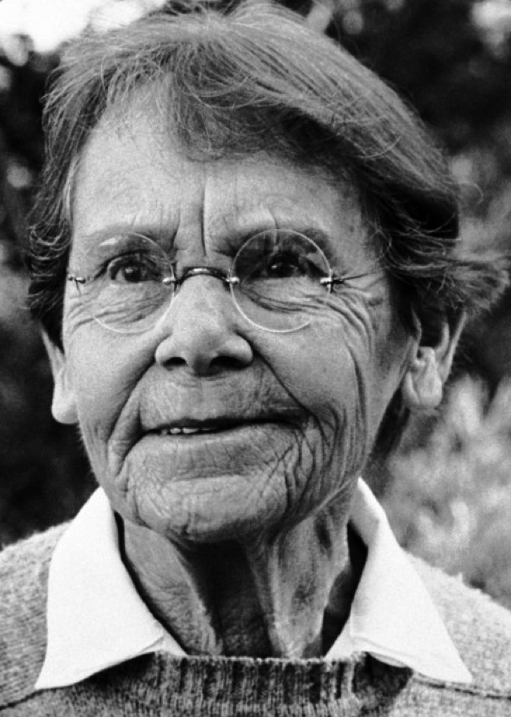

Who2 | Biographies of famous people, celebrities, historic figures, and more

Biographies

# Now with biographies of 4,578 famous people, characters and creatures.

### Explore by:

- [Born Today](https://www.who2.com/?day=today)
- [Birthplace](https://www.who2.com/famous-people-from/)
- [Birth Year](https://www.who2.com/born-in-year/)
- [Zodiac](https://www.who2.com/zodiac/)
- [Occupation](https://www.who2.com/job/)
- [Cause of Death](https://www.who2.com/died-from/)
- [Year of Death](https://www.who2.com/died-in/)
- [Lists](https://www.who2.com/common-bond/)

### Recently updated bios

### [Paula Hawkins](https://www.who2.com/bio/paula-hawkins/)

Paula Hawkins is the author of the bestselling thriller novel The Girl on the Train. Hawkins was born and raised in Zimbabwe, but has been a resident of London since …..

### [Barbara McClintock](https://www.who2.com/bio/barbara-mcclintock/)

Scientist Barbara McClintock was given the Nobel Prize in Physiology and Medicine in 1983, in recognition of her decades-long work on the genetics of maize. Educated at Cornell University, where …..

### [Geraldine Ferraro](https://www.who2.com/bio/geraldine-ferraro/)

Geraldine Ferraro was the first woman ever to run on a major party presidential ticket in the United States. A Democrat, she was Walter Mondale‘s running mate in 1984 in …..

### [Irene Ryan](https://www.who2.com/bio/irene-ryan/)

Irene Ryan became a favorite with TV viewers as Granny, the feisty, shotgun-toting old bird on the sitcom The Beverly Hillbillies. Irene Ryan already had enjoyed a long career as …..

### [Paul Hollywood](https://www.who2.com/bio/paul-hollywood/)

Celebrity baker Paul Hollywood has been a familiar face on British television since the early 2000s, but now he’s equally famous in the U.S. for his job as judge and …..

### [Who Was Born on My Birthday?](https://www.who2.com/who-was-born-on-my-birthday/)

Could it be Winston Churchill or Miley Cyrus? [Find out!](https://www.who2.com/who-was-born-on-my-birthday/)

## Search by name:

### Recent Posts

- [Apollo 11 Biographies, 50 Years After These Amazing Guys Walked on the Moon](http://www.who2.com/apollo-11-biographies-50-years-after-these-amazing-guys-walked-on-the-moon/)

July 20, 2019

- [Jeffrey Epstein Biography — New!](http://www.who2.com/jeffrey-epstein-biography-new/)

July 10, 2019

- [Mister Rogers Gets a Visit from the Wicked Witch of the West](http://www.who2.com/mister-rogers-gets-a-visit-from-the-wicked-witch-of-the-west/)

July 10, 2019

#### [More from the blog...](https://www.who2.com/blog-celebrity-biography-news/)

### Explore: Bios by Occupation

[Actor](https://www.who2.com/job/actor/)[Writer](https://www.who2.com/job/writer/)[Singer](https://www.who2.com/job/singer/)[Filmmaker](https://www.who2.com/job/filmmaker/)[Political Figure](https://www.who2.com/job/political-figure/)[TV Personality](https://www.who2.com/job/tv-personality/)[Model](https://www.who2.com/job/model/)[Comedian](https://www.who2.com/job/comedian/)[Activist](https://www.who2.com/job/activist/)[Songwriter](https://www.who2.com/job/songwriter/)[Royalty](https://www.who2.com/job/royalty/)[Business Personality](https://www.who2.com/job/business-personality/)[Poet](https://www.who2.com/job/poet/)[Artist](https://www.who2.com/job/artist/)[Rock Musician](https://www.who2.com/job/rock-musician/)[Political Leader](https://www.who2.com/job/political-leader/)[U.S. Senator](https://www.who2.com/job/us-senator/)[Religious Figure](https://www.who2.com/job/religious-figure/)[Composer](https://www.who2.com/job/composer/)[Inventor](https://www.who2.com/job/inventor/)[Philosopher](https://www.who2.com/job/philosopher/)

[Browse all jobs »](https://www.who2.com/job/)

### Trending Today

- [Elisha Cuthbert](http://www.who2.com/bio/elisha-cuthbert/elisha-cuthbert-21/)  (Photo)
- [Vladimir I. Lenin](http://www.who2.com/bio/vladimir-i-lenin/vladimir-i-lenin-2/)  (Photo)
- [Frank Oz](http://www.who2.com/bio/frank-oz/frank-oz-3/)  (Photo)
- [Diane Lane](http://www.who2.com/bio/diane-lane/diane-lane-5/)  (Photo)
- [Diane Lane](http://www.who2.com/bio/diane-lane/diane-lane-25/)  (Photo)

[More...](https://www.who2.com/todays-most-popular)